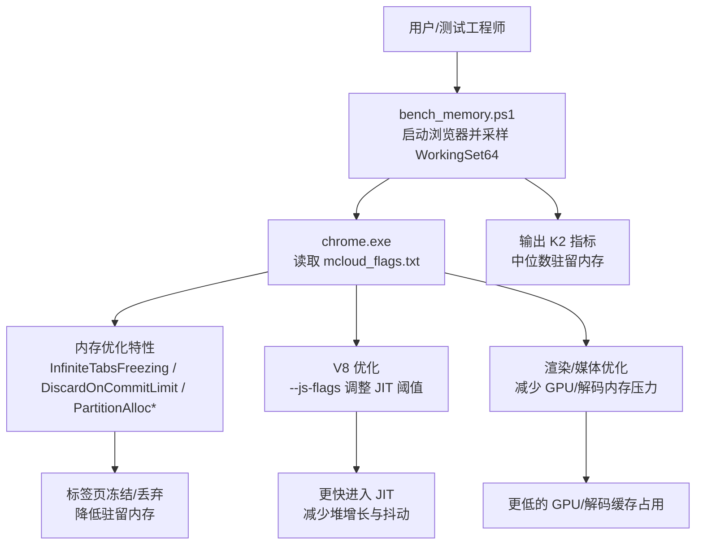
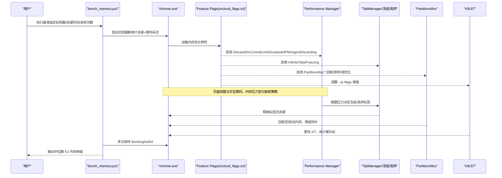
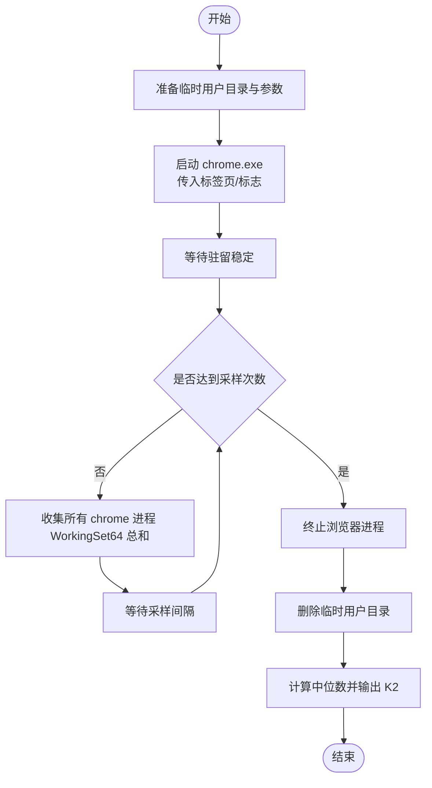
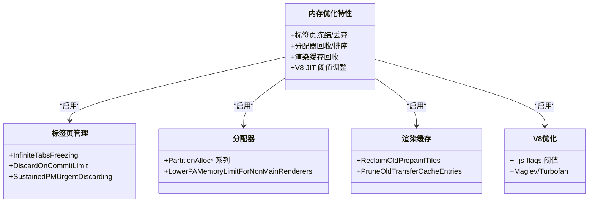
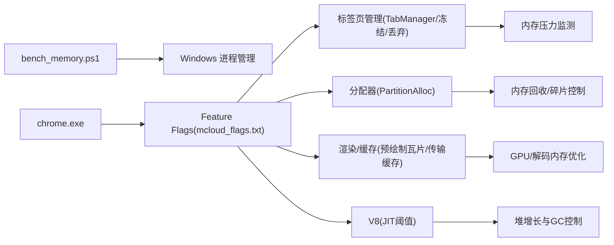

# 内存性能诊断

本文引用的文件

- [bench_memory.ps1](https://github.com/Mcloud136/Mcloud-Browser/blob/main/benchmark/bench_memory.ps1)
- [mcloud_flags.txt](https://github.com/Mcloud136/Mcloud-Browser/blob/main/mcloud_flags.txt)
- [memory-Enable-the-tab-discards-feature.patch](https://github.com/Mcloud136/Mcloud-Browser/blob/main/infra/Flatpak/com.mcloud.browser/patches/chromium/memory-Enable-the-tab-discards-feature.patch)
- [settings_strings.grdp](https://github.com/Mcloud136/Mcloud-Browser/blob/main/src/chrome/app/settings_strings.grdp)
- [2026-06-19-performance-optimization-design.md](https://github.com/Mcloud136/Mcloud-Browser/blob/main/docs/superpowers/specs/2026-06-19-performance-optimization-design.md)
- [2026-06-19-performance-optimization.md](https://github.com/Mcloud136/Mcloud-Browser/blob/main/docs/superpowers/plans/2026-06-19-performance-optimization.md)
- [M151-benchmark.md](https://github.com/Mcloud136/Mcloud-Browser/blob/main/docs/dev-logs/M151-benchmark.md)
- [M151-opt-benchmark.md](https://github.com/Mcloud136/Mcloud-Browser/blob/main/docs/dev-logs/M151-opt-benchmark.md)
- [BUILD.gn (content)](https://github.com/Mcloud136/Mcloud-Browser/blob/main/src/content/browser/BUILD.gn)

## 目录
1. [简介](#简介)
2. [项目结构](#项目结构)
3. [核心组件](#核心组件)
4. [架构总览](#架构总览)
5. [详细组件分析](#详细组件分析)
6. [依赖关系分析](#依赖关系分析)
7. [性能考量](#性能考量)
8. [故障排查指南](#故障排查指南)
9. [结论](#结论)
10. [附录](#附录)

## 简介
本指南面向 MCloud Browser 的内存性能诊断与优化，聚焦以下目标：
- 如何检测与定位内存泄漏、内存占用过高等问题
- 如何使用基准工具 bench_memory.ps1 进行内存使用监控、泄漏检测与内存分析
- 解释内存管理的核心机制：垃圾回收、标签页隔离、内存池管理、标签页冻结等
- 提供可操作的内存优化策略：标签页冻结、内存限制、资源释放等
- 集成 Chrome DevTools Memory 面板、任务管理器、性能分析器等工具的实践方法

## 项目结构
与内存性能相关的关键位置：
- 基准脚本：benchmark/bench_memory.ps1（Windows 下采集多进程工作集）
- 运行时标志：mcloud_flags.txt（启用内存优化特性、V8 参数、渲染与媒体优化）
- 标签页丢弃补丁：infra/.../memory-Enable-the-tab-discards-feature.patch（Linux/ChromeOS 上启用基于内存压力的标签页丢弃）
- 设置文案与行为：src/chrome/app/settings_strings.grdp（内存节省模式、标签页丢弃策略 UI 文案）
- 性能设计与计划：docs/superpowers/*（内存优化标志清单与实施步骤）
- 构建与内容层：src/content/browser/BUILD.gn（GPU/内存相关模块编译开关）
- 基准报告：docs/dev-logs/*（K2 内存峰值基线与优化对比）

图表来源
- [bench_memory.ps1:1-78](https://github.com/Mcloud136/Mcloud-Browser/blob/main/benchmark/bench_memory.ps1#L1-L78)
- [mcloud_flags.txt:27-57](https://github.com/Mcloud136/Mcloud-Browser/blob/main/mcloud_flags.txt#L27-L57)
- [2026-06-19-performance-optimization-design.md:78-98](https://github.com/Mcloud136/Mcloud-Browser/blob/main/docs/superpowers/specs/2026-06-19-performance-optimization-design.md#L78-L98)

章节来源
- [bench_memory.ps1:1-78](https://github.com/Mcloud136/Mcloud-Browser/blob/main/benchmark/bench_memory.ps1#L1-L78)
- [mcloud_flags.txt:1-120](https://github.com/Mcloud136/Mcloud-Browser/blob/main/mcloud_flags.txt#L1-L120)
- [2026-06-19-performance-optimization-design.md:78-98](https://github.com/Mcloud136/Mcloud-Browser/blob/main/docs/superpowers/specs/2026-06-19-performance-optimization-design.md#L78-L98)

## 核心组件
- 基准工具 bench_memory.ps1
  - 功能：以全新用户数据目录启动固定数量标签页，等待稳定后对全部 chrome 子进程的 WorkingSet64 求和，多次采样取中位数作为 K2 内存峰值。
  - 关键流程：创建临时用户目录 → 启动浏览器 → 等待驻留 → 循环采样 → 汇总进程数与工作集 → 输出中位数 → 清理环境。
- 运行时标志 mcloud_flags.txt
  - 内存优化：InfiniteTabsFreezing、DiscardOnCommitLimit、SustainedPMUrgentDiscarding、PartitionAlloc* 系列、LowerPAMemoryLimitForNonMainRenderers、ReclaimOldPrepaintTiles、PruneOldTransferCacheEntries。
  - V8 优化：--js-flags 调整 Maglev/Turbofan 阈值，加速 JIT 并减少堆抖动。
  - 渲染/媒体：禁用 D3D12VideoDecoder（规避特定核显绿屏），启用 HEVC/AV1 硬件解码与专用媒体线程，降低解码内存压力。
- 标签页丢弃机制
  - Linux/ChromeOS 通过补丁启用 TabManager 在内存压力下自动丢弃标签页；桌面端主要依赖 Performance Manager 与 InfiniteTabsFreezing。
- 设置界面与策略
  - 内存节省模式提供“保守/平衡/激进”三种强度，支持“始终保持活跃站点”例外列表，便于控制标签页冻结/丢弃策略。

章节来源
- [bench_memory.ps1:1-78](https://github.com/Mcloud136/Mcloud-Browser/blob/main/benchmark/bench_memory.ps1#L1-L78)
- [mcloud_flags.txt:27-57](https://github.com/Mcloud136/Mcloud-Browser/blob/main/mcloud_flags.txt#L27-L57)
- [memory-Enable-the-tab-discards-feature.patch:1-98](https://github.com/Mcloud136/Mcloud-Browser/blob/main/infra/Flatpak/com.mcloud.browser/patches/chromium/memory-Enable-the-tab-discards-feature.patch#L1-L98)
- [settings_strings.grdp:1060-1146](https://github.com/Mcloud136/Mcloud-Browser/blob/main/src/chrome/app/settings_strings.grdp#L1060-L1146)

## 架构总览
MCloud Browser 的内存性能由“运行期标志 + 内核机制 + 基准验证”共同构成：
- 运行期标志驱动：mcloud_flags.txt 注入大量内存优化特性与 V8 参数，影响分配器、渲染器、媒体管线与调度策略。
- 内核机制协同：标签页冻结/丢弃、PartitionAlloc 内存回收、非主框架渲染器内存限制、预绘制瓦片回收、传输缓存修剪等。
- 基准闭环验证：bench_memory.ps1 量化 K2 指标，结合 docs/dev-logs/* 记录不同版本/配置的内存表现，指导持续优化。

图表来源
- [bench_memory.ps1:1-78](https://github.com/Mcloud136/Mcloud-Browser/blob/main/benchmark/bench_memory.ps1#L1-L78)
- [mcloud_flags.txt:27-57](https://github.com/Mcloud136/Mcloud-Browser/blob/main/mcloud_flags.txt#L27-L57)
- [2026-06-19-performance-optimization-design.md:78-98](https://github.com/Mcloud136/Mcloud-Browser/blob/main/docs/superpowers/specs/2026-06-19-performance-optimization-design.md#L78-L98)

## 详细组件分析

### 基准工具 bench_memory.ps1
- 作用：标准化测量多标签场景下的驻留内存（WorkingSet64），用于回归与优化验证。
- 关键参数：
  - ChromeExe：浏览器路径
  - Tabs：标签页数（默认 50）
  - SettleSeconds：驻留等待时间（默认 90）
  - Samples：采样次数（默认 5）
  - SampleInterval：采样间隔（秒）
  - UrlsFile：可选 URL 列表（每行一个），否则使用 about:blank
  - ExtraFlags：附加命令行标志
- 工作流程：
  - 创建临时用户数据目录，避免干扰
  - 启动浏览器并打开目标标签页
  - 等待稳定后，按进程名聚合所有 chrome 子进程的 WorkingSet64
  - 多次采样计算中位数，输出结果并清理环境

图表来源
- [bench_memory.ps1:1-78](https://github.com/Mcloud136/Mcloud-Browser/blob/main/benchmark/bench_memory.ps1#L1-L78)

章节来源
- [bench_memory.ps1:1-78](https://github.com/Mcloud136/Mcloud-Browser/blob/main/benchmark/bench_memory.ps1#L1-L78)

### 内存优化标志与机制
- 标签页冻结与丢弃
  - InfiniteTabsFreezing：无限标签冻结，降低后台标签内存占用
  - InfiniteTabsFreezingOnMemoryPressure：内存压力下主动冻结
  - DiscardOnCommitLimit：可用内存低于阈值时丢弃标签页
  - SustainedPMUrgentDiscarding：持续压力下的紧急丢弃
  - 补丁 memory-Enable-the-tab-discards-feature.patch：在 Linux/ChromeOS 启用基于内存压力的标签页丢弃
- 分配器与内存池
  - PartitionAllocEventuallyZeroFreedMemory：尽快归还零内存
  - PartitionAllocMemoryReclaimer：主动回收空闲内存
  - PartitionAllocSortActiveSlotSpans：PurgeMemory 时排序活跃槽 span，减少碎片
  - PartitionAllocUsePriorityInheritanceLocks：优先级继承锁，减少锁竞争
  - LowerPAMemoryLimitForNonMainRenderers：非主框架渲染器更低内存上限
- 渲染与缓存
  - ReclaimOldPrepaintTiles：30 秒后回收预绘制瓦片
  - PruneOldTransferCacheEntries：清理旧传输缓存条目，降低 GPU 内存
- V8 优化
  - --js-flags 调整 Maglev/Turbofan 阈值，更快进入 JIT，减少堆抖动与频繁 GC

图表来源
- [mcloud_flags.txt:27-57](https://github.com/Mcloud136/Mcloud-Browser/blob/main/mcloud_flags.txt#L27-L57)
- [2026-06-19-performance-optimization-design.md:78-98](https://github.com/Mcloud136/Mcloud-Browser/blob/main/docs/superpowers/specs/2026-06-19-performance-optimization-design.md#L78-L98)
- [memory-Enable-the-tab-discards-feature.patch:1-98](https://github.com/Mcloud136/Mcloud-Browser/blob/main/infra/Flatpak/com.mcloud.browser/patches/chromium/memory-Enable-the-tab-discards-feature.patch#L1-L98)

章节来源
- [mcloud_flags.txt:27-57](https://github.com/Mcloud136/Mcloud-Browser/blob/main/mcloud_flags.txt#L27-L57)
- [2026-06-19-performance-optimization-design.md:78-98](https://github.com/Mcloud136/Mcloud-Browser/blob/main/docs/superpowers/specs/2026-06-19-performance-optimization-design.md#L78-L98)
- [memory-Enable-the-tab-discards-feature.patch:1-98](https://github.com/Mcloud136/Mcloud-Browser/blob/main/infra/Flatpak/com.mcloud.browser/patches/chromium/memory-Enable-the-tab-discards-feature.patch#L1-L98)

### 设置界面与用户可控策略
- 内存节省模式提供三种强度：保守、平衡（推荐）、激进
- 支持“始终保持这些站点活跃”例外列表，避免关键站点被冻结/丢弃
- 这些选项直接影响标签页生命周期与内存占用，适合在真实场景中调优

章节来源
- [settings_strings.grdp:1060-1146](https://github.com/Mcloud136/Mcloud-Browser/blob/main/src/chrome/app/settings_strings.grdp#L1060-L1146)

### 基准报告与对比
- M151 基线：K2 内存峰值约 2646 MB（50 标签，驻留 90s）
- M151-opt：新增 17 项运行时 feature + V8 flag 修正，K2 约 2696 MB（+50 MB，+1.9%），但导航响应与预载收益需结合实际站点评估
- 预载收益验证：真实站点 50 标签场景下，部分预载特性带来内存代价，可通过关闭 MultipleSpareRPHs/LoadingPredictorPrefetch/NewTabPageTriggerForPrerender2 降低约 125 MB

章节来源
- [M151-benchmark.md:1-30](https://github.com/Mcloud136/Mcloud-Browser/blob/main/docs/dev-logs/M151-benchmark.md#L1-L30)
- [M151-opt-benchmark.md:1-32](https://github.com/Mcloud136/Mcloud-Browser/blob/main/docs/dev-logs/M151-opt-benchmark.md#L1-L32)

## 依赖关系分析
- 基准脚本依赖 Windows 进程管理与 PowerShell 能力
- 浏览器运行期依赖 Feature Flags 与 Content/GPU 模块编译开关
- 标签页丢弃在 Linux/ChromeOS 通过补丁启用，桌面端依赖 Performance Manager
- 内存优化效果受 V8、PartitionAlloc、渲染管线与媒体解码共同影响

图表来源
- [bench_memory.ps1:1-78](https://github.com/Mcloud136/Mcloud-Browser/blob/main/benchmark/bench_memory.ps1#L1-L78)
- [mcloud_flags.txt:27-57](https://github.com/Mcloud136/Mcloud-Browser/blob/main/mcloud_flags.txt#L27-L57)
- [2026-06-19-performance-optimization-design.md:78-98](https://github.com/Mcloud136/Mcloud-Browser/blob/main/docs/superpowers/specs/2026-06-19-performance-optimization-design.md#L78-L98)

章节来源
- [bench_memory.ps1:1-78](https://github.com/Mcloud136/Mcloud-Browser/blob/main/benchmark/bench_memory.ps1#L1-L78)
- [mcloud_flags.txt:27-57](https://github.com/Mcloud136/Mcloud-Browser/blob/main/mcloud_flags.txt#L27-L57)
- [2026-06-19-performance-optimization-design.md:78-98](https://github.com/Mcloud136/Mcloud-Browser/blob/main/docs/superpowers/specs/2026-06-19-performance-optimization-design.md#L78-L98)

## 性能考量
- 标签页冻结/丢弃：在高并发标签场景下显著降低驻留内存，但可能影响恢复速度；建议结合业务站点特性配置例外列表
- 分配器优化：PartitionAlloc 系列提升回收效率与降低碎片，适合长期运行的浏览器进程
- V8 阈值调整：更快的 JIT 可减少堆抖动，但需权衡首帧延迟与热路径性能
- 渲染/媒体：预绘制瓦片与传输缓存回收可降低 GPU 内存；针对特定 GPU 驱动缺陷（如 D3D12VideoDecoder 绿屏）可回退到 D3D11
- 基准稳定性：K2 指标应多次采样取中位数，避免瞬时波动误导判断

[本节为通用性能讨论，不直接分析具体文件]

## 故障排查指南
- 内存泄漏检测
  - 使用 Chrome DevTools Memory 面板：拍摄堆快照，比较差异，定位未释放对象
  - 使用任务管理器：观察 chrome.exe 及其子进程 WorkingSet64 趋势，识别异常增长
  - 使用性能分析器：录制 CPU/JS 调用栈，结合内存快照定位热点
- 基准工具辅助
  - 使用 bench_memory.ps1 复现实验场景，确认优化前后 K2 变化
  - 通过 UrlsFile 引入真实站点，评估预载/网络缓存对内存的影响
- 标志与补丁
  - 检查 mcloud_flags.txt 是否正确注入（参考 verify_builtin_flags.ps1 子进程命令行探测）
  - Linux/ChromeOS 确认补丁生效（TabManager 内存压力监听与丢弃逻辑）
- 常见问题
  - 预载特性导致内存上升：可关闭 MultipleSpareRPHs/LoadingPredictorPrefetch/NewTabPageTriggerForPrerender2
  - 视频解码绿屏：禁用 D3D12VideoDecoder，回退至 D3D11VideoDecoder

章节来源
- [bench_memory.ps1:1-78](https://github.com/Mcloud136/Mcloud-Browser/blob/main/benchmark/bench_memory.ps1#L1-L78)
- [mcloud_flags.txt:83-88](https://github.com/Mcloud136/Mcloud-Browser/blob/main/mcloud_flags.txt#L83-L88)
- [memory-Enable-the-tab-discards-feature.patch:1-98](https://github.com/Mcloud136/Mcloud-Browser/blob/main/infra/Flatpak/com.mcloud.browser/patches/chromium/memory-Enable-the-tab-discards-feature.patch#L1-L98)

## 结论
- MCloud Browser 通过丰富的运行时标志与内核机制，实现了标签页冻结/丢弃、分配器优化、渲染缓存回收与 V8 调优，有效降低内存占用并提升稳定性
- bench_memory.ps1 提供了标准化的 K2 指标采集方法，配合 docs/dev-logs/* 的基准报告，形成闭环优化流程
- 实际优化需结合业务场景与站点特性，合理配置例外列表与预载策略，避免不必要的内存代价
- 建议定期运行基准与内存分析，持续跟踪优化效果并及时调整标志组合

[本节为总结性内容，不直接分析具体文件]

## 附录
- 常用命令与参数
  - bench_memory.ps1 -ChromeExe <路径> -Tabs 50 -SettleSeconds 90 -Samples 5 -UrlsFile <URL列表> -ExtraFlags "<标志>"
  - 在 mcloud_flags.txt 中启用/禁用内存优化特性，注意注释与分组
- 参考文档
  - 性能优化设计：docs/superpowers/specs/2026-06-19-performance-optimization-design.md
  - 性能优化实施计划：docs/superpowers/plans/2026-06-19-performance-optimization.md
  - 基准报告：docs/dev-logs/M151-benchmark.md、docs/dev-logs/M151-opt-benchmark.md

[本节为补充信息，不直接分析具体文件]