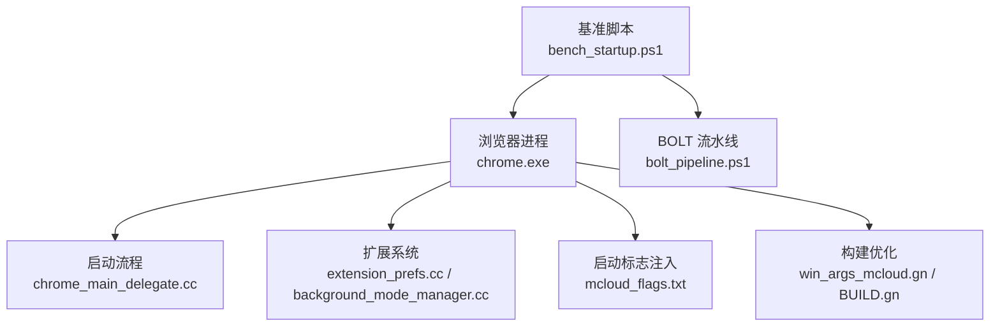
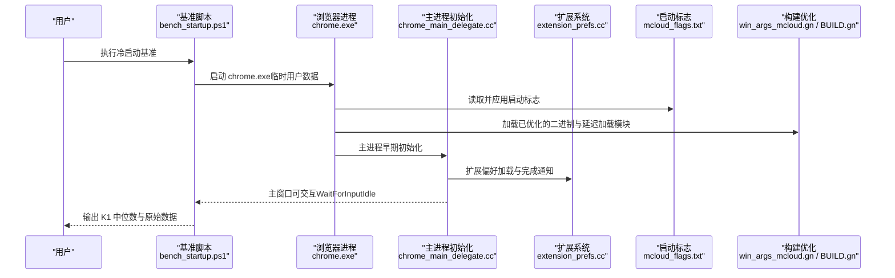
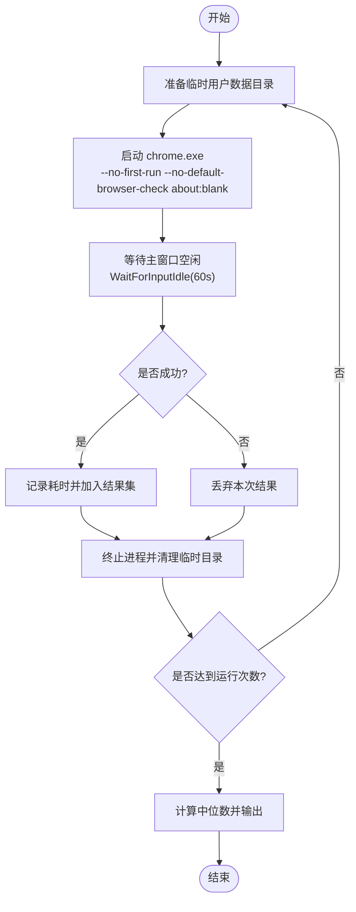
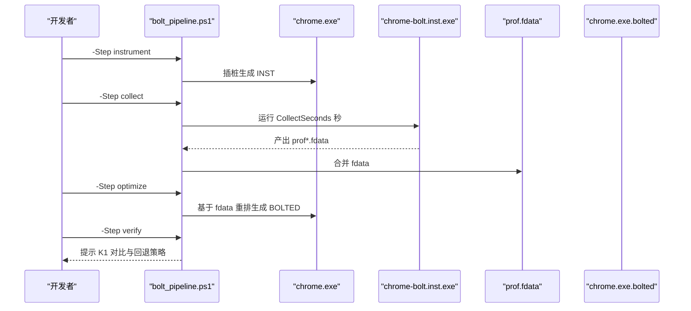
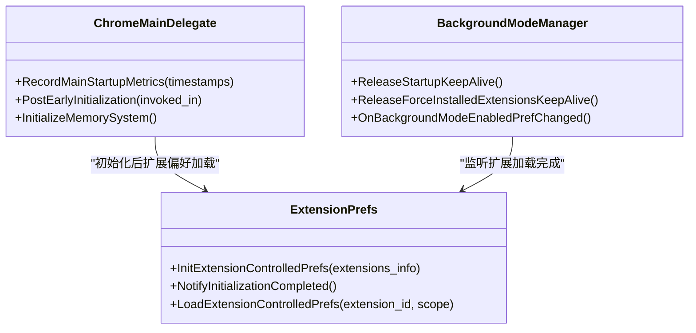
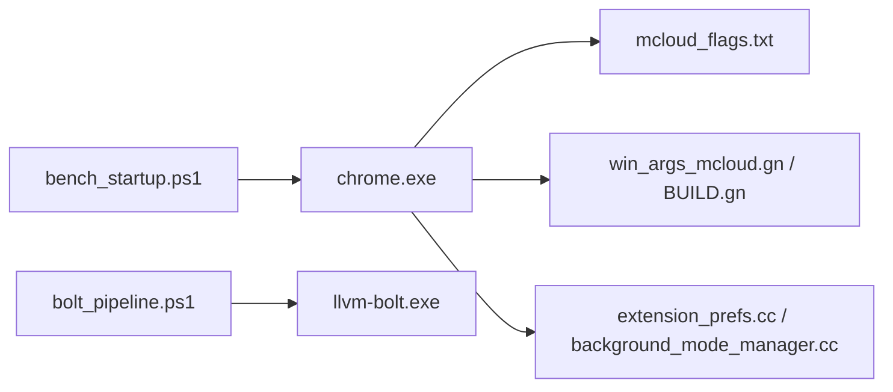

# 启动性能诊断

本文引用的文件

- [bench_startup.ps1](https://github.com/Mcloud136/Mcloud-Browser/blob/main/benchmark/bench_startup.ps1)
- [bolt_pipeline.ps1](https://github.com/Mcloud136/Mcloud-Browser/blob/main/benchmark/tools/bolt_pipeline.ps1)
- [mcloud_flags.txt](https://github.com/Mcloud136/Mcloud-Browser/blob/main/mcloud_flags.txt)
- [README.md](https://github.com/Mcloud136/Mcloud-Browser/blob/main/README.md)
- [win_args_mcloud.gn](https://github.com/Mcloud136/Mcloud-Browser/blob/main/win_args_mcloud.gn)
- [chrome_main_delegate.cc](https://github.com/Mcloud136/Mcloud-Browser/blob/main/src/chrome/app/chrome_main_delegate.cc)
- [extension_prefs.cc](https://github.com/Mcloud136/Mcloud-Browser/blob/main/src/extensions/browser/extension_prefs.cc)
- [background_mode_manager.cc](https://github.com/Mcloud136/Mcloud-Browser/blob/main/src/chrome/browser/background/extensions/background_mode_manager.cc)
- [chrome_constants.cc](https://github.com/Mcloud136/Mcloud-Browser/blob/main/src/chrome/common/chrome_constants.cc)
- [BUILD.gn](https://github.com/Mcloud136/Mcloud-Browser/blob/main/src/chrome/BUILD.gn)
- [M150-benchmark.md](https://github.com/Mcloud136/Mcloud-Browser/blob/main/docs/dev-logs/M150-benchmark.md)
- [M151-opt-benchmark.md](https://github.com/Mcloud136/Mcloud-Browser/blob/main/docs/dev-logs/M151-opt-benchmark.md)
- [benchmark-template.md](https://github.com/Mcloud136/Mcloud-Browser/blob/main/docs/dev-logs/benchmark-template.md)

## 目录
1. [简介](#简介)
2. [项目结构](#项目结构)
3. [核心组件](#核心组件)
4. [架构总览](#架构总览)
5. [详细组件分析](#详细组件分析)
6. [依赖关系分析](#依赖关系分析)
7. [性能考量](#性能考量)
8. [故障排查指南](#故障排查指南)
9. [结论](#结论)
10. [附录](#附录)

## 简介
本指南面向 MCloud Browser 的启动性能诊断与优化，覆盖冷启动、热启动与恢复启动三类场景的测量方法、关键影响因素、基准工具使用与结果解读，以及可落地的优化策略（启动标志优化、模块预加载、延迟加载等）。文档以仓库内现有脚本与配置为依据，提供从“如何测”到“如何改”的闭环方案。

## 项目结构
围绕启动性能的关键资产分布如下：
- 基准测试与工具
  - 冷启动基准：benchmark/bench_startup.ps1
  - BOLT 后链接流水线：benchmark/tools/bolt_pipeline.ps1
- 启动优化标志与内置参数
  - mcloud_flags.txt（启动时自动注入的性能相关 flags）
  - README.md（启动参数与推荐 chrome://flags）
- 构建与编译期优化
  - win_args_mcloud.gn（PGO、优化等级、BOLT/Polly 开关）
  - src/chrome/BUILD.gn（Windows 延迟加载、子系统设置）
- 启动流程与扩展加载
  - src/chrome/app/chrome_main_delegate.cc（主进程初始化、启动指标记录）
  - src/extensions/browser/extension_prefs.cc（扩展偏好加载与完成通知）
  - src/chrome/browser/background/extensions/background_mode_manager.cc（后台模式与扩展加载生命周期）
  - src/chrome/common/chrome_constants.cc（用户数据目录与持久化文件命名）
- 历史基准与模板
  - docs/dev-logs/M150-benchmark.md、M151-opt-benchmark.md（基线与优化对比）
  - docs/dev-logs/benchmark-template.md（报告模板）

**图表来源**
- [bench_startup.ps1:1-70](https://github.com/Mcloud136/Mcloud-Browser/blob/main/benchmark/bench_startup.ps1#L1-L70)
- [bolt_pipeline.ps1:1-108](https://github.com/Mcloud136/Mcloud-Browser/blob/main/benchmark/tools/bolt_pipeline.ps1#L1-L108)
- [chrome_main_delegate.cc:782-817](https://github.com/Mcloud136/Mcloud-Browser/blob/main/src/chrome/app/chrome_main_delegate.cc#L782-L817)
- [extension_prefs.cc:2100-2116](https://github.com/Mcloud136/Mcloud-Browser/blob/main/src/extensions/browser/extension_prefs.cc#L2100-L2116)
- [background_mode_manager.cc:465-505](https://github.com/Mcloud136/Mcloud-Browser/blob/main/src/chrome/browser/background/extensions/background_mode_manager.cc#L465-L505)
- [mcloud_flags.txt:1-81](https://github.com/Mcloud136/Mcloud-Browser/blob/main/mcloud_flags.txt#L1-L81)
- [win_args_mcloud.gn:38-59](https://github.com/Mcloud136/Mcloud-Browser/blob/main/win_args_mcloud.gn#L38-L59)
- [BUILD.gn:244-278](https://github.com/Mcloud136/Mcloud-Browser/blob/main/src/chrome/BUILD.gn#L244-L278)

**章节来源**
- [bench_startup.ps1:1-70](https://github.com/Mcloud136/Mcloud-Browser/blob/main/benchmark/bench_startup.ps1#L1-L70)
- [bolt_pipeline.ps1:1-108](https://github.com/Mcloud136/Mcloud-Browser/blob/main/benchmark/tools/bolt_pipeline.ps1#L1-L108)
- [mcloud_flags.txt:1-81](https://github.com/Mcloud136/Mcloud-Browser/blob/main/mcloud_flags.txt#L1-L81)
- [win_args_mcloud.gn:38-59](https://github.com/Mcloud136/Mcloud-Browser/blob/main/win_args_mcloud.gn#L38-L59)
- [BUILD.gn:244-278](https://github.com/Mcloud136/Mcloud-Browser/blob/main/src/chrome/BUILD.gn#L244-L278)
- [chrome_main_delegate.cc:782-817](https://github.com/Mcloud136/Mcloud-Browser/blob/main/src/chrome/app/chrome_main_delegate.cc#L782-L817)
- [extension_prefs.cc:2100-2116](https://github.com/Mcloud136/Mcloud-Browser/blob/main/src/extensions/browser/extension_prefs.cc#L2100-L2116)
- [background_mode_manager.cc:465-505](https://github.com/Mcloud136/Mcloud-Browser/blob/main/src/chrome/browser/background/extensions/background_mode_manager.cc#L465-L505)
- [chrome_constants.cc:117-141](https://github.com/Mcloud136/Mcloud-Browser/blob/main/src/chrome/common/chrome_constants.cc#L117-L141)

## 核心组件
- 冷启动基准工具（K1）
  - 通过临时用户数据目录隔离每次运行，启动 chrome.exe 并等待主窗口进入空闲状态作为“首屏可交互”代理指标，多次运行取中位数。
- BOLT 后链接优化流水线
  - 对 chrome.exe 插桩、采集真实负载 profile、重排二进制布局，再经 K1 验证提升效果。
- 启动标志注入
  - 通过 mcloud_flags.txt 在启动时注入大量性能相关特性开关，涵盖冷启动、渲染、内存、网络、媒体、V8 等维度。
- 构建期优化
  - PGO、全量优化等级、延迟加载等构建选项影响启动路径与指令分布。
- 启动流程与扩展加载
  - 主进程早期初始化、扩展偏好加载完成回调、后台模式下的扩展生命周期管理。

**章节来源**
- [bench_startup.ps1:12-70](https://github.com/Mcloud136/Mcloud-Browser/blob/main/benchmark/bench_startup.ps1#L12-L70)
- [bolt_pipeline.ps1:19-108](https://github.com/Mcloud136/Mcloud-Browser/blob/main/benchmark/tools/bolt_pipeline.ps1#L19-L108)
- [mcloud_flags.txt:8-81](https://github.com/Mcloud136/Mcloud-Browser/blob/main/mcloud_flags.txt#L8-L81)
- [win_args_mcloud.gn:38-59](https://github.com/Mcloud136/Mcloud-Browser/blob/main/win_args_mcloud.gn#L38-L59)
- [chrome_main_delegate.cc:782-817](https://github.com/Mcloud136/Mcloud-Browser/blob/main/src/chrome/app/chrome_main_delegate.cc#L782-L817)
- [extension_prefs.cc:2100-2116](https://github.com/Mcloud136/Mcloud-Browser/blob/main/src/extensions/browser/extension_prefs.cc#L2100-L2116)
- [background_mode_manager.cc:465-505](https://github.com/Mcloud136/Mcloud-Browser/blob/main/src/chrome/browser/background/extensions/background_mode_manager.cc#L465-L505)

## 架构总览
下图展示启动性能诊断的整体流程：基准脚本驱动浏览器启动，启动过程中执行主进程初始化与扩展加载，同时受启动标志与构建优化影响；BOLT 流水线可对最终产物进行后链接优化并以 K1 验证收益。

**图表来源**
- [bench_startup.ps1:32-48](https://github.com/Mcloud136/Mcloud-Browser/blob/main/benchmark/bench_startup.ps1#L32-L48)
- [chrome_main_delegate.cc:782-817](https://github.com/Mcloud136/Mcloud-Browser/blob/main/src/chrome/app/chrome_main_delegate.cc#L782-L817)
- [extension_prefs.cc:2100-2116](https://github.com/Mcloud136/Mcloud-Browser/blob/main/src/extensions/browser/extension_prefs.cc#L2100-L2116)
- [mcloud_flags.txt:8-81](https://github.com/Mcloud136/Mcloud-Browser/blob/main/mcloud_flags.txt#L8-L81)
- [win_args_mcloud.gn:38-59](https://github.com/Mcloud136/Mcloud-Browser/blob/main/win_args_mcloud.gn#L38-L59)
- [BUILD.gn:244-278](https://github.com/Mcloud136/Mcloud-Browser/blob/main/src/chrome/BUILD.gn#L244-L278)

## 详细组件分析

### 冷启动基准（K1）使用方法与结果解读
- 参数说明
  - ChromeExe：指定待测 chrome.exe 路径。
  - Runs：运行次数，默认 5 次，取中位数。
- 执行流程
  - 为每次运行创建独立临时用户数据目录，避免缓存干扰。
  - 启动 chrome.exe 并传入 no-first-run、no-default-browser-check 与 about:blank。
  - 使用 WaitForInputIdle 等待主窗口进入空闲状态，记录耗时。
  - 清理进程与临时目录，间隔休眠使系统回到冷态。
- 结果解读
  - 输出各次耗时与中位数，建议结合环境信息归档至 docs/dev-logs/。
  - 历史基线参考：M150 与 M151 的 K1 对比与波动说明。

**图表来源**
- [bench_startup.ps1:32-58](https://github.com/Mcloud136/Mcloud-Browser/blob/main/benchmark/bench_startup.ps1#L32-L58)
- [bench_startup.ps1:65-69](https://github.com/Mcloud136/Mcloud-Browser/blob/main/benchmark/bench_startup.ps1#L65-L69)

**章节来源**
- [bench_startup.ps1:12-70](https://github.com/Mcloud136/Mcloud-Browser/blob/main/benchmark/bench_startup.ps1#L12-L70)
- [M150-benchmark.md:28-49](https://github.com/Mcloud136/Mcloud-Browser/blob/main/docs/dev-logs/M150-benchmark.md#L28-L49)

### BOLT 后链接优化流水线
- 前置条件
  - llvm-bolt.exe / merge-fdata.exe 可用。
  - use_bolt=true 的构建产物（保留重定位信息）。
- 步骤
  - instrument：对 chrome.exe 插桩生成 chrome-bolt.inst.exe。
  - collect：运行插桩版采集 profile（约 120 秒），合并多份 fdata。
  - optimize：依据 fdata 重排二进制布局生成 chrome.exe.bolted。
  - verify：用 bench_startup.ps1 对比 K1 冷启动，通过后替换正式产物并归档 fdata。
- 注意事项
  - Windows 无 perf，采用 instrumentation 采集。
  - 若未就绪，脚本会明确报错并指引修复。

**图表来源**
- [bolt_pipeline.ps1:19-108](https://github.com/Mcloud136/Mcloud-Browser/blob/main/benchmark/tools/bolt_pipeline.ps1#L19-L108)

**章节来源**
- [bolt_pipeline.ps1:1-108](https://github.com/Mcloud136/Mcloud-Browser/blob/main/benchmark/tools/bolt_pipeline.ps1#L1-L108)

### 启动标志与优化项（mcloud_flags.txt）
- 冷启动优化
  - 备用渲染器、浏览器进程优先级提升、GPU 通道提前发送、推迟推测性 RFH 创建、初始 WebUI 去冗余、短暂保活策略等。
- 视频与渲染优化
  - 后台媒体不暂停、GPU 光栅化、Canvas OOP 光栅化、滚动调度改进、任务抑制策略、帧率节流、DirectComposition 等。
- 内存优化
  - 无限标签冻结、内存压力冻结、PartitionAlloc 回收与排序、提交限制丢弃、紧急丢弃、非主渲染器内存限制、旧预绘瓦片回收、传输缓存修剪等。
- 网络优化
  - 书签触发预取、新标签页触发预取、后退前进缓存、Cache-Control NoStore 进入缓存、异步 DNS、Early Data 等。
- 图像与推测规则
  - AVIF、SpeculationRules。
- V8 JavaScript 优化
  - 降低 Maglev/Turbofan 阈值、OSR-from-Maglev、Sparkplug+ 等。
- 启动预载/预热
  - 新标签页与书签栏合成器预热、重定向目标预连接、顶部 Chrome WebUI 预加载、书签预连接、线程化预加载扫描、离线代码缓存消费、内联脚本缓存、系统字体预加载、HTTP 磁盘缓存预热、LCPP 自动预连接 LCP 源等。
- 媒体缓冲优化
  - MSE 对象 URL 撤销、硬件解码缓冲减少、JS 执行时 BackForwardCache DWC 等。

注意：部分高内存代价的预载项已在注释中标注移除或谨慎评估，需结合真实站点内存与导航收益取舍。

**章节来源**
- [mcloud_flags.txt:8-81](https://github.com/Mcloud136/Mcloud-Browser/blob/main/mcloud_flags.txt#L8-L81)
- [README.md:302-351](https://github.com/Mcloud136/Mcloud-Browser/blob/main/README.md#L302-L351)

### 构建期优化与延迟加载
- 全量优化与 PGO
  - is_full_optimization_build=true，PGO 阶段 2，profdata 与内核版本严格匹配。
- Polly/BOLT 开关
  - 当前 use_polly=false、use_bolt=false，需在工具链就绪后启用。
- Windows 延迟加载
  - 启用 delayloads 与子 DLL 延迟加载，有助于缩短主进程启动时间。
- 子系统与栈大小
  - 设置 windowed 子系统，x86 下调整初始栈大小以降低内存占用。

**章节来源**
- [win_args_mcloud.gn:38-59](https://github.com/Mcloud136/Mcloud-Browser/blob/main/win_args_mcloud.gn#L38-L59)
- [BUILD.gn:244-278](https://github.com/Mcloud136/Mcloud-Browser/blob/main/src/chrome/BUILD.gn#L244-L278)

### 启动流程与扩展加载关键点
- 主进程早期初始化
  - 记录主进程启动指标，处理进程单例与会合逻辑。
- 扩展偏好加载
  - 加载扩展控制偏好，完成后通知观察者，确保其他子系统感知扩展加载状态。
- 后台模式与扩展生命周期
  - 扩展加载完成后释放启动保活，跟踪强制安装扩展就绪状态，管理后台模式启停。

**图表来源**
- [chrome_main_delegate.cc:782-817](https://github.com/Mcloud136/Mcloud-Browser/blob/main/src/chrome/app/chrome_main_delegate.cc#L782-L817)
- [extension_prefs.cc:2100-2116](https://github.com/Mcloud136/Mcloud-Browser/blob/main/src/extensions/browser/extension_prefs.cc#L2100-L2116)
- [background_mode_manager.cc:465-505](https://github.com/Mcloud136/Mcloud-Browser/blob/main/src/chrome/browser/background/extensions/background_mode_manager.cc#L465-L505)

**章节来源**
- [chrome_main_delegate.cc:782-817](https://github.com/Mcloud136/Mcloud-Browser/blob/main/src/chrome/app/chrome_main_delegate.cc#L782-L817)
- [extension_prefs.cc:2100-2116](https://github.com/Mcloud136/Mcloud-Browser/blob/main/src/extensions/browser/extension_prefs.cc#L2100-L2116)
- [background_mode_manager.cc:465-505](https://github.com/Mcloud136/Mcloud-Browser/blob/main/src/chrome/browser/background/extensions/background_mode_manager.cc#L465-L505)

### 影响启动性能的关键因素
- 模块加载与延迟加载
  - Windows 延迟加载可减少主进程启动时的 I/O 与映射开销。
- 初始化流程
  - 主进程早期初始化与资源分配（如内存系统初始化）直接影响首帧可交互时间。
- 扩展加载
  - 扩展偏好加载与强制安装扩展就绪状态会影响启动保活释放时机。
- 启动标志
  - 过多或不当的预载/预热可能增加启动时间与内存占用，需权衡。
- 构建优化
  - PGO 与指令重排能改善热点路径，但需配合真实负载采集。

**章节来源**
- [BUILD.gn:244-278](https://github.com/Mcloud136/Mcloud-Browser/blob/main/src/chrome/BUILD.gn#L244-L278)
- [chrome_main_delegate.cc:782-817](https://github.com/Mcloud136/Mcloud-Browser/blob/main/src/chrome/app/chrome_main_delegate.cc#L782-L817)
- [extension_prefs.cc:2100-2116](https://github.com/Mcloud136/Mcloud-Browser/blob/main/src/extensions/browser/extension_prefs.cc#L2100-L2116)
- [mcloud_flags.txt:8-81](https://github.com/Mcloud136/Mcloud-Browser/blob/main/mcloud_flags.txt#L8-L81)

## 依赖关系分析
- 基准脚本依赖 chrome.exe 与系统能力（进程管理、计时）。
- BOLT 流水线依赖 llvm-bolt 工具链与 use_bolt 构建产物。
- 启动标志注入依赖安装包的内置加载机制，运行时生效。
- 构建优化依赖 GN 参数与工具链支持（PGO、延迟加载）。
- 扩展加载依赖扩展系统与偏好服务。

**图表来源**
- [bench_startup.ps1:12-70](https://github.com/Mcloud136/Mcloud-Browser/blob/main/benchmark/bench_startup.ps1#L12-L70)
- [bolt_pipeline.ps1:19-108](https://github.com/Mcloud136/Mcloud-Browser/blob/main/benchmark/tools/bolt_pipeline.ps1#L19-L108)
- [mcloud_flags.txt:8-81](https://github.com/Mcloud136/Mcloud-Browser/blob/main/mcloud_flags.txt#L8-L81)
- [win_args_mcloud.gn:38-59](https://github.com/Mcloud136/Mcloud-Browser/blob/main/win_args_mcloud.gn#L38-L59)
- [BUILD.gn:244-278](https://github.com/Mcloud136/Mcloud-Browser/blob/main/src/chrome/BUILD.gn#L244-L278)
- [extension_prefs.cc:2100-2116](https://github.com/Mcloud136/Mcloud-Browser/blob/main/src/extensions/browser/extension_prefs.cc#L2100-L2116)
- [background_mode_manager.cc:465-505](https://github.com/Mcloud136/Mcloud-Browser/blob/main/src/chrome/browser/background/extensions/background_mode_manager.cc#L465-L505)

**章节来源**
- [bench_startup.ps1:12-70](https://github.com/Mcloud136/Mcloud-Browser/blob/main/benchmark/bench_startup.ps1#L12-L70)
- [bolt_pipeline.ps1:19-108](https://github.com/Mcloud136/Mcloud-Browser/blob/main/benchmark/tools/bolt_pipeline.ps1#L19-L108)
- [mcloud_flags.txt:8-81](https://github.com/Mcloud136/Mcloud-Browser/blob/main/mcloud_flags.txt#L8-L81)
- [win_args_mcloud.gn:38-59](https://github.com/Mcloud136/Mcloud-Browser/blob/main/win_args_mcloud.gn#L38-L59)
- [BUILD.gn:244-278](https://github.com/Mcloud136/Mcloud-Browser/blob/main/src/chrome/BUILD.gn#L244-L278)
- [extension_prefs.cc:2100-2116](https://github.com/Mcloud136/Mcloud-Browser/blob/main/src/extensions/browser/extension_prefs.cc#L2100-L2116)
- [background_mode_manager.cc:465-505](https://github.com/Mcloud136/Mcloud-Browser/blob/main/src/chrome/browser/background/extensions/background_mode_manager.cc#L465-L505)

## 性能考量
- 冷启动（K1）
  - 使用临时用户数据目录与 about:blank 场景，WaitForInputIdle 作为首屏可交互代理指标；多次运行取中位数以减少噪声。
- 热启动与恢复启动
  - 仓库未提供专用脚本；建议在相同环境下复用同一用户数据目录，观察首次启动后的连续启动表现，并结合页面加载指标（K3）综合评估。
- 内存与体积
  - 预载/预热类 feature 可能带来内存代价，需结合真实站点 50 标签内存（K2）与安装包体积（K7）权衡。
- 构建优化
  - PGO 与 BOLT 可改善热点路径，但需真实负载采集与验证；延迟加载可降低主进程启动 I/O。

[本节为通用性能讨论，无需具体文件分析]

## 故障排查指南
- 基准脚本无法找到 chrome.exe
  - 检查 -ChromeExe 参数是否正确指向构建产物。
- WaitForInputIdle 超时
  - 确认没有残留浏览器实例；检查系统资源与权限；适当增加超时或排查异常日志。
- BOLT 流水线失败
  - 确认 llvm-bolt.exe 可用；确认 use_bolt=true 构建；检查 fdata 输出目录与合并流程。
- 启动标志未生效
  - 验证内置加载器是否注入；参考 verify_builtin_flags 子流程（如有）；检查命令行优先级与合并规则。
- 扩展加载导致启动卡顿
  - 关注扩展偏好加载完成回调与后台模式保活释放；必要时禁用问题扩展复测。

**章节来源**
- [bench_startup.ps1:19-22](https://github.com/Mcloud136/Mcloud-Browser/blob/main/benchmark/bench_startup.ps1#L19-L22)
- [bench_startup.ps1:41-51](https://github.com/Mcloud136/Mcloud-Browser/blob/main/benchmark/bench_startup.ps1#L41-L51)
- [bolt_pipeline.ps1:30-40](https://github.com/Mcloud136/Mcloud-Browser/blob/main/benchmark/tools/bolt_pipeline.ps1#L30-L40)
- [bolt_pipeline.ps1:58-79](https://github.com/Mcloud136/Mcloud-Browser/blob/main/benchmark/tools/bolt_pipeline.ps1#L58-L79)
- [extension_prefs.cc:2100-2116](https://github.com/Mcloud136/Mcloud-Browser/blob/main/src/extensions/browser/extension_prefs.cc#L2100-L2116)
- [background_mode_manager.cc:465-505](https://github.com/Mcloud136/Mcloud-Browser/blob/main/src/chrome/browser/background/extensions/background_mode_manager.cc#L465-L505)

## 结论
- 使用 bench_startup.ps1 可稳定测量冷启动（K1），并通过临时用户数据与多次采样获得可靠中位数。
- mcloud_flags.txt 提供了丰富的启动优化项，但需结合内存与真实站点收益进行取舍。
- BOLT 流水线可在具备工具链与构建条件下进一步优化二进制布局，并以 K1 验证效果。
- 构建期优化（PGO、延迟加载）与启动流程（主进程初始化、扩展加载）共同决定启动性能上限。
- 建议将基准结果与环境信息按模板归档，持续追踪版本升级与优化变更的影响。

[本节为总结性内容，无需具体文件分析]

## 附录
- 基准报告模板
  - 使用 docs/dev-logs/benchmark-template.md 记录环境、KPI、原始数据与结论。
- 历史基准参考
  - M150 与 M151 的 K1/K2/K7 对比与优化收益说明，帮助定位回归与权衡点。

**章节来源**
- [benchmark-template.md:1-39](https://github.com/Mcloud136/Mcloud-Browser/blob/main/docs/dev-logs/benchmark-template.md#L1-L39)
- [M150-benchmark.md:28-49](https://github.com/Mcloud136/Mcloud-Browser/blob/main/docs/dev-logs/M150-benchmark.md#L28-L49)
- [M151-opt-benchmark.md:71-78](https://github.com/Mcloud136/Mcloud-Browser/blob/main/docs/dev-logs/M151-opt-benchmark.md#L71-L78)