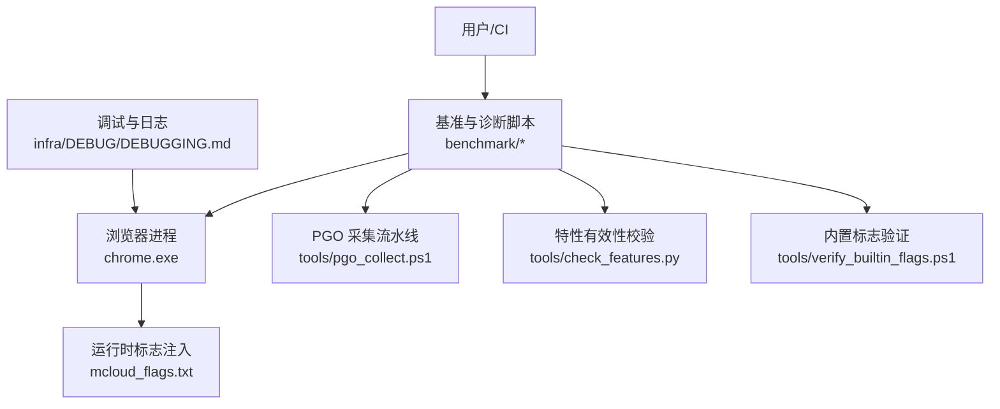
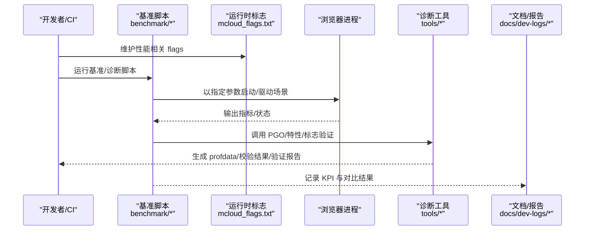
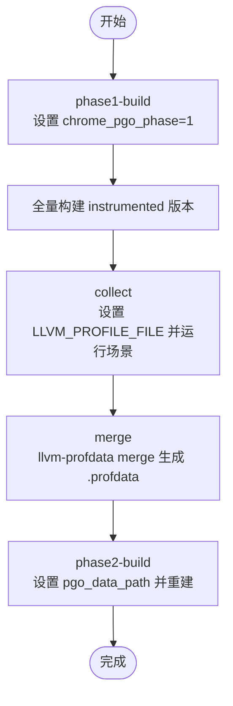
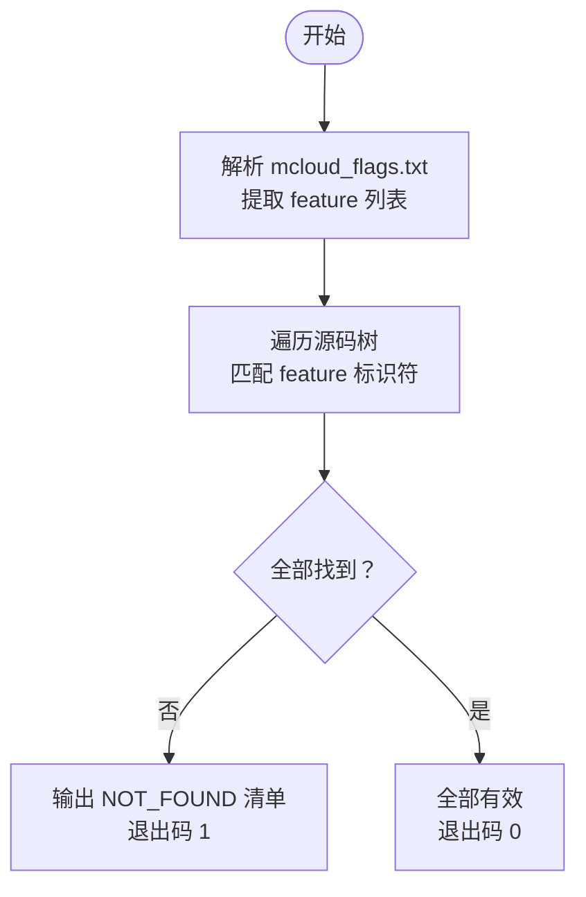
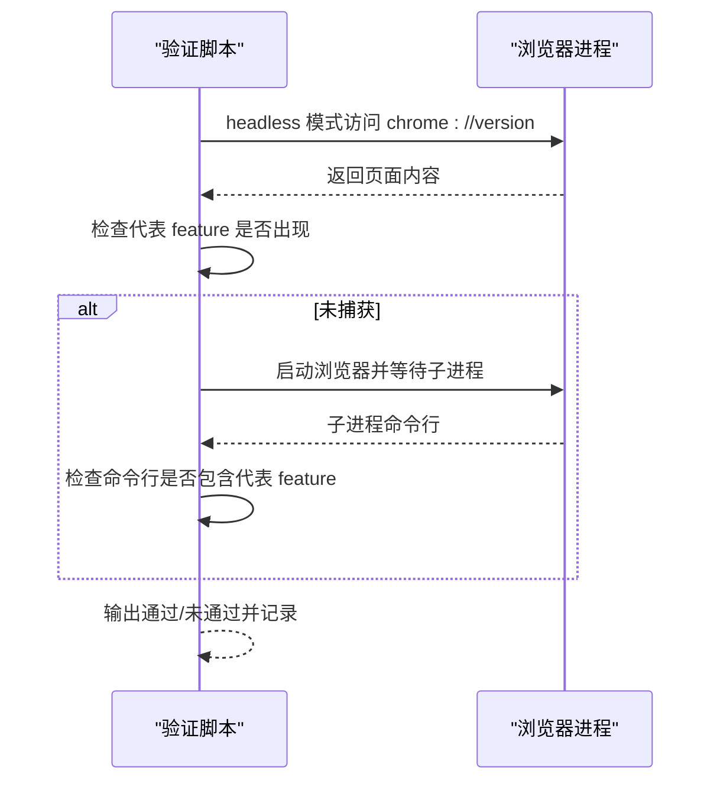
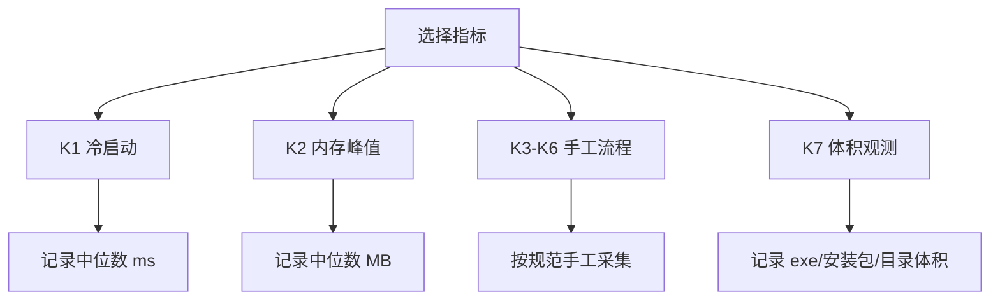
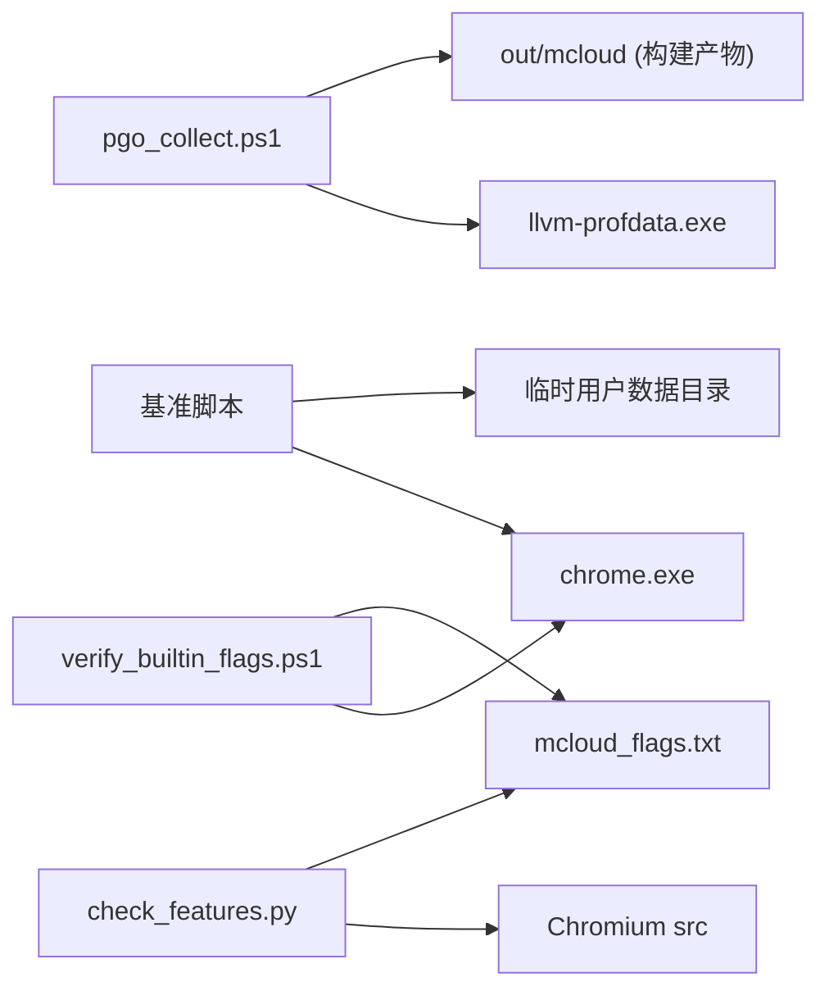

# 性能监控工具

本文引用的文件

- [pgo_collect.ps1](https://github.com/Mcloud136/Mcloud-Browser/blob/main/benchmark/tools/pgo_collect.ps1)
- [check_features.py](https://github.com/Mcloud136/Mcloud-Browser/blob/main/benchmark/tools/check_features.py)
- [verify_builtin_flags.ps1](https://github.com/Mcloud136/Mcloud-Browser/blob/main/benchmark/tools/verify_builtin_flags.ps1)
- [bench_startup.ps1](https://github.com/Mcloud136/Mcloud-Browser/blob/main/benchmark/bench_startup.ps1)
- [bench_memory.ps1](https://github.com/Mcloud136/Mcloud-Browser/blob/main/benchmark/bench_memory.ps1)
- [bench_navigation.ps1](https://github.com/Mcloud136/Mcloud-Browser/blob/main/benchmark/bench_navigation.ps1)
- [bench_size.ps1](https://github.com/Mcloud136/Mcloud-Browser/blob/main/benchmark/bench_size.ps1)
- [mcloud_flags.txt](https://github.com/Mcloud136/Mcloud-Browser/blob/main/mcloud_flags.txt)
- [DEBUGGING.md](https://github.com/Mcloud136/Mcloud-Browser/blob/main/infra/DEBUG/DEBUGGING.md)
- [M151-opt-benchmark.md](https://github.com/Mcloud136/Mcloud-Browser/blob/main/docs/dev-logs/M151-opt-benchmark.md)
- [M151-benchmark.md](https://github.com/Mcloud136/Mcloud-Browser/blob/main/docs/dev-logs/M151-benchmark.md)
- [README.md](https://github.com/Mcloud136/Mcloud-Browser/blob/main/README.md)

## 目录
1. [简介](#简介)
2. [项目结构](#项目结构)
3. [核心组件](#核心组件)
4. [架构总览](#架构总览)
5. [详细组件分析](#详细组件分析)
6. [依赖关系分析](#依赖关系分析)
7. [性能注意事项](#性能注意事项)
8. [故障排查指南](#故障排查指南)
9. [结论](#结论)
10. [附录](#附录)

## 简介
本指南面向 MCloud Browser 的性能监控与优化实践，覆盖以下主题：
- 内置性能基准与诊断工具（启动、内存、导航、体积、PGO 采集、特性检查、内置标志验证）
- 外部调试工具使用建议（Chrome DevTools、性能/内存/网络分析器）
- 性能监控环境设置（日志级别、性能计数器、调试标志）
- 数据采集与分析最佳实践（策略、方法、问题定位技巧）
- 常见性能问题的诊断流程与解决方案

## 项目结构
仓库中与性能监控相关的核心位置如下：
- benchmark/tools：PGO 采集、特性清单校验、内置标志生效验证等自动化脚本
- benchmark：启动、内存、导航、体积等基准测试脚本
- mcloud_flags.txt：运行时性能相关功能开关与启动参数清单
- infra/DEBUG/DEBUGGING.md：日志、调试、性能分析相关说明
- docs/dev-logs：基准测试结果与优化验证记录

图表来源
- [pgo_collect.ps1:1-106](https://github.com/Mcloud136/Mcloud-Browser/blob/main/benchmark/tools/pgo_collect.ps1#L1-L106)
- [check_features.py:1-153](https://github.com/Mcloud136/Mcloud-Browser/blob/main/benchmark/tools/check_features.py#L1-L153)
- [verify_builtin_flags.ps1:1-98](https://github.com/Mcloud136/Mcloud-Browser/blob/main/benchmark/tools/verify_builtin_flags.ps1#L1-L98)
- [bench_startup.ps1:1-70](https://github.com/Mcloud136/Mcloud-Browser/blob/main/benchmark/bench_startup.ps1#L1-L70)
- [bench_memory.ps1:1-78](https://github.com/Mcloud136/Mcloud-Browser/blob/main/benchmark/bench_memory.ps1#L1-L78)
- [bench_navigation.ps1:1-109](https://github.com/Mcloud136/Mcloud-Browser/blob/main/benchmark/bench_navigation.ps1#L1-L109)
- [bench_size.ps1:1-44](https://github.com/Mcloud136/Mcloud-Browser/blob/main/benchmark/bench_size.ps1#L1-L44)
- [mcloud_flags.txt:1-120](https://github.com/Mcloud136/Mcloud-Browser/blob/main/mcloud_flags.txt#L1-L120)
- [DEBUGGING.md:463-492](https://github.com/Mcloud136/Mcloud-Browser/blob/main/infra/DEBUG/DEBUGGING.md#L463-L492)

章节来源
- [README.md:353-375](https://github.com/Mcloud136/Mcloud-Browser/blob/main/README.md#L353-L375)

## 核心组件
- PGO 采集流水线：基于真实场景驱动 instrumented 构建，收集 .profraw 并合并为 .profdata，用于二次优化构建
- 特性清单校验：扫描 Chromium 源码树，确认 mcloud_flags.txt 中 feature 是否仍存在于当前内核版本
- 内置标志验证：通过 headless 模式或子进程命令行探测，验证 mcloud_flags.txt 中的代表 feature 已注入生效
- 基准测试套件：冷启动时间、内存峰值、导航响应、二进制体积等指标采集
- 运行期标志清单：集中管理启动优化、渲染、内存、网络、媒体、线程、存储等性能相关开关

章节来源
- [pgo_collect.ps1:1-106](https://github.com/Mcloud136/Mcloud-Browser/blob/main/benchmark/tools/pgo_collect.ps1#L1-L106)
- [check_features.py:1-153](https://github.com/Mcloud136/Mcloud-Browser/blob/main/benchmark/tools/check_features.py#L1-L153)
- [verify_builtin_flags.ps1:1-98](https://github.com/Mcloud136/Mcloud-Browser/blob/main/benchmark/tools/verify_builtin_flags.ps1#L1-L98)
- [bench_startup.ps1:1-70](https://github.com/Mcloud136/Mcloud-Browser/blob/main/benchmark/bench_startup.ps1#L1-L70)
- [bench_memory.ps1:1-78](https://github.com/Mcloud136/Mcloud-Browser/blob/main/benchmark/bench_memory.ps1#L1-L78)
- [bench_navigation.ps1:1-109](https://github.com/Mcloud136/Mcloud-Browser/blob/main/benchmark/bench_navigation.ps1#L1-L109)
- [bench_size.ps1:1-44](https://github.com/Mcloud136/Mcloud-Browser/blob/main/benchmark/bench_size.ps1#L1-L44)
- [mcloud_flags.txt:1-120](https://github.com/Mcloud136/Mcloud-Browser/blob/main/mcloud_flags.txt#L1-L120)

## 架构总览
下图展示了从配置到执行再到结果记录的完整链路：

图表来源
- [bench_startup.ps1:1-70](https://github.com/Mcloud136/Mcloud-Browser/blob/main/benchmark/bench_startup.ps1#L1-L70)
- [bench_memory.ps1:1-78](https://github.com/Mcloud136/Mcloud-Browser/blob/main/benchmark/bench_memory.ps1#L1-L78)
- [bench_navigation.ps1:1-109](https://github.com/Mcloud136/Mcloud-Browser/blob/main/benchmark/bench_navigation.ps1#L1-L109)
- [bench_size.ps1:1-44](https://github.com/Mcloud136/Mcloud-Browser/blob/main/benchmark/bench_size.ps1#L1-L44)
- [pgo_collect.ps1:1-106](https://github.com/Mcloud136/Mcloud-Browser/blob/main/benchmark/tools/pgo_collect.ps1#L1-L106)
- [check_features.py:1-153](https://github.com/Mcloud136/Mcloud-Browser/blob/main/benchmark/tools/check_features.py#L1-L153)
- [verify_builtin_flags.ps1:1-98](https://github.com/Mcloud136/Mcloud-Browser/blob/main/benchmark/tools/verify_builtin_flags.ps1#L1-L98)
- [mcloud_flags.txt:1-120](https://github.com/Mcloud136/Mcloud-Browser/blob/main/mcloud_flags.txt#L1-L120)
- [M151-opt-benchmark.md:1-32](https://github.com/Mcloud136/Mcloud-Browser/blob/main/docs/dev-logs/M151-opt-benchmark.md#L1-L32)

## 详细组件分析

### PGO 采集流水线（tools/pgo_collect.ps1）
- 目标：以真实用户场景采集 profraw，合并为 profdata，指导 phase2 构建进行热点优化
- 关键步骤：
  - 阶段一构建：将 args.gn 的 chrome_pgo_phase 设为 1，全量构建 instrumented 版本
  - 场景采集：设置环境变量 LLVM_PROFILE_FILE，运行浏览器模拟典型场景，产出 .profraw
  - 数据合并：使用 llvm-profdata merge 生成 .profdata
  - 阶段二构建：将 pgo_data_path 指向生成的 .profdata，重新全量构建
- 前置依赖：需要 llvm-profdata.exe；两次全量构建耗时较长，建议在空闲时段执行

图表来源
- [pgo_collect.ps1:1-106](https://github.com/Mcloud136/Mcloud-Browser/blob/main/benchmark/tools/pgo_collect.ps1#L1-L106)

章节来源
- [pgo_collect.ps1:1-106](https://github.com/Mcloud136/Mcloud-Browser/blob/main/benchmark/tools/pgo_collect.ps1#L1-L106)

### 特性清单有效性校验（tools/check_features.py）
- 作用：解析 mcloud_flags.txt 中的 feature 名称，在目标 Chromium 源码树中检索是否存在，输出失效清单
- 扫描策略：排除 out/.git/testdata/test/tests/third_party（仅白名单 third_party/blink），匹配标识符边界避免误报
- 退出码：存在 NOT_FOUND 时返回 1，便于接入升级检查清单

图表来源
- [check_features.py:1-153](https://github.com/Mcloud136/Mcloud-Browser/blob/main/benchmark/tools/check_features.py#L1-L153)

章节来源
- [check_features.py:1-153](https://github.com/Mcloud136/Mcloud-Browser/blob/main/benchmark/tools/check_features.py#L1-L153)

### 内置启动标志验证（tools/verify_builtin_flags.ps1）
- 原理：headless 模式 dump chrome://version 页面，检查其中是否包含代表 feature；若失败则回退到子进程命令行探测
- 抽查项：选取启动/内存/媒体三类代表性 feature 进行验证
- 闭环要求：全部代表 feature 出现即视为通过，需同步记录到开发日志

图表来源
- [verify_builtin_flags.ps1:1-98](https://github.com/Mcloud136/Mcloud-Browser/blob/main/benchmark/tools/verify_builtin_flags.ps1#L1-L98)

章节来源
- [verify_builtin_flags.ps1:1-98](https://github.com/Mcloud136/Mcloud-Browser/blob/main/benchmark/tools/verify_builtin_flags.ps1#L1-L98)

### 基准测试套件
- 冷启动时间（K1）：使用全新用户数据目录启动，等待主窗口初始化完成，记录耗时并取中位数
- 内存峰值（K2）：打开固定数量标签页，驻留稳定后汇总所有浏览器进程的 WorkingSet64，采样多次取中位数
- 导航响应速度：对比预载开启与关闭两种模式的页面加载耗时，预热后再测量，计算差异百分比
- 二进制体积（K7）：统计 chrome.exe、安装包及构建目录总体积，作为观测指标

图表来源
- [bench_startup.ps1:1-70](https://github.com/Mcloud136/Mcloud-Browser/blob/main/benchmark/bench_startup.ps1#L1-L70)
- [bench_memory.ps1:1-78](https://github.com/Mcloud136/Mcloud-Browser/blob/main/benchmark/bench_memory.ps1#L1-L78)
- [bench_navigation.ps1:1-109](https://github.com/Mcloud136/Mcloud-Browser/blob/main/benchmark/bench_navigation.ps1#L1-L109)
- [bench_size.ps1:1-44](https://github.com/Mcloud136/Mcloud-Browser/blob/main/benchmark/bench_size.ps1#L1-L44)

章节来源
- [bench_startup.ps1:1-70](https://github.com/Mcloud136/Mcloud-Browser/blob/main/benchmark/bench_startup.ps1#L1-L70)
- [bench_memory.ps1:1-78](https://github.com/Mcloud136/Mcloud-Browser/blob/main/benchmark/bench_memory.ps1#L1-L78)
- [bench_navigation.ps1:1-109](https://github.com/Mcloud136/Mcloud-Browser/blob/main/benchmark/bench_navigation.ps1#L1-L109)
- [bench_size.ps1:1-44](https://github.com/Mcloud136/Mcloud-Browser/blob/main/benchmark/bench_size.ps1#L1-L44)

### 运行期标志清单（mcloud_flags.txt）
- 分类覆盖：启动优化、视频播放、渲染、内存、网络、图像、推测规则、V8 JavaScript、预载/预热、脚本/加载速度、MSE/视频缓冲、GPU、媒体、线程、Service Worker、存储等
- 变更治理：移除不再存在的 feature（如 PWAFullCodeCache / ServiceWorkerScriptFullCodeCache），并通过 check_features.py 复验存活
- 实测修复：针对特定 GPU 解码缺陷显式禁用相关 feature，确保稳定性

章节来源
- [mcloud_flags.txt:1-120](https://github.com/Mcloud136/Mcloud-Browser/blob/main/mcloud_flags.txt#L1-L120)

## 依赖关系分析
- 脚本与构建产物：
  - pgo_collect.ps1 依赖 llvm-profdata.exe 与 instrumented 构建产物
  - verify_builtin_flags.ps1 依赖 chrome.exe 与同目录 mcloud_flags.txt
  - 基准脚本依赖 chrome.exe 与临时用户数据目录
- 配置与源码：
  - check_features.py 依赖 mcloud_flags.txt 与目标 Chromium src 目录
  - 基准结果与优化验证记录于 docs/dev-logs/*

图表来源
- [pgo_collect.ps1:1-106](https://github.com/Mcloud136/Mcloud-Browser/blob/main/benchmark/tools/pgo_collect.ps1#L1-L106)
- [verify_builtin_flags.ps1:1-98](https://github.com/Mcloud136/Mcloud-Browser/blob/main/benchmark/tools/verify_builtin_flags.ps1#L1-L98)
- [check_features.py:1-153](https://github.com/Mcloud136/Mcloud-Browser/blob/main/benchmark/tools/check_features.py#L1-L153)
- [bench_startup.ps1:1-70](https://github.com/Mcloud136/Mcloud-Browser/blob/main/benchmark/bench_startup.ps1#L1-L70)
- [bench_memory.ps1:1-78](https://github.com/Mcloud136/Mcloud-Browser/blob/main/benchmark/bench_memory.ps1#L1-L78)
- [bench_navigation.ps1:1-109](https://github.com/Mcloud136/Mcloud-Browser/blob/main/benchmark/bench_navigation.ps1#L1-L109)
- [bench_size.ps1:1-44](https://github.com/Mcloud136/Mcloud-Browser/blob/main/benchmark/bench_size.ps1#L1-L44)

章节来源
- [pgo_collect.ps1:1-106](https://github.com/Mcloud136/Mcloud-Browser/blob/main/benchmark/tools/pgo_collect.ps1#L1-L106)
- [verify_builtin_flags.ps1:1-98](https://github.com/Mcloud136/Mcloud-Browser/blob/main/benchmark/tools/verify_builtin_flags.ps1#L1-L98)
- [check_features.py:1-153](https://github.com/Mcloud136/Mcloud-Browser/blob/main/benchmark/tools/check_features.py#L1-L153)

## 性能注意事项
- PGO 构建成本：两次全量构建耗时较长，需在构建机空闲时执行
- 场景真实性：采集阶段应模拟多标签/浏览/视频等真实场景，确保热点覆盖
- 特征有效性：每次内核升级后必须运行 check_features.py，及时清理无效 feature
- 标志注入验证：每次构建后运行 verify_builtin_flags.ps1，确保 mcloud_flags.txt 生效
- 基准可复现性：使用全新用户数据目录，关闭无关扩展，保持电源模式一致
- 日志与调试：启用必要日志级别与 IPC 日志，有助于定位问题

[本节提供通用指导，不直接分析具体文件]

## 故障排查指南
- 日志级别与 IPC 调试：
  - 使用 --log-level=0 与 --enable-logging=stderr 显示更多 LOG 消息
  - 新版本的 MCloud Browser 可能需要 --v=1 以启用 VLOG
  - 通过 CHROME_IPC_LOGGING=1 查看 IPC 调试信息
- 常见问题定位：
  - 若内置标志未生效，检查 mcloud_flags.txt 是否在 chrome.exe 同目录，以及当前构建是否包含加载逻辑
  - 若 PGO 采集无 .profraw，确认是否为 phase=1 构建且 LLVM_PROFILE_FILE 可写
  - 若特性校验失败，根据 NOT_FOUND 清单移除或替换对应 feature，并在升级报告中记录原因
- 参考路径：
  - 日志与调试说明见 infra/DEBUG/DEBUGGING.md
  - 基准结果与优化验证见 docs/dev-logs/M151-opt-benchmark.md 与 M151-benchmark.md

章节来源
- [DEBUGGING.md:463-492](https://github.com/Mcloud136/Mcloud-Browser/blob/main/infra/DEBUG/DEBUGGING.md#L463-L492)
- [M151-opt-benchmark.md:1-32](https://github.com/Mcloud136/Mcloud-Browser/blob/main/docs/dev-logs/M151-opt-benchmark.md#L1-L32)
- [M151-benchmark.md:1-30](https://github.com/Mcloud136/Mcloud-Browser/blob/main/docs/dev-logs/M151-benchmark.md#L1-L30)

## 结论
- MCloud Browser 提供了完善的性能监控与优化基础设施：
  - 内置基准与诊断脚本覆盖启动、内存、导航、体积等关键指标
  - PGO 采集流水线支持以真实场景驱动的二次优化构建
  - 特性校验与内置标志验证保障运行期开关的有效性与可追溯性
- 建议将上述工具纳入日常开发与 CI 流程，持续跟踪性能变化并及时回归问题

[本节总结整体发现，不直接分析具体文件]

## 附录

### 外部调试工具使用建议（Chrome DevTools）
- 性能分析器：录制页面交互过程，识别长任务、布局抖动与重绘重排热点
- 内存分析器：抓取堆快照与分配追踪，定位内存泄漏与异常增长
- 网络分析器：观察请求瀑布、缓存命中与资源大小，优化首屏与重复加载
- 结合日志：在控制台过滤关键模块日志，配合 --log-level 与 --v 提升可观测性

[本节为通用指导，不直接分析具体文件]

### 性能数据采集与分析最佳实践
- 数据收集策略：
  - 使用全新用户数据目录，避免缓存与历史干扰
  - 固定样本数与驻留时间，取中位数降低噪声影响
  - 对预载类 feature 采用“开/关”对比，评估真实收益
- 分析方法：
  - 关注 K1/K2/K7 等核心指标的长期趋势
  - 结合 PGO 热点与特性变更，定位性能回归根因
  - 将结果记录至 docs/dev-logs，形成可追溯基线
- 问题定位技巧：
  - 优先验证内置标志注入与特性有效性
  - 使用日志与 IPC 调试缩小问题范围
  - 必要时切换 GPU 解码或相关 feature，验证平台兼容性

[本节为通用指导，不直接分析具体文件]

### 常见性能问题诊断流程与解决方案
- 启动慢：
  - 检查预载/预热类 feature 是否生效，必要时调整或禁用
  - 使用 K1 基准复测，结合日志定位初始化瓶颈
- 内存高：
  - 使用 K2 基准与内存分析器定位泄漏点
  - 检查 InfiniteTabsFreezing 等内存回收相关 feature 是否启用
- 导航慢：
  - 使用 bench_navigation 对比预载开/关效果
  - 分析网络与缓存命中情况，优化资源加载策略
- 视频卡顿/绿屏：
  - 针对特定 GPU 解码问题，参考 mcloud_flags.txt 中的显式禁用策略
  - 切换解码路径或更新驱动，验证稳定性

[本节为通用指导，不直接分析具体文件]