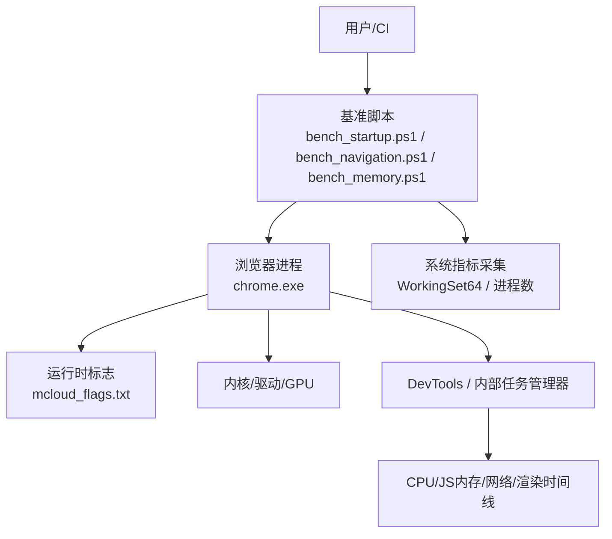
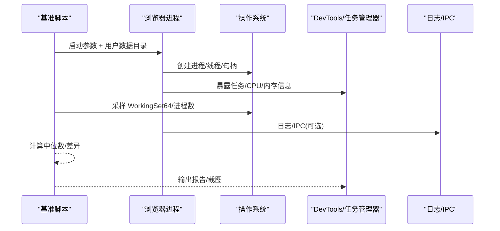
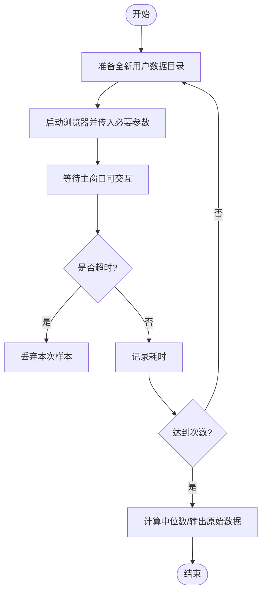
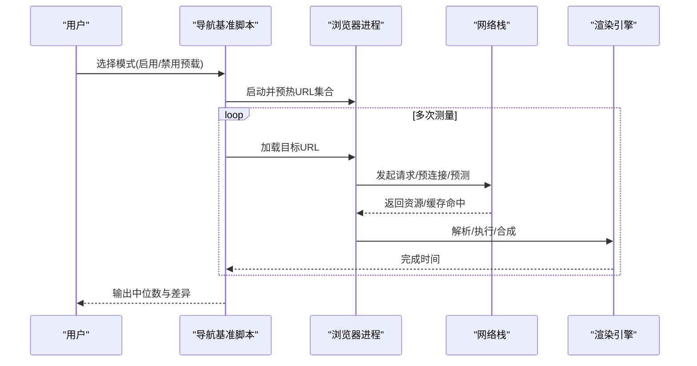
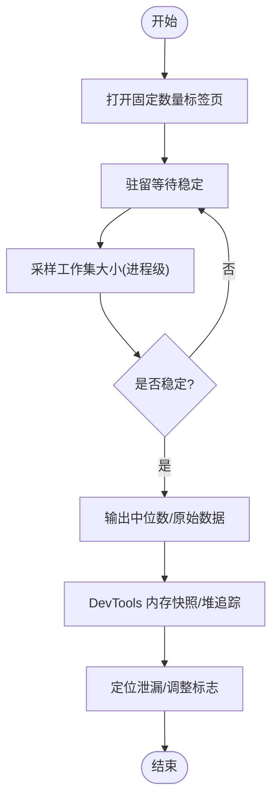
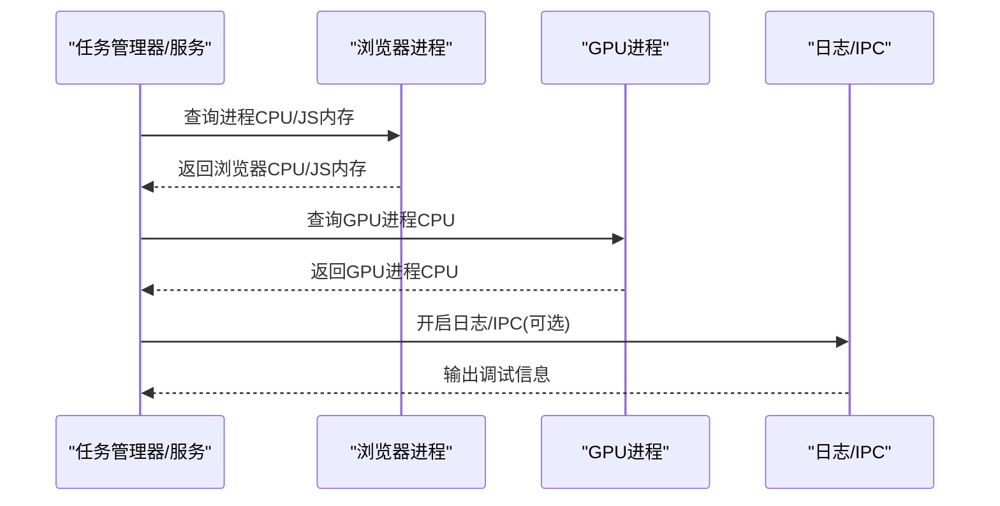
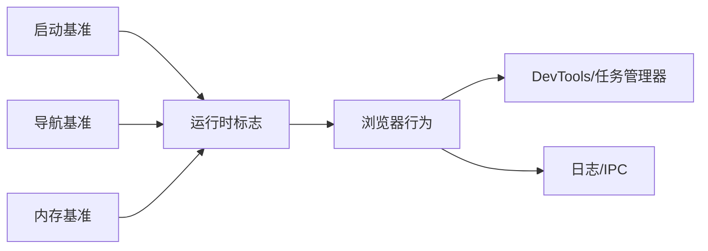

# 性能问题诊断

<cite>
**本文引用的文件**
- [bench_startup.ps1](file://benchmark/bench_startup.ps1)
- [bench_navigation.ps1](file://benchmark/bench_navigation.ps1)
- [bench_memory.ps1](file://benchmark/bench_memory.ps1)
- [mcloud_flags.txt](file://mcloud_flags.txt)
- [2026-06-19-performance-optimization.md](file://docs/superpowers/plans/2026-06-19-performance-optimization.md)
- [2026-06-19-performance-optimization-design.md](file://docs/superpowers/specs/2026-06-19-performance-optimization-design.md)
- [DEBUGGING.md](file://infra/DEBUG/DEBUGGING.md)
- [benchmark-template.md](file://docs/dev-logs/benchmark-template.md)
- [M151-benchmark.md](file://docs/dev-logs/M151-benchmark.md)
- [M151-opt-benchmark.md](file://docs/dev-logs/M151-opt-benchmark.md)
- [thunk.js](file://infra/hangout_services/thunk.js)
</cite>

## 目录
1. [简介](#简介)
2. [项目结构](#项目结构)
3. [核心组件](#核心组件)
4. [架构总览](#架构总览)
5. [详细组件分析](#详细组件分析)
6. [依赖关系分析](#依赖关系分析)
7. [性能注意事项](#性能注意事项)
8. [故障排查指南](#故障排查指南)
9. [结论](#结论)
10. [附录](#附录)

## 简介
本指南面向 MCloud Browser 的性能问题诊断与优化，覆盖启动慢、页面加载延迟、内存泄漏、CPU 使用率过高等常见问题的识别方法、监控工具使用、基准测试执行与结果分析，以及不同场景下的调优策略。文档基于仓库内提供的基准脚本、运行时标志配置与设计文档，给出可复现的实操步骤与排障路径。

## 项目结构
与性能诊断直接相关的工程资产主要集中在以下位置：
- 基准测试脚本：benchmark 目录（冷启动、导航响应、内存峰值）
- 运行时标志与优化设计：mcloud_flags.txt、docs/superpowers 下的计划与设计文档
- 调试与日志：infra/DEBUG/DEBUGGING.md
- 基准模板与历史报告：docs/dev-logs 下的模板与多版本基准报告
- 内置进程 CPU/内存上报能力：infra/hangout_services/thunk.js

图表来源
- [bench_startup.ps1:1-70](file://benchmark/bench_startup.ps1#L1-L70)
- [bench_navigation.ps1:1-109](file://benchmark/bench_navigation.ps1#L1-L109)
- [bench_memory.ps1:1-78](file://benchmark/bench_memory.ps1#L1-L78)
- [mcloud_flags.txt:1-120](file://mcloud_flags.txt#L1-L120)

章节来源
- [bench_startup.ps1:1-70](file://benchmark/bench_startup.ps1#L1-L70)
- [bench_navigation.ps1:1-109](file://benchmark/bench_navigation.ps1#L1-L109)
- [bench_memory.ps1:1-78](file://benchmark/bench_memory.ps1#L1-L78)
- [mcloud_flags.txt:1-120](file://mcloud_flags.txt#L1-L120)

## 核心组件
- 冷启动基准：通过全新用户数据目录启动并等待主窗口可交互，统计中位数耗时，用于评估启动优化效果。
- 导航响应基准：对比启用/禁用预载类特性对页面打开时延的影响，预热后多次测量取中位数。
- 内存峰值基准：固定标签集驻留稳定后汇总所有浏览器进程的 WorkingSet64，评估多标签内存占用。
- 运行时标志：集中管理启动期与运行期的性能相关 feature flags，无需重编译即可生效。
- 调试与日志：提供多进程调试、日志级别控制、IPC 调试等能力，辅助定位卡顿与崩溃。
- 基准模板与报告：统一记录环境、KPI 与原始数据，便于回归分析与跨版本对比。

章节来源
- [bench_startup.ps1:1-70](file://benchmark/bench_startup.ps1#L1-L70)
- [bench_navigation.ps1:1-109](file://benchmark/bench_navigation.ps1#L1-L109)
- [bench_memory.ps1:1-78](file://benchmark/bench_memory.ps1#L1-L78)
- [mcloud_flags.txt:1-120](file://mcloud_flags.txt#L1-L120)
- [DEBUGGING.md:463-492](file://infra/DEBUG/DEBUGGING.md#L463-L492)
- [benchmark-template.md:1-39](file://docs/dev-logs/benchmark-template.md#L1-L39)

## 架构总览
下图展示从基准脚本到浏览器进程、再到系统与 DevTools 的完整链路，体现“指标采集—行为触发—结果输出”的闭环。

图表来源
- [bench_startup.ps1:32-58](file://benchmark/bench_startup.ps1#L32-L58)
- [bench_navigation.ps1:54-90](file://benchmark/bench_navigation.ps1#L54-L90)
- [bench_memory.ps1:55-77](file://benchmark/bench_memory.ps1#L55-L77)
- [DEBUGGING.md:463-492](file://infra/DEBUG/DEBUGGING.md#L463-L492)

## 详细组件分析

### 启动速度慢诊断
- 目标：定位冷启动瓶颈（磁盘 IO、初始化任务、GPU 通道建立、首屏渲染）。
- 方法：
  - 使用冷启动基准脚本，以全新用户数据目录启动 about:blank，等待主窗口可交互，记录耗时并取中位数。
  - 结合日志与任务管理器观察各阶段耗时（如 GPU 通道、WebUI 初始化、拼写/翻译模块）。
  - 通过运行时标志调整启动期行为（例如提前发送 GPU 通道、跳过非关键初始化、保持空渲染进程复用）。
- 建议：
  - 在相同环境与构建下重复多次，排除缓存与系统噪声影响。
  - 若首次启动明显偏慢，关注一次性初始化任务；若稳定偏慢，检查默认扩展、DNS、证书链等。

图表来源
- [bench_startup.ps1:32-69](file://benchmark/bench_startup.ps1#L32-L69)

章节来源
- [bench_startup.ps1:1-70](file://benchmark/bench_startup.ps1#L1-L70)
- [2026-06-19-performance-optimization-design.md:69-77](file://docs/superpowers/specs/2026-06-19-performance-optimization-design.md#L69-L77)

### 页面加载延迟诊断
- 目标：验证预载/预连接/预测器等功能对“打开页面”的增益，定位网络或渲染瓶颈。
- 方法：
  - 使用导航基准脚本，分别以“启用预载类特性”和“禁用预载类特性”两种模式，预热 URL 列表后多次测量加载耗时。
  - 对比中位数差异，评估收益与代价（内存占用、稳定性）。
  - 结合 DevTools 网络面板与时间线，定位 DNS、TLS、TTFB、解析、脚本执行、渲染等阶段。
- 建议：
  - 针对高频访问站点进行定向优化（书签栏、新标签页等触发点）。
  - 注意单页一次性加载场景的预载收益有限，真实收益体现在重复导航/预测命中。

图表来源
- [bench_navigation.ps1:23-90](file://benchmark/bench_navigation.ps1#L23-L90)

章节来源
- [bench_navigation.ps1:1-109](file://benchmark/bench_navigation.ps1#L1-L109)
- [2026-06-19-performance-optimization-design.md:69-77](file://docs/superpowers/specs/2026-06-19-performance-optimization-design.md#L69-L77)

### 内存泄漏与高内存占用诊断
- 目标：识别多标签场景下的内存峰值与潜在泄漏。
- 方法：
  - 使用内存基准脚本，打开固定数量标签页，驻留稳定后对全部浏览器进程的 WorkingSet64 求和，多次采样取中位数。
  - 结合 DevTools 内存快照、堆快照与对象分配追踪，定位增长趋势与可疑对象。
  - 通过运行时标志启用内存回收与限制策略（如提交限制丢弃、持续压力紧急丢弃、分区分配优化等）。
- 建议：
  - 优先排查长时间驻留的页面、音视频播放、Service Worker、IndexedDB 等易增长区域。
  - 在多标签场景下，关注非主框架渲染器的内存限制与瓦片回收策略。

图表来源
- [bench_memory.ps1:30-77](file://benchmark/bench_memory.ps1#L30-L77)

章节来源
- [bench_memory.ps1:1-78](file://benchmark/bench_memory.ps1#L1-L78)
- [2026-06-19-performance-optimization-design.md:78-88](file://docs/superpowers/specs/2026-06-19-performance-optimization-design.md#L78-L88)

### CPU 使用率过高诊断
- 目标：定位导致 CPU 飙升的进程/线程与热点代码路径。
- 方法：
  - 使用内置任务管理器或 hangout 服务中的进程 CPU 上报能力，观察浏览器、GPU、标签页进程 CPU 使用情况。
  - 结合 DevTools Performance 面板录制时间线，识别长任务、频繁布局/绘制、脚本热点。
  - 通过日志与 IPC 调试，确认是否存在阻塞或异常循环。
- 建议：
  - 关闭不必要的扩展与后台媒体，降低无关负载。
  - 针对视频解码与渲染管线，检查硬件加速与解码器选择。

图表来源
- [thunk.js:187-232](file://infra/hangout_services/thunk.js#L187-L232)
- [DEBUGGING.md:463-492](file://infra/DEBUG/DEBUGGING.md#L463-L492)

章节来源
- [thunk.js:187-232](file://infra/hangout_services/thunk.js#L187-L232)
- [DEBUGGING.md:463-492](file://infra/DEBUG/DEBUGGING.md#L463-L492)

### 视频播放与解码问题诊断
- 目标：确保视频流畅播放，避免绿屏/花屏与卡顿。
- 方法：
  - 通过媒体内部页面查看解码器类型与是否使用硬件解码。
  - 根据平台与驱动情况，调整视频解码相关标志（如 D3D12VideoDecoder 开关），必要时回退至 D3D11。
  - 结合媒体缓冲与 MSE 相关标志，优化 B站/YouTube 等站点的播放体验。
- 建议：
  - 在核显与独显环境下分别验证，记录差异。
  - 关注解码器启动初期的稳定性问题，必要时临时禁用特定特性。

章节来源
- [2026-06-19-performance-optimization-design.md:124-148](file://docs/superpowers/specs/2026-06-19-performance-optimization-design.md#L124-L148)
- [mcloud_flags.txt:78-89](file://mcloud_flags.txt#L78-L89)

## 依赖关系分析
- 基准脚本依赖：
  - 启动基准依赖系统进程管理与计时能力。
  - 导航基准依赖浏览器 headless 模式与 DOM 导出能力。
  - 内存基准依赖进程工作集统计能力。
- 运行时标志依赖：
  - 启动、内存、网络、渲染、媒体、多线程等类别的标志共同影响整体性能表现。
- 调试与日志依赖：
  - 日志级别与 IPC 调试有助于定位复杂问题。

图表来源
- [bench_startup.ps1:1-70](file://benchmark/bench_startup.ps1#L1-L70)
- [bench_navigation.ps1:1-109](file://benchmark/bench_navigation.ps1#L1-L109)
- [bench_memory.ps1:1-78](file://benchmark/bench_memory.ps1#L1-L78)
- [mcloud_flags.txt:1-120](file://mcloud_flags.txt#L1-L120)
- [DEBUGGING.md:463-492](file://infra/DEBUG/DEBUGGING.md#L463-L492)

章节来源
- [bench_startup.ps1:1-70](file://benchmark/bench_startup.ps1#L1-L70)
- [bench_navigation.ps1:1-109](file://benchmark/bench_navigation.ps1#L1-L109)
- [bench_memory.ps1:1-78](file://benchmark/bench_memory.ps1#L1-L78)
- [mcloud_flags.txt:1-120](file://mcloud_flags.txt#L1-L120)
- [DEBUGGING.md:463-492](file://infra/DEBUG/DEBUGGING.md#L463-L492)

## 性能注意事项
- 基准环境一致性：
  - 固定 CPU、内存、OS、GPU/驱动、电源模式与扩展，减少噪声。
- 指标选取：
  - 冷启动使用中位数，避免极端值干扰。
  - 内存峰值采用多次采样收敛后的中位数。
- 标志组合风险：
  - 部分预载/预连接特性可能带来内存代价，需结合实际站点收益评估。
- 视频解码兼容性：
  - 不同 GPU/驱动组合下，某些特性可能存在不稳定现象，应保留回退方案。

章节来源
- [benchmark-template.md:1-39](file://docs/dev-logs/benchmark-template.md#L1-L39)
- [M151-benchmark.md:1-30](file://docs/dev-logs/M151-benchmark.md#L1-L30)
- [M151-opt-benchmark.md:1-32](file://docs/dev-logs/M151-opt-benchmark.md#L1-L32)
- [mcloud_flags.txt:59-89](file://mcloud_flags.txt#L59-L89)

## 故障排查指南
- 日志与 IPC：
  - 调整日志级别并启用 stderr 输出，捕获更多诊断信息。
  - 启用 IPC 日志，观察进程间通信瓶颈。
- 多进程调试：
  - 使用调试器附加到渲染/GPU 子进程，设置断点与条件断点。
  - 对于冻结问题，可通过信号触发 core dump 获取堆栈。
- 任务管理器与 DevTools：
  - 使用内置任务管理器查看进程 CPU/内存，结合 DevTools 时间线与内存快照定位热点。
- 基准回归：
  - 按模板记录环境信息与 KPI，对比历史报告，快速发现回归项。

章节来源
- [DEBUGGING.md:463-492](file://infra/DEBUG/DEBUGGING.md#L463-L492)
- [benchmark-template.md:1-39](file://docs/dev-logs/benchmark-template.md#L1-L39)

## 结论
通过仓库提供的基准脚本、运行时标志与调试能力，可以系统化地诊断 MCloud Browser 的启动、导航、内存与 CPU 问题。建议在稳定环境中执行基准、记录完整环境信息、结合 DevTools 与日志进行根因分析，并根据站点特征与硬件环境选择合适的优化策略与标志组合。

## 附录
- 基准模板字段说明：
  - 环境信息必填项包括 CPU、内存、OS、GPU/驱动、电源模式与扩展。
  - KPI 包含冷启动、内存峰值、页面加载、JS 性能、滚动掉帧、视频解码与二进制体积等。
- 历史基准参考：
  - 多版本基准报告展示了不同构建与标志组合下的指标变化，可作为回归与对比依据。

章节来源
- [benchmark-template.md:1-39](file://docs/dev-logs/benchmark-template.md#L1-L39)
- [M151-benchmark.md:1-30](file://docs/dev-logs/M151-benchmark.md#L1-L30)
- [M151-opt-benchmark.md:1-32](file://docs/dev-logs/M151-opt-benchmark.md#L1-L32)