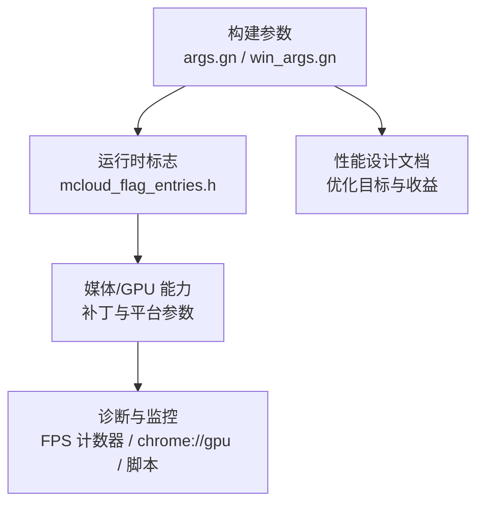
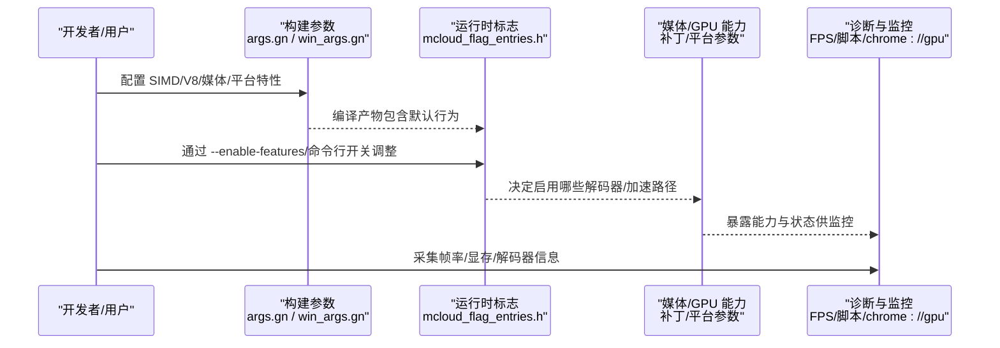

# 渲染性能诊断

本文引用的文件

- [args.gn](https://github.com/Mcloud136/Mcloud-Browser/blob/main/args.gn)
- [win_args.gn](https://github.com/Mcloud136/Mcloud-Browser/blob/main/win_args.gn)
- [win_args_mcloud.gn](https://github.com/Mcloud136/Mcloud-Browser/blob/main/win_args_mcloud.gn)
- [mcloud_flag_entries.h](https://github.com/Mcloud136/Mcloud-Browser/blob/main/src/chrome/browser/mcloud_flag_entries.h)
- [mcloud_flag_choices.h](https://github.com/Mcloud136/Mcloud-Browser/blob/main/src/chrome/browser/mcloud_flag_choices.h)
- [2026-06-19-performance-optimization-design.md](https://github.com/Mcloud136/Mcloud-Browser/blob/main/docs/superpowers/specs/2026-06-19-performance-optimization-design.md)
- [diag_igpu_green_screen.ps1](https://github.com/Mcloud136/Mcloud-Browser/blob/main/benchmark/tools/diag_igpu_green_screen.ps1)
- [Enable-accelerated-mjpeg-decode-on-Linux.patch](https://github.com/Mcloud136/Mcloud-Browser/blob/main/infra/Flatpak/com.mcloud.browser/patches/chromium/Enable-accelerated-mjpeg-decode-on-Linux.patch)
- [mac_ARM_args.gn](https://github.com/Mcloud136/Mcloud-Browser/blob/main/other/Mac/mac_ARM_args.gn)
- [BUILD.gn (content)](https://github.com/Mcloud136/Mcloud-Browser/blob/main/src/content/browser/BUILD.gn)
- [memory_details_linux.cc](https://github.com/Mcloud136/Mcloud-Browser/blob/main/src/chrome/browser/memory_details_linux.cc)

## 目录
1. [简介](#简介)
2. [项目结构](#项目结构)
3. [核心组件](#核心组件)
4. [架构总览](#架构总览)
5. [详细组件分析](#详细组件分析)
6. [依赖关系分析](#依赖关系分析)
7. [性能考量](#性能考量)
8. [故障排查指南](#故障排查指南)
9. [结论](#结论)
10. [附录](#附录)

## 简介
本指南面向 MCloud Browser 的渲染性能诊断与优化，聚焦帧率、重绘重排、GPU 加速等关键指标，提供从构建期到运行期的系统性方法。内容涵盖：
- GPU 渲染性能监控工具与方法（硬件加速状态检查、GPU 内存使用分析、渲染线程性能分析）
- 影响渲染性能的因素（复杂布局、大量 DOM 操作、视频播放、Canvas/SVG 渲染）
- 具体优化策略（启用硬件加速、合成层优化、动画性能优化）
- 不同媒体类型与复杂页面的调优建议

## 项目结构
MCloud Browser 在渲染与性能方面涉及多层配置与实现：
- 构建参数：通过 GN 参数控制 SIMD、V8、媒体解码、平台特性等，直接影响运行时渲染路径与性能上限
- 运行时标志：通过 flags 暴露可开关的特性，如 FPS 计数器、WebGL 采样数、栅格化线程数、GPU 显存限制等
- 媒体与 GPU：针对 Linux/Windows/macOS 的差异化补丁与参数，启用硬件解码与加速路径
- 诊断脚本：提供 Windows 下 GPU 环境检测与问题复现流程

**图表来源**
- [args.gn:1-87](https://github.com/Mcloud136/Mcloud-Browser/blob/main/args.gn#L1-L87)
- [win_args.gn:1-87](https://github.com/Mcloud136/Mcloud-Browser/blob/main/win_args.gn#L1-L87)
- [mcloud_flag_entries.h:158-243](https://github.com/Mcloud136/Mcloud-Browser/blob/main/src/chrome/browser/mcloud_flag_entries.h#L158-L243)
- [2026-06-19-performance-optimization-design.md:25-121](https://github.com/Mcloud136/Mcloud-Browser/blob/main/docs/superpowers/specs/2026-06-19-performance-optimization-design.md#L25-L121)

**章节来源**
- [args.gn:1-87](https://github.com/Mcloud136/Mcloud-Browser/blob/main/args.gn#L1-L87)
- [win_args.gn:1-87](https://github.com/Mcloud136/Mcloud-Browser/blob/main/win_args.gn#L1-L87)
- [mcloud_flag_entries.h:158-243](https://github.com/Mcloud136/Mcloud-Browser/blob/main/src/chrome/browser/mcloud_flag_entries.h#L158-L243)
- [2026-06-19-performance-optimization-design.md:25-121](https://github.com/Mcloud136/Mcloud-Browser/blob/main/docs/superpowers/specs/2026-06-19-performance-optimization-design.md#L25-L121)

## 核心组件
- 构建期优化开关
  - V8 JIT 与 WASM SIMD 开启，提升 JS 执行与计算密集型任务性能
  - 媒体解码与平台特性（HEVC、HLS、D3D12/Vulkan 选择）由 args.gn/win_args.gn 控制
- 运行时可调项
  - 显示 FPS 计数器、设置 WebGL MSAA 采样数、原生 GPU 光栅化 MSAA 采样数
  - 调整栅格化线程数量、强制 GPU 可用显存大小
  - Linux 下可选 VAAPI/GL 后端、NVIDIA GPU 上的 VAAPI 开关
- 媒体与 GPU 加速
  - Linux 上启用 MJPEG 硬件解码（补丁扩展至非 ChromeOS）
  - macOS ARM 上启用 HEVC 解析与硬解、平台音频/视频特性
- 诊断与监控
  - Windows 下 GPU 环境检测脚本，辅助定位绿屏/花屏等问题
  - 内置 GPU 进程与数据管理模块，支撑 chrome://gpu 等内部页面

**章节来源**
- [win_args_mcloud.gn:58-96](https://github.com/Mcloud136/Mcloud-Browser/blob/main/win_args_mcloud.gn#L58-L96)
- [mcloud_flag_entries.h:158-243](https://github.com/Mcloud136/Mcloud-Browser/blob/main/src/chrome/browser/mcloud_flag_entries.h#L158-L243)
- [mcloud_flag_choices.h:63-123](https://github.com/Mcloud136/Mcloud-Browser/blob/main/src/chrome/browser/mcloud_flag_choices.h#L63-L123)
- [Enable-accelerated-mjpeg-decode-on-Linux.patch:36-97](https://github.com/Mcloud136/Mcloud-Browser/blob/main/infra/Flatpak/com.mcloud.browser/patches/chromium/Enable-accelerated-mjpeg-decode-on-Linux.patch#L36-L97)
- [mac_ARM_args.gn:46-82](https://github.com/Mcloud136/Mcloud-Browser/blob/main/other/Mac/mac_ARM_args.gn#L46-L82)
- [BUILD.gn (content):1143-1175](https://github.com/Mcloud136/Mcloud-Browser/blob/main/src/content/browser/BUILD.gn#L1143-L1175)

## 架构总览
下图展示从构建参数到运行时标志、再到媒体/GPU 能力与诊断监控的整体链路：

**图表来源**
- [args.gn:1-87](https://github.com/Mcloud136/Mcloud-Browser/blob/main/args.gn#L1-L87)
- [win_args.gn:1-87](https://github.com/Mcloud136/Mcloud-Browser/blob/main/win_args.gn#L1-L87)
- [mcloud_flag_entries.h:158-243](https://github.com/Mcloud136/Mcloud-Browser/blob/main/src/chrome/browser/mcloud_flag_entries.h#L158-L243)
- [Enable-accelerated-mjpeg-decode-on-Linux.patch:36-97](https://github.com/Mcloud136/Mcloud-Browser/blob/main/infra/Flatpak/com.mcloud.browser/patches/chromium/Enable-accelerated-mjpeg-decode-on-Linux.patch#L36-L97)
- [2026-06-19-performance-optimization-design.md:25-121](https://github.com/Mcloud136/Mcloud-Browser/blob/main/docs/superpowers/specs/2026-06-19-performance-optimization-design.md#L25-L121)

## 详细组件分析

### 构建期参数对渲染性能的影响
- V8 与 WASM
  - 启用 Maglev/TurboFan、WASM SIMD256，提升 JS 与计算密集型任务的执行效率，间接改善主线程压力与合成帧生成速度
- 媒体与平台特性
  - 启用 HLS、HEVC、平台解码器；Windows 使用 D3D12 优先，Linux 支持 VAAPI/GL；macOS ARM 启用 HEVC 解析与硬解
- 链接与优化
  - ThinLTO、PGO、SIMD 指令集（SSE/AVX）等，减少启动与运行开销

**章节来源**
- [win_args_mcloud.gn:58-96](https://github.com/Mcloud136/Mcloud-Browser/blob/main/win_args_mcloud.gn#L58-L96)
- [args.gn:43-87](https://github.com/Mcloud136/Mcloud-Browser/blob/main/args.gn#L43-L87)
- [win_args.gn:43-87](https://github.com/Mcloud136/Mcloud-Browser/blob/main/win_args.gn#L43-L87)
- [mac_ARM_args.gn:46-82](https://github.com/Mcloud136/Mcloud-Browser/blob/main/other/Mac/mac_ARM_args.gn#L46-L82)

### 运行时标志与监控
- 帧率与显存
  - 启用 FPS 计数器，叠加显示 GPU 内存使用情况，便于快速评估帧率与显存占用
- 图形与光栅化
  - 设置 WebGL MSAA 采样数、原生 GPU 光栅化 MSAA 采样数，平衡画质与性能
  - 调整栅格化线程数量，影响页面绘制并行度
  - 强制 GPU 可用显存大小，避免显存不足导致的降级或卡顿
- 平台相关
  - Linux 下可选择 VAAPI/GL 后端、在 NVIDIA 驱动上启用 VAAPI
  - 禁用 WebGL2 用于特定 GPU/OS 组合的问题规避

**章节来源**
- [mcloud_flag_entries.h:158-243](https://github.com/Mcloud136/Mcloud-Browser/blob/main/src/chrome/browser/mcloud_flag_entries.h#L158-L243)
- [mcloud_flag_choices.h:63-123](https://github.com/Mcloud136/Mcloud-Browser/blob/main/src/chrome/browser/mcloud_flag_choices.h#L63-L123)

### 媒体解码与 GPU 加速
- Linux 上 MJPEG 硬件解码
  - 通过补丁将“捕获帧的 MJPEG 硬件解码”扩展到 Linux（非 ChromeOS），提升截图/预览场景的解码性能
- 平台媒体特性
  - macOS ARM 启用 HEVC 解析与硬解、平台音频/视频特性，提高视频播放流畅度
- Windows 视频解码路径
  - 设计文档指出 D3D12 解码器优先，失败回退 D3D11，覆盖 H.264/VP9/AV1/HEVC

**章节来源**
- [Enable-accelerated-mjpeg-decode-on-Linux.patch:36-97](https://github.com/Mcloud136/Mcloud-Browser/blob/main/infra/Flatpak/com.mcloud.browser/patches/chromium/Enable-accelerated-mjpeg-decode-on-Linux.patch#L36-L97)
- [mac_ARM_args.gn:46-82](https://github.com/Mcloud136/Mcloud-Browser/blob/main/other/Mac/mac_ARM_args.gn#L46-L82)
- [2026-06-19-performance-optimization-design.md:124-141](https://github.com/Mcloud136/Mcloud-Browser/blob/main/docs/superpowers/specs/2026-06-19-performance-optimization-design.md#L124-L141)

### 诊断与问题定位
- Windows GPU 环境检测脚本
  - 输出本机 GPU 名称与驱动版本、硬件调度模式（HwSchMode），并引导打开 media-internals 与 gpu 页面进行问题定位
- 典型观察点
  - 播放前几秒是否出现绿屏/花屏
  - 查看 Video Decoder 与 Applied Workarounds
  - 结合 FPS 计数器与显存占用判断瓶颈

**章节来源**
- [diag_igpu_green_screen.ps1:56-95](https://github.com/Mcloud136/Mcloud-Browser/blob/main/benchmark/tools/diag_igpu_green_screen.ps1#L56-L95)

### 渲染管线与 GPU 进程
- GPU 进程与数据管理
  - 包含 GPU 通道工厂、客户端委托、数据管理器、磁盘缓存、功能检查器、内部 UI、主线程工厂、进程主机、峰值显存跟踪等模块，支撑渲染与解码的 GPU 侧工作流
- 与上层标志联动
  - 运行时标志与构建参数共同决定实际启用的 GPU 路径与能力

**章节来源**
- [BUILD.gn (content):1143-1175](https://github.com/Mcloud136/Mcloud-Browser/blob/main/src/content/browser/BUILD.gn#L1143-L1175)

## 依赖关系分析
- 构建参数 → 运行时标志 → 媒体/GPU 能力 → 诊断监控
- 各平台差异通过补丁与 GN 参数体现，确保在不同系统上获得最佳解码与渲染路径
- 性能设计文档为整体优化目标与预期收益提供依据

**图表来源**
- [args.gn:1-87](https://github.com/Mcloud136/Mcloud-Browser/blob/main/args.gn#L1-L87)
- [win_args.gn:1-87](https://github.com/Mcloud136/Mcloud-Browser/blob/main/win_args.gn#L1-L87)
- [mcloud_flag_entries.h:158-243](https://github.com/Mcloud136/Mcloud-Browser/blob/main/src/chrome/browser/mcloud_flag_entries.h#L158-L243)
- [Enable-accelerated-mjpeg-decode-on-Linux.patch:36-97](https://github.com/Mcloud136/Mcloud-Browser/blob/main/infra/Flatpak/com.mcloud.browser/patches/chromium/Enable-accelerated-mjpeg-decode-on-Linux.patch#L36-L97)
- [2026-06-19-performance-optimization-design.md:25-121](https://github.com/Mcloud136/Mcloud-Browser/blob/main/docs/superpowers/specs/2026-06-19-performance-optimization-design.md#L25-L121)

**章节来源**
- [2026-06-19-performance-optimization-design.md:179-188](https://github.com/Mcloud136/Mcloud-Browser/blob/main/docs/superpowers/specs/2026-06-19-performance-optimization-design.md#L179-L188)

## 性能考量
- 帧率与合成
  - 使用 FPS 计数器观察稳定帧率；合理设置栅格化线程数与 MSAA 采样数以平衡性能与画质
- 重绘重排
  - 减少频繁 DOM 变更与复杂布局；利用合成层与硬件加速降低主线程压力
- GPU 加速
  - 确认硬件加速已启用；根据平台选择合适的解码后端（D3D12/D3D11/VAAPI/GL）
- 媒体播放
  - 针对不同媒体类型（H.264/VP9/AV1/HEVC）启用对应硬解；关注解码器选择与回退路径
- Canvas/SVG
  - 控制绘图频率与复杂度；必要时使用离屏缓冲与增量更新

[本节为通用指导，不直接分析具体文件]

## 故障排查指南
- 启动与初始化
  - 使用 FPS 计数器观察首帧与持续帧率；检查 GPU 进程是否正常启动
- 视频播放异常
  - 使用 Windows GPU 检测脚本输出 GPU 信息与驱动版本；打开 chrome://media-internals 查看 Video Decoder；chrome://gpu 查看 Applied Workarounds
- 显存不足或卡顿
  - 调整“强制 GPU 可用显存”；降低 MSAA 采样数；减少并发渲染任务
- 平台兼容性问题
  - Linux 尝试切换 VAAPI/GL 后端；Windows 检查 D3D12/D3D11 回退；macOS ARM 确认 HEVC 硬解启用

**章节来源**
- [diag_igpu_green_screen.ps1:56-95](https://github.com/Mcloud136/Mcloud-Browser/blob/main/benchmark/tools/diag_igpu_green_screen.ps1#L56-L95)
- [mcloud_flag_entries.h:158-243](https://github.com/Mcloud136/Mcloud-Browser/blob/main/src/chrome/browser/mcloud_flag_entries.h#L158-L243)

## 结论
通过构建期参数、运行时标志与平台补丁的组合，MCloud Browser 可在多平台上启用最优的渲染与媒体解码路径。配合 FPS 计数器、GPU 内部页面与诊断脚本，可系统化地定位与解决渲染性能问题。建议在复杂页面与媒体场景中，优先验证硬件加速与解码路径，再逐步调整合成层与光栅化参数，以获得稳定高帧率与低延迟体验。

[本节为总结性内容，不直接分析具体文件]

## 附录
- 常用监控入口
  - chrome://gpu：查看 GPU 能力、驱动与工作区
  - chrome://media-internals：查看媒体解码器与管道状态
  - FPS 计数器：叠加显示帧率与 GPU 内存使用
- 参考优化目标与收益
  - 冷启动、内存占用、视频流畅度、GPU 渲染效率、IO 响应性等指标的预期提升

**章节来源**
- [2026-06-19-performance-optimization-design.md:179-188](https://github.com/Mcloud136/Mcloud-Browser/blob/main/docs/superpowers/specs/2026-06-19-performance-optimization-design.md#L179-L188)