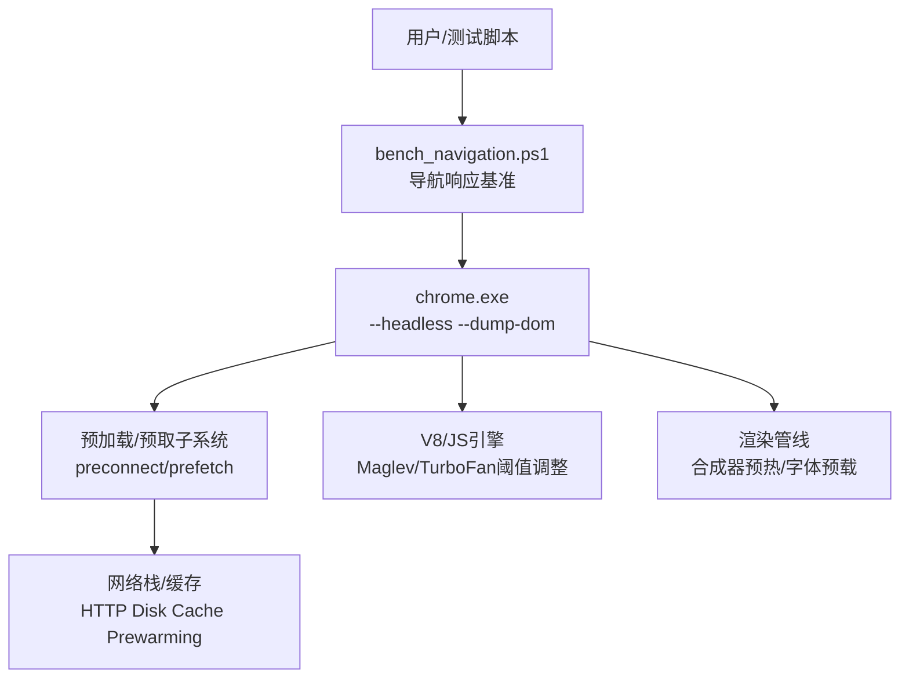
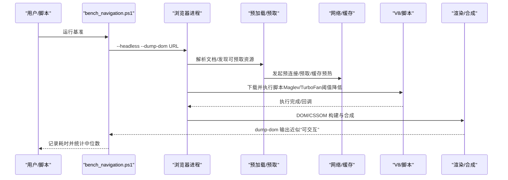
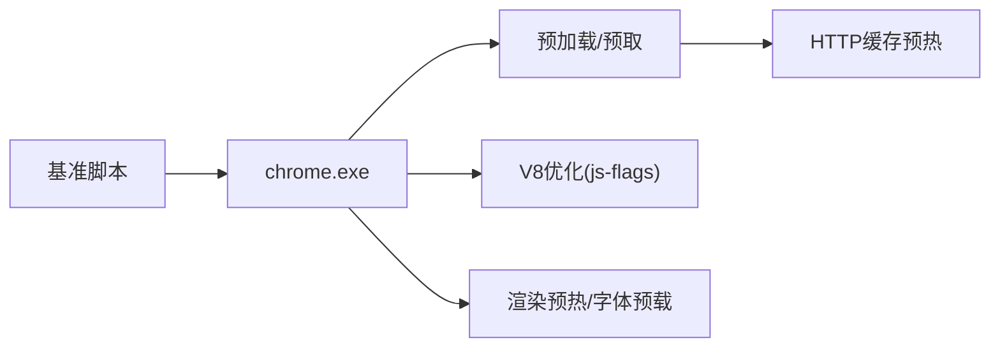

# 页面导航性能诊断

本文引用的文件

- [bench_navigation.ps1](https://github.com/Mcloud136/Mcloud-Browser/blob/main/benchmark/bench_navigation.ps1)
- [run_baseline.ps1](https://github.com/Mcloud136/Mcloud-Browser/blob/main/benchmark/run_baseline.ps1)
- [bench_startup.ps1](https://github.com/Mcloud136/Mcloud-Browser/blob/main/benchmark/bench_startup.ps1)
- [bench_memory.ps1](https://github.com/Mcloud136/Mcloud-Browser/blob/main/benchmark/bench_memory.ps1)
- [README.md](https://github.com/Mcloud136/Mcloud-Browser/blob/main/README.md)
- [mcloud_flags.txt](https://github.com/Mcloud136/Mcloud-Browser/blob/main/mcloud_flags.txt)
- [M151-opt-benchmark.md](https://github.com/Mcloud136/Mcloud-Browser/blob/main/docs/dev-logs/M151-opt-benchmark.md)
- [features.cc](https://github.com/Mcloud136/Mcloud-Browser/blob/main/src/third_party/blink/common/features.cc)
- [BUILD.gn（预加载/预取）](https://github.com/Mcloud136/Mcloud-Browser/blob/main/src/content/browser/BUILD.gn)
- [load_flags_list.h](https://github.com/Mcloud136/Mcloud-Browser/blob/main/src/net/base/load_flags_list.h)

## 目录
1. [简介](#简介)
2. [项目结构](#项目结构)
3. [核心组件](#核心组件)
4. [架构总览](#架构总览)
5. [详细组件分析](#详细组件分析)
6. [依赖关系分析](#依赖关系分析)
7. [性能考量](#性能考量)
8. [故障排查指南](#故障排查指南)
9. [结论](#结论)
10. [附录](#附录)

## 简介
本指南面向 MCloud Browser 的页面导航性能诊断与优化，聚焦“打开页面”的端到端耗时与资源利用。内容涵盖：
- 关键指标定义与测量方法：首字节时间、DOM 构建时间、渲染完成时间等；
- 基准工具 bench_navigation.ps1 的使用方法与结果解读；
- 影响页面加载的关键因素：网络请求、资源加载、JavaScript 执行、CSS 处理；
- 可落地的优化策略：预连接、资源预取、缓存优化、代码分割等；
- 不同网站类型与场景下的调优建议。

## 项目结构
本项目在 benchmark 目录下提供一套可复现的基准工具链，用于采集启动、内存、体积与导航响应等指标；在 src 中实现预加载/预取/缓存等底层能力；在 docs 中沉淀基准报告与优化决策。

图表来源
- [bench_navigation.ps1:1-109](https://github.com/Mcloud136/Mcloud-Browser/blob/main/benchmark/bench_navigation.ps1#L1-L109)
- [features.cc:1434-1509](https://github.com/Mcloud136/Mcloud-Browser/blob/main/src/third_party/blink/common/features.cc#L1434-L1509)
- [BUILD.gn（预加载/预取）:1578-1652](https://github.com/Mcloud136/Mcloud-Browser/blob/main/src/content/browser/BUILD.gn#L1578-L1652)

章节来源
- [bench_navigation.ps1:1-109](https://github.com/Mcloud136/Mcloud-Browser/blob/main/benchmark/bench_navigation.ps1#L1-L109)
- [README.md:61-177](https://github.com/Mcloud136/Mcloud-Browser/blob/main/README.md#L61-L177)

## 核心组件
- 导航响应基准：bench_navigation.ps1，通过 headless + dump-dom 测量“打开页面”耗时，对比启用/禁用预载类 feature 的中位数差异。
- 一键基线：run_baseline.ps1，串联 K1/K2/K7 自动化采集并生成报告。
- 启动基准：bench_startup.ps1，冷启动到主窗口可交互的代理指标。
- 内存基准：bench_memory.ps1，固定标签集驻留工作集采样。
- 运行时标志：mcloud_flags.txt，注入预连接、预取、缓存预热、V8 加速等开关。
- 底层能力：Blink features 与 content 预加载/预取模块，提供 HTTP 磁盘缓存预热、预连接、预取调度等。

章节来源
- [bench_navigation.ps1:16-109](https://github.com/Mcloud136/Mcloud-Browser/blob/main/benchmark/bench_navigation.ps1#L16-L109)
- [run_baseline.ps1:1-78](https://github.com/Mcloud136/Mcloud-Browser/blob/main/benchmark/run_baseline.ps1#L1-L78)
- [bench_startup.ps1:1-70](https://github.com/Mcloud136/Mcloud-Browser/blob/main/benchmark/bench_startup.ps1#L1-L70)
- [bench_memory.ps1:1-78](https://github.com/Mcloud136/Mcloud-Browser/blob/main/benchmark/bench_memory.ps1#L1-L78)
- [mcloud_flags.txt:27-81](https://github.com/Mcloud136/Mcloud-Browser/blob/main/mcloud_flags.txt#L27-L81)
- [features.cc:1434-1509](https://github.com/Mcloud136/Mcloud-Browser/blob/main/src/third_party/blink/common/features.cc#L1434-L1509)

## 架构总览
下图展示从触发导航到页面可交互的关键路径，以及各优化点如何介入：

图表来源
- [bench_navigation.ps1:54-91](https://github.com/Mcloud136/Mcloud-Browser/blob/main/benchmark/bench_navigation.ps1#L54-L91)
- [features.cc:1434-1509](https://github.com/Mcloud136/Mcloud-Browser/blob/main/src/third_party/blink/common/features.cc#L1434-L1509)
- [BUILD.gn（预加载/预取）:1578-1652](https://github.com/Mcloud136/Mcloud-Browser/blob/main/src/content/browser/BUILD.gn#L1578-L1652)

## 详细组件分析

### 导航基准工具 bench_navigation.ps1
- 目的：验证预载/预连接类 feature 对“打开页面”的响应速度收益。
- 方法：同一构建下对比两种模式：
  - 模式 A（默认）：内置 flags 全部生效（含预载类）。
  - 模式 B（禁用预载）：命令行 --disable-features 禁用一组预载类。
- 流程：每种模式先用同一 profile 预热一遍 URL 列表（建立预测器/预连接/缓存状态），再测 N 轮，取中位数。
- 参数：
  - ChromeExe：浏览器可执行路径。
  - Runs：重复次数（默认 3）。
- 输出：按站点打印 on/off 的中位数及差异百分比，负值表示预载更快。

图表来源
- [bench_navigation.ps1:48-109](https://github.com/Mcloud136/Mcloud-Browser/blob/main/benchmark/bench_navigation.ps1#L48-L109)

章节来源
- [bench_navigation.ps1:1-109](https://github.com/Mcloud136/Mcloud-Browser/blob/main/benchmark/bench_navigation.ps1#L1-L109)

### 一键基线与单项基准
- run_baseline.ps1：自动执行 K1（冷启动）、K2（内存）、K7（体积），并生成 Markdown 报告。
- bench_startup.ps1：冷启动到主窗口可交互的代理指标（WaitForInputIdle）。
- bench_memory.ps1：固定标签数驻留后对工作集合求和，支持额外 flags 与自定义 URL 列表。

章节来源
- [run_baseline.ps1:1-78](https://github.com/Mcloud136/Mcloud-Browser/blob/main/benchmark/run_baseline.ps1#L1-L78)
- [bench_startup.ps1:1-70](https://github.com/Mcloud136/Mcloud-Browser/blob/main/benchmark/bench_startup.ps1#L1-L70)
- [bench_memory.ps1:1-78](https://github.com/Mcloud136/Mcloud-Browser/blob/main/benchmark/bench_memory.ps1#L1-L78)

### 预加载/预取与缓存预热
- 预连接/预取：content 层提供 preconnect/prefetch 服务，负责探测、调度与命中。
- HTTP 磁盘缓存预热：通过 Blink feature 控制历史大小、滑动窗口、触发时机等参数。
- 预加载流水线：包含锚点交互、预连接管理器、预取容器、请求拦截器等。

章节来源
- [BUILD.gn（预加载/预取）:1578-1652](https://github.com/Mcloud136/Mcloud-Browser/blob/main/src/content/browser/BUILD.gn#L1578-L1652)
- [features.cc:1434-1509](https://github.com/Mcloud136/Mcloud-Browser/blob/main/src/third_party/blink/common/features.cc#L1434-L1509)

### V8 脚本执行加速
- 通过 js-flags 降低 Maglev/TurboFan 编译阈值，使脚本更早进入优化编译。
- 配合 OSR-from-Maglev 与 Sparkplug 动态修补，提升热点路径执行效率。

章节来源
- [README.md:89-97](https://github.com/Mcloud136/Mcloud-Browser/blob/main/README.md#L89-L97)
- [mcloud_flags.txt:54-57](https://github.com/Mcloud136/Mcloud-Browser/blob/main/mcloud_flags.txt#L54-L57)

### 启动与渲染预热
- 新标签页/书签栏合成器预热，减少首帧等待。
- 系统字体预载，避免首次绘制阻塞。
- BackForwardCache 与媒体相关优化，改善回退/前进与视频播放体验。

章节来源
- [README.md:73-117](https://github.com/Mcloud136/Mcloud-Browser/blob/main/README.md#L73-L117)
- [mcloud_flags.txt:59-81](https://github.com/Mcloud136/Mcloud-Browser/blob/main/mcloud_flags.txt#L59-L81)

## 依赖关系分析
- 基准脚本依赖浏览器可执行与 headless 模式，通过命令行注入 flags 或禁用 features。
- 预加载/预取子系统依赖网络栈与缓存层，受 HTTP 缓存预热策略影响。
- V8 优化通过 js-flags 注入子进程，影响脚本执行阶段。
- 渲染预热与字体预载影响首屏合成与文本绘制。

图表来源
- [bench_navigation.ps1:54-91](https://github.com/Mcloud136/Mcloud-Browser/blob/main/benchmark/bench_navigation.ps1#L54-L91)
- [features.cc:1434-1509](https://github.com/Mcloud136/Mcloud-Browser/blob/main/src/third_party/blink/common/features.cc#L1434-L1509)
- [mcloud_flags.txt:54-81](https://github.com/Mcloud136/Mcloud-Browser/blob/main/mcloud_flags.txt#L54-L81)

章节来源
- [bench_navigation.ps1:16-109](https://github.com/Mcloud136/Mcloud-Browser/blob/main/benchmark/bench_navigation.ps1#L16-L109)
- [mcloud_flags.txt:27-81](https://github.com/Mcloud136/Mcloud-Browser/blob/main/mcloud_flags.txt#L27-L81)

## 性能考量
- 首字节时间（TTFB）：受 DNS、TLS握手、服务器响应影响；可通过异步 DNS、早期数据、预连接缩短。
- DOM 构建时间：受 HTML 解析、脚本阻塞、样式表解析影响；可通过内联脚本缓存、线程化 preload 扫描、延迟非关键脚本缓解。
- 渲染完成时间：受 CSSOM、布局、绘制、合成影响；可通过合成器预热、零拷贝渲染、GPU 光栅化提升。
- 资源加载：图片/字体/媒体优先；可通过 AVIF、预连接 LCP 源、HTTP 磁盘缓存预热降低重复开销。
- JavaScript 执行：通过降低 Maglev/TurboFan 阈值、OSR 升级、Sparkplug 提升热点路径性能。
- 缓存策略：BackForwardCache、仅从缓存、跳过缓存校验等 load flags 控制缓存行为。

章节来源
- [README.md:61-177](https://github.com/Mcloud136/Mcloud-Browser/blob/main/README.md#L61-L177)
- [load_flags_list.h:30-62](https://github.com/Mcloud136/Mcloud-Browser/blob/main/src/net/base/load_flags_list.h#L30-L62)

## 故障排查指南
- 基准无法运行：确认 chrome.exe 路径正确、headless 可用、无其他浏览器实例占用。
- 结果不稳定：确保每次使用全新 user-data-dir，关闭无关进程，电源模式设为高性能。
- 预载收益不明显：单页一次性加载场景预载收益有限，真实收益在重复导航/预测命中场景；参考基准报告的“下界参考”。
- 内存偏高：评估移除高内存代价的预载项（如多备用渲染进程、预测预取、新标签页预渲染触发），结合内存基准验证。
- 安装版差异：安装路径更深或委托启动可能影响绝对值，跨形态对比需注明环境。

章节来源
- [bench_navigation.ps1:93-109](https://github.com/Mcloud136/Mcloud-Browser/blob/main/benchmark/bench_navigation.ps1#L93-L109)
- [M151-opt-benchmark.md:34-78](https://github.com/Mcloud136/Mcloud-Browser/blob/main/docs/dev-logs/M151-opt-benchmark.md#L34-L78)

## 结论
- 导航响应基准提供了可复现的“打开页面”耗时对比方法，适合验证预载/预连接类 feature 的收益。
- 预载类优化以内存换取速度，需结合业务场景权衡；保留低内存代价且有效的项目，移除高内存低收益项。
- 通过预连接、预取、缓存预热、V8 加速与渲染预热，可在不同阶段显著降低页面加载时延。
- 建议在 CI 中集成 K1/K2/K7 与导航基准，持续回归性能变化。

## 附录

### 关键指标与测量建议
- 首字节时间（TTFB）：关注 DNS、TLS、服务端处理；可使用异步 DNS、Early Data、预连接目标域。
- DOM 构建时间：减少脚本阻塞、合并/压缩资源、启用内联脚本缓存与线程化 preload 扫描。
- 渲染完成时间：启用 GPU 光栅化、零拷贝渲染、合成器预热；优化首屏关键资源优先级。
- 实际站点差异：不同站点资源结构与第三方脚本差异大，需结合 Lighthouse/Speedometer/JetStream 综合评估。

章节来源
- [README.md:61-177](https://github.com/Mcloud136/Mcloud-Browser/blob/main/README.md#L61-L177)
- [M151-opt-benchmark.md:34-78](https://github.com/Mcloud136/Mcloud-Browser/blob/main/docs/dev-logs/M151-opt-benchmark.md#L34-L78)

### 优化策略清单
- 预连接：对关键域名提前建立 TCP/TLS 连接，减少后续请求握手开销。
- 资源预取：基于导航意图与锚点交互，提前拉取关键资源；注意命中率与内存代价。
- 缓存优化：启用 HTTP 磁盘缓存预热、BackForwardCache、合理设置缓存头；必要时跳过/仅用缓存。
- 代码分割：拆分首屏与非关键脚本，延迟加载非关键资源，降低首屏阻塞。
- 媒体优化：启用硬件解码、MSE 缓冲优化、按需加载视频片段。
- 字体优化：预载系统字体，避免首次绘制闪烁与阻塞。

章节来源
- [mcloud_flags.txt:27-81](https://github.com/Mcloud136/Mcloud-Browser/blob/main/mcloud_flags.txt#L27-L81)
- [features.cc:1434-1509](https://github.com/Mcloud136/Mcloud-Browser/blob/main/src/third_party/blink/common/features.cc#L1434-L1509)
- [load_flags_list.h:30-62](https://github.com/Mcloud136/Mcloud-Browser/blob/main/src/net/base/load_flags_list.h#L30-L62)

### 不同网站类型的调优建议
- 电商/资讯类：首屏关键资源优先，启用预连接与预取；图片采用现代格式（AVIF）；懒加载非首屏内容。
- 视频/直播类：启用 MSE 优化、硬件解码、分片加载；避免首屏阻塞脚本。
- 管理后台/工具类：精简首屏脚本，启用代码分割；利用 BackForwardCache 提升回退/前进体验。
- 静态站点：强化缓存策略与 CDN；启用预连接与预取以提升二次访问速度。

[本节为通用指导，不直接分析具体文件]