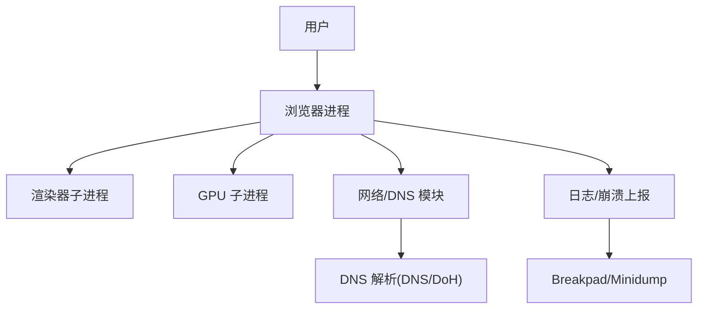
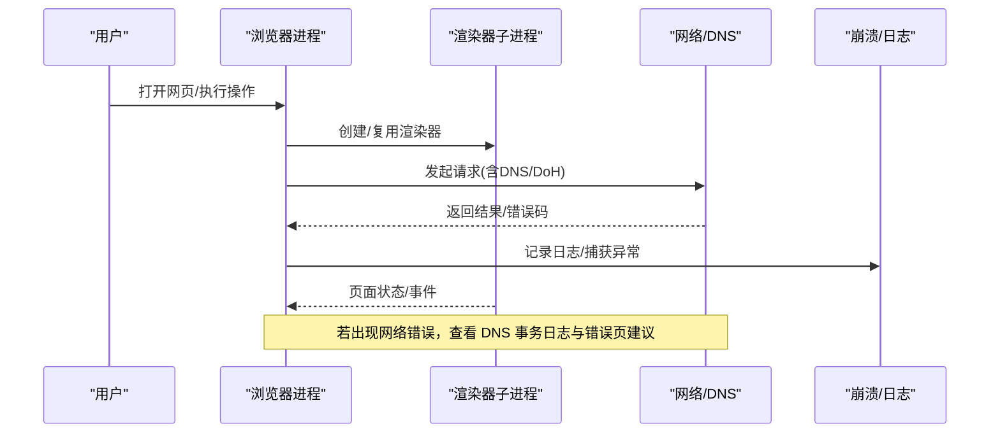
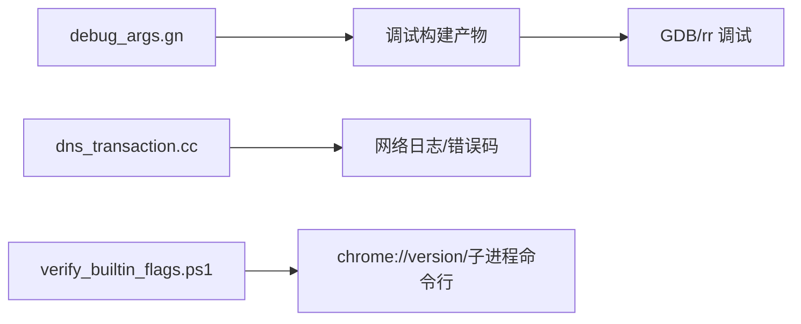

# 故障排除

本文引用的文件

- [README.md](https://github.com/Mcloud136/Mcloud-Browser/blob/main/README.md)
- [docs/FAQ.md](https://github.com/Mcloud136/Mcloud-Browser/blob/main/docs/FAQ.md)
- [infra/DEBUG/DEBUGGING.md](https://github.com/Mcloud136/Mcloud-Browser/blob/main/infra/DEBUG/DEBUGGING.md)
- [infra/DEBUG/README.md](https://github.com/Mcloud136/Mcloud-Browser/blob/main/infra/DEBUG/README.md)
- [infra/DEBUG/debug_args.gn](https://github.com/Mcloud136/Mcloud-Browser/blob/main/infra/DEBUG/debug_args.gn)
- [docs/BUILDING.md](https://github.com/Mcloud136/Mcloud-Browser/blob/main/docs/BUILDING.md)
- [benchmark/tools/verify_builtin_flags.ps1](https://github.com/Mcloud136/Mcloud-Browser/blob/main/benchmark/tools/verify_builtin_flags.ps1)
- [src/net/dns/dns_transaction.cc](https://github.com/Mcloud136/Mcloud-Browser/blob/main/src/net/dns/dns_transaction.cc)
- [src/components/error_page_strings.grdp](https://github.com/Mcloud136/Mcloud-Browser/blob/main/src/components/error_page_strings.grdp)
- [src/chromeos/chromeos_strings.grd](https://github.com/Mcloud136/Mcloud-Browser/blob/main/src/chromeos/chromeos_strings.grd)
- [other/mcloud-2024-ui.patch](https://github.com/Mcloud136/Mcloud-Browser/blob/main/other/mcloud-2024-ui.patch)

## 目录
1. [简介](#简介)
2. [项目结构](#项目结构)
3. [核心组件](#核心组件)
4. [架构总览](#架构总览)
5. [详细组件分析](#详细组件分析)
6. [依赖关系分析](#依赖关系分析)
7. [性能注意事项](#性能注意事项)
8. [故障排除指南](#故障排除指南)
9. [结论](#结论)
10. [附录](#附录)

## 简介
本指南面向 MCloud Browser 的构建、运行与排障，覆盖常见问题定位、调试环境搭建（含符号与日志）、性能问题诊断（内存/CPU/渲染瓶颈）、网络问题排查、崩溃分析与堆栈转储处理，以及社区支持与反馈流程。内容基于仓库内文档与脚本，提供可操作的步骤与参考路径。

## 项目结构
MCloud Browser 在仓库中提供了完善的调试与构建基础设施：
- 调试与符号：infra/DEBUG 下包含调试构建参数、说明与脚本；DEBUGGING.md 提供 Linux 调试要点（GDB、Core、Breakpad、rr 等）。
- 构建与发布：docs/BUILDING.md、README.md 提供构建步骤、GN 参数与验证脚本。
- 基准与验证：benchmark/tools/verify_builtin_flags.ps1 用于验证内置标志注入是否生效。
- 网络与错误提示：net/dns 相关源码与 error page strings 提供网络错误建议文案与 DNS 事务实现细节。
- 用户态调试增强：other/mcloud-2024-ui.patch 为调试构建开启更多堆栈信息并调整 DCHECK 行为，便于收集问题数据。

图表来源
- [infra/DEBUG/DEBUGGING.md:1-120](https://github.com/Mcloud136/Mcloud-Browser/blob/main/infra/DEBUG/DEBUGGING.md#L1-L120)
- [src/net/dns/dns_transaction.cc:74-108](https://github.com/Mcloud136/Mcloud-Browser/blob/main/src/net/dns/dns_transaction.cc#L74-L108)

章节来源
- [infra/DEBUG/README.md:1-16](https://github.com/Mcloud136/Mcloud-Browser/blob/main/infra/DEBUG/README.md#L1-L16)
- [docs/BUILDING.md:122-160](https://github.com/Mcloud136/Mcloud-Browser/blob/main/docs/BUILDING.md#L122-L160)
- [README.md:194-264](https://github.com/Mcloud136/Mcloud-Browser/blob/main/README.md#L194-L264)

## 核心组件
- 调试构建与符号
  - 使用 debug_args.gn 生成带符号的调试构建，symbol_level=2，关闭剥离，启用 dcheck_always_on，便于定位问题。
  - 通过 DEBUGGING.md 了解 GDB、Core dump、Breakpad minidump、rr 时间旅行调试等方法。
- 启动标志注入验证
  - verify_builtin_flags.ps1 以 headless 模式抓取 chrome://version 或探测子进程命令行，验证内置标志是否注入成功。
- 网络与 DNS
  - dns_transaction.cc 实现 DNS 事务与 DoH 探测，记录失败与超时统计，有助于网络问题定位。
- 错误页建议
  - error_page_strings.grdp 提供“检查代理、防火墙、DNS”的建议文案，指导用户进行基础网络排查。
- 调试构建增强
  - mcloud-2024-ui.patch 在调试构建中启用日志中的堆栈跟踪，并将非致命 DCHECK 不直接终止，便于收集必要数据。

章节来源
- [infra/DEBUG/debug_args.gn:15-27](https://github.com/Mcloud136/Mcloud-Browser/blob/main/infra/DEBUG/debug_args.gn#L15-L27)
- [infra/DEBUG/DEBUGGING.md:1-120](https://github.com/Mcloud136/Mcloud-Browser/blob/main/infra/DEBUG/DEBUGGING.md#L1-L120)
- [benchmark/tools/verify_builtin_flags.ps1:1-98](https://github.com/Mcloud136/Mcloud-Browser/blob/main/benchmark/tools/verify_builtin_flags.ps1#L1-L98)
- [src/net/dns/dns_transaction.cc:74-108](https://github.com/Mcloud136/Mcloud-Browser/blob/main/src/net/dns/dns_transaction.cc#L74-L108)
- [src/components/error_page_strings.grdp:296-305](https://github.com/Mcloud136/Mcloud-Browser/blob/main/src/components/error_page_strings.grdp#L296-L305)
- [other/mcloud-2024-ui.patch:13-56](https://github.com/Mcloud136/Mcloud-Browser/blob/main/other/mcloud-2024-ui.patch#L13-L56)

## 架构总览
下图展示浏览器进程、渲染器/GPU 子进程、网络/DNS 模块与崩溃/日志子系统之间的交互关系，便于理解问题定位的切入点。

图表来源
- [src/net/dns/dns_transaction.cc:74-108](https://github.com/Mcloud136/Mcloud-Browser/blob/main/src/net/dns/dns_transaction.cc#L74-L108)
- [infra/DEBUG/DEBUGGING.md:463-487](https://github.com/Mcloud136/Mcloud-Browser/blob/main/infra/DEBUG/DEBUGGING.md#L463-L487)

## 详细组件分析

### 构建与调试环境搭建
- 目标
  - 快速搭建可调试的构建，获取完整符号，配置日志与崩溃转储，以便复现与定位问题。
- 关键步骤
  - 使用 debug_args.gn 生成调试构建，确保 symbol_level=2、enable_stripping=false、dcheck_always_on=true。
  - 在 Linux 上使用 GDB 附加主进程或渲染器进程；必要时使用 --no-sandbox 或 --allow-sandbox-debugging。
  - 启用 Core dump（ulimit -c unlimited）或使用 Breakpad minidump；Linux 下可使用 rr 进行时间旅行调试。
  - Windows 平台可结合 WinDbg 与符号服务器（仓库文档链接至官方调试指引）。
- 参考路径
  - 调试构建参数与说明：[debug_args.gn:15-27](https://github.com/Mcloud136/Mcloud-Browser/blob/main/infra/DEBUG/debug_args.gn#L15-L27)
  - Linux 调试要点（GDB/Core/Breakpad/rr）：[DEBUGGING.md:1-120](https://github.com/Mcloud136/Mcloud-Browser/blob/main/infra/DEBUG/DEBUGGING.md#L1-L120)
  - 构建与 GN 参数设置：[BUILDING.md:122-160](https://github.com/Mcloud136/Mcloud-Browser/blob/main/docs/BUILDING.md#L122-L160)

章节来源
- [infra/DEBUG/debug_args.gn:15-27](https://github.com/Mcloud136/Mcloud-Browser/blob/main/infra/DEBUG/debug_args.gn#L15-L27)
- [infra/DEBUG/DEBUGGING.md:1-120](https://github.com/Mcloud136/Mcloud-Browser/blob/main/infra/DEBUG/DEBUGGING.md#L1-L120)
- [docs/BUILDING.md:122-160](https://github.com/Mcloud136/Mcloud-Browser/blob/main/docs/BUILDING.md#L122-L160)

### 启动标志注入验证
- 目标
  - 确认内置性能优化标志已正确注入到浏览器及子进程命令行。
- 方法
  - 使用 verify_builtin_flags.ps1 以 headless 模式抓取 chrome://version 或探测子进程命令行，检查代表 feature 是否存在。
  - 若 headless 路径未确认，脚本会回退到子进程命令行探测。
- 参考路径
  - 验证脚本与用法：[verify_builtin_flags.ps1:1-98](https://github.com/Mcloud136/Mcloud-Browser/blob/main/benchmark/tools/verify_builtin_flags.ps1#L1-L98)

章节来源
- [benchmark/tools/verify_builtin_flags.ps1:1-98](https://github.com/Mcloud136/Mcloud-Browser/blob/main/benchmark/tools/verify_builtin_flags.ps1#L1-L98)

### 日志收集与分析
- 目标
  - 收集足够详细的日志以定位问题（包括 LOG/VLOG、IPC 日志、网络日志）。
- 方法
  - 使用 --log-level=0 与 --enable-logging=stderr 输出所有 LOG 消息；如需 VLOG，添加 --v=1。
  - 通过环境变量 CHROME_IPC_LOGGING=1 输出 IPC 调试消息。
  - 在 Linux 下结合 GDB 与 rr 进行更深入的调用链分析。
- 参考路径
  - 日志开关与 IPC 日志：[DEBUGGING.md:463-487](https://github.com/Mcloud136/Mcloud-Browser/blob/main/infra/DEBUG/DEBUGGING.md#L463-L487)

章节来源
- [infra/DEBUG/DEBUGGING.md:463-487](https://github.com/Mcloud136/Mcloud-Browser/blob/main/infra/DEBUG/DEBUGGING.md#L463-L487)

### 崩溃分析与堆栈转储
- 目标
  - 获取并分析崩溃堆栈，定位崩溃点与上下文。
- 方法
  - Linux：启用 Core dump（ulimit -c unlimited），对沙箱子进程可能需要 --allow-sandbox-debugging；也可使用 Breakpad minidump。
  - 使用 minidump_to_core 工具将 minidump 转换为 core 以便 GDB 分析。
  - Windows：结合 WinDbg 与符号服务器加载符号进行分析（参考仓库文档链接）。
- 参考路径
  - Core dump 与 Breakpad minidump：[DEBUGGING.md:351-366](https://github.com/Mcloud136/Mcloud-Browser/blob/main/infra/DEBUG/DEBUGGING.md#L351-L366)

章节来源
- [infra/DEBUG/DEBUGGING.md:351-366](https://github.com/Mcloud136/Mcloud-Browser/blob/main/infra/DEBUG/DEBUGGING.md#L351-L366)

### 性能问题诊断（内存/CPU/渲染）
- 目标
  - 识别内存泄漏、CPU 高占用、渲染卡顿等性能瓶颈。
- 方法
  - 内存：使用 DevTools Memory 面板采集堆快照，对比不同时间点差异；结合任务管理器观察驻留内存变化。
  - CPU：使用 DevTools Performance 面板录制性能，关注长任务、布局抖动与合成阻塞；在 Linux 可用 perf/火焰图。
  - 渲染：启用 GPU 光栅化与零拷贝相关标志；使用 SkiaGraphitePrecompilation 消除着色器编译卡顿（见 README 优化项）。
  - 标签页冻结与内存回收：InfiniteTabsFreezing、ReclaimOldPrepaintTiles 等标志有助于降低多标签场景内存压力。
- 参考路径
  - 运行时优化标志与效果：[README.md:61-176](https://github.com/Mcloud136/Mcloud-Browser/blob/main/README.md#L61-L176)
  - 调试构建参数（便于性能采样）：[debug_args.gn:15-27](https://github.com/Mcloud136/Mcloud-Browser/blob/main/infra/DEBUG/debug_args.gn#L15-L27)

章节来源
- [README.md:61-176](https://github.com/Mcloud136/Mcloud-Browser/blob/main/README.md#L61-L176)
- [infra/DEBUG/debug_args.gn:15-27](https://github.com/Mcloud136/Mcloud-Browser/blob/main/infra/DEBUG/debug_args.gn#L15-L27)

### 网络问题排查
- 目标
  - 定位 DNS 解析失败、代理配置错误、防火墙拦截等问题。
- 方法
  - 查看错误页建议文案（检查代理、防火墙、DNS）。
  - 启用网络日志与 DNS 事务日志，关注 ERR_NAME_NOT_RESOLVED、ERR_DNS_SERVER_FAILED、超时等错误码。
  - 在 Linux 下可通过 xtrace、--sync 同步 X 调用，辅助定位图形层导致的网络交互问题。
- 参考路径
  - 错误页建议文案：[error_page_strings.grdp:296-305](https://github.com/Mcloud136/Mcloud-Browser/blob/main/src/components/error_page_strings.grdp#L296-L305)
  - DNS 事务与错误码处理：[dns_transaction.cc:650-668](https://github.com/Mcloud136/Mcloud-Browser/blob/main/src/net/dns/dns_transaction.cc#L650-L668)

章节来源
- [src/components/error_page_strings.grdp:296-305](https://github.com/Mcloud136/Mcloud-Browser/blob/main/src/components/error_page_strings.grdp#L296-L305)
- [src/net/dns/dns_transaction.cc:650-668](https://github.com/Mcloud136/Mcloud-Browser/blob/main/src/net/dns/dns_transaction.cc#L650-L668)

### 调试环境增强（调试构建）
- 目标
  - 在不引入复杂调试器的情况下，尽可能多地收集堆栈与断言信息，便于问题上报与复现。
- 方法
  - 使用 mcloud-2024-ui.patch 在调试构建中启用日志堆栈跟踪，并将非致命 DCHECK 不直接终止，便于继续收集数据。
- 参考路径
  - 调试构建增强补丁：[mcloud-2024-ui.patch:13-56](https://github.com/Mcloud136/Mcloud-Browser/blob/main/other/mcloud-2024-ui.patch#L13-L56)

章节来源
- [other/mcloud-2024-ui.patch:13-56](https://github.com/Mcloud136/Mcloud-Browser/blob/main/other/mcloud-2024-ui.patch#L13-L56)

## 依赖关系分析
- 调试构建依赖
  - debug_args.gn 控制符号级别、调试开关与编译器选项，直接影响后续 GDB/rr 的使用体验。
- 网络模块依赖
  - dns_transaction.cc 依赖 net_log 与 DoH 探测逻辑，影响网络问题的可观测性。
- 验证脚本依赖
  - verify_builtin_flags.ps1 依赖 Chrome 的 headless 能力与 chrome://version 页面，用于验证标志注入。

图表来源
- [infra/DEBUG/debug_args.gn:15-27](https://github.com/Mcloud136/Mcloud-Browser/blob/main/infra/DEBUG/debug_args.gn#L15-L27)
- [src/net/dns/dns_transaction.cc:74-108](https://github.com/Mcloud136/Mcloud-Browser/blob/main/src/net/dns/dns_transaction.cc#L74-L108)
- [benchmark/tools/verify_builtin_flags.ps1:1-98](https://github.com/Mcloud136/Mcloud-Browser/blob/main/benchmark/tools/verify_builtin_flags.ps1#L1-L98)

章节来源
- [infra/DEBUG/debug_args.gn:15-27](https://github.com/Mcloud136/Mcloud-Browser/blob/main/infra/DEBUG/debug_args.gn#L15-L27)
- [src/net/dns/dns_transaction.cc:74-108](https://github.com/Mcloud136/Mcloud-Browser/blob/main/src/net/dns/dns_transaction.cc#L74-L108)
- [benchmark/tools/verify_builtin_flags.ps1:1-98](https://github.com/Mcloud136/Mcloud-Browser/blob/main/benchmark/tools/verify_builtin_flags.ps1#L1-L98)

## 性能注意事项
- 启动速度
  - 利用 SendGPUChannelEarly、DeferSpeculativeRFHCreation、InitialWebUI 等标志减少首屏阻塞。
- 页面加载
  - ThreadedPreloadScanner、ConsumeCodeCacheOffThread、InlineScriptCache 提升加载效率。
- 内存管理
  - DiscardOnCommitLimit、SustainedPMUrgentDiscarding、PartitionAllocSortActiveSlotSpans 降低内存占用与碎片。
- 多线程与渲染
  - IOThreadInteractiveThreadType、MojoDedicatedThread、SkiaGraphitePrecompilation 改善响应性与渲染稳定性。
- 视频/媒体
  - DedicatedMediaServiceThread、DirectOpusAudioDecoding、PlatformHEVCDecoderSupport 提升媒体播放流畅度。
- 网络
  - BackForwardCache、AsyncDns、EarlyData、BookmarkTriggerForPrefetch 加速导航与预取。

章节来源
- [README.md:61-176](https://github.com/Mcloud136/Mcloud-Browser/blob/main/README.md#L61-L176)

## 故障排除指南

### 常见构建问题
- 现象
  - 构建失败、符号缺失、调试器无法附加、安装程序不可用。
- 排查步骤
  - 确认使用 debug_args.gn 生成调试构建，symbol_level=2，enable_stripping=false。
  - 在 Linux 上启用 Core dump 并使用 GDB 附加；必要时使用 --no-sandbox 或 --allow-sandbox-debugging。
  - 使用 docs/BUILDING.md 中的 GN 参数与构建脚本，确保依赖与环境正确。
- 参考路径
  - 调试构建参数：[debug_args.gn:15-27](https://github.com/Mcloud136/Mcloud-Browser/blob/main/infra/DEBUG/debug_args.gn#L15-L27)
  - 构建说明：[BUILDING.md:122-160](https://github.com/Mcloud136/Mcloud-Browser/blob/main/docs/BUILDING.md#L122-L160)

章节来源
- [infra/DEBUG/debug_args.gn:15-27](https://github.com/Mcloud136/Mcloud-Browser/blob/main/infra/DEBUG/debug_args.gn#L15-L27)
- [docs/BUILDING.md:122-160](https://github.com/Mcloud136/Mcloud-Browser/blob/main/docs/BUILDING.md#L122-L160)

### 运行时错误
- 现象
  - 页面白屏、媒体无法播放、扩展加载失败。
- 排查步骤
  - 启用日志（--log-level=0, --enable-logging=stderr, --v=1）与 IPC 日志（CHROME_IPC_LOGGING=1）。
  - 使用 DevTools 检查控制台错误与资源加载状态；必要时切换到单进程模式（--single-process）简化调试。
  - 针对媒体问题，检查硬件解码支持（PlatformHEVCDecoderSupport）与 MSE 相关标志。
- 参考路径
  - 日志与 IPC 日志：[DEBUGGING.md:463-487](https://github.com/Mcloud136/Mcloud-Browser/blob/main/infra/DEBUG/DEBUGGING.md#L463-L487)
  - 媒体优化标志：[README.md:145-156](https://github.com/Mcloud136/Mcloud-Browser/blob/main/README.md#L145-L156)

章节来源
- [infra/DEBUG/DEBUGGING.md:463-487](https://github.com/Mcloud136/Mcloud-Browser/blob/main/infra/DEBUG/DEBUGGING.md#L463-L487)
- [README.md:145-156](https://github.com/Mcloud136/Mcloud-Browser/blob/main/README.md#L145-L156)

### 性能问题
- 现象
  - 启动慢、页面卡顿、内存增长过快、视频播放掉帧。
- 排查步骤
  - 使用 DevTools Performance 录制，定位长任务与布局抖动；检查 GPU 光栅化与零拷贝是否启用。
  - 使用 Memory 面板采集堆快照，对比不同时间点差异，识别潜在泄漏。
  - 启用 InfiniteTabsFreezing、ReclaimOldPrepaintTiles 等标志降低多标签内存压力。
- 参考路径
  - 性能优化标志：[README.md:61-176](https://github.com/Mcloud136/Mcloud-Browser/blob/main/README.md#L61-L176)

章节来源
- [README.md:61-176](https://github.com/Mcloud136/Mcloud-Browser/blob/main/README.md#L61-L176)

### 网络问题
- 现象
  - DNS 解析失败、代理配置错误、网站无法访问。
- 排查步骤
  - 查看错误页建议（检查代理、防火墙、DNS）。
  - 启用网络日志，关注 DNS 事务错误码（ERR_NAME_NOT_RESOLVED、ERR_DNS_SERVER_FAILED、超时）。
  - 在 Linux 下使用 xtrace 或 --sync 同步 X 调用，辅助定位图形层问题。
- 参考路径
  - 错误页建议：[error_page_strings.grdp:296-305](https://github.com/Mcloud136/Mcloud-Browser/blob/main/src/components/error_page_strings.grdp#L296-L305)
  - DNS 事务错误处理：[dns_transaction.cc:650-668](https://github.com/Mcloud136/Mcloud-Browser/blob/main/src/net/dns/dns_transaction.cc#L650-L668)

章节来源
- [src/components/error_page_strings.grdp:296-305](https://github.com/Mcloud136/Mcloud-Browser/blob/main/src/components/error_page_strings.grdp#L296-L305)
- [src/net/dns/dns_transaction.cc:650-668](https://github.com/Mcloud136/Mcloud-Browser/blob/main/src/net/dns/dns_transaction.cc#L650-L668)

### 崩溃分析
- 现象
  - 浏览器崩溃、渲染器崩溃、GPU 进程崩溃。
- 排查步骤
  - 启用 Core dump（ulimit -c unlimited）或使用 Breakpad minidump；对沙箱子进程可能需要 --allow-sandbox-debugging。
  - 使用 minidump_to_core 转换后，通过 GDB 分析堆栈；Windows 使用 WinDbg 与符号服务器。
  - 在调试构建中启用日志堆栈跟踪（mcloud-2024-ui.patch），便于收集必要数据。
- 参考路径
  - Core dump 与 Breakpad：[DEBUGGING.md:351-366](https://github.com/Mcloud136/Mcloud-Browser/blob/main/infra/DEBUG/DEBUGGING.md#L351-L366)
  - 调试构建增强：[mcloud-2024-ui.patch:13-56](https://github.com/Mcloud136/Mcloud-Browser/blob/main/other/mcloud-2024-ui.patch#L13-L56)

章节来源
- [infra/DEBUG/DEBUGGING.md:351-366](https://github.com/Mcloud136/Mcloud-Browser/blob/main/infra/DEBUG/DEBUGGING.md#L351-L366)
- [other/mcloud-2024-ui.patch:13-56](https://github.com/Mcloud136/Mcloud-Browser/blob/main/other/mcloud-2024-ui.patch#L13-L56)

### 社区支持与问题反馈
- 渠道
  - GitHub Issues 与 Discussions（仓库根目录下的 SECURITY.md 与 README 提供链接）。
  - IRC 频道 #mcloud on irc.libera.chat（构建问题时可寻求帮助）。
- 流程
  - 提交前请确认已收集日志、崩溃转储与复现步骤；附上系统信息与构建版本。
  - 遵循仓库的安全与贡献规范，避免泄露敏感信息。
- 参考路径
  - FAQ 与社区信息：[FAQ.md:1-69](https://github.com/Mcloud136/Mcloud-Browser/blob/main/docs/FAQ.md#L1-L69)
  - 构建与调试说明：[BUILDING.md:279-284](https://github.com/Mcloud136/Mcloud-Browser/blob/main/docs/BUILDING.md#L279-L284)

章节来源
- [docs/FAQ.md:1-69](https://github.com/Mcloud136/Mcloud-Browser/blob/main/docs/FAQ.md#L1-L69)
- [docs/BUILDING.md:279-284](https://github.com/Mcloud136/Mcloud-Browser/blob/main/docs/BUILDING.md#L279-L284)

## 结论
通过合理的调试构建、日志与崩溃转储收集、性能指标录制与网络日志分析，可以高效定位 MCloud Browser 的构建、运行与性能问题。建议在日常开发中固定使用 debug_args.gn 生成调试构建，并结合 verify_builtin_flags.ps1 验证标志注入；在网络与媒体问题上，优先检查 DNS 事务与硬件解码支持；在崩溃场景中，尽快收集 Core/minidump 并使用 GDB/WinDbg 分析堆栈。社区支持与 IRC 频道可作为补充渠道。

## 附录
- 常用命令速查（Linux）
  - 启用 Core dump：ulimit -c unlimited
  - 全量日志：--log-level=0 --enable-logging=stderr --v=1
  - IPC 日志：CHROME_IPC_LOGGING=1
  - 单进程模式：--single-process
  - 允许沙箱调试：--allow-sandbox-debugging
- 参考路径
  - 调试构建参数：[debug_args.gn:15-27](https://github.com/Mcloud136/Mcloud-Browser/blob/main/infra/DEBUG/debug_args.gn#L15-L27)
  - 调试指南：[DEBUGGING.md:1-120](https://github.com/Mcloud136/Mcloud-Browser/blob/main/infra/DEBUG/DEBUGGING.md#L1-L120)