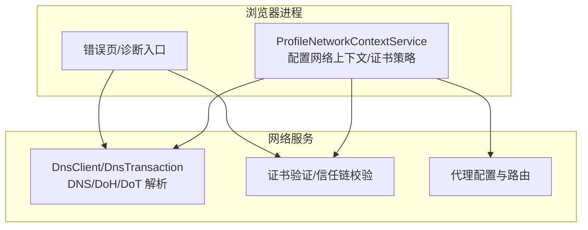
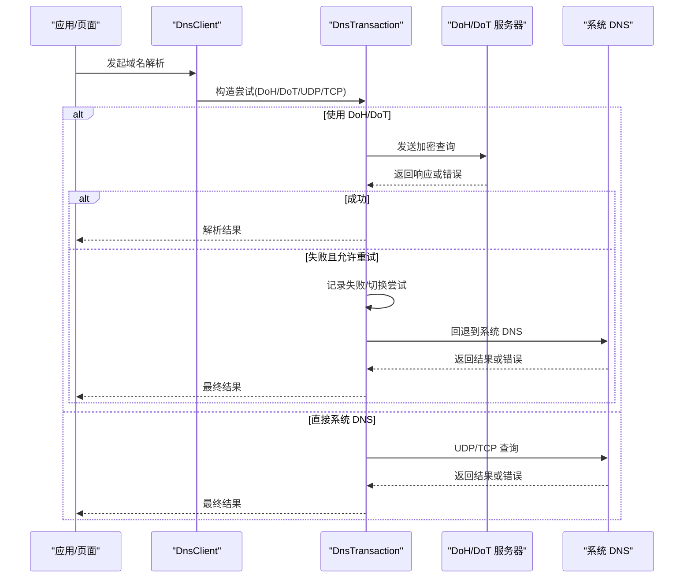
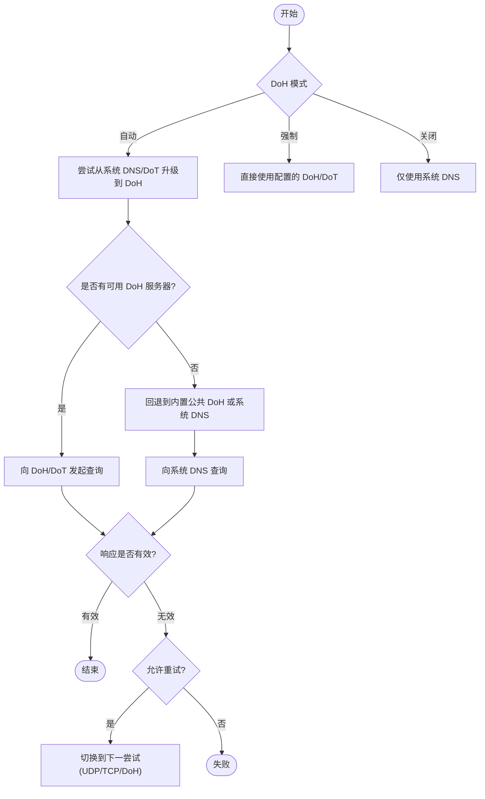
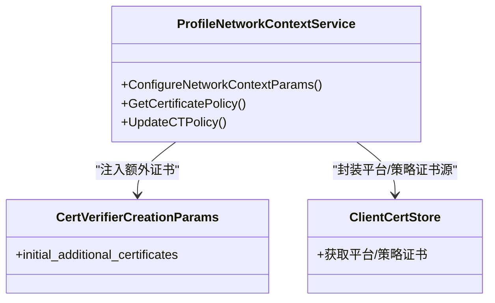
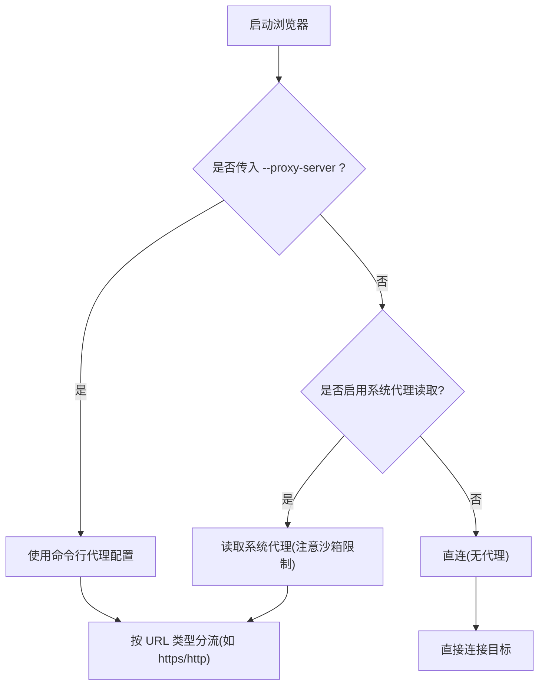
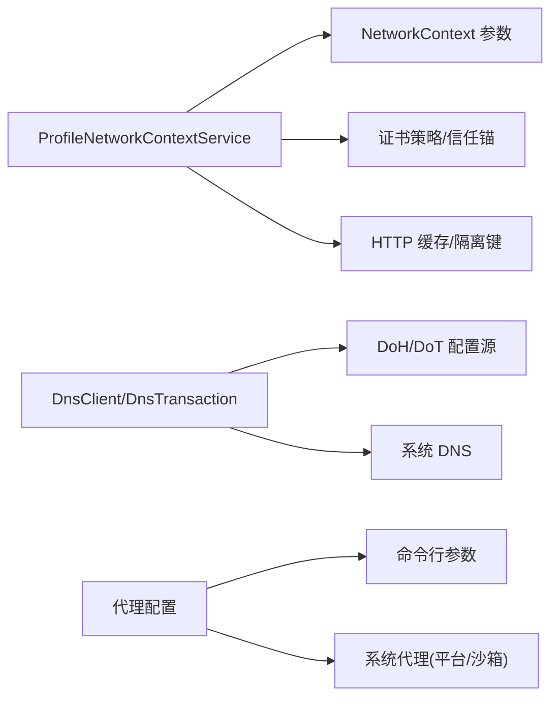

# 网络问题排查

<cite>
**本文引用的文件**
- [profile_network_context_service.cc](file://src/chrome/browser/net/profile_network_context_service.cc)
- [default_dns_over_https_config_source.cc](file://src/chrome/browser/net/default_dns_over_https_config_source.cc)
- [dns_client.cc](file://src/net/dns/dns_client.cc)
- [dns_transaction.cc](file://src/net/dns/dns_transaction.cc)
- [ssl_errors_strings.grdp](file://src/components/ssl_errors_strings.grdp)
- [error_page_strings.grdp](file://src/components/error_page_strings.grdp)
- [manpage.1.in](file://src/chrome/app/resources/manpage.1.in)
- [Add-support-for-respecting-system-proxy-settings-when-runn.patch](file://infra/Flatpak/com.mcloud.browser/patches/chromium/Add-support-for-respecting-system-proxy-settings-when-runn.patch)
- [ui_chromeos_strings.grd](file://src/ui/chromeos/ui_chromeos_strings.grd)
- [chromeos_strings.grd](file://src/chromeos/chromeos_strings.grd)
- [features.cc](file://src/third_party/blink/common/features.cc)
</cite>

## 目录
1. [简介](#简介)
2. [项目结构](#项目结构)
3. [核心组件](#核心组件)
4. [架构总览](#架构总览)
5. [详细组件分析](#详细组件分析)
6. [依赖关系分析](#依赖关系分析)
7. [性能考虑](#性能考虑)
8. [故障排除指南](#故障排除指南)
9. [结论](#结论)
10. [附录](#附录)

## 简介
本指南面向 MCloud Browser 的网络问题排查，覆盖 DNS 解析失败、HTTPS 证书错误、代理配置问题、网络超时等常见场景；提供浏览器开发者工具与抓包工具的实操建议；解释网络优化选项的影响；并给出企业环境下的特殊配置与排障方法。内容基于仓库中的网络栈实现、DNS/DoH 配置、证书策略、错误提示文案以及代理相关补丁进行系统化梳理。

## 项目结构
MCloud Browser 的网络能力由浏览器进程与网络服务协同完成：
- 浏览器侧负责配置网络上下文（NetworkContext）、证书策略、HTTP 缓存、语言与引用头设置等。
- 网络层负责 DNS 解析（含 DoH/DoT）、TLS 握手、代理路由、请求调度与缓存。
- 用户界面通过错误页与诊断链接引导用户或系统工具进行网络诊断。

图表来源
- [profile_network_context_service.cc:1324-1551](file://src/chrome/browser/net/profile_network_context_service.cc#L1324-L1551)
- [dns_client.cc:148-200](file://src/net/dns/dns_client.cc#L148-L200)
- [dns_transaction.cc:650-683](file://src/net/dns/dns_transaction.cc#L650-L683)

章节来源
- [profile_network_context_service.cc:1324-1551](file://src/chrome/browser/net/profile_network_context_service.cc#L1324-L1551)
- [dns_client.cc:148-200](file://src/net/dns/dns_client.cc#L148-L200)
- [dns_transaction.cc:650-683](file://src/net/dns/dns_transaction.cc#L650-L683)

## 核心组件
- 网络上下文与服务配置：负责启用 HTTP 缓存、语言与引用头、认证凭据策略、企业加密缓存开关、按隔离键拆分认证缓存等。
- DNS 与 DoH：支持自动/强制/关闭模式，支持从系统 DNS 升级至 DoH/DoT，并在无可用服务器时回退到已知公共 DoH。
- 证书策略：聚合平台根证书、策略注入的额外证书与受约束信任锚点，影响 HTTPS 握手与信任判断。
- 代理：命令行参数与系统代理读取（Linux Flatpak 沙箱下行为差异），支持 http/socks 系列协议与按 URL 类型分流。
- 错误与诊断：错误页提供“运行网络诊断”链接，Windows 平台可调用系统诊断工具；ChromeOS 提供连通性诊断面板。

章节来源
- [profile_network_context_service.cc:570-636](file://src/chrome/browser/net/profile_network_context_service.cc#L570-L636)
- [profile_network_context_service.cc:1324-1551](file://src/chrome/browser/net/profile_network_context_service.cc#L1324-L1551)
- [default_dns_over_https_config_source.cc:15-76](file://src/chrome/browser/net/default_dns_over_https_config_source.cc#L15-L76)
- [dns_client.cc:70-146](file://src/net/dns/dns_client.cc#L70-L146)
- [manpage.1.in:43-84](file://src/chrome/app/resources/manpage.1.in#L43-L84)
- [Add-support-for-respecting-system-proxy-settings-when-runn.patch:196-231](file://infra/Flatpak/com.mcloud.browser/patches/chromium/Add-support-for-respecting-system-proxy-settings-when-runn.patch#L196-L231)
- [error_page_strings.grdp:316-371](file://src/components/error_page_strings.grdp#L316-L371)
- [ui_chromeos_strings.grd:1721-1734](file://src/ui/chromeos/ui_chromeos_strings.grd#L1721-L1734)
- [chromeos_strings.grd:1468-1490](file://src/chromeos/chromeos_strings.grd#L1468-L1490)

## 架构总览
下图展示一次带 DoH 的 DNS 解析流程，包括失败重试与回退逻辑。

图表来源
- [dns_client.cc:70-146](file://src/net/dns/dns_client.cc#L70-L146)
- [dns_transaction.cc:650-683](file://src/net/dns/dns_transaction.cc#L650-L683)

## 详细组件分析

### DNS 与 DoH/DoT 解析
- 自动升级：当系统 DNS 为本地或非公开地址且未显式指定 DoH 时，会尝试将 DoT 主机名或系统 nameserver 升级为 DoH；若无匹配提供者则回退到内置的公共 DoH。
- 安全模式：支持自动/强制/关闭三种模式，并通过偏好项控制是否允许自动模式回退到 DoH。
- 错误处理：对 NXDOMAIN、服务器失败、需要 TCP 等错误进行区分与重试；在多次失败后停止尝试并上报。

图表来源
- [dns_client.cc:70-146](file://src/net/dns/dns_client.cc#L70-L146)
- [dns_transaction.cc:650-683](file://src/net/dns/dns_transaction.cc#L650-L683)
- [default_dns_over_https_config_source.cc:15-76](file://src/chrome/browser/net/default_dns_over_https_config_source.cc#L15-L76)

章节来源
- [dns_client.cc:70-146](file://src/net/dns/dns_client.cc#L70-L146)
- [dns_transaction.cc:650-683](file://src/net/dns/dns_transaction.cc#L650-L683)
- [default_dns_over_https_config_source.cc:15-76](file://src/chrome/browser/net/default_dns_over_https_config_source.cc#L15-L76)

### HTTPS 证书与信任链
- 证书策略聚合：合并平台根证书、策略注入的额外证书与带约束的信任锚点，影响握手时的信任判定。
- 错误提示：包含过期、未生效、不受信任、吊销、弱算法、名称不匹配等多种错误文案，便于定位问题。
- 企业集成：支持企业客户端证书下发与设备级证书管理，结合策略注入增强内网访问能力。

图表来源
- [profile_network_context_service.cc:1324-1551](file://src/chrome/browser/net/profile_network_context_service.cc#L1324-L1551)
- [profile_network_context_service.cc:744-800](file://src/chrome/browser/net/profile_network_context_service.cc#L744-L800)
- [ssl_errors_strings.grdp:1-200](file://src/components/ssl_errors_strings.grdp#L1-L200)

章节来源
- [profile_network_context_service.cc:744-800](file://src/chrome/browser/net/profile_network_context_service.cc#L744-L800)
- [profile_network_context_service.cc:1324-1551](file://src/chrome/browser/net/profile_network_context_service.cc#L1324-L1551)
- [ssl_errors_strings.grdp:1-200](file://src/components/ssl_errors_strings.grdp#L1-L200)

### 代理配置与路由
- 命令行参数：支持 --proxy-server 指定 http/socks/socks4/socks5，支持按 URL 类型分流；--no-proxy-server 禁用代理；--proxy-auto-detect 启用自动检测。
- 系统代理：Linux Flatpak 沙箱环境下对系统代理读取有特殊处理，避免沙箱限制导致无法正确获取代理配置。
- 企业策略：ChromeOS 显示“管理员强制执行代理”等提示，便于识别策略覆盖。

图表来源
- [manpage.1.in:43-84](file://src/chrome/app/resources/manpage.1.in#L43-L84)
- [Add-support-for-respecting-system-proxy-settings-when-runn.patch:196-231](file://infra/Flatpak/com.mcloud.browser/patches/chromium/Add-support-for-respecting-system-proxy-settings-when-runn.patch#L196-L231)
- [ui_chromeos_strings.grd:1721-1734](file://src/ui/chromeos/ui_chromeos_strings.grd#L1721-L1734)

章节来源
- [manpage.1.in:43-84](file://src/chrome/app/resources/manpage.1.in#L43-L84)
- [Add-support-for-respecting-system-proxy-settings-when-runn.patch:196-231](file://infra/Flatpak/com.mcloud.browser/patches/chromium/Add-support-for-respecting-system-proxy-settings-when-runn.patch#L196-L231)
- [ui_chromeos_strings.grd:1721-1734](file://src/ui/chromeos/ui_chromeos_strings.grd#L1721-L1734)

### 网络错误与诊断入口
- 错误页建议：提供“尝试运行网络诊断”链接，Windows 平台可调用系统网络诊断工具。
- ChromeOS 诊断：提供连通性、名称服务器等诊断面板，辅助快速定位网络问题。
- DevTools 改进：存在用于改善网络错误消息信噪比的特性开关，有助于在控制台更清晰地观察网络错误。

章节来源
- [error_page_strings.grdp:316-371](file://src/components/error_page_strings.grdp#L316-L371)
- [chromeos_strings.grd:1468-1490](file://src/chromeos/chromeos_strings.grd#L1468-L1490)
- [features.cc:595-598](file://src/third_party/blink/common/features.cc#L595-L598)

## 依赖关系分析
- 浏览器进程与网络服务通过 NetworkContext 参数传递配置，包括语言、引用头、缓存、认证策略、隔离键等。
- DNS 模块依赖 DoH/DoT 配置源与系统 DNS 配置，具备自动升级与回退机制。
- 证书模块依赖平台根库与企业策略注入，形成最终的信任锚集合。
- 代理模块依赖命令行参数与系统代理读取（不同平台/沙箱行为有差异）。

图表来源
- [profile_network_context_service.cc:1324-1551](file://src/chrome/browser/net/profile_network_context_service.cc#L1324-L1551)
- [dns_client.cc:70-146](file://src/net/dns/dns_client.cc#L70-L146)
- [default_dns_over_https_config_source.cc:15-76](file://src/chrome/browser/net/default_dns_over_https_config_source.cc#L15-L76)
- [manpage.1.in:43-84](file://src/chrome/app/resources/manpage.1.in#L43-L84)

章节来源
- [profile_network_context_service.cc:1324-1551](file://src/chrome/browser/net/profile_network_context_service.cc#L1324-L1551)
- [dns_client.cc:70-146](file://src/net/dns/dns_client.cc#L70-L146)
- [default_dns_over_https_config_source.cc:15-76](file://src/chrome/browser/net/default_dns_over_https_config_source.cc#L15-L76)
- [manpage.1.in:43-84](file://src/chrome/app/resources/manpage.1.in#L43-L84)

## 性能考虑
- HTTP 缓存：默认启用磁盘缓存，可按实验组重置后端以优化缓存一致性。
- QUIC：可通过策略或标志禁用，避免在不稳定网络中引入额外开销。
- 认证缓存：支持按网络匿名化键拆分，减少跨站点凭据冲突。
- 内存压力：在特定平台可禁用空闲套接字在内存压力时关闭，提升稳定性。

章节来源
- [profile_network_context_service.cc:1536-1547](file://src/chrome/browser/net/profile_network_context_service.cc#L1536-L1547)
- [profile_network_context_service.cc:638-649](file://src/chrome/browser/net/profile_network_context_service.cc#L638-L649)

## 故障排除指南

### DNS 解析失败
- 检查 DoH/DoT 模式与模板配置，确认自动模式是否被策略覆盖。
- 若系统 DNS 不可用或受限，尝试强制使用已知 DoH 或调整回退策略。
- 关注错误码：NXDOMAIN、服务器失败、需要 TCP 等，必要时切换传输方式。

章节来源
- [default_dns_over_https_config_source.cc:15-76](file://src/chrome/browser/net/default_dns_over_https_config_source.cc#L15-L76)
- [dns_client.cc:70-146](file://src/net/dns/dns_client.cc#L70-L146)
- [dns_transaction.cc:650-683](file://src/net/dns/dns_transaction.cc#L650-L683)

### HTTPS 证书错误
- 根据错误文案定位原因：过期、未生效、不受信任、吊销、弱算法、名称不匹配等。
- 在企业环境中，检查策略注入的额外证书与信任锚是否正确加载。
- 若出现“证书不受信任”，优先核查系统/设备根证书与中间证书链完整性。

章节来源
- [ssl_errors_strings.grdp:1-200](file://src/components/ssl_errors_strings.grdp#L1-L200)
- [profile_network_context_service.cc:744-800](file://src/chrome/browser/net/profile_network_context_service.cc#L744-L800)

### 代理配置问题
- 使用命令行参数明确代理，或通过系统代理读取（注意 Linux Flatpak 沙箱限制）。
- 按 URL 类型分流时，确保各协议代理可达且鉴权正确。
- 在 ChromeOS 上留意“管理员强制执行代理”的提示，确认策略是否覆盖预期。

章节来源
- [manpage.1.in:43-84](file://src/chrome/app/resources/manpage.1.in#L43-L84)
- [Add-support-for-respecting-system-proxy-settings-when-runn.patch:196-231](file://infra/Flatpak/com.mcloud.browser/patches/chromium/Add-support-for-respecting-system-proxy-settings-when-runn.patch#L196-L231)
- [ui_chromeos_strings.grd:1721-1734](file://src/ui/chromeos/ui_chromeos_strings.grd#L1721-L1734)

### 网络超时与连接失败
- 在错误页点击“运行网络诊断”，Windows 平台可调用系统诊断工具。
- 在 ChromeOS 使用连通性诊断面板检查名称服务器与网络状态。
- 若频繁超时，考虑禁用 QUIC、调整缓存策略或检查代理链路质量。

章节来源
- [error_page_strings.grdp:316-371](file://src/components/error_page_strings.grdp#L316-L371)
- [chromeos_strings.grd:1468-1490](file://src/chromeos/chromeos_strings.grd#L1468-L1490)
- [profile_network_context_service.cc:638-649](file://src/chrome/browser/net/profile_network_context_service.cc#L638-L649)

### 企业网络环境特殊配置
- 策略注入证书：通过策略添加额外证书与信任锚，确保内网站点可信。
- 客户端证书：启用企业客户端证书下发，配合内网认证。
- 代理策略：管理员可强制代理与路由规则，需与业务代理一致。

章节来源
- [profile_network_context_service.cc:744-800](file://src/chrome/browser/net/profile_network_context_service.cc#L744-L800)
- [ui_chromeos_strings.grd:1721-1734](file://src/ui/chromeos/ui_chromeos_strings.grd#L1721-L1734)

## 结论
MCloud Browser 在网络层提供了完善的 DNS/DoH、证书策略、代理与缓存能力，并结合错误页与诊断入口帮助用户快速定位问题。在企业环境中，通过策略注入证书与代理规则，可实现可控的内网访问体验。建议优先从 DNS 与证书入手，再逐步排查代理与缓存配置，必要时借助系统诊断工具与 DevTools 进行深度分析。

## 附录

### 常用调试与诊断工具
- 浏览器开发者工具：打开“网络”面板查看请求/响应、重定向、缓存命中与错误；利用控制台过滤网络错误以提升可读性。
- 抓包工具：使用系统或第三方抓包工具捕获流量，核对代理、TLS 握手与 DNS 查询路径。
- 系统诊断：Windows 平台通过错误页链接调用系统网络诊断；ChromeOS 使用连通性诊断面板。

章节来源
- [features.cc:595-598](file://src/third_party/blink/common/features.cc#L595-L598)
- [error_page_strings.grdp:316-371](file://src/components/error_page_strings.grdp#L316-L371)
- [chromeos_strings.grd:1468-1490](file://src/chromeos/chromeos_strings.grd#L1468-L1490)