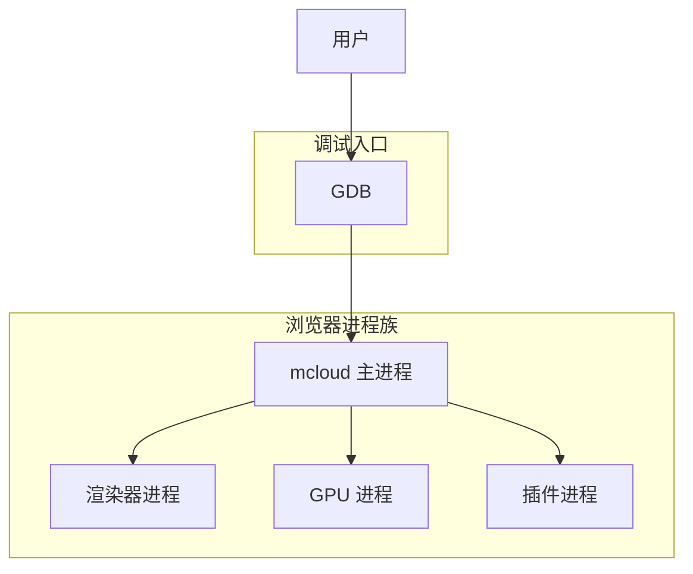
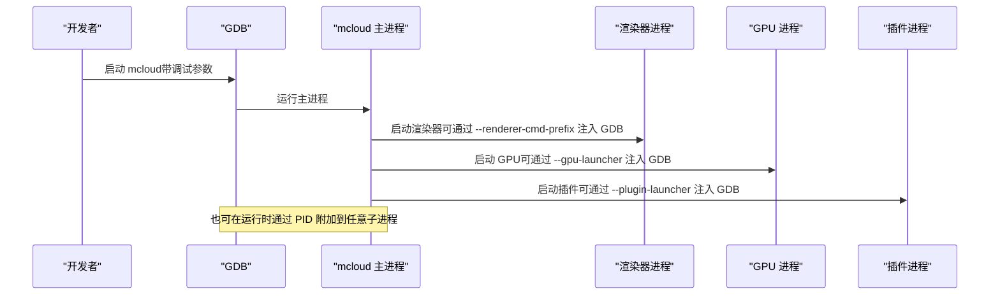
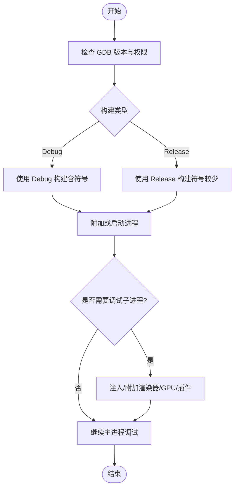

# GDB 调试

本文引用的文件

- [DEBUGGING.md](https://github.com/Mcloud136/Mcloud-Browser/blob/main/infra/DEBUG/DEBUGGING.md)
- [debug_args.gn](https://github.com/Mcloud136/Mcloud-Browser/blob/main/infra/DEBUG/debug_args.gn)
- [build_debug_linux.sh](https://github.com/Mcloud136/Mcloud-Browser/blob/main/infra/DEBUG/build_debug_linux.sh)
- [Thorium_Debug_Shell.sh](https://github.com/Mcloud136/Mcloud-Browser/blob/main/infra/DEBUG/Thorium_Debug_Shell.sh)
- [args.gn](https://github.com/Mcloud136/Mcloud-Browser/blob/main/args.gn)
- [win_args.gn](https://github.com/Mcloud136/Mcloud-Browser/blob/main/win_args.gn)
- [CMDLINE_FLAGS_LIST.md](https://github.com/Mcloud136/Mcloud-Browser/blob/main/infra/CMDLINE_FLAGS_LIST.md)

## 目录
1. [简介](#简介)
2. [项目结构](#项目结构)
3. [核心组件](#核心组件)
4. [架构总览](#架构总览)
5. [详细组件分析](#详细组件分析)
6. [依赖关系分析](#依赖关系分析)
7. [性能注意事项](#性能注意事项)
8. [故障排查指南](#故障排查指南)
9. [结论](#结论)
10. [附录](#附录)

## 简介
本指南面向使用 GDB 调试 MCloud Browser（基于 Chromium）的开发者，覆盖基础调试、附加到进程、设置断点与查看堆栈、多进程调试（渲染器/GPU/插件）、常用命令示例、脚本化配置、进程间通信调试、内存查看与变量检查等高级技巧。内容基于仓库内提供的调试文档与构建配置进行整理与归纳，确保可操作且与代码库一致。

## 项目结构
仓库中与调试密切相关的资源集中在 infra/DEBUG 目录以及根级构建参数文件中：
- infra/DEBUG/DEBUGGING.md：Linux 下 Chromium/MCloud 调试要点（GDB、多进程、日志、Core/Breakpad、rr 时间旅行调试等）。
- infra/DEBUG/debug_args.gn：Debug 构建参数（开启调试符号、禁用剥离、启用 dcheck 等）。
- infra/DEBUG/build_debug_linux.sh：Linux Debug 构建与打包 UI Debug Shell 的脚本。
- infra/DEBUG/Thorium_Debug_Shell.sh：启动 UI Debug Shell 的便捷脚本。
- args.gn / win_args.gn：发布/Windows 构建参数（对比 Debug 差异，理解符号级别与优化开关）。
- infra/CMDLINE_FLAGS_LIST.md：命令行参数清单（如 --renderer-cmd-prefix、--gpu-launcher、--plugin-launcher 等）。

图表来源
- [DEBUGGING.md:23-87](https://github.com/Mcloud136/Mcloud-Browser/blob/main/infra/DEBUG/DEBUGGING.md#L23-L87)
- [CMDLINE_FLAGS_LIST.md:1618-1618](https://github.com/Mcloud136/Mcloud-Browser/blob/main/infra/CMDLINE_FLAGS_LIST.md#L1618-L1618)
- [CMDLINE_FLAGS_LIST.md:2242-2242](https://github.com/Mcloud136/Mcloud-Browser/blob/main/infra/CMDLINE_FLAGS_LIST.md#L2242-L2242)

章节来源
- [DEBUGGING.md:1-120](https://github.com/Mcloud136/Mcloud-Browser/blob/main/infra/DEBUG/DEBUGGING.md#L1-L120)
- [debug_args.gn:1-87](https://github.com/Mcloud136/Mcloud-Browser/blob/main/infra/DEBUG/debug_args.gn#L1-L87)
- [build_debug_linux.sh:1-90](https://github.com/Mcloud136/Mcloud-Browser/blob/main/infra/DEBUG/build_debug_linux.sh#L1-L90)
- [Thorium_Debug_Shell.sh:1-10](https://github.com/Mcloud136/Mcloud-Browser/blob/main/infra/DEBUG/Thorium_Debug_Shell.sh#L1-L10)
- [args.gn:1-87](https://github.com/Mcloud136/Mcloud-Browser/blob/main/args.gn#L1-L87)
- [win_args.gn:1-87](https://github.com/Mcloud136/Mcloud-Browser/blob/main/win_args.gn#L1-L87)
- [CMDLINE_FLAGS_LIST.md:1618-1618](https://github.com/Mcloud136/Mcloud-Browser/blob/main/infra/CMDLINE_FLAGS_LIST.md#L1618-L1618)
- [CMDLINE_FLAGS_LIST.md:2242-2242](https://github.com/Mcloud136/Mcloud-Browser/blob/main/infra/CMDLINE_FLAGS_LIST.md#L2242-L2242)

## 核心组件
- 调试入口与运行方式
  - 直接以 GDB 启动 mcloud，并传入必要参数（例如禁用 seccomp 沙箱），便于获取符号化堆栈。
  - 通过 --renderer-cmd-prefix、--gpu-launcher、--plugin-launcher 将子进程注入 GDB。
- 构建与符号
  - Debug 构建启用调试符号、不剥离符号、开启 dcheck，利于源码级调试。
  - 发布构建关闭调试符号与 dcheck，体积更小但调试困难。
- 辅助工具与环境
  - 提供 Linux Debug 构建脚本与 UI Debug Shell 启动脚本，简化环境准备。
  - 支持 rr 时间旅行调试、Breakpad minidump、Core dump 等崩溃后分析手段。

章节来源
- [DEBUGGING.md:23-87](https://github.com/Mcloud136/Mcloud-Browser/blob/main/infra/DEBUG/DEBUGGING.md#L23-L87)
- [debug_args.gn:15-27](https://github.com/Mcloud136/Mcloud-Browser/blob/main/infra/DEBUG/debug_args.gn#L15-L27)
- [build_debug_linux.sh:42-89](https://github.com/Mcloud136/Mcloud-Browser/blob/main/infra/DEBUG/build_debug_linux.sh#L42-L89)
- [Thorium_Debug_Shell.sh:5-9](https://github.com/Mcloud136/Mcloud-Browser/blob/main/infra/DEBUG/Thorium_Debug_Shell.sh#L5-L9)
- [args.gn:15-27](https://github.com/Mcloud136/Mcloud-Browser/blob/main/args.gn#L15-L27)

## 架构总览
MCloud Browser 采用多进程架构：主进程负责 UI 与调度，渲染器进程负责页面渲染，GPU 进程处理图形加速，插件进程承载外部插件。GDB 调试需分别针对这些进程进行启动、附加或注入。

图表来源
- [DEBUGGING.md:45-87](https://github.com/Mcloud136/Mcloud-Browser/blob/main/infra/DEBUG/DEBUGGING.md#L45-L87)
- [DEBUGGING.md:163-184](https://github.com/Mcloud136/Mcloud-Browser/blob/main/infra/DEBUG/DEBUGGING.md#L163-L184)
- [CMDLINE_FLAGS_LIST.md:1618-1618](https://github.com/Mcloud136/Mcloud-Browser/blob/main/infra/CMDLINE_FLAGS_LIST.md#L1618-L1618)
- [CMDLINE_FLAGS_LIST.md:2242-2242](https://github.com/Mcloud136/Mcloud-Browser/blob/main/infra/CMDLINE_FLAGS_LIST.md#L2242-L2242)

## 详细组件分析

### 基本调试：启动与附加
- 以 GDB 启动主进程
  - 使用 TUI 模式自动运行，并传入必要的调试参数（如禁用 seccomp 沙箱），以便获得符号化堆栈。
- 允许附加到外部进程
  - 某些发行版默认限制 ptrace，需要调整内核参数以允许附加到非祖先进程。
- 附加到已运行的子进程
  - 通过进程树或内置任务管理器查找目标 PID，然后使用 gdb -p 附加。若进程受沙箱保护，需启用允许沙箱调试的参数。

章节来源
- [DEBUGGING.md:23-41](https://github.com/Mcloud136/Mcloud-Browser/blob/main/infra/DEBUG/DEBUGGING.md#L23-L41)
- [DEBUGGING.md:123-161](https://github.com/Mcloud136/Mcloud-Browser/blob/main/infra/DEBUG/DEBUGGING.md#L123-L161)

### 多进程调试：渲染器、GPU、插件
- 渲染器进程
  - 通过 --renderer-cmd-prefix 将每个渲染器进程用 GDB 启动，或在启动时弹出交互窗口选择是否调试。
  - 可使用单独的 GDB 命令文件为不同进程加载不同的断点集合。
- GPU 进程
  - 使用 --gpu-launcher 替代 --renderer-cmd-prefix，将 GPU 子进程注入 GDB。
- 插件进程
  - 使用 --plugin-launcher 将插件进程注入 GDB；注意 PPAPI 插件当前在渲染器进程中运行，不适用此方式。
- 单进程模式
  - 使用 --single-process 将渲染器线程并入主进程，便于统一调试（需注意相关限制）。

章节来源
- [DEBUGGING.md:45-121](https://github.com/Mcloud136/Mcloud-Browser/blob/main/infra/DEBUG/DEBUGGING.md#L45-L121)
- [DEBUGGING.md:163-207](https://github.com/Mcloud136/Mcloud-Browser/blob/main/infra/DEBUG/DEBUGGING.md#L163-L207)
- [CMDLINE_FLAGS_LIST.md:1618-1618](https://github.com/Mcloud136/Mcloud-Browser/blob/main/infra/CMDLINE_FLAGS_LIST.md#L1618-L1618)
- [CMDLINE_FLAGS_LIST.md:2242-2242](https://github.com/Mcloud136/Mcloud-Browser/blob/main/infra/CMDLINE_FLAGS_LIST.md#L2242-L2242)

### 常用 GDB 命令与脚本化配置
- 常用命令
  - 启动与运行：gdb -tui -ex=r --args <程序> <参数>
  - 附加进程：gdb -p <PID>
  - 设置断点：break <函数名> / break <源文件>:<行号>
  - 查看调用栈：bt / bt full
  - 查看局部变量：print <变量> / display <表达式>
  - 切换线程：thread <ID> / info threads
  - 条件断点：break <函数> if <条件>
  - 批量执行：gdb -x <命令文件>
- 脚本化配置
  - 为浏览器和渲染器分别准备断点命令文件，通过 -x 参数加载，实现选择性断点。
  - 使用 shell 脚本包装子进程启动，交互式决定是否进入 GDB。

章节来源
- [DEBUGGING.md:106-121](https://github.com/Mcloud136/Mcloud-Browser/blob/main/infra/DEBUG/DEBUGGING.md#L106-L121)
- [DEBUGGING.md:88-104](https://github.com/Mcloud136/Mcloud-Browser/blob/main/infra/DEBUG/DEBUGGING.md#L88-L104)

### 进程间通信（IPC）调试
- 启用 IPC 日志
  - 通过环境变量 CHROME_IPC_LOGGING=1 输出 IPC 消息，便于定位跨进程问题。
  - 在 GDB 中也可通过 set environment 设置该环境变量。
- 结合 vmodule/v 日志
  - 使用 --vmodule 或 --v 控制模块日志级别，配合导航事件等关键路径日志定位问题。

章节来源
- [DEBUGGING.md:463-486](https://github.com/Mcloud136/Mcloud-Browser/blob/main/infra/DEBUG/DEBUGGING.md#L463-L486)

### 内存查看与变量检查
- 打印 Chromium 类型
  - 启用 GDB Python pretty-printers，可更友好地显示 Chromium/Blink 数据结构。
- 常见技巧
  - 使用 print/display 查看对象字段与容器内容。
  - 结合线程切换与断点，观察变量变化轨迹。
  - 对于复杂对象，可编写自定义 GDB 宏或脚本提升可读性。

章节来源
- [DEBUGGING.md:209-242](https://github.com/Mcloud136/Mcloud-Browser/blob/main/infra/DEBUG/DEBUGGING.md#L209-L242)

### 崩溃分析与 Core/Breakpad
- Core dump
  - 设置 ulimit -c unlimited 使进程崩溃时生成 core 文件；部分沙箱子进程需额外参数才能生成。
  - 对冻结问题，可向目标进程发送 SIGABRT 触发崩溃以获取堆栈。
- Breakpad minidump
  - 参考仓库中的 minidump_to_core 说明，将 minidump 转换为 core 进行分析。

章节来源
- [DEBUGGING.md:351-366](https://github.com/Mcloud136/Mcloud-Browser/blob/main/infra/DEBUG/DEBUGGING.md#L351-L366)

### 时间旅行调试（rr）
- 录制与回放
  - 使用 rr record 记录执行轨迹，再通过 rr replay 回放，支持反向继续、反向单步等操作。
- 多进程调试
  - 对从 zygote fork 的子进程（如渲染器）可用 rr -f [PID]；其他进程可用 rr -p [PID]。
  - 通过日志或 rr ps 找到目标进程 ID，再回放指定进程。

章节来源
- [DEBUGGING.md:256-312](https://github.com/Mcloud136/Mcloud-Browser/blob/main/infra/DEBUG/DEBUGGING.md#L256-L312)

### 构建与符号配置
- Debug 构建参数
  - 启用 is_debug、symbol_level=2、disable stripping、dcheck_always_on 等，利于源码级调试与断言。
- 发布构建参数
  - 关闭调试符号、剥离符号、禁用 dcheck，减小体积但不利于调试。
- Windows 构建参数
  - 与 Linux 类似，关注 symbol_level、is_debug、enable_stripping 等选项。

章节来源
- [debug_args.gn:15-27](https://github.com/Mcloud136/Mcloud-Browser/blob/main/infra/DEBUG/debug_args.gn#L15-L27)
- [args.gn:15-27](https://github.com/Mcloud136/Mcloud-Browser/blob/main/args.gn#L15-L27)
- [win_args.gn:13-27](https://github.com/Mcloud136/Mcloud-Browser/blob/main/win_args.gn#L13-L27)

## 依赖关系分析
- 调试流程依赖
  - GDB 版本要求（Linux 上建议 7.7+），否则可能无法解析符号或崩溃。
  - 内核 ptrace 策略影响附加能力，必要时需调整系统设置。
  - 沙箱机制会干扰内部符号化与附加，需临时禁用或使用外部符号化工具。
- 构建产物依赖
  - Debug 构建产物包含完整符号与调试信息，便于 GDB 源码级调试。
  - 发布构建产物体积小，但调试体验受限。

图表来源
- [DEBUGGING.md:15-41](https://github.com/Mcloud136/Mcloud-Browser/blob/main/infra/DEBUG/DEBUGGING.md#L15-L41)
- [DEBUGGING.md:45-207](https://github.com/Mcloud136/Mcloud-Browser/blob/main/infra/DEBUG/DEBUGGING.md#L45-L207)
- [debug_args.gn:15-27](https://github.com/Mcloud136/Mcloud-Browser/blob/main/infra/DEBUG/debug_args.gn#L15-L27)
- [args.gn:15-27](https://github.com/Mcloud136/Mcloud-Browser/blob/main/args.gn#L15-L27)

章节来源
- [DEBUGGING.md:15-41](https://github.com/Mcloud136/Mcloud-Browser/blob/main/infra/DEBUG/DEBUGGING.md#L15-L41)
- [DEBUGGING.md:45-207](https://github.com/Mcloud136/Mcloud-Browser/blob/main/infra/DEBUG/DEBUGGING.md#L45-L207)
- [debug_args.gn:15-27](https://github.com/Mcloud136/Mcloud-Browser/blob/main/infra/DEBUG/debug_args.gn#L15-L27)
- [args.gn:15-27](https://github.com/Mcloud136/Mcloud-Browser/blob/main/args.gn#L15-L27)

## 性能注意事项
- 调试开销
  - 附加与断点会带来性能下降，建议在复现问题时最小化无关操作。
- 符号加载
  - 使用 gdb-add-index 可加快多次运行时的符号索引速度。
  - 避免过高的符号拆分（use_debug_fission）可降低 GDB 加载时间，但会增加链接时间。
- 日志与追踪
  - 合理设置 --v/--vmodule，避免过多日志影响性能。
  - rr 录制会产生较大磁盘占用，按需使用。

章节来源
- [DEBUGGING.md:327-349](https://github.com/Mcloud136/Mcloud-Browser/blob/main/infra/DEBUG/DEBUGGING.md#L327-L349)
- [DEBUGGING.md:463-486](https://github.com/Mcloud136/Mcloud-Browser/blob/main/infra/DEBUG/DEBUGGING.md#L463-L486)

## 故障排查指南
- 无法附加到进程
  - 检查内核 ptrace 策略（Yama LSM），必要时调整为允许附加。
  - 确认目标进程未处于严格沙箱中，或启用允许沙箱调试的参数。
- 符号缺失或堆栈不可读
  - 使用 Debug 构建产物；或配置外部符号服务器与 GDB 符号路径。
  - 使用 --no-sandbox 临时绕过沙箱对内部符号化的影响。
- 崩溃无 Core
  - 设置 ulimit -c unlimited；对沙箱子进程可能需要额外参数。
  - 对冻结问题，向目标进程发送 SIGABRT 触发崩溃。
- IPC 问题定位
  - 启用 CHROME_IPC_LOGGING=1 输出 IPC 消息；结合 vmodule 细化日志。
- 多进程冲突
  - 使用脚本选择性地仅调试特定渲染器；或通过任务管理器获取 PID 后附加。

章节来源
- [DEBUGGING.md:28-41](https://github.com/Mcloud136/Mcloud-Browser/blob/main/infra/DEBUG/DEBUGGING.md#L28-L41)
- [DEBUGGING.md:123-161](https://github.com/Mcloud136/Mcloud-Browser/blob/main/infra/DEBUG/DEBUGGING.md#L123-L161)
- [DEBUGGING.md:351-366](https://github.com/Mcloud136/Mcloud-Browser/blob/main/infra/DEBUG/DEBUGGING.md#L351-L366)
- [DEBUGGING.md:463-486](https://github.com/Mcloud136/Mcloud-Browser/blob/main/infra/DEBUG/DEBUGGING.md#L463-L486)

## 结论
通过合理的构建配置（Debug 符号）、正确的 GDB 使用方式（启动/附加/注入）、以及对多进程架构的理解（渲染器/GPU/插件），可以高效定位 MCloud Browser 的问题。结合 IPC 日志、Core/Breakdump、rr 时间旅行调试等手段，能够覆盖从运行期到崩溃后的全链路调试场景。建议在日常工作中沉淀常用的 GDB 命令文件与脚本，提升调试效率。

## 附录
- 快速命令参考
  - 启动主进程：gdb -tui -ex=r --args out/mcloud/mcloud --disable-seccomp-sandbox http://google.com
  - 附加渲染器：gdb -p <渲染器 PID>
  - 注入渲染器：mcloud --no-sandbox --renderer-cmd-prefix='xterm -title renderer -e gdb --args'
  - 注入 GPU：使用 --gpu-launcher 替代 --renderer-cmd-prefix
  - 注入插件：使用 --plugin-launcher
  - 单进程模式：gdb --args mcloud --single-process
  - 启用 IPC 日志：CHROME_IPC_LOGGING=1
- 构建与脚本
  - Debug 构建参数：见 debug_args.gn
  - Linux Debug 构建脚本：build_debug_linux.sh
  - UI Debug Shell 启动：Thorium_Debug_Shell.sh

章节来源
- [DEBUGGING.md:23-87](https://github.com/Mcloud136/Mcloud-Browser/blob/main/infra/DEBUG/DEBUGGING.md#L23-L87)
- [DEBUGGING.md:163-207](https://github.com/Mcloud136/Mcloud-Browser/blob/main/infra/DEBUG/DEBUGGING.md#L163-L207)
- [DEBUGGING.md:463-486](https://github.com/Mcloud136/Mcloud-Browser/blob/main/infra/DEBUG/DEBUGGING.md#L463-L486)
- [debug_args.gn:15-27](https://github.com/Mcloud136/Mcloud-Browser/blob/main/infra/DEBUG/debug_args.gn#L15-L27)
- [build_debug_linux.sh:42-89](https://github.com/Mcloud136/Mcloud-Browser/blob/main/infra/DEBUG/build_debug_linux.sh#L42-L89)
- [Thorium_Debug_Shell.sh:5-9](https://github.com/Mcloud136/Mcloud-Browser/blob/main/infra/DEBUG/Thorium_Debug_Shell.sh#L5-L9)