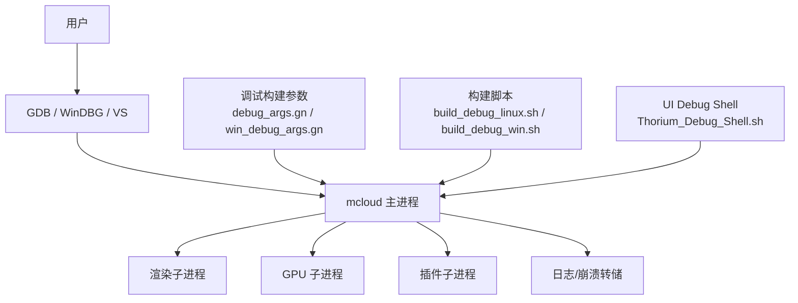
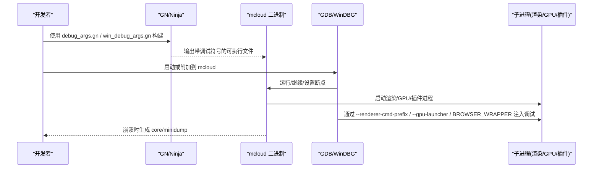
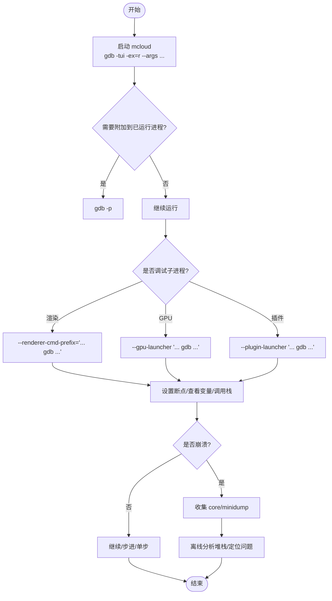
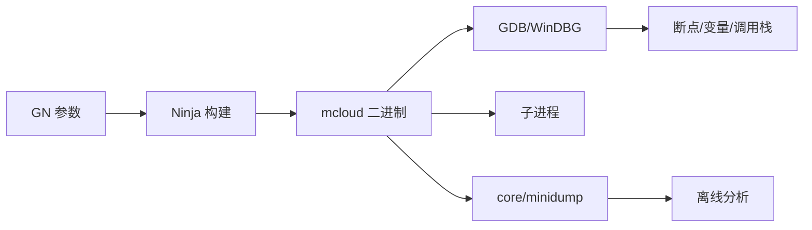

# 基本调试

<cite>
**本文引用的文件**
- [infra/DEBUG/DEBUGGING.md](file://infra/DEBUG/DEBUGGING.md)
- [infra/DEBUG/debug_args.gn](file://infra/DEBUG/debug_args.gn)
- [infra/DEBUG/win_debug_args.gn](file://infra/DEBUG/win_debug_args.gn)
- [infra/DEBUG/build_debug_linux.sh](file://infra/DEBUG/build_debug_linux.sh)
- [infra/DEBUG/build_debug_win.sh](file://infra/DEBUG/build_debug_win.sh)
- [infra/DEBUG/README.md](file://infra/DEBUG/README.md)
- [infra/DEBUG/DEBUG_SHELL_README.md](file://infra/DEBUG/DEBUG_SHELL_README.md)
- [infra/DEBUG/Thorium_Debug_Shell.sh](file://infra/DEBUG/Thorium_Debug_Shell.sh)
- [args.gn](file://args.gn)
- [docs/BUILDING.md](file://docs/BUILDING.md)
- [docs/BUILDING_WIN.md](file://docs/BUILDING_WIN.md)
</cite>

## 目录
1. [简介](#简介)
2. [项目结构](#项目结构)
3. [核心组件](#核心组件)
4. [架构总览](#架构总览)
5. [详细组件分析](#详细组件分析)
6. [依赖关系分析](#依赖关系分析)
7. [性能与启动优化](#性能与启动优化)
8. [故障排查指南](#故障排查指南)
9. [结论](#结论)
10. [附录：常用命令速查](#附录：常用命令速查)

## 简介
本指南面向 MCloud Browser 开发者，系统讲解在 Linux 与 Windows 上使用 GDB（及配套的构建与符号配置）进行浏览器进程调试的完整流程。内容覆盖：
- 启动浏览器进程并附加调试器
- 设置断点、单步执行、查看变量与调用栈
- 多进程（渲染/GPU/插件）调试技巧
- 崩溃分析与 Core/Minidump 处理
- 调试符号配置与平台差异
- MCloud Browser 特有的调试构建与 UI Debug Shell

## 项目结构
MCloud Browser 提供了完善的调试基础设施，集中在 infra/DEBUG 目录，包含：
- 调试构建参数（debug_args.gn、win_debug_args.gn）
- 自动化构建脚本（build_debug_linux.sh、build_debug_win.sh）
- 调试文档（DEBUGGING.md）
- UI Debug Shell 构建与使用说明（DEBUG_SHELL_README.md、Thorium_Debug_Shell.sh）

图表来源
- [infra/DEBUG/DEBUGGING.md:23-82](file://infra/DEBUG/DEBUGGING.md#L23-L82)
- [infra/DEBUG/debug_args.gn:1-87](file://infra/DEBUG/debug_args.gn#L1-L87)
- [infra/DEBUG/win_debug_args.gn:1-87](file://infra/DEBUG/win_debug_args.gn#L1-L87)
- [infra/DEBUG/build_debug_linux.sh:42-89](file://infra/DEBUG/build_debug_linux.sh#L42-L89)
- [infra/DEBUG/build_debug_win.sh:33-72](file://infra/DEBUG/build_debug_win.sh#L33-L72)

章节来源
- [infra/DEBUG/README.md:1-16](file://infra/DEBUG/README.md#L1-L16)
- [infra/DEBUG/DEBUGGING.md:1-603](file://infra/DEBUG/DEBUGGING.md#L1-L603)

## 核心组件
- 调试构建参数
  - Linux 调试参数：启用调试信息、关闭剥离、开启断言等
  - Windows 调试参数：对应 Windows 平台的调试开关与符号级别
- 自动化构建脚本
  - Linux：构建 mcloud、chromedriver、mcloud_shell、UI Debug Shell 并打包资源
  - Windows：构建目标产物并复制运行所需 DLL/PK 等资源
- UI Debug Shell
  - 基于 views_examples_with_content 的可独立运行的 UI 调试工具，便于快速验证 UI 资源与交互

章节来源
- [infra/DEBUG/debug_args.gn:1-87](file://infra/DEBUG/debug_args.gn#L1-L87)
- [infra/DEBUG/win_debug_args.gn:1-87](file://infra/DEBUG/win_debug_args.gn#L1-L87)
- [infra/DEBUG/build_debug_linux.sh:42-89](file://infra/DEBUG/build_debug_linux.sh#L42-L89)
- [infra/DEBUG/build_debug_win.sh:33-72](file://infra/DEBUG/build_debug_win.sh#L33-L72)
- [infra/DEBUG/DEBUG_SHELL_README.md:1-31](file://infra/DEBUG/DEBUG_SHELL_README.md#L1-L31)

## 架构总览
下图展示了从“构建”到“调试”的关键路径：GN 参数决定编译选项与符号级别；Ninja 生成可执行文件；GDB/VS 启动或附加进程；多进程通过命令行前缀或环境变量注入调试器；崩溃时生成 core/minidump 供离线分析。

图表来源
- [infra/DEBUG/debug_args.gn:1-87](file://infra/DEBUG/debug_args.gn#L1-L87)
- [infra/DEBUG/win_debug_args.gn:1-87](file://infra/DEBUG/win_debug_args.gn#L1-L87)
- [infra/DEBUG/DEBUGGING.md:23-82](file://infra/DEBUG/DEBUGGING.md#L23-L82)
- [infra/DEBUG/DEBUGGING.md:163-184](file://infra/DEBUG/DEBUGGING.md#L163-L184)
- [infra/DEBUG/DEBUGGING.md:351-366](file://infra/DEBUG/DEBUGGING.md#L351-L366)

## 详细组件分析

### Linux 调试工作流（GDB）
- 启动浏览器进程并进入调试器
  - 使用 TUI 模式直接运行，附带禁用沙箱等必要参数
- 允许附加到外部进程
  - 调整 ptrace_scope 以允许附加非祖先进程
- 多进程调试
  - 渲染进程：通过 --renderer-cmd-prefix 将每个渲染进程自动用 gdb 启动
  - GPU 进程：使用 --gpu-launcher
  - 插件进程：使用 --plugin-launcher
  - 测试中的浏览器：通过 BROWSER_WRAPPER 注入
- 选择特定渲染进程调试
  - 提供交互式脚本，按提示选择要调试的子进程
- 单进程模式
  - 使用 --single-process 简化调试（必要时配合 --disable-gpu）
- 打印 Chromium 类型
  - 配置 gdbinit 启用 pretty-printers
- 源码级调试
  - 注意 strip_absolute_paths_from_debug_symbols 对源码路径的影响
- 核心文件与崩溃转储
  - ulimit 控制 core dump；沙箱进程需额外标志
  - Breakpad minidump 转换与分析

图表来源
- [infra/DEBUG/DEBUGGING.md:23-82](file://infra/DEBUG/DEBUGGING.md#L23-L82)
- [infra/DEBUG/DEBUGGING.md:88-121](file://infra/DEBUG/DEBUGGING.md#L88-L121)
- [infra/DEBUG/DEBUGGING.md:163-184](file://infra/DEBUG/DEBUGGING.md#L163-L184)
- [infra/DEBUG/DEBUGGING.md:191-207](file://infra/DEBUG/DEBUGGING.md#L191-L207)
- [infra/DEBUG/DEBUGGING.md:351-366](file://infra/DEBUG/DEBUGGING.md#L351-L366)

章节来源
- [infra/DEBUG/DEBUGGING.md:23-207](file://infra/DEBUG/DEBUGGING.md#L23-L207)
- [infra/DEBUG/DEBUGGING.md:351-366](file://infra/DEBUG/DEBUGGING.md#L351-L366)

### Windows 调试要点（WinDBG / Visual Studio）
- 构建与符号
  - 使用 win_debug_args.gn 生成带调试信息的二进制
  - 确保安装匹配的 Windows SDK Debugging Tools 以支持大页 PDB
- 启动与附加
  - 可在 VS 中直接附加到 mcloud.exe，或使用 WinDBG 附加
- 多进程调试
  - 通过命令行前缀或环境变量注入调试器（思路同 Linux）
- 崩溃转储
  - 使用 ADPlus/Procdump 生成 dump，结合 PDB 分析

章节来源
- [docs/BUILDING_WIN.md:17-49](file://docs/BUILDING_WIN.md#L17-L49)
- [infra/DEBUG/win_debug_args.gn:1-87](file://infra/DEBUG/win_debug_args.gn#L1-L87)

### 调试符号与构建参数
- 关键 GN 参数
  - symbol_level：控制符号级别（调试建议 2）
  - enable_stripping：调试构建应关闭剥离
  - exclude_unwind_tables：调试构建建议保留 unwind 表
  - use_debug_fission：影响 GDB 加载速度与源码定位
- 发布 vs 调试
  - args.gn 为发布配置（symbol_level=0，enable_stripping=true），调试请使用 infra/DEBUG 下的专用 gn 参数
- 源码路径与调试文件
  - 若启用了 strip_absolute_paths_from_debug_symbols，需配置 gdb 查找调试文件

章节来源
- [infra/DEBUG/debug_args.gn:1-87](file://infra/DEBUG/debug_args.gn#L1-L87)
- [infra/DEBUG/win_debug_args.gn:1-87](file://infra/DEBUG/win_debug_args.gn#L1-L87)
- [args.gn:1-87](file://args.gn#L1-L87)
- [infra/DEBUG/DEBUGGING.md:327-349](file://infra/DEBUG/DEBUGGING.md#L327-L349)

### MCloud Browser 特有调试能力
- UI Debug Shell
  - 一键构建并复制资源，便于独立运行和调试 UI 相关功能
  - Linux 通过 Thorium_Debug_Shell.sh 设置库路径并启动
- 自动化构建脚本
  - 构建 chrome/chromedriver/mcloud_shell/UI Debug Shell，并整理运行所需资源
- 调试入口与说明
  - DEBUGGING.md 提供大量 Chromium/MCloud 调试技巧
  - DEBUG_SHELL_README.md 说明 UI Debug Shell 的使用方式

章节来源
- [infra/DEBUG/DEBUG_SHELL_README.md:1-31](file://infra/DEBUG/DEBUG_SHELL_README.md#L1-L31)
- [infra/DEBUG/Thorium_Debug_Shell.sh:1-10](file://infra/DEBUG/Thorium_Debug_Shell.sh#L1-L10)
- [infra/DEBUG/build_debug_linux.sh:42-89](file://infra/DEBUG/build_debug_linux.sh#L42-L89)
- [infra/DEBUG/build_debug_win.sh:33-72](file://infra/DEBUG/build_debug_win.sh#L33-L72)
- [infra/DEBUG/DEBUGGING.md:1-603](file://infra/DEBUG/DEBUGGING.md#L1-L603)

## 依赖关系分析
- 构建阶段
  - GN 参数决定编译选项与符号级别
  - Ninja 根据 GN 生成构建任务并产出二进制与资源
- 调试阶段
  - GDB/WinDBG 依赖正确的符号与 unwind 信息
  - 多进程调试依赖命令行前缀或环境变量注入
- 崩溃分析
  - core/minidump 依赖运行时生成的转储文件与对应的符号文件

图表来源
- [infra/DEBUG/debug_args.gn:1-87](file://infra/DEBUG/debug_args.gn#L1-L87)
- [infra/DEBUG/win_debug_args.gn:1-87](file://infra/DEBUG/win_debug_args.gn#L1-L87)
- [infra/DEBUG/DEBUGGING.md:351-366](file://infra/DEBUG/DEBUGGING.md#L351-L366)

## 性能与启动优化
- 加速 GDB 索引
  - 使用 gdb-add-index 减少重复加载时间
- 关闭调试分片
  - 设置 use_debug_fission=false 可显著降低 GDB 加载时间（代价是链接时间增加）
- 合理符号级别
  - 日常调试使用 symbol_level=2；仅回溯可使用最小符号

章节来源
- [infra/DEBUG/DEBUGGING.md:327-349](file://infra/DEBUG/DEBUGGING.md#L327-L349)

## 故障排查指南
- 无法附加进程
  - Linux：检查 Yama ptrace_scope；必要时临时关闭
  - 沙箱限制：使用 --allow-sandbox-debugging 或 --no-sandbox（仅临时）
- 崩溃无符号
  - 确认 symbol_level 与 enable_stripping 配置正确
  - 确保符号文件与二进制版本匹配
- 源码级调试失败
  - 检查 strip_absolute_paths_from_debug_symbols 与 gdb 调试文件路径配置
- 多进程调试混乱
  - 使用选择性脚本或分别加载命令文件区分不同进程的断点集
- 日志与 IPC 调试
  - 启用 CHROME_IPC_LOGGING 或调整日志级别以获取更多上下文

章节来源
- [infra/DEBUG/DEBUGGING.md:28-41](file://infra/DEBUG/DEBUGGING.md#L28-L41)
- [infra/DEBUG/DEBUGGING.md:123-161](file://infra/DEBUG/DEBUGGING.md#L123-L161)
- [infra/DEBUG/DEBUGGING.md:209-243](file://infra/DEBUG/DEBUGGING.md#L209-L243)
- [infra/DEBUG/DEBUGGING.md:327-349](file://infra/DEBUG/DEBUGGING.md#L327-L349)
- [infra/DEBUG/DEBUGGING.md:463-486](file://infra/DEBUG/DEBUGGING.md#L463-L486)

## 结论
通过合理的调试构建参数、规范的 GDB/WinDBG 使用流程以及 MCloud Browser 提供的 UI Debug Shell，可以高效地启动浏览器进程、设置断点、单步执行、查看变量与调用栈，并在多进程环境下精准定位问题。结合 core/minidump 与符号配置，能够系统化地分析崩溃并还原问题根源。

## 附录：常用命令速查
- 启动与附加
  - Linux：gdb -tui -ex=r --args out/mcloud/mcloud --disable-seccomp-sandbox http://google.com
  - 附加到运行中进程：gdb -p <pid>
- 多进程注入
  - 渲染：--renderer-cmd-prefix='xterm -title renderer -e gdb --args'
  - GPU：--gpu-launcher '... gdb ...'
  - 插件：--plugin-launcher '... gdb ...'
  - 测试：BROWSER_WRAPPER='... gdb ...'
- 单进程模式
  - --single-process（必要时 --disable-gpu）
- 符号与源码
  - 配置 gdbinit 启用 pretty-printers
  - 调整 use_debug_fission 与 strip_absolute_paths_from_debug_symbols
- 崩溃转储
  - 设置 ulimit -c unlimited
  - 沙箱进程：--allow-sandbox-debugging
  - Breakpad minidump 转换与分析

章节来源
- [infra/DEBUG/DEBUGGING.md:23-82](file://infra/DEBUG/DEBUGGING.md#L23-L82)
- [infra/DEBUG/DEBUGGING.md:88-121](file://infra/DEBUG/DEBUGGING.md#L88-L121)
- [infra/DEBUG/DEBUGGING.md:163-184](file://infra/DEBUG/DEBUGGING.md#L163-L184)
- [infra/DEBUG/DEBUGGING.md:191-207](file://infra/DEBUG/DEBUGGING.md#L191-L207)
- [infra/DEBUG/DEBUGGING.md:351-366](file://infra/DEBUG/DEBUGGING.md#L351-L366)