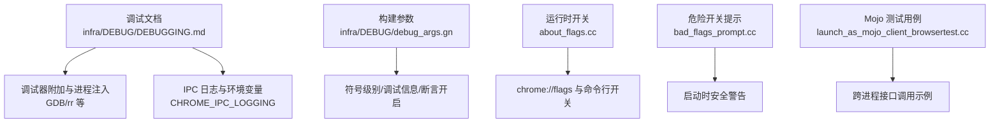
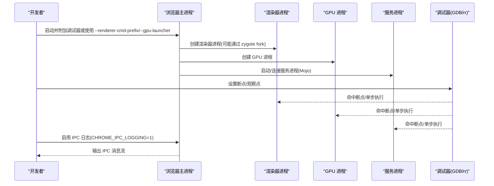
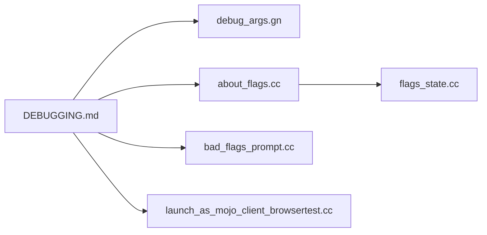

# 多进程调试

<cite>
**本文引用的文件**
- [DEBUGGING.md](file://infra/DEBUG/DEBUGGING.md)
- [debug_args.gn](file://infra/DEBUG/debug_args.gn)
- [about_flags.cc](file://src/chrome/browser/about_flags.cc)
- [bad_flags_prompt.cc](file://src/chrome/browser/ui/startup/bad_flags_prompt.cc)
- [flags_state.cc](file://src/components/webui/flags/flags_state.cc)
- [launch_as_mojo_client_browsertest.cc](file://src/content/browser/launch_as_mojo_client_browsertest.cc)
</cite>

## 目录
1. [简介](#简介)
2. [项目结构](#项目结构)
3. [核心组件](#核心组件)
4. [架构总览](#架构总览)
5. [详细组件分析](#详细组件分析)
6. [依赖关系分析](#依赖关系分析)
7. [性能考量](#性能考量)
8. [故障排查指南](#故障排查指南)
9. [结论](#结论)
10. [附录](#附录)

## 简介
本文件面向在 Chromium 多进程架构下定位与修复问题的工程师，系统讲解如何调试主进程、渲染器进程、GPU 进程和各种服务进程；覆盖进程间通信（IPC/Mojo）的调试方法、进程选择技巧、调试器附加策略，以及处理复杂多进程问题的最佳实践。同时结合 MCloud Browser 提供的调试配置与开关，给出可操作的命令与流程建议。

## 项目结构
围绕调试能力，仓库中与多进程调试直接相关的资源主要分布在以下位置：
- 调试文档与脚本：infra/DEBUG/ 下的调试指南、GN 构建参数等
- 运行时开关与特性：src/chrome/browser/about_flags.cc 及 webui flags 状态管理
- 安全警告与危险开关提示：src/chrome/browser/ui/startup/bad_flags_prompt.cc
- Mojo 客户端测试示例：src/content/browser/launch_as_mojo_client_browsertest.cc

图表来源
- [DEBUGGING.md:1-120](file://infra/DEBUG/DEBUGGING.md#L1-L120)
- [debug_args.gn:1-87](file://infra/DEBUG/debug_args.gn#L1-L87)
- [about_flags.cc:1-200](file://src/chrome/browser/about_flags.cc#L1-L200)
- [bad_flags_prompt.cc:63-102](file://src/chrome/browser/ui/startup/bad_flags_prompt.cc#L63-L102)
- [launch_as_mojo_client_browsertest.cc:160-187](file://src/content/browser/launch_as_mojo_client_browsertest.cc#L160-L187)

章节来源
- [DEBUGGING.md:1-120](file://infra/DEBUG/DEBUGGING.md#L1-L120)
- [debug_args.gn:1-87](file://infra/DEBUG/debug_args.gn#L1-L87)

## 核心组件
- 调试器与时间旅行调试：支持 GDB 与 rr（记录回放），用于主进程、渲染器、GPU 进程与服务进程的断点、单步与回溯。
- 进程注入与选择：通过 --renderer-cmd-prefix、--gpu-launcher、--plugin-launcher、BROWSER_WRAPPER 等机制控制子进程启动方式，便于精准附加调试器。
- IPC 调试：通过环境变量 CHROME_IPC_LOGGING=1 输出 IPC 消息，辅助定位跨进程问题。
- 构建期调试增强：debug_args.gn 中启用 dcheck_always_on、symbol_level、v8_symbol_level、blink_symbol_level 等，提升调试体验。
- 运行时开关：about_flags.cc 暴露大量功能开关，配合 chrome://flags 或命令行参数灵活调整行为。
- 安全提示：bad_flags_prompt.cc 对危险开关进行启动时提示，避免误用导致稳定性/安全性下降。
- Mojo 调试参考：launch_as_mojo_client_browsertest.cc 展示了跨进程接口绑定与调用的基本模式，有助于理解并调试服务进程间的交互。

章节来源
- [DEBUGGING.md:23-166](file://infra/DEBUG/DEBUGGING.md#L23-L166)
- [DEBUGGING.md:463-487](file://infra/DEBUG/DEBUGGING.md#L463-L487)
- [debug_args.gn:15-44](file://infra/DEBUG/debug_args.gn#L15-L44)
- [about_flags.cc:1-200](file://src/chrome/browser/about_flags.cc#L1-L200)
- [bad_flags_prompt.cc:63-102](file://src/chrome/browser/ui/startup/bad_flags_prompt.cc#L63-L102)
- [launch_as_mojo_client_browsertest.cc:160-187](file://src/content/browser/launch_as_mojo_client_browsertest.cc#L160-L187)

## 架构总览
Chromium 的多进程模型包含浏览器主进程、多个渲染器进程、GPU 进程、插件进程以及各种服务进程。调试的关键在于：
- 将调试器注入到目标进程（或通过前缀命令自动启动调试器）
- 使用日志与标志位缩小问题范围（如 IPC 日志、vmodule）
- 利用时间旅行调试（rr）复现与回溯复杂时序问题
- 借助 chrome://flags 和命令行开关快速切换行为

图表来源
- [DEBUGGING.md:43-166](file://infra/DEBUG/DEBUGGING.md#L43-L166)
- [DEBUGGING.md:281-301](file://infra/DEBUG/DEBUGGING.md#L281-L301)
- [DEBUGGING.md:473-487](file://infra/DEBUG/DEBUGGING.md#L473-L487)
- [launch_as_mojo_client_browsertest.cc:160-187](file://src/content/browser/launch_as_mojo_client_browsertest.cc#L160-L187)

## 详细组件分析

### 主进程调试
- 直接在 GDB 中运行主进程，并通过 --disable-seccomp-sandbox 或 --no-sandbox 临时关闭沙箱以便调试（注意仅用于调试）。
- 若需调试 LinuxSandboxIPC 等中间进程，可通过进程树工具识别对应 PID 后附加。
- 使用任务管理器显示进程 ID，便于定位与附加。

章节来源
- [DEBUGGING.md:23-41](file://infra/DEBUG/DEBUGGING.md#L23-L41)
- [DEBUGGING.md:123-161](file://infra/DEBUG/DEBUGGING.md#L123-L161)

### 渲染器进程调试
- 使用 --renderer-cmd-prefix 将渲染器进程以指定命令启动（例如 xterm + gdb），从而自动进入调试器。
- 当存在多个渲染器时，可使用脚本交互式选择要调试的目标进程。
- 也可通过 --renderer-startup-dialog 在启动时暂停，再手动附加调试器。
- 使用 --disable-hang-monitor 抑制挂起监控以减少干扰。

章节来源
- [DEBUGGING.md:43-87](file://infra/DEBUG/DEBUGGING.md#L43-L87)
- [DEBUGGING.md:88-121](file://infra/DEBUG/DEBUGGING.md#L88-L121)

### GPU 进程调试
- 使用 --gpu-launcher 替代 --renderer-cmd-prefix，将 GPU 子进程以调试器启动。
- 其他步骤与渲染器类似，包括选择性断点、进程选择脚本等。

章节来源
- [DEBUGGING.md:163-166](file://infra/DEBUG/DEBUGGING.md#L163-L166)

### 插件进程调试
- 使用 --plugin-launcher 将插件进程以调试器启动。
- 注意 PPAPI 插件当前在渲染器进程中运行，该策略不直接适用。

章节来源
- [DEBUGGING.md:180-189](file://infra/DEBUG/DEBUGGING.md#L180-L189)

### 单进程模式
- 使用 --single-process 将渲染线程放入主进程，简化调试场景（但插件仍为独立进程）。
- 某些情况下需要配合 --disable-gpu 以避免已知崩溃。

章节来源
- [DEBUGGING.md:191-207](file://infra/DEBUG/DEBUGGING.md#L191-L207)

### 进程间通信（IPC/Mojo）调试
- 通过环境变量 CHROME_IPC_LOGGING=1 输出 IPC 消息，帮助定位跨进程调用路径与数据。
- 在 GDB 中设置环境变量同样有效。
- 对于未知消息类型，检查 logging_chrome.cc 中的 IPC 消息头列表是否最新。

章节来源
- [DEBUGGING.md:473-487](file://infra/DEBUG/DEBUGGING.md#L473-L487)
- [launch_as_mojo_client_browsertest.cc:160-187](file://src/content/browser/launch_as_mojo_client_browsertest.cc#L160-L187)

### 时间旅行调试（rr）
- 使用 rr record 录制执行轨迹，再通过 rr replay -f 针对特定进程（如从 zygote fork 的渲染器）回放与回溯。
- 通过 --vmodule=render_frame_impl=1 在导航时打印日志，辅助定位目标进程 PID。
- 如需在调试函数中使用 LOG()，需禁用时间戳输出以避免干扰。

章节来源
- [DEBUGGING.md:256-312](file://infra/DEBUG/DEBUGGING.md#L256-L312)

### 构建期调试增强
- debug_args.gn 中启用 dcheck_always_on、symbol_level、v8_symbol_level、blink_symbol_level 等，提高调试信息质量与断点命中率。
- 合理配置 use_debug_fission、exclude_unwind_tables 等影响调试加载速度与符号解析。

章节来源
- [debug_args.gn:15-44](file://infra/DEBUG/debug_args.gn#L15-L44)

### 运行时开关与特性
- about_flags.cc 集中定义了大量功能开关，可在 chrome://flags 或命令行中启用/禁用，便于隔离问题。
- flags_state.cc 负责将用户修改的开关转换为命令行参数并应用到当前进程。

章节来源
- [about_flags.cc:1-200](file://src/chrome/browser/about_flags.cc#L1-L200)
- [flags_state.cc:55-120](file://src/components/webui/flags/flags_state.cc#L55-L120)

### 安全与危险开关提示
- bad_flags_prompt.cc 在启动时检测危险开关（如禁用沙箱、忽略证书错误等），并弹出信息栏提醒，降低误用风险。

章节来源
- [bad_flags_prompt.cc:63-102](file://src/chrome/browser/ui/startup/bad_flags_prompt.cc#L63-L102)

## 依赖关系分析
- 调试文档与脚本依赖构建参数与运行时开关共同作用，形成“构建期增强 + 运行期可调”的调试体系。
- Mojo 测试用例展示了跨进程接口绑定的基本用法，可作为服务进程调试的参考模板。
- 危险开关提示与安全相关，确保调试过程中不会引入不可控的安全风险。

图表来源
- [DEBUGGING.md:1-120](file://infra/DEBUG/DEBUGGING.md#L1-L120)
- [debug_args.gn:1-87](file://infra/DEBUG/debug_args.gn#L1-L87)
- [about_flags.cc:1-200](file://src/chrome/browser/about_flags.cc#L1-L200)
- [bad_flags_prompt.cc:63-102](file://src/chrome/browser/ui/startup/bad_flags_prompt.cc#L63-L102)
- [launch_as_mojo_client_browsertest.cc:160-187](file://src/content/browser/launch_as_mojo_client_browsertest.cc#L160-L187)
- [flags_state.cc:55-120](file://src/components/webui/flags/flags_state.cc#L55-L120)

章节来源
- [DEBUGGING.md:1-120](file://infra/DEBUG/DEBUGGING.md#L1-L120)
- [debug_args.gn:1-87](file://infra/DEBUG/debug_args.gn#L1-L87)
- [about_flags.cc:1-200](file://src/chrome/browser/about_flags.cc#L1-L200)
- [bad_flags_prompt.cc:63-102](file://src/chrome/browser/ui/startup/bad_flags_prompt.cc#L63-L102)
- [launch_as_mojo_client_browsertest.cc:160-187](file://src/content/browser/launch_as_mojo_client_browsertest.cc#L160-L187)
- [flags_state.cc:55-120](file://src/components/webui/flags/flags_state.cc#L55-L120)

## 性能考量
- 调试会显著影响性能：启用断点、日志、rr 录制等均会增加开销。建议在最小化复现场景的前提下进行调试。
- 合理使用 vmodule 与日志级别，避免全量输出造成性能退化。
- 单进程模式可减少进程切换开销，但需注意其局限性（插件仍为独立进程）。

[本节提供通用指导，无需具体文件引用]

## 故障排查指南
- 无法附加到进程：确认 Yama ptrace_scope 设置允许附加，必要时使用 --allow-sandbox-debugging 允许沙箱进程调试。
- 沙箱导致崩溃：优先使用 --no-sandbox 或外部符号化工具，仅在必要时临时关闭沙箱。
- 冻结而非崩溃：向目标进程发送 SIGABRT 触发 core dump，获取堆栈与局部变量。
- 核心转储：ulimit -c unlimited 启用 core dump；部分沙箱子进程需额外开关。
- Breakpad minidump：参考 minidump_to_core.md 将 minidump 转为 core 进行分析。
- 测试环境：使用 Xvfb/Xephyr 在无头环境下运行 UI 测试，避免窗口焦点干扰。

章节来源
- [DEBUGGING.md:23-41](file://infra/DEBUG/DEBUGGING.md#L23-L41)
- [DEBUGGING.md:150-161](file://infra/DEBUG/DEBUGGING.md#L150-L161)
- [DEBUGGING.md:351-366](file://infra/DEBUG/DEBUGGING.md#L351-L366)
- [DEBUGGING.md:368-402](file://infra/DEBUG/DEBUGGING.md#L368-L402)

## 结论
在多进程环境下调试 Chromium/MCloud Browser 的关键在于：
- 选择合适的调试器与注入方式（GDB/rr、--renderer-cmd-prefix、--gpu-launcher 等）
- 利用 IPC 日志与 vmodule 精确定位问题域
- 通过 chrome://flags 与命令行开关快速切换行为
- 结合构建期调试增强（符号、断言）提升效率
- 遵循安全提示，谨慎使用危险开关

以上方法组合可有效应对复杂的多进程问题，并在 MCloud Browser 中充分利用现有调试能力。

[本节总结性内容，无需具体文件引用]

## 附录
- 常用命令速查
  - 主进程调试：gdb -tui -ex=r --args out/mcloud/mcloud --disable-seccomp-sandbox http://google.com
  - 渲染器调试：mcloud --no-sandbox --renderer-cmd-prefix='xterm -title renderer -e gdb --args'
  - GPU 调试：mcloud --no-sandbox --gpu-launcher='xterm -e gdb --args'
  - 插件调试：mcloud --plugin-launcher='xterm -e gdb --args'
  - 单进程模式：gdb --args mcloud --single-process
  - IPC 日志：CHROME_IPC_LOGGING=1 out/mcloud/mcloud
  - rr 录制与回放：rr record ... ; rr replay -f [PID]

章节来源
- [DEBUGGING.md:23-87](file://infra/DEBUG/DEBUGGING.md#L23-L87)
- [DEBUGGING.md:163-207](file://infra/DEBUG/DEBUGGING.md#L163-L207)
- [DEBUGGING.md:281-301](file://infra/DEBUG/DEBUGGING.md#L281-L301)
- [DEBUGGING.md:473-487](file://infra/DEBUG/DEBUGGING.md#L473-L487)