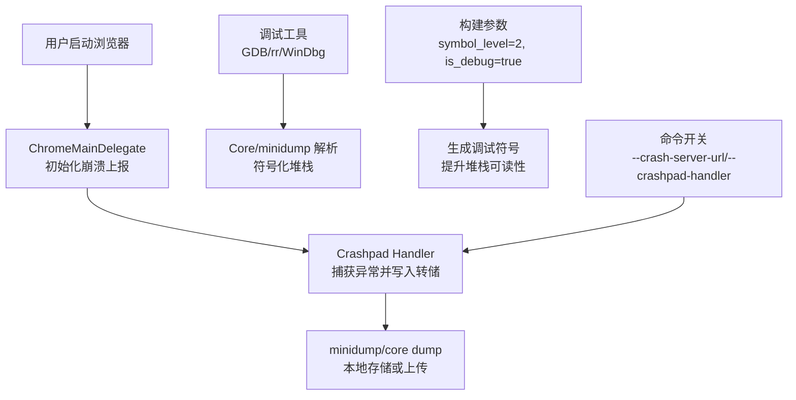
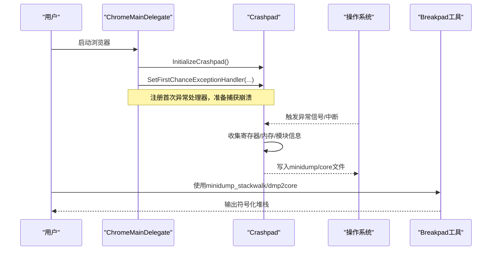
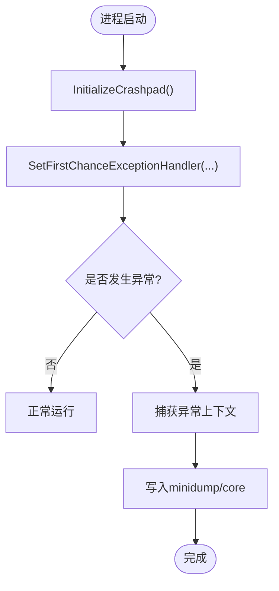
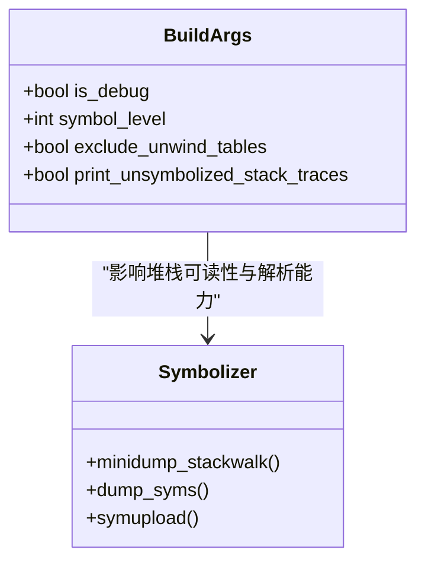
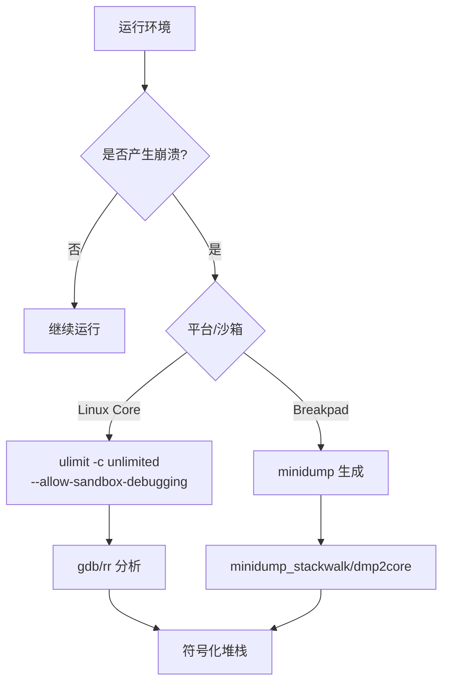
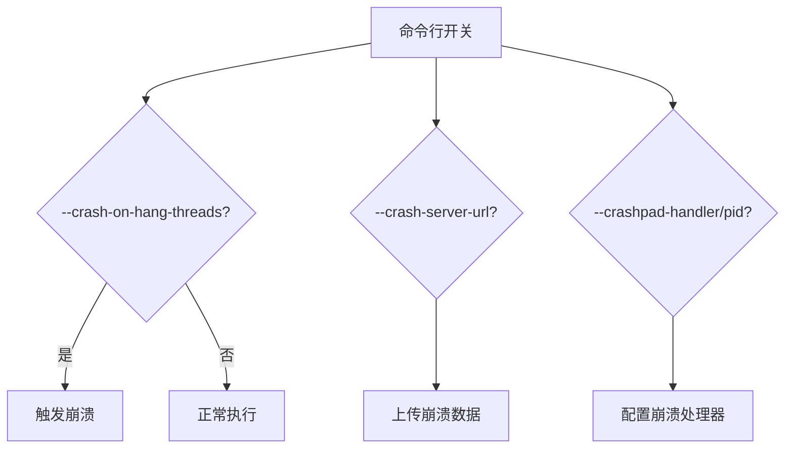
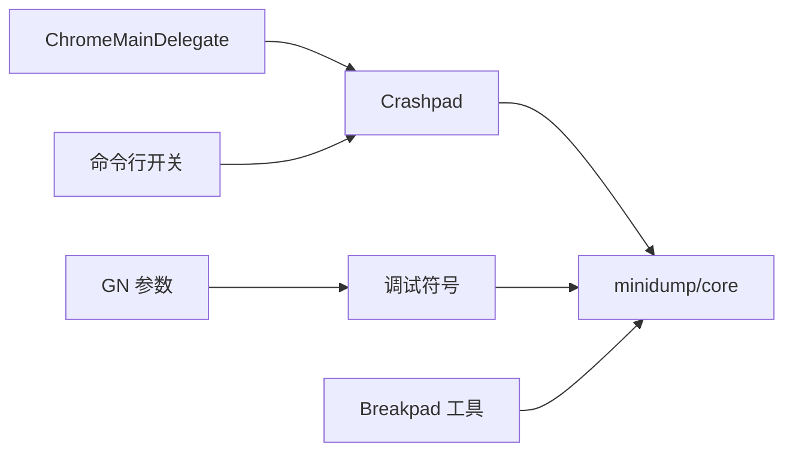

# 崩溃分析

本文引用的文件

- [DEBUGGING.md](https://github.com/Mcloud136/Mcloud-Browser/blob/main/infra/DEBUG/DEBUGGING.md)
- [README.md](https://github.com/Mcloud136/Mcloud-Browser/blob/main/infra/DEBUG/README.md)
- [debug_args.gn](https://github.com/Mcloud136/Mcloud-Browser/blob/main/infra/DEBUG/debug_args.gn)
- [chrome_main_delegate.cc](https://github.com/Mcloud136/Mcloud-Browser/blob/main/src/chrome/app/chrome_main_delegate.cc)
- [chrome_content_browser_client.cc](https://github.com/Mcloud136/Mcloud-Browser/blob/main/src/chrome/browser/chrome_content_browser_client.cc)
- [mcloud-2024-ui.patch](https://github.com/Mcloud136/Mcloud-Browser/blob/main/other/mcloud-2024-ui.patch)
- [BUILD.gn (content shell crash test)](https://github.com/Mcloud136/Mcloud-Browser/blob/main/src/content/shell/BUILD.gn)
- [BUILD.gn (Android breakpad tools)](https://github.com/Mcloud136/Mcloud-Browser/blob/main/src/BUILD.gn)
- [CMDLINE_FLAGS_LIST.md](https://github.com/Mcloud136/Mcloud-Browser/blob/main/infra/CMDLINE_FLAGS_LIST.md)
- [args.list](https://github.com/Mcloud136/Mcloud-Browser/blob/main/infra/args.list)

## 目录
1. [简介](#简介)
2. [项目结构](#项目结构)
3. [核心组件](#核心组件)
4. [架构总览](#架构总览)
5. [详细组件分析](#详细组件分析)
6. [依赖关系分析](#依赖关系分析)
7. [性能与稳定性考量](#性能与稳定性考量)
8. [故障诊断指南](#故障诊断指南)
9. [结论](#结论)
10. [附录](#附录)

## 简介
本指南面向 MCloud Browser 的崩溃分析与故障诊断，覆盖崩溃转储（minidump、core dump）的收集与分析方法、堆栈信息解读、常见崩溃模式识别与修复策略，以及崩溃预防的最佳实践。文档基于仓库中的调试基础设施、构建参数与崩溃上报初始化代码，提供可操作的步骤与图示说明。

## 项目结构
MCloud Browser 在调试与崩溃方面由以下关键部分组成：
- 调试文档与脚本：位于 infra/DEBUG，包含 Linux 调试技巧、Core 文件生成、Breakpad minidump 指引等。
- 构建参数：infra/DEBUG/debug_args.gn 启用符号级别、调试信息等，便于生成可分析的堆栈。
- 崩溃上报初始化：src/chrome/app/chrome_main_delegate.cc 中初始化 Crashpad 并设置首次异常处理。
- 内容进程客户端：src/chrome/browser/chrome_content_browser_client.cc 中配置崩溃上报相关开关与处理器通信。
- 测试与工具链集成：src/content/shell/BUILD.gn 与 src/BUILD.gn 引入 Breakpad 工具用于 minidump 解析与符号上传。
- 命令行开关：infra/CMDLINE_FLAGS_LIST.md 列出 --crash-server-url、--crashpad-handler 等崩溃相关开关。
- 日志与断言行为增强：other/mcloud-2024-ui.patch 调整断言与致命日志行为，辅助问题定位。

**图表来源**
- [chrome_main_delegate.cc:1313-1525](https://github.com/Mcloud136/Mcloud-Browser/blob/main/src/chrome/app/chrome_main_delegate.cc#L1313-L1525)
- [debug_args.gn:16-27](https://github.com/Mcloud136/Mcloud-Browser/blob/main/infra/DEBUG/debug_args.gn#L16-L27)
- [CMDLINE_FLAGS_LIST.md:440-448](https://github.com/Mcloud136/Mcloud-Browser/blob/main/infra/CMDLINE_FLAGS_LIST.md#L440-L448)

**章节来源**
- [README.md:1-16](https://github.com/Mcloud136/Mcloud-Browser/blob/main/infra/DEBUG/README.md#L1-L16)
- [debug_args.gn:1-87](https://github.com/Mcloud136/Mcloud-Browser/blob/main/infra/DEBUG/debug_args.gn#L1-L87)
- [chrome_main_delegate.cc:1313-1525](https://github.com/Mcloud136/Mcloud-Browser/blob/main/src/chrome/app/chrome_main_delegate.cc#L1313-L1525)
- [CMDLINE_FLAGS_LIST.md:440-448](https://github.com/Mcloud136/Mcloud-Browser/blob/main/infra/CMDLINE_FLAGS_LIST.md#L440-L448)

## 核心组件
- 崩溃上报初始化（Crashpad）：在进程启动早期初始化崩溃报告器，注册首次异常处理器，确保在崩溃发生时能捕获上下文并生成转储。
- 构建与符号：通过 GN 参数开启调试符号与完整 unwind 表，使生成的 minidump/core 能够被符号化工具还原为可读堆栈。
- 调试与转储工具：Breakpad 工具链（minidump_stackwalk、dump_syms、symupload）集成于构建产物，支持 minidump 解析与符号上传。
- 调试开关与流程：提供命令行开关控制崩溃服务器地址、处理器 PID、挂起检测等；Linux 下支持 core dump 与 rr 时间旅行调试。

**章节来源**
- [chrome_main_delegate.cc:1313-1525](https://github.com/Mcloud136/Mcloud-Browser/blob/main/src/chrome/app/chrome_main_delegate.cc#L1313-L1525)
- [debug_args.gn:16-27](https://github.com/Mcloud136/Mcloud-Browser/blob/main/infra/DEBUG/debug_args.gn#L16-L27)
- [BUILD.gn (content shell crash test):1075-1122](https://github.com/Mcloud136/Mcloud-Browser/blob/main/src/content/shell/BUILD.gn#L1075-L1122)
- [BUILD.gn (Android breakpad tools):1313-1326](https://github.com/Mcloud136/Mcloud-Browser/blob/main/src/BUILD.gn#L1313-L1326)
- [CMDLINE_FLAGS_LIST.md:440-448](https://github.com/Mcloud136/Mcloud-Browser/blob/main/infra/CMDLINE_FLAGS_LIST.md#L440-L448)

## 架构总览
下图展示从进程启动到崩溃转储生成与解析的关键路径，包括 Crashpad 初始化、异常捕获、转储写入与符号化。

**图表来源**
- [chrome_main_delegate.cc:1502-1525](https://github.com/Mcloud136/Mcloud-Browser/blob/main/src/chrome/app/chrome_main_delegate.cc#L1502-L1525)
- [BUILD.gn (content shell crash test):1097-1122](https://github.com/Mcloud136/Mcloud-Browser/blob/main/src/content/shell/BUILD.gn#L1097-L1122)
- [DEBUGGING.md:351-366](https://github.com/Mcloud136/Mcloud-Browser/blob/main/infra/DEBUG/DEBUGGING.md#L351-L366)

## 详细组件分析

### 崩溃上报初始化（Crashpad）
- 初始化时机：在 ChromeMainDelegate 中根据平台与进程类型调用 InitializeCrashpad，并在非 Android 平台设置首次异常处理器以捕获 V8 WebAssembly 陷阱等异常。
- 关键行为：
  - 初始化崩溃键（Crash Keys），便于在转储中标注关键状态。
  - 创建 ChromeCrashReporterClient，统一崩溃上报策略。
  - 在特定条件下（如测试标志）主动触发崩溃以验证上报链路。

**图表来源**
- [chrome_main_delegate.cc:1502-1525](https://github.com/Mcloud136/Mcloud-Browser/blob/main/src/chrome/app/chrome_main_delegate.cc#L1502-L1525)

**章节来源**
- [chrome_main_delegate.cc:1313-1525](https://github.com/Mcloud136/Mcloud-Browser/blob/main/src/chrome/app/chrome_main_delegate.cc#L1313-L1525)

### 构建参数与符号级别
- debug_args.gn 中启用 is_debug=true、symbol_level=2、exclude_unwind_tables=false，确保生成完整的调试符号与 unwind 信息，利于堆栈还原。
- args.list 中 print_unsymbolized_stack_traces 默认关闭，若开启则仅输出文件偏移，需配合符号化工具进行还原。

**图表来源**
- [debug_args.gn:16-27](https://github.com/Mcloud136/Mcloud-Browser/blob/main/infra/DEBUG/debug_args.gn#L16-L27)
- [args.list:4201-4209](https://github.com/Mcloud136/Mcloud-Browser/blob/main/infra/args.list#L4201-L4209)
- [BUILD.gn (Android breakpad tools):1313-1326](https://github.com/Mcloud136/Mcloud-Browser/blob/main/src/BUILD.gn#L1313-L1326)

**章节来源**
- [debug_args.gn:1-87](https://github.com/Mcloud136/Mcloud-Browser/blob/main/infra/DEBUG/debug_args.gn#L1-87)
- [args.list:4201-4209](https://github.com/Mcloud136/Mcloud-Browser/blob/main/infra/args.list#L4201-L4209)

### 调试与转储收集（Linux Core 与 Breakpad Minidump）
- Core 文件：通过 ulimit 设置允许生成 core dump；对沙箱子进程可能需要 --allow-sandbox-debugging；冻结场景可通过 SIGABRT 触发 core。
- Breakpad Minidump：通过内置 Breakpad 机制生成 minidump，可使用 dmp2minidump.py 转换或 minidump_stackwalk 解析。
- 调试技巧：使用 --no-sandbox、--renderer-cmd-prefix 将渲染器进程接入 gdb；使用 rr 进行时间旅行调试。

**图表来源**
- [DEBUGGING.md:351-366](https://github.com/Mcloud136/Mcloud-Browser/blob/main/infra/DEBUG/DEBUGGING.md#L351-L366)
- [DEBUGGING.md:45-87](https://github.com/Mcloud136/Mcloud-Browser/blob/main/infra/DEBUG/DEBUGGING.md#L45-L87)
- [DEBUGGING.md:256-312](https://github.com/Mcloud136/Mcloud-Browser/blob/main/infra/DEBUG/DEBUGGING.md#L256-L312)

**章节来源**
- [DEBUGGING.md:351-366](https://github.com/Mcloud136/Mcloud-Browser/blob/main/infra/DEBUG/DEBUGGING.md#L351-L366)
- [DEBUGGING.md:45-87](https://github.com/Mcloud136/Mcloud-Browser/blob/main/infra/DEBUG/DEBUGGING.md#L45-L87)
- [DEBUGGING.md:256-312](https://github.com/Mcloud136/Mcloud-Browser/blob/main/infra/DEBUG/DEBUGGING.md#L256-L312)

### 命令行开关与崩溃行为
- --crash-on-hang-threads：当指定线程长时间无响应时强制崩溃，便于定位 UI/IO 线程阻塞问题。
- --crash-server-url：配置崩溃数据上传服务器地址（生产/预发布不同）。
- --crashpad-handler / --crashpad-handler-pid：Windows 上以 chrome.exe 内嵌处理器形式运行崩溃处理器，或指定处理器 PID。

**图表来源**
- [CMDLINE_FLAGS_LIST.md:440-448](https://github.com/Mcloud136/Mcloud-Browser/blob/main/infra/CMDLINE_FLAGS_LIST.md#L440-L448)

**章节来源**
- [CMDLINE_FLAGS_LIST.md:440-448](https://github.com/Mcloud136/Mcloud-Browser/blob/main/infra/CMDLINE_FLAGS_LIST.md#L440-L448)

### 日志与断言行为增强（MCLOUD_DEBUG）
- other/mcloud-2024-ui.patch 中引入 MCLOUD_DEBUG 构建标志，调整 DCHECK 与致命日志行为，使其在非官方构建中更易收集必要信息而不立即终止，有助于用户在不配置专用调试器的情况下获取堆栈。
- 该补丁还修改了部分文件操作与消息框样式，改善调试体验。

**章节来源**
- [mcloud-2024-ui.patch:1-167](https://github.com/Mcloud136/Mcloud-Browser/blob/main/other/mcloud-2024-ui.patch#L1-L167)
- [mcloud-2024-ui.patch:165-197](https://github.com/Mcloud136/Mcloud-Browser/blob/main/other/mcloud-2024-ui.patch#L165-L197)

## 依赖关系分析
- 崩溃上报依赖 Crashpad 初始化与首次异常处理器注册，受进程类型与平台分支影响。
- 构建产物依赖 GN 参数决定符号级别与调试信息完整性。
- 测试与工具链依赖 Breakpad 工具（minidump_stackwalk、dump_syms、symupload）用于解析与上传。
- 命令行开关影响崩溃行为与上报目标。

**图表来源**
- [chrome_main_delegate.cc:1502-1525](https://github.com/Mcloud136/Mcloud-Browser/blob/main/src/chrome/app/chrome_main_delegate.cc#L1502-L1525)
- [debug_args.gn:16-27](https://github.com/Mcloud136/Mcloud-Browser/blob/main/infra/DEBUG/debug_args.gn#L16-L27)
- [BUILD.gn (content shell crash test):1097-1122](https://github.com/Mcloud136/Mcloud-Browser/blob/main/src/content/shell/BUILD.gn#L1097-L1122)
- [CMDLINE_FLAGS_LIST.md:440-448](https://github.com/Mcloud136/Mcloud-Browser/blob/main/infra/CMDLINE_FLAGS_LIST.md#L440-L448)

**章节来源**
- [chrome_main_delegate.cc:1502-1525](https://github.com/Mcloud136/Mcloud-Browser/blob/main/src/chrome/app/chrome_main_delegate.cc#L1502-L1525)
- [debug_args.gn:16-27](https://github.com/Mcloud136/Mcloud-Browser/blob/main/infra/DEBUG/debug_args.gn#L16-L27)
- [BUILD.gn (content shell crash test):1097-1122](https://github.com/Mcloud136/Mcloud-Browser/blob/main/src/content/shell/BUILD.gn#L1097-L1122)
- [CMDLINE_FLAGS_LIST.md:440-448](https://github.com/Mcloud136/Mcloud-Browser/blob/main/infra/CMDLINE_FLAGS_LIST.md#L440-L448)

## 性能与稳定性考量
- 符号级别与调试信息：symbol_level=2 与禁用 strip 能显著提升堆栈可读性，但会增加二进制体积与构建时间。
- 沙箱与调试：--no-sandbox 便于调试但会绕过安全隔离，仅用于临时排查；沙箱子进程可能需要 --allow-sandbox-debugging 才能附加调试器或生成 core。
- 线程挂起检测：--crash-on-hang-threads 可在 UI/IO 线程长时间无响应时强制崩溃，帮助快速定位阻塞点。
- 日志与断言：MCLOUD_DEBUG 构建标志可降低断言致命性，便于收集更多信息而不立即终止程序。

[本节为通用指导，不直接分析具体文件]

## 故障诊断指南

### 收集崩溃转储
- Linux Core：
  - 设置 ulimit -c unlimited 以允许生成 core dump。
  - 对沙箱子进程添加 --allow-sandbox-debugging。
  - 冻结场景可通过 kill -6 发送 SIGABRT 触发 core。
- Breakpad Minidump：
  - 使用内置 Breakpad 机制自动生成 minidump。
  - 使用 dmp2minidump.py 转换或使用 minidump_stackwalk 解析。
- Windows：
  - 使用 --crashpad-handler 与 --crashpad-handler-pid 配置崩溃处理器。
  - 结合 WinDbg 与符号服务器进行堆栈还原。

**章节来源**
- [DEBUGGING.md:351-366](https://github.com/Mcloud136/Mcloud-Browser/blob/main/infra/DEBUG/DEBUGGING.md#L351-L366)
- [CMDLINE_FLAGS_LIST.md:440-448](https://github.com/Mcloud136/Mcloud-Browser/blob/main/infra/CMDLINE_FLAGS_LIST.md#L440-L448)

### 解读崩溃堆栈
- 优先确认符号级别与调试符号是否可用（symbol_level=2、未 strip）。
- 使用 minidump_stackwalk 或 gdb 对 core 进行符号化，关注顶层函数与异常类型（如段错误、断言失败）。
- 结合日志与断言信息（MCLOUD_DEBUG 构建）定位触发点。
- 对于多线程场景，注意区分主进程与子进程（渲染器、GPU、插件）的堆栈。

**章节来源**
- [debug_args.gn:16-27](https://github.com/Mcloud136/Mcloud-Browser/blob/main/infra/DEBUG/debug_args.gn#L16-L27)
- [BUILD.gn (content shell crash test):1097-1122](https://github.com/Mcloud136/Mcloud-Browser/blob/main/src/content/shell/BUILD.gn#L1097-L1122)
- [mcloud-2024-ui.patch:1-167](https://github.com/Mcloud136/Mcloud-Browser/blob/main/other/mcloud-2024-ui.patch#L1-L167)

### 常见崩溃模式与修复策略
- UI/IO 线程挂起：
  - 使用 --crash-on-hang-threads=UI:18,IO:18 强制崩溃，定位阻塞点。
  - 检查长耗时任务是否在主线程执行，必要时异步化。
- 沙箱相关崩溃：
  - 添加 --allow-sandbox-debugging 以允许调试或生成 core。
  - 检查系统安全模块（如 Yama ptrace_scope）是否阻止附加调试器。
- 渲染器崩溃：
  - 使用 --renderer-cmd-prefix 将渲染器进程接入 gdb。
  - 单进程模式 --single-process 简化调试（需配合 --disable-gpu 避免已知问题）。
- GPU 子进程崩溃：
  - 使用 --gpu-launcher 将 GPU 进程接入调试器。
  - 检查驱动与硬件加速相关配置。

**章节来源**
- [CMDLINE_FLAGS_LIST.md:440-448](https://github.com/Mcloud136/Mcloud-Browser/blob/main/infra/CMDLINE_FLAGS_LIST.md#L440-L448)
- [DEBUGGING.md:45-87](https://github.com/Mcloud136/Mcloud-Browser/blob/main/infra/DEBUG/DEBUGGING.md#L45-L87)
- [DEBUGGING.md:163-207](https://github.com/Mcloud136/Mcloud-Browser/blob/main/infra/DEBUG/DEBUGGING.md#L163-L207)

### 崩溃预防最佳实践
- 构建配置：
  - 保持 symbol_level=2 与 is_debug=true 用于问题复现与定位。
  - 避免在生产构建中启用过多调试开销。
- 运行时配置：
  - 合理使用 --crash-on-hang-threads 监控线程健康。
  - 谨慎使用 --no-sandbox，仅在临时调试时启用。
- 日志与断言：
  - 使用 MCLOUD_DEBUG 构建标志增强日志与断言信息。
  - 结合 --log-level=0 与 --enable-logging=stderr 输出详细日志。
- 测试与回归：
  - 利用 Breakpad 工具链自动化 minidump 解析与上传。
  - 通过 rr 记录与回放复杂交互场景，提高定位效率。

**章节来源**
- [debug_args.gn:16-27](https://github.com/Mcloud136/Mcloud-Browser/blob/main/infra/DEBUG/debug_args.gn#L16-L27)
- [mcloud-2024-ui.patch:1-167](https://github.com/Mcloud136/Mcloud-Browser/blob/main/other/mcloud-2024-ui.patch#L1-L167)
- [DEBUGGING.md:463-487](https://github.com/Mcloud136/Mcloud-Browser/blob/main/infra/DEBUG/DEBUGGING.md#L463-L487)

## 结论
MCloud Browser 提供了完善的崩溃转储与调试基础设施，涵盖 Crashpad 初始化、Breakpad 工具链、GN 构建参数与丰富的命令行开关。通过合理配置符号级别、使用调试工具（GDB、rr、WinDbg）与遵循最佳实践，可以高效收集与分析崩溃信息，快速定位并修复问题。建议在日常开发与测试中启用调试构建与必要的运行时开关，以提升问题发现与解决效率。

[本节为总结，不直接分析具体文件]

## 附录
- 常用命令参考：
  - Linux Core：ulimit -c unlimited；kill -6 <pid> 触发 core。
  - Breakpad：minidump_stackwalk <minidump>；dmp2minidump.py <dmp>。
  - 调试渲染器：--renderer-cmd-prefix='xterm -e gdb --args'。
  - 单进程调试：--single-process（必要时 --disable-gpu）。
- 符号化与上传：
  - dump_syms 生成符号文件；symupload 上传至符号服务器。
  - 使用 print_unsymbolized_stack_traces 与 asan_symbolize.py 辅助堆栈还原。

[本节为补充信息，不直接分析具体文件]