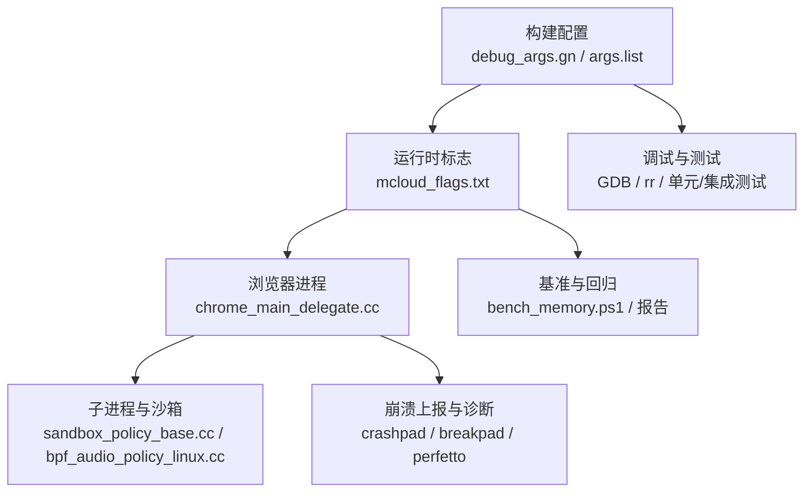
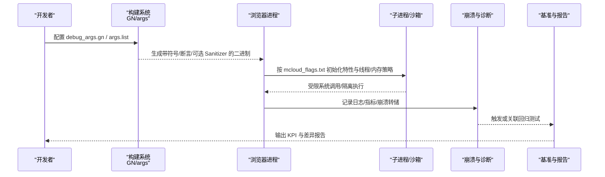
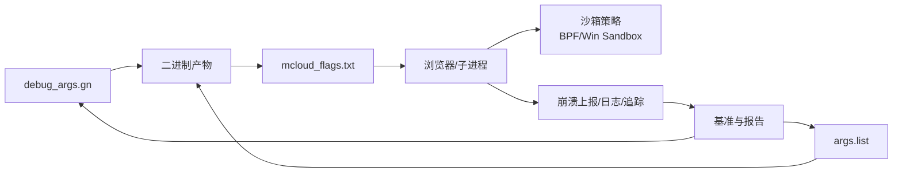

# 崩溃预防

<cite>
**本文引用的文件**
- [README.md](file://README.md)
- [mcloud_flags.txt](file://mcloud_flags.txt)
- [DEBUGGING.md](file://infra/DEBUG/DEBUGGING.md)
- [debug_args.gn](file://infra/DEBUG/debug_args.gn)
- [chrome_main_delegate.cc](file://src/chrome/app/chrome_main_delegate.cc)
- [sandbox_policy_base.cc](file://src/sandbox/win/src/sandbox_policy_base.cc)
- [bpf_audio_policy_linux.cc](file://src/sandbox/policy/linux/bpf_audio_policy_linux.cc)
- [BUILD.gn (content shell)](file://src/content/shell/BUILD.gn)
- [shell_main_delegate.cc](file://src/content/shell/app/shell_main_delegate.cc)
- [bench_memory.ps1](file://benchmark/bench_memory.ps1)
- [M151-benchmark.md](file://docs/dev-logs/M151-benchmark.md)
- [M151-opt-benchmark.md](file://docs/dev-logs/M151-opt-benchmark.md)
- [memory-Enable-the-tab-discards-feature.patch](file://infra/Flatpak/com.mcloud.browser/patches/chromium/memory-Enable-the-tab-discards-feature.patch)
- [args.list (sanitizers/perfetto)](file://infra/args.list)
- [win_args.list (sanitizers)](file://infra/win_args.list)
</cite>

## 目录
1. [简介](#简介)
2. [项目结构](#项目结构)
3. [核心组件](#核心组件)
4. [架构总览](#架构总览)
5. [详细组件分析](#详细组件分析)
6. [依赖关系分析](#依赖关系分析)
7. [性能与稳定性考量](#性能与稳定性考量)
8. [故障排查指南](#故障排查指南)
9. [结论](#结论)
10. [附录](#附录)

## 简介
本文件面向 MCloud Browser（基于 Chromium M151）的崩溃预防最佳实践，围绕代码审查、单元测试、性能测试、内存安全编程规范、异常处理与错误恢复、多线程同步防护、资源管理以及崩溃监控与告警配置等主题，结合仓库中的构建参数、运行时标志、调试与基准工具，给出可落地的策略与流程。

## 项目结构
本项目在崩溃预防方面主要涉及以下层面：
- 构建期：通过 GN 参数启用调试符号、断言、Sanitizer 等能力，便于早期发现内存与并发问题。
- 运行期：通过内置启动标志优化内存、渲染、网络、媒体等子系统，降低 OOM、卡顿与解码异常导致的崩溃风险。
- 沙箱与安全：Linux seccomp BPF 与 Windows 沙箱策略限制危险系统调用，减少越权访问引发的崩溃。
- 调试与诊断：提供 GDB/rr、Breakpad/Crashpad、Perfetto 等工具链，配合日志与指标采集定位问题。
- 基准与回归：自动化脚本与报告验证内存占用、启动时间、预载收益等关键指标，辅助回归检测。

图表来源
- [debug_args.gn:1-87](file://infra/DEBUG/debug_args.gn#L1-L87)
- [args.list:2229-2268](file://infra/args.list#L2229-L2268)
- [mcloud_flags.txt:1-120](file://mcloud_flags.txt#L1-L120)
- [chrome_main_delegate.cc:1289-1326](file://src/chrome/app/chrome_main_delegate.cc#L1289-L1326)
- [sandbox_policy_base.cc:110-152](file://src/sandbox/win/src/sandbox_policy_base.cc#L110-L152)
- [bpf_audio_policy_linux.cc:36-130](file://src/sandbox/policy/linux/bpf_audio_policy_linux.cc#L36-L130)
- [bench_memory.ps1:62-77](file://benchmark/bench_memory.ps1#L62-L77)

章节来源
- [README.md:18-33](file://README.md#L18-L33)
- [debug_args.gn:1-87](file://infra/DEBUG/debug_args.gn#L1-L87)
- [mcloud_flags.txt:1-120](file://mcloud_flags.txt#L1-L120)

## 核心组件
- 构建与调试开关：开启 dcheck_always_on、symbol_level、exclude_unwind_tables=false 等，提升可观测性与可调试性。
- 运行时标志集：覆盖启动、V8、页面加载、内存、多线程、渲染、媒体、GPU、网络等，减少 OOM、卡顿与解码异常。
- 沙箱与权限控制：Linux seccomp BPF 白名单与 Windows 沙箱策略，限制非法系统调用，避免越权导致崩溃。
- 崩溃上报与诊断：Crashpad/Breakpad、Perfetto、日志级别与 IPC 调试开关，支撑快速定位。
- 基准与回归：内存/启动/导航等基准脚本与报告，保障变更不引入退化。

章节来源
- [debug_args.gn:15-27](file://infra/DEBUG/debug_args.gn#L15-L27)
- [mcloud_flags.txt:27-112](file://mcloud_flags.txt#L27-L112)
- [bpf_audio_policy_linux.cc:36-130](file://src/sandbox/policy/linux/bpf_audio_policy_linux.cc#L36-L130)
- [sandbox_policy_base.cc:110-152](file://src/sandbox/win/src/sandbox_policy_base.cc#L110-L152)
- [args.list:2229-2268](file://infra/args.list#L2229-L2268)
- [bench_memory.ps1:62-77](file://benchmark/bench_memory.ps1#L62-L77)

## 架构总览
下图展示崩溃预防在“构建—运行—诊断—回归”的全链路闭环：构建期注入调试与 Sanitizer；运行期通过标志与沙箱降低风险；出现异常时由崩溃上报与诊断工具捕获；最后用基准与报告验证回归。

图表来源
- [debug_args.gn:15-27](file://infra/DEBUG/debug_args.gn#L15-L27)
- [args.list:2229-2268](file://infra/args.list#L2229-L2268)
- [mcloud_flags.txt:1-120](file://mcloud_flags.txt#L1-L120)
- [chrome_main_delegate.cc:1289-1326](file://src/chrome/app/chrome_main_delegate.cc#L1289-L1326)
- [bpf_audio_policy_linux.cc:36-130](file://src/sandbox/policy/linux/bpf_audio_policy_linux.cc#L36-L130)
- [bench_memory.ps1:62-77](file://benchmark/bench_memory.ps1#L62-L77)

## 详细组件分析

### 构建期：断言、符号与 Sanitizer 配置
- 断言与调试符号：dcheck_always_on=true、symbol_level=2、exclude_unwind_tables=false，有助于在开发阶段尽早暴露逻辑错误并生成可用堆栈。
- Sanitizer 选项：is_msan、is_lsan、msan_track_origins、fail_on_san_warnings 等用于检测未初始化内存、泄漏与警告即失败。
- Perfetto：enable_perfetto_* 系列开关支持追踪与崩溃转储联动分析。

建议
- 在本地与 CI 的 Debug/RelWithDebInfo 构建中默认开启断言与符号。
- 对关键路径开启 MSAN/LSAN，并在 PR 中设置 fail_on_san_warnings=true。
- 使用 Perfetto 进行长时运行与压力场景下的时序分析。

章节来源
- [debug_args.gn:15-27](file://infra/DEBUG/debug_args.gn#L15-L27)
- [args.list:3869-3906](file://infra/args.list#L3869-L3906)
- [win_args.list:3264-3308](file://infra/win_args.list#L3264-L3308)
- [args.list:2229-2268](file://infra/args.list#L2229-L2268)

### 运行期：内存与资源保护（标签页丢弃与内存回收）
- 标签页丢弃：通过 Patch 启用 Linux/ChromeOS 上的自动/手动丢弃，缓解内存压力。
- 内存回收器与碎片整理：PartitionAllocMemoryReclaimer、SortActiveSlotSpans、EventuallyZeroFreedMemory 等标志降低碎片与驻留内存。
- 提交限制丢弃：DiscardOnCommitLimit、SustainedPMUrgentDiscarding 在内存紧张时主动释放。

建议
- 保持 InfiniteTabsFreezing* 与相关 PartitionAlloc 标志开启，结合真实站点压测评估收益。
- 定期运行 bench_memory.ps1 观察多标签驻留内存中位数变化。

章节来源
- [memory-Enable-the-tab-discards-feature.patch:1-71](file://infra/Flatpak/com.mcloud.browser/patches/chromium/memory-Enable-the-tab-discards-feature.patch#L1-L71)
- [mcloud_flags.txt:27-38](file://mcloud_flags.txt#L27-L38)
- [bench_memory.ps1:62-77](file://benchmark/bench_memory.ps1#L62-L77)

### 运行期：媒体与 GPU 解码稳定性
- 针对 Intel 核显 D3D12 视频解码绿屏缺陷，显式禁用 D3D12VideoDecoder，回退至 D3D11VideoDecoder，保证硬解能力不受影响且避免崩溃。
- 其他媒体/GPU 标志：DirectComposition、SkiaGraphitePrecompilation、ResourcePoolPreferExactSizeReuse、HighFramerateRequestFromClient 等提升渲染与解码稳定性。

建议
- 在目标硬件矩阵上验证解码路径，必要时通过 feature 黑名单规避已知驱动缺陷。
- 持续跟踪上游修复与 GPU 驱动更新，适时重新启用相关特性。

章节来源
- [mcloud_flags.txt:83-96](file://mcloud_flags.txt#L83-L96)

### 沙箱与权限：限制危险系统调用
- Linux seccomp BPF：对 connect/ftruncate/ioctl/socket/kill 等进行细粒度允许/拒绝，避免非法调用导致崩溃或被杀。
- Windows 沙箱：应用最小权限策略，清理 AppShim 数据，限制完整性级别与缓解措施。

建议
- 新增系统调用需经沙箱策略评审，确保仅放行必要接口。
- 在 CI 中运行 sandbox 单元测试，防止策略漂移。

章节来源
- [bpf_audio_policy_linux.cc:36-130](file://src/sandbox/policy/linux/bpf_audio_policy_linux.cc#L36-L130)
- [sandbox_policy_base.cc:110-152](file://src/sandbox/win/src/sandbox_policy_base.cc#L110-L152)

### 崩溃上报与诊断：Crashpad/Breakpad、日志与追踪
- 主进程初始化诊断与恢复任务，确保崩溃收集与恢复流程可靠。
- content shell 集成 Crashpad/Breakpad 测试与工具链，便于在测试环境复现与验证崩溃路径。
- 日志与 IPC 调试：--log-level、CHROME_IPC_LOGGING、Perfetto 追踪，辅助定位异步与跨进程问题。

建议
- 发布构建保留符号与 unwind 表，确保崩溃堆栈可读。
- 将崩溃事件与用户会话上下文关联，形成告警与回溯闭环。

章节来源
- [chrome_main_delegate.cc:1289-1326](file://src/chrome/app/chrome_main_delegate.cc#L1289-L1326)
- [BUILD.gn (content shell):1073-1128](file://src/content/shell/BUILD.gn#L1073-L1128)
- [shell_main_delegate.cc:36-70](file://src/content/shell/app/shell_main_delegate.cc#L36-L70)
- [DEBUGGING.md:463-487](file://infra/DEBUG/DEBUGGING.md#L463-L487)

### 基准与回归：内存与启动稳定性验证
- 内存基准：bench_memory.ps1 统计多标签驻留内存中位数，作为回归阈值。
- 启动与预载：verify_builtin_flags.ps1 验证内置标志注入；报告对比冷启动与内存峰值变化。

建议
- 将 K1/K2 纳入 PR 门禁，超阈自动阻断合并。
- 对预载类优化进行“收益/代价”双维度评估，避免以内存换速度的隐性退化。

章节来源
- [bench_memory.ps1:62-77](file://benchmark/bench_memory.ps1#L62-L77)
- [M151-benchmark.md:1-30](file://docs/dev-logs/M151-benchmark.md#L1-L30)
- [M151-opt-benchmark.md:1-52](file://docs/dev-logs/M151-opt-benchmark.md#L1-L52)

## 依赖关系分析
- 构建参数影响运行行为：debug_args.gn 决定符号/断言/Sanitizer；args.list 控制 Perfetto 与 Sanitizer 开关。
- 运行时标志驱动子系统：mcloud_flags.txt 统一注入启动、内存、媒体、GPU、网络等特性。
- 沙箱策略约束子进程：Linux BPF 与 Windows 沙箱共同构成最小权限边界。
- 诊断与基准反馈到构建与标志：崩溃与基准结果指导标志取舍与构建开关调整。

图表来源
- [debug_args.gn:15-27](file://infra/DEBUG/debug_args.gn#L15-L27)
- [args.list:2229-2268](file://infra/args.list#L2229-L2268)
- [mcloud_flags.txt:1-120](file://mcloud_flags.txt#L1-L120)
- [bpf_audio_policy_linux.cc:36-130](file://src/sandbox/policy/linux/bpf_audio_policy_linux.cc#L36-L130)
- [sandbox_policy_base.cc:110-152](file://src/sandbox/win/src/sandbox_policy_base.cc#L110-L152)

章节来源
- [debug_args.gn:15-27](file://infra/DEBUG/debug_args.gn#L15-L27)
- [args.list:2229-2268](file://infra/args.list#L2229-L2268)
- [mcloud_flags.txt:1-120](file://mcloud_flags.txt#L1-L120)

## 性能与稳定性考量
- 内存优先：在多标签场景下，优先启用标签页冻结与内存回收器，结合真实站点压测评估。
- 解码降级策略：对已知有缺陷的 GPU/驱动组合采用 feature 降级，保障可用性。
- 预载权衡：预载类优化需同时评估内存代价与导航收益，避免隐性退化。
- 构建质量：在 Debug/RelWithDebInfo 中开启断言与 Sanitizer，CI 中设置 fail_on_san_warnings=true。

[本节为通用指导，无需具体文件引用]

## 故障排查指南
- 调试入口：使用 --no-sandbox（临时）、--renderer-cmd-prefix 将渲染器接入 GDB；或使用 rr 录制回放。
- 核心与 minidump：ulimit -c unlimited 生成 core；Breakpad minidump 转换与分析。
- 日志与 IPC：--log-level=0 与 CHROME_IPC_LOGGING=1 获取更详细日志。
- 沙箱调试：--allow-sandbox-debugging 以便附加调试器；必要时关闭 seccomp 以定位问题。

章节来源
- [DEBUGGING.md:23-87](file://infra/DEBUG/DEBUGGING.md#L23-L87)
- [DEBUGGING.md:150-166](file://infra/DEBUG/DEBUGGING.md#L150-L166)
- [DEBUGGING.md:351-366](file://infra/DEBUG/DEBUGGING.md#L351-L366)
- [DEBUGGING.md:463-487](file://infra/DEBUG/DEBUGGING.md#L463-L487)

## 结论
通过“构建期断言与 Sanitizer + 运行期内存与解码稳定化 + 沙箱最小权限 + 崩溃上报与诊断 + 基准回归”的体系化手段，可在 MCloud Browser 中有效预防崩溃并快速定位问题。建议在 PR 流程中固化相关检查项，持续优化标志与策略，确保在性能与稳定性之间取得平衡。

[本节为总结，无需具体文件引用]

## 附录
- 推荐构建开关（Debug/RelWithDebInfo）
  - dcheck_always_on=true、symbol_level=2、exclude_unwind_tables=false
  - is_msan/is_lsan 按需开启；fail_on_san_warnings=true
  - enable_perfetto_trace_processor=true，结合崩溃转储分析
- 推荐运行标志（示例）
  - 内存：InfiniteTabsFreezing、PartitionAllocMemoryReclaimer、DiscardOnCommitLimit
  - 媒体/GPU：SkiaGraphitePrecompilation、ResourcePoolPreferExactSizeReuse、HighFramerateRequestFromClient
  - 解码降级：D3D12VideoDecoder 在特定硬件上禁用
- 基准与报告
  - 使用 bench_memory.ps1 采集 K2 内存中位数；结合 M151/M151-opt 报告评估回归

章节来源
- [debug_args.gn:15-27](file://infra/DEBUG/debug_args.gn#L15-L27)
- [args.list:3869-3906](file://infra/args.list#L3869-L3906)
- [args.list:2229-2268](file://infra/args.list#L2229-L2268)
- [mcloud_flags.txt:27-112](file://mcloud_flags.txt#L27-L112)
- [bench_memory.ps1:62-77](file://benchmark/bench_memory.ps1#L62-L77)
- [M151-benchmark.md:1-30](file://docs/dev-logs/M151-benchmark.md#L1-L30)
- [M151-opt-benchmark.md:1-52](file://docs/dev-logs/M151-opt-benchmark.md#L1-L52)