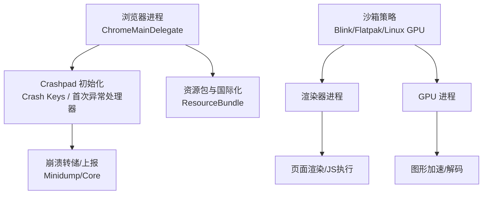
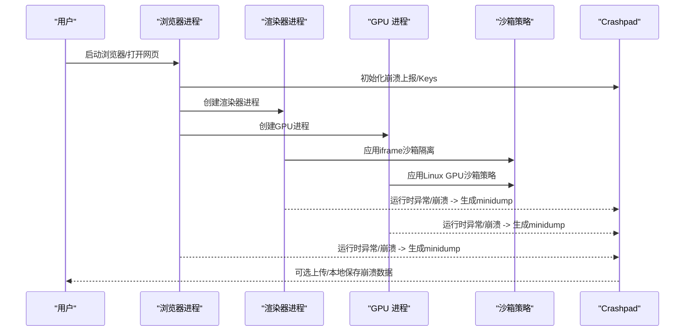
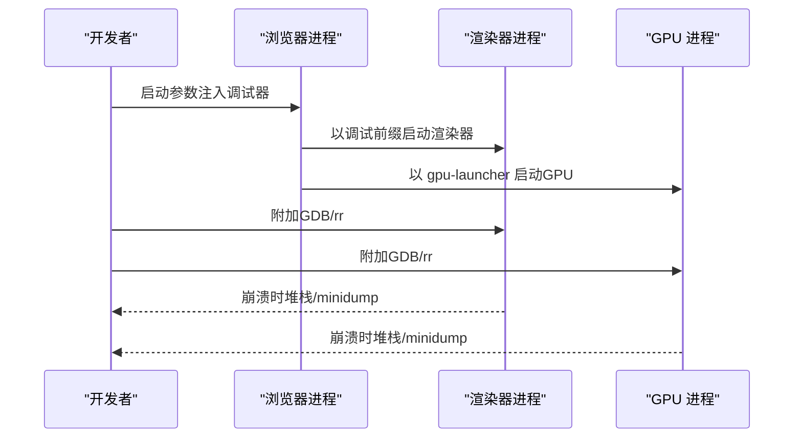
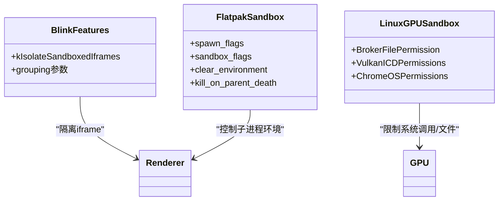
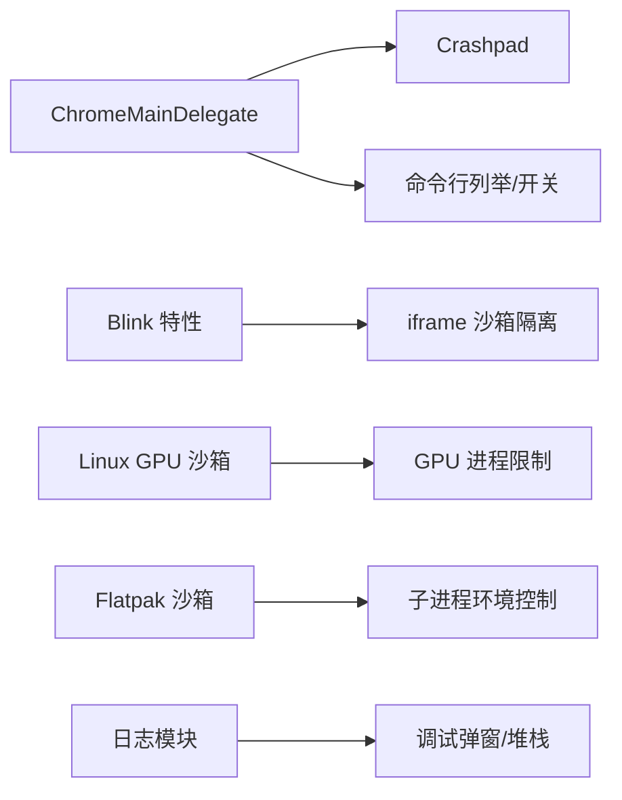

# 常见崩溃模式

<cite>
**本文引用的文件**
- [chrome_main_delegate.cc](file://src/chrome/app/chrome_main_delegate.cc)
- [DEBUGGING.md](file://infra/DEBUG/DEBUGGING.md)
- [CMDLINE_FLAGS_LIST.md](file://infra/CMDLINE_FLAGS_LIST.md)
- [features.cc](file://src/third_party/blink/common/features.cc)
- [gpu_pre_sandbox_hook_linux.cc](file://src/content/common/gpu_pre_sandbox_hook_linux.cc)
- [flatpak-Add-initial-sandbox-support.patch](file://infra/Flatpak/com.mcloud.browser/patches/chromium/flatpak-Add-initial-sandbox-support.patch)
- [mcloud-2024-ui.patch](file://other/mcloud-2024-ui.patch)
</cite>

## 目录
1. [简介](#简介)
2. [项目结构](#项目结构)
3. [核心组件](#核心组件)
4. [架构总览](#架构总览)
5. [详细组件分析](#详细组件分析)
6. [依赖关系分析](#依赖关系分析)
7. [性能与稳定性考量](#性能与稳定性考量)
8. [故障排查指南](#故障排查指南)
9. [结论](#结论)
10. [附录](#附录)

## 简介
本文件聚焦 MCloud Browser（基于 Chromium）在运行中常见的崩溃模式与根因，包括内存访问违规、空指针引用、栈溢出等典型问题；并提供崩溃日志解读技巧与定位策略。同时覆盖多进程环境下的崩溃处理（浏览器进程、渲染器进程、GPU 进程），以及沙箱相关崩溃问题的分析与解决思路。内容基于仓库中的实现与调试文档进行归纳总结，帮助开发者快速定位并修复问题。

## 项目结构
MCloud Browser 的崩溃与调试能力主要分布在以下位置：
- 启动与崩溃上报初始化：位于浏览器主入口与委托类中，负责 Crashpad 初始化、Crash Keys 设置、首次异常处理器注册等。
- 调试与多进程调试指南：提供 Linux 下 GDB、rr、Core Dump、Breakpad Minidump 等调试方法，以及渲染器/GPU 子进程的附加调试方式。
- 命令行开关：包含崩溃相关开关（如 --crash-on-hang-threads、--crash-server-url、--crashpad-handler 等）。
- 沙箱与隔离：Blink 特性控制 iframe 沙箱隔离；Linux GPU 进程沙箱预配置；Flatpak 沙箱集成。
- 日志与致命错误输出：对 FATAL 消息的处理、堆栈打印、调试弹窗等行为。

**图表来源**
- [chrome_main_delegate.cc:1371-1385](file://src/chrome/app/chrome_main_delegate.cc#L1371-L1385)
- [chrome_main_delegate.cc:1502-1524](file://src/chrome/app/chrome_main_delegate.cc#L1502-L1524)
- [DEBUGGING.md:43-87](file://infra/DEBUG/DEBUGGING.md#L43-L87)
- [DEBUGGING.md:163-166](file://infra/DEBUG/DEBUGGING.md#L163-L166)
- [features.cc:1034-1049](file://src/third_party/blink/common/features.cc#L1034-L1049)
- [gpu_pre_sandbox_hook_linux.cc:617-652](file://src/content/common/gpu_pre_sandbox_hook_linux.cc#L617-L652)
- [flatpak-Add-initial-sandbox-support.patch:978-1023](file://infra/Flatpak/com.mcloud.browser/patches/chromium/flatpak-Add-initial-sandbox-support.patch#L978-L1023)

**章节来源**
- [chrome_main_delegate.cc:1371-1385](file://src/chrome/app/chrome_main_delegate.cc#L1371-L1385)
- [chrome_main_delegate.cc:1502-1524](file://src/chrome/app/chrome_main_delegate.cc#L1502-L1524)
- [DEBUGGING.md:43-87](file://infra/DEBUG/DEBUGGING.md#L43-L87)
- [DEBUGGING.md:163-166](file://infra/DEBUG/DEBUGGING.md#L163-L166)
- [features.cc:1034-1049](file://src/third_party/blink/common/features.cc#L1034-L1049)
- [gpu_pre_sandbox_hook_linux.cc:617-652](file://src/content/common/gpu_pre_sandbox_hook_linux.cc#L617-L652)
- [flatpak-Add-initial-sandbox-support.patch:978-1023](file://infra/Flatpak/com.mcloud.browser/patches/chromium/flatpak-Add-initial-sandbox-support.patch#L978-L1023)

## 核心组件
- 崩溃上报与捕获
  - 通过 Crashpad 在各进程生命周期早期初始化，确保尽可能捕获崩溃信息。
  - 设置首次异常处理器（例如 WebAssembly 陷阱处理），提升可诊断性。
  - 初始化 Crash Keys，便于后续关联指标与用户上下文。
- 多进程调试支持
  - 提供渲染器/GPU/插件子进程的调试注入方式（--renderer-cmd-prefix、--gpu-launcher、--plugin-launcher）。
  - 支持 rr 时间旅行调试、Core Dump、Breakpad Minidump。
- 沙箱与隔离
  - Blink 特性启用 iframe 沙箱隔离，减少跨域风险导致的崩溃传播。
  - Linux GPU 进程沙箱预配置，限制系统调用与文件权限。
  - Flatpak 沙箱集成，控制子进程 spawn 行为与环境隔离。
- 日志与致命错误
  - 对 FATAL 消息进行堆栈打印与调试弹窗（Windows），并在非官方构建或调试模式下增强输出。

**章节来源**
- [chrome_main_delegate.cc:1371-1385](file://src/chrome/app/chrome_main_delegate.cc#L1371-L1385)
- [chrome_main_delegate.cc:1502-1524](file://src/chrome/app/chrome_main_delegate.cc#L1502-L1524)
- [DEBUGGING.md:43-87](file://infra/DEBUG/DEBUGGING.md#L43-L87)
- [DEBUGGING.md:163-166](file://infra/DEBUG/DEBUGGING.md#L163-L166)
- [features.cc:1034-1049](file://src/third_party/blink/common/features.cc#L1034-L1049)
- [gpu_pre_sandbox_hook_linux.cc:617-652](file://src/content/common/gpu_pre_sandbox_hook_linux.cc#L617-L652)
- [flatpak-Add-initial-sandbox-support.patch:978-1023](file://infra/Flatpak/com.mcloud.browser/patches/chromium/flatpak-Add-initial-sandbox-support.patch#L978-L1023)
- [mcloud-2024-ui.patch:99-197](file://other/mcloud-2024-ui.patch#L99-L197)

## 架构总览
下图展示了浏览器进程、渲染器进程、GPU 进程之间的崩溃处理与调试交互流程，以及沙箱策略如何影响崩溃捕获与调试。

**图表来源**
- [chrome_main_delegate.cc:1371-1385](file://src/chrome/app/chrome_main_delegate.cc#L1371-L1385)
- [chrome_main_delegate.cc:1502-1524](file://src/chrome/app/chrome_main_delegate.cc#L1502-L1524)
- [features.cc:1034-1049](file://src/third_party/blink/common/features.cc#L1034-L1049)
- [gpu_pre_sandbox_hook_linux.cc:617-652](file://src/content/common/gpu_pre_sandbox_hook_linux.cc#L617-L652)
- [DEBUGGING.md:43-87](file://infra/DEBUG/DEBUGGING.md#L43-L87)
- [DEBUGGING.md:163-166](file://infra/DEBUG/DEBUGGING.md#L163-L166)

## 详细组件分析

### 崩溃上报与捕获（Crashpad）
- 初始化时机：在 PreSandboxStartup 与各进程早期阶段调用 InitializeCrashpad，确保尽可能早地捕获异常。
- 首次异常处理器：在非 Android 平台设置 V8 WebAssembly 陷阱处理，提高 JS/WASM 崩溃的可诊断性。
- Crash Keys：初始化关键键值，便于将崩溃与用户会话、渠道、设备信息等关联。

**图表来源**
- [chrome_main_delegate.cc:1371-1385](file://src/chrome/app/chrome_main_delegate.cc#L1371-L1385)
- [chrome_main_delegate.cc:1502-1524](file://src/chrome/app/chrome_main_delegate.cc#L1502-L1524)

**章节来源**
- [chrome_main_delegate.cc:1371-1385](file://src/chrome/app/chrome_main_delegate.cc#L1371-L1385)
- [chrome_main_delegate.cc:1502-1524](file://src/chrome/app/chrome_main_delegate.cc#L1502-L1524)

### 多进程调试与崩溃定位
- 渲染器进程调试：使用 --renderer-cmd-prefix 注入调试器，或通过任务管理器获取 PID 后附加调试。
- GPU 进程调试：使用 --gpu-launcher 注入调试器。
- 单进程模式：--single-process 将渲染线程并入浏览器进程，简化调试（注意插件仍为独立进程）。
- Core Dump 与 Breakpad：启用 ulimit core dump 或使用 Breakpad Minidump 工具链进行分析。
- rr 时间旅行调试：记录执行轨迹，支持反向执行与断点回放。

**图表来源**
- [DEBUGGING.md:43-87](file://infra/DEBUG/DEBUGGING.md#L43-L87)
- [DEBUGGING.md:163-166](file://infra/DEBUG/DEBUGGING.md#L163-L166)
- [DEBUGGING.md:191-207](file://infra/DEBUG/DEBUGGING.md#L191-L207)
- [DEBUGGING.md:256-312](file://infra/DEBUG/DEBUGGING.md#L256-L312)
- [DEBUGGING.md:351-366](file://infra/DEBUG/DEBUGGING.md#L351-L366)

**章节来源**
- [DEBUGGING.md:43-87](file://infra/DEBUG/DEBUGGING.md#L43-L87)
- [DEBUGGING.md:163-166](file://infra/DEBUG/DEBUGGING.md#L163-L166)
- [DEBUGGING.md:191-207](file://infra/DEBUG/DEBUGGING.md#L191-L207)
- [DEBUGGING.md:256-312](file://infra/DEBUG/DEBUGGING.md#L256-L312)
- [DEBUGGING.md:351-366](file://infra/DEBUG/DEBUGGING.md#L351-L366)

### 沙箱相关的崩溃与隔离
- iframe 沙箱隔离：通过 Blink 特性 kIsolateSandboxedIframes 控制是否将带 sandbox 属性的 iframe 隔离到独立进程，降低跨域风险与崩溃传播。
- Linux GPU 沙箱：预配置系统调用与文件权限，限制 GPU 进程对系统的访问，避免非法操作导致崩溃。
- Flatpak 沙箱：通过 spawn flags 控制子进程环境与隔离级别，支持关闭完整沙箱用于调试。

**图表来源**
- [features.cc:1034-1049](file://src/third_party/blink/common/features.cc#L1034-L1049)
- [gpu_pre_sandbox_hook_linux.cc:617-652](file://src/content/common/gpu_pre_sandbox_hook_linux.cc#L617-L652)
- [flatpak-Add-initial-sandbox-support.patch:978-1023](file://infra/Flatpak/com.mcloud.browser/patches/chromium/flatpak-Add-initial-sandbox-support.patch#L978-L1023)

**章节来源**
- [features.cc:1034-1049](file://src/third_party/blink/common/features.cc#L1034-L1049)
- [gpu_pre_sandbox_hook_linux.cc:617-652](file://src/content/common/gpu_pre_sandbox_hook_linux.cc#L617-L652)
- [flatpak-Add-initial-sandbox-support.patch:978-1023](file://infra/Flatpak/com.mcloud.browser/patches/chromium/flatpak-Add-initial-sandbox-support.patch#L978-L1023)

### 日志与致命错误处理
- 在 Windows 上，FATAL 消息会弹出调试对话框，便于快速定位。
- 在调试构建或非官方构建中，增强堆栈打印与日志输出，便于问题复现与分析。
- 可通过环境变量 MCLOUD_DEBUG 开启更详细的日志输出。

**图表来源**
- [mcloud-2024-ui.patch:99-197](file://other/mcloud-2024-ui.patch#L99-L197)

**章节来源**
- [mcloud-2024-ui.patch:99-197](file://other/mcloud-2024-ui.patch#L99-L197)

## 依赖关系分析
- 崩溃上报依赖 Crashpad 初始化顺序与首次异常处理器设置，需在进程早期完成。
- 多进程调试依赖命令行的注入参数（--renderer-cmd-prefix、--gpu-launcher、--plugin-launcher）。
- 沙箱策略依赖 Blink 特性与平台特定的沙箱实现（Linux GPU、Flatpak）。
- 日志与调试输出受构建类型与环境影响（MCLOUD_DEBUG、OFFICIAL_BUILD）。

**图表来源**
- [chrome_main_delegate.cc:1371-1385](file://src/chrome/app/chrome_main_delegate.cc#L1371-L1385)
- [chrome_main_delegate.cc:1502-1524](file://src/chrome/app/chrome_main_delegate.cc#L1502-L1524)
- [features.cc:1034-1049](file://src/third_party/blink/common/features.cc#L1034-L1049)
- [gpu_pre_sandbox_hook_linux.cc:617-652](file://src/content/common/gpu_pre_sandbox_hook_linux.cc#L617-L652)
- [flatpak-Add-initial-sandbox-support.patch:978-1023](file://infra/Flatpak/com.mcloud.browser/patches/chromium/flatpak-Add-initial-sandbox-support.patch#L978-L1023)
- [mcloud-2024-ui.patch:99-197](file://other/mcloud-2024-ui.patch#L99-L197)

**章节来源**
- [chrome_main_delegate.cc:1371-1385](file://src/chrome/app/chrome_main_delegate.cc#L1371-L1385)
- [chrome_main_delegate.cc:1502-1524](file://src/chrome/app/chrome_main_delegate.cc#L1502-L1524)
- [features.cc:1034-1049](file://src/third_party/blink/common/features.cc#L1034-L1049)
- [gpu_pre_sandbox_hook_linux.cc:617-652](file://src/content/common/gpu_pre_sandbox_hook_linux.cc#L617-L652)
- [flatpak-Add-initial-sandbox-support.patch:978-1023](file://infra/Flatpak/com.mcloud.browser/patches/chromium/flatpak-Add-initial-sandbox-support.patch#L978-L1023)
- [mcloud-2024-ui.patch:99-197](file://other/mcloud-2024-ui.patch#L99-L197)

## 性能与稳定性考量
- 启用 GWP-ASan 等内存安全机制可在开发/金丝雀版本中增强内存错误检测，但会增加二进制大小与内存占用。
- 沙箱策略虽可能带来轻微性能开销，但显著降低崩溃面与安全风险。
- 调试模式与详细日志会增大日志量与 I/O 压力，建议在问题复现场景临时启用。

[本节为通用指导，不直接分析具体文件]

## 故障排查指南
- 崩溃日志解读
  - 优先确认崩溃进程类型（浏览器/渲染器/GPU），根据进程类型选择对应调试工具与参数。
  - 使用 Minidump/Core 文件配合符号表还原堆栈，定位崩溃函数与调用链。
  - 关注 Crash Keys 与指标关联，结合用户会话与渠道信息缩小范围。
- 多进程崩溃定位
  - 渲染器崩溃：使用 --renderer-cmd-prefix 注入调试器，或通过任务管理器附加 GDB/rr。
  - GPU 崩溃：使用 --gpu-launcher 注入调试器，检查驱动与沙箱权限。
  - 浏览器崩溃：检查初始化顺序（Crashpad、资源包、国际化）与首异常处理器。
- 沙箱相关问题
  - 若怀疑沙箱导致崩溃，可临时使用 --no-sandbox 或 --allow-sandbox-debugging 验证。
  - 在 Flatpak 环境中，可使用禁用完整沙箱的参数进行对比测试。
- 常用命令与开关
  - --crash-on-hang-threads：当指定线程无响应时主动崩溃，便于定位死锁/卡顿。
  - --crash-server-url：配置崩溃数据上报服务器。
  - --crashpad-handler：指定 Crashpad 处理器进程类型（Windows）。

**章节来源**
- [DEBUGGING.md:43-87](file://infra/DEBUG/DEBUGGING.md#L43-L87)
- [DEBUGGING.md:163-166](file://infra/DEBUG/DEBUGGING.md#L163-L166)
- [DEBUGGING.md:191-207](file://infra/DEBUG/DEBUGGING.md#L191-L207)
- [DEBUGGING.md:256-312](file://infra/DEBUG/DEBUGGING.md#L256-L312)
- [DEBUGGING.md:351-366](file://infra/DEBUG/DEBUGGING.md#L351-L366)
- [CMDLINE_FLAGS_LIST.md:440-458](file://infra/CMDLINE_FLAGS_LIST.md#L440-L458)

## 结论
MCloud Browser 的崩溃处理体系围绕 Crashpad 初始化、多进程调试支持与沙箱隔离展开。通过合理配置调试参数与沙箱策略，可有效提升崩溃捕获率与问题定位效率。针对内存访问违规、空指针引用、栈溢出等常见问题，建议结合 GDB/rr、Core Dump/Minidump 与日志输出进行系统性排查，并利用沙箱隔离降低崩溃面与安全风险。

[本节为总结性内容，不直接分析具体文件]

## 附录
- 常用调试命令参考
  - 渲染器调试：mcloud --no-sandbox --renderer-cmd-prefix='xterm -title renderer -e gdb --args'
  - GPU 调试：mcloud --gpu-launcher='xterm -e gdb --args'
  - 单进程模式：gdb --args mcloud --single-process
  - rr 时间旅行：rr record out/Debug/content_shell --single-process
- 崩溃上报配置
  - --crash-on-hang-threads=UI:18,IO:18
  - --crash-server-url=https://...
  - --crashpad-handler=...

[本节为补充信息，不直接分析具体文件]