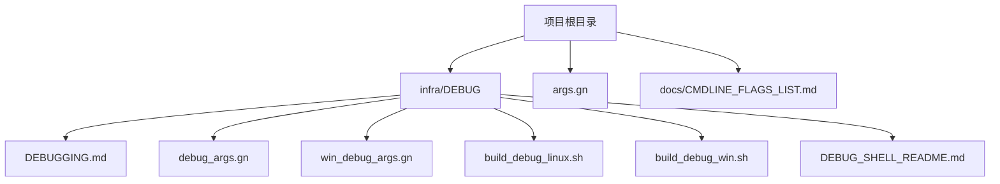
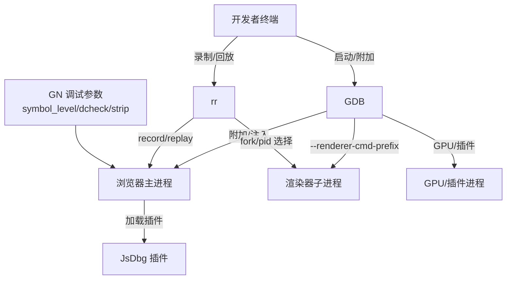
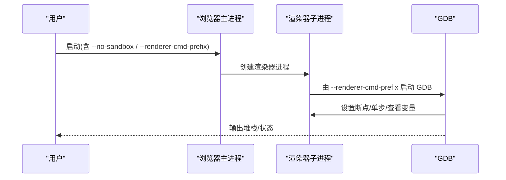
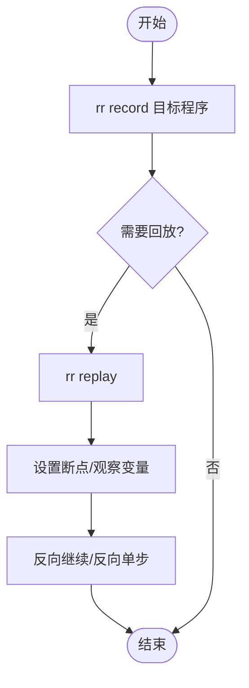
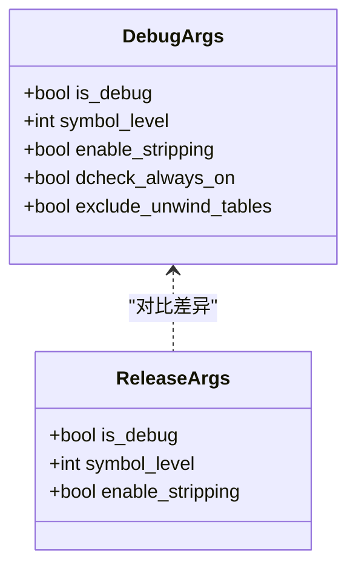
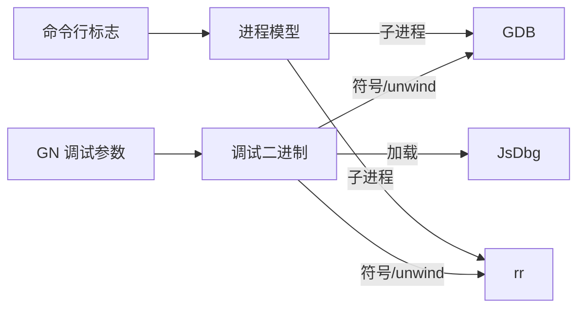

# 调试工具使用

本文引用的文件

- [DEBUGGING.md](https://github.com/Mcloud136/Mcloud-Browser/blob/main/infra/DEBUG/DEBUGGING.md)
- [debug_args.gn](https://github.com/Mcloud136/Mcloud-Browser/blob/main/infra/DEBUG/debug_args.gn)
- [win_debug_args.gn](https://github.com/Mcloud136/Mcloud-Browser/blob/main/infra/DEBUG/win_debug_args.gn)
- [build_debug_linux.sh](https://github.com/Mcloud136/Mcloud-Browser/blob/main/infra/DEBUG/build_debug_linux.sh)
- [build_debug_win.sh](https://github.com/Mcloud136/Mcloud-Browser/blob/main/infra/DEBUG/build_debug_win.sh)
- [args.gn](https://github.com/Mcloud136/Mcloud-Browser/blob/main/args.gn)
- [CMDLINE_FLAGS_LIST.md](https://github.com/Mcloud136/Mcloud-Browser/blob/main/docs/CMDLINE_FLAGS_LIST.md)
- [DEBUG_SHELL_README.md](https://github.com/Mcloud136/Mcloud-Browser/blob/main/infra/DEBUG/DEBUG_SHELL_README.md)

## 目录
1. [简介](#简介)
2. [项目结构](#项目结构)
3. [核心组件](#核心组件)
4. [架构总览](#架构总览)
5. [详细组件分析](#详细组件分析)
6. [依赖关系分析](#依赖关系分析)
7. [性能注意事项](#性能注意事项)
8. [故障排查指南](#故障排查指南)
9. [结论](#结论)
10. [附录](#附录)

## 简介
本文件面向 Thorium（Mcloud）浏览器开发者与测试人员，系统介绍在该项目中如何使用 GDB、rr（时间旅行调试）、JsDbg 等调试工具，覆盖单进程/多进程调试、图形界面调试、断点设置、变量检查、堆栈跟踪等高级用法，并给出与本项目构建和运行相关的命令行参数与配置选项。内容基于仓库内提供的调试文档与构建脚本进行整理，确保与实际工程一致。

## 项目结构
与调试直接相关的资源主要集中在 infra/DEBUG 目录，包含：
- 调试说明文档：DEBUGGING.md
- 平台调试 GN 参数：debug_args.gn、win_debug_args.gn
- 调试构建脚本：build_debug_linux.sh、build_debug_win.sh
- UI 调试 Shell 说明：DEBUG_SHELL_README.md
- 根级 GN 参数：args.gn（发布/优化相关，对比调试差异）
- 命令行标志列表：docs/CMDLINE_FLAGS_LIST.md（用于查找 --renderer-cmd-prefix 等调试开关）

图表来源
- [DEBUGGING.md:1-603](https://github.com/Mcloud136/Mcloud-Browser/blob/main/infra/DEBUG/DEBUGGING.md#L1-L603)
- [debug_args.gn:1-87](https://github.com/Mcloud136/Mcloud-Browser/blob/main/infra/DEBUG/debug_args.gn#L1-L87)
- [win_debug_args.gn:1-87](https://github.com/Mcloud136/Mcloud-Browser/blob/main/infra/DEBUG/win_debug_args.gn#L1-L87)
- [build_debug_linux.sh:1-90](https://github.com/Mcloud136/Mcloud-Browser/blob/main/infra/DEBUG/build_debug_linux.sh#L1-L90)
- [build_debug_win.sh:1-73](https://github.com/Mcloud136/Mcloud-Browser/blob/main/infra/DEBUG/build_debug_win.sh#L1-L73)
- [DEBUG_SHELL_README.md:1-31](https://github.com/Mcloud136/Mcloud-Browser/blob/main/infra/DEBUG/DEBUG_SHELL_README.md#L1-L31)
- [args.gn:1-87](https://github.com/Mcloud136/Mcloud-Browser/blob/main/args.gn#L1-L87)
- [CMDLINE_FLAGS_LIST.md:2234-2262](https://github.com/Mcloud136/Mcloud-Browser/blob/main/docs/CMDLINE_FLAGS_LIST.md#L2234-L2262)

章节来源
- [DEBUGGING.md:1-603](https://github.com/Mcloud136/Mcloud-Browser/blob/main/infra/DEBUG/DEBUGGING.md#L1-L603)
- [debug_args.gn:1-87](https://github.com/Mcloud136/Mcloud-Browser/blob/main/infra/DEBUG/debug_args.gn#L1-L87)
- [win_debug_args.gn:1-87](https://github.com/Mcloud136/Mcloud-Browser/blob/main/infra/DEBUG/win_debug_args.gn#L1-L87)
- [build_debug_linux.sh:1-90](https://github.com/Mcloud136/Mcloud-Browser/blob/main/infra/DEBUG/build_debug_linux.sh#L1-L90)
- [build_debug_win.sh:1-73](https://github.com/Mcloud136/Mcloud-Browser/blob/main/infra/DEBUG/build_debug_win.sh#L1-L73)
- [DEBUG_SHELL_README.md:1-31](https://github.com/Mcloud136/Mcloud-Browser/blob/main/infra/DEBUG/DEBUG_SHELL_README.md#L1-L31)
- [args.gn:1-87](https://github.com/Mcloud136/Mcloud-Browser/blob/main/args.gn#L1-L87)
- [CMDLINE_FLAGS_LIST.md:2234-2262](https://github.com/Mcloud136/Mcloud-Browser/blob/main/docs/CMDLINE_FLAGS_LIST.md#L2234-L2262)

## 核心组件
- GDB 调试：支持主进程、渲染器/GPU/插件子进程、单进程模式、附加到运行中的进程、符号化堆栈、类型美化打印等。
- rr 时间旅行调试：记录执行轨迹后回放，支持反向继续、反向单步、条件观察、多进程选择等。
- JsDbg：在浏览器窗口可视化 Chromium 内部数据结构（如 DOM、布局树、无障碍树）。
- 构建与运行配置：通过 GN 参数控制调试符号级别、是否剥离符号、是否启用 dcheck 等；通过命令行标志控制沙箱、渲染器启动前缀、挂起监控等。

章节来源
- [DEBUGGING.md:15-214](https://github.com/Mcloud136/Mcloud-Browser/blob/main/infra/DEBUG/DEBUGGING.md#L15-L214)
- [DEBUGGING.md:244-319](https://github.com/Mcloud136/Mcloud-Browser/blob/main/infra/DEBUG/DEBUGGING.md#L244-L319)
- [debug_args.gn:15-27](https://github.com/Mcloud136/Mcloud-Browser/blob/main/infra/DEBUG/debug_args.gn#L15-L27)
- [win_debug_args.gn:13-26](https://github.com/Mcloud136/Mcloud-Browser/blob/main/infra/DEBUG/win_debug_args.gn#L13-L26)
- [CMDLINE_FLAGS_LIST.md:2234-2262](https://github.com/Mcloud136/Mcloud-Browser/blob/main/docs/CMDLINE_FLAGS_LIST.md#L2234-L2262)

## 架构总览
下图展示调试工具与浏览器进程的交互关系：GDB/rr 作为外部调试器，可附加或包装浏览器主进程及子进程；JsDbg 以插件形式在浏览器内可视化数据；构建配置决定符号信息与调试能力。

图表来源
- [DEBUGGING.md:23-214](https://github.com/Mcloud136/Mcloud-Browser/blob/main/infra/DEBUG/DEBUGGING.md#L23-L214)
- [DEBUGGING.md:244-319](https://github.com/Mcloud136/Mcloud-Browser/blob/main/infra/DEBUG/DEBUGGING.md#L244-L319)
- [debug_args.gn:15-27](https://github.com/Mcloud136/Mcloud-Browser/blob/main/infra/DEBUG/debug_args.gn#L15-L27)
- [win_debug_args.gn:13-26](https://github.com/Mcloud136/Mcloud-Browser/blob/main/infra/DEBUG/win_debug_args.gn#L13-L26)
- [CMDLINE_FLAGS_LIST.md:2234-2262](https://github.com/Mcloud136/Mcloud-Browser/blob/main/docs/CMDLINE_FLAGS_LIST.md#L2234-L2262)

## 详细组件分析

### GDB 调试（Linux）
- 基本主进程调试：通过 TUI 模式启动并传入目标 URL，必要时禁用 seccomp 沙箱以获得更好的符号解析。
- 允许附加到外部进程：在启用 Yama LSM 的系统上需调整 ptrace_scope 才能附加到其他进程。
- 多进程调试技巧：
  - 使用 --renderer-cmd-prefix 将渲染器进程包装进 gdb，便于自动启动调试器。
  - 使用 --gpu-launcher 对 GPU 子进程做同样处理。
  - 使用 --plugin-launcher 对插件进程做同样处理。
  - 使用 --utility-startup-dialog 选择性让特定 utility 启动时暂停以便附加。
- 选择要调试的渲染器：可通过脚本提示选择具体子进程进入调试。
- 附加到运行中的渲染器：通过任务管理器显示 PID，再使用 gdb -p 附加；若受沙箱限制，需开启允许沙箱调试的开关。
- 单进程模式：--single-process 可将渲染线程放入主进程，简化调试（注意某些 GPU 相关场景需配合 --disable-gpu）。
- 类型美化打印：启用 Chromium 类型的 pretty-printers，提升可读性。

图表来源
- [DEBUGGING.md:23-87](https://github.com/Mcloud136/Mcloud-Browser/blob/main/infra/DEBUG/DEBUGGING.md#L23-L87)
- [DEBUGGING.md:106-167](https://github.com/Mcloud136/Mcloud-Browser/blob/main/infra/DEBUG/DEBUGGING.md#L106-L167)
- [DEBUGGING.md:191-214](https://github.com/Mcloud136/Mcloud-Browser/blob/main/infra/DEBUG/DEBUGGING.md#L191-L214)
- [CMDLINE_FLAGS_LIST.md:2234-2262](https://github.com/Mcloud136/Mcloud-Browser/blob/main/docs/CMDLINE_FLAGS_LIST.md#L2234-L2262)

章节来源
- [DEBUGGING.md:23-214](https://github.com/Mcloud136/Mcloud-Browser/blob/main/infra/DEBUG/DEBUGGING.md#L23-L214)
- [CMDLINE_FLAGS_LIST.md:2234-2262](https://github.com/Mcloud136/Mcloud-Browser/blob/main/docs/CMDLINE_FLAGS_LIST.md#L2234-L2262)

### rr 时间旅行调试
- 适用场景：需要回溯执行历史、定位难以复现的问题。
- 使用方法：先 record 记录执行，再 replay 回放；可在回放中设置断点、反向继续、反向单步、观察变量变化。
- 多进程：可使用 -f 针对从 zygote fork 的子进程（如渲染器），或使用 -p 附加其他进程；可通过日志或 rr ps 找到目标 PID。
- 与 JsDbg 结合：在 rr 会话中调用 jsdbg 命令以可视化数据结构。

图表来源
- [DEBUGGING.md:256-319](https://github.com/Mcloud136/Mcloud-Browser/blob/main/infra/DEBUG/DEBUGGING.md#L256-L319)

章节来源
- [DEBUGGING.md:256-319](https://github.com/Mcloud136/Mcloud-Browser/blob/main/infra/DEBUG/DEBUGGING.md#L256-L319)

### JsDbg 可视化调试
- 作用：在浏览器窗口中可视化 Chromium 内部数据结构（如无障碍树、布局对象树、DOM 树等）。
- 安装与使用：参考官方仓库说明；在 rr 会话中可直接调用 jsdbg 命令快速定位问题对象。

章节来源
- [DEBUGGING.md:244-255](https://github.com/Mcloud136/Mcloud-Browser/blob/main/infra/DEBUG/DEBUGGING.md#L244-L255)
- [DEBUGGING.md:274-279](https://github.com/Mcloud136/Mcloud-Browser/blob/main/infra/DEBUG/DEBUGGING.md#L274-L279)

### 构建与运行配置（GN 参数）
- 调试构建关键参数：
  - is_debug=true：启用调试构建。
  - symbol_level=2：保留完整符号信息，利于堆栈回溯。
  - enable_stripping=false：不剥离符号。
  - dcheck_always_on=true：始终启用断言检查。
  - exclude_unwind_tables=false：保留 unwind 表，改善调试体验。
- 发布构建对比（根 args.gn）：is_debug=false、symbol_level=0、enable_stripping=true，适合分发但不利于调试。
- Windows 调试参数：win_debug_args.gn 提供对应平台的调试配置。

图表来源
- [debug_args.gn:15-27](https://github.com/Mcloud136/Mcloud-Browser/blob/main/infra/DEBUG/debug_args.gn#L15-L27)
- [win_debug_args.gn:13-26](https://github.com/Mcloud136/Mcloud-Browser/blob/main/infra/DEBUG/win_debug_args.gn#L13-L26)
- [args.gn:15-27](https://github.com/Mcloud136/Mcloud-Browser/blob/main/args.gn#L15-L27)

章节来源
- [debug_args.gn:15-27](https://github.com/Mcloud136/Mcloud-Browser/blob/main/infra/DEBUG/debug_args.gn#L15-L27)
- [win_debug_args.gn:13-26](https://github.com/Mcloud136/Mcloud-Browser/blob/main/infra/DEBUG/win_debug_args.gn#L13-L26)
- [args.gn:15-27](https://github.com/Mcloud136/Mcloud-Browser/blob/main/args.gn#L15-L27)

### 命令行标志与调试开关
- --no-sandbox：临时关闭沙箱以改善符号解析与调试体验（不建议长期启用）。
- --renderer-cmd-prefix：在渲染器命令前插入调试器或包装命令，便于自动启动调试。
- --renderer-startup-dialog：启动渲染器时弹出对话框，方便附加调试器。
- --utility-startup-dialog：选择性让 utility 启动时暂停。
- --disable-hang-monitor：抑制挂起监控以减少干扰。
- --allow-sandbox-debugging：允许调试器附加到沙箱进程。
- --single-process：单进程模式，简化调试流程（注意 GPU 相关限制）。

章节来源
- [DEBUGGING.md:23-87](https://github.com/Mcloud136/Mcloud-Browser/blob/main/infra/DEBUG/DEBUGGING.md#L23-L87)
- [DEBUGGING.md:106-167](https://github.com/Mcloud136/Mcloud-Browser/blob/main/infra/DEBUG/DEBUGGING.md#L106-L167)
- [DEBUGGING.md:191-214](https://github.com/Mcloud136/Mcloud-Browser/blob/main/infra/DEBUG/DEBUGGING.md#L191-L214)
- [CMDLINE_FLAGS_LIST.md:2234-2262](https://github.com/Mcloud136/Mcloud-Browser/blob/main/docs/CMDLINE_FLAGS_LIST.md#L2234-L2262)

### 图形界面调试辅助
- 项目提供了 UI 调试 Shell（mcloud_ui_debug_shell），可用于查看与测试原生 UI 图标等资源，辅助界面相关问题定位。
- 在 Linux/Windows 下分别有对应的启动方式与使用说明。

章节来源
- [DEBUG_SHELL_README.md:1-31](https://github.com/Mcloud136/Mcloud-Browser/blob/main/infra/DEBUG/DEBUG_SHELL_README.md#L1-L31)

## 依赖关系分析
- 调试能力依赖于构建产物是否包含符号与 unwind 表（由 GN 参数控制）。
- 多进程调试依赖命令行标志控制子进程启动行为（--renderer-cmd-prefix、--gpu-launcher、--plugin-launcher）。
- rr 与 JsDbg 为外部工具，需在系统中正确安装并与浏览器版本兼容。
- 构建脚本负责生成调试产物与资源打包，便于本地调试与演示。

图表来源
- [debug_args.gn:15-27](https://github.com/Mcloud136/Mcloud-Browser/blob/main/infra/DEBUG/debug_args.gn#L15-L27)
- [win_debug_args.gn:13-26](https://github.com/Mcloud136/Mcloud-Browser/blob/main/infra/DEBUG/win_debug_args.gn#L13-L26)
- [CMDLINE_FLAGS_LIST.md:2234-2262](https://github.com/Mcloud136/Mcloud-Browser/blob/main/docs/CMDLINE_FLAGS_LIST.md#L2234-L2262)
- [DEBUGGING.md:23-214](https://github.com/Mcloud136/Mcloud-Browser/blob/main/infra/DEBUG/DEBUGGING.md#L23-L214)
- [DEBUGGING.md:244-319](https://github.com/Mcloud136/Mcloud-Browser/blob/main/infra/DEBUG/DEBUGGING.md#L244-L319)

章节来源
- [debug_args.gn:15-27](https://github.com/Mcloud136/Mcloud-Browser/blob/main/infra/DEBUG/debug_args.gn#L15-L27)
- [win_debug_args.gn:13-26](https://github.com/Mcloud136/Mcloud-Browser/blob/main/infra/DEBUG/win_debug_args.gn#L13-L26)
- [CMDLINE_FLAGS_LIST.md:2234-2262](https://github.com/Mcloud136/Mcloud-Browser/blob/main/docs/CMDLINE_FLAGS_LIST.md#L2234-L2262)
- [DEBUGGING.md:23-214](https://github.com/Mcloud136/Mcloud-Browser/blob/main/infra/DEBUG/DEBUGGING.md#L23-L214)
- [DEBUGGING.md:244-319](https://github.com/Mcloud136/Mcloud-Browser/blob/main/infra/DEBUG/DEBUGGING.md#L244-L319)

## 性能注意事项
- 调试构建会增大二进制体积并降低性能，仅用于开发与问题定位。
- 符号拆分（use_debug_fission）会影响 GDB 加载速度，可根据需要调整。
- 频繁记录 rr trace 会产生较大磁盘占用，建议仅在必要时使用。
- 单进程模式虽简化调试，但可能引入已知崩溃或行为差异，需谨慎评估。

[本节为通用指导，不直接分析具体文件]

## 故障排查指南
- 无法附加到进程：检查系统 ptrace_scope 设置；确认已启用允许沙箱调试的开关。
- 符号缺失：确认构建时 symbol_level 与 strip 配置；必要时使用外部符号化工具或下载符号包。
- 沙箱干扰：临时使用 --no-sandbox 或启用允许沙箱调试；避免在生产环境长期使用。
- 渲染器调试困难：使用 --renderer-cmd-prefix 或 --renderer-startup-dialog 控制启动行为；或通过任务管理器获取 PID 后附加。
- rr 不工作：更新 rr 至最新版本；必要时从源码编译以适配新的系统调用接口。
- 日志与 IPC 调试：通过环境变量或命令行开关启用 IPC 日志，辅助定位跨进程问题。

章节来源
- [DEBUGGING.md:28-41](https://github.com/Mcloud136/Mcloud-Browser/blob/main/infra/DEBUG/DEBUGGING.md#L28-L41)
- [DEBUGGING.md:149-167](https://github.com/Mcloud136/Mcloud-Browser/blob/main/infra/DEBUG/DEBUGGING.md#L149-L167)
- [DEBUGGING.md:256-319](https://github.com/Mcloud136/Mcloud-Browser/blob/main/infra/DEBUG/DEBUGGING.md#L256-L319)
- [DEBUGGING.md:463-487](https://github.com/Mcloud136/Mcloud-Browser/blob/main/infra/DEBUG/DEBUGGING.md#L463-L487)

## 结论
在本项目中，GDB、rr 与 JsDbg 构成了完整的调试体系：GDB 适用于传统断点与堆栈分析，rr 提供时间旅行能力以回溯复杂问题，JsDbg 则帮助可视化内部数据结构。通过合理的 GN 构建参数与命令行标志，可以在不同场景（单进程/多进程、图形界面/无头）下高效定位问题。建议在开发阶段使用调试构建，并在必要时结合多种工具协同排查。

[本节为总结，不直接分析具体文件]

## 附录
- 常用命令速查（基于仓库文档）：
  - 主进程调试：使用 TUI 模式启动并传入目标 URL，必要时禁用沙箱。
  - 渲染器调试：通过 --renderer-cmd-prefix 将渲染器进程包装进 gdb。
  - GPU/插件调试：使用 --gpu-launcher / --plugin-launcher。
  - 单进程模式：--single-process 简化调试流程。
  - rr 录制与回放：record 目标程序，replay 回放并设置断点/观察变量。
  - JsDbg：在浏览器或 rr 会话中加载以可视化数据结构。
- 构建脚本：
  - Linux 调试构建：使用 build_debug_linux.sh 生成调试产物与 UI 调试 Shell。
  - Windows 调试构建：使用 build_debug_win.sh 生成调试产物与 UI 调试 Shell。

章节来源
- [DEBUGGING.md:23-214](https://github.com/Mcloud136/Mcloud-Browser/blob/main/infra/DEBUG/DEBUGGING.md#L23-L214)
- [DEBUGGING.md:256-319](https://github.com/Mcloud136/Mcloud-Browser/blob/main/infra/DEBUG/DEBUGGING.md#L256-L319)
- [build_debug_linux.sh:1-90](https://github.com/Mcloud136/Mcloud-Browser/blob/main/infra/DEBUG/build_debug_linux.sh#L1-L90)
- [build_debug_win.sh:1-73](https://github.com/Mcloud136/Mcloud-Browser/blob/main/infra/DEBUG/build_debug_win.sh#L1-L73)
- [DEBUG_SHELL_README.md:1-31](https://github.com/Mcloud136/Mcloud-Browser/blob/main/infra/DEBUG/DEBUG_SHELL_README.md#L1-L31)