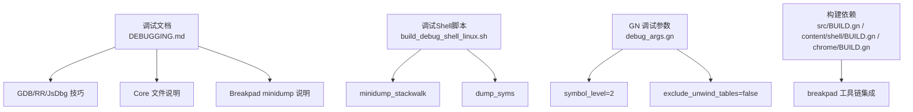
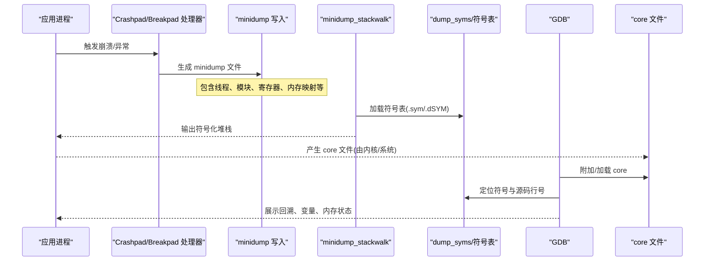
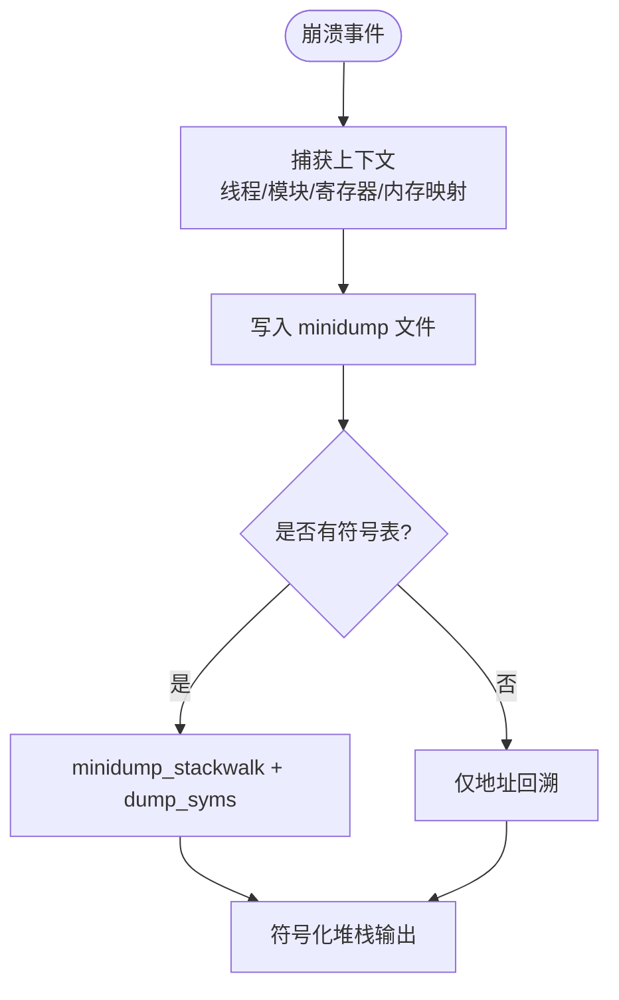
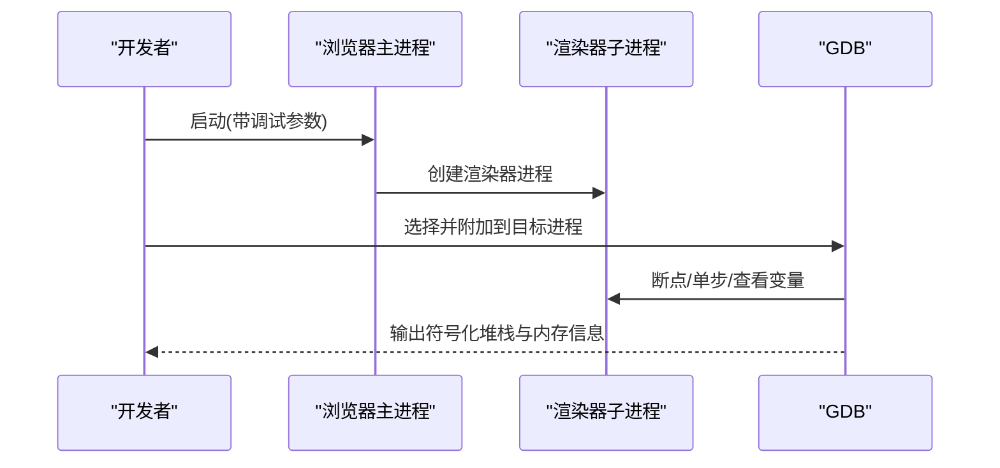
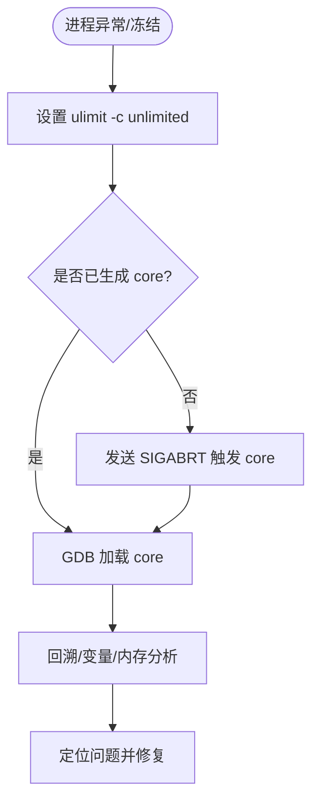
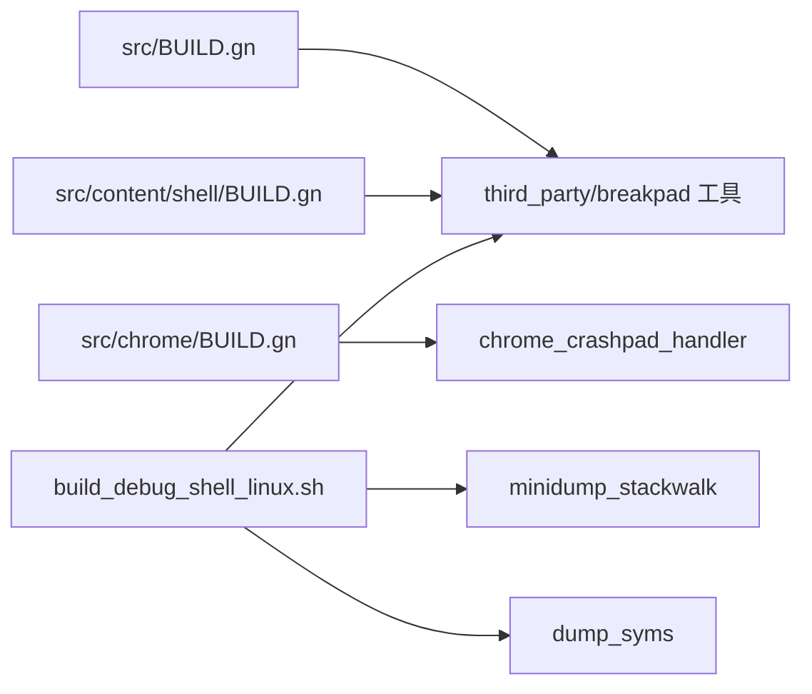

# 转储文件分析

<cite>
**本文引用的文件**
- [DEBUGGING.md](file://infra/DEBUG/DEBUGGING.md)
- [build_debug_shell_linux.sh](file://infra/DEBUG/build_debug_shell_linux.sh)
- [debug_args.gn](file://infra/DEBUG/debug_args.gn)
- [BUILD.gn (src)](file://src/BUILD.gn)
- [BUILD.gn (content/shell)](file://src/content/shell/BUILD.gn)
- [BUILD.gn (chrome)](file://src/chrome/BUILD.gn)
- [CMDLINE_FLAGS_LIST.md](file://infra/CMDLINE_FLAGS_LIST.md)
- [ulimit.conf](file://infra/ulimit.conf)
</cite>

## 目录
1. [简介](#简介)
2. [项目结构](#项目结构)
3. [核心组件](#核心组件)
4. [架构总览](#架构总览)
5. [详细组件分析](#详细组件分析)
6. [依赖关系分析](#依赖关系分析)
7. [性能考量](#性能考量)
8. [故障排查指南](#故障排查指南)
9. [结论](#结论)
10. [附录](#附录)

## 简介
本文件面向崩溃与异常场景下的转储文件收集与分析，覆盖以下主题：
- minidump（Breakpad）与 core dump 的格式与解析方法
- 使用调试工具进行堆栈回溯、变量检查与内存状态分析
- Breakpad minidump 的生成与解析流程
- 使用 GDB 对符号化堆栈跟踪进行分析
- Linux core files 的生成配置与分析方法

## 项目结构
本项目在构建与调试方面提供了完善的支撑：
- 调试文档与技巧集中在 infra/DEBUG/DEBUGGING.md
- 调试 Shell 打包脚本 infra/DEBUG/build_debug_shell_linux.sh 会复制 minidump_stackwalk、dump_syms 等关键工具
- GN 构建参数 infra/DEBUG/debug_args.gn 控制符号级别、是否剥离符号、是否包含展开表等
- 构建系统 src/BUILD.gn、src/content/shell/BUILD.gn、src/chrome/BUILD.gn 将 Breakpad/minidump 相关工具作为数据依赖引入测试与运行环境
- 命令行标志参考 infra/CMDLINE_FLAGS_LIST.md 中关于 crashpad 的参数
- ulimit.conf 用于演示或限制资源上限（与 core dump 配合）

图表来源
- [DEBUGGING.md:1-603](file://infra/DEBUG/DEBUGGING.md#L1-L603)
- [build_debug_shell_linux.sh:46-95](file://infra/DEBUG/build_debug_shell_linux.sh#L46-L95)
- [debug_args.gn:16-27](file://infra/DEBUG/debug_args.gn#L16-L27)
- [BUILD.gn (src):1313-1350](file://src/BUILD.gn#L1313-L1350)
- [BUILD.gn (content/shell):1097-1111](file://src/content/shell/BUILD.gn#L1097-L1111)
- [BUILD.gn (chrome):1270-1296](file://src/chrome/BUILD.gn#L1270-L1296)

章节来源
- [DEBUGGING.md:1-603](file://infra/DEBUG/DEBUGGING.md#L1-L603)
- [build_debug_shell_linux.sh:46-95](file://infra/DEBUG/build_debug_shell_linux.sh#L46-L95)
- [debug_args.gn:16-27](file://infra/DEBUG/debug_args.gn#L16-L27)
- [BUILD.gn (src):1313-1350](file://src/BUILD.gn#L1313-L1350)
- [BUILD.gn (content/shell):1097-1111](file://src/content/shell/BUILD.gn#L1097-L1111)
- [BUILD.gn (chrome):1270-1296](file://src/chrome/BUILD.gn#L1270-L1296)

## 核心组件
- 调试与崩溃处理文档：提供 GDB、rr、JsDbg、core dump、Breakpad minidump 的使用指引
- 调试 Shell 打包脚本：构建并打包 UI 调试 Shell，同时拷贝 minidump_stackwalk、dump_syms 等工具
- GN 调试参数：设置 symbol_level、exclude_unwind_tables、use_debug_fission 等以优化符号与回溯质量
- 构建系统集成：通过 data_deps 将 breakpad 工具链引入测试与运行产物，便于本地分析与上传
- 命令行开关：crashpad_handler、crash-server-url 等用于崩溃上报与处理器启动

章节来源
- [DEBUGGING.md:15-156](file://infra/DEBUG/DEBUGGING.md#L15-L156)
- [DEBUGGING.md:351-366](file://infra/DEBUG/DEBUGGING.md#L351-L366)
- [build_debug_shell_linux.sh:46-95](file://infra/DEBUG/build_debug_shell_linux.sh#L46-L95)
- [debug_args.gn:16-27](file://infra/DEBUG/debug_args.gn#L16-L27)
- [BUILD.gn (src):1313-1350](file://src/BUILD.gn#L1313-L1350)
- [CMDLINE_FLAGS_LIST.md:440-458](file://infra/CMDLINE_FLAGS_LIST.md#L440-L458)

## 架构总览
下图展示了从崩溃发生到生成/解析 minidump 的核心路径，以及 GDB 分析 core dump 的流程。

图表来源
- [BUILD.gn (src):1313-1350](file://src/BUILD.gn#L1313-L1350)
- [build_debug_shell_linux.sh:85-86](file://infra/DEBUG/build_debug_shell_linux.sh#L85-L86)
- [DEBUGGING.md:15-156](file://infra/DEBUG/DEBUGGING.md#L15-L156)
- [DEBUGGING.md:351-366](file://infra/DEBUG/DEBUGGING.md#L351-L366)

## 详细组件分析

### Breakpad minidump 的生成与解析
- 生成
  - 通过 Crashpad/Breakpad 机制在崩溃时捕获线程、模块、寄存器、内存映射等信息，写出 minidump 文件
  - 构建系统中通过 data_deps 引入 minidump_stackwalk、dump_syms 等工具，便于本地解析与上传
- 解析
  - 使用 minidump_stackwalk 结合符号表（dump_syms 生成）输出可读的符号化堆栈
  - 调试 Shell 脚本会将 minidump_stackwalk 与 dump_syms 复制到可执行目录，方便离线分析

图表来源
- [BUILD.gn (src):1313-1350](file://src/BUILD.gn#L1313-L1350)
- [build_debug_shell_linux.sh:85-86](file://infra/DEBUG/build_debug_shell_linux.sh#L85-L86)

章节来源
- [BUILD.gn (src):1313-1350](file://src/BUILD.gn#L1313-L1350)
- [build_debug_shell_linux.sh:85-86](file://infra/DEBUG/build_debug_shell_linux.sh#L85-L86)

### 使用 GDB 进行符号化堆栈跟踪
- 基本用法
  - 使用 gdb --args 启动浏览器进程，或通过 --renderer-cmd-prefix 将渲染器子进程注入 gdb
  - 对于沙箱进程，可能需要 --allow-sandbox-debugging 才能附加调试器
- 多进程调试
  - 使用 pstree 或任务管理器查找目标进程 PID，再 gdb -p 附加
  - 可使用 xterm 或单独终端窗口分别调试不同进程，避免控制台冲突
- 类型打印与可视化
  - 启用 Chromium 类型的 pretty-printers（Python 扩展）
  - 使用 JsDbg 可视化 DOM、布局树等数据结构

图表来源
- [DEBUGGING.md:45-156](file://infra/DEBUG/DEBUGGING.md#L45-L156)
- [DEBUGGING.md:209-251](file://infra/DEBUG/DEBUGGING.md#L209-L251)

章节来源
- [DEBUGGING.md:45-156](file://infra/DEBUG/DEBUGGING.md#L45-L156)
- [DEBUGGING.md:209-251](file://infra/DEBUG/DEBUGGING.md#L209-L251)

### Core 文件的生成配置与分析
- 生成配置
  - 使用 ulimit -c unlimited 允许生成 core 文件；部分沙箱子进程需 --allow-sandbox-debugging
  - 若为冻结而非崩溃，可通过发送 SIGABRT 触发 core dump
- 分析步骤
  - 用 GDB 加载 core 文件，获取回溯、局部变量、寄存器与内存状态
  - 确保符号可用（symbol_level、unwind tables、调试符号路径）

图表来源
- [DEBUGGING.md:351-366](file://infra/DEBUG/DEBUGGING.md#L351-L366)
- [ulimit.conf:1-8](file://infra/ulimit.conf#L1-L8)

章节来源
- [DEBUGGING.md:351-366](file://infra/DEBUG/DEBUGGING.md#L351-L366)
- [ulimit.conf:1-8](file://infra/ulimit.conf#L1-L8)

### 构建与调试环境准备
- 调试 Shell 打包
  - 脚本构建 mcloud_ui_debug_shell，并复制 minidump_stackwalk、dump_syms 等工具，便于离线分析
- GN 调试参数
  - symbol_level=2、v8_symbol_level=2、blink_symbol_level=2 提升符号粒度
  - exclude_unwind_tables=false 保证运行时展开能力
  - use_debug_fission=true 可改善 GDB 加载速度（权衡链接时间）

章节来源
- [build_debug_shell_linux.sh:46-95](file://infra/DEBUG/build_debug_shell_linux.sh#L46-L95)
- [debug_args.gn:16-27](file://infra/DEBUG/debug_args.gn#L16-L27)

## 依赖关系分析
- 构建系统通过 data_deps 将 breakpad 工具链引入测试与运行产物，确保 minidump_stackwalk、dump_syms 等工具可用
- Chrome 构建中包含 chrome_crashpad_handler，负责崩溃处理与上报
- 调试 Shell 脚本显式复制 minidump_stackwalk 与 dump_syms，形成自包含的分析环境

图表来源
- [BUILD.gn (src):1313-1350](file://src/BUILD.gn#L1313-L1350)
- [BUILD.gn (content/shell):1097-1111](file://src/content/shell/BUILD.gn#L1097-L1111)
- [BUILD.gn (chrome):1270-1296](file://src/chrome/BUILD.gn#L1270-L1296)
- [build_debug_shell_linux.sh:85-86](file://infra/DEBUG/build_debug_shell_linux.sh#L85-L86)

章节来源
- [BUILD.gn (src):1313-1350](file://src/BUILD.gn#L1313-L1350)
- [BUILD.gn (content/shell):1097-1111](file://src/content/shell/BUILD.gn#L1097-L1111)
- [BUILD.gn (chrome):1270-1296](file://src/chrome/BUILD.gn#L1270-L1296)
- [build_debug_shell_linux.sh:85-86](file://infra/DEBUG/build_debug_shell_linux.sh#L85-L86)

## 性能考量
- 符号级别与回溯质量
  - 提高 symbol_level 可获得更详细的函数名与行号，但会增加二进制体积与构建时间
- 调试符号分离
  - use_debug_fission=true 可显著缩短 GDB 加载时间，但可能影响某些调试体验
- 展开表
  - 保持 exclude_unwind_tables=false，确保崩溃时的展开能力
- 沙箱与调试附加
  - 沙箱可能阻止调试器附加或 core dump，必要时使用 --allow-sandbox-debugging

[本节为通用指导，不直接分析具体文件]

## 故障排查指南
- 无法附加调试器
  - 检查 Yama ptrace_scope 设置，必要时调整为允许附加
  - 对沙箱子进程使用 --allow-sandbox-debugging
- 堆栈无符号
  - 确认 symbol_level、unwind tables、符号路径配置正确
  - 使用 dump_syms 生成符号表并通过 minidump_stackwalk 解析
- core 未生成
  - 确认 ulimit -c unlimited 已生效
  - 对冻结进程发送 SIGABRT 触发 core dump
- 多进程调试混乱
  - 使用 --renderer-cmd-prefix 或 BROWSER_WRAPPER 将子进程注入 gdb
  - 借助 pstree 或任务管理器定位目标 PID

章节来源
- [DEBUGGING.md:23-156](file://infra/DEBUG/DEBUGGING.md#L23-L156)
- [DEBUGGING.md:351-366](file://infra/DEBUG/DEBUGGING.md#L351-L366)

## 结论
本项目在崩溃转储的采集、符号化与分析方面具备完善的基础设施：
- 通过 Breakpad/Crashpad 生成 minidump，并使用 minidump_stackwalk 与 dump_syms 完成符号化
- 借助 GDB/rr/JsDbg 实现深入的堆栈回溯、变量检查与内存状态分析
- 通过 GN 调试参数与调试 Shell 脚本，提供高质量符号与便捷的分析环境
- 针对 core dump，提供 ulimit 配置与触发策略，配合 GDB 完成离线分析

[本节为总结性内容，不直接分析具体文件]

## 附录
- 命令行标志参考
  - crashpad_handler、crash-server-url 等用于崩溃处理器与上报配置

章节来源
- [CMDLINE_FLAGS_LIST.md:440-458](file://infra/CMDLINE_FLAGS_LIST.md#L440-L458)