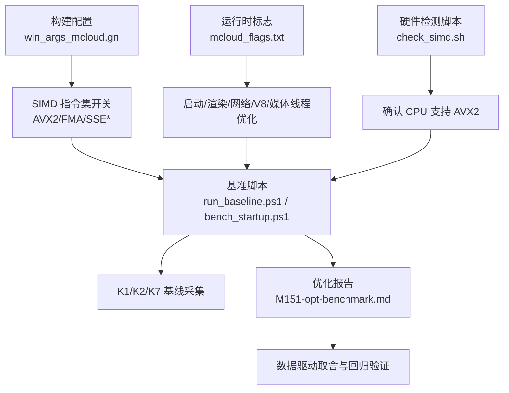
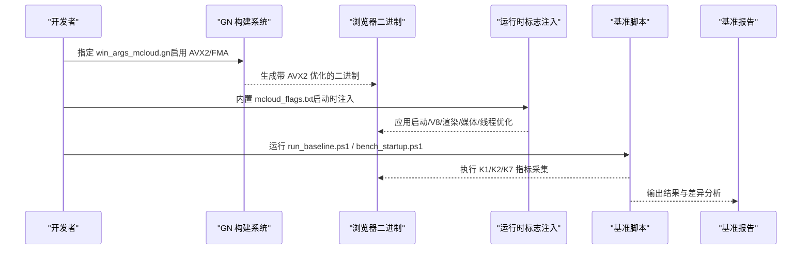
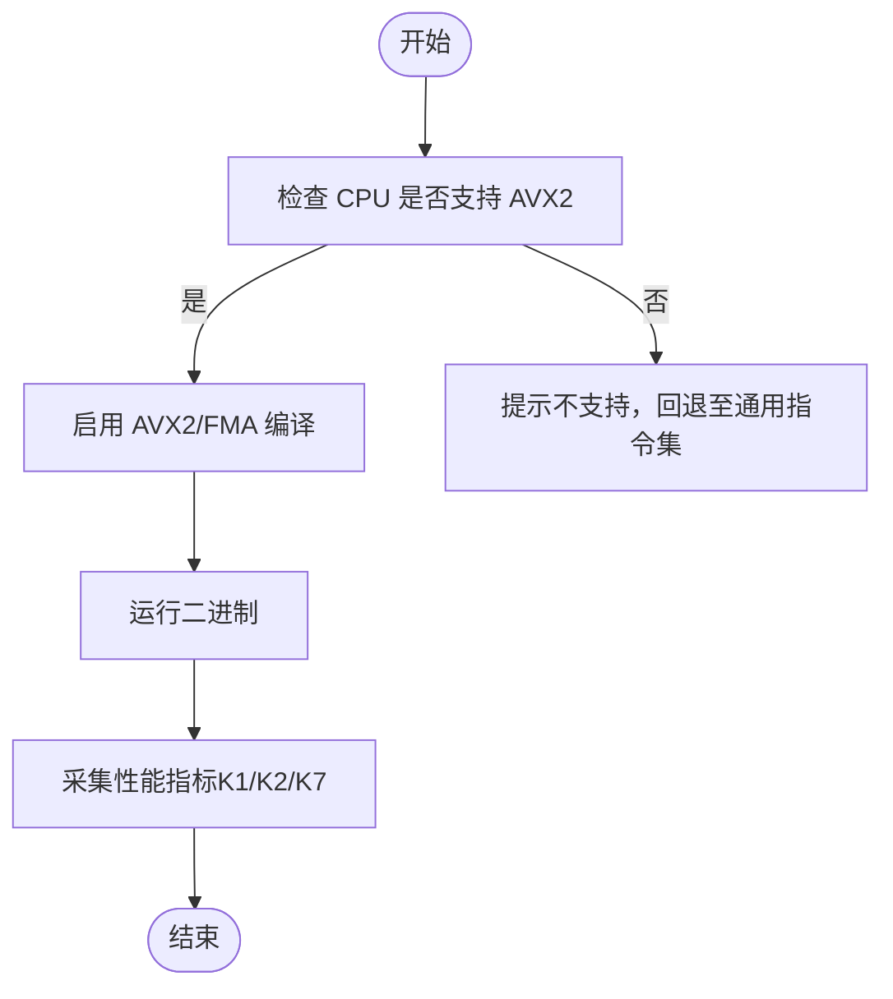
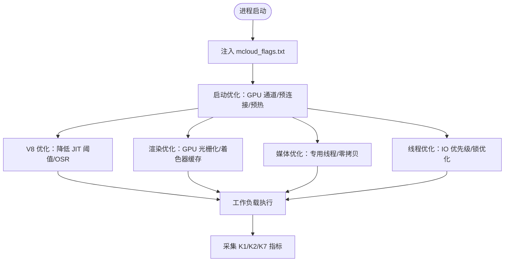
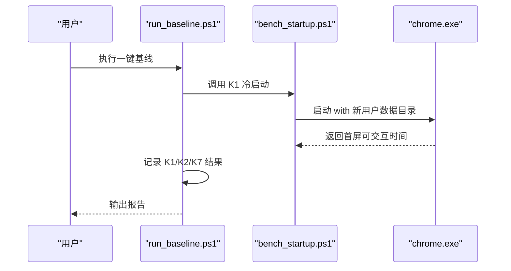
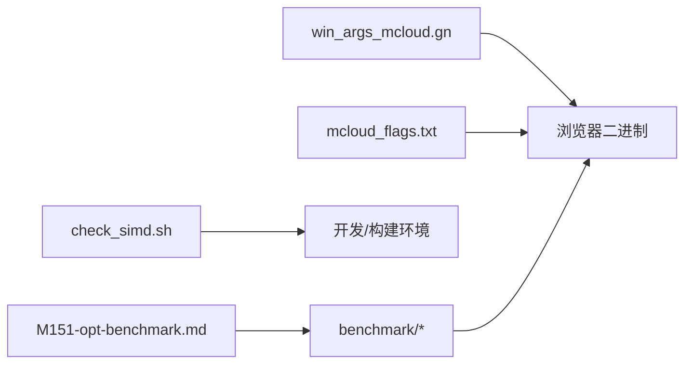

# CPU 性能分析

本文引用的文件

- [README.md](https://github.com/Mcloud136/Mcloud-Browser/blob/main/README.md)
- [mcloud_flags.txt](https://github.com/Mcloud136/Mcloud-Browser/blob/main/mcloud_flags.txt)
- [win_args_mcloud.gn](https://github.com/Mcloud136/Mcloud-Browser/blob/main/win_args_mcloud.gn)
- [other/AVX2/AVX2_args.gn](https://github.com/Mcloud136/Mcloud-Browser/blob/main/other/AVX2/AVX2_args.gn)
- [check_simd.sh](https://github.com/Mcloud136/Mcloud-Browser/blob/main/check_simd.sh)
- [benchmark/run_baseline.ps1](https://github.com/Mcloud136/Mcloud-Browser/blob/main/benchmark/run_baseline.ps1)
- [benchmark/bench_startup.ps1](https://github.com/Mcloud136/Mcloud-Browser/blob/main/benchmark/bench_startup.ps1)
- [docs/dev-logs/M151-opt-benchmark.md](https://github.com/Mcloud136/Mcloud-Browser/blob/main/docs/dev-logs/M151-opt-benchmark.md)

## 目录
1. [简介](#简介)
2. [项目结构](#项目结构)
3. [核心组件](#核心组件)
4. [架构总览](#架构总览)
5. [详细组件分析](#详细组件分析)
6. [依赖关系分析](#依赖关系分析)
7. [性能考量](#性能考量)
8. [故障排查指南](#故障排查指南)
9. [结论](#结论)
10. [附录](#附录)

## 简介
本文件面向“CPU 使用分析与性能热点识别”的目标，结合仓库中的 AVX2 编译配置、运行时优化标志与基准测试工具，给出可操作的 CPU 密集型定位方法、热点识别流程、AVX2 指令集对性能的影响评估，以及多线程与并行计算优化建议。文档同时提供基于项目现有工具的基线采集与对比方法，帮助在真实工作负载下验证优化收益。

## 项目结构
围绕 CPU 性能分析与优化的关键位置：
- 构建与 SIMD 配置：win_args_mcloud.gn、other/AVX2/AVX2_args.gn
- 运行时优化标志：mcloud_flags.txt
- 硬件能力检测：check_simd.sh
- 基准与回归：benchmark/run_baseline.ps1、benchmark/bench_startup.ps1
- 实测报告：docs/dev-logs/M151-opt-benchmark.md

图表来源
- [win_args_mcloud.gn:9-18](https://github.com/Mcloud136/Mcloud-Browser/blob/main/win_args_mcloud.gn#L9-L18)
- [other/AVX2/AVX2_args.gn:1-8](https://github.com/Mcloud136/Mcloud-Browser/blob/main/other/AVX2/AVX2_args.gn#L1-L8)
- [mcloud_flags.txt:8-112](https://github.com/Mcloud136/Mcloud-Browser/blob/main/mcloud_flags.txt#L8-L112)
- [check_simd.sh:31-107](https://github.com/Mcloud136/Mcloud-Browser/blob/main/check_simd.sh#L31-L107)
- [benchmark/run_baseline.ps1:1-78](https://github.com/Mcloud136/Mcloud-Browser/blob/main/benchmark/run_baseline.ps1#L1-L78)
- [benchmark/bench_startup.ps1:1-70](https://github.com/Mcloud136/Mcloud-Browser/blob/main/benchmark/bench_startup.ps1#L1-L70)
- [docs/dev-logs/M151-opt-benchmark.md:1-78](https://github.com/Mcloud136/Mcloud-Browser/blob/main/docs/dev-logs/M151-opt-benchmark.md#L1-L78)

章节来源
- [README.md:61-177](https://github.com/Mcloud136/Mcloud-Browser/blob/main/README.md#L61-L177)
- [win_args_mcloud.gn:9-18](https://github.com/Mcloud136/Mcloud-Browser/blob/main/win_args_mcloud.gn#L9-L18)
- [other/AVX2/AVX2_args.gn:1-8](https://github.com/Mcloud136/Mcloud-Browser/blob/main/other/AVX2/AVX2_args.gn#L1-L8)
- [mcloud_flags.txt:8-112](https://github.com/Mcloud136/Mcloud-Browser/blob/main/mcloud_flags.txt#L8-L112)
- [check_simd.sh:31-107](https://github.com/Mcloud136/Mcloud-Browser/blob/main/check_simd.sh#L31-L107)
- [benchmark/run_baseline.ps1:1-78](https://github.com/Mcloud136/Mcloud-Browser/blob/main/benchmark/run_baseline.ps1#L1-L78)
- [benchmark/bench_startup.ps1:1-70](https://github.com/Mcloud136/Mcloud-Browser/blob/main/benchmark/bench_startup.ps1#L1-L70)
- [docs/dev-logs/M151-opt-benchmark.md:1-78](https://github.com/Mcloud136/Mcloud-Browser/blob/main/docs/dev-logs/M151-opt-benchmark.md#L1-L78)

## 核心组件
- AVX2 原生编译与 SIMD 栈：通过 GN 参数启用 SSE3/4.1/4.2、AVX、AVX2、FMA，并关闭 AVX-512 以匹配目标平台与兼容性策略。
- 运行时优化标志：覆盖启动、V8 脚本加速、页面加载、内存、多线程、渲染、媒体缓冲等全链路，确保 CPU 热点路径获得更优调度与执行效率。
- 基准体系：K1 冷启动、K2 内存占用、K7 体积；配合 K3-K6 手工流程形成闭环。
- 硬件能力检测：检查 CPU 是否具备 AVX/AVX2 等扩展，避免在不支持的平台上运行或构建。

章节来源
- [win_args_mcloud.gn:9-18](https://github.com/Mcloud136/Mcloud-Browser/blob/main/win_args_mcloud.gn#L9-L18)
- [other/AVX2/AVX2_args.gn:1-8](https://github.com/Mcloud136/Mcloud-Browser/blob/main/other/AVX2/AVX2_args.gn#L1-L8)
- [mcloud_flags.txt:8-112](https://github.com/Mcloud136/Mcloud-Browser/blob/main/mcloud_flags.txt#L8-L112)
- [check_simd.sh:31-107](https://github.com/Mcloud136/Mcloud-Browser/blob/main/check_simd.sh#L31-L107)
- [benchmark/run_baseline.ps1:1-78](https://github.com/Mcloud136/Mcloud-Browser/blob/main/benchmark/run_baseline.ps1#L1-L78)

## 架构总览
下图展示从“构建期 SIMD 配置 + 运行时标志注入”到“基准采集与报告”的端到端流程，体现 CPU 性能优化的关键节点与数据流。

图表来源
- [win_args_mcloud.gn:9-18](https://github.com/Mcloud136/Mcloud-Browser/blob/main/win_args_mcloud.gn#L9-L18)
- [mcloud_flags.txt:8-112](https://github.com/Mcloud136/Mcloud-Browser/blob/main/mcloud_flags.txt#L8-L112)
- [benchmark/run_baseline.ps1:1-78](https://github.com/Mcloud136/Mcloud-Browser/blob/main/benchmark/run_baseline.ps1#L1-L78)
- [benchmark/bench_startup.ps1:1-70](https://github.com/Mcloud136/Mcloud-Browser/blob/main/benchmark/bench_startup.ps1#L1-L70)

## 详细组件分析

### AVX2 指令集优化对性能的影响
- 编译期：通过 GN 参数启用 use_avx/use_avx2/use_fma，使编译器将循环向量化为 256-bit AVX2 指令，内联 FMA3 乘加融合，提升数值计算吞吐。
- 运行时：V8 JIT（TurboFan/Maglev）、FFmpeg 解码、Skia 渲染、WebRTC 等模块在 AVX2 路径下可获得更高吞吐与更低延迟。
- 兼容性：显式关闭 use_avx512，保证目标平台兼容性与稳定性。

图表来源
- [check_simd.sh:31-107](https://github.com/Mcloud136/Mcloud-Browser/blob/main/check_simd.sh#L31-L107)
- [win_args_mcloud.gn:9-18](https://github.com/Mcloud136/Mcloud-Browser/blob/main/win_args_mcloud.gn#L9-L18)
- [other/AVX2/AVX2_args.gn:1-8](https://github.com/Mcloud136/Mcloud-Browser/blob/main/other/AVX2/AVX2_args.gn#L1-L8)

章节来源
- [win_args_mcloud.gn:9-18](https://github.com/Mcloud136/Mcloud-Browser/blob/main/win_args_mcloud.gn#L9-L18)
- [other/AVX2/AVX2_args.gn:1-8](https://github.com/Mcloud136/Mcloud-Browser/blob/main/other/AVX2/AVX2_args.gn#L1-L8)
- [check_simd.sh:31-107](https://github.com/Mcloud136/Mcloud-Browser/blob/main/check_simd.sh#L31-L107)

### 运行时标志对 CPU 热点路径的影响
- 启动阶段：提前 GPU 通道、减少启动阻塞、预热合成器，降低首帧时间。
- V8 脚本：降低 Maglev/TurboFan 阈值，更快进入优化编译，减少解释执行开销。
- 渲染与媒体：GPU 光栅化、零拷贝捕获、专用媒体线程，降低主线程压力。
- 多线程：IO 线程优先级、Mojo 隔离、自旋锁优化，减少锁竞争与上下文切换。

图表来源
- [mcloud_flags.txt:8-112](https://github.com/Mcloud136/Mcloud-Browser/blob/main/mcloud_flags.txt#L8-L112)

章节来源
- [mcloud_flags.txt:8-112](https://github.com/Mcloud136/Mcloud-Browser/blob/main/mcloud_flags.txt#L8-L112)

### 基准采集与热点识别流程
- K1 冷启动：使用全新用户数据目录，测量首次启动到 UI 可交互的时间，反映启动路径上的 CPU 热点（如初始化、JIT 预热）。
- K2 内存：多标签驻留后观察峰值内存，间接反映垃圾回收、预载策略对 CPU 与内存的压力。
- K7 体积：仅观测，用于评估优化带来的体积变化。

图表来源
- [benchmark/run_baseline.ps1:1-78](https://github.com/Mcloud136/Mcloud-Browser/blob/main/benchmark/run_baseline.ps1#L1-L78)
- [benchmark/bench_startup.ps1:1-70](https://github.com/Mcloud136/Mcloud-Browser/blob/main/benchmark/bench_startup.ps1#L1-L70)

章节来源
- [benchmark/run_baseline.ps1:1-78](https://github.com/Mcloud136/Mcloud-Browser/blob/main/benchmark/run_baseline.ps1#L1-L78)
- [benchmark/bench_startup.ps1:1-70](https://github.com/Mcloud136/Mcloud-Browser/blob/main/benchmark/bench_startup.ps1#L1-L70)

### 多线程性能分析与并行计算优化建议
- IO 线程与 Mojo 隔离：减少 IPC 阻塞，提高响应性。
- 自旋锁与优先级：BaseLockTrySpin、IOThreadInteractiveThreadType 等降低锁竞争与调度开销。
- 媒体服务线程：专用线程处理音视频，避免与主线程争用。
- 建议：
  - 针对 CPU 密集型任务，优先拆分到独立线程，减少锁粒度。
  - 利用 AVX2 向量化路径（如图像处理、编解码），减少标量循环。
  - 监控线程同步热点，必要时引入无锁数据结构或批量处理。

章节来源
- [mcloud_flags.txt:107-112](https://github.com/Mcloud136/Mcloud-Browser/blob/main/mcloud_flags.txt#L107-L112)

## 依赖关系分析
- 构建配置依赖 GN 参数控制 SIMD 与优化级别，直接影响最终二进制的指令集与热路径。
- 运行时标志依赖安装分发机制注入，影响启动、V8、渲染、媒体、线程等行为。
- 基准脚本依赖 chrome.exe 与用户数据目录隔离，确保可重复的冷态测量。
- 硬件检测脚本依赖 /proc/cpuinfo，用于快速判断 AVX/AVX2 支持。

图表来源
- [win_args_mcloud.gn:9-18](https://github.com/Mcloud136/Mcloud-Browser/blob/main/win_args_mcloud.gn#L9-L18)
- [mcloud_flags.txt:8-112](https://github.com/Mcloud136/Mcloud-Browser/blob/main/mcloud_flags.txt#L8-L112)
- [check_simd.sh:31-107](https://github.com/Mcloud136/Mcloud-Browser/blob/main/check_simd.sh#L31-L107)
- [benchmark/run_baseline.ps1:1-78](https://github.com/Mcloud136/Mcloud-Browser/blob/main/benchmark/run_baseline.ps1#L1-L78)
- [docs/dev-logs/M151-opt-benchmark.md:1-78](https://github.com/Mcloud136/Mcloud-Browser/blob/main/docs/dev-logs/M151-opt-benchmark.md#L1-L78)

章节来源
- [win_args_mcloud.gn:9-18](https://github.com/Mcloud136/Mcloud-Browser/blob/main/win_args_mcloud.gn#L9-L18)
- [mcloud_flags.txt:8-112](https://github.com/Mcloud136/Mcloud-Browser/blob/main/mcloud_flags.txt#L8-L112)
- [check_simd.sh:31-107](https://github.com/Mcloud136/Mcloud-Browser/blob/main/check_simd.sh#L31-L107)
- [benchmark/run_baseline.ps1:1-78](https://github.com/Mcloud136/Mcloud-Browser/blob/main/benchmark/run_baseline.ps1#L1-L78)
- [docs/dev-logs/M151-opt-benchmark.md:1-78](https://github.com/Mcloud136/Mcloud-Browser/blob/main/docs/dev-logs/M151-opt-benchmark.md#L1-L78)

## 性能考量
- 编译期优化：AVX2+FMA 开启后，数值计算与多媒体路径通常能获得显著吞吐提升；ThinLTO/PGO 进一步改善热点路径分支预测与代码布局。
- 运行时优化：V8 JIT 阈值下调、GPU 光栅化、媒体专用线程、IO 线程优先级等，能有效降低主线程压力与卡顿。
- 内存与速度权衡：部分预载/预热特性带来内存代价，需按场景取舍；基准报告提供了数据驱动的决策依据。
- 平台差异：不同 CPU/GPU 组合表现不同，建议在目标硬件上复测。

章节来源
- [README.md:61-177](https://github.com/Mcloud136/Mcloud-Browser/blob/main/README.md#L61-L177)
- [docs/dev-logs/M151-opt-benchmark.md:19-78](https://github.com/Mcloud136/Mcloud-Browser/blob/main/docs/dev-logs/M151-opt-benchmark.md#L19-L78)

## 故障排查指南
- 无法运行 AVX2 版本：使用 check_simd.sh 检测 CPU 是否支持 AVX/AVX2；若不满足，需回退至通用指令集构建。
- 视频绿屏/花屏：特定 GPU 驱动存在已知问题，可通过禁用相关特性回退到稳定路径（例如 D3D12VideoDecoder 已显式关闭）。
- 基准不稳定：确保电源模式为高性能、关闭其他干扰进程、使用全新用户数据目录进行冷启动测试。

章节来源
- [check_simd.sh:31-107](https://github.com/Mcloud136/Mcloud-Browser/blob/main/check_simd.sh#L31-L107)
- [mcloud_flags.txt:83-88](https://github.com/Mcloud136/Mcloud-Browser/blob/main/mcloud_flags.txt#L83-L88)
- [benchmark/bench_startup.ps1:32-58](https://github.com/Mcloud136/Mcloud-Browser/blob/main/benchmark/bench_startup.ps1#L32-L58)

## 结论
本项目通过 AVX2 原生编译、丰富的运行时优化标志与完善的基准体系，形成了从构建到运行的完整 CPU 性能优化闭环。借助基准脚本与报告，可在真实工作负载下定位热点、验证优化收益并进行数据驱动的取舍。对于 CPU 密集型场景，建议优先启用 AVX2 路径、调优 V8 JIT 阈值、合理划分线程并利用媒体/GPU 加速，同时关注内存与速度的平衡。

## 附录
- 构建与优化参考：
  - 启用 AVX2/FMA 的 GN 参数与平台目标
  - 运行时标志清单与效果说明
  - 基准脚本使用方法与报告模板
- 实际案例：
  - M151-opt 基准报告展示了新增/修正项的效果与取舍

章节来源
- [win_args_mcloud.gn:9-18](https://github.com/Mcloud136/Mcloud-Browser/blob/main/win_args_mcloud.gn#L9-L18)
- [mcloud_flags.txt:8-112](https://github.com/Mcloud136/Mcloud-Browser/blob/main/mcloud_flags.txt#L8-L112)
- [benchmark/run_baseline.ps1:1-78](https://github.com/Mcloud136/Mcloud-Browser/blob/main/benchmark/run_baseline.ps1#L1-L78)
- [docs/dev-logs/M151-opt-benchmark.md:1-78](https://github.com/Mcloud136/Mcloud-Browser/blob/main/docs/dev-logs/M151-opt-benchmark.md#L1-L78)