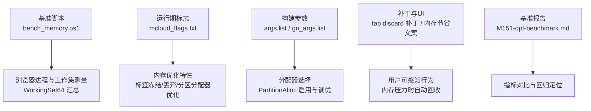
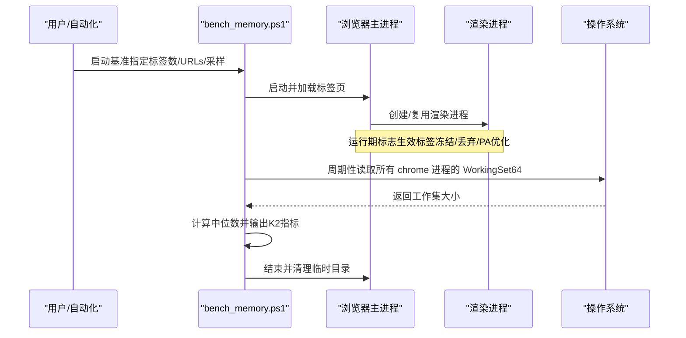
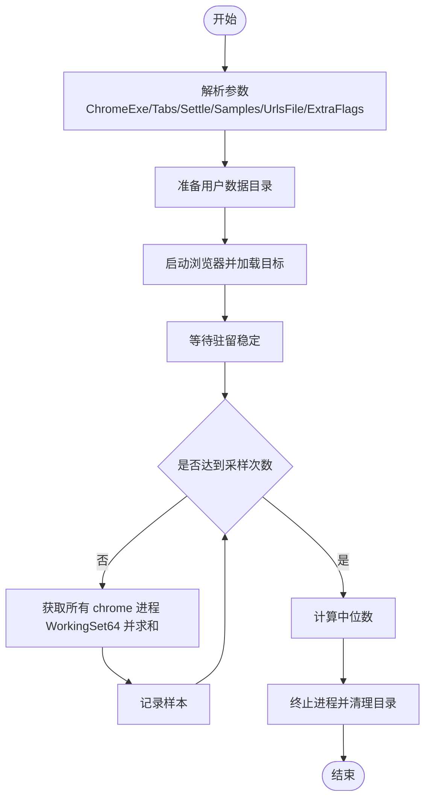
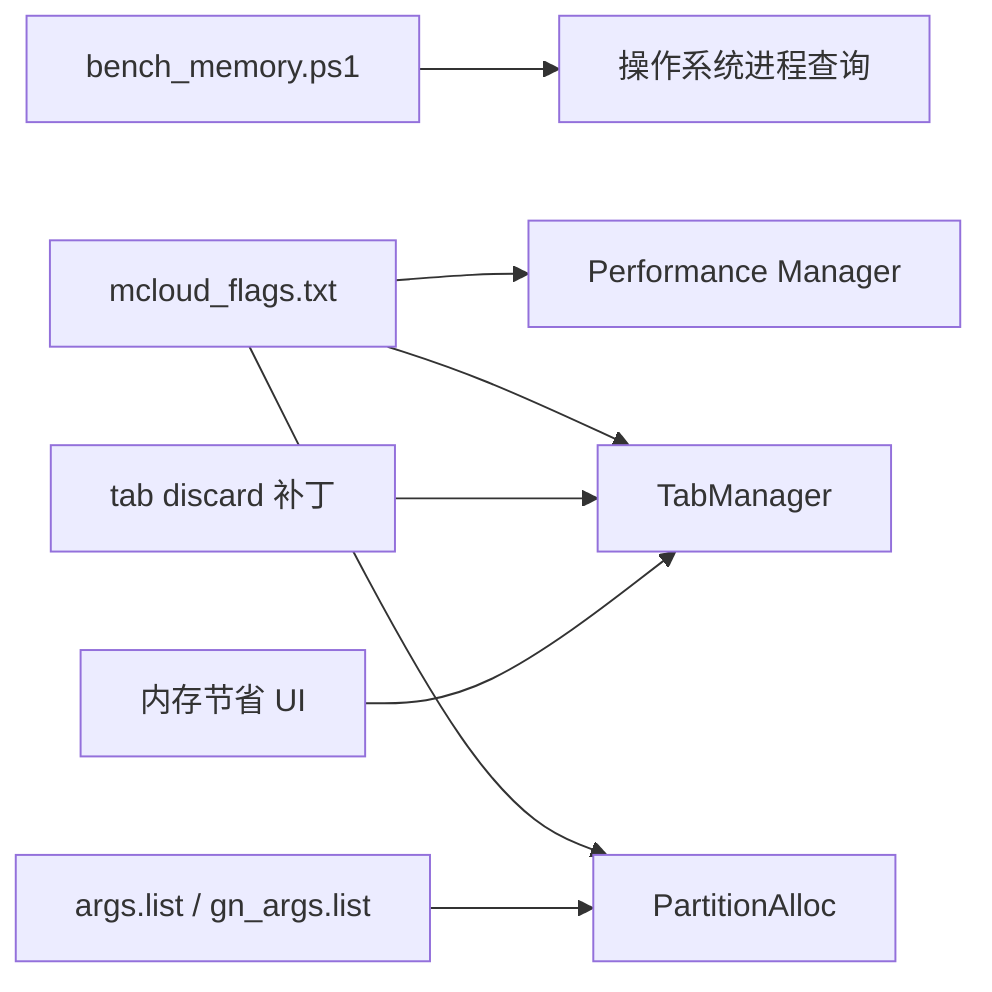

# 内存分析

<cite>
**本文引用的文件**
- [bench_memory.ps1](file://benchmark/bench_memory.ps1)
- [mcloud_flags.txt](file://mcloud_flags.txt)
- [M151-opt-benchmark.md](file://docs/dev-logs/M151-opt-benchmark.md)
- [memory-Enable-the-tab-discards-feature.patch](file://infra/Flatpak/com.mcloud.browser/patches/chromium/memory-Enable-the-tab-discards-feature.patch)
- [settings_strings.grdp](file://src/chrome/app/settings_strings.grdp)
- [chromeos_strings.grd](file://src/chromeos/chromeos_strings.grd)
- [partalloc.patch](file://other/partalloc.patch)
- [args.list（Linux）](file://infra/args.list)
- [win_args.list（Windows）](file://infra/win_args.list)
- [gn_args.list（Linux）](file://infra/gn_args.list)
- [win_gn_args.list（Windows）](file://infra/win_gn_args.list)
- [mac_args.list（macOS）](file://other/Mac/mac_args.list)
- [BUILD.gn（content，Linux 依赖）](file://src/content/browser/BUILD.gn)
</cite>

## 目录
1. [简介](#简介)
2. [项目结构](#项目结构)
3. [核心组件](#核心组件)
4. [架构总览](#架构总览)
5. [详细组件分析](#详细组件分析)
6. [依赖关系分析](#依赖关系分析)
7. [性能考量](#性能考量)
8. [故障排查指南](#故障排查指南)
9. [结论](#结论)
10. [附录](#附录)

## 简介
本文件面向 Chromium/Thorium 的内存使用分析与泄漏检测，结合仓库中的基准脚本、运行时标志与构建配置，系统说明：
- 如何使用 bench_memory.ps1 进行多标签页场景下的内存占用基准测试；
- 如何识别内存泄漏、内存碎片和异常内存增长；
- Chromium 的内存管理机制（PartitionAlloc、标签冻结/丢弃、内存压力响应等）与优化策略；
- 诊断流程与修复建议，以及最佳实践。

## 项目结构
与内存分析直接相关的工程元素包括：
- 基准脚本：benchmark/bench_memory.ps1，用于固定标签集驻留后的工作集统计；
- 运行期优化开关：mcloud_flags.txt，集中启用多项内存相关特性；
- 构建期分配器与特性：各平台 args.list / gn_args.list，控制 PartitionAlloc 的使用与行为；
- 补丁与 UI 文案：tab discard 能力启用补丁、内存节省模式 UI 文案；
- 基准报告：docs/dev-logs/M151-opt-benchmark.md，记录内存指标变化与取舍。

图表来源
- [bench_memory.ps1:1-78](file://benchmark/bench_memory.ps1#L1-L78)
- [mcloud_flags.txt:27-38](file://mcloud_flags.txt#L27-L38)
- [args.list（Linux）:5190-5196](file://infra/args.list#L5190-L5196)
- [gn_args.list（Linux）:5963-5990](file://infra/gn_args.list#L5963-L5990)
- [memory-Enable-the-tab-discards-feature.patch:1-98](file://infra/Flatpak/com.mcloud.browser/patches/chromium/memory-Enable-the-tab-discards-feature.patch#L1-L98)
- [M151-opt-benchmark.md:19-25](file://docs/dev-logs/M151-opt-benchmark.md#L19-L25)

章节来源
- [bench_memory.ps1:1-78](file://benchmark/bench_memory.ps1#L1-L78)
- [mcloud_flags.txt:27-38](file://mcloud_flags.txt#L27-L38)
- [args.list（Linux）:5190-5196](file://infra/args.list#L5190-L5196)
- [gn_args.list（Linux）:5963-5990](file://infra/gn_args.list#L5963-L5990)
- [memory-Enable-the-tab-discards-feature.patch:1-98](file://infra/Flatpak/com.mcloud.browser/patches/chromium/memory-Enable-the-tab-discards-feature.patch#L1-L98)
- [M151-opt-benchmark.md:19-25](file://docs/dev-logs/M151-opt-benchmark.md#L19-L25)

## 核心组件
- 内存基准脚本（bench_memory.ps1）
  - 以全新用户数据目录启动浏览器，打开固定数量标签页（默认 about:blank），等待稳定后对全部 chrome 子进程的 WorkingSet64 求和并采样多次取中位数；
  - 支持通过 -UrlsFile 指定真实站点 URL 列表，便于评估真实页面场景；
  - 输出 K2 指标（内存峰值）及原始样本，便于回归对比。

- 运行期内存优化标志（mcloud_flags.txt）
  - 启用标签冻结（InfiniteTabsFreezing）、内存压力下冻结（InfiniteTabsFreezingOnMemoryPressure）；
  - 启用 PartitionAlloc 相关优化（EventuallyZeroFreedMemory、MemoryReclaimer、SortActiveSlotSpans、UsePriorityInheritanceLocks、LowerPAMemoryLimitForNonMainRenderers）；
  - 启用标签丢弃策略（DiscardOnCommitLimit、SustainedPMUrgentDiscarding）；
  - 启用渲染/GPU 侧缓存清理（ReclaimOldPrepaintTiles、PruneOldTransferCacheEntries）。

- 构建期分配器与特性（args.list / gn_args.list）
  - Linux/Windows/macOS 均启用 PartitionAlloc 作为主要分配器；
  - 通过 use_partition_alloc_as_malloc 将 malloc 路由到 PartitionAlloc；
  - 针对 Linux/Android/ChromeOS 启用 fewer_memory_regions 以减少 VMA 限制带来的碎片问题（见 partalloc.patch）。

- 标签丢弃与内存压力响应（补丁与 UI）
  - 在 Linux/ChromeOS 上启用 TabManager 监听内存压力并触发标签丢弃；
  - 设置界面提供“内存节省”模式与不同激进程度选项，允许按不活跃时间或启发式策略释放内存。

章节来源
- [bench_memory.ps1:1-78](file://benchmark/bench_memory.ps1#L1-L78)
- [mcloud_flags.txt:27-38](file://mcloud_flags.txt#L27-L38)
- [args.list（Linux）:5190-5196](file://infra/args.list#L5190-L5196)
- [gn_args.list（Linux）:5963-5990](file://infra/gn_args.list#L5963-L5990)
- [win_args.list（Windows）:5415-5431](file://infra/win_args.list#L5415-L5431)
- [win_gn_args.list（Windows）:5570-5591](file://infra/win_gn_args.list#L5570-L5591)
- [mac_args.list（macOS）:5057-5063](file://other/Mac/mac_args.list#L5057-L5063)
- [memory-Enable-the-tab-discards-feature.patch:1-98](file://infra/Flatpak/com.mcloud.browser/patches/chromium/memory-Enable-the-tab-discards-feature.patch#L1-L98)
- [settings_strings.grdp:1038-1089](file://src/chrome/app/settings_strings.grdp#L1038-L1089)

## 架构总览
Chromium 的内存管理由多层协作完成：
- 分配层：PartitionAlloc 提供高效、低碎片的内存分配，配合排序活跃 slot span、优先级继承锁、释放清零等特性减少碎片与锁竞争；
- 资源协调层：Performance Manager 与 TabManager 监控内存压力，执行标签冻结/丢弃；
- 渲染/GPU 层：预绘制瓦片回收、传输缓存清理降低渲染与 GPU 内存占用；
- 观测与基准：bench_memory.ps1 采集工作集，基准报告记录趋势与回归。

图表来源
- [bench_memory.ps1:30-77](file://benchmark/bench_memory.ps1#L30-L77)
- [mcloud_flags.txt:27-38](file://mcloud_flags.txt#L27-L38)

## 详细组件分析

### 组件A：内存基准脚本（bench_memory.ps1）
- 功能要点
  - 新建独立用户数据目录，避免历史状态干扰；
  - 支持两种目标：about:blank（快速稳定）或 -UrlsFile 提供的真实站点；
  - 等待 SettleSeconds 使内存稳定，然后多次采样 WorkingSet64 总和，取中位数作为 K2 指标；
  - 输出原始样本与环境信息提示，便于归档与对比。

- 关键流程
  - 参数解析与目标生成；
  - 启动浏览器进程并加载目标；
  - 循环采样并汇总工作集；
  - 终止进程并清理临时目录；
  - 计算中位数并打印结果。

图表来源
- [bench_memory.ps1:13-77](file://benchmark/bench_memory.ps1#L13-L77)

章节来源
- [bench_memory.ps1:13-77](file://benchmark/bench_memory.ps1#L13-L77)

### 组件B：运行期内存优化标志（mcloud_flags.txt）
- 标签冻结与丢弃
  - InfiniteTabsFreezing：后台标签冻结，减少 CPU/内存占用；
  - InfiniteTabsFreezingOnMemoryPressure：内存压力下主动冻结；
  - DiscardOnCommitLimit：可用内存低于阈值时丢弃标签；
  - SustainedPMUrgentDiscarding：持续压力紧急丢弃。

- 分配器优化
  - PartitionAllocEventuallyZeroFreedMemory：释放内存清零，利于调试与隔离；
  - PartitionAllocMemoryReclaimer：定期回收空闲内存；
  - PartitionAllocSortActiveSlotSpans：PurgeMemory 时排序活跃槽，减少碎片；
  - PartitionAllocUsePriorityInheritanceLocks：降低锁竞争；
  - LowerPAMemoryLimitForNonMainRenderers：非主框架渲染器更低内存上限，多标签下显著降内存。

- 渲染/GPU 缓存清理
  - ReclaimOldPrepaintTiles：30 秒后回收预绘制瓦片；
  - PruneOldTransferCacheEntries：清理旧传输缓存条目。

章节来源
- [mcloud_flags.txt:27-38](file://mcloud_flags.txt#L27-L38)

### 组件C：构建期分配器与特性（args.list / gn_args.list）
- PartitionAlloc 启用
  - use_partition_alloc：使 PartitionAlloc 链接到可执行文件或共享库；
  - use_partition_alloc_as_malloc：将 malloc 调用路由到 PartitionAlloc（PA-E）；
  - 各平台默认值确认启用，确保统一分配行为。

- 平台特定优化
  - partalloc.patch 在 Linux/Android/ChromeOS 启用 fewer_memory_regions，缓解 VMA 限制导致的碎片问题；
  - 通过 GN 参数在不同平台调整 PartitionAlloc 的行为与可用性。

章节来源
- [args.list（Linux）:5190-5196](file://infra/args.list#L5190-L5196)
- [gn_args.list（Linux）:5963-5990](file://infra/gn_args.list#L5963-L5990)
- [win_args.list（Windows）:5415-5431](file://infra/win_args.list#L5415-L5431)
- [win_gn_args.list（Windows）:5570-5591](file://infra/win_gn_args.list#L5570-L5591)
- [mac_args.list（macOS）:5057-5063](file://other/Mac/mac_args.list#L5057-L5063)
- [partalloc.patch:1-26](file://other/partalloc.patch#L1-L26)

### 组件D：标签丢弃与内存压力响应（补丁与 UI）
- 补丁启用 TabManager 在 Linux/ChromeOS 上监听内存压力并触发标签丢弃；
- 设置界面提供“内存节省”模式，包含保守/平衡/激进三种策略，以及例外站点列表；
- 这些机制共同构成“内存压力→冻结/丢弃→释放内存”的闭环。

章节来源
- [memory-Enable-the-tab-discards-feature.patch:1-98](file://infra/Flatpak/com.mcloud.browser/patches/chromium/memory-Enable-the-tab-discards-feature.patch#L1-L98)
- [settings_strings.grdp:1038-1089](file://src/chrome/app/settings_strings.grdp#L1038-L1089)

### 组件E：基准报告与回归定位（M151-opt-benchmark.md）
- 记录 K2 内存峰值变化（+50.2 MB），归因于预载/预热类 feature 的内存代价；
- 通过移除高内存代价项（MultipleSpareRPHs、LoadingPredictorPrefetch、NewTabPageTriggerForPrerender2）实现内存回落；
- 为后续优化提供数据支撑与取舍依据。

章节来源
- [M151-opt-benchmark.md:19-25](file://docs/dev-logs/M151-opt-benchmark.md#L19-L25)
- [M151-opt-benchmark.md:34-60](file://docs/dev-logs/M151-opt-benchmark.md#L34-L60)

## 依赖关系分析
- 基准脚本依赖操作系统进程查询接口（WorkingSet64），在多进程环境下汇总所有 chrome 子进程；
- 运行期标志依赖 Chromium 特性系统，影响 Performance Manager、TabManager、PartitionAlloc 等行为；
- 构建参数决定分配器与平台特性，影响内存碎片与 VMA 使用；
- 补丁与 UI 文案增强用户可见的内存节省能力。

图表来源
- [bench_memory.ps1:58-67](file://benchmark/bench_memory.ps1#L58-L67)
- [mcloud_flags.txt:27-38](file://mcloud_flags.txt#L27-L38)
- [args.list（Linux）:5190-5196](file://infra/args.list#L5190-L5196)
- [memory-Enable-the-tab-discards-feature.patch:1-98](file://infra/Flatpak/com.mcloud.browser/patches/chromium/memory-Enable-the-tab-discards-feature.patch#L1-L98)

章节来源
- [bench_memory.ps1:58-67](file://benchmark/bench_memory.ps1#L58-L67)
- [mcloud_flags.txt:27-38](file://mcloud_flags.txt#L27-L38)
- [args.list（Linux）:5190-5196](file://infra/args.list#L5190-L5196)
- [memory-Enable-the-tab-discards-feature.patch:1-98](file://infra/Flatpak/com.mcloud.browser/patches/chromium/memory-Enable-the-tab-discards-feature.patch#L1-L98)

## 性能考量
- 多标签页场景
  - 使用 bench_memory.ps1 的 -Tabs 与 -UrlsFile 模拟真实负载；
  - 关注 K2 指标（工作集中位数）与进程数量，评估内存稳定性；
  - 通过禁用/启用特定 feature 进行二分定位，识别高内存代价项。

- 内存碎片与分配器
  - PartitionAlloc 的 SortActiveSlotSpans、EventuallyZeroFreedMemory、MemoryReclaimer 有助于减少碎片与提升回收效率；
  - fewer_memory_regions 在 Linux/Android/ChromeOS 上缓解 VMA 限制。

- 渲染与 GPU 内存
  - ReclaimOldPrepaintTiles、PruneOldTransferCacheEntries 降低渲染与 GPU 内存占用；
  - 视频解码缓冲优化（ReduceHardwareVideoDecoderBuffers）可减少内存峰值。

[本节为通用指导，不直接分析具体文件]

## 故障排查指南
- 内存泄漏识别
  - 使用基准脚本在相同负载下重复采样，观察 K2 是否随时间单调增长；
  - 结合任务管理器/性能监视器查看 WorkingSet64 曲线，定位异常增长阶段；
  - 通过禁用可疑 feature（如预载/预热类）验证是否为该特性导致。

- 内存碎片诊断
  - 检查 PartitionAlloc 相关标志是否启用（SortActiveSlotSpans、EventuallyZeroFreedMemory）；
  - 在 Linux/Android/ChromeOS 确认 fewer_memory_regions 已启用；
  - 观察进程数与每个进程的工作集分布，判断是否存在局部碎片。

- 异常内存增长处理
  - 启用内存节省模式（保守/平衡/激进），观察是否有效释放内存；
  - 检查标签冻结/丢弃是否触发（可通过日志或 UI 状态确认）；
  - 若仍增长，逐步缩小范围：关闭扩展、切换用户数据目录、更换 URL 列表。

章节来源
- [bench_memory.ps1:58-77](file://benchmark/bench_memory.ps1#L58-L77)
- [mcloud_flags.txt:27-38](file://mcloud_flags.txt#L27-L38)
- [memory-Enable-the-tab-discards-feature.patch:1-98](file://infra/Flatpak/com.mcloud.browser/patches/chromium/memory-Enable-the-tab-discards-feature.patch#L1-L98)
- [settings_strings.grdp:1038-1089](file://src/chrome/app/settings_strings.grdp#L1038-L1089)

## 结论
- 本项目通过运行期标志与构建参数，系统性启用 Chromium 的内存优化能力（标签冻结/丢弃、PartitionAlloc 优化、渲染/GPU 缓存清理）；
- bench_memory.ps1 提供了标准化的 K2 指标采集方法，便于回归对比与问题定位；
- 基准报告表明预载/预热类 feature 存在内存代价，需根据业务权衡取舍；
- 建议在多标签页场景下优先启用内存节省模式与 PartitionAlloc 优化，并结合基准脚本持续监测。

[本节为总结性内容，不直接分析具体文件]

## 附录
- 多标签页内存占用模式分析建议
  - 使用 -Tabs=50 与 -UrlsFile 模拟真实负载，记录 K2 中位数与进程数；
  - 分阶段采样（启动后 0-60s、60-120s、120s+），观察稳定态与波动；
  - 对比 about:blank 与真实站点，评估网络与页面复杂度对内存的影响。

- 内存优化最佳实践
  - 启用 InfiniteTabsFreezing 与 InfiniteTabsFreezingOnMemoryPressure；
  - 启用 PartitionAlloc 相关优化（SortActiveSlotSpans、EventuallyZeroFreedMemory、MemoryReclaimer）；
  - 启用 DiscardOnCommitLimit 与 SustainedPMUrgentDiscarding 防止 OOM；
  - 合理配置内存节省模式激进程度与例外站点。

[本节为通用指导，不直接分析具体文件]