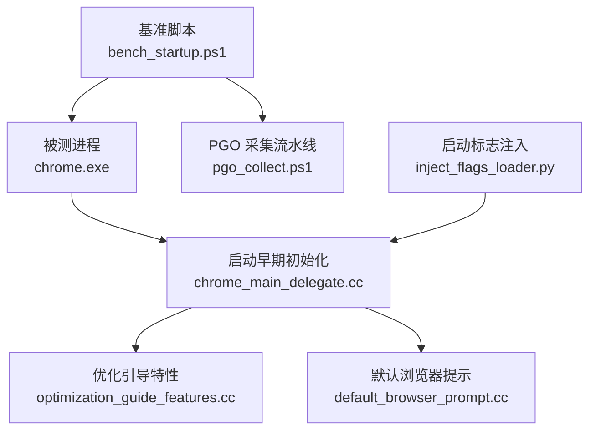
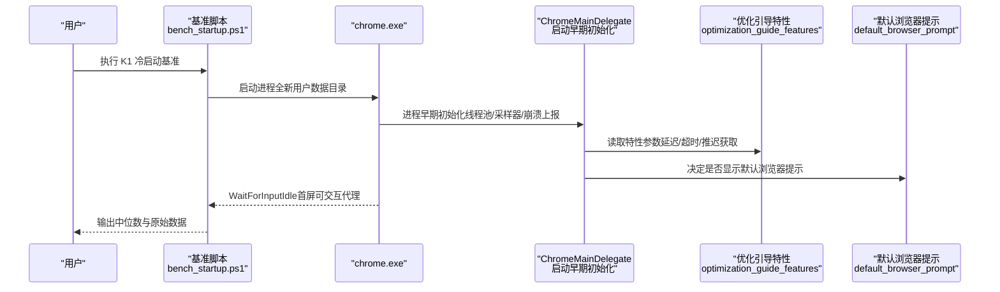
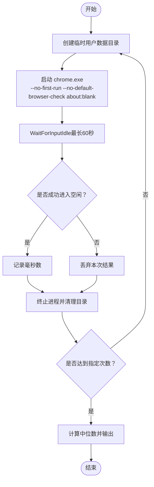
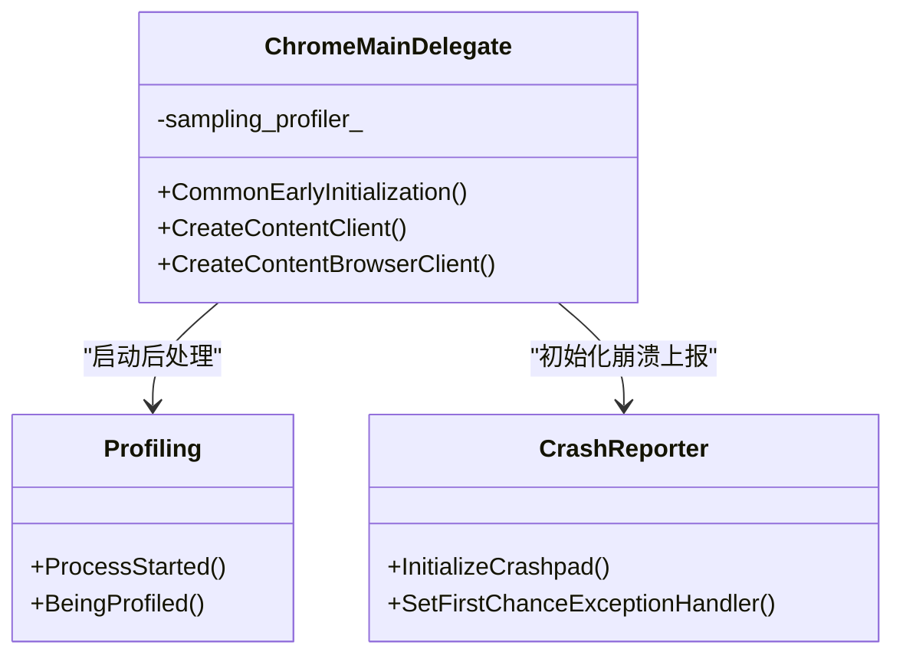
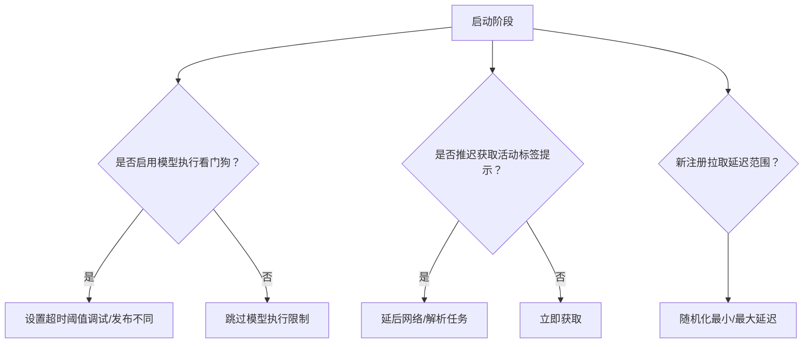
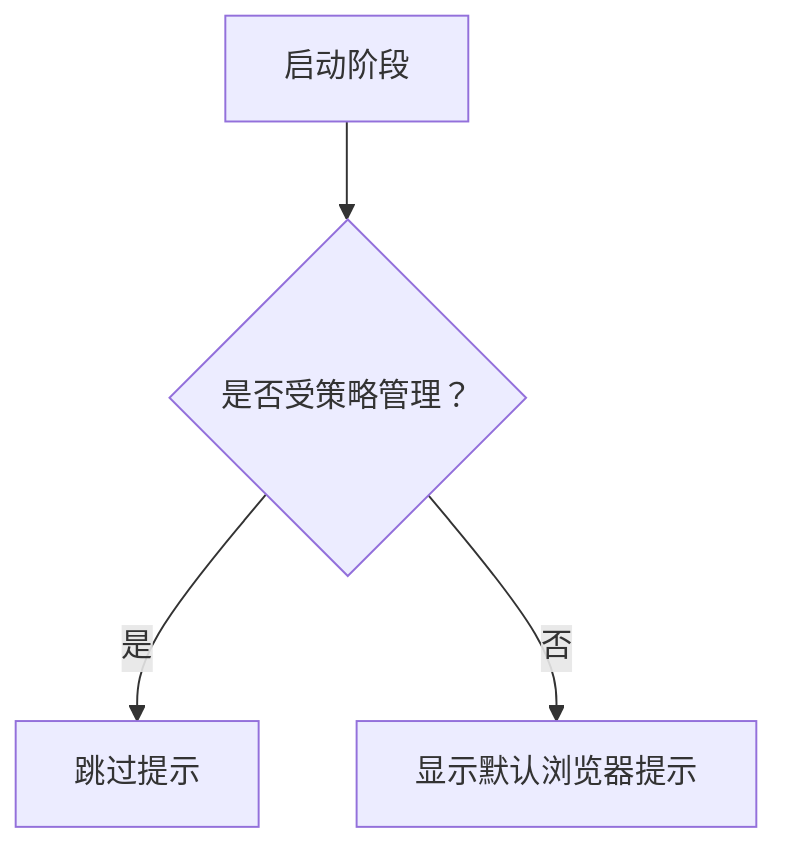
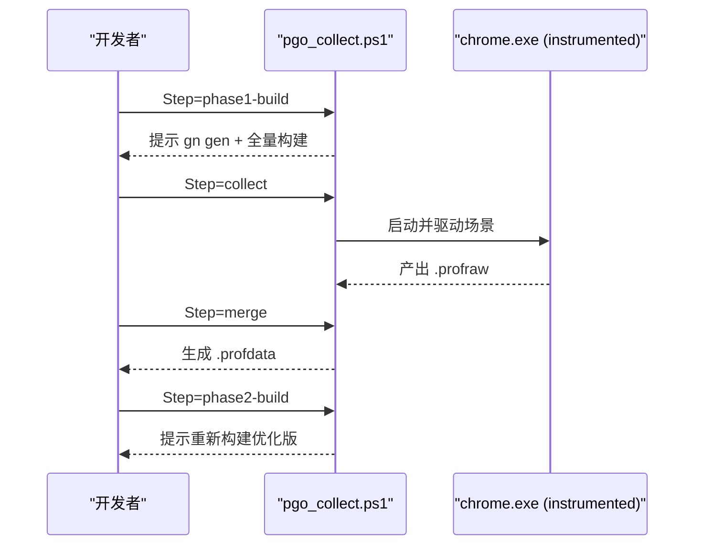
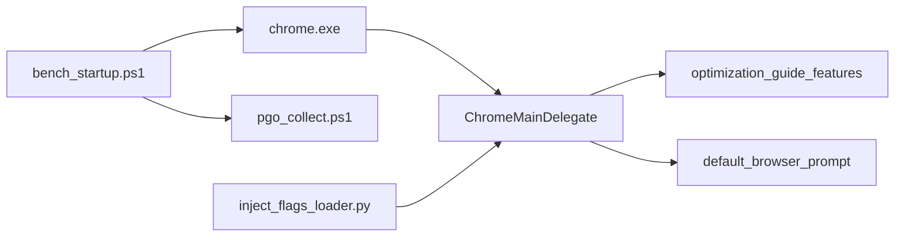

# 启动性能分析

<cite>
**本文引用的文件**
- [bench_startup.ps1](file://benchmark/bench_startup.ps1)
- [pgo_collect.ps1](file://benchmark/tools/pgo_collect.ps1)
- [chrome_main_delegate.cc](file://src/chrome/app/chrome_main_delegate.cc)
- [optimization_guide_features.cc](file://src/components/optimization_guide/core/optimization_guide_features.cc)
- [default_browser_prompt.cc](file://src/chrome/browser/ui/startup/default_browser_prompt/default_browser_prompt.cc)
- [inject_flags_loader.py](file://win_scripts/inject_flags_loader.py)
- [benchmark-template.md](file://docs/dev-logs/benchmark-template.md)
</cite>

## 目录
1. [简介](#简介)
2. [项目结构](#项目结构)
3. [核心组件](#核心组件)
4. [架构总览](#架构总览)
5. [详细组件分析](#详细组件分析)
6. [依赖关系分析](#依赖关系分析)
7. [性能考量](#性能考量)
8. [故障排查指南](#故障排查指南)
9. [结论](#结论)
10. [附录](#附录)

## 简介
本文件面向 MCloud Browser 的启动性能分析与优化，聚焦冷启动与热启动的性能特征、启动时间测量方法与分析工具、启动优化策略与最佳实践，并详细说明如何使用 bench_startup.ps1 进行 K1 冷启动基准测试、如何解读结果并定位瓶颈。同时给出可落地的监控指标与调优建议，帮助在工程实践中持续追踪与改进启动时延。

## 项目结构
围绕启动性能的关键资产分布在以下位置：
- 基准脚本：benchmark/bench_startup.ps1（K1 冷启动计时）、benchmark/tools/pgo_collect.ps1（PGO 自采流程）
- 启动期关键代码：src/chrome/app/chrome_main_delegate.cc（进程早期初始化、采样器与崩溃上报等）
- 启动期特性开关：src/components/optimization_guide/core/optimization_guide_features.cc（延迟/超时/是否推迟获取提示等）
- 启动期 UI 相关：src/chrome/browser/ui/startup/default_browser_prompt/default_browser_prompt.cc（默认浏览器提示逻辑）
- 启动标志注入：win_scripts/inject_flags_loader.py（向 chrome_main_delegate.cc 注入内置标志加载器）
- 报告模板：docs/dev-logs/benchmark-template.md（统一记录环境与 KPI）

图表来源
- [bench_startup.ps1:1-70](file://benchmark/bench_startup.ps1#L1-L70)
- [chrome_main_delegate.cc:782-817](file://src/chrome/app/chrome_main_delegate.cc#L782-L817)
- [optimization_guide_features.cc:326-367](file://src/components/optimization_guide/core/optimization_guide_features.cc#L326-L367)
- [default_browser_prompt.cc:1-87](file://src/chrome/browser/ui/startup/default_browser_prompt/default_browser_prompt.cc#L1-L87)
- [pgo_collect.ps1:1-106](file://benchmark/tools/pgo_collect.ps1#L1-L106)
- [inject_flags_loader.py:1-28](file://win_scripts/inject_flags_loader.py#L1-L28)

章节来源
- [bench_startup.ps1:1-70](file://benchmark/bench_startup.ps1#L1-L70)
- [pgo_collect.ps1:1-106](file://benchmark/tools/pgo_collect.ps1#L1-L106)
- [chrome_main_delegate.cc:782-817](file://src/chrome/app/chrome_main_delegate.cc#L782-L817)
- [optimization_guide_features.cc:326-367](file://src/components/optimization_guide/core/optimization_guide_features.cc#L326-L367)
- [default_browser_prompt.cc:1-87](file://src/chrome/browser/ui/startup/default_browser_prompt/default_browser_prompt.cc#L1-L87)
- [inject_flags_loader.py:1-28](file://win_scripts/inject_flags_loader.py#L1-L28)
- [benchmark-template.md:1-39](file://docs/dev-logs/benchmark-template.md#L1-L39)

## 核心组件
- 冷启动基准脚本（K1）：使用全新临时用户数据目录，启动 chrome.exe 并等待主窗口进入空闲状态作为“首屏可交互”代理指标，多次运行取中位数。
- 启动早期初始化：在进程极早期完成线程池、采样器、崩溃上报、Tracing 等基础设施准备，为后续 UI 渲染和网络能力提供基础。
- 优化引导特性：通过特性参数控制模型执行超时、新注册拉取延迟、是否在启动时推迟获取活动标签提示等，直接影响冷启动耗时。
- 默认浏览器提示：在启动阶段决定是否显示默认浏览器设置提示，避免不必要的 UI 阻塞。
- PGO 自采流水线：以真实场景驱动 instrumented 构建，收集 .profraw 并合并为 .profdata，指导二次构建优化热点路径。
- 启动标志注入：从 exe 同目录读取 mcloud_flags.txt，将内置启动标志与用户命令行合并，便于在不改源码的情况下调整启动行为。

章节来源
- [bench_startup.ps1:1-70](file://benchmark/bench_startup.ps1#L1-L70)
- [chrome_main_delegate.cc:782-817](file://src/chrome/app/chrome_main_delegate.cc#L782-L817)
- [optimization_guide_features.cc:326-367](file://src/components/optimization_guide/core/optimization_guide_features.cc#L326-L367)
- [default_browser_prompt.cc:1-87](file://src/chrome/browser/ui/startup/default_browser_prompt/default_browser_prompt.cc#L1-L87)
- [pgo_collect.ps1:1-106](file://benchmark/tools/pgo_collect.ps1#L1-L106)
- [inject_flags_loader.py:1-28](file://win_scripts/inject_flags_loader.py#L1-L28)

## 架构总览
下图展示了从外部基准脚本到被测进程的调用时序，以及内部启动阶段的职责划分。

图表来源
- [bench_startup.ps1:1-70](file://benchmark/bench_startup.ps1#L1-L70)
- [chrome_main_delegate.cc:782-817](file://src/chrome/app/chrome_main_delegate.cc#L782-L817)
- [optimization_guide_features.cc:326-367](file://src/components/optimization_guide/core/optimization_guide_features.cc#L326-L367)
- [default_browser_prompt.cc:1-87](file://src/chrome/browser/ui/startup/default_browser_prompt/default_browser_prompt.cc#L1-L87)

## 详细组件分析

### 冷启动基准脚本（K1）
- 目标：测量冷启动到中位数的首屏可交互时间，采用全新临时用户数据目录，避免缓存干扰。
- 方法：每次循环创建独立用户数据目录，启动 chrome.exe 并传入 no-first-run 与 about:blank；使用系统 API 等待输入空闲作为可交互信号；多次运行后计算中位数。
- 输出：有效次数、中位数、原始数据列表，并提示按模板归档。

图表来源
- [bench_startup.ps1:1-70](file://benchmark/bench_startup.ps1#L1-L70)

章节来源
- [bench_startup.ps1:1-70](file://benchmark/bench_startup.ps1#L1-L70)

### 启动早期初始化（ChromeMainDelegate）
- 职责：在进程极早期完成线程池、采样器、崩溃上报、Tracing 等基础设施准备；根据平台与特性配置优先级提升、拆分缓存等；为后续 UI 与网络能力奠定基础。
- 关键点：
  - 采样器尽早启用，便于捕获启动期热点。
  - 崩溃上报与异常处理器在拥有用户数据目录后初始化。
  - 根据特性与平台条件控制优先级提升等系统级行为。

图表来源
- [chrome_main_delegate.cc:782-817](file://src/chrome/app/chrome_main_delegate.cc#L782-L817)
- [chrome_main_delegate.cc:1632-1669](file://src/chrome/app/chrome_main_delegate.cc#L1632-L1669)

章节来源
- [chrome_main_delegate.cc:782-817](file://src/chrome/app/chrome_main_delegate.cc#L782-L817)
- [chrome_main_delegate.cc:1632-1669](file://src/chrome/app/chrome_main_delegate.cc#L1632-L1669)

### 优化引导特性（启动期延迟与超时）
- 作用：控制模型执行超时、新注册拉取的最小/最大延迟、是否在启动时推迟获取活动标签提示等，直接影响冷启动期间的 I/O 与 CPU 占用。
- 典型影响点：
  - 模型执行超时：调试与发布构建不同，避免长耗时任务阻塞首帧。
  - 新注册拉取延迟：随机化最小/最大延迟，降低集中请求对启动的影响。
  - 推迟获取活动标签提示：减少启动期的网络与解析开销。

图表来源
- [optimization_guide_features.cc:326-367](file://src/components/optimization_guide/core/optimization_guide_features.cc#L326-L367)

章节来源
- [optimization_guide_features.cc:326-367](file://src/components/optimization_guide/core/optimization_guide_features.cc#L326-L367)

### 默认浏览器提示（启动期 UI）
- 行为：在启动阶段判断是否应显示默认浏览器提示；若由策略管理则直接跳过，避免不必要的 UI 与偏好读写。
- 影响：减少启动期的 UI 绘制与交互事件处理，有助于稳定冷启动时间。

图表来源
- [default_browser_prompt.cc:1-87](file://src/chrome/browser/ui/startup/default_browser_prompt/default_browser_prompt.cc#L1-L87)

章节来源
- [default_browser_prompt.cc:1-87](file://src/chrome/browser/ui/startup/default_browser_prompt/default_browser_prompt.cc#L1-L87)

### PGO 自采流水线（启动期热点优化）
- 目标：以真实用户场景（启动/多标签/浏览/视频）采集 profraw，生成 profdata，用于第二次构建优化热点路径，从而改善启动性能。
- 流程：
  - phase1-build：设置 instrumentation 构建。
  - collect：运行 instrumented 构建并驱动场景，产出 .profraw。
  - merge：合并为 .profdata。
  - phase2-build：指向 profdata 重建，获得优化后的二进制。

图表来源
- [pgo_collect.ps1:1-106](file://benchmark/tools/pgo_collect.ps1#L1-L106)

章节来源
- [pgo_collect.ps1:1-106](file://benchmark/tools/pgo_collect.ps1#L1-L106)

### 启动标志注入（无需改源码调整启动行为）
- 机制：在启动早期从 exe 同目录读取 mcloud_flags.txt，逐行解析标志并追加到进程命令行；enable/disable-features 与用户命令行合并（用户条目在后优先），其余标志若用户已指定则跳过。
- 价值：在不修改源码的前提下，快速验证不同启动标志组合对冷启动的影响。

章节来源
- [inject_flags_loader.py:1-28](file://win_scripts/inject_flags_loader.py#L1-L28)

## 依赖关系分析
- 基准脚本依赖操作系统进程管理与计时能力，被测进程依赖 Chromium 内核的启动流程。
- 启动早期初始化依赖线程池、采样器、崩溃上报子系统。
- 优化引导特性通过特性开关影响启动期的网络与模型执行行为。
- 默认浏览器提示依赖本地策略与偏好服务。
- PGO 流水线依赖 LLVM 工具链与 Chromium 构建系统。

图表来源
- [bench_startup.ps1:1-70](file://benchmark/bench_startup.ps1#L1-L70)
- [chrome_main_delegate.cc:782-817](file://src/chrome/app/chrome_main_delegate.cc#L782-L817)
- [optimization_guide_features.cc:326-367](file://src/components/optimization_guide/core/optimization_guide_features.cc#L326-L367)
- [default_browser_prompt.cc:1-87](file://src/chrome/browser/ui/startup/default_browser_prompt/default_browser_prompt.cc#L1-L87)
- [pgo_collect.ps1:1-106](file://benchmark/tools/pgo_collect.ps1#L1-L106)
- [inject_flags_loader.py:1-28](file://win_scripts/inject_flags_loader.py#L1-L28)

章节来源
- [bench_startup.ps1:1-70](file://benchmark/bench_startup.ps1#L1-L70)
- [chrome_main_delegate.cc:782-817](file://src/chrome/app/chrome_main_delegate.cc#L782-L817)
- [optimization_guide_features.cc:326-367](file://src/components/optimization_guide/core/optimization_guide_features.cc#L326-L367)
- [default_browser_prompt.cc:1-87](file://src/chrome/browser/ui/startup/default_browser_prompt/default_browser_prompt.cc#L1-L87)
- [pgo_collect.ps1:1-106](file://benchmark/tools/pgo_collect.ps1#L1-L106)
- [inject_flags_loader.py:1-28](file://win_scripts/inject_flags_loader.py#L1-L28)

## 性能考量
- 冷启动 vs 热启动
  - 冷启动：全新用户数据目录、无缓存、首次加载资源，受磁盘 I/O、模块加载、UI 初始化、网络请求等影响较大。
  - 热启动：复用进程或已有资源，I/O 与初始化成本显著降低，但可能仍受后台任务与网络影响。
- 启动时间测量与分析
  - 使用 bench_startup.ps1 进行 K1 冷启动基准，统计多次运行的中位数与原始数据。
  - 结合 Tracing 与采样器（已在启动早期启用）定位热点函数与阻塞点。
  - 使用 PGO 自采流水线优化热点路径，对比前后构建的 K1 变化。
- 启动优化策略与最佳实践
  - 模块加载优化：推迟非关键模块加载，按需加载；利用特性开关控制启动期网络与模型任务。
  - 初始化流程优化：减少同步 I/O，异步化 UI 初始化；避免在首帧前执行重任务。
  - 启动标志调优：通过 inject_flags_loader.py 注入 mcloud_flags.txt，快速验证不同 flags 组合对启动的影响。
  - 构建期优化：使用 PGO 自采流程，针对产品场景优化热点路径。
- 监控指标与调优建议
  - K1 冷启动时间（中位数 ms）：基准脚本输出，关注波动与回归。
  - 启动期 CPU/内存峰值：结合系统工具与进程采样器观察。
  - 网络请求数量与时延：启动期尽量减少非必要请求，必要时推迟。
  - 构建产物体积：过大二进制可能影响加载与解压时间。
  - 建议：定期跑 K1 基线，记录环境信息（CPU/GPU/电源模式/扩展），对比上游构建差异，逐步收敛瓶颈。

[本节为通用指导，不直接分析具体文件]

## 故障排查指南
- 基准脚本失败
  - 现象：未找到 chrome.exe 或超时。
  - 排查：确认 -ChromeExe 路径正确；确保无其他浏览器实例占用；检查用户数据目录权限；适当增加超时保护。
- 启动期崩溃或无响应
  - 现象：进程启动后卡住或崩溃。
  - 排查：启用 Tracing 与采样器；检查崩溃上报日志；关闭非必要扩展；逐步禁用特性开关定位问题。
- 启动标志冲突
  - 现象：注入的标志与用户命令行冲突导致异常。
  - 排查：检查 mcloud_flags.txt 与用户命令行合并规则；优先保留用户指定项；逐项验证。
- PGO 采集失败
  - 现象：未产生 .profraw 或 merge 失败。
  - 排查：确认 instrumented 构建；设置正确的环境变量；确保 llvm-profdata 可用；检查输出目录权限。

章节来源
- [bench_startup.ps1:1-70](file://benchmark/bench_startup.ps1#L1-L70)
- [pgo_collect.ps1:1-106](file://benchmark/tools/pgo_collect.ps1#L1-L106)
- [chrome_main_delegate.cc:1632-1669](file://src/chrome/app/chrome_main_delegate.cc#L1632-L1669)
- [inject_flags_loader.py:1-28](file://win_scripts/inject_flags_loader.py#L1-L28)

## 结论
通过基准脚本、启动期初始化、特性开关与 PGO 流水线协同，可在工程实践中系统化地测量、分析与优化 MCloud Browser 的启动性能。建议将 K1 冷启动纳入持续集成与发布门禁，结合 Tracing 与采样器持续定位瓶颈，并通过 PGO 与启动标志调优稳步降低启动时延。

[本节为总结性内容，不直接分析具体文件]

## 附录
- 报告模板：使用 docs/dev-logs/benchmark-template.md 记录环境信息与 KPI，便于横向对比与回归追踪。
- 常用命令参考：
  - 冷启动基准：运行 bench_startup.ps1，指定 chrome.exe 路径与运行次数。
  - PGO 采集：按步骤执行 pgo_collect.ps1，完成采集与二次构建。
  - 启动标志：编辑 mcloud_flags.txt，配合 inject_flags_loader.py 生效。

章节来源
- [benchmark-template.md:1-39](file://docs/dev-logs/benchmark-template.md#L1-L39)
- [bench_startup.ps1:1-70](file://benchmark/bench_startup.ps1#L1-L70)
- [pgo_collect.ps1:1-106](file://benchmark/tools/pgo_collect.ps1#L1-L106)
- [inject_flags_loader.py:1-28](file://win_scripts/inject_flags_loader.py#L1-L28)