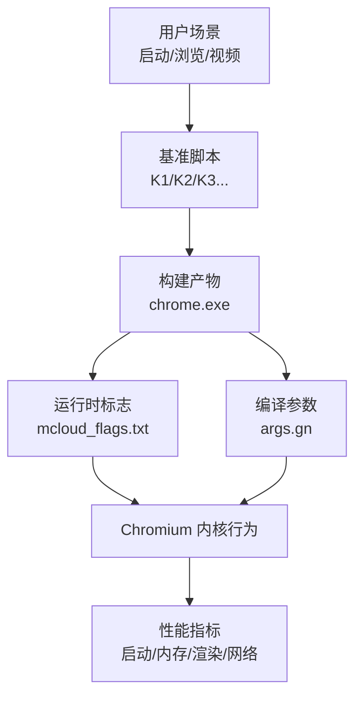
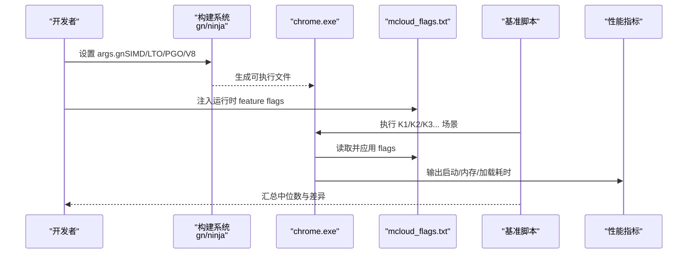
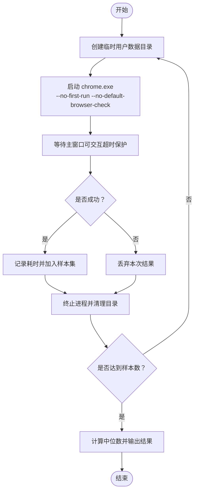
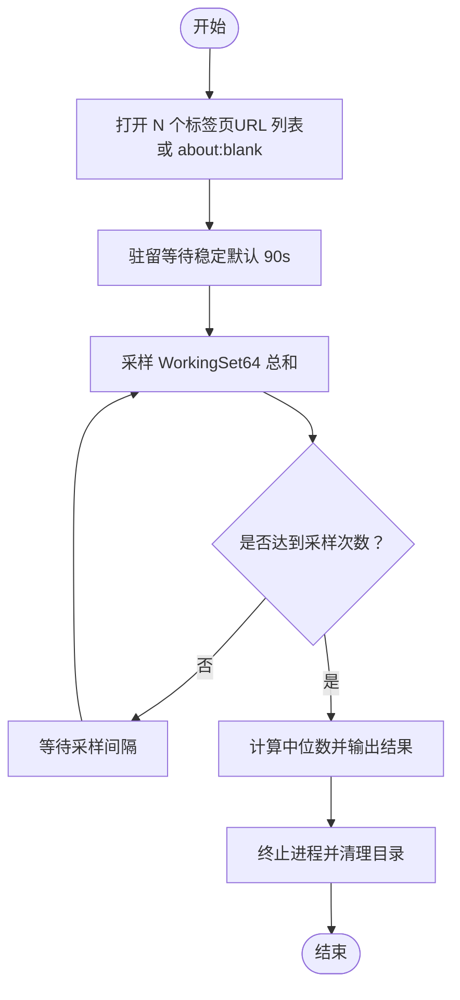
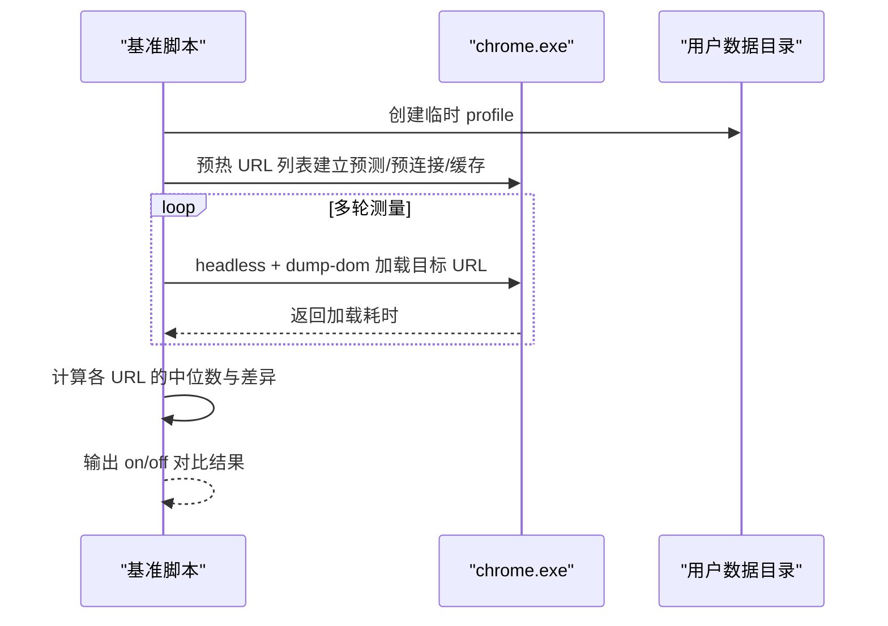
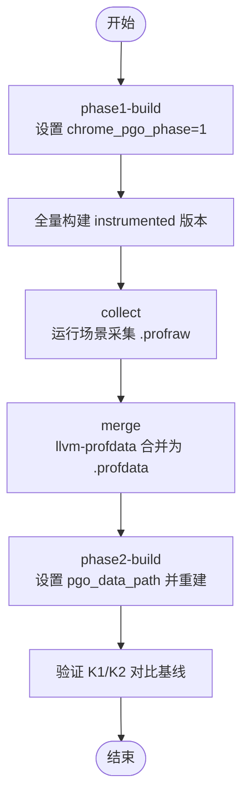
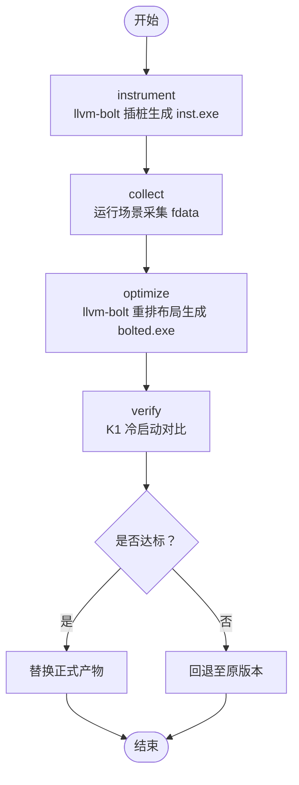
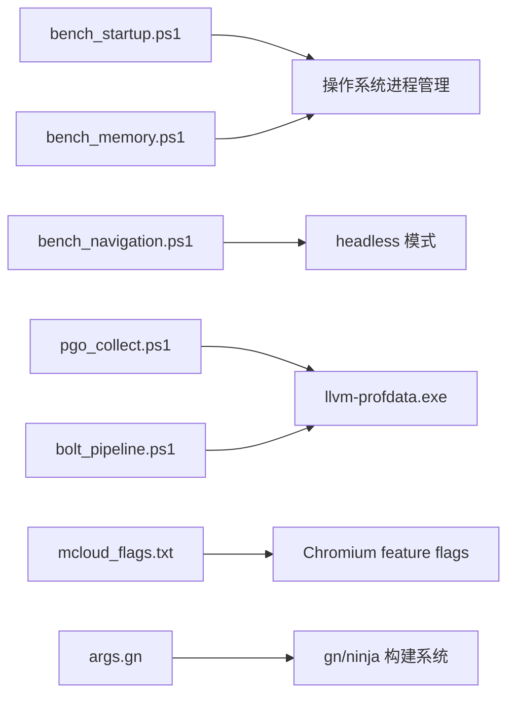

# 性能分析

本文引用的文件

- [bench_startup.ps1](https://github.com/Mcloud136/Mcloud-Browser/blob/main/benchmark/bench_startup.ps1)
- [bench_memory.ps1](https://github.com/Mcloud136/Mcloud-Browser/blob/main/benchmark/bench_memory.ps1)
- [bench_navigation.ps1](https://github.com/Mcloud136/Mcloud-Browser/blob/main/benchmark/bench_navigation.ps1)
- [pgo_collect.ps1](https://github.com/Mcloud136/Mcloud-Browser/blob/main/benchmark/tools/pgo_collect.ps1)
- [bolt_pipeline.ps1](https://github.com/Mcloud136/Mcloud-Browser/blob/main/benchmark/tools/bolt_pipeline.ps1)
- [mcloud_flags.txt](https://github.com/Mcloud136/Mcloud-Browser/blob/main/mcloud_flags.txt)
- [args.gn](https://github.com/Mcloud136/Mcloud-Browser/blob/main/args.gn)
- [2026-06-19-performance-optimization.md](https://github.com/Mcloud136/Mcloud-Browser/blob/main/docs/superpowers/plans/2026-06-19-performance-optimization.md)
- [2026-06-19-performance-optimization-design.md](https://github.com/Mcloud136/Mcloud-Browser/blob/main/docs/superpowers/specs/2026-06-19-performance-optimization-design.md)
- [M151-opt-benchmark.md](https://github.com/Mcloud136/Mcloud-Browser/blob/main/docs/dev-logs/M151-opt-benchmark.md)
- [M151-benchmark.md](https://github.com/Mcloud136/Mcloud-Browser/blob/main/docs/dev-logs/M151-benchmark.md)
- [README.md](https://github.com/Mcloud136/Mcloud-Browser/blob/main/README.md)

## 目录
1. [简介](#简介)
2. [项目结构](#项目结构)
3. [核心组件](#核心组件)
4. [架构总览](#架构总览)
5. [详细组件分析](#详细组件分析)
6. [依赖关系分析](#依赖关系分析)
7. [性能注意事项](#性能注意事项)
8. [故障排查指南](#故障排查指南)
9. [结论](#结论)
10. [附录](#附录)

## 简介
本指南面向 MCloud Browser 的性能分析与调优，覆盖启动时间优化、内存使用分析、渲染与视频解码优化、网络与脚本执行优化，以及基准测试的执行与结果分析方法。文档基于仓库内已有的基准脚本、构建配置与优化设计文档，提供可操作的步骤、流程图与常见问题定位方法，帮助读者在 Windows/Linux/macOS 环境下系统化地定位并解决性能瓶颈。

## 项目结构
本项目围绕“基准测试 + 构建优化 + 运行时标志”的三位一体方式开展性能工作：
- 基准测试：位于 benchmark 目录，包含冷启动、内存峰值、导航响应等自动化脚本，以及 PGO/BOLT 采集流水线。
- 构建优化：通过 args.gn 控制编译期优化（SIMD、LTO、PGO、V8 特性等）。
- 运行时优化：通过 mcloud_flags.txt 注入大量 Chromium feature flags，无需重编译即可生效。

图表来源
- [bench_startup.ps1:1-70](https://github.com/Mcloud136/Mcloud-Browser/blob/main/benchmark/bench_startup.ps1#L1-L70)
- [bench_memory.ps1:1-78](https://github.com/Mcloud136/Mcloud-Browser/blob/main/benchmark/bench_memory.ps1#L1-L78)
- [bench_navigation.ps1:1-109](https://github.com/Mcloud136/Mcloud-Browser/blob/main/benchmark/bench_navigation.ps1#L1-L109)
- [mcloud_flags.txt:1-120](https://github.com/Mcloud136/Mcloud-Browser/blob/main/mcloud_flags.txt#L1-L120)
- [args.gn:1-87](https://github.com/Mcloud136/Mcloud-Browser/blob/main/args.gn#L1-L87)

章节来源
- [bench_startup.ps1:1-70](https://github.com/Mcloud136/Mcloud-Browser/blob/main/benchmark/bench_startup.ps1#L1-L70)
- [bench_memory.ps1:1-78](https://github.com/Mcloud136/Mcloud-Browser/blob/main/benchmark/bench_memory.ps1#L1-L78)
- [bench_navigation.ps1:1-109](https://github.com/Mcloud136/Mcloud-Browser/blob/main/benchmark/bench_navigation.ps1#L1-L109)
- [mcloud_flags.txt:1-120](https://github.com/Mcloud136/Mcloud-Browser/blob/main/mcloud_flags.txt#L1-L120)
- [args.gn:1-87](https://github.com/Mcloud136/Mcloud-Browser/blob/main/args.gn#L1-L87)

## 核心组件
- 启动时间基准（K1）：使用全新用户数据目录启动浏览器，等待主窗口可交互，记录耗时并取中位数。
- 内存峰值基准（K2）：打开固定数量标签页，驻留稳定后汇总所有浏览器进程的 WorkingSet64，取中位数。
- 导航响应基准（K3-K6 的一部分）：对比启用/禁用预载类功能对页面加载时延的影响，预热后多轮采样。
- PGO 采集流水线：分阶段构建 instrumented 版本，运行真实场景收集 .profraw，合并为 .profdata，再用于 phase2 构建。
- BOLT 后链接优化：对 chrome.exe 插桩，运行采集 perf.fdata，重排二进制布局生成 bolted 版本，并进行 K1 验证。

章节来源
- [bench_startup.ps1:1-70](https://github.com/Mcloud136/Mcloud-Browser/blob/main/benchmark/bench_startup.ps1#L1-L70)
- [bench_memory.ps1:1-78](https://github.com/Mcloud136/Mcloud-Browser/blob/main/benchmark/bench_memory.ps1#L1-L78)
- [bench_navigation.ps1:1-109](https://github.com/Mcloud136/Mcloud-Browser/blob/main/benchmark/bench_navigation.ps1#L1-L109)
- [pgo_collect.ps1:1-106](https://github.com/Mcloud136/Mcloud-Browser/blob/main/benchmark/tools/pgo_collect.ps1#L1-L106)
- [bolt_pipeline.ps1:1-108](https://github.com/Mcloud136/Mcloud-Browser/blob/main/benchmark/tools/bolt_pipeline.ps1#L1-L108)

## 架构总览
下图展示了从“构建优化”到“运行时优化”，再到“基准验证”的整体流程。

图表来源
- [args.gn:1-87](https://github.com/Mcloud136/Mcloud-Browser/blob/main/args.gn#L1-L87)
- [mcloud_flags.txt:1-120](https://github.com/Mcloud136/Mcloud-Browser/blob/main/mcloud_flags.txt#L1-L120)
- [bench_startup.ps1:1-70](https://github.com/Mcloud136/Mcloud-Browser/blob/main/benchmark/bench_startup.ps1#L1-L70)
- [bench_memory.ps1:1-78](https://github.com/Mcloud136/Mcloud-Browser/blob/main/benchmark/bench_memory.ps1#L1-L78)
- [bench_navigation.ps1:1-109](https://github.com/Mcloud136/Mcloud-Browser/blob/main/benchmark/bench_navigation.ps1#L1-L109)

## 详细组件分析

### 启动时间优化（K1）
- 方法要点：
  - 每次使用全新临时用户数据目录，避免缓存干扰。
  - 启动后等待主窗口可交互（作为首屏可交互代理），记录耗时。
  - 多次运行取中位数，降低噪声影响。
- 关键实现路径：
  - 启动参数与超时保护、进程清理、结果统计。
- 建议实践：
  - 结合 PGO 与 BOLT 进行热点路径与二进制布局优化。
  - 通过 --enable-features 调整启动阶段初始化顺序与优先级。
  - 使用 V8 快速编译参数加速脚本执行。

图表来源
- [bench_startup.ps1:1-70](https://github.com/Mcloud136/Mcloud-Browser/blob/main/benchmark/bench_startup.ps1#L1-L70)

章节来源
- [bench_startup.ps1:1-70](https://github.com/Mcloud136/Mcloud-Browser/blob/main/benchmark/bench_startup.ps1#L1-L70)

### 内存使用分析（K2）
- 方法要点：
  - 打开固定数量标签页（默认 50），驻留稳定后汇总所有浏览器进程的 WorkingSet64。
  - 支持自定义 URL 列表或 about:blank，减少网络波动干扰。
  - 多次采样取中位数，评估峰值内存占用。
- 关键实现路径：
  - 进程枚举、WorkingSet64 求和、采样间隔与结果统计。
- 建议实践：
  - 针对高内存占用的预载/预热类 feature 做二分取舍。
  - 结合标签页冻结、内存回收策略（如 DiscardOnCommitLimit、SustainedPMUrgentDiscarding）。
  - 使用 chrome://system/ 或任务管理器辅助定位异常增长。

图表来源
- [bench_memory.ps1:1-78](https://github.com/Mcloud136/Mcloud-Browser/blob/main/benchmark/bench_memory.ps1#L1-L78)

章节来源
- [bench_memory.ps1:1-78](https://github.com/Mcloud136/Mcloud-Browser/blob/main/benchmark/bench_memory.ps1#L1-L78)

### 导航响应与预载收益验证（K3-K6 的一部分）
- 方法要点：
  - 同一构建下对比两种模式：启用预载类 feature vs 禁用预载类 feature。
  - 先预热建立预测器/预连接/缓存状态，再进行多轮测量。
  - 输出每页的中位数与差异百分比，评估预载收益。
- 关键实现路径：
  - 预载特征集合、URL 列表、Measure-Url 函数、Test-Mode 对比。
- 建议实践：
  - 对内存代价大但收益不稳定的预载项进行评估与裁剪。
  - 结合真实站点与 about:blank 场景分别评估。

图表来源
- [bench_navigation.ps1:1-109](https://github.com/Mcloud136/Mcloud-Browser/blob/main/benchmark/bench_navigation.ps1#L1-L109)

章节来源
- [bench_navigation.ps1:1-109](https://github.com/Mcloud136/Mcloud-Browser/blob/main/benchmark/bench_navigation.ps1#L1-L109)

### PGO 采集流水线（自采 profdata）
- 目标：以真实用户场景驱动 instrumented 构建，产出 .profraw，合并为 .profdata，用于 phase2 构建优化热点路径。
- 流程：
  - phase1-build：将 args.gn 中的 chrome_pgo_phase 设为 1，全量构建 instrumented 版本。
  - collect：运行 instrumented 构建，模拟真实场景（启动/多标签/浏览/视频），产出 .profraw。
  - merge：使用 llvm-profdata 合并多个 .profraw 为 .profdata。
  - phase2-build：将 pgo_data_path 指向生成的 .profdata，重新构建优化版。
- 前置依赖：llvm-profdata.exe（需自备或指定路径）。

图表来源
- [pgo_collect.ps1:1-106](https://github.com/Mcloud136/Mcloud-Browser/blob/main/benchmark/tools/pgo_collect.ps1#L1-L106)

章节来源
- [pgo_collect.ps1:1-106](https://github.com/Mcloud136/Mcloud-Browser/blob/main/benchmark/tools/pgo_collect.ps1#L1-L106)

### BOLT 后链接优化（二进制布局优化）
- 目标：通过插桩采集 perf.fdata，重排二进制布局以减少指令缓存未命中，提升启动与热点路径性能。
- 流程：
  - instrument：对 chrome.exe 插桩生成 chrome-bolt.inst.exe。
  - collect：运行插桩版采集 fdata（Windows 无 perf，采用 instrumentation）。
  - optimize：使用 llvm-bolt 重排二进制布局生成 chrome.exe.bolted。
  - verify：用 K1 冷启动对比，通过后替换正式产物。
- 前置依赖：llvm-bolt.exe / merge-fdata.exe（需自备或指定路径）。

图表来源
- [bolt_pipeline.ps1:1-108](https://github.com/Mcloud136/Mcloud-Browser/blob/main/benchmark/tools/bolt_pipeline.ps1#L1-L108)

章节来源
- [bolt_pipeline.ps1:1-108](https://github.com/Mcloud136/Mcloud-Browser/blob/main/benchmark/tools/bolt_pipeline.ps1#L1-L108)

### 运行时标志与构建参数
- 运行时标志（mcloud_flags.txt）：
  - 启动速度：提前发送 GPU 通道、延迟推测性 RFH 创建、跳过拼写/翻译初始化、空渲染进程保持复用等。
  - 内存优化：标签页冻结、内存压力紧急丢弃、PartitionAlloc 优化、预绘制瓦片回收、传输缓存清理等。
  - 多线程优化：IO 线程类型、Mojo 专用线程、自旋锁、关闭标签页优先级提升、非重要帧优先级降低等。
  - 媒体/视频：专用媒体服务线程、原生 Opus 解码、静音后台音频暂停、加密媒体遮挡跟踪、MediaFoundation 批量读取、D3D11 视频捕获零拷贝等。
  - GPU/渲染：着色器磁盘缓存、命令缓冲区解析切片增大、Skia Graphite 预编译、资源池精确大小复用、高帧率请求等。
  - 脚本/加载：线程化预加载扫描、代码缓存离线消费、内联脚本缓存、系统字体预加载、HTTP 磁盘缓存预热、LCPP 自动预连接等。
  - 注意：部分预载/预热类 feature 在真实站点下内存代价较大，需权衡取舍。
- 构建参数（args.gn）：
  - SIMD：AVX2/FMA3（根据平台与目标配置）。
  - 编译优化：官方构建、-O3、ThinLTO、PGO phase=2。
  - V8：Maglev/TurboFan、WASM SIMD256、Context Snapshot。
  - 媒体：FFmpeg、HLS、HEVC/H.264/H.265、WebRTC AVX2。
  - DRM：Widevine（可按需启用/禁用）。
  - GPU：Vulkan（Windows 通常使用 D3D12）。

章节来源
- [mcloud_flags.txt:1-120](https://github.com/Mcloud136/Mcloud-Browser/blob/main/mcloud_flags.txt#L1-L120)
- [args.gn:1-87](https://github.com/Mcloud136/Mcloud-Browser/blob/main/args.gn#L1-L87)
- [2026-06-19-performance-optimization-design.md:25-121](https://github.com/Mcloud136/Mcloud-Browser/blob/main/docs/superpowers/specs/2026-06-19-performance-optimization-design.md#L25-L121)

## 依赖关系分析
- 基准脚本依赖：
  - bench_startup.ps1：依赖操作系统进程管理与计时能力。
  - bench_memory.ps1：依赖进程枚举与内存统计。
  - bench_navigation.ps1：依赖 headless 模式与 DOM 导出。
- 构建优化依赖：
  - pgo_collect.ps1：依赖 llvm-profdata.exe。
  - bolt_pipeline.ps1：依赖 llvm-bolt.exe / merge-fdata.exe。
- 运行时标志依赖：
  - mcloud_flags.txt：依赖 Chromium feature flags 的存在与兼容性。
- 构建参数依赖：
  - args.gn：依赖 gn 工具链与编译器工具链。

图表来源
- [bench_startup.ps1:1-70](https://github.com/Mcloud136/Mcloud-Browser/blob/main/benchmark/bench_startup.ps1#L1-L70)
- [bench_memory.ps1:1-78](https://github.com/Mcloud136/Mcloud-Browser/blob/main/benchmark/bench_memory.ps1#L1-L78)
- [bench_navigation.ps1:1-109](https://github.com/Mcloud136/Mcloud-Browser/blob/main/benchmark/bench_navigation.ps1#L1-L109)
- [pgo_collect.ps1:1-106](https://github.com/Mcloud136/Mcloud-Browser/blob/main/benchmark/tools/pgo_collect.ps1#L1-L106)
- [bolt_pipeline.ps1:1-108](https://github.com/Mcloud136/Mcloud-Browser/blob/main/benchmark/tools/bolt_pipeline.ps1#L1-L108)
- [mcloud_flags.txt:1-120](https://github.com/Mcloud136/Mcloud-Browser/blob/main/mcloud_flags.txt#L1-L120)
- [args.gn:1-87](https://github.com/Mcloud136/Mcloud-Browser/blob/main/args.gn#L1-L87)

章节来源
- [bench_startup.ps1:1-70](https://github.com/Mcloud136/Mcloud-Browser/blob/main/benchmark/bench_startup.ps1#L1-L70)
- [bench_memory.ps1:1-78](https://github.com/Mcloud136/Mcloud-Browser/blob/main/benchmark/bench_memory.ps1#L1-L78)
- [bench_navigation.ps1:1-109](https://github.com/Mcloud136/Mcloud-Browser/blob/main/benchmark/bench_navigation.ps1#L1-L109)
- [pgo_collect.ps1:1-106](https://github.com/Mcloud136/Mcloud-Browser/blob/main/benchmark/tools/pgo_collect.ps1#L1-L106)
- [bolt_pipeline.ps1:1-108](https://github.com/Mcloud136/Mcloud-Browser/blob/main/benchmark/tools/bolt_pipeline.ps1#L1-L108)
- [mcloud_flags.txt:1-120](https://github.com/Mcloud136/Mcloud-Browser/blob/main/mcloud_flags.txt#L1-L120)
- [args.gn:1-87](https://github.com/Mcloud136/Mcloud-Browser/blob/main/args.gn#L1-L87)

## 性能注意事项
- 启动时间：
  - 使用全新用户数据目录，避免缓存与扩展干扰。
  - 合理选择预载/预热类 feature，平衡启动速度与内存占用。
  - 结合 PGO/BOLT 优化热点路径与二进制布局。
- 内存使用：
  - 关注预载/预热类 feature 的内存代价，必要时裁剪。
  - 利用标签页冻结与内存回收策略降低峰值。
  - 使用任务管理器或 chrome://system/ 辅助定位异常增长。
- 渲染与视频：
  - 启用 GPU 光栅化与 Canvas OOP Rasterization。
  - 根据平台选择合适的解码后端（D3D11/D3D12），遇到绿屏问题可回退。
  - 使用专用媒体服务线程与批量读取提升流畅度。
- 网络与脚本：
  - 启用预连接与预加载相关 feature，但需评估内存代价。
  - 调整 V8 编译阈值，使脚本更快进入 JIT。
  - 使用 headless 模式与 dump-dom 进行自动化加载测试。

[本节为通用指导，不直接分析具体文件]

## 故障排查指南
- 启动超时或失败：
  - 检查用户数据目录权限与路径是否正确。
  - 确认命令行参数与 feature flags 是否兼容。
  - 查看进程日志与错误输出。
- 内存异常增长：
  - 使用任务管理器或 chrome://system/ 检查各进程内存。
  - 逐步禁用可疑 feature，定位问题来源。
  - 结合基准脚本复测，确认回归范围。
- 视频播放花屏/绿屏：
  - 检查 GPU 驱动版本与解码器选择。
  - 必要时禁用 D3D12VideoDecoder 回退到 D3D11。
  - 使用 chrome://media-internals/ 查看解码器信息。
- PGO/BOLT 采集失败：
  - 确认 llvm-profdata.exe / llvm-bolt.exe 路径正确。
  - 检查 instrumented 构建是否成功，环境变量是否设置。
  - 查看采集目录是否有 .profraw / fdata 输出。

章节来源
- [bench_startup.ps1:1-70](https://github.com/Mcloud136/Mcloud-Browser/blob/main/benchmark/bench_startup.ps1#L1-L70)
- [bench_memory.ps1:1-78](https://github.com/Mcloud136/Mcloud-Browser/blob/main/benchmark/bench_memory.ps1#L1-L78)
- [bench_navigation.ps1:1-109](https://github.com/Mcloud136/Mcloud-Browser/blob/main/benchmark/bench_navigation.ps1#L1-L109)
- [pgo_collect.ps1:1-106](https://github.com/Mcloud136/Mcloud-Browser/blob/main/benchmark/tools/pgo_collect.ps1#L1-L106)
- [bolt_pipeline.ps1:1-108](https://github.com/Mcloud136/Mcloud-Browser/blob/main/benchmark/tools/bolt_pipeline.ps1#L1-L108)
- [mcloud_flags.txt:1-120](https://github.com/Mcloud136/Mcloud-Browser/blob/main/mcloud_flags.txt#L1-L120)

## 结论
MCloud Browser 的性能优化体系以“基准测试 + 构建优化 + 运行时标志”为核心，通过自动化脚本与工具链实现端到端的性能验证与迭代。建议在以下方面持续改进：
- 完善 K3-K6 的自动化采集流程（页面加载、JS 执行、滚动、视频解码）。
- 对高内存代价的预载/预热类 feature 进行精细化评估与裁剪。
- 结合 PGO/BOLT 与 V8 快速编译，进一步提升热点路径与脚本执行效率。
- 建立长期基准报告机制，跟踪版本升级带来的性能变化。

[本节为总结性内容，不直接分析具体文件]

## 附录
- 基准测试结果参考：
  - M151 基线与 M151-opt 的对比数据，包括冷启动、内存峰值与体积变化。
  - 预载收益验证（导航响应与内存隔离测试）。
- 推荐设置：
  - 启动参数与 chrome://flags 推荐值。
  - 构建参数与工具链配置。

章节来源
- [M151-benchmark.md:1-30](https://github.com/Mcloud136/Mcloud-Browser/blob/main/docs/dev-logs/M151-benchmark.md#L1-L30)
- [M151-opt-benchmark.md:1-78](https://github.com/Mcloud136/Mcloud-Browser/blob/main/docs/dev-logs/M151-opt-benchmark.md#L1-L78)
- [README.md:302-351](https://github.com/Mcloud136/Mcloud-Browser/blob/main/README.md#L302-L351)