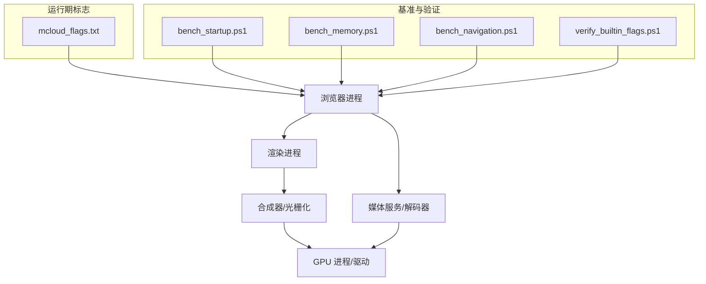
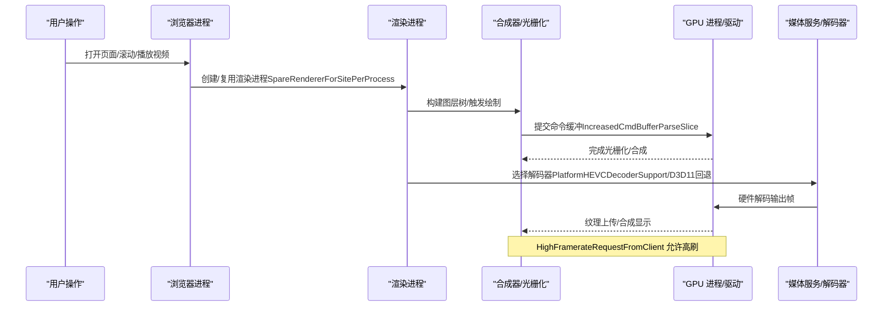
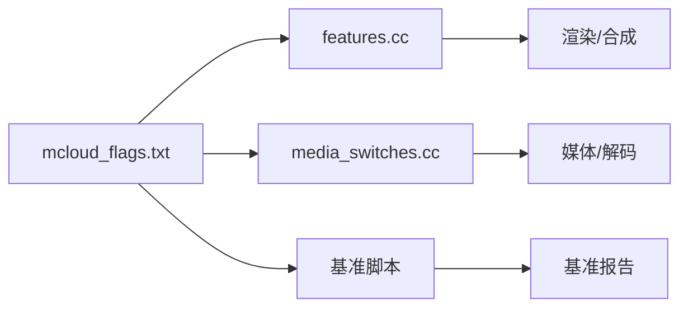

# 渲染性能分析

本文引用的文件

- [README.md](https://github.com/Mcloud136/Mcloud-Browser/blob/main/README.md)
- [mcloud_flags.txt](https://github.com/Mcloud136/Mcloud-Browser/blob/main/mcloud_flags.txt)
- [performance-optimization-design.md](https://github.com/Mcloud136/Mcloud-Browser/blob/main/docs/superpowers/specs/2026-06-19-performance-optimization-design.md)
- [M151-opt-benchmark.md](https://github.com/Mcloud136/Mcloud-Browser/blob/main/docs/dev-logs/M151-opt-benchmark.md)
- [M150-benchmark.md](https://github.com/Mcloud136/Mcloud-Browser/blob/main/docs/dev-logs/M150-benchmark.md)
- [features.cc](https://github.com/Mcloud136/Mcloud-Browser/blob/main/src/third_party/blink/common/features.cc)
- [media_switches.cc](https://github.com/Mcloud136/Mcloud-Browser/blob/main/src/media/base/media_switches.cc)
- [DEBUGGING.md](https://github.com/Mcloud136/Mcloud-Browser/blob/main/infra/DEBUG/DEBUGGING.md)
- [bench_startup.ps1](https://github.com/Mcloud136/Mcloud-Browser/blob/main/benchmark/bench_startup.ps1)
- [bench_memory.ps1](https://github.com/Mcloud136/Mcloud-Browser/blob/main/benchmark/bench_memory.ps1)
- [bench_navigation.ps1](https://github.com/Mcloud136/Mcloud-Browser/blob/main/benchmark/bench_navigation.ps1)
- [verify_builtin_flags.ps1](https://github.com/Mcloud136/Mcloud-Browser/blob/main/benchmark/tools/verify_builtin_flags.ps1)

## 目录
1. [简介](#简介)
2. [项目结构](#项目结构)
3. [核心组件](#核心组件)
4. [架构总览](#架构总览)
5. [详细组件分析](#详细组件分析)
6. [依赖关系分析](#依赖关系分析)
7. [性能考量](#性能考量)
8. [故障排查指南](#故障排查指南)
9. [结论](#结论)
10. [附录](#附录)

## 简介
本文件面向网页渲染性能分析与调优，围绕帧率分析、重绘/重排检测、GPU 加速与硬件解码优化展开，结合本项目在 Chromium M151 上的运行时标志与基准体系，给出可复现的优化策略与实操方法。内容覆盖：
- 使用 Chrome DevTools Performance 面板进行帧级分析（主线程阻塞、过度绘制、布局抖动等）
- 识别并定位渲染瓶颈的方法论
- GPU 加速配置与硬件解码链路调优
- 基于仓库内 flags 与基准脚本的验证流程

## 项目结构
本项目围绕“编译期优化 + 运行期标志 + 基准验证”的闭环构建渲染性能能力：
- 运行期标志集中管理于 mcloud_flags.txt，涵盖启动预热、内存回收、多线程、媒体与 GPU 渲染等
- 设计文档 performance-optimization-design.md 对各项标志的作用与来源进行说明
- 基准工具位于 benchmark/，提供冷启动、内存、导航等指标采集与对比
- 源码中 features 与 media switches 定义渲染与媒体相关能力的开关

图表来源
- [mcloud_flags.txt:1-120](https://github.com/Mcloud136/Mcloud-Browser/blob/main/mcloud_flags.txt#L1-L120)
- [bench_startup.ps1](https://github.com/Mcloud136/Mcloud-Browser/blob/main/benchmark/bench_startup.ps1)
- [bench_memory.ps1](https://github.com/Mcloud136/Mcloud-Browser/blob/main/benchmark/bench_memory.ps1)
- [bench_navigation.ps1](https://github.com/Mcloud136/Mcloud-Browser/blob/main/benchmark/bench_navigation.ps1)
- [verify_builtin_flags.ps1](https://github.com/Mcloud136/Mcloud-Browser/blob/main/benchmark/tools/verify_builtin_flags.ps1)

章节来源
- [README.md:61-177](https://github.com/Mcloud136/Mcloud-Browser/blob/main/README.md#L61-L177)
- [mcloud_flags.txt:1-120](https://github.com/Mcloud136/Mcloud-Browser/blob/main/mcloud_flags.txt#L1-L120)
- [performance-optimization-design.md:25-121](https://github.com/Mcloud136/Mcloud-Browser/blob/main/docs/superpowers/specs/2026-06-19-performance-optimization-design.md#L25-L121)

## 核心组件
- 运行期标志体系：通过 --enable-features/--disable-features 控制渲染、媒体、多线程、内存回收等行为，配合 V8 脚本执行阈值调整，提升页面加载与交互响应
- GPU/合成路径：启用 GPU 光栅化、命令缓冲区切片增大、着色器预编译、资源池复用、高帧率请求等，减少卡顿与切换开销
- 媒体/解码路径：平台 HEVC 支持、AV1 安全解密、专用媒体线程、批量读取、零拷贝捕获等，降低 CPU 占用并提升播放流畅度
- 基准与验证：冷启动、内存驻留、导航响应等指标采集，以及内置标志注入校验，确保优化项生效且可复现

章节来源
- [mcloud_flags.txt:8-119](https://github.com/Mcloud136/Mcloud-Browser/blob/main/mcloud_flags.txt#L8-L119)
- [performance-optimization-design.md:69-121](https://github.com/Mcloud136/Mcloud-Browser/blob/main/docs/superpowers/specs/2026-06-19-performance-optimization-design.md#L69-L121)
- [media_switches.cc:742-776](https://github.com/Mcloud136/Mcloud-Browser/blob/main/src/media/base/media_switches.cc#L742-L776)
- [media_switches.cc:1364-1391](https://github.com/Mcloud136/Mcloud-Browser/blob/main/src/media/base/media_switches.cc#L1364-L1391)

## 架构总览
下图展示从浏览器进程到 GPU/媒体解码的关键路径，以及与运行期标志和基准工具的关联。

图表来源
- [mcloud_flags.txt:8-119](https://github.com/Mcloud136/Mcloud-Browser/blob/main/mcloud_flags.txt#L8-L119)
- [features.cc:586-650](https://github.com/Mcloud136/Mcloud-Browser/blob/main/src/third_party/blink/common/features.cc#L586-L650)
- [media_switches.cc:742-776](https://github.com/Mcloud136/Mcloud-Browser/blob/main/src/media/base/media_switches.cc#L742-L776)
- [media_switches.cc:1364-1391](https://github.com/Mcloud136/Mcloud-Browser/blob/main/src/media/base/media_switches.cc#L1364-L1391)

## 详细组件分析

### 帧率分析与主线程阻塞定位（Chrome DevTools Performance）
- 录制目标：页面交互关键路径（首屏、滚动、动画、视频播放）
- 关键视图：
  - 时间线：观察长任务（>50ms）、掉帧（低于目标帧率）、主线程空闲占比
  - 火焰图：定位耗时函数（JS 执行、布局/绘制、网络/IO）
  - 事件：输入事件、定时器、宏任务/微任务调度
- 常见问题：
  - 主线程阻塞：长任务导致掉帧，需拆分任务或异步化
  - 过度绘制：多层透明叠加、复杂阴影/模糊
  - 布局抖动：频繁读写几何属性引发强制同步布局
- 在本项目中的配合：
  - 通过 bench_startup.ps1 采集冷启动，结合 Performance 查看首帧合成耗时
  - 通过 verify_builtin_flags.ps1 确认运行期标志已注入，避免无效优化干扰分析

章节来源
- [bench_startup.ps1](https://github.com/Mcloud136/Mcloud-Browser/blob/main/benchmark/bench_startup.ps1)
- [verify_builtin_flags.ps1](https://github.com/Mcloud136/Mcloud-Browser/blob/main/benchmark/tools/verify_builtin_flags.ps1)

### 重绘/重排检测与布局抖动治理
- 检测方法：
  - DevTools Rendering 面板开启“层边界”“绘制闪烁”，观察重绘/重排区域
  - 使用 Timeline 记录 Layout/Style/Paint 阶段，统计耗时与次数
- 治理策略：
  - 合并 DOM 变更，批量更新样式，避免逐元素修改
  - 使用 transform/opacity 实现动画，减少布局计算
  - 避免在高频回调中读取 layout 属性（如 offsetHeight），改用 requestAnimationFrame 批处理
- 与项目标志协同：
  - ThrottleUnimportantFrameRate 降低非重要帧刷新频率，缓解布局压力
  - DirectComposition 提升合成效率，减少重绘成本

章节来源
- [mcloud_flags.txt:21-26](https://github.com/Mcloud136/Mcloud-Browser/blob/main/mcloud_flags.txt#L21-L26)
- [features.cc:2356-2415](https://github.com/Mcloud136/Mcloud-Browser/blob/main/src/third_party/blink/common/features.cc#L2356-L2415)

### GPU 加速与合成路径优化
- 关键标志：
  - GPU 光栅化、Canvas OOP 光栅化、DirectComposition
  - IncreasedCmdBufferParseSlice、SkiaGraphitePrecompilation、ResourcePoolPreferExactSizeReuse
  - HighFramerateRequestFromClient 允许高刷显示器
- 效果：
  - 减少上下文切换与着色器编译卡顿
  - 提高命令缓冲吞吐与资源复用率
  - 在高刷场景下保持更平滑的帧率
- 验证方式：
  - 使用 Performance 面板观察 GPU 任务条与合成时间
  - 通过 bench_navigation.ps1 评估页面滚动/动画流畅度

章节来源
- [mcloud_flags.txt:16-26](https://github.com/Mcloud136/Mcloud-Browser/blob/main/mcloud_flags.txt#L16-L26)
- [mcloud_flags.txt:90-96](https://github.com/Mcloud136/Mcloud-Browser/blob/main/mcloud_flags.txt#L90-L96)
- [performance-optimization-design.md:111-121](https://github.com/Mcloud136/Mcloud-Browser/blob/main/docs/superpowers/specs/2026-06-19-performance-optimization-design.md#L111-L121)

### 硬件解码与媒体路径调优
- 关键标志：
  - PlatformHEVCDecoderSupport、HardwareSecureDecryptionAv1
  - DedicatedMediaServiceThread、MediaFoundationBatchRead、MediaFoundationD3D11VideoCaptureZeroCopy
  - ReduceHardwareVideoDecoderBuffers 降低硬解缓冲占用
  - D3D12VideoDecoder 在特定核显驱动问题下默认禁用，回退至 D3D11
- 工作流：
  - 媒体服务选择解码器，优先尝试 D3D12，失败回退 D3D11
  - 使用零拷贝捕获与批量读取减少内存拷贝
- 验证方式：
  - 使用 Media 面板观察解码器类型与帧率
  - 通过 bench_navigation.ps1 与视频站点实测（B站/YouTube）评估流畅度

章节来源
- [mcloud_flags.txt:78-105](https://github.com/Mcloud136/Mcloud-Browser/blob/main/mcloud_flags.txt#L78-L105)
- [media_switches.cc:742-776](https://github.com/Mcloud136/Mcloud-Browser/blob/main/src/media/base/media_switches.cc#L742-L776)
- [media_switches.cc:1364-1391](https://github.com/Mcloud136/Mcloud-Browser/blob/main/src/media/base/media_switches.cc#L1364-L1391)
- [performance-optimization-design.md:100-121](https://github.com/Mcloud136/Mcloud-Browser/blob/main/docs/superpowers/specs/2026-06-19-performance-optimization-design.md#L100-L121)

### 内存与标签页冻结对渲染稳定性的影响
- 关键标志：
  - InfiniteTabsFreezing、InfiniteTabsFreezingOnMemoryPressure
  - DiscardOnCommitLimit、SustainedPMUrgentDiscarding
  - PartitionAlloc 系列优化（排序活跃槽、优先级继承锁、降低非主渲染器限制）
  - ReclaimOldPrepaintTiles、PruneOldTransferCacheEntries
- 效果：
  - 多标签场景下降低内存峰值，避免 OOM 导致的卡顿
  - 及时回收瓦片与传输缓存，减少内存碎片
- 验证方式：
  - 使用 bench_memory.ps1 采集 50 标签驻留内存
  - 结合 Task Manager 观察各进程内存变化

章节来源
- [mcloud_flags.txt:27-39](https://github.com/Mcloud136/Mcloud-Browser/blob/main/mcloud_flags.txt#L27-L39)
- [performance-optimization-design.md:78-89](https://github.com/Mcloud136/Mcloud-Browser/blob/main/docs/superpowers/specs/2026-06-19-performance-optimization-design.md#L78-L89)

### 启动预热与预连接对首帧的影响
- 关键标志：
  - SendGPUChannelEarly、DeferSpeculativeRFHCreation、InitialWebUI
  - Prerender2WarmUpCompositorForNewTabPage/BookmarkBar
  - LoadingPreconnectToRedirectTarget、PreloadTopChromeWebUI、BookmarkTriggerForPreconnect
- 效果：
  - 提前建立 GPU 通道与预热合成器，缩短首帧时间
  - 预连接与预渲染命中时提升导航速度（以数据为准）
- 验证方式：
  - 使用 bench_startup.ps1 采集冷启动中位数
  - 使用 bench_navigation.ps1 对比预载开/关的差异

章节来源
- [mcloud_flags.txt:8-15](https://github.com/Mcloud136/Mcloud-Browser/blob/main/mcloud_flags.txt#L8-L15)
- [mcloud_flags.txt:59-67](https://github.com/Mcloud136/Mcloud-Browser/blob/main/mcloud_flags.txt#L59-L67)
- [M151-opt-benchmark.md:34-60](https://github.com/Mcloud136/Mcloud-Browser/blob/main/docs/dev-logs/M151-opt-benchmark.md#L34-L60)

## 依赖关系分析
- 运行期标志与源码 feature 的对应关系：
  - 渲染/合成：features.cc 中定义的节流、初始化、GPU 通道等特性
  - 媒体/解码：media_switches.cc 中定义的硬件解码、零拷贝、专用线程等特性
- 基准工具与标志的联动：
  - verify_builtin_flags.ps1 验证标志注入
  - bench_startup.ps1/bench_memory.ps1/bench_navigation.ps1 采集 K1/K2/K3-K6 指标

图表来源
- [mcloud_flags.txt:1-120](https://github.com/Mcloud136/Mcloud-Browser/blob/main/mcloud_flags.txt#L1-L120)
- [features.cc:586-650](https://github.com/Mcloud136/Mcloud-Browser/blob/main/src/third_party/blink/common/features.cc#L586-L650)
- [features.cc:2356-2415](https://github.com/Mcloud136/Mcloud-Browser/blob/main/src/third_party/blink/common/features.cc#L2356-L2415)
- [media_switches.cc:742-776](https://github.com/Mcloud136/Mcloud-Browser/blob/main/src/media/base/media_switches.cc#L742-L776)
- [media_switches.cc:1364-1391](https://github.com/Mcloud136/Mcloud-Browser/blob/main/src/media/base/media_switches.cc#L1364-L1391)

章节来源
- [mcloud_flags.txt:1-120](https://github.com/Mcloud136/Mcloud-Browser/blob/main/mcloud_flags.txt#L1-L120)
- [performance-optimization-design.md:69-121](https://github.com/Mcloud136/Mcloud-Browser/blob/main/docs/superpowers/specs/2026-06-19-performance-optimization-design.md#L69-L121)

## 性能考量
- 帧率目标：根据显示器刷新率设定目标（60/120/144Hz），HighFramerateRequestFromClient 允许更高帧率请求
- 主线程健康：长任务应控制在 16ms 以内（60Hz），避免掉帧；使用 Web Workers 或分片任务
- 绘制成本：减少透明度叠加、复杂滤镜；使用 will-change 提示合成层
- 布局抖动：批量 DOM 更新，避免在高频回调中读取几何属性
- 媒体解码：优先硬件解码，必要时回退软解；监控解码器类型与帧率
- 内存管理：启用标签页冻结与紧急回收，避免 OOM 导致的卡顿

[本节为通用指导，不直接分析具体文件]

## 故障排查指南
- 多进程调试：
  - 使用 --renderer-cmd-prefix 将渲染进程接入调试器
  - 使用 --gpu-launcher 调试 GPU 子进程
  - 使用 rr 进行时间旅行调试，定位布局/绘制问题
- 日志与 IPC：
  - 启用 CHROME_IPC_LOGGING 查看 IPC 消息
  - 使用 --log-level=0 与 --enable-logging=stderr 输出详细日志
- 崩溃与冻结：
  - 生成 core/minidump 进行分析
  - 针对冻结场景，发送 SIGABRT 触发堆栈收集

章节来源
- [DEBUGGING.md:43-171](https://github.com/Mcloud136/Mcloud-Browser/blob/main/infra/DEBUG/DEBUGGING.md#L43-L171)
- [DEBUGGING.md:256-312](https://github.com/Mcloud136/Mcloud-Browser/blob/main/infra/DEBUG/DEBUGGING.md#L256-L312)
- [DEBUGGING.md:463-487](https://github.com/Mcloud136/Mcloud-Browser/blob/main/infra/DEBUG/DEBUGGING.md#L463-L487)

## 结论
- 通过运行期标志体系与基准工具，本项目实现了从启动、加载、渲染到媒体解码的全链路优化
- 帧率分析与重绘/重排检测是定位渲染瓶颈的核心手段，结合 GPU 加速与硬件解码可显著提升流畅度
- 建议在真实站点与物理 GPU 环境下复测 K3-K6 指标，持续验证优化收益与稳定性

[本节为总结性内容，不直接分析具体文件]

## 附录
- 常用基准命令参考：
  - 冷启动：benchmark/bench_startup.ps1
  - 内存：benchmark/bench_memory.ps1
  - 导航：benchmark/bench_navigation.ps1
  - 标志注入验证：benchmark/tools/verify_builtin_flags.ps1
- 基准报告参考：
  - M151-opt 基准：docs/dev-logs/M151-opt-benchmark.md
  - M150 基线：docs/dev-logs/M150-benchmark.md

章节来源
- [bench_startup.ps1](https://github.com/Mcloud136/Mcloud-Browser/blob/main/benchmark/bench_startup.ps1)
- [bench_memory.ps1](https://github.com/Mcloud136/Mcloud-Browser/blob/main/benchmark/bench_memory.ps1)
- [bench_navigation.ps1](https://github.com/Mcloud136/Mcloud-Browser/blob/main/benchmark/bench_navigation.ps1)
- [verify_builtin_flags.ps1](https://github.com/Mcloud136/Mcloud-Browser/blob/main/benchmark/tools/verify_builtin_flags.ps1)
- [M151-opt-benchmark.md:19-77](https://github.com/Mcloud136/Mcloud-Browser/blob/main/docs/dev-logs/M151-opt-benchmark.md#L19-L77)
- [M150-benchmark.md:28-49](https://github.com/Mcloud136/Mcloud-Browser/blob/main/docs/dev-logs/M150-benchmark.md#L28-L49)