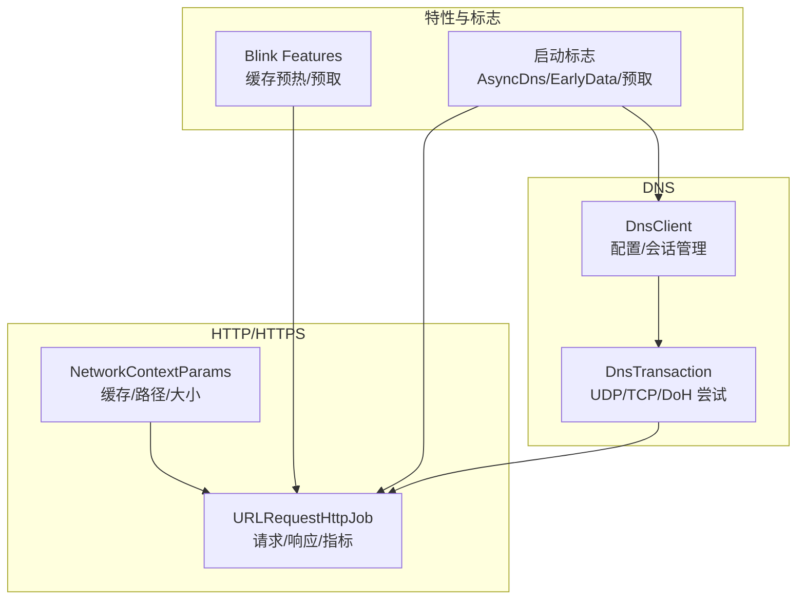
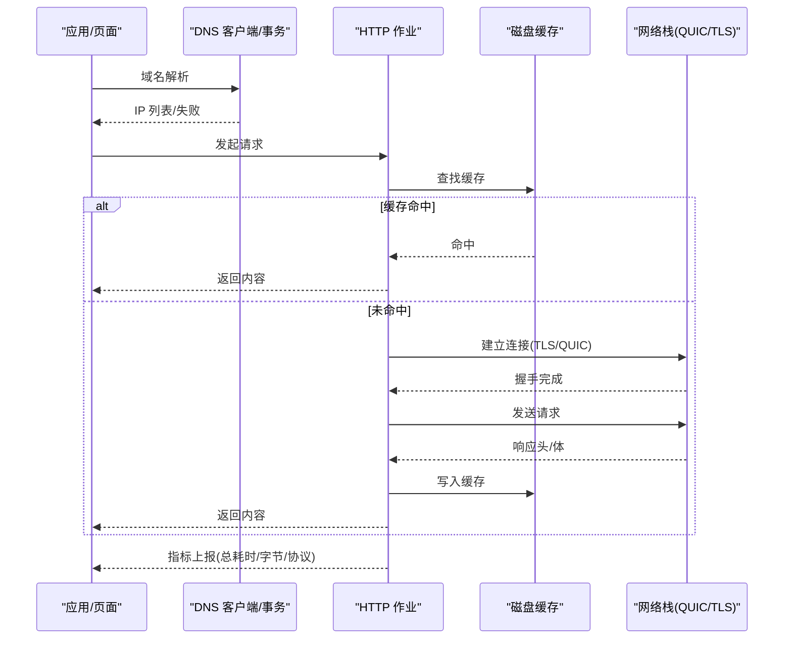
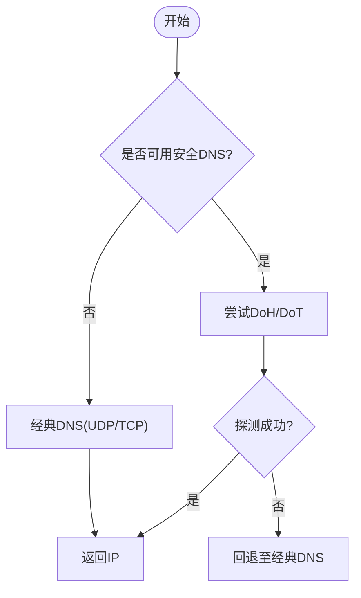
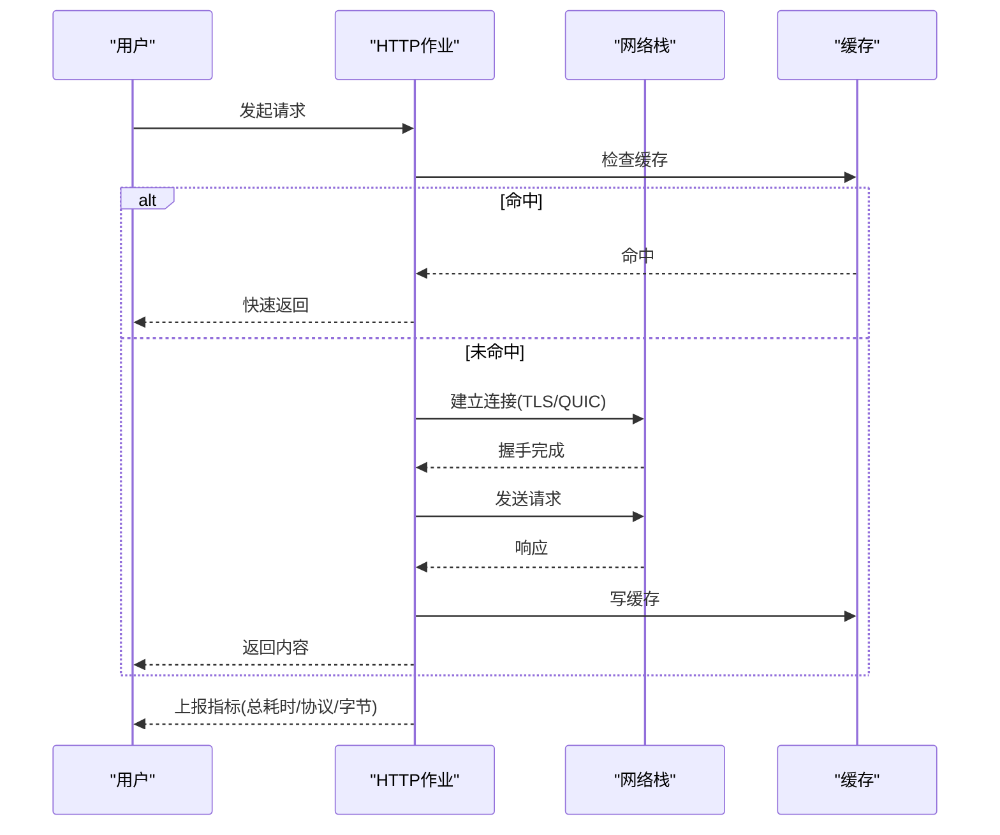
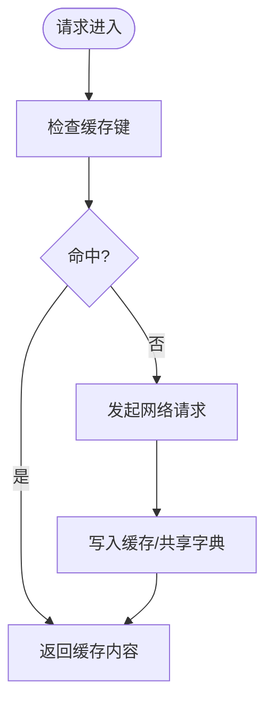

# 网络性能分析

<cite>
**本文引用的文件**
- [dns_client.cc](file://src/net/dns/dns_client.cc)
- [dns_transaction.cc](file://src/net/dns/dns_transaction.cc)
- [profile_network_context_service.cc](file://src/chrome/browser/net/profile_network_context_service.cc)
- [url_request_http_job.cc](file://src/net/url_request/url_request_http_job.cc)
- [features.cc](file://src/third_party/blink/common/features.cc)
- [README.md](file://README.md)
- [performance-optimization-design.md](file://docs/superpowers/specs/2026-06-19-performance-optimization-design.md)
- [performance-optimization.md](file://docs/superpowers/plans/2026-06-19-performance-optimization.md)
- [release-notes-m150.md](file://docs/superpowers/specs/2026-06-20-release-notes-m150.md)
- [m149-to-m150-upgrade-report.md](file://docs/superpowers/specs/2026-06-20-m149-to-m150-upgrade-report.md)
</cite>

## 目录
1. [简介](#简介)
2. [项目结构](#项目结构)
3. [核心组件](#核心组件)
4. [架构总览](#架构总览)
5. [详细组件分析](#详细组件分析)
6. [依赖关系分析](#依赖关系分析)
7. [性能考量](#性能考量)
8. [故障排查指南](#故障排查指南)
9. [结论](#结论)
10. [附录](#附录)

## 简介
本文件面向“网络请求性能分析方法”的落地实践，结合仓库中的 DNS、HTTP/HTTPS、缓存与指标采集实现，系统阐述：
- HTTP/HTTPS 连接优化（TLS 握手、QUIC/HTTP/3、连接复用）
- DNS 解析性能调优（异步 DNS、DoH/DoT、回退策略）
- 缓存策略分析（磁盘缓存、预取预热、BackForwardCache）
- 使用内置指标与工具识别瓶颈（连接建立时间、首字节时间、传输速率）
- 可操作的配置项与最佳实践

## 项目结构
围绕网络性能的关键代码集中在以下模块：
- DNS 子系统：DNS 客户端、事务处理、DoH/DoT 支持、回退策略
- 网络上下文与缓存：Profile 级网络上下文参数、HTTP 磁盘缓存路径与大小、共享字典缓存
- HTTP 作业层：请求生命周期、指标记录（总耗时、缓存命中、QUIC/TLS1.3 细分）、数据量统计
- 功能开关与启动标志：异步 DNS、EarlyData、预取/预连接、缓存预热等

图表来源
- [dns_client.cc:148-399](file://src/net/dns/dns_client.cc#L148-L399)
- [dns_transaction.cc:151-800](file://src/net/dns/dns_transaction.cc#L151-L800)
- [profile_network_context_service.cc:1324-1438](file://src/chrome/browser/net/profile_network_context_service.cc#L1324-L1438)
- [url_request_http_job.cc:1958-2133](file://src/net/url_request/url_request_http_job.cc#L1958-L2133)
- [features.cc:1440-1496](file://src/third_party/blink/common/features.cc#L1440-L1496)

章节来源
- [dns_client.cc:148-399](file://src/net/dns/dns_client.cc#L148-L399)
- [dns_transaction.cc:151-800](file://src/net/dns/dns_transaction.cc#L151-L800)
- [profile_network_context_service.cc:1324-1438](file://src/chrome/browser/net/profile_network_context_service.cc#L1324-L1438)
- [url_request_http_job.cc:1958-2133](file://src/net/url_request/url_request_http_job.cc#L1958-L2133)
- [features.cc:1440-1496](file://src/third_party/blink/common/features.cc#L1440-L1496)

## 核心组件
- DNS 客户端与会话：负责系统配置合并、DoH 升级、安全/非安全模式选择、地址排序与事务工厂创建。
- DNS 事务：封装 UDP/TCP/DoH 三种尝试，统一错误码与 NetLog 事件，支持探测序列与回退。
- HTTP 作业：记录总耗时、缓存命中、发送/接收字节、QUIC/TLS1.3 细分指标，支撑性能分析。
- 网络上下文与缓存：启用并配置 HTTP 磁盘缓存路径与大小，以及共享字典缓存；支持迁移与持久化文件。
- 功能开关与启动标志：提供异步 DNS、EarlyData、预取/预连接、缓存预热等运行时能力。

章节来源
- [dns_client.cc:148-399](file://src/net/dns/dns_client.cc#L148-L399)
- [dns_transaction.cc:151-800](file://src/net/dns/dns_transaction.cc#L151-L800)
- [profile_network_context_service.cc:1324-1438](file://src/chrome/browser/net/profile_network_context_service.cc#L1324-L1438)
- [url_request_http_job.cc:1958-2133](file://src/net/url_request/url_request_http_job.cc#L1958-L2133)
- [features.cc:1440-1496](file://src/third_party/blink/common/features.cc#L1440-L1496)

## 架构总览
下图展示一次典型网页加载的网络路径：从 DNS 解析到 HTTP/HTTPS 请求，再到缓存命中与指标上报。

图表来源
- [dns_client.cc:148-399](file://src/net/dns/dns_client.cc#L148-L399)
- [dns_transaction.cc:151-800](file://src/net/dns/dns_transaction.cc#L151-L800)
- [url_request_http_job.cc:1958-2133](file://src/net/url_request/url_request_http_job.cc#L1958-L2133)
- [profile_network_context_service.cc:1324-1438](file://src/chrome/browser/net/profile_network_context_service.cc#L1324-L1438)

## 详细组件分析

### DNS 解析性能调优
- 关键能力
  - 安全/非安全模式判断与 DoH 升级：根据系统配置与策略决定是否启用 DoH/DoT，并在不满足条件时回退。
  - 多通道尝试：UDP/TCP/DoH 并行或顺序尝试，提升成功率与速度。
  - 探测序列与回退：对 DoH 服务器进行探测，失败时记录并调整后续行为。
- 指标与日志
  - 通过 NetLog 事件记录查询开始、尝试类型、响应结果与错误码。
  - 通过 UMA 直方图记录升级成功/失败、本地名称服务器状态等。
- 建议
  - 优先启用异步 DNS，减少阻塞。
  - 合理配置 DoH 服务器与回退策略，避免单点故障。
  - 关注 UDP 超时与 TCP/DoH 回退时机，平衡延迟与可靠性。

图表来源
- [dns_client.cc:70-146](file://src/net/dns/dns_client.cc#L70-L146)
- [dns_transaction.cc:151-800](file://src/net/dns/dns_transaction.cc#L151-L800)

章节来源
- [dns_client.cc:70-146](file://src/net/dns/dns_client.cc#L70-L146)
- [dns_transaction.cc:151-800](file://src/net/dns/dns_transaction.cc#L151-L800)

### HTTP/HTTPS 连接优化
- 关键能力
  - QUIC/HTTP/3 与 TLS 1.3 Early Data：在合适场景下降低握手延迟。
  - 连接复用与代理链：支持 IP 保护链路与直接回退。
  - 缓存命中分支：区分缓存命中与网络访问，分别统计耗时与数据量。
- 指标与日志
  - 总耗时、成功/取消分类、按优先级分桶。
  - 发送/接收字节、预过滤读取字节、缓存命中/未命中耗时。
  - QUIC/TLS1.3 Google 站点专用指标，便于定位问题。
- 建议
  - 开启 EarlyData（谨慎评估幂等性）。
  - 利用连接复用与预连接，减少重复握手。
  - 监控 QUIC 回退比例，必要时调整拥塞控制或路由。

图表来源
- [url_request_http_job.cc:1958-2133](file://src/net/url_request/url_request_http_job.cc#L1958-L2133)

章节来源
- [url_request_http_job.cc:1958-2133](file://src/net/url_request/url_request_http_job.cc#L1958-L2133)

### 缓存策略分析
- 关键能力
  - 始终启用 HTTP 磁盘缓存，并可配置路径与最大容量。
  - 共享字典缓存与网络数据持久化文件。
  - 缓存预热与预取：基于导航/指针交互触发，滑动窗口与历史大小可调。
- 建议
  - 为高流量站点设置合理的磁盘缓存上限，避免磁盘压力。
  - 启用缓存预热以减少冷启动时的网络开销。
  - 结合 BackForwardCache 与 NoStore 策略，提升二次访问体验。

图表来源
- [profile_network_context_service.cc:1324-1438](file://src/chrome/browser/net/profile_network_context_service.cc#L1324-L1438)
- [features.cc:1440-1496](file://src/third_party/blink/common/features.cc#L1440-L1496)

章节来源
- [profile_network_context_service.cc:1324-1438](file://src/chrome/browser/net/profile_network_context_service.cc#L1324-L1438)
- [features.cc:1440-1496](file://src/third_party/blink/common/features.cc#L1440-L1496)

### 性能监控与指标体系
- 指标维度
  - DNS：升级成功/失败、本地名称服务器状态、探测序列耗时。
  - HTTP：总耗时、缓存命中/未命中、发送/接收字节、QUIC/TLS1.3 细分。
- 采集位置
  - DNS 层：事务与尝试的生命周期事件与直方图。
  - HTTP 层：作业完成时集中上报，覆盖成功/取消/缓存分支。
- 使用建议
  - 以 NetLog 抓取完整链路，结合 UMA 直方图做趋势分析。
  - 针对 QUIC/TLS1.3 与缓存命中两类场景分别建模基线。

章节来源
- [dns_client.cc:70-146](file://src/net/dns/dns_client.cc#L70-L146)
- [dns_transaction.cc:1145-1180](file://src/net/dns/dns_transaction.cc#L1145-L1180)
- [url_request_http_job.cc:1958-2133](file://src/net/url_request/url_request_http_job.cc#L1958-L2133)

## 依赖关系分析
- DNS 与 HTTP 的耦合点
  - DNS 解析结果作为 HTTP 连接的目的地；DoH 本身通过 HTTPS 请求承载 DNS 报文。
  - 当 DoH 不可用时，回退至经典 DNS，影响整体首包时间。
- 缓存与网络栈
  - 网络上下文参数决定缓存路径与大小，直接影响命中率与 I/O 压力。
  - 预热与预取依赖导航/交互事件，需与渲染管线协同。
- 指标与诊断
  - 指标贯穿 DNS、HTTP、网络栈各层，便于端到端归因。

图表来源
- [dns_client.cc:148-399](file://src/net/dns/dns_client.cc#L148-L399)
- [url_request_http_job.cc:1958-2133](file://src/net/url_request/url_request_http_job.cc#L1958-L2133)
- [profile_network_context_service.cc:1324-1438](file://src/chrome/browser/net/profile_network_context_service.cc#L1324-L1438)

章节来源
- [dns_client.cc:148-399](file://src/net/dns/dns_client.cc#L148-L399)
- [url_request_http_job.cc:1958-2133](file://src/net/url_request/url_request_http_job.cc#L1958-L2133)
- [profile_network_context_service.cc:1324-1438](file://src/chrome/browser/net/profile_network_context_service.cc#L1324-L1438)

## 性能考量
- 连接建立时间
  - 优先启用 QUIC/HTTP/3 与 TLS 1.3 Early Data，减少握手往返。
  - 合理使用预连接与预取，提前建立连接。
- 首字节时间（TTFB）
  - 提高缓存命中率，减少网络往返。
  - 优化 DNS 解析路径，避免不必要的回退。
- 数据传输速率
  - 监控发送/接收字节分布，识别大对象与慢连接。
  - 结合压缩与流式传输，降低带宽占用。
- 资源权衡
  - 预热/预取以内存/磁盘换取速度，需评估业务场景。
  - QUIC 回退可能带来额外开销，需结合网络质量动态调整。

[本节为通用指导，无需特定文件引用]

## 故障排查指南
- 常见问题定位
  - DNS 解析失败或延迟高：检查 DoH 探测与回退逻辑，确认本地名称服务器状态。
  - HTTP 请求卡顿：查看总耗时与缓存命中情况，区分网络与缓存问题。
  - QUIC 不稳定：观察 QUIC 相关指标与回退比例，必要时切换 TCP。
- 工具与步骤
  - 使用 NetLog 捕获 DNS/HTTP 全链路事件，定位具体阶段。
  - 结合 UMA 直方图（如 Net.HttpJob.*、Net.DNS.*）进行趋势对比。
  - 调整启动标志（如 AsyncDns、EarlyData、预取/预热）后复测。

章节来源
- [dns_client.cc:70-146](file://src/net/dns/dns_client.cc#L70-L146)
- [dns_transaction.cc:1145-1180](file://src/net/dns/dns_transaction.cc#L1145-L1180)
- [url_request_http_job.cc:1958-2133](file://src/net/url_request/url_request_http_job.cc#L1958-L2133)

## 结论
本项目在网络性能方面具备完善的底层能力与丰富的指标体系：
- DNS 层支持安全/非安全模式与多通道尝试，具备探测与回退机制。
- HTTP/HTTPS 层提供 QUIC/TLS1.3 优化、连接复用与缓存命中分支指标。
- 缓存层支持磁盘缓存、共享字典与预热/预取，可显著改善冷启动与重复访问。
- 通过 NetLog 与 UMA 指标，可精准定位瓶颈并制定优化策略。

[本节为总结，无需特定文件引用]

## 附录

### 可启用的网络相关标志与特性
- 启动标志（示例）
  - AsyncDns：异步 DNS 解析，降低阻塞。
  - EarlyData：TLS 1.3 早期数据，降低握手延迟。
  - 预取/预连接：书签与新标签页触发预取，提升首屏速度。
- 功能特性（示例）
  - HttpDiskCachePrewarming：HTTP 磁盘缓存预热，含 URL 长度、历史大小、滑动窗口等参数。
  - BackForwardCache：页面瞬间恢复，配合 NoStore 策略扩大适用范围。

章节来源
- [README.md:98-178](file://README.md#L98-L178)
- [performance-optimization-design.md:78-98](file://docs/superpowers/specs/2026-06-19-performance-optimization-design.md#L78-L98)
- [performance-optimization.md:82-89](file://docs/superpowers/plans/2026-06-19-performance-optimization.md#L82-L89)
- [features.cc:1440-1496](file://src/third_party/blink/common/features.cc#L1440-L1496)

### 版本与修复要点
- M150 网络性能改进
  - HTTP/3（QUIC）连接优化、连接复用策略改进、DNS 解析缓存优化。
- M149→M150 修复
  - 解决 HTTP 断流问题：将 DNS-over-HTTPS 默认模式由严格改为自动，确保 DoH 失败时回退普通 DNS。

章节来源
- [release-notes-m150.md:89-93](file://docs/superpowers/specs/2026-06-20-release-notes-m150.md#L89-L93)
- [m149-to-m150-upgrade-report.md:98-106](file://docs/superpowers/specs/2026-06-20-m149-to-m150-upgrade-report.md#L98-L106)