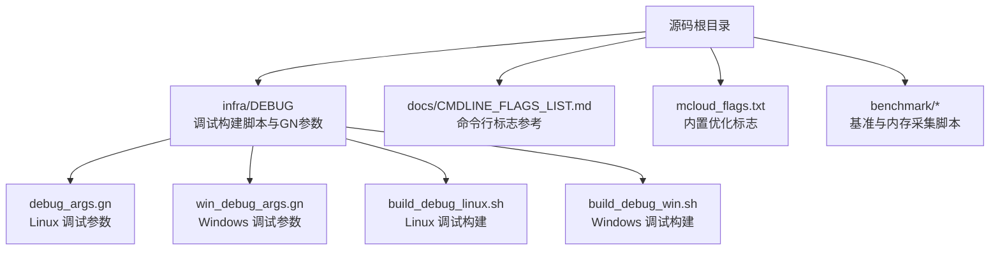
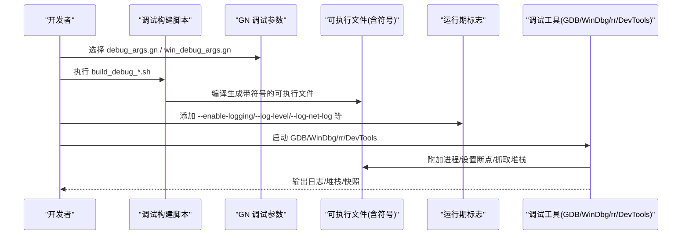
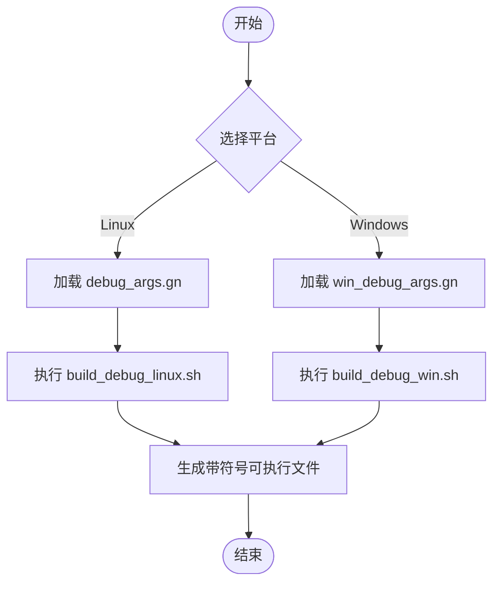
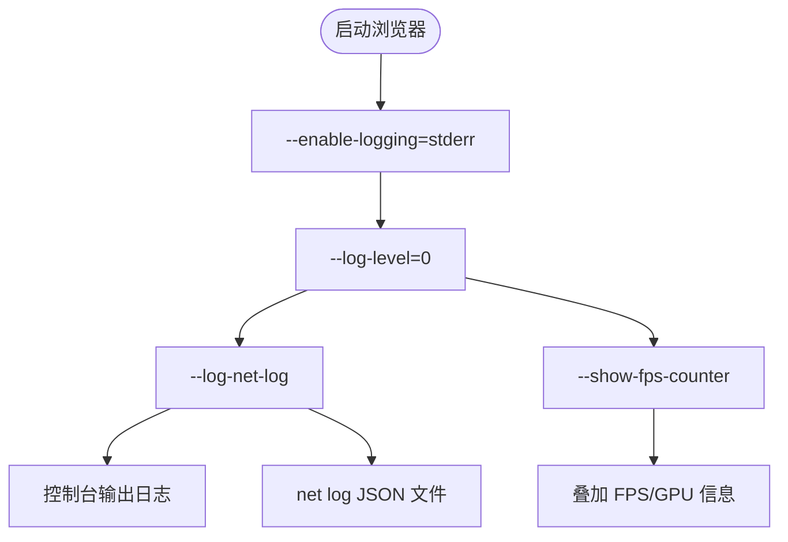
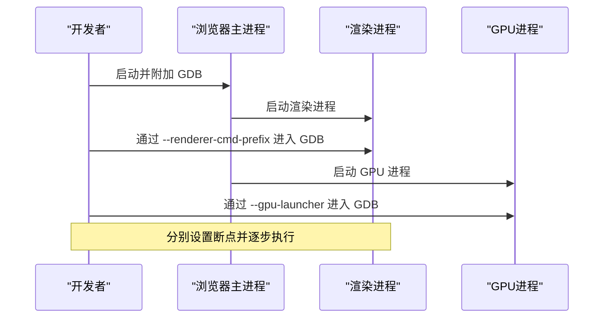
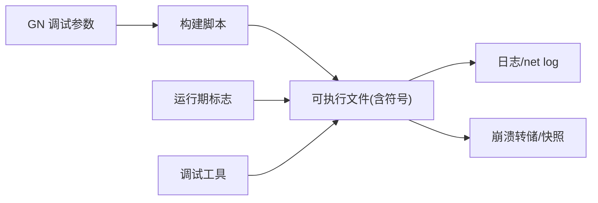

# 调试指南

<cite>
**本文引用的文件**
- [README.md](file://README.md)
- [DEBUGGING.md](file://infra/DEBUG/DEBUGGING.md)
- [debug_args.gn](file://infra/DEBUG/debug_args.gn)
- [win_debug_args.gn](file://infra/DEBUG/win_debug_args.gn)
- [build_debug_linux.sh](file://infra/DEBUG/build_debug_linux.sh)
- [build_debug_win.sh](file://infra/DEBUG/build_debug_win.sh)
- [DEBUG_SHELL_README.md](file://infra/DEBUG/DEBUG_SHELL_README.md)
- [CMDLINE_FLAGS_LIST.md](file://docs/CMDLINE_FLAGS_LIST.md)
- [mcloud_flags.txt](file://mcloud_flags.txt)
- [bench_memory.ps1](file://benchmark/bench_memory.ps1)
</cite>

## 目录
1. [简介](#简介)
2. [项目结构](#项目结构)
3. [核心组件](#核心组件)
4. [架构总览](#架构总览)
5. [详细组件分析](#详细组件分析)
6. [依赖关系分析](#依赖关系分析)
7. [性能注意事项](#性能注意事项)
8. [故障排查指南](#故障排查指南)
9. [结论](#结论)
10. [附录](#附录)

## 简介
本指南面向 MCloud Browser 的开发者与测试工程师，提供从搭建调试环境到高级问题定位的完整方法。内容覆盖：
- 调试符号获取与配置（GN 参数、symbol_level）
- 调试工具安装与设置（GDB、rr、WinDbg、DevTools）
- 日志收集与分析（--enable-logging、--log-level、net log）
- Windows/Linux 平台差异与特定配置
- 常用调试命令与技巧
- 内存调试、性能分析、网络请求调试等高级技术
- 调试最佳实践与问题定位方法论

## 项目结构
MCloud Browser 在仓库中提供了完善的调试基础设施，主要集中在 infra/DEBUG 目录，包含跨平台的构建脚本与 GN 参数；同时通过 docs/CMDLINE_FLAGS_LIST.md 暴露大量运行时开关，便于快速启用日志、追踪与诊断能力。

**图表来源**
- [debug_args.gn:1-87](file://infra/DEBUG/debug_args.gn#L1-L87)
- [win_debug_args.gn:1-87](file://infra/DEBUG/win_debug_args.gn#L1-L87)
- [build_debug_linux.sh:1-90](file://infra/DEBUG/build_debug_linux.sh#L1-L90)
- [build_debug_win.sh:1-73](file://infra/DEBUG/build_debug_win.sh#L1-L73)
- [CMDLINE_FLAGS_LIST.md:1204-1800](file://docs/CMDLINE_FLAGS_LIST.md#L1204-L1800)

**章节来源**
- [README.md:19-23](file://README.md#L19-L23)
- [DEBUGGING.md:1-20](file://infra/DEBUG/DEBUGGING.md#L1-L20)

## 核心组件
- 调试构建参数
  - Linux：infra/DEBUG/debug_args.gn 定义 is_debug=true、symbol_level=2、V8/Blink symbol_level 等，确保生成完整符号并关闭部分发布期优化。
  - Windows：infra/DEBUG/win_debug_args.gn 对应 Windows 调试参数，保持 symbol_level=2 与 V8 调试支持。
- 调试构建脚本
  - build_debug_linux.sh：构建 chrome/chromedriver/mcloud_shell/mcloud_ui_debug_shell 等目标，并打包 UI Debug Shell 所需资源。
  - build_debug_win.sh：在 Windows 环境下构建相同目标集，并复制必要的 DLL/PK 等资源。
- 运行期标志
  - CMDLINE_FLAGS_LIST.md：提供 --enable-logging、--log-level、--log-net-log、--show-fps-counter 等关键调试开关说明。
  - mcloud_flags.txt：内置性能相关启动标志，调试时可通过命令行覆盖或追加自定义开关。
- 内存与基准
  - benchmark/bench_memory.ps1：用于采集工作集内存，辅助定位内存增长与峰值问题。

**章节来源**
- [debug_args.gn:1-87](file://infra/DEBUG/debug_args.gn#L1-L87)
- [win_debug_args.gn:1-87](file://infra/DEBUG/win_debug_args.gn#L1-L87)
- [build_debug_linux.sh:33-89](file://infra/DEBUG/build_debug_linux.sh#L33-L89)
- [build_debug_win.sh:33-72](file://infra/DEBUG/build_debug_win.sh#L33-L72)
- [CMDLINE_FLAGS_LIST.md:1204-1800](file://docs/CMDLINE_FLAGS_LIST.md#L1204-L1800)
- [mcloud_flags.txt:1-120](file://mcloud_flags.txt#L1-L120)
- [bench_memory.ps1:62-77](file://benchmark/bench_memory.ps1#L62-L77)

## 架构总览
下图展示调试环境的整体流程：从构建阶段开启符号与调试选项，到运行阶段注入日志与追踪开关，再到使用平台调试器进行断点与堆栈分析。

**图表来源**
- [debug_args.gn:1-87](file://infra/DEBUG/debug_args.gn#L1-L87)
- [win_debug_args.gn:1-87](file://infra/DEBUG/win_debug_args.gn#L1-L87)
- [build_debug_linux.sh:33-89](file://infra/DEBUG/build_debug_linux.sh#L33-L89)
- [build_debug_win.sh:33-72](file://infra/DEBUG/build_debug_win.sh#L33-L72)
- [CMDLINE_FLAGS_LIST.md:1204-1800](file://docs/CMDLINE_FLAGS_LIST.md#L1204-L1800)

## 详细组件分析

### 调试符号与构建配置
- Linux 调试参数要点
  - is_debug=true、symbol_level=2、v8_symbol_level=2、blink_symbol_level=2，确保主进程、JS引擎与渲染层均具备完整符号。
  - exclude_unwind_tables=false 保证调用栈展开可用。
- Windows 调试参数要点
  - 同样启用 symbol_level=2 与 v8_symbol_level=2，便于 WinDbg 解析堆栈。
- 构建产物
  - 脚本会构建 chrome、chromedriver、mcloud_shell、mcloud_ui_debug_shell 等目标，便于在不同场景下调试 UI 与内核交互。

**图表来源**
- [debug_args.gn:1-87](file://infra/DEBUG/debug_args.gn#L1-L87)
- [win_debug_args.gn:1-87](file://infra/DEBUG/win_debug_args.gn#L1-L87)
- [build_debug_linux.sh:33-89](file://infra/DEBUG/build_debug_linux.sh#L33-L89)
- [build_debug_win.sh:33-72](file://infra/DEBUG/build_debug_win.sh#L33-L72)

**章节来源**
- [debug_args.gn:1-87](file://infra/DEBUG/debug_args.gn#L1-L87)
- [win_debug_args.gn:1-87](file://infra/DEBUG/win_debug_args.gn#L1-L87)
- [build_debug_linux.sh:33-89](file://infra/DEBUG/build_debug_linux.sh#L33-L89)
- [build_debug_win.sh:33-72](file://infra/DEBUG/build_debug_win.sh#L33-L72)

### 日志收集与分析
- 启用控制台日志
  - 使用 --enable-logging=stderr 将日志输出到标准错误流，配合 --log-level=0 显示 INFO 级别及以上信息。
- 网络日志
  - 使用 --log-net-log 保存 net log 事件到文件，便于后续用浏览器打开分析网络请求时序与失败原因。
- FPS 与 GPU 信息
  - 使用 --show-fps-counter 叠加帧率与 GPU 内存信息，结合 head*=1 的 vmodule 可在控制台看到更多渲染管线细节。

**图表来源**
- [CMDLINE_FLAGS_LIST.md:1204-1800](file://docs/CMDLINE_FLAGS_LIST.md#L1204-L1800)

**章节来源**
- [CMDLINE_FLAGS_LIST.md:1204-1800](file://docs/CMDLINE_FLAGS_LIST.md#L1204-L1800)

### 多进程调试（Linux）
- 沙箱与附加限制
  - 默认沙箱会阻止调试器附加，必要时临时使用 --no-sandbox 或 --allow-sandbox-debugging。
- 渲染进程调试
  - 使用 --renderer-cmd-prefix 将渲染进程包装进 gdb，便于单独调试 Blink/页面逻辑。
- GPU 进程调试
  - 使用 --gpu-launcher 类似方式附加 GPU 子进程。
- 单进程模式
  - 使用 --single-process 将渲染线程合并到主进程，简化调试流程（注意某些功能受限）。

**图表来源**
- [DEBUGGING.md:43-166](file://infra/DEBUG/DEBUGGING.md#L43-L166)

**章节来源**
- [DEBUGGING.md:43-166](file://infra/DEBUG/DEBUGGING.md#L43-L166)

### 时间旅行调试（Linux）
- 使用 rr 记录执行轨迹，再回放定位复杂并发与竞态问题。
- 对多进程场景，可使用 rr -f 针对 fork 的子进程回放，或通过 vmodule 日志定位目标 PID。

**图表来源**
- [DEBUGGING.md:256-312](file://infra/DEBUG/DEBUGGING.md#L256-L312)

**章节来源**
- [DEBUGGING.md:256-312](file://infra/DEBUG/DEBUGGING.md#L256-L312)

### Windows 调试要点
- 符号与工具链
  - 使用 win_debug_args.gn 生成带符号的 Windows 构建，配合 WinDbg 解析堆栈。
- 调试入口
  - 使用 Visual Studio 或 WinDbg 附加到 mcloud.exe 主进程，设置断点并查看模块与符号。
- 沙箱与权限
  - 若遇到附加失败，考虑临时禁用沙箱或使用管理员权限运行调试器。

**章节来源**
- [win_debug_args.gn:1-87](file://infra/DEBUG/win_debug_args.gn#L1-L87)

### UI 调试壳（Debug Shell）
- 用途
  - 基于 views_examples_with_content 构建的专用程序，便于独立测试与调试 UI 资源与交互。
- 使用方式
  - Linux：运行 Mcloud Browser_Debug_Shell.sh，通过下拉菜单选择不同用例。
  - Windows：直接运行 mcloud_ui_debug_shell.exe。

**章节来源**
- [DEBUG_SHELL_README.md:1-31](file://infra/DEBUG/DEBUG_SHELL_README.md#L1-L31)

### 内存调试与性能分析
- 内存采集
  - 使用 benchmark/bench_memory.ps1 采集工作集内存，评估标签页驻留后的内存峰值与变化趋势。
- 性能指标
  - 使用 --show-fps-counter 观察帧率与 GPU 内存占用，结合 vmodule 过滤渲染子系统日志。
- 内置标志影响
  - mcloud_flags.txt 中的内存与渲染优化标志会影响行为，调试时可临时调整以验证效果。

**章节来源**
- [bench_memory.ps1:62-77](file://benchmark/bench_memory.ps1#L62-L77)
- [CMDLINE_FLAGS_LIST.md:1204-1800](file://docs/CMDLINE_FLAGS_LIST.md#L1204-L1800)
- [mcloud_flags.txt:1-120](file://mcloud_flags.txt#L1-L120)

## 依赖关系分析
调试构建与运行期的依赖关系如下：
- GN 参数决定编译期是否包含符号与调试特性。
- 构建脚本负责组装目标与资源，产出可执行文件。
- 运行期标志控制日志、追踪与功能开关。
- 调试工具依赖符号与进程权限进行附加与断点。

**图表来源**
- [debug_args.gn:1-87](file://infra/DEBUG/debug_args.gn#L1-L87)
- [win_debug_args.gn:1-87](file://infra/DEBUG/win_debug_args.gn#L1-L87)
- [build_debug_linux.sh:33-89](file://infra/DEBUG/build_debug_linux.sh#L33-L89)
- [build_debug_win.sh:33-72](file://infra/DEBUG/build_debug_win.sh#L33-L72)
- [CMDLINE_FLAGS_LIST.md:1204-1800](file://docs/CMDLINE_FLAGS_LIST.md#L1204-L1800)

**章节来源**
- [debug_args.gn:1-87](file://infra/DEBUG/debug_args.gn#L1-L87)
- [win_debug_args.gn:1-87](file://infra/DEBUG/win_debug_args.gn#L1-L87)
- [build_debug_linux.sh:33-89](file://infra/DEBUG/build_debug_linux.sh#L33-L89)
- [build_debug_win.sh:33-72](file://infra/DEBUG/build_debug_win.sh#L33-L72)
- [CMDLINE_FLAGS_LIST.md:1204-1800](file://docs/CMDLINE_FLAGS_LIST.md#L1204-L1800)

## 性能注意事项
- 调试构建会增大二进制体积与启动时间，建议仅在需要时启用完整符号。
- 过多的日志与追踪可能影响性能，生产环境应关闭或降低日志级别。
- 内存与渲染优化标志（mcloud_flags.txt）在调试时可临时调整，以隔离问题来源。
- 使用 rr 记录与回放时，注意系统调用兼容性与多进程场景的 PID 定位。

[本节为通用指导，不直接分析具体文件]

## 故障排查指南
- 无法附加调试器
  - Linux：检查 Yama ptrace_scope 与沙箱限制，必要时使用 --no-sandbox 或 --allow-sandbox-debugging。
  - Windows：确认以管理员权限运行调试器，并确保符号路径正确。
- 日志为空或级别不足
  - 确认已添加 --enable-logging=stderr 与 --log-level=0，必要时增加 --v=1 以启用更详细的 VLOG。
- 网络问题定位
  - 使用 --log-net-log 导出 net log，并在浏览器中打开分析请求链路。
- 崩溃与转储
  - Linux：启用 core dump 并使用 breakpad minidump 工具分析；Windows：使用 WinDbg 分析 dump 文件。
- 渲染卡顿
  - 使用 --show-fps-counter 与 vmodule 过滤渲染子系统日志，结合 rr 回放定位热点路径。

**章节来源**
- [DEBUGGING.md:23-166](file://infra/DEBUG/DEBUGGING.md#L23-L166)
- [DEBUGGING.md:351-367](file://infra/DEBUG/DEBUGGING.md#L351-L367)
- [CMDLINE_FLAGS_LIST.md:1204-1800](file://docs/CMDLINE_FLAGS_LIST.md#L1204-L1800)

## 结论
通过合理的调试构建配置、运行期标志与平台调试工具，可以高效定位 MCloud Browser 的崩溃、性能与网络问题。建议在开发环境中始终保留完整符号，按需启用日志与追踪；在问题复现后，优先使用最小化步骤与针对性开关缩小范围，再结合 rr/WinDbg/GDB 深入分析。

[本节为总结性内容，不直接分析具体文件]

## 附录
- 常用调试命令速查
  - 启用控制台日志：--enable-logging=stderr --log-level=0
  - 保存网络日志：--log-net-log
  - 显示 FPS/GPU 信息：--show-fps-counter
  - 渲染进程调试：--renderer-cmd-prefix='xterm -title renderer -e gdb --args'
  - GPU 进程调试：--gpu-launcher 'xterm -e gdb --args'
  - 单进程模式：--single-process
  - 允许沙箱调试：--allow-sandbox-debugging
- 平台差异提示
  - Linux：关注 Yama 权限、core dump 与 rr 兼容性。
  - Windows：关注 WinDbg 符号路径与管理员权限。

**章节来源**
- [DEBUGGING.md:43-166](file://infra/DEBUG/DEBUGGING.md#L43-L166)
- [CMDLINE_FLAGS_LIST.md:1204-1800](file://docs/CMDLINE_FLAGS_LIST.md#L1204-L1800)