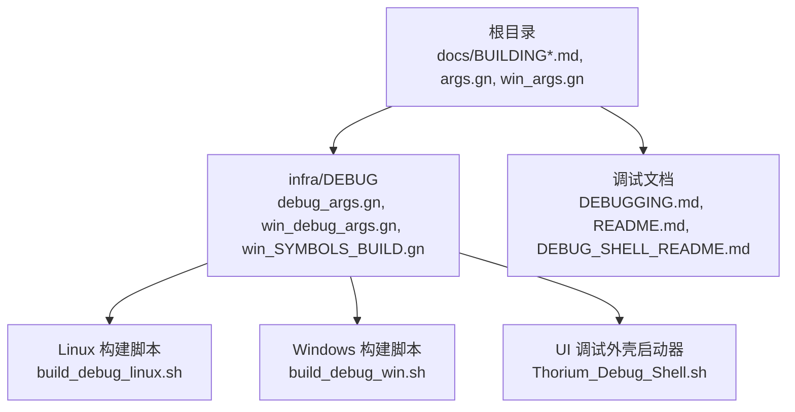
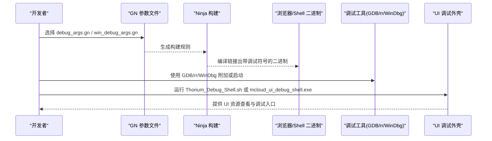
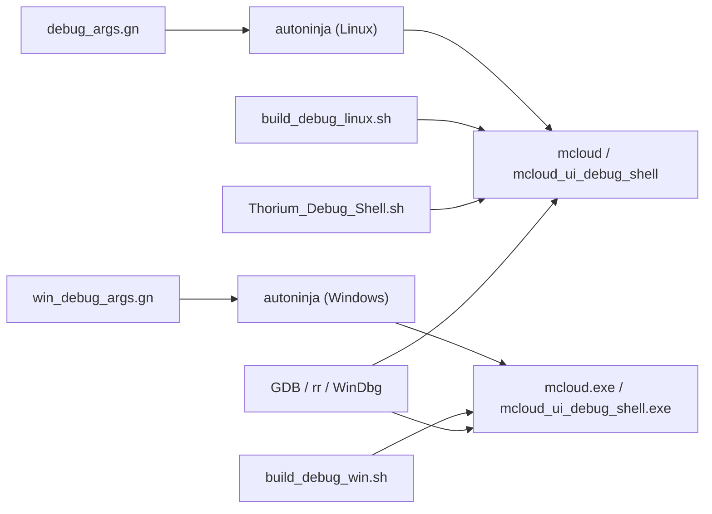

# 调试环境搭建

本文引用的文件

- [DEBUGGING.md](https://github.com/Mcloud136/Mcloud-Browser/blob/main/infra/DEBUG/DEBUGGING.md)
- [debug_args.gn](https://github.com/Mcloud136/Mcloud-Browser/blob/main/infra/DEBUG/debug_args.gn)
- [build_debug_linux.sh](https://github.com/Mcloud136/Mcloud-Browser/blob/main/infra/DEBUG/build_debug_linux.sh)
- [build_debug_win.sh](https://github.com/Mcloud136/Mcloud-Browser/blob/main/infra/DEBUG/build_debug_win.sh)
- [Thorium_Debug_Shell.sh](https://github.com/Mcloud136/Mcloud-Browser/blob/main/infra/DEBUG/Thorium_Debug_Shell.sh)
- [README.md](https://github.com/Mcloud136/Mcloud-Browser/blob/main/infra/DEBUG/README.md)
- [DEBUG_SHELL_README.md](https://github.com/Mcloud136/Mcloud-Browser/blob/main/infra/DEBUG/DEBUG_SHELL_README.md)
- [args.gn](https://github.com/Mcloud136/Mcloud-Browser/blob/main/args.gn)
- [win_args.gn](https://github.com/Mcloud136/Mcloud-Browser/blob/main/win_args.gn)
- [win_debug_args.gn](https://github.com/Mcloud136/Mcloud-Browser/blob/main/infra/DEBUG/win_debug_args.gn)
- [win_SYMBOLS_BUILD.gn](https://github.com/Mcloud136/Mcloud-Browser/blob/main/infra/DEBUG/win_SYMBOLS_BUILD.gn)
- [BUILDING.md](https://github.com/Mcloud136/Mcloud-Browser/blob/main/docs/BUILDING.md)
- [BUILDING_WIN.md](https://github.com/Mcloud136/Mcloud-Browser/blob/main/docs/BUILDING_WIN.md)

## 目录
1. [简介](#简介)
2. [项目结构](#项目结构)
3. [核心组件](#核心组件)
4. [架构总览](#架构总览)
5. [详细组件分析](#详细组件分析)
6. [依赖关系分析](#依赖关系分析)
7. [性能考虑](#性能考虑)
8. [故障排查指南](#故障排查指南)
9. [结论](#结论)
10. [附录](#附录)

## 简介
本指南面向 MCloud Browser（基于 Chromium）的开发者与测试人员，提供在 Linux 与 Windows 上搭建完整调试环境的步骤说明。内容涵盖：
- 调试符号配置与获取方法
- 必要调试工具安装与版本要求（GDB、rr、WinDbg 等）
- 构建参数与 GN 选项（is_debug、symbol_level、use_debug_fission 等）
- 不同平台的差异与特定要求
- 初始化脚本与环境变量示例
- 常见问题的定位与排错建议

## 项目结构
MCloud Browser 将调试相关的构建参数与脚本集中在 infra/DEBUG 目录下，并提供平台特定的构建脚本与 GN 配置文件；根目录包含通用构建文档与默认构建参数。

图示来源
- [debug_args.gn:1-87](https://github.com/Mcloud136/Mcloud-Browser/blob/main/infra/DEBUG/debug_args.gn#L1-L87)
- [win_debug_args.gn:1-87](https://github.com/Mcloud136/Mcloud-Browser/blob/main/infra/DEBUG/win_debug_args.gn#L1-L87)
- [build_debug_linux.sh:1-90](https://github.com/Mcloud136/Mcloud-Browser/blob/main/infra/DEBUG/build_debug_linux.sh#L1-L90)
- [build_debug_win.sh:1-73](https://github.com/Mcloud136/Mcloud-Browser/blob/main/infra/DEBUG/build_debug_win.sh#L1-L73)
- [Thorium_Debug_Shell.sh:1-10](https://github.com/Mcloud136/Mcloud-Browser/blob/main/infra/DEBUG/Thorium_Debug_Shell.sh#L1-L10)
- [DEBUGGING.md:1-603](https://github.com/Mcloud136/Mcloud-Browser/blob/main/infra/DEBUG/DEBUGGING.md#L1-L603)
- [README.md:1-16](https://github.com/Mcloud136/Mcloud-Browser/blob/main/infra/DEBUG/README.md#L1-L16)
- [DEBUG_SHELL_README.md:1-31](https://github.com/Mcloud136/Mcloud-Browser/blob/main/infra/DEBUG/DEBUG_SHELL_README.md#L1-L31)
- [args.gn:1-87](https://github.com/Mcloud136/Mcloud-Browser/blob/main/args.gn#L1-L87)
- [win_args.gn:1-87](https://github.com/Mcloud136/Mcloud-Browser/blob/main/win_args.gn#L1-L87)

章节来源
- [DEBUGGING.md:1-603](https://github.com/Mcloud136/Mcloud-Browser/blob/main/infra/DEBUG/DEBUGGING.md#L1-L603)
- [README.md:1-16](https://github.com/Mcloud136/Mcloud-Browser/blob/main/infra/DEBUG/README.md#L1-L16)
- [DEBUG_SHELL_README.md:1-31](https://github.com/Mcloud136/Mcloud-Browser/blob/main/infra/DEBUG/DEBUG_SHELL_README.md#L1-L31)
- [args.gn:1-87](https://github.com/Mcloud136/Mcloud-Browser/blob/main/args.gn#L1-L87)
- [win_args.gn:1-87](https://github.com/Mcloud136/Mcloud-Browser/blob/main/win_args.gn#L1-L87)

## 核心组件
- 调试构建参数集（GN）
  - Linux 调试参数：infra/DEBUG/debug_args.gn
  - Windows 调试参数：infra/DEBUG/win_debug_args.gn
  - Windows 符号构建参数：infra/DEBUG/win_SYMBOLS_BUILD.gn
- 平台构建脚本
  - Linux 调试构建：infra/DEBUG/build_debug_linux.sh
  - Windows 调试构建：infra/DEBUG/build_debug_win.sh
- UI 调试外壳
  - 启动脚本：infra/DEBUG/Thorium_Debug_Shell.sh
  - 使用说明：infra/DEBUG/DEBUG_SHELL_README.md
- 调试文档与技巧
  - 调试指南：infra/DEBUG/DEBUGGING.md
  - 调试基础设施说明：infra/DEBUG/README.md
- 通用构建文档
  - Linux 构建指南：docs/BUILDING.md
  - Windows 构建指南：docs/BUILDING_WIN.md

章节来源
- [debug_args.gn:1-87](https://github.com/Mcloud136/Mcloud-Browser/blob/main/infra/DEBUG/debug_args.gn#L1-L87)
- [win_debug_args.gn:1-87](https://github.com/Mcloud136/Mcloud-Browser/blob/main/infra/DEBUG/win_debug_args.gn#L1-L87)
- [win_SYMBOLS_BUILD.gn:1-73](https://github.com/Mcloud136/Mcloud-Browser/blob/main/infra/DEBUG/win_SYMBOLS_BUILD.gn#L1-L73)
- [build_debug_linux.sh:1-90](https://github.com/Mcloud136/Mcloud-Browser/blob/main/infra/DEBUG/build_debug_linux.sh#L1-L90)
- [build_debug_win.sh:1-73](https://github.com/Mcloud136/Mcloud-Browser/blob/main/infra/DEBUG/build_debug_win.sh#L1-L73)
- [Thorium_Debug_Shell.sh:1-10](https://github.com/Mcloud136/Mcloud-Browser/blob/main/infra/DEBUG/Thorium_Debug_Shell.sh#L1-L10)
- [DEBUGGING.md:1-603](https://github.com/Mcloud136/Mcloud-Browser/blob/main/infra/DEBUG/DEBUGGING.md#L1-L603)
- [README.md:1-16](https://github.com/Mcloud136/Mcloud-Browser/blob/main/infra/DEBUG/README.md#L1-L16)
- [DEBUG_SHELL_README.md:1-31](https://github.com/Mcloud136/Mcloud-Browser/blob/main/infra/DEBUG/DEBUG_SHELL_README.md#L1-L31)
- [BUILDING.md:1-352](https://github.com/Mcloud136/Mcloud-Browser/blob/main/docs/BUILDING.md#L1-L352)
- [BUILDING_WIN.md:1-288](https://github.com/Mcloud136/Mcloud-Browser/blob/main/docs/BUILDING_WIN.md#L1-L288)

## 架构总览
下图展示了从源码到可执行与调试工具的调用链与依赖关系，包括 GN 参数如何影响构建产物，以及调试脚本如何组织资源并启动 UI 调试外壳。

图示来源
- [debug_args.gn:1-87](https://github.com/Mcloud136/Mcloud-Browser/blob/main/infra/DEBUG/debug_args.gn#L1-L87)
- [win_debug_args.gn:1-87](https://github.com/Mcloud136/Mcloud-Browser/blob/main/infra/DEBUG/win_debug_args.gn#L1-L87)
- [build_debug_linux.sh:1-90](https://github.com/Mcloud136/Mcloud-Browser/blob/main/infra/DEBUG/build_debug_linux.sh#L1-L90)
- [build_debug_win.sh:1-73](https://github.com/Mcloud136/Mcloud-Browser/blob/main/infra/DEBUG/build_debug_win.sh#L1-L73)
- [Thorium_Debug_Shell.sh:1-10](https://github.com/Mcloud136/Mcloud-Browser/blob/main/infra/DEBUG/Thorium_Debug_Shell.sh#L1-L10)

## 详细组件分析

### 调试符号与构建参数
- 关键 GN 参数
  - is_debug：启用调试模式（关闭优化、开启断言等）
  - symbol_level：控制符号级别（推荐 2 以获得更完整的符号信息）
  - use_debug_fission：是否拆分调试信息（影响 GDB 加载速度与源文件定位）
  - exclude_unwind_tables：是否排除 unwind 表（调试时通常保留）
  - dcheck_always_on：始终启用断言检查
  - enable_stripping：调试构建应禁用剥离以保留符号
- 平台差异
  - Linux：infra/DEBUG/debug_args.gn 中设置 target_os="linux"，target_cpu="x64"，is_debug=true，symbol_level=2，use_debug_fission=true
  - Windows：infra/DEBUG/win_debug_args.gn 中设置 target_os="win"，target_cpu="x64"，is_debug=true，symbol_level=2；如需仅带符号的非调试构建，可使用 infra/DEBUG/win_SYMBOLS_BUILD.gn

章节来源
- [debug_args.gn:1-87](https://github.com/Mcloud136/Mcloud-Browser/blob/main/infra/DEBUG/debug_args.gn#L1-L87)
- [win_debug_args.gn:1-87](https://github.com/Mcloud136/Mcloud-Browser/blob/main/infra/DEBUG/win_debug_args.gn#L1-L87)
- [win_SYMBOLS_BUILD.gn:1-73](https://github.com/Mcloud136/Mcloud-Browser/blob/main/infra/DEBUG/win_SYMBOLS_BUILD.gn#L1-L73)

### Linux 调试环境搭建
- 系统要求与依赖
  - 建议使用 Ubuntu 22.04；其他发行版需按 docs/BUILDING.md 安装对应依赖
  - 安装 depot_tools 并将路径加入 PATH
- 获取源码与钩子
  - 克隆仓库后执行 fetch 与 gclient runhooks
- 构建调试版本
  - 使用 infra/DEBUG/build_debug_linux.sh 进行构建，该脚本会调用 autoninja 构建 chrome、chromedriver、mcloud_shell、mcloud_ui_debug_shell 等目标，并整理 UI 调试外壳所需资源
- 运行与调试
  - 通过 GDB 启动主进程或使用 --renderer-cmd-prefix 将渲染器进程注入调试器
  - 若需附加到已运行的渲染器进程，可使用 --allow-sandbox-debugging 并借助任务管理器查找 PID
  - 时间旅行调试可使用 rr 记录与回放

章节来源
- [BUILDING.md:1-352](https://github.com/Mcloud136/Mcloud-Browser/blob/main/docs/BUILDING.md#L1-L352)
- [build_debug_linux.sh:1-90](https://github.com/Mcloud136/Mcloud-Browser/blob/main/infra/DEBUG/build_debug_linux.sh#L1-L90)
- [DEBUGGING.md:1-603](https://github.com/Mcloud136/Mcloud-Browser/blob/main/infra/DEBUG/DEBUGGING.md#L1-L603)

### Windows 调试环境搭建
- 系统要求与工具
  - Visual Studio 2022（含 C++ 桌面开发与 MFC/ATL 支持）
  - Windows SDK 10.1.22621.2428 及 Debugging Tools for Windows（用于读取大 PDB）
  - depot_tools 与 Git Bash
- 获取源码与钩子
  - 使用 fetch chromium 拉取源码，随后 setup.sh 复制 MCloud 补丁与资源
- 构建调试版本
  - 使用 infra/DEBUG/build_debug_win.sh 构建，产出 mcloud_ui_debug_shell.exe 及相关资源
- 运行与调试
  - 使用 WinDbg 或 VS 附加到进程；可通过 --no-sandbox 等开关简化沙箱干扰
  - 对于渲染器进程，可使用类似 Linux 的前缀注入方式（具体开关见调试文档）

章节来源
- [BUILDING_WIN.md:1-288](https://github.com/Mcloud136/Mcloud-Browser/blob/main/docs/BUILDING_WIN.md#L1-L288)
- [build_debug_win.sh:1-73](https://github.com/Mcloud136/Mcloud-Browser/blob/main/infra/DEBUG/build_debug_win.sh#L1-L73)
- [DEBUGGING.md:1-603](https://github.com/Mcloud136/Mcloud-Browser/blob/main/infra/DEBUG/DEBUGGING.md#L1-L603)

### UI 调试外壳（mcloud_ui_debug_shell）
- 作用
  - 基于 views_examples_with_content 构建，便于查看与测试 UI 资源（如矢量图标）
- 使用方式
  - Linux：运行 Thorium_Debug_Shell.sh，设置 LD_LIBRARY_PATH 指向 lib 目录，然后传入调试参数
  - Windows：直接运行 mcloud_ui_debug_shell.exe，通过下拉菜单选择功能项
- 资源路径
  - 内部资源位于 ui/views/vector_icons、components/vector_icons、chrome/app/vector_icons 等位置

章节来源
- [DEBUG_SHELL_README.md:1-31](https://github.com/Mcloud136/Mcloud-Browser/blob/main/infra/DEBUG/DEBUG_SHELL_README.md#L1-L31)
- [Thorium_Debug_Shell.sh:1-10](https://github.com/Mcloud136/Mcloud-Browser/blob/main/infra/DEBUG/Thorium_Debug_Shell.sh#L1-L10)

### 调试工具与版本要求
- GDB（Linux）
  - 需要较新版本（文档提及 GDB-7.7 及以上），否则可能无法解析符号或崩溃
  - 支持 pretty-printers 与 Python 扩展，便于打印 Chromium 类型
- rr（Linux）
  - 用于时间旅行调试，需保持最新版本以支持新的系统调用接口
  - 支持多进程回放（forked 自 zygote 的渲染器等）
- WinDbg（Windows）
  - 随 Windows SDK 安装，用于读取大 PDB 与调试符号
  - 配合 VS 使用更佳

章节来源
- [DEBUGGING.md:1-603](https://github.com/Mcloud136/Mcloud-Browser/blob/main/infra/DEBUG/DEBUGGING.md#L1-L603)
- [BUILDING_WIN.md:1-288](https://github.com/Mcloud136/Mcloud-Browser/blob/main/docs/BUILDING_WIN.md#L1-L288)

### 调试参数与命令行开关
- 常用开关
  - --no-sandbox：临时禁用沙箱以便调试（不建议长期启用）
  - --single-process：单进程模式，便于在主进程中调试渲染线程
  - --disable-gpu：在某些单进程模式下避免已知崩溃
  - --renderer-cmd-prefix：将渲染器进程注入调试器
  - --utility-startup-dialog：对 utility 进程启动时弹出对话框以便附加调试器
  - --allow-sandbox-debugging：允许调试器附加到沙箱化进程
- 日志与 IPC
  - --log-level=0 与 --enable-logging=stderr 输出更多日志
  - CHROME_IPC_LOGGING=1 输出 IPC 调试消息

章节来源
- [DEBUGGING.md:1-603](https://github.com/Mcloud136/Mcloud-Browser/blob/main/infra/DEBUG/DEBUGGING.md#L1-L603)

### 初始化脚本与环境变量示例
- Linux
  - 构建：运行 infra/DEBUG/build_debug_linux.sh，自动设置 NINJA_SUMMARIZE_BUILD=1 并构建目标
  - 运行 UI 调试外壳：运行 Thorium_Debug_Shell.sh，自动导出 LD_LIBRARY_PATH 并传入调试参数
- Windows
  - 构建：运行 infra/DEBUG/build_debug_win.sh，构建 mcloud_ui_debug_shell.exe 及相关资源
- 环境变量
  - CR_DIR：指定 Chromium 源码目录（Linux 脚本中使用）
  - NINJA_SUMMARIZE_BUILD：汇总构建信息
  - CHROME_IPC_LOGGING：启用 IPC 日志
  - DEPOT_TOOLS_WIN_TOOLCHAIN：Windows 下指示使用本地 VS（Windows 构建指南）

章节来源
- [build_debug_linux.sh:1-90](https://github.com/Mcloud136/Mcloud-Browser/blob/main/infra/DEBUG/build_debug_linux.sh#L1-L90)
- [build_debug_win.sh:1-73](https://github.com/Mcloud136/Mcloud-Browser/blob/main/infra/DEBUG/build_debug_win.sh#L1-L73)
- [Thorium_Debug_Shell.sh:1-10](https://github.com/Mcloud136/Mcloud-Browser/blob/main/infra/DEBUG/Thorium_Debug_Shell.sh#L1-L10)
- [BUILDING_WIN.md:1-288](https://github.com/Mcloud136/Mcloud-Browser/blob/main/docs/BUILDING_WIN.md#L1-L288)

## 依赖关系分析
下图展示调试构建过程中各组件之间的依赖关系：GN 参数驱动 Ninja 构建，产出二进制与资源；调试外壳脚本负责组装运行环境；调试工具用于附加或启动进程。

图示来源
- [debug_args.gn:1-87](https://github.com/Mcloud136/Mcloud-Browser/blob/main/infra/DEBUG/debug_args.gn#L1-L87)
- [win_debug_args.gn:1-87](https://github.com/Mcloud136/Mcloud-Browser/blob/main/infra/DEBUG/win_debug_args.gn#L1-L87)
- [build_debug_linux.sh:1-90](https://github.com/Mcloud136/Mcloud-Browser/blob/main/infra/DEBUG/build_debug_linux.sh#L1-L90)
- [build_debug_win.sh:1-73](https://github.com/Mcloud136/Mcloud-Browser/blob/main/infra/DEBUG/build_debug_win.sh#L1-L73)
- [Thorium_Debug_Shell.sh:1-10](https://github.com/Mcloud136/Mcloud-Browser/blob/main/infra/DEBUG/Thorium_Debug_Shell.sh#L1-L10)

章节来源
- [debug_args.gn:1-87](https://github.com/Mcloud136/Mcloud-Browser/blob/main/infra/DEBUG/debug_args.gn#L1-L87)
- [win_debug_args.gn:1-87](https://github.com/Mcloud136/Mcloud-Browser/blob/main/infra/DEBUG/win_debug_args.gn#L1-L87)
- [build_debug_linux.sh:1-90](https://github.com/Mcloud136/Mcloud-Browser/blob/main/infra/DEBUG/build_debug_linux.sh#L1-L90)
- [build_debug_win.sh:1-73](https://github.com/Mcloud136/Mcloud-Browser/blob/main/infra/DEBUG/build_debug_win.sh#L1-L73)
- [Thorium_Debug_Shell.sh:1-10](https://github.com/Mcloud136/Mcloud-Browser/blob/main/infra/DEBUG/Thorium_Debug_Shell.sh#L1-L10)

## 性能考虑
- 调试构建 vs 发布构建
  - 调试构建（is_debug=true）关闭优化、开启断言与符号，便于定位问题但运行较慢
  - 发布构建（release）优化更强，适合性能分析与基准测试
- 符号与加载速度
  - use_debug_fission=false 可显著降低 GDB 加载时间，但会增加链接时间
  - symbol_level=2 提供更丰富的符号信息，有助于回溯与源码级调试
- 缓存与增量构建
  - 使用 ccache 提升重复构建速度（参考 docs/BUILDING.md）
  - 合理设置 CCACHE_BASEDIR 与 CCACHE_SLOPPINESS 提高命中率

章节来源
- [DEBUGGING.md:1-603](https://github.com/Mcloud136/Mcloud-Browser/blob/main/infra/DEBUG/DEBUGGING.md#L1-L603)
- [BUILDING.md:1-352](https://github.com/Mcloud136/Mcloud-Browser/blob/main/docs/BUILDING.md#L1-L352)

## 故障排查指南
- 无法附加到进程
  - Linux：检查 Yama ptrace_scope，必要时设置为 0；使用 --allow-sandbox-debugging 允许调试沙箱进程
  - Windows：确认已安装 Debugging Tools for Windows，并使用正确版本的 SDK
- 符号缺失或无法定位源码
  - 确保 symbol_level 足够高且未剥离符号；检查 strip_absolute_paths_from_debug_symbols 与 gdbinit 配置
- 渲染器进程调试困难
  - 使用 --renderer-cmd-prefix 将渲染器注入调试器；或通过任务管理器查找 PID 后附加
- 单进程模式崩溃
  - 某些情况下需同时使用 --disable-gpu；遇到已知崩溃可继续执行
- 日志与 IPC 调试
  - 启用 --log-level=0、--enable-logging=stderr 与 CHROME_IPC_LOGGING=1 获取更多诊断信息

章节来源
- [DEBUGGING.md:1-603](https://github.com/Mcloud136/Mcloud-Browser/blob/main/infra/DEBUG/DEBUGGING.md#L1-L603)

## 结论
通过合理的 GN 参数、平台构建脚本与调试工具组合，可以在 Linux 与 Windows 上快速搭建 MCloud Browser 的调试环境。建议在开发阶段使用调试构建（is_debug=true、symbol_level=2），并结合 GDB/rr（Linux）或 WinDbg（Windows）进行进程级与源码级调试。UI 调试外壳为资源与界面调试提供了便捷入口。遇到问题时，优先检查沙箱限制、符号完整性与日志输出。

## 附录
- 常用命令速查
  - Linux 调试主进程：使用 GDB 启动并传入 --no-sandbox 等开关
  - Linux 调试渲染器：使用 --renderer-cmd-prefix 注入调试器
  - Linux 时间旅行调试：使用 rr record 与 rr replay
  - Windows 调试：使用 WinDbg 或 VS 附加到进程，确保 SDK 与调试工具版本匹配
- 相关文档
  - 调试基础设施说明：infra/DEBUG/README.md
  - UI 调试外壳说明：infra/DEBUG/DEBUG_SHELL_README.md
  - 构建指南：docs/BUILDING.md、docs/BUILDING_WIN.md