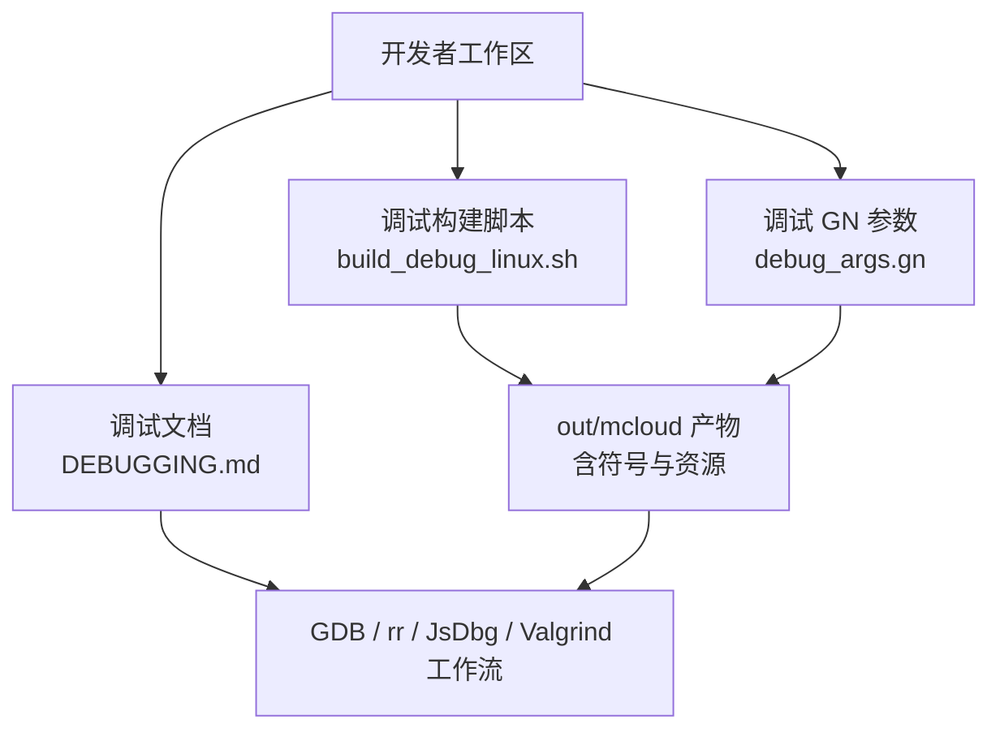
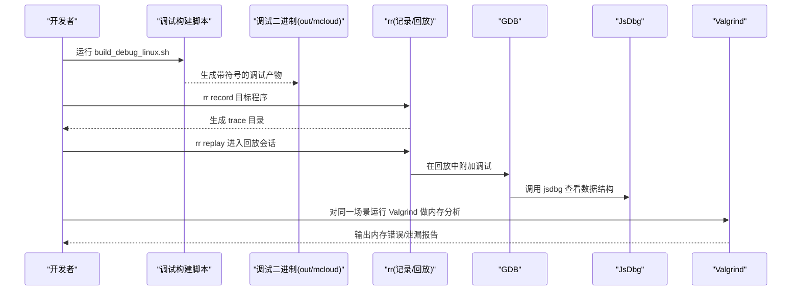
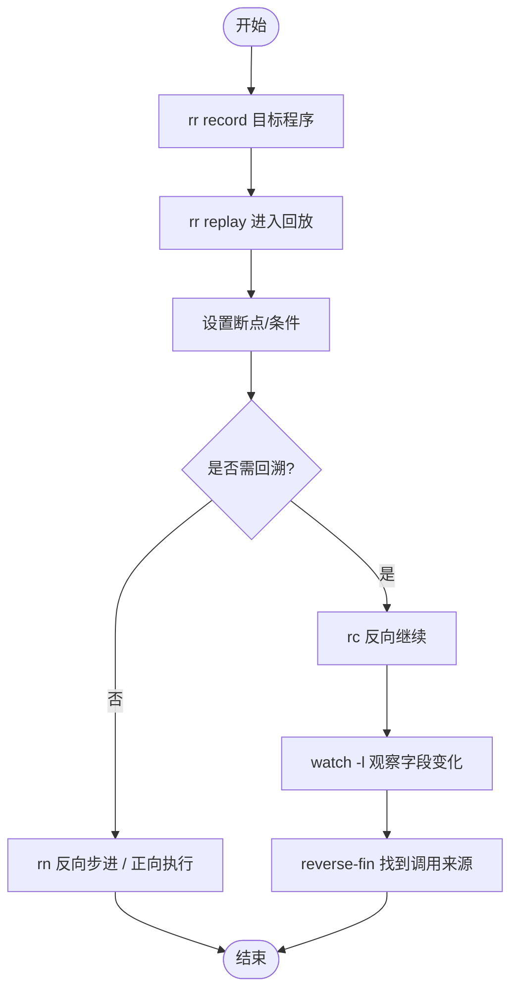
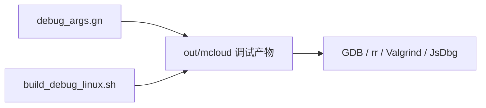
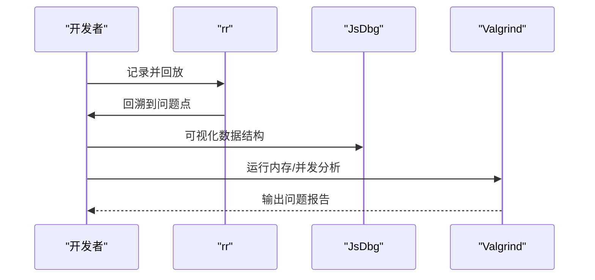

# 高级调试工具

<cite>
**本文引用的文件**
- [README.md](file://README.md)
- [DEBUGGING.md](file://infra/DEBUG/DEBUGGING.md)
- [DEBUG 基础设施说明](file://infra/DEBUG/README.md)
- [Linux 调试构建脚本](file://infra/DEBUG/build_debug_linux.sh)
- [调试 GN 参数（Linux）](file://infra/DEBUG/debug_args.gn)
- [UI 调试外壳说明](file://infra/DEBUG/DEBUG_SHELL_README.md)
- [主工程 GN 参数](file://args.gn)
- [Windows 构建说明](file://docs/WIN_INSTRUCTIONS.txt)
</cite>

## 目录
1. [简介](#简介)
2. [项目结构](#项目结构)
3. [核心组件](#核心组件)
4. [架构总览](#架构总览)
5. [详细组件分析](#详细组件分析)
6. [依赖关系分析](#依赖关系分析)
7. [性能与稳定性考量](#性能与稳定性考量)
8. [故障排查指南](#故障排查指南)
9. [结论](#结论)
10. [附录：工具组合最佳实践与案例](#附录工具组合最佳实践与案例)

## 简介
本指南面向需要在复杂问题中定位崩溃、内存问题、渲染异常和性能瓶颈的开发者，系统介绍 rr（时间旅行调试）、JsDbg（JavaScript/数据结构可视化）、Valgrind（内存分析）等高级调试工具的安装与使用要点，并结合本项目提供的调试基础设施（调试构建、符号配置、UI 调试外壳等），给出可复现的操作流程与组合策略。

## 项目结构
本项目在 infra/DEBUG 下提供了完整的调试基础设施，包括：
- 调试构建脚本与产物打包
- 调试专用 GN 参数（开启符号、禁用部分优化、启用断言等）
- UI 调试外壳（便于独立验证 UI 资源与交互）
- 针对 Linux 的详细调试文档（GDB、rr、JsDbg、日志、Core/Minidump 等）

图表来源
- [Linux 调试构建脚本:1-90](file://infra/DEBUG/build_debug_linux.sh#L1-L90)
- [调试 GN 参数（Linux）:1-87](file://infra/DEBUG/debug_args.gn#L1-L87)
- [调试文档:1-603](file://infra/DEBUG/DEBUGGING.md#L1-L603)

章节来源
- [调试 基础设施说明:1-16](file://infra/DEBUG/README.md#L1-L16)
- [Linux 调试构建脚本:1-90](file://infra/DEBUG/build_debug_linux.sh#L1-L90)
- [调试 GN 参数（Linux）:1-87](file://infra/DEBUG/debug_args.gn#L1-L87)
- [调试文档:1-603](file://infra/DEBUG/DEBUGGING.md#L1-L603)

## 核心组件
- 调试构建与符号
  - 通过调试 GN 参数生成带完整符号的调试二进制，便于 GDB/rr/Valgrind 等工具解析堆栈与变量。
- 多进程调试支持
  - 提供将渲染器/GPU/插件子进程接入调试器的方法，以及单进程模式简化调试。
- 时间旅行调试
  - 使用 rr 记录执行轨迹并回放，配合反向继续、反向步进、条件观察点快速定位问题。
- 数据结构可视化
  - 使用 JsDbg 在浏览器窗口中可视化 DOM、布局树、无障碍树等，辅助前端与引擎层问题定位。
- 内存分析与崩溃转储
  - 结合 Core 文件、Breakpad Minidump、以及 Valgrind/ASan/LSan/TSan 等工具进行内存与并发问题诊断。

章节来源
- [调试文档:15-215](file://infra/DEBUG/DEBUGGING.md#L15-L215)
- [调试文档:244-312](file://infra/DEBUG/DEBUGGING.md#L244-L312)
- [调试文档:351-367](file://infra/DEBUG/DEBUGGING.md#L351-L367)

## 架构总览
下图展示了从“构建调试版本”到“选择合适工具链”的端到端流程，涵盖 rr、JsDbg、Valgrind 的典型协作方式。

图表来源
- [Linux 调试构建脚本:1-90](file://infra/DEBUG/build_debug_linux.sh#L1-L90)
- [调试文档:244-312](file://infra/DEBUG/DEBUGGING.md#L244-L312)

## 详细组件分析

### rr（时间旅行调试）
- 适用场景
  - 难以稳定复现的渲染/布局问题；需要回溯到某个状态变更点的边界条件问题。
- 关键能力
  - 记录系统调用与线程行为，回放时支持反向继续、反向步进、条件观察点。
  - 可与 JsDbg 联动，在回放中可视化对象状态变化。
- 典型用法要点
  - 使用 rr record 捕获执行轨迹，rr replay 进入回放。
  - 设置断点后使用反向继续 rc 回到最近一次相关调用。
  - 使用 watch -l 观察字段变化，再反向步进 rn 或 reverse-fin 定位调用源。
  - 多进程场景可使用 -f/-p 指定 forked 或其他进程进行回放。
- 注意事项
  - 需较新版本的 rr 以支持 Chromium 使用的最新系统调用。
  - 若需调用包含 LOG() 的调试函数，需在代码侧关闭时间戳打印以避免干扰。

图表来源
- [调试文档:256-312](file://infra/DEBUG/DEBUGGING.md#L256-L312)

章节来源
- [调试文档:256-312](file://infra/DEBUG/DEBUGGING.md#L256-L312)

### JsDbg（数据结构可视化）
- 适用场景
  - 需要直观查看 DOM、布局树、无障碍树等内部结构的前端/引擎问题。
- 工作方式
  - 作为调试器插件，在浏览器窗口中展示数据结构的可视化视图。
- 与 rr 的组合
  - 在 rr 回放中调用 jsdbg，定位到特定对象后观察其属性变化，从而缩小问题范围。

章节来源
- [调试文档:244-254](file://infra/DEBUG/DEBUGGING.md#L244-L254)
- [调试文档:274-278](file://infra/DEBUG/DEBUGGING.md#L274-L278)

### Valgrind（内存分析）
- 适用场景
  - 内存越界、未初始化读取、内存泄漏、重复释放等底层内存问题。
- 与项目的结合
  - 调试构建已开启符号与断言，有利于 Valgrind 输出可读的堆栈与变量信息。
  - 对于多线程场景，建议结合 TSan 进行并发问题定位；对于泄漏，LSan 更直接。
- 实践建议
  - 优先用最小可复现场景运行 Valgrind，减少噪声。
  - 结合 rr 先稳定复现，再用 Valgrind 精确定位内存问题。

章节来源
- [调试文档:351-367](file://infra/DEBUG/DEBUGGING.md#L351-L367)
- [调试 GN 参数（Linux）:15-27](file://infra/DEBUG/debug_args.gn#L15-L27)

### GDB 与多进程调试
- 单进程模式
  - 使用单进程模式降低调试复杂度，便于在主进程中直接断点与观察。
- 子进程注入
  - 通过命令行前缀将渲染器/GPU/插件子进程启动为被调试器接管的状态。
- 附加到运行中的进程
  - 使用 ps/pstree 或内置任务管理器查找 PID，再以 gdb -p 附加。
- 沙箱限制
  - 某些沙箱会阻止附加调试器，必要时临时关闭沙箱或使用允许调试的开关。

章节来源
- [调试文档:23-208](file://infra/DEBUG/DEBUGGING.md#L23-L208)

### 崩溃转储与日志
- Core 文件
  - 通过 ulimit 设置 core dump，便于离线分析崩溃现场。
- Breakpad Minidump
  - 使用 minidump_to_core 等方法转换为可分析的 core。
- 日志
  - 调整日志级别与 IPC 日志开关，获取更详细的运行时信息。

章节来源
- [调试文档:351-367](file://infra/DEBUG/DEBUGGING.md#L351-L367)
- [调试文档:463-487](file://infra/DEBUG/DEBUGGING.md#L463-L487)

## 依赖关系分析
- 构建依赖
  - 调试构建脚本依赖 GN 参数与 Ninja，产出带符号的二进制与资源。
- 工具链依赖
  - rr 需要较新的内核与系统调用支持；GDB 需要合适的符号与 Python 扩展；Valgrind 依赖调试符号。
- 项目内集成
  - 调试 GN 参数统一控制符号级别、断言、优化选项，确保工具链能正确解析与定位问题。

图表来源
- [调试 GN 参数（Linux）:1-87](file://infra/DEBUG/debug_args.gn#L1-L87)
- [Linux 调试构建脚本:1-90](file://infra/DEBUG/build_debug_linux.sh#L1-L90)

章节来源
- [调试 GN 参数（Linux）:1-87](file://infra/DEBUG/debug_args.gn#L1-L87)
- [Linux 调试构建脚本:1-90](file://infra/DEBUG/build_debug_linux.sh#L1-L90)

## 性能与稳定性考量
- 调试构建的性能影响
  - 调试构建通常关闭优化、开启断言与符号，适合定位问题但不适合性能测试。
- 工具开销
  - rr 记录会带来额外 I/O 与 CPU 开销；Valgrind 也会显著降低运行速度。建议在最小化场景下运行。
- 沙箱与安全
  - 调试时可能需要临时关闭沙箱或启用调试附加权限，注意仅在受控环境操作。

章节来源
- [调试 GN 参数（Linux）:15-27](file://infra/DEBUG/debug_args.gn#L15-L27)
- [调试文档:8-13](file://infra/DEBUG/DEBUGGING.md#L8-L13)

## 故障排查指南
- 无法附加到进程
  - 检查 Yama ptrace_scope 设置，必要时临时放宽限制。
  - 确认是否启用了允许调试沙箱的开关。
- rr 回放失败或不稳定
  - 升级 rr 至最新版本；若仍存在问题，提交包含最小复现的 issue。
- Valgrind 输出不可读
  - 确保使用调试构建且符号完整；必要时转换 minidump 为 core 进行分析。
- 日志过多或过少
  - 调整日志级别与 IPC 日志开关，聚焦关键路径。

章节来源
- [调试文档:28-41](file://infra/DEBUG/DEBUGGING.md#L28-L41)
- [调试文档:309-312](file://infra/DEBUG/DEBUGGING.md#L309-L312)
- [调试文档:463-487](file://infra/DEBUG/DEBUGGING.md#L463-L487)

## 结论
借助本项目提供的调试基础设施，开发者可以高效地搭建调试环境，并在复杂问题中灵活组合 rr、JsDbg、Valgrind 等工具。推荐的工作流是：先用 rr 稳定复现并回溯关键状态，再用 JsDbg 可视化数据结构，最后用 Valgrind/TSan/LSan 等工具精确定位内存与并发问题。

## 附录：工具组合最佳实践与案例

### 安装与环境准备
- 调试构建
  - 使用调试构建脚本生成带符号的调试产物，便于后续工具链解析。
- 工具安装
  - rr：建议使用较新版本，必要时从源码编译以适配最新系统调用。
  - GDB：确保符号与 Python 扩展可用。
  - Valgrind：用于内存分析，配合调试符号效果更佳。
  - JsDbg：按官方指引安装，可在浏览器中可视化数据结构。

章节来源
- [Linux 调试构建脚本:1-90](file://infra/DEBUG/build_debug_linux.sh#L1-L90)
- [调试文档:244-312](file://infra/DEBUG/DEBUGGING.md#L244-L312)

### 典型工作流
- 步骤一：稳定复现
  - 使用 rr record 捕获执行轨迹，确保问题可回放。
- 步骤二：回溯定位
  - 在 rr replay 中设置断点，使用 rc/rn/reverse-fin 回溯到问题发生点。
- 步骤三：可视化验证
  - 在回放中调用 JsDbg，查看相关数据结构的变化。
- 步骤四：内存与并发分析
  - 对同一场景运行 Valgrind 或 TSan/LSan，输出内存/并发问题报告。

图表来源
- [调试文档:256-312](file://infra/DEBUG/DEBUGGING.md#L256-L312)

### 常见问题与对策
- 渲染卡顿/布局异常
  - 使用 rr 回溯到最近一次布局调用，结合 JsDbg 观察布局对象尺寸变化。
- 内存泄漏
  - 使用 LSan 或 Valgrind 检测泄漏点，结合调试符号定位分配位置。
- 并发竞争
  - 使用 TSan 捕获数据竞争，结合 rr 回放定位触发路径。

章节来源
- [调试文档:256-312](file://infra/DEBUG/DEBUGGING.md#L256-L312)

### Windows 平台补充
- 如需在 Windows 上进行调试，请参考项目内的 Windows 构建与调试说明，确保安装必要的调试工具链与符号服务。

章节来源
- [Windows 构建说明:18-49](file://docs/WIN_INSTRUCTIONS.txt#L18-L49)