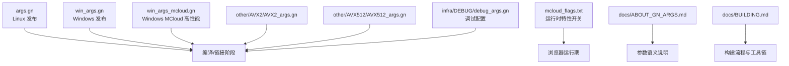
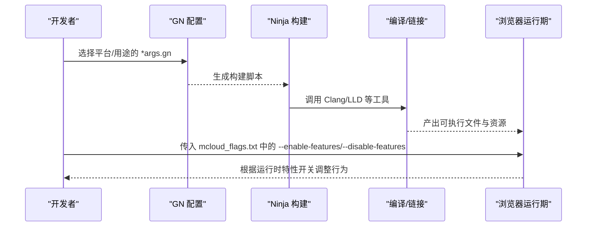
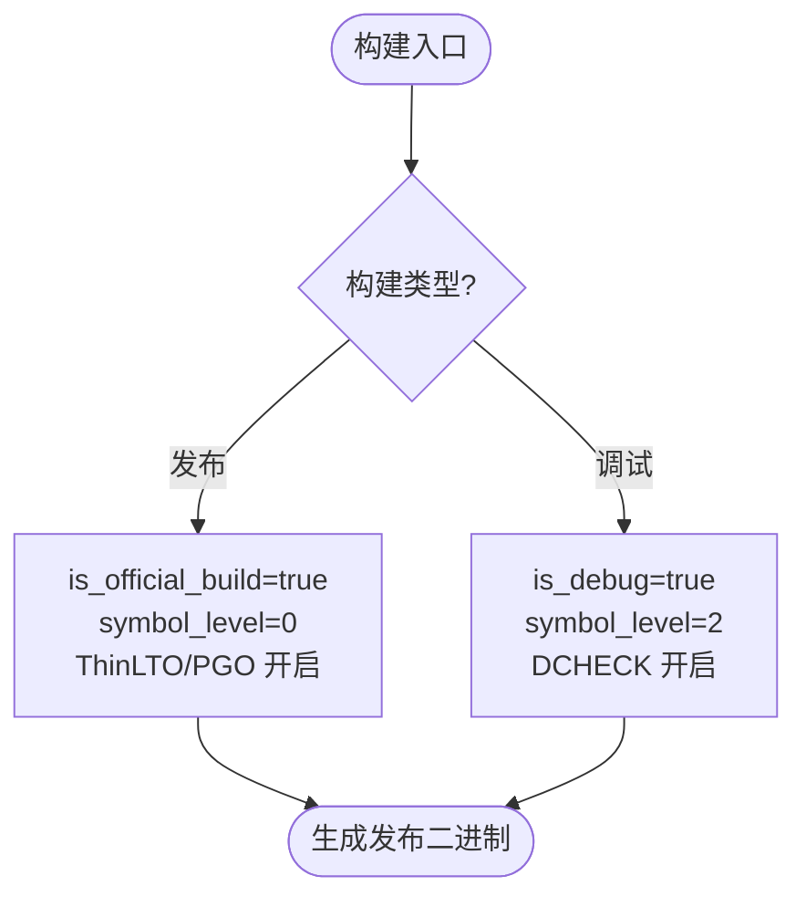
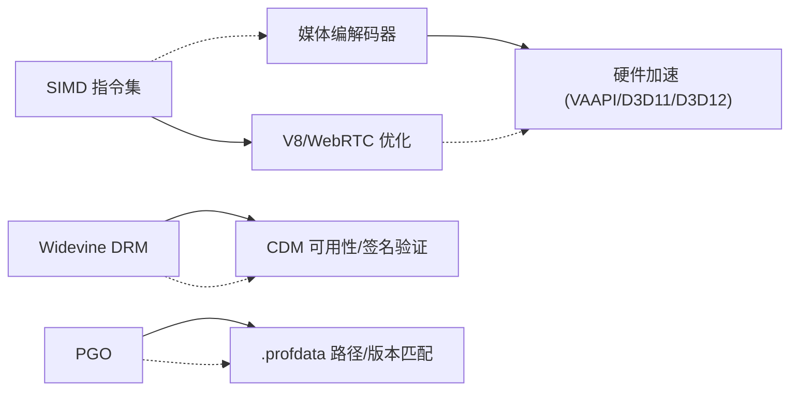

# GN 配置管理

<cite>
**本文引用的文件**
- [args.gn](file://args.gn)
- [win_args.gn](file://win_args.gn)
- [win_args_mcloud.gn](file://win_args_mcloud.gn)
- [ABOUT_GN_ARGS.md](file://docs/ABOUT_GN_ARGS.md)
- [BUILDING.md](file://docs/BUILDING.md)
- [AVX2_args.gn](file://other/AVX2/AVX2_args.gn)
- [AVX512_args.gn](file://other/AVX512/AVX512_args.gn)
- [debug_args.gn](file://infra/DEBUG/debug_args.gn)
- [mcloud_flags.txt](file://mcloud_flags.txt)
</cite>

## 目录
1. [简介](#简介)
2. [项目结构](#项目结构)
3. [核心组件](#核心组件)
4. [架构总览](#架构总览)
5. [详细组件分析](#详细组件分析)
6. [依赖关系分析](#依赖关系分析)
7. [性能考量](#性能考量)
8. [故障排查指南](#故障排查指南)
9. [结论](#结论)
10. [附录：最佳实践与常见配置示例](#附录最佳实践与常见配置示例)

## 简介
本文件系统性说明 MCloud/Thorium 项目的 GN 构建配置体系，重点覆盖以下目标：
- 解释 args.gn、win_args.gn、win_args_mcloud.gn 等配置文件的作用与参数含义
- 详细说明编译器优化标志（SSE3/SSE4.1/SSE4.2/AVX/AVX2/FMA）、目标平台与架构设置、调试与发布模式配置
- 解释 MCloud 特定构建选项：媒体编解码器支持、Widevine DRM、硬件加速等功能开关
- 提供配置参数的最佳实践与常见配置示例

## 项目结构
GN 构建参数以“平台 + 用途”为维度组织：
- 通用 Linux 发布配置：args.gn
- Windows 通用发布配置：win_args.gn
- Windows MCloud 专用高性能配置：win_args_mcloud.gn
- 其他 SIMD 基线配置：other/AVX2/AVX2_args.gn、other/AVX512/AVX512_args.gn
- 调试配置：infra/DEBUG/debug_args.gn
- 运行时特性开关（命令行）：mcloud_flags.txt
- 构建与参数说明文档：docs/ABOUT_GN_ARGS.md、docs/BUILDING.md

图表来源
- [args.gn:1-87](file://args.gn#L1-L87)
- [win_args.gn:1-87](file://win_args.gn#L1-L87)
- [win_args_mcloud.gn:1-126](file://win_args_mcloud.gn#L1-L126)
- [AVX2_args.gn:1-87](file://other/AVX2/AVX2_args.gn#L1-L87)
- [AVX512_args.gn:1-87](file://other/AVX512/AVX512_args.gn#L1-L87)
- [debug_args.gn:1-87](file://infra/DEBUG/debug_args.gn#L1-L87)
- [mcloud_flags.txt:83-119](file://mcloud_flags.txt#L83-L119)
- [ABOUT_GN_ARGS.md:1-174](file://docs/ABOUT_GN_ARGS.md#L1-L174)
- [BUILDING.md:122-156](file://docs/BUILDING.md#L122-L156)

章节来源
- [args.gn:1-87](file://args.gn#L1-L87)
- [win_args.gn:1-87](file://win_args.gn#L1-L87)
- [win_args_mcloud.gn:1-126](file://win_args_mcloud.gn#L1-L126)
- [ABOUT_GN_ARGS.md:1-174](file://docs/ABOUT_GN_ARGS.md#L1-L174)
- [BUILDING.md:122-156](file://docs/BUILDING.md#L122-L156)

## 核心组件
- 目标平台与架构
  - target_os/target_cpu：指定目标操作系统与 CPU 架构（如 linux/win/x64）
  - v8_target_cpu：V8 引擎的目标架构（通常与 target_cpu 一致）
- 构建类型
  - is_official_build/is_debug/symbol_level/exclude_unwind_tables：官方发布、调试、符号级别、是否剥离栈展开表
  - enable_stripping：是否剥离二进制/库的符号
- 编译器与链接器
  - is_clang/use_lld/use_icf/use_thin_lto/thin_lto_enable_optimizations：Clang、LLD、ICF、ThinLTO 及优化强度
  - init_stack_vars_zero：安全相关，初始化栈变量为零
- SIMD 指令集
  - use_sse3/use_sse41/use_sse42/use_avx/use_avx2/use_avx512/use_fma：启用不同级别的 SIMD 指令集
- V8 引擎优化
  - v8_enable_fast_torque/v8_enable_builtins_optimization/v8_enable_maglev/v8_enable_turbofan/v8_enable_wasm_simd256_revec/use_v8_context_snapshot
- 媒体与编解码器
  - media_use_ffmpeg/media_use_libvpx/enable_hls_demuxer/proprietary_codecs/ffmpeg_branding/enable_ffmpeg_video_decoders/is_component_ffmpeg
  - enable_platform_hevc/enable_hevc_parser_and_hw_decoder/platform_has_optional_hevc_decode_support/platform_has_optional_hevc_encode_support
  - enable_platform_ac3_eac3_audio/enable_platform_dolby_vision/enable_platform_encrypted_dolby_vision/enable_platform_mpeg_h_audio/enable_platform_dts_audio/enable_mse_mpeg2ts_stream_parser
- Widevine DRM
  - enable_library_cdms/enable_widevine/bundle_widevine_cdm/enable_cdm_storage_id/ignore_missing_widevine_signing_cert/enable_media_drm_storage
- WebRTC
  - rtc_use_h264/rtc_use_h265/rtc_build_examples/rtc_enable_avx2
- GPU/渲染
  - use_vaapi（Linux）/enable_vulkan（Windows 默认禁用，使用 D3D12/D3D11）
- PGO（性能导向优化）
  - chrome_pgo_phase/pgo_data_path：PGO 阶段与 .profdata 路径

章节来源
- [args.gn:1-87](file://args.gn#L1-L87)
- [win_args.gn:1-87](file://win_args.gn#L1-L87)
- [win_args_mcloud.gn:1-126](file://win_args_mcloud.gn#L1-L126)
- [ABOUT_GN_ARGS.md:35-174](file://docs/ABOUT_GN_ARGS.md#L35-L174)

## 架构总览
GN 参数在生成 Ninja 构建脚本时生效，影响编译、链接、资源打包与运行时行为。MCloud 通过多份 *_args.gn 文件实现“按平台/用途”的参数组合，并通过 mcloud_flags.txt 注入运行时特性开关。

图表来源
- [BUILDING.md:122-156](file://docs/BUILDING.md#L122-L156)
- [mcloud_flags.txt:83-119](file://mcloud_flags.txt#L83-L119)

## 详细组件分析

### 编译器优化标志（SIMD 与指令集）
- SSE3/SSE4.1/SSE4.2/AVX/AVX2/FMA
  - 基础基线：SSE3/SSE4.1/SSE4.2/AVX 普遍开启，保证兼容性与性能
  - AVX2/FMA：在 MCloud 高性能配置中启用，针对现代 CPU（Intel Haswell+/AMD Ryzen+）获得更好吞吐
  - AVX-512：仅在特定实验性配置中启用，需考虑兼容性
- 注意事项
  - 启用 AVX2/FMA 会提高最小 CPU 要求；发布包需明确最低 CPU 版本
  - 若目标环境不确定，建议回退到 AVX 基线或仅启用 SSE4.x

章节来源
- [args.gn:1-7](file://args.gn#L1-L7)
- [win_args.gn:1-7](file://win_args.gn#L1-L7)
- [win_args_mcloud.gn:9-18](file://win_args_mcloud.gn#L9-L18)
- [AVX2_args.gn:1-7](file://other/AVX2/AVX2_args.gn#L1-L7)
- [AVX512_args.gn:1-7](file://other/AVX512/AVX512_args.gn#L1-L7)

### 目标平台与架构设置
- target_os/target_cpu：决定生成的二进制与平台相关特性（如 Linux 的 VAAPI、Windows 的 CFG/Guard）
- v8_target_cpu：确保 V8 与宿主架构匹配
- 平台差异
  - Linux：use_vaapi=true 启用硬件视频加速
  - Windows：win_enable_cfg_guards=true 启用控制流保护；enable_vulkan=false 使用 D3D12/D3D11

章节来源
- [args.gn:11-12](file://args.gn#L11-L12)
- [win_args.gn:11-12](file://win_args.gn#L11-L12)
- [win_args_mcloud.gn:20-22](file://win_args_mcloud.gn#L20-L22)
- [ABOUT_GN_ARGS.md:19-25](file://docs/ABOUT_GN_ARGS.md#L19-L25)

### 调试与发布模式配置
- 发布模式（Release）
  - is_official_build=true, is_debug=false, symbol_level=0, enable_stripping=true, exclude_unwind_tables=true
  - ThinLTO/PGO 开启以获得更好的性能与体积
- 调试模式（Debug）
  - is_debug=true, symbol_level=2, dcheck_always_on=true, exclude_unwind_tables=false
  - 关闭部分优化（如 ThinLTO），便于定位问题

图表来源
- [args.gn:13-26](file://args.gn#L13-L26)
- [win_args.gn:13-25](file://win_args.gn#L13-L25)
- [debug_args.gn:13-27](file://infra/DEBUG/debug_args.gn#L13-L27)
- [ABOUT_GN_ARGS.md:35-63](file://docs/ABOUT_GN_ARGS.md#L35-L63)

章节来源
- [args.gn:13-26](file://args.gn#L13-L26)
- [win_args.gn:13-25](file://win_args.gn#L13-L25)
- [debug_args.gn:13-27](file://infra/DEBUG/debug_args.gn#L13-L27)
- [ABOUT_GN_ARGS.md:35-63](file://docs/ABOUT_GN_ARGS.md#L35-L63)

### MCloud 特定构建选项
- 媒体编解码器
  - FFmpeg/LibVPX/HLS/专有编解码器：media_use_ffmpeg/media_use_libvpx/enable_hls_demuxer/proprietary_codecs/ffmpeg_branding
  - 平台 HEVC 与解析：enable_platform_hevc/enable_hevc_parser_and_hw_decoder/platform_has_optional_hevc_*
  - 音频与高级格式：AC3/EAC3、Dolby Vision、MPEG-H、DTS、MSE MPEG-TS
- Widevine DRM
  - 启用 CDM 库、可选捆绑 CDM、忽略签名证书缺失、启用 MediaDRM 存储
  - 注意：当前 MCloud 高性能配置默认未捆绑 CDM，需单独下载并启用
- 硬件加速
  - Linux：use_vaapi=true
  - Windows：D3D12 视频解码在某些驱动下不可用，运行时通过 --disable-features=D3D12VideoDecoder 回退至 D3D11
- WebRTC
  - rtc_use_h264/rtc_use_h265/rtc_enable_avx2 提升实时通信性能

章节来源
- [win_args_mcloud.gn:74-110](file://win_args_mcloud.gn#L74-L110)
- [mcloud_flags.txt:83-119](file://mcloud_flags.txt#L83-L119)
- [ABOUT_GN_ARGS.md:95-157](file://docs/ABOUT_GN_ARGS.md#L95-L157)

### 运行时特性开关（命令行）
- 通过 mcloud_flags.txt 注入 --enable-features/--disable-features，例如：
  - 禁用 D3D12VideoDecoder 避免核显绿屏
  - 启用 PlatformHEVCDecoderSupport、HardwareSecureDecryptionAv1 等媒体优化
  - 启用 SkiaGraphite、ResourcePoolPreferExactSizeReuse 等图形与内存优化
  - 启用 DedicatedMediaServiceThread、DirectOpusAudioDecoding 等媒体线程与解码优化

章节来源
- [mcloud_flags.txt:83-119](file://mcloud_flags.txt#L83-L119)

## 依赖关系分析
- 参数耦合
  - AVX2/FMA：需要较新的 CPU；若启用，应同步检查 WebRTC、V8 SIMD 等子系统的优化开关
  - Widevine：enable_widevine/bundle_widevine_cdm 与 ignore_missing_widevine_signing_cert 配合使用，需确保 CDM 可用
  - PGO：chrome_pgo_phase=2 需要有效的 .profdata 路径，且与内核大版本严格匹配
- 外部依赖
  - 工具链：Clang/LLD、depot_tools、Python
  - 平台库：VAAPI（Linux）、D3D11/D3D12（Windows）
  - 第三方组件：FFmpeg、LibVPX、Widevine CDM

图表来源
- [win_args_mcloud.gn:59-65](file://win_args_mcloud.gn#L59-L65)
- [win_args_mcloud.gn:74-110](file://win_args_mcloud.gn#L74-L110)
- [win_args_mcloud.gn:84-90](file://win_args_mcloud.gn#L84-L90)
- [win_args_mcloud.gn:52-57](file://win_args_mcloud.gn#L52-L57)

章节来源
- [win_args_mcloud.gn:52-110](file://win_args_mcloud.gn#L52-L110)
- [ABOUT_GN_ARGS.md:161-174](file://docs/ABOUT_GN_ARGS.md#L161-L174)

## 性能考量
- 发布构建
  - 启用 ThinLTO、PGO、WebUI 优化、V8 内置优化、Maglev/TurboFan/WASM SIMD
  - 合理设置 symbol_level=0、exclude_unwind_tables=true 减小体积并提升启动速度
- SIMD 基线
  - 现代 CPU 推荐 AVX2+FMA；旧设备建议使用 AVX 或仅 SSE4.x
- 媒体与 GPU
  - 优先启用平台 HEVC 与硬件解码；Windows 上如遇 D3D12 问题，运行时禁用该特性回退至 D3D11
- 资源与缓存
  - 启用 GpuShaderDiskCache、SkiaGraphite、ResourcePool 优化等运行时特性

章节来源
- [win_args_mcloud.gn:33-65](file://win_args_mcloud.gn#L33-L65)
- [mcloud_flags.txt:90-119](file://mcloud_flags.txt#L90-L119)
- [ABOUT_GN_ARGS.md:161-174](file://docs/ABOUT_GN_ARGS.md#L161-L174)

## 故障排查指南
- Widevine 无法播放 DRM 内容
  - 确认 enable_widevine/bundle_widevine_cdm 与 ignore_missing_widevine_signing_cert 的设置
  - 如需 DRM，运行下载 CDM 的脚本并重新构建
- D3D12 视频解码导致绿屏/花屏
  - 运行时添加 --disable-features=D3D12VideoDecoder，回退至 D3D11
- PGO 不生效或构建失败
  - 检查 chrome_pgo_phase 与 pgo_data_path 是否与当前 Chromium 内核版本匹配
- 构建速度慢
  - 启用 ThinLTO 与 ccache；减少不必要的组件构建；合理设置并行度

章节来源
- [mcloud_flags.txt:83-88](file://mcloud_flags.txt#L83-L88)
- [win_args_mcloud.gn:52-57](file://win_args_mcloud.gn#L52-L57)
- [ABOUT_GN_ARGS.md:161-174](file://docs/ABOUT_GN_ARGS.md#L161-L174)

## 结论
- MCloud 的 GN 配置以“平台 + 用途”为核心，通过多份 *_args.gn 文件实现精细化控制
- 发布构建强调性能与体积：ThinLTO、PGO、V8/WebRTC SIMD、媒体与硬件加速
- MCloud 特定选项围绕媒体编解码、Widevine DRM、GPU 加速与运行时特性开关
- 建议在目标环境明确的前提下选择合适的 SIMD 基线与媒体/GPU 配置，并结合运行时特性进行调优

## 附录：最佳实践与常见配置示例
- 通用发布（Linux）
  - 启用 SSE3/SSE4.1/SSE4.2/AVX，按需启用 AVX2/FMA
  - 启用 FFmpeg/LibVPX/HLS/专有编解码器，启用平台 HEVC 与解析
  - 启用 ThinLTO/PGO，symbol_level=0，排除 unwind tables
- Windows 发布
  - 启用 CFG Guard，禁用 Vulkan（使用 D3D12/D3D11）
  - 媒体与 Widevine 配置同 Linux，但需注意 CDM 下载与签名验证
- Windows MCloud 高性能
  - 启用 AVX2+FMA，V8/WebRTC SIMD，ThinLTO/PGO
  - 媒体：HEVC、Dolby Vision、MPEG-H、DTS、MSE MPEG-TS
  - 运行时：禁用 D3D12VideoDecoder 以避免核显绿屏，启用多项媒体与图形优化
- 调试构建
  - 启用 symbol_level=2、DCHECK、关闭部分优化以便定位问题
- 常见开关参考
  - 媒体：media_use_ffmpeg/media_use_libvpx/enable_hls_demuxer/proprietary_codecs/ffmpeg_branding
  - 硬件加速：use_vaapi（Linux）/D3D11/D3D12（Windows）
  - Widevine：enable_widevine/bundle_widevine_cdm/ignore_missing_widevine_signing_cert/enable_media_drm_storage
  - WebRTC：rtc_use_h264/rtc_use_h265/rtc_enable_avx2
  - PGO：chrome_pgo_phase/pgo_data_path

章节来源
- [args.gn:1-87](file://args.gn#L1-L87)
- [win_args.gn:1-87](file://win_args.gn#L1-L87)
- [win_args_mcloud.gn:1-126](file://win_args_mcloud.gn#L1-L126)
- [ABOUT_GN_ARGS.md:95-174](file://docs/ABOUT_GN_ARGS.md#L95-L174)
- [BUILDING.md:122-156](file://docs/BUILDING.md#L122-L156)