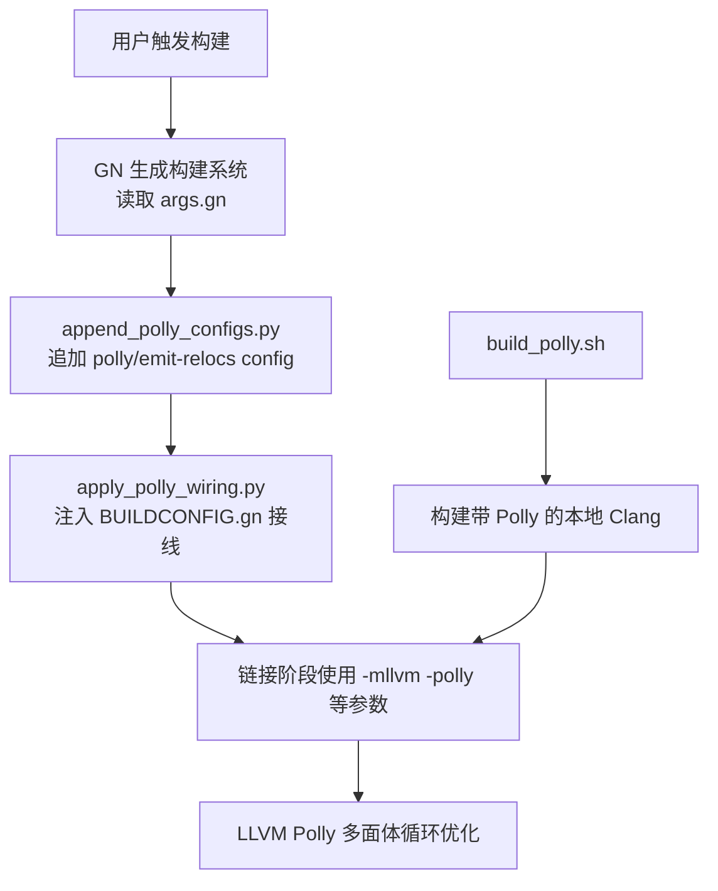
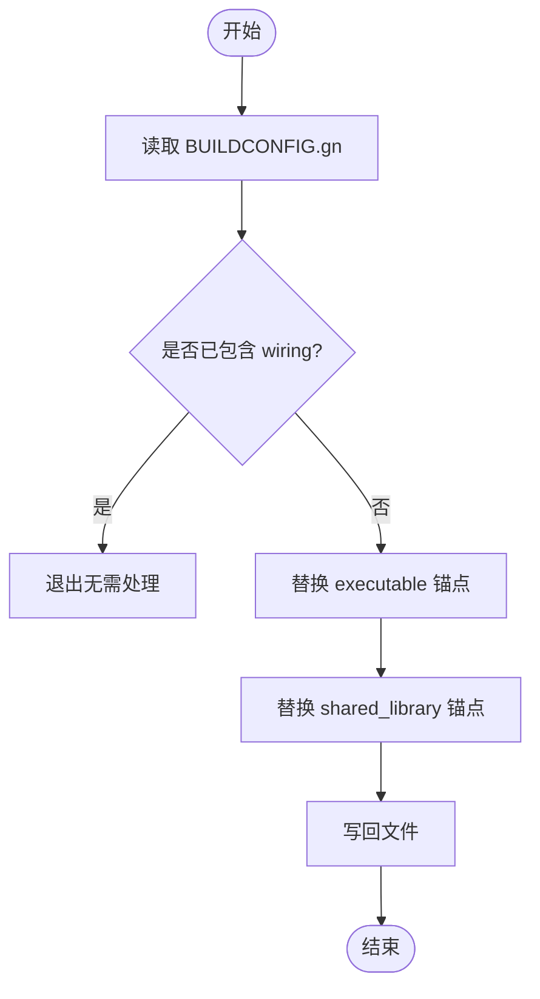
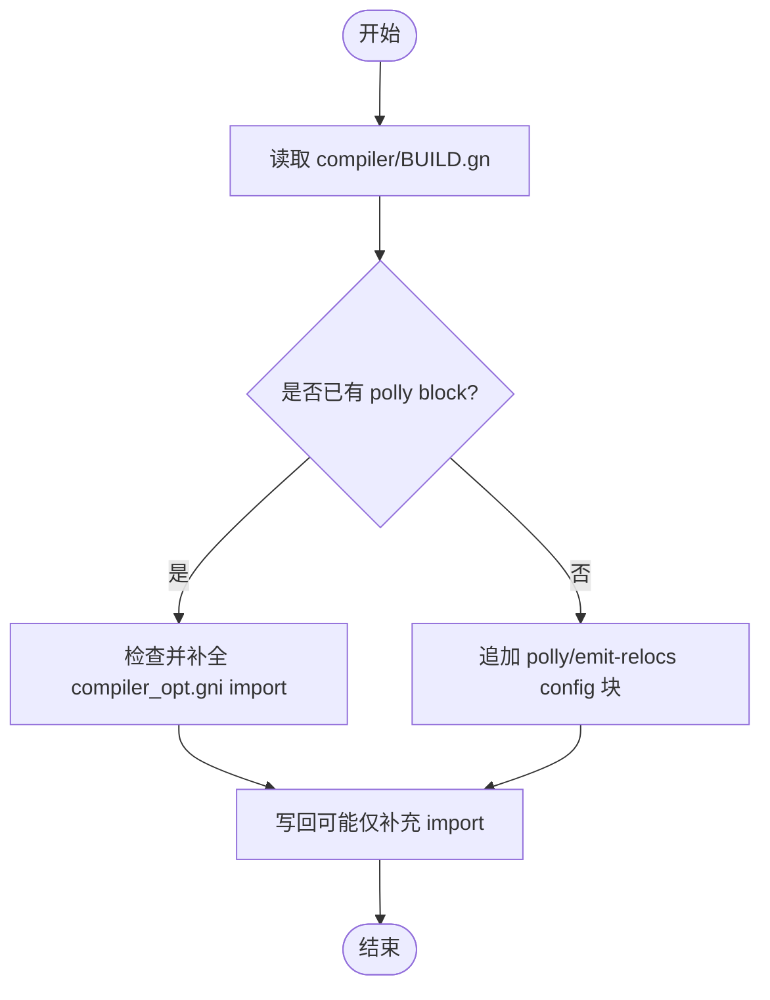
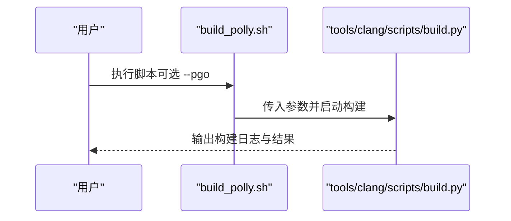
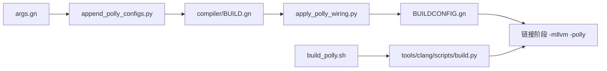

# Polly 循环优化

<cite>
**本文引用的文件**
- [apply_polly_wiring.py](file://win_scripts/apply_polly_wiring.py)
- [append_polly_configs.py](file://win_scripts/append_polly_configs.py)
- [build_polly.sh](file://infra/build_polly.sh)
- [args.gn](file://args.gn)
- [build.py（Clang 构建脚本）](file://src/tools/clang/scripts/build.py)
- [性能优化设计文档 v2.0](file://docs/superpowers/specs/2026-06-19-performance-optimization-design.md)
- [M150 发布说明（节选）](file://docs/superpowers/specs/2026-06-20-release-notes-m150.md)
</cite>

## 目录
1. [简介](#简介)
2. [项目结构](#项目结构)
3. [核心组件](#核心组件)
4. [架构总览](#架构总览)
5. [详细组件分析](#详细组件分析)
6. [依赖关系分析](#依赖关系分析)
7. [性能考量](#性能考量)
8. [故障排查指南](#故障排查指南)
9. [结论](#结论)
10. [附录](#附录)

## 简介
本文件系统性梳理 MCloud Browser 中 LLVM Polly 循环优化的集成方式、配置与效果。重点包括：
- Polly 在 Chromium/M150 构建管线中的接入点与开关
- apply_polly_wiring.py 如何把 Polly 与 emit-relocs 配置“接线”到可执行与共享库目标
- Polly 的循环优化策略（循环展开、向量化、并行化等）在本项目的启用方式
- 与 LLVM 工具链的集成细节（自编译 Clang+Polly、PGO/ThinLTO/BOLT 的配合）
- 性能预期与调优建议

## 项目结构
围绕 Polly 的关键位置如下：
- win_scripts/apply_polly_wiring.py：将 Polly/emit-relocs 配置注入上游 Chromium 的 BUILDCONFIG.gn，使默认可执行与共享库目标链接时启用 Polly 相关选项
- win_scripts/append_polly_configs.py：向编译器 BUILD.gn 追加 polly/emit-relocs 的 config 定义，并注入必要的 import
- infra/build_polly.sh：基于 Chromium 内置的 Clang 构建脚本，拉取当前 Chromium 使用的 LLVM 源码，构建带 Polly 的本地工具链
- args.gn：全局 GN 参数，包含 use_polly/use_bolt 等开关（默认注释关闭，可按需启用）
- src/tools/clang/scripts/build.py：Chromium 自带的 Clang 构建脚本，内部多处显式传递 -mllvm -polly 等参数，用于构建带 Polly 的 Clang 及 PGO/ThinLTO 流程
- docs/superpowers/specs/*：性能优化设计与发布说明，记录 Polly 作为编译期优化项之一及其预期收益



图表来源
- [apply_polly_wiring.py:1-47](file://win_scripts/apply_polly_wiring.py#L1-L47)
- [append_polly_configs.py:1-72](file://win_scripts/append_polly_configs.py#L1-L72)
- [build_polly.sh:1-97](file://infra/build_polly.sh#L1-L97)
- [args.gn:1-87](file://args.gn#L1-L87)

章节来源
- [apply_polly_wiring.py:1-47](file://win_scripts/apply_polly_wiring.py#L1-L47)
- [append_polly_configs.py:1-72](file://win_scripts/append_polly_configs.py#L1-L72)
- [build_polly.sh:1-97](file://infra/build_polly.sh#L1-L97)
- [args.gn:1-87](file://args.gn#L1-L87)

## 核心组件
- 构建开关与配置
  - args.gn 提供 use_polly 与 use_bolt 等开关，控制是否启用 Polly 与 BOLT 相关优化
  - append_polly_configs.py 在编译器 BUILD.gn 中追加 polly/emit-relocs 的 config，并在需要时注入 compiler_opt.gni 的 import
  - apply_polly_wiring.py 在 Chromium 上游 BUILDCONFIG.gn 中将 polly/emit-relocs 配置挂接到默认可执行与共享库目标
- 工具链准备
  - build_polly.sh 调用 Chromium 内置的 tools/clang/scripts/build.py，克隆并使用与 Chromium 一致的 LLVM 版本，构建带 Polly 的本地工具链；支持 --pgo 模式
- 编译器与链接器集成
  - src/tools/clang/scripts/build.py 在多个路径中为 Clang/Polly 构建与训练注入 -mllvm -polly 等参数，确保最终产物能正确启用 Polly 优化

章节来源
- [args.gn:1-87](file://args.gn#L1-L87)
- [append_polly_configs.py:1-72](file://win_scripts/append_polly_configs.py#L1-L72)
- [apply_polly_wiring.py:1-47](file://win_scripts/apply_polly_wiring.py#L1-L47)
- [build_polly.sh:1-97](file://infra/build_polly.sh#L1-L97)
- [build.py（Clang 构建脚本）:1180-1379](file://src/tools/clang/scripts/build.py#L1180-L1379)

## 架构总览
下图展示了从构建入口到 Polly 优化生效的整体链路：

```mermaid
sequenceDiagram
participant Dev as "开发者"
participant GN as "GN 构建系统"
participant Script as "apply_polly_wiring.py / append_polly_configs.py"
participant Link as "链接器"
participant LLVM as "LLVM/Polly"
Dev->>GN : 执行构建含 args.gn
GN->>Script : 读取并应用配置
Script-->>GN : 注入 polly/emit-relocs 配置
GN->>Link : 生成链接命令携带 -mllvm -polly 等
Link->>LLVM : 调用 Polly 进行循环优化
LLVM-->>Link : 输出优化后的 IR/二进制
Link-->>Dev : 产出可执行/库
```

图表来源
- [apply_polly_wiring.py:1-47](file://win_scripts/apply_polly_wiring.py#L1-L47)
- [append_polly_configs.py:1-72](file://win_scripts/append_polly_configs.py#L1-L72)
- [build.py（Clang 构建脚本）:1180-1379](file://src/tools/clang/scripts/build.py#L1180-L1379)

## 详细组件分析

### 组件一：apply_polly_wiring.py（BUILDCONFIG.gn 接线）
- 作用
  - 在上游 Chromium 的 BUILDCONFIG.gn 中，将 polly 与 emit-relocs 配置注入到默认可执行与共享库目标的默认配置集合中
  - 通过条件判断避免在非 Android/Apple 平台引入无关配置
- 关键点
  - 检测是否已存在相同接线，避免重复修改
  - 以字符串替换的方式插入 set_defaults("executable") 与 set_defaults("shared_library") 锚点前后
- 影响范围
  - 所有默认可执行与共享库目标在链接阶段将带上 polly/emit-relocs 的配置（当 use_polly/use_bolt 开启时）



图表来源
- [apply_polly_wiring.py:1-47](file://win_scripts/apply_polly_wiring.py#L1-L47)

章节来源
- [apply_polly_wiring.py:1-47](file://win_scripts/apply_polly_wiring.py#L1-L47)

### 组件二：append_polly_configs.py（compiler/BUILD.gn 追加配置）
- 作用
  - 向编译器 BUILD.gn 追加 polly 与 emit-relocs 的 config 定义
  - 若未导入 compiler_opt.gni，则在标记前插入 import，确保 use_polly/use_bolt 变量可用
- 关键配置
  - emit-relocs：在启用 BOLT 且非 sanitizer 环境下，为链接器添加 --emit-relocs（Windows 与非 Windows 分别处理）
  - polly：在启用 use_polly 时，设置通用优化链接标志，并追加 -mllvm -polly 及相关子选项（如 -polly-detect-profitability-min-per-loop-insts=40、-polly-run-dce、-polly-vectorizer=stripmine）
- 幂等性
  - 检测是否已追加过，避免重复写入



图表来源
- [append_polly_configs.py:1-72](file://win_scripts/append_polly_configs.py#L1-L72)

章节来源
- [append_polly_configs.py:1-72](file://win_scripts/append_polly_configs.py#L1-L72)

### 组件三：build_polly.sh（构建带 Polly 的本地 Clang）
- 作用
  - 基于 Chromium 内置的 tools/clang/scripts/build.py，克隆并使用与 Chromium 一致的 LLVM 版本，构建带 Polly 的本地工具链
  - 支持 --pgo 模式，构建带 PGO 的 Clang/Polly 工具链
- 关键行为
  - 通过环境变量 CR_DIR 指定 Chromium 源码根目录
  - 调用 build.py 完成构建，并提示后续可运行主构建脚本



图表来源
- [build_polly.sh:1-97](file://infra/build_polly.sh#L1-L97)
- [build.py（Clang 构建脚本）:1180-1379](file://src/tools/clang/scripts/build.py#L1180-L1379)

章节来源
- [build_polly.sh:1-97](file://infra/build_polly.sh#L1-L97)
- [build.py（Clang 构建脚本）:1180-1379](file://src/tools/clang/scripts/build.py#L1180-L1379)

### 组件四：args.gn（全局构建开关）
- 作用
  - 集中管理构建特性开关，包括 use_polly、use_bolt、SIMD、LTO、PGO 等
  - 默认情况下 use_polly/use_bolt 被注释关闭，可按需启用
- 与其他模块的关系
  - 与 append_polly_configs.py 配合，决定是否在链接阶段注入 -mllvm -polly 等参数
  - 与 ThinLTO/PGO/BOLT 协同工作，形成完整的编译优化栈

章节来源
- [args.gn:1-87](file://args.gn#L1-L87)

### 组件五：Clang 构建脚本中的 Polly 集成
- 作用
  - 在构建 Clang/Polly 工具链时，多处显式传递 -mllvm -polly 等参数，确保工具链本身具备 Polly 能力
  - 在 PGO/ThinLTO 构建路径中，也加入 -mllvm -polly，保证工具链自身优化一致
- 典型位置
  - 基础 cflags/cxxflags 中添加 -mllvm -polly
  - PGO 训练与最终构建的 CMake 参数中注入 -mllvm -polly
  - 不同平台与 LTO/PGO 组合下的链接器参数注入

章节来源
- [build.py（Clang 构建脚本）:1180-1379](file://src/tools/clang/scripts/build.py#L1180-L1379)

## 依赖关系分析
- 构建脚本依赖
  - apply_polly_wiring.py 依赖上游 Chromium 的 BUILDCONFIG.gn 结构（锚点唯一性断言）
  - append_polly_configs.py 依赖 compiler/BUILD.gn 中存在 common_optimize_on_ldflags 等符号
  - build_polly.sh 依赖 tools/clang/scripts/build.py 提供的构建能力
- 配置依赖
  - polly/emit-relocs 的启用受 args.gn 中 use_polly/use_bolt 控制
  - 链接阶段的 -mllvm -polly 由 GN 配置注入，最终传递给链接器
- 外部依赖
  - 需要自构建或可用的带 Polly 的 Clang 工具链（可通过 build_polly.sh 获取）



图表来源
- [args.gn:1-87](file://args.gn#L1-L87)
- [append_polly_configs.py:1-72](file://win_scripts/append_polly_configs.py#L1-L72)
- [apply_polly_wiring.py:1-47](file://win_scripts/apply_polly_wiring.py#L1-L47)
- [build_polly.sh:1-97](file://infra/build_polly.sh#L1-L97)
- [build.py（Clang 构建脚本）:1180-1379](file://src/tools/clang/scripts/build.py#L1180-L1379)

章节来源
- [args.gn:1-87](file://args.gn#L1-L87)
- [append_polly_configs.py:1-72](file://win_scripts/append_polly_configs.py#L1-L72)
- [apply_polly_wiring.py:1-47](file://win_scripts/apply_polly_wiring.py#L1-L47)
- [build_polly.sh:1-97](file://infra/build_polly.sh#L1-L97)
- [build.py（Clang 构建脚本）:1180-1379](file://src/tools/clang/scripts/build.py#L1180-L1379)

## 性能考量
- 优化策略
  - 循环展开：通过 Polly 的多面体模型识别可展开的循环，减少分支开销与调度成本
  - 向量化：利用 stripmine 向量化器将标量循环转换为 SIMD 指令，提升吞吐
  - 并行化：对独立迭代进行并行化（取决于硬件与代码结构），提高多线程利用率
  - 数据局部性：自动产生缓存友好的 tile 布局，降低缓存缺失
- 配置要点
  - -polly-detect-profitability-min-per-loop-insts=40：过滤低收益循环，避免过度优化带来的膨胀
  - -polly-run-dce：在 Polly 后运行死代码消除，清理冗余
  - -polly-vectorizer=stripmine：启用 stripmine 向量化器
- 预期收益
  - 根据项目文档，Polly 作为编译期优化之一，预期带来约 5-10% 的性能提升（具体因场景而异）

章节来源
- [append_polly_configs.py:25-65](file://win_scripts/append_polly_configs.py#L25-L65)
- [性能优化设计文档 v2.0:107-118](file://docs/superpowers/specs/2026-06-19-performance-optimization-design.md#L107-L118)
- [M150 发布说明（节选）:107-118](file://docs/superpowers/specs/2026-06-20-release-notes-m150.md#L107-L118)

## 故障排查指南
- 常见问题
  - 未启用 use_polly：确认 args.gn 中 use_polly = true，并确保已通过 append_polly_configs.py 与 apply_polly_wiring.py 完成接线
  - 链接失败或无优化：检查链接命令是否包含 -mllvm -polly；确认使用了带 Polly 的 Clang 工具链
  - BOLT 相关错误：确认 use_bolt 与 emit-relocs 配置正确，且未启用 sanitizer
- 诊断步骤
  - 查看链接命令：确认 -mllvm -polly 及相关子选项是否存在
  - 验证工具链：使用 build_polly.sh 重新构建带 Polly 的 Clang
  - 逐步禁用其他优化：隔离问题（如 ThinLTO/PGO/BOLT）

章节来源
- [append_polly_configs.py:25-65](file://win_scripts/append_polly_configs.py#L25-L65)
- [apply_polly_wiring.py:1-47](file://win_scripts/apply_polly_wiring.py#L1-L47)
- [build_polly.sh:1-97](file://infra/build_polly.sh#L1-L97)

## 结论
MCloud Browser 通过一系列脚本与 GN 配置，将 LLVM Polly 循环优化无缝集成到 Chromium 构建管线中。借助自构建的带 Polly 的 Clang 工具链，结合 Stripmine 向量化、循环展开、并行化与缓存友好布局等策略，可在多种计算密集型场景中取得显著性能提升。配合 ThinLTO、PGO 与 BOLT，可进一步放大整体收益。建议在启用 Polly 的同时，结合业务场景进行基准测试与参数调优，以获得最佳效果。

## 附录
- 快速启用步骤
  - 使用 build_polly.sh 构建带 Polly 的本地 Clang
  - 运行 append_polly_configs.py 与 apply_polly_wiring.py 完成配置注入
  - 在 args.gn 中启用 use_polly（以及可选 use_bolt）
  - 执行构建并验证链接命令中包含 -mllvm -polly
- 参考文档
  - 性能优化设计文档 v2.0
  - M150 发布说明（节选）