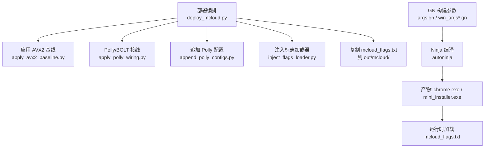
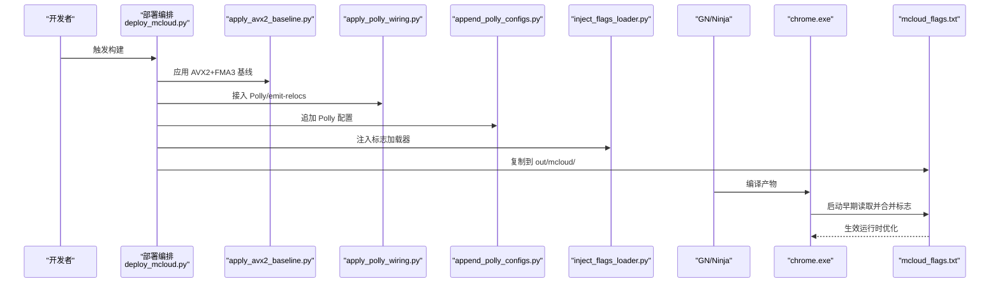
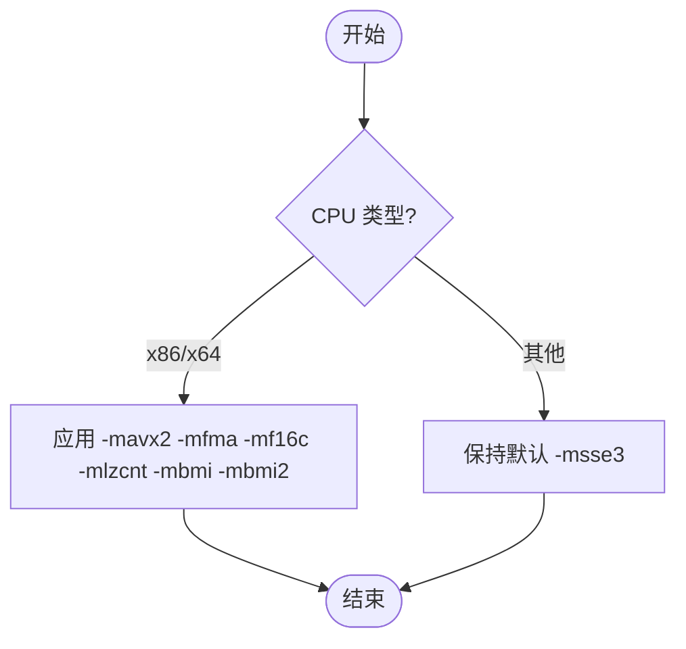
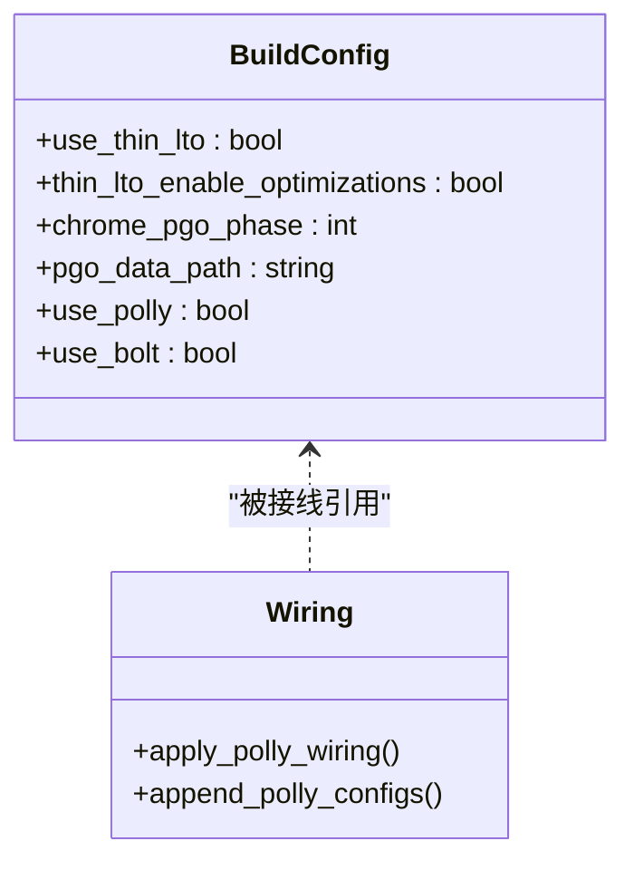
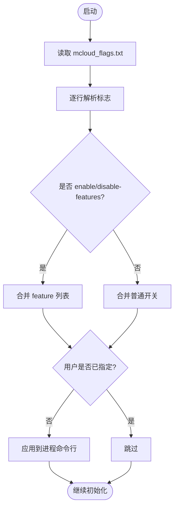
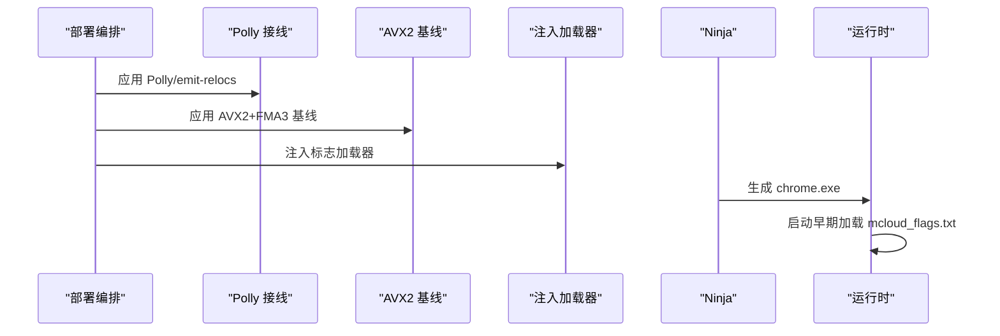
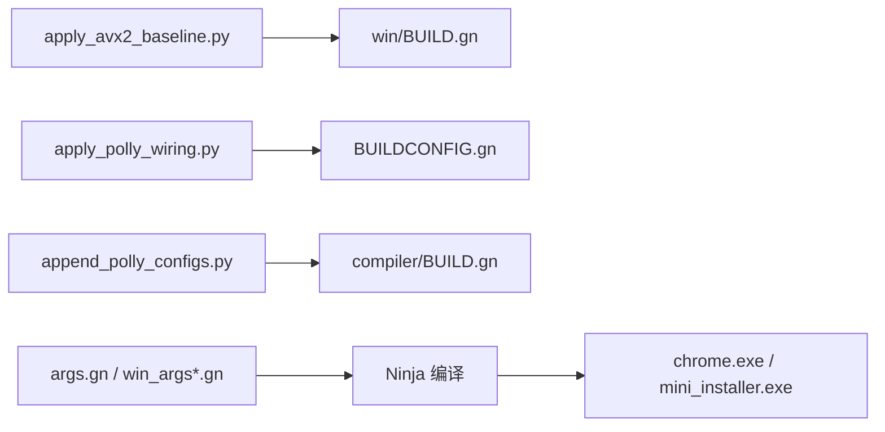

# 构建优化

本文引用的文件

- [mcloud_flags.txt](https://github.com/Mcloud136/Mcloud-Browser/blob/main/mcloud_flags.txt)
- [apply_avx2_baseline.py](https://github.com/Mcloud136/Mcloud-Browser/blob/main/win_scripts/apply_avx2_baseline.py)
- [apply_polly_wiring.py](https://github.com/Mcloud136/Mcloud-Browser/blob/main/win_scripts/apply_polly_wiring.py)
- [append_polly_configs.py](https://github.com/Mcloud136/Mcloud-Browser/blob/main/win_scripts/append_polly_configs.py)
- [args.gn](https://github.com/Mcloud136/Mcloud-Browser/blob/main/args.gn)
- [other/AVX2/AVX2_args.gn](https://github.com/Mcloud136/Mcloud-Browser/blob/main/other/AVX2/AVX2_args.gn)
- [other/AVX512/AVX512_args.gn](https://github.com/Mcloud136/Mcloud-Browser/blob/main/other/AVX512/AVX512_args.gn)
- [win_args.gn](https://github.com/Mcloud136/Mcloud-Browser/blob/main/win_args.gn)
- [win_args_mcloud.gn](https://github.com/Mcloud136/Mcloud-Browser/blob/main/win_args_mcloud.gn)
- [build_win.py](https://github.com/Mcloud136/Mcloud-Browser/blob/main/win_scripts/build_win.py)
- [docs/architecture/build-pipeline-flow.md](https://github.com/Mcloud136/Mcloud-Browser/blob/main/docs/architecture/build-pipeline-flow.md)
- [docs/dev-logs/M151-opt-benchmark.md](https://github.com/Mcloud136/Mcloud-Browser/blob/main/docs/dev-logs/M151-opt-benchmark.md)

## 目录
1. [简介](#简介)
2. [项目结构](#项目结构)
3. [核心组件](#核心组件)
4. [架构总览](#架构总览)
5. [详细组件分析](#详细组件分析)
6. [依赖关系分析](#依赖关系分析)
7. [性能考量](#性能考量)
8. [故障排查指南](#故障排查指南)
9. [结论](#结论)
10. [附录](#附录)

## 简介
本文件系统性梳理 MCloud Browser 的构建与运行期优化策略，覆盖编译器级指令集基线（AVX2/FMA3）、链接时优化（ThinLTO、PGO、Polly/BOLT 接线）、运行时标志注入与合并机制，并给出不同硬件平台的优化建议与基准结果。重点解释以下脚本与配置的作用：
- apply_avx2_baseline.py：为 Windows x64 构建设置 AVX2+FMA3 等指令集基线
- apply_polly_wiring.py 与 append_polly_configs.py：在 Chromium 上游树中启用 Polly 与 emit-relocs 的编译/链接配置
- mcloud_flags.txt：浏览器启动时加载的 66 项运行时优化标志
- args.gn / win_args*.gn：GN 构建参数，控制 SIMD、LTO、PGO、V8 优化等

## 项目结构
MCloud Browser 的优化由“部署阶段脚本 + GN 构建参数 + 运行时标志”三部分协同完成：
- 部署阶段：通过 Python 脚本对上游 Chromium 源码进行定点注入（不整体覆盖源文件），包括 AVX2 基线、Polly/BOLT 接线、默认特性开关、注入运行时标志加载器等
- 构建阶段：使用 GN/Ninja 生成并编译，启用 ThinLTO、PGO、V8 优化、可选 Polly/BOLT
- 运行阶段：chrome.exe 启动早期从同目录读取 mcloud_flags.txt，解析并合并到进程命令行，实现“编译时优化 + 运行时标志”闭环

图示来源
- [docs/architecture/build-pipeline-flow.md:15-44](https://github.com/Mcloud136/Mcloud-Browser/blob/main/docs/architecture/build-pipeline-flow.md#L15-L44)
- [win_scripts/apply_avx2_baseline.py:1-27](https://github.com/Mcloud136/Mcloud-Browser/blob/main/win_scripts/apply_avx2_baseline.py#L1-L27)
- [win_scripts/apply_polly_wiring.py:1-47](https://github.com/Mcloud136/Mcloud-Browser/blob/main/win_scripts/apply_polly_wiring.py#L1-L47)
- [win_scripts/append_polly_configs.py:1-71](https://github.com/Mcloud136/Mcloud-Browser/blob/main/win_scripts/append_polly_configs.py#L1-L71)
- [win_scripts/build_win.py:39-51](https://github.com/Mcloud136/Mcloud-Browser/blob/main/win_scripts/build_win.py#L39-L51)

章节来源
- [docs/architecture/build-pipeline-flow.md:15-44](https://github.com/Mcloud136/Mcloud-Browser/blob/main/docs/architecture/build-pipeline-flow.md#L15-L44)
- [win_scripts/build_win.py:39-51](https://github.com/Mcloud136/Mcloud-Browser/blob/main/win_scripts/build_win.py#L39-L51)

## 核心组件
- 编译器级优化
  - 指令集基线：Windows 上通过 apply_avx2_baseline.py 将 -msse3 替换为 -mavx2 -mfma -mf16c -mlzcnt -mbmi -mbmi2，确保现代 CPU 获得向量化收益
  - GN 参数：use_sse3/use_sse41/use_sse42/use_avx/use_avx2/use_fma/use_avx512 等开关；Linux 下提供 AVX2/AVX512 专用 args 文件
- 链接时优化
  - ThinLTO：use_thin_lto=true，thin_lto_enable_optimizations=true，减少体积并提升跨单元优化
  - PGO：chrome_pgo_phase=2，配合 .profdata 数据文件进行引导优化
  - Polly/BOLT：通过 apply_polly_wiring.py 与 append_polly_configs.py 在 Chromium 上游树中启用 emit-relocs 与 Polly 配置（当前默认关闭，需满足前置条件）
- 运行时优化标志
  - mcloud_flags.txt 包含 66 行标志，涵盖冷启动、渲染、内存、网络、图像、V8、预连接/预渲染、GPU、媒体、线程、Service Worker、存储等领域
  - 启动流程：BasicStartupComplete 早期读取 mcloud_flags.txt，逐行解析并合并至命令行，支持 enable/disable-features 合并与用户条目优先

章节来源
- [win_scripts/apply_avx2_baseline.py:1-27](https://github.com/Mcloud136/Mcloud-Browser/blob/main/win_scripts/apply_avx2_baseline.py#L1-L27)
- [win_scripts/apply_polly_wiring.py:1-47](https://github.com/Mcloud136/Mcloud-Browser/blob/main/win_scripts/apply_polly_wiring.py#L1-L47)
- [win_scripts/append_polly_configs.py:1-71](https://github.com/Mcloud136/Mcloud-Browser/blob/main/win_scripts/append_polly_configs.py#L1-L71)
- [mcloud_flags.txt:1-120](https://github.com/Mcloud136/Mcloud-Browser/blob/main/mcloud_flags.txt#L1-L120)
- [docs/architecture/build-pipeline-flow.md:38-44](https://github.com/Mcloud136/Mcloud-Browser/blob/main/docs/architecture/build-pipeline-flow.md#L38-L44)

## 架构总览
下图展示从部署到运行的完整优化链路，标注关键脚本与配置文件的作用点。

图示来源
- [docs/architecture/build-pipeline-flow.md:15-44](https://github.com/Mcloud136/Mcloud-Browser/blob/main/docs/architecture/build-pipeline-flow.md#L15-L44)
- [win_scripts/apply_avx2_baseline.py:1-27](https://github.com/Mcloud136/Mcloud-Browser/blob/main/win_scripts/apply_avx2_baseline.py#L1-L27)
- [win_scripts/apply_polly_wiring.py:1-47](https://github.com/Mcloud136/Mcloud-Browser/blob/main/win_scripts/apply_polly_wiring.py#L1-L47)
- [win_scripts/append_polly_configs.py:1-71](https://github.com/Mcloud136/Mcloud-Browser/blob/main/win_scripts/append_polly_configs.py#L1-L71)

## 详细组件分析

### 编译器级优化：AVX2/FMA3 基线与 GN 参数
- Windows 基线替换
  - 脚本定位 build/config/win/BUILD.gn，将默认的 -msse3 替换为 -mavx2 -mfma -mf16c -mlzcnt -mbmi -mbmi2，以启用 AVX2 及 FMA3 等指令集
  - 该替换仅在 current_cpu 为 x86/x64 时生效，避免影响其他平台
- Linux 多目标参数
  - args.gn 提供基础参数（SSE/AVX 开启，AVX2/FMA 默认关闭）
  - other/AVX2/AVX2_args.gn 与 other/AVX512/AVX512_args.gn 分别启用 AVX2 或 AVX512 与 FMA，便于按目标平台切换
- V8 与媒体栈优化
  - v8_enable_maglev/turbofan、v8_enable_wasm_simd256_revec、rtc_enable_avx2、enable_platform_hevc 等开关用于加速 JS 执行与媒体解码

图示来源
- [win_scripts/apply_avx2_baseline.py:13-21](https://github.com/Mcloud136/Mcloud-Browser/blob/main/win_scripts/apply_avx2_baseline.py#L13-L21)

章节来源
- [win_scripts/apply_avx2_baseline.py:1-27](https://github.com/Mcloud136/Mcloud-Browser/blob/main/win_scripts/apply_avx2_baseline.py#L1-L27)
- [args.gn:1-87](https://github.com/Mcloud136/Mcloud-Browser/blob/main/args.gn#L1-L87)
- [other/AVX2/AVX2_args.gn:1-87](https://github.com/Mcloud136/Mcloud-Browser/blob/main/other/AVX2/AVX2_args.gn#L1-L87)
- [other/AVX512/AVX512_args.gn:1-87](https://github.com/Mcloud136/Mcloud-Browser/blob/main/other/AVX512/AVX512_args.gn#L1-L87)

### 链接时优化：ThinLTO、PGO、Polly/BOLT
- ThinLTO
  - use_thin_lto=true，thin_lto_enable_optimizations=true，启用跨翻译单元优化与缓存
- PGO
  - chrome_pgo_phase=2，配合 pgo_data_path 指向对应内核版本的 .profdata 文件，提升热点路径性能
- Polly/BOLT
  - apply_polly_wiring.py 在 Chromium 上游 BUILDCONFIG.gn 中为 executable/shared_library 默认添加 compiler:polly 与 emit-relocs 配置
  - append_polly_configs.py 在 compiler/BUILD.gn 中追加 config("polly") 与 config("emit-relocs")，并通过 compiler_opt.gni 中的 use_polly/use_bolt 门控
  - 当前 win_args_mcloud.gn 默认关闭 use_polly 与 use_bolt，待环境就绪后开启

图示来源
- [win_args_mcloud.gn:38-59](https://github.com/Mcloud136/Mcloud-Browser/blob/main/win_args_mcloud.gn#L38-L59)
- [win_scripts/apply_polly_wiring.py:16-47](https://github.com/Mcloud136/Mcloud-Browser/blob/main/win_scripts/apply_polly_wiring.py#L16-L47)
- [win_scripts/append_polly_configs.py:26-71](https://github.com/Mcloud136/Mcloud-Browser/blob/main/win_scripts/append_polly_configs.py#L26-L71)

章节来源
- [win_args_mcloud.gn:38-59](https://github.com/Mcloud136/Mcloud-Browser/blob/main/win_args_mcloud.gn#L38-L59)
- [win_scripts/apply_polly_wiring.py:1-47](https://github.com/Mcloud136/Mcloud-Browser/blob/main/win_scripts/apply_polly_wiring.py#L1-L47)
- [win_scripts/append_polly_configs.py:1-71](https://github.com/Mcloud136/Mcloud-Browser/blob/main/win_scripts/append_polly_configs.py#L1-L71)

### 运行时优化标志：mcloud_flags.txt 的 66 项配置
- 分类与作用
  - 冷启动优化：启用备用渲染进程、提高浏览器进程优先级、提前发送 GPU 通道、延迟创建 RFH、初始 WebUI 优化、临时保活策略
  - 视频播放优化：禁用后台媒体挂起、启用 GPU 光栅化、Canvas OOP 光栅化
  - 渲染优化：Fling 调度改进、任务抑制策略、帧率节流、DirectComposition
  - 内存优化：无限标签冻结、内存压力冻结、PartitionAlloc 回收与排序、提交限制丢弃、持久性紧急丢弃、非主渲染器内存限制、重绘瓦片回收、传输缓存修剪
  - 网络优化：书签/新标签页预取、BackForwardCache、NoStore 进入 BackForwardCache、异步 DNS、EarlyData
  - 图像优化：AVIF
  - 推测规则：SpeculationRules
  - V8 JavaScript 优化：降低 Maglev/Turbofan 阈值、OSR from Maglev、Sparkplug+
  - 启动预热：Prerender2 WarmUp Compositor、Preconnect 到重定向目标、预加载 Top Chrome WebUI、书签预连接
  - 脚本/加载速度：ThreadedPreloadScanner、ConsumeCodeCacheOffThread、InlineScriptCache、预加载系统字体、HTTP 磁盘缓存预热、LCPP Auto Preconnect LCP Origin
  - MSE/视频缓冲：RevokeMediaSourceObjectURLOnAttach、ReduceHardwareVideoDecoderBuffers、BackForwardCache DWC on JS Execution
  - 视频解码修复：禁用 D3D12VideoDecoder（Intel 核显绿屏问题）
  - GPU 优化：GpuShaderDiskCache、IncreasedCmdBufferParseSlice、SkiaGraphite 预编译与启用、资源池精确大小复用、高帧率请求、SkiaGraphite
  - 媒体优化：PlatformHEVCDecoderSupport、HardwareSecureDecryptionAv1、专用媒体服务线程、DirectOpusAudioDecoding、EncryptedMediaOcclusionTracking、MediaFoundationBatchRead、MediaFoundationD3D11VideoCaptureZeroCopy
  - 线程优化：IOThreadInteractiveThreadType、MojoDedicatedThread、BaseLockTrySpin、BoostClosingTabs、UnimportantFramesPriority
  - Service Worker 优化：NavigationPreload
  - 存储优化：移除不存在或不稳定的 PWAFullCodeCache/ServiceWorkerScriptFullCodeCache
- 加载机制
  - 启动早期读取 mcloud_flags.txt，逐行解析并合并到命令行；enable/disable-features 合并，用户指定优先；普通开关若用户已指定则跳过

图示来源
- [docs/architecture/build-pipeline-flow.md:38-44](https://github.com/Mcloud136/Mcloud-Browser/blob/main/docs/architecture/build-pipeline-flow.md#L38-L44)
- [mcloud_flags.txt:1-120](https://github.com/Mcloud136/Mcloud-Browser/blob/main/mcloud_flags.txt#L1-L120)

章节来源
- [mcloud_flags.txt:1-120](https://github.com/Mcloud136/Mcloud-Browser/blob/main/mcloud_flags.txt#L1-L120)
- [docs/architecture/build-pipeline-flow.md:38-44](https://github.com/Mcloud136/Mcloud-Browser/blob/main/docs/architecture/build-pipeline-flow.md#L38-L44)

### 构建流水线与脚本协作
- 部署阶段顺序：copy_essentials → apply_polly_wiring → append_polly_configs → apply_avx2_baseline → apply_mcloud_source_defaults → inject_flags_loader → 复制 mcloud_flags.txt
- 构建阶段：gn gen → autoninja 编译 → setup mini_installer
- 运行阶段：chrome.exe 启动早期加载 mcloud_flags.txt

图示来源
- [docs/architecture/build-pipeline-flow.md:15-44](https://github.com/Mcloud136/Mcloud-Browser/blob/main/docs/architecture/build-pipeline-flow.md#L15-L44)
- [win_scripts/build_win.py:39-51](https://github.com/Mcloud136/Mcloud-Browser/blob/main/win_scripts/build_win.py#L39-L51)

章节来源
- [docs/architecture/build-pipeline-flow.md:15-44](https://github.com/Mcloud136/Mcloud-Browser/blob/main/docs/architecture/build-pipeline-flow.md#L15-L44)
- [win_scripts/build_win.py:39-51](https://github.com/Mcloud136/Mcloud-Browser/blob/main/win_scripts/build_win.py#L39-L51)

## 依赖关系分析
- 脚本与上游文件的耦合
  - apply_avx2_baseline.py 依赖 Chromium 上游 win/BUILD.gn 的锚点文本，确保幂等替换
  - apply_polly_wiring.py 依赖 BUILDCONFIG.gn 的 set_defaults 锚点，插入默认配置
  - append_polly_configs.py 依赖 compiler/BUILD.gn 的 common_optimize_on_ldflags 锚点，追加 Polly/emit-relocs 配置
- GN 参数与构建产物
  - args.gn 与 win_args*.gn 决定 SIMD、LTO、PGO、V8、媒体栈等优化开关
  - build_win.py 调用 autoninja 生成产物，依赖 out/mcloud 构建目录

图示来源
- [win_scripts/apply_avx2_baseline.py:13-21](https://github.com/Mcloud136/Mcloud-Browser/blob/main/win_scripts/apply_avx2_baseline.py#L13-L21)
- [win_scripts/apply_polly_wiring.py:16-47](https://github.com/Mcloud136/Mcloud-Browser/blob/main/win_scripts/apply_polly_wiring.py#L16-L47)
- [win_scripts/append_polly_configs.py:24-71](https://github.com/Mcloud136/Mcloud-Browser/blob/main/win_scripts/append_polly_configs.py#L24-L71)
- [win_scripts/build_win.py:39-51](https://github.com/Mcloud136/Mcloud-Browser/blob/main/win_scripts/build_win.py#L39-L51)

章节来源
- [win_scripts/apply_avx2_baseline.py:1-27](https://github.com/Mcloud136/Mcloud-Browser/blob/main/win_scripts/apply_avx2_baseline.py#L1-L27)
- [win_scripts/apply_polly_wiring.py:1-47](https://github.com/Mcloud136/Mcloud-Browser/blob/main/win_scripts/apply_polly_wiring.py#L1-L47)
- [win_scripts/append_polly_configs.py:1-71](https://github.com/Mcloud136/Mcloud-Browser/blob/main/win_scripts/append_polly_configs.py#L1-L71)
- [win_scripts/build_win.py:39-51](https://github.com/Mcloud136/Mcloud-Browser/blob/main/win_scripts/build_win.py#L39-L51)

## 性能考量
- 指令集选择
  - 现代 Intel/AMD x64 平台建议启用 AVX2+FMA3；旧平台可回退至 SSE4.2
  - AVX512 仅在新近 CPU 上考虑，需评估兼容性与二进制体积
- LTO/PGO
  - ThinLTO 显著减少体积并提升跨单元优化效果；PGO 需匹配内核版本 profdata，收益集中在热点路径
- Polly/BOLT
  - 当前默认关闭；启用需自建含 Polly 的 clang 并确保后链接流程落地，否则可能徒增体积
- 运行时标志
  - 预载/预热类 feature 以内存换取导航响应；实测在真实站点场景存在内存代价，需权衡取舍
  - V8 标志修正（下划线命名）使脚本更快进入 Maglev，理论提升 JS 执行性能

章节来源
- [docs/dev-logs/M151-opt-benchmark.md:19-78](https://github.com/Mcloud136/Mcloud-Browser/blob/main/docs/dev-logs/M151-opt-benchmark.md#L19-L78)
- [win_args_mcloud.gn:38-59](https://github.com/Mcloud136/Mcloud-Browser/blob/main/win_args_mcloud.gn#L38-L59)

## 故障排查指南
- 构建失败
  - 检查 apply_* 脚本的锚点是否存在（如 set_defaults、common_optimize_on_ldflags），确保幂等替换成功
  - 确认 GN 参数与目标平台一致（target_os/target_cpu），避免交叉编译错误
- 运行时异常
  - 确认 mcloud_flags.txt 存在于 exe 同目录并被正确加载；验证 enable/disable-features 合并逻辑
  - 针对 Intel 核显绿屏问题，已显式禁用 D3D12VideoDecoder，避免硬解缺陷
- 性能回归
  - 对比基线与优化构建的 K1/K2 指标；若内存升高，评估移除高内存代价的预载 feature
  - 校验 V8 标志是否生效（子进程命令行中出现 invocation_count_for_maglev=200 等）

章节来源
- [mcloud_flags.txt:83-88](https://github.com/Mcloud136/Mcloud-Browser/blob/main/mcloud_flags.txt#L83-L88)
- [docs/dev-logs/M151-opt-benchmark.md:28-78](https://github.com/Mcloud136/Mcloud-Browser/blob/main/docs/dev-logs/M151-opt-benchmark.md#L28-L78)

## 结论
MCloud Browser 通过“编译器级指令集基线 + 链接时优化 + 运行时标志注入”的多层策略，在保持体积可控的前提下显著提升性能。AVX2/FMA3 基线确保现代 CPU 的向量化收益；ThinLTO/PGO 提升跨单元优化与热点路径效率；Polly/BOLT 接线为未来进一步优化预留空间；mcloud_flags.txt 的 66 项标志覆盖冷启动、渲染、内存、网络、媒体等多维度优化。基准测试显示，新增预载/预热类 feature 带来导航响应改善的同时伴随内存代价，需根据实际场景权衡取舍。建议在现代 x64 平台启用 AVX2+FMA3，结合 ThinLTO/PGO，并根据内存敏感程度调整预载类标志。

## 附录
- 不同硬件平台优化建议
  - Intel/AMD 现代 x64：启用 AVX2+FMA3，ThinLTO，PGO；谨慎评估预载类 feature 的内存代价
  - 旧平台（仅 SSE4.2）：回退指令集基线，保留 LTO/PGO 与运行时标志
  - ARM/Raspberry Pi：参考 arm/raspi 目录下的 args 文件，启用媒体与 GPU 相关优化
- 基准测试结果摘要
  - 冷启动时间：优化构建较基线略有波动，剔除首跑噪声后接近基线
  - 内存峰值：新增预载/预热类 feature 导致内存上升，移除高代价项后可降低约 200MB
  - 体积：仅改 flags 时体积无变化；启用 Polly/BOLT 需谨慎评估体积影响

章节来源
- [docs/dev-logs/M151-opt-benchmark.md:19-78](https://github.com/Mcloud136/Mcloud-Browser/blob/main/docs/dev-logs/M151-opt-benchmark.md#L19-L78)
- [other/AVX2/README.md:1-7](https://github.com/Mcloud136/Mcloud-Browser/blob/main/other/AVX2/README.md#L1-L7)