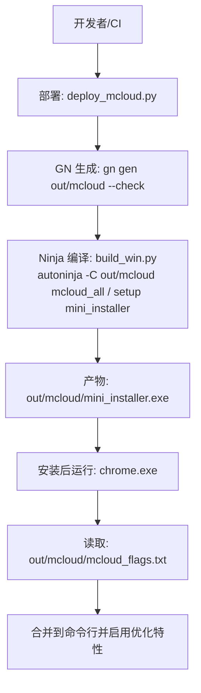
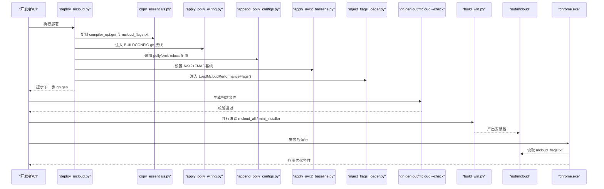
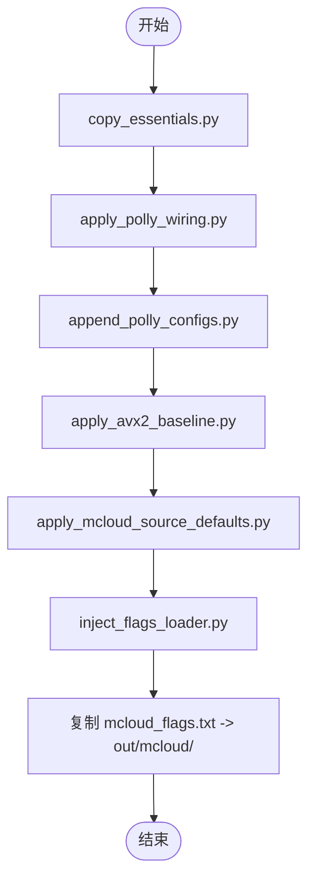
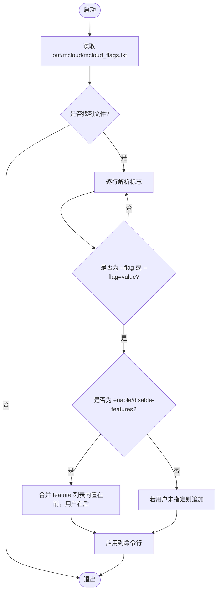
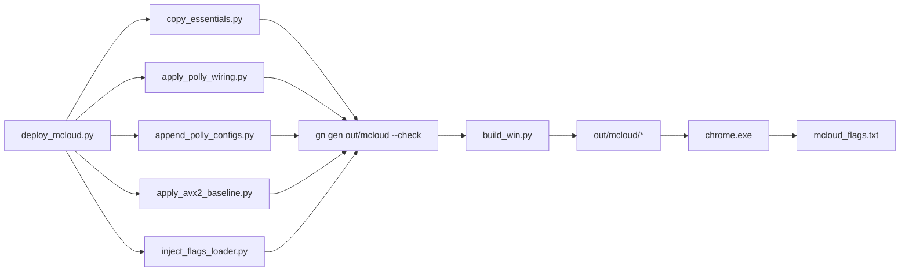

# 构建流水线优化

<cite>
**本文引用的文件**
- [build_win.py](file://win_scripts/build_win.py)
- [deploy_mcloud.py](file://win_scripts/deploy_mcloud.py)
- [copy_essentials.py](file://win_scripts/copy_essentials.py)
- [apply_polly_wiring.py](file://win_scripts/apply_polly_wiring.py)
- [append_polly_configs.py](file://win_scripts/append_polly_configs.py)
- [apply_avx2_baseline.py](file://win_scripts/apply_avx2_baseline.py)
- [inject_flags_loader.py](file://win_scripts/inject_flags_loader.py)
- [mcloud_flags.txt](file://mcloud_flags.txt)
- [win_args.gn](file://win_args.gn)
- [BUILDING_WIN.md](file://docs/BUILDING_WIN.md)
- [build-pipeline-flow.md](file://docs/architecture/build-pipeline-flow.md)
- [verify.yml](file://.github/workflows/verify.yml)
- [release.yml](file://.github/workflows/release.yml)
</cite>

## 目录
1. [简介](#简介)
2. [项目结构](#项目结构)
3. [核心组件](#核心组件)
4. [架构总览](#架构总览)
5. [详细组件分析](#详细组件分析)
6. [依赖关系分析](#依赖关系分析)
7. [性能与优化建议](#性能与优化建议)
8. [故障排查指南](#故障排查指南)
9. [结论](#结论)
10. [附录](#附录)

## 简介
本文件面向 MCloud Browser 的构建流水线优化，聚焦 Windows 平台的自动化构建流程与优化策略。文档围绕部署编排、GN/Ninja 生成与编译、运行时标志加载、CI/CD 验证与发布等关键环节展开，解释增量构建、并行编译、缓存机制等优化技术，并提供构建时间分析与调优建议。

## 项目结构
MCloud Browser 在 Windows 上的构建由“部署脚本 + GN/Ninja + 运行期标志”三部分构成：
- 部署阶段：通过统一入口 deploy_mcloud.py 按序执行若干定点注入脚本，将构建优化配置与运行期标志安全地接入上游 Chromium 树。
- 生成与编译阶段：使用 GN 生成 Ninja 构建文件，再由 autoninja 并行编译目标产物（浏览器与安装包）。
- 运行期阶段：启动时从 exe 同目录读取 mcloud_flags.txt，合并到进程命令行，实现“编译时优化 + 运行时标志”的闭环。

图表来源
- [deploy_mcloud.py:1-51](file://win_scripts/deploy_mcloud.py#L1-L51)
- [build_win.py:1-51](file://win_scripts/build_win.py#L1-L51)
- [mcloud_flags.txt:1-120](file://mcloud_flags.txt#L1-L120)

章节来源
- [build-pipeline-flow.md:1-62](file://docs/architecture/build-pipeline-flow.md#L1-L62)
- [BUILDING_WIN.md:203-256](file://docs/BUILDING_WIN.md#L203-L256)

## 核心组件
- 部署编排器：deploy_mcloud.py，负责顺序调用各定点注入脚本，确保幂等与可重复执行。
- 源文件复制：copy_essentials.py，仅复制必要的专有构建声明与运行期标志文件，避免整体覆盖导致漂移。
- 构建系统接线：apply_polly_wiring.py、append_polly_configs.py，为 Polly/BOLT 与 emit-relocs 提供 GN 配置与链接开关。
- 硬件基线：apply_avx2_baseline.py，将 Windows x64 基线从 SSE3 升级为 AVX2+FMA3 等指令集。
- 运行期标志注入：inject_flags_loader.py，向主程序入口注入启动早期读取 mcloud_flags.txt 的逻辑。
- 编译入口：build_win.py，封装 autoninja 并行编译与安装包生成。
- 构建参数：win_args.gn，定义目标平台、编译器、优化选项、PGO 等。
- 运行期标志：mcloud_flags.txt，集中管理大量 enable/disable-features 与 V8 启动参数。

章节来源
- [deploy_mcloud.py:1-51](file://win_scripts/deploy_mcloud.py#L1-L51)
- [copy_essentials.py:1-50](file://win_scripts/copy_essentials.py#L1-L50)
- [apply_polly_wiring.py:1-47](file://win_scripts/apply_polly_wiring.py#L1-L47)
- [append_polly_configs.py:1-72](file://win_scripts/append_polly_configs.py#L1-L72)
- [apply_avx2_baseline.py:1-27](file://win_scripts/apply_avx2_baseline.py#L1-L27)
- [inject_flags_loader.py:1-125](file://win_scripts/inject_flags_loader.py#L1-L125)
- [win_args.gn:1-87](file://win_args.gn#L1-L87)
- [mcloud_flags.txt:1-120](file://mcloud_flags.txt#L1-L120)

## 架构总览
下图展示了从部署到产出的完整链路，以及运行期标志如何影响浏览器行为。

图表来源
- [deploy_mcloud.py:1-51](file://win_scripts/deploy_mcloud.py#L1-L51)
- [copy_essentials.py:1-50](file://win_scripts/copy_essentials.py#L1-L50)
- [apply_polly_wiring.py:1-47](file://win_scripts/apply_polly_wiring.py#L1-L47)
- [append_polly_configs.py:1-72](file://win_scripts/append_polly_configs.py#L1-L72)
- [apply_avx2_baseline.py:1-27](file://win_scripts/apply_avx2_baseline.py#L1-L27)
- [inject_flags_loader.py:1-125](file://win_scripts/inject_flags_loader.py#L1-L125)
- [build_win.py:1-51](file://win_scripts/build_win.py#L1-L51)
- [mcloud_flags.txt:1-120](file://mcloud_flags.txt#L1-L120)

## 详细组件分析

### 部署编排器：deploy_mcloud.py
- 职责：统一入口，按固定顺序执行 7 步部署（含内联复制 mcloud_flags.txt），任一失败立即中止。
- 关键设计：所有步骤幂等，支持重复运行；通过 CR_DIR/THOR_DIR 环境变量定位上游源码与仓库根。
- 输出：完成后提示执行 gn gen out/mcloud --check。

图表来源
- [deploy_mcloud.py:1-51](file://win_scripts/deploy_mcloud.py#L1-L51)

章节来源
- [deploy_mcloud.py:1-51](file://win_scripts/deploy_mcloud.py#L1-L51)

### 源文件复制：copy_essentials.py
- 职责：仅复制必要的专有构建声明（compiler_opt.gni）与运行期标志文件，避免整体覆盖导致的上游漂移。
- 关键点：自动剥离 src/ 前缀，确保复制到正确的 CR_DIR 路径；创建 out/mcloud 目录以放置标志文件。

章节来源
- [copy_essentials.py:1-50](file://win_scripts/copy_essentials.py#L1-L50)

### 构建系统接线：apply_polly_wiring.py 与 append_polly_configs.py
- apply_polly_wiring.py：在 BUILDCONFIG.gn 中为可执行与共享库目标添加 polly/emit-relocs 默认配置，使链接阶段可生成重定位信息。
- append_polly_configs.py：在 compiler/BUILD.gn 中追加 polly 与 emit-relocs 的 config 定义，并通过 import 引入 compiler_opt.gni 中的 use_polly/use_bolt 开关。

章节来源
- [apply_polly_wiring.py:1-47](file://win_scripts/apply_polly_wiring.py#L1-L47)
- [append_polly_configs.py:1-72](file://win_scripts/append_polly_configs.py#L1-L72)

### 硬件基线：apply_avx2_baseline.py
- 职责：将 Windows x64 构建基线从 -msse3 替换为 -mavx2 -mfma -mf16c -mlzcnt -mbmi -mbmi2，提升 SIMD 性能。
- 幂等性：若已存在 -mavx2 则跳过。

章节来源
- [apply_avx2_baseline.py:1-27](file://win_scripts/apply_avx2_baseline.py#L1-L27)

### 运行期标志注入：inject_flags_loader.py
- 职责：向 chrome_main_delegate.cc 注入 LoadMcloudPerformanceFlags()，并在 BasicStartupComplete 早期调用。
- 行为：从 exe 同目录读取 mcloud_flags.txt，逐行解析并合并到命令行；对 enable/disable-features 进行合并，用户条目优先。

图表来源
- [inject_flags_loader.py:1-125](file://win_scripts/inject_flags_loader.py#L1-L125)
- [mcloud_flags.txt:1-120](file://mcloud_flags.txt#L1-L120)

章节来源
- [inject_flags_loader.py:1-125](file://win_scripts/inject_flags_loader.py#L1-L125)

### 编译入口：build_win.py
- 职责：封装 autoninja 并行编译，先构建 mcloud_all，再生成 mini_installer。
- 并行度：默认使用 CPU 核心数作为 -j 参数，最大化利用多核加速构建。

章节来源
- [build_win.py:1-51](file://win_scripts/build_win.py#L1-L51)

### 构建参数：win_args.gn
- 目标平台：Windows x64，官方发布构建，关闭调试符号与多余功能。
- 编译器与链接：启用 clang、LLD、ThinLTO、V8 优化（Fast Torque、Maglev、Turbofan）、WebUI 优化。
- 媒体与解码：启用 FFmpeg、libvpx、HLS、Widevine、HEVC/H.264/H.265、AC3/Dolby Vision/MPEG-H/AAC 等。
- PGO：第二阶段 PGO 数据路径已配置，用于优化二进制性能。

章节来源
- [win_args.gn:1-87](file://win_args.gn#L1-L87)

### 运行期标志：mcloud_flags.txt
- 内容：包含冷启动优化、视频播放优化、渲染优化、内存优化、网络优化、图像优化、V8 优化、预加载预热、脚本/加载速度、MSE/视频缓冲、GPU 优化、媒体优化、线程优化、Service Worker 优化、存储优化等大量特性开关与 V8 参数。
- 作用：在浏览器启动早期合并到命令行，驱动运行时行为，形成“编译时优化 + 运行时标志”的闭环。

章节来源
- [mcloud_flags.txt:1-120](file://mcloud_flags.txt#L1-L120)

## 依赖关系分析
- 脚本间依赖：deploy_mcloud.py 顺序依赖 copy_essentials.py、apply_polly_wiring.py、append_polly_configs.py、apply_avx2_baseline.py、apply_mcloud_source_defaults.py、inject_flags_loader.py。
- 构建系统依赖：GN 生成依赖 win_args.gn 与上游 Chromium 树的 BUILD.gn/BUILDCONFIG.gn；Ninja 编译依赖 GN 生成的 .ninja 文件。
- 运行期依赖：chrome.exe 依赖 out/mcloud/mcloud_flags.txt 的存在与正确格式。

图表来源
- [deploy_mcloud.py:1-51](file://win_scripts/deploy_mcloud.py#L1-L51)
- [build_win.py:1-51](file://win_scripts/build_win.py#L1-L51)
- [win_args.gn:1-87](file://win_args.gn#L1-L87)
- [mcloud_flags.txt:1-120](file://mcloud_flags.txt#L1-L120)

章节来源
- [build-pipeline-flow.md:1-62](file://docs/architecture/build-pipeline-flow.md#L1-L62)

## 性能与优化建议
- 并行编译：使用 autoninja -j 充分利用多核；根据 CI 机器规格调整并发度，避免 I/O 瓶颈。
- 增量构建：GN 生成仅在配置变更时触发；Ninja 基于依赖图增量编译，减少不必要的重建。
- 缓存机制：
  - ThinLTO：启用 thin_lto_enable_cache 与 thin_lto_enable_optimizations，提升跨模块优化效率。
  - PGO：第二阶段 PGO 数据路径已配置，建议在 CI 中复用 profile 以提升最终二进制性能。
  - ccache：参考 Chromium 文档设置 CCACHE_BASEDIR 与 CCACHE_SLOPPINESS，提高头文件命中。
- 硬件基线：AVX2+FMA3 基线显著提升 SIMD 密集型任务性能；确保工具链支持相应指令集。
- 运行期标志：合理裁剪 mcloud_flags.txt，避免过多预热特性带来内存压力；定期评估各特性收益。
- 构建环境：确保 Python 路径优先级正确，避免误用系统 Python；禁用不必要的索引与杀毒扫描以提升构建速度。

[本节为通用指导，不直接分析具体文件]

## 故障排查指南
- 部署失败：检查 CR_DIR/THOR_DIR 环境变量是否正确；确认各脚本幂等性与锚点是否存在。
- GN 生成失败：核对 win_args.gn 与上游树兼容性；必要时重新执行 deploy_mcloud.py 后再 gn gen。
- 编译失败：查看 autoninja 输出；确认 Polly/BOLT 相关配置已正确注入；检查 include 与依赖头文件。
- 运行期异常：确认 out/mcloud/mcloud_flags.txt 存在且格式正确；检查 chrome.exe 是否能读取该文件。
- CI 验证：verify.yml 会检查 Python 语法与关键脚本存在性；release.yml 仅上传已有产物，不包含构建。

章节来源
- [verify.yml:1-200](file://.github/workflows/verify.yml#L1-L200)
- [release.yml:1-200](file://.github/workflows/release.yml#L1-L200)

## 结论
MCloud Browser 的构建流水线通过“部署编排 + GN/Ninja + 运行期标志”实现了高度模块化与可维护性。定点注入避免了整体覆盖带来的上游漂移风险；并行编译与缓存机制显著缩短构建时间；运行期标志提供了灵活的优化开关。结合 CI/CD 验证与发布流程，形成了完整的自动化构建体系。持续优化应关注并行度、缓存命中率、PGO 数据质量与运行期标志的有效性评估。

[本节为总结，不直接分析具体文件]

## 附录
- 本地构建命令参考：见 BUILDING_WIN.md 中关于 gn args、autoninja 与 mini_installer 的使用说明。
- 流水线文档：build-pipeline-flow.md 提供了更详细的阶段说明与证据清单。

章节来源
- [BUILDING_WIN.md:203-256](file://docs/BUILDING_WIN.md#L203-L256)
- [build-pipeline-flow.md:1-62](file://docs/architecture/build-pipeline-flow.md#L1-L62)