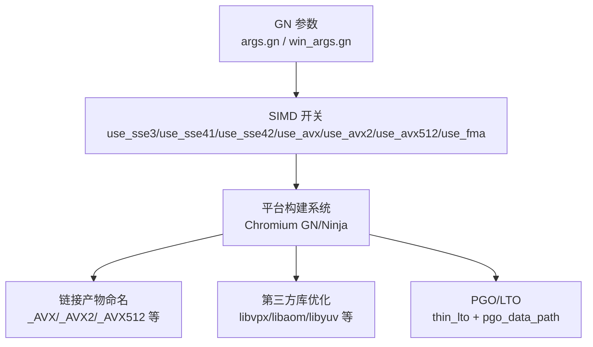
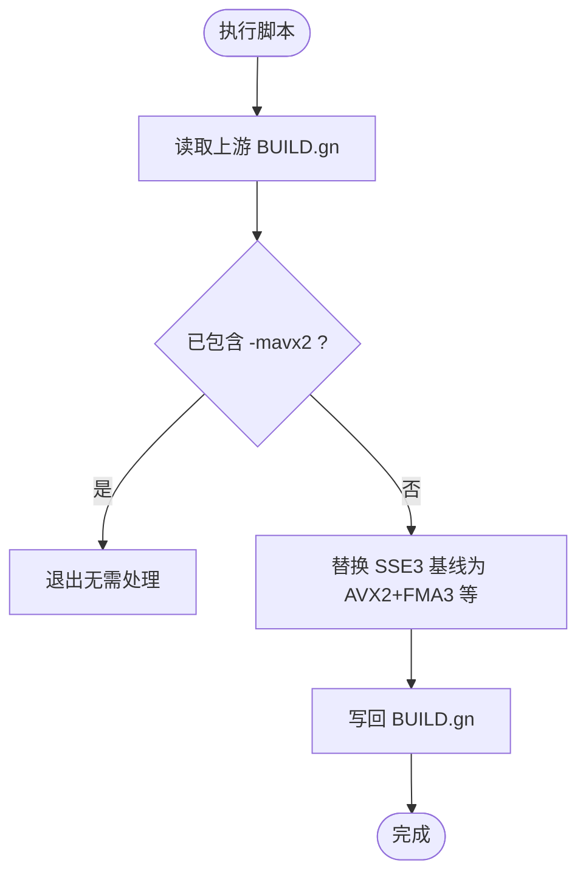
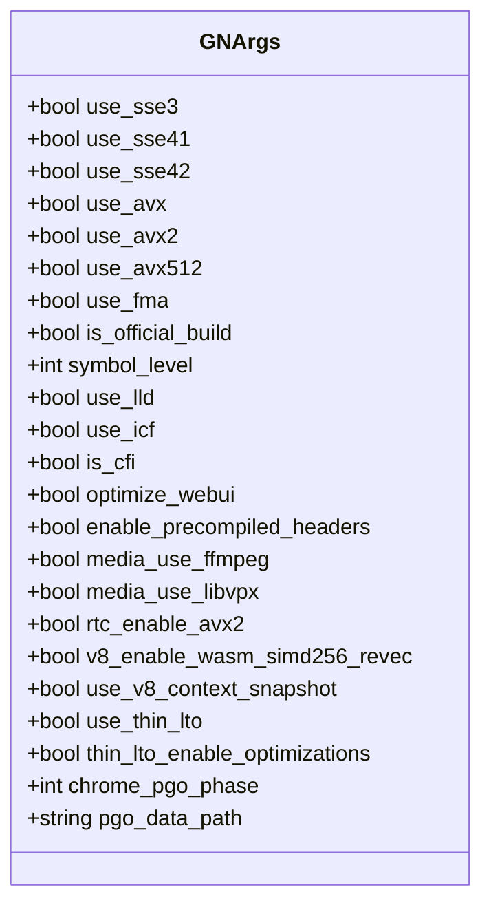
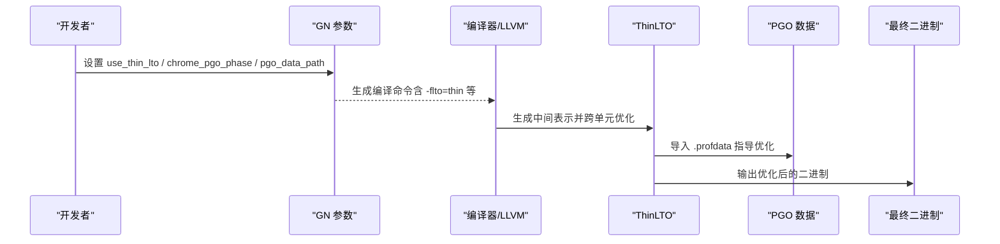
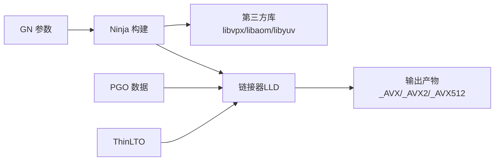

# 编译器优化

<cite>
**本文引用的文件**
- [apply_avx2_baseline.py](file://win_scripts/apply_avx2_baseline.py)
- [args.gn](file://args.gn)
- [win_args.gn](file://win_args.gn)
- [AVX2_args.gn](file://other/AVX2/AVX2_args.gn)
- [AVX512_args.gn](file://other/AVX512/AVX512_args.gn)
- [BUILDING.md](file://docs/BUILDING.md)
- [ABOUT_GN_ARGS.md](file://docs/ABOUT_GN_ARGS.md)
- [README.md（other）](file://other/README.md)
- [src/chrome/installer/linux/BUILD.gn](file://src/chrome/installer/linux/BUILD.gn)
- [build.py（Clang 工具链构建）](file://src/tools/clang/scripts/build.py)
- [win_args_mcloud.gn](file://win_args_mcloud.gn)
</cite>

## 目录
1. [简介](#简介)
2. [项目结构](#项目结构)
3. [核心组件](#核心组件)
4. [架构总览](#架构总览)
5. [详细组件分析](#详细组件分析)
6. [依赖关系分析](#依赖关系分析)
7. [性能考量](#性能考量)
8. [故障排查指南](#故障排查指南)
9. [结论](#结论)
10. [附录](#附录)

## 简介
本文件系统性梳理 MCloud Browser 的编译器级优化策略，重点覆盖：
- AVX2/FMA3 指令集基线与启用方式
- AVX512 支持路径与适用场景
- LTO（ThinLTO）与 PGO（基于配置文件的优化）
- 不同 CPU 架构（SSE4.1、SSE4.2、AVX2、AVX512）的编译参数与启用条件
- apply_avx2_baseline.py 脚本的工作原理与使用方式
- 针对不同硬件平台的编译建议与效果评估方法

## 项目结构
MCloud Browser 通过 GN 参数控制 SIMD 能力与优化开关，并在 Windows/Linux 平台分别维护默认参数。关键位置包括：
- 根级 args.gn：Linux x64 默认参数（可切换 AVX2/AVX512）
- win_args.gn：Windows x64 默认参数
- other/AVX2、other/AVX512：专用 GN 参数集合，便于快速切换目标指令集
- src/chrome/installer/linux/BUILD.gn：根据 use_* 标志生成带后缀的二进制产物，用于区分不同 SIMD 版本
- win_scripts/apply_avx2_baseline.py：一次性脚本，将 Windows 上游 BUILD.gn 的 SSE3 基线替换为 AVX2+FMA3 等扩展



**图示来源**
- [args.gn:1-87](file://args.gn#L1-L87)
- [win_args.gn:1-87](file://win_args.gn#L1-L87)
- [src/chrome/installer/linux/BUILD.gn:37-51](file://src/chrome/installer/linux/BUILD.gn#L37-L51)

**章节来源**
- [args.gn:1-87](file://args.gn#L1-L87)
- [win_args.gn:1-87](file://win_args.gn#L1-L87)
- [src/chrome/installer/linux/BUILD.gn:37-51](file://src/chrome/installer/linux/BUILD.gn#L37-L51)

## 核心组件
- GN 参数层：集中管理 SIMD 能力与优化开关，决定编译器是否向量化、是否启用 FMA、是否要求 AVX512。
- 平台脚本层：Windows 上通过 apply_avx2_baseline.py 修改上游 BUILD.gn，将 SSE3 基线升级为 AVX2+FMA3 等。
- 构建产物层：Linux 打包阶段依据 use_* 标志为二进制添加后缀，便于分发多版本兼容包。
- 优化层：ThinLTO + PGO 组合，配合 V8/媒体栈的内置优化开关，提升运行时性能。

**章节来源**
- [args.gn:1-87](file://args.gn#L1-L87)
- [win_args.gn:1-87](file://win_args.gn#L1-L87)
- [AVX2_args.gn:1-87](file://other/AVX2/AVX2_args.gn#L1-L87)
- [AVX512_args.gn:1-87](file://other/AVX512/AVX512_args.gn#L1-L87)
- [src/chrome/installer/linux/BUILD.gn:37-51](file://src/chrome/installer/linux/BUILD.gn#L37-L51)
- [apply_avx2_baseline.py:1-27](file://win_scripts/apply_avx2_baseline.py#L1-L27)

## 架构总览
下图展示从 GN 参数到最终二进制产物的优化链路，以及 LTO/PGO 在其中的作用点。

```mermaid
sequenceDiagram
participant Dev as "开发者"
participant GN as "GN 参数"
participant Build as "Chromium 构建系统"
participant Libs as "第三方库"
participant Link as "链接器(LLD)"
participant Out as "输出产物"
Dev->>GN : 设置 use_avx2/use_avx512/use_fma 等
GN-->>Build : 生成 Ninja 构建规则
Build->>Libs : 按 SIMD 开关选择优化源文件
Build->>Link : ThinLTO + ICF + 符号裁剪
Link->>Out : 生成 _AVX2/_AVX512 等后缀产物
Note over Build,Link : PGO 数据由 chrome_pgo_phase/pgo_data_path 驱动
```

**图示来源**
- [args.gn:1-87](file://args.gn#L1-L87)
- [win_args.gn:1-87](file://win_args.gn#L1-L87)
- [src/chrome/installer/linux/BUILD.gn:37-51](file://src/chrome/installer/linux/BUILD.gn#L37-L51)
- [ABOUT_GN_ARGS.md:169-174](file://docs/ABOUT_GN_ARGS.md#L169-L174)

## 详细组件分析

### AVX2/FMA3 基线（Windows 一次性脚本）
- 功能：将 Chromium Windows 上游 BUILD.gn 中的 SSE3 基线替换为 AVX2+FMA3 及若干位操作扩展，使 x86/x64 构建以 AVX2 为最低基线。
- 工作原理：读取目标 BUILD.gn，匹配锚点文本，进行字符串替换并写回；若已存在 -mavx2 则直接退出。
- 影响范围：仅对 Windows 上游构建配置生效，需确保路径正确且上游文件未变更。



**图示来源**
- [apply_avx2_baseline.py:1-27](file://win_scripts/apply_avx2_baseline.py#L1-L27)

**章节来源**
- [apply_avx2_baseline.py:1-27](file://win_scripts/apply_avx2_baseline.py#L1-L27)

### Linux 多 SIMD 版本产物与分发
- 机制：根据 use_* 标志，Linux 打包阶段为二进制附加后缀（如 _AVX、_AVX2、_AVX512），便于同一发行版提供多版本兼容包。
- 优势：用户可在安装时选择与 CPU 匹配的变体，最大化性能同时避免不兼容。

**章节来源**
- [src/chrome/installer/linux/BUILD.gn:37-51](file://src/chrome/installer/linux/BUILD.gn#L37-L51)

### GN 参数与优化开关
- SIMD 开关：use_sse3、use_sse41、use_sse42、use_avx、use_avx2、use_avx512、use_fma
- 通用优化：is_official_build、symbol_level、use_lld、use_icf、is_cfi、optimize_webui、enable_precompiled_headers
- 媒体栈：media_use_ffmpeg、media_use_libvpx、rtc_enable_avx2、enable_platform_hevc 等
- V8 优化：v8_enable_fast_torque、v8_enable_builtins_optimization、v8_enable_maglev、v8_enable_turbofan、v8_enable_wasm_simd256_revec、use_v8_context_snapshot
- LTO/PGO：use_thin_lto、thin_lto_enable_optimizations、chrome_pgo_phase、pgo_data_path



**图示来源**
- [args.gn:1-87](file://args.gn#L1-L87)
- [win_args.gn:1-87](file://win_args.gn#L1-L87)
- [AVX2_args.gn:1-87](file://other/AVX2/AVX2_args.gn#L1-L87)
- [AVX512_args.gn:1-87](file://other/AVX512/AVX512_args.gn#L1-L87)

**章节来源**
- [args.gn:1-87](file://args.gn#L1-L87)
- [win_args.gn:1-87](file://win_args.gn#L1-L87)
- [AVX2_args.gn:1-87](file://other/AVX2/AVX2_args.gn#L1-L87)
- [AVX512_args.gn:1-87](file://other/AVX512/AVX512_args.gn#L1-L87)

### AVX512 支持路径
- 通过 in-tree 的 AVX512_args.gn 可直接启用 use_avx512=true，其余 SIMD 开关保持合理组合（SSE3/4.x/AVX/AVX2）。
- 注意：AVX512 仅在支持该指令集的 CPU 上运行，否则会导致非法指令异常；适合服务器或特定高性能桌面场景。

**章节来源**
- [AVX512_args.gn:1-87](file://other/AVX512/AVX512_args.gn#L1-L87)
- [other/README.md:1-20](file://other/README.md#L1-L20)

### LTO（ThinLTO）与 PGO
- ThinLTO：通过 use_thin_lto 与 thin_lto_enable_optimizations 启用，结合 lld 加速链接并减少体积。
- PGO：通过 chrome_pgo_phase=2 与 pgo_data_path 指定配置文件，指导内联、分支预测与代码布局优化。
- 工具链集成：Clang 构建脚本中可见 ThinLTO+PGO 的组合参数传递。



**图示来源**
- [args.gn:1-87](file://args.gn#L1-L87)
- [win_args.gn:1-87](file://win_args.gn#L1-L87)
- [ABOUT_GN_ARGS.md:169-174](file://docs/ABOUT_GN_ARGS.md#L169-L174)
- [build.py:1226-1354](file://src/tools/clang/scripts/build.py#L1226-L1354)

**章节来源**
- [ABOUT_GN_ARGS.md:169-174](file://docs/ABOUT_GN_ARGS.md#L169-L174)
- [build.py:1226-1354](file://src/tools/clang/scripts/build.py#L1226-L1354)

### 不同 CPU 架构的编译参数与启用条件
- SSE4.1/SSE4.2：适用于较老 Intel/AMD CPU，兼容性最好，但向量化效率低于 AVX2。
- AVX2：现代 CPU 基线（Haswell/Ryzen 及以上），显著提升向量吞吐与乘加融合（FMA3）。
- AVX512：面向高端 CPU/服务器，进一步提升并行度，但需严格目标平台约束。
- 构建产物后缀：Linux 打包阶段依据 use_* 自动追加 _AVX/_AVX2/_AVX512 等，便于分发。

**章节来源**
- [src/chrome/installer/linux/BUILD.gn:37-51](file://src/chrome/installer/linux/BUILD.gn#L37-L51)
- [other/README.md:1-20](file://other/README.md#L1-L20)

### 针对硬件平台的编译优化建议
- 老旧 CPU（仅支持 SSE4.2）：保持 use_avx2=false，优先保证兼容性；开启 ICF、ThinLTO、PGO 以提升性能与体积控制。
- 主流 CPU（Haswell/Ryzen 及以上）：启用 use_avx2=true、use_fma=true，必要时开启 use_avx512=false 以确保广泛兼容。
- 高端 CPU/服务器（支持 AVX512）：启用 use_avx512=true，并结合 PGO 与 ThinLTO 获得最佳收益。
- Windows 平台：如需 AVX2 基线，先运行 apply_avx2_baseline.py 再构建；或使用 win_args_mcloud.gn 中的全量优化开关。

**章节来源**
- [win_args_mcloud.gn:38-59](file://win_args_mcloud.gn#L38-L59)
- [apply_avx2_baseline.py:1-27](file://win_scripts/apply_avx2_baseline.py#L1-L27)
- [docs/BUILDING.md:122-156](file://docs/BUILDING.md#L122-L156)

## 依赖关系分析
- GN 参数驱动：所有 SIMD 与优化开关均源自 args.gn/win_args.gn 及其变体。
- 构建系统：Chromium GN/Ninja 解析参数后生成编译/链接规则。
- 第三方库：libvpx、libaom、libyuv 等按平台与 SIMD 开关选择对应优化源文件。
- 链接与优化：LLD + ThinLTO + ICF + 符号裁剪，PGO 数据参与优化决策。



**图示来源**
- [args.gn:1-87](file://args.gn#L1-L87)
- [win_args.gn:1-87](file://win_args.gn#L1-L87)
- [src/chrome/installer/linux/BUILD.gn:37-51](file://src/chrome/installer/linux/BUILD.gn#L37-L51)

**章节来源**
- [args.gn:1-87](file://args.gn#L1-L87)
- [win_args.gn:1-87](file://win_args.gn#L1-L87)
- [src/chrome/installer/linux/BUILD.gn:37-51](file://src/chrome/installer/linux/BUILD.gn#L37-L51)

## 性能考量
- 指令集收益：AVX2 相比 SSE4.2 通常带来显著吞吐提升；FMA3 进一步加速浮点运算。
- LTO/PGO：ThinLTO 降低链接时间与体积；PGO 通过真实工作负载数据优化内联与分支预测。
- 媒体栈：FFmpeg/V8/WebRTC 等模块在启用相应 SIMD 开关后会自动选择优化路径。
- 风险权衡：AVX512 虽强，但需严格目标平台约束；错误部署会导致崩溃。

[本节为通用性能讨论，不直接分析具体文件]

## 故障排查指南
- Windows AVX2 基线未生效：检查 apply_avx2_baseline.py 是否成功替换上游 BUILD.gn；确认路径与锚点文本一致。
- 构建失败或链接错误：确认 use_avx2/use_avx512 与目标平台匹配；清理 out 目录后重新 gn gen 与构建。
- PGO 无效：核对 chrome_pgo_phase 与 pgo_data_path 指向正确的 .profdata；确保内核大版本一致。
- 二进制后缀异常：检查 Linux 打包阶段的 use_* 标志是否正确；确认产物命名逻辑未被覆盖。

**章节来源**
- [apply_avx2_baseline.py:1-27](file://win_scripts/apply_avx2_baseline.py#L1-L27)
- [ABOUT_GN_ARGS.md:169-174](file://docs/ABOUT_GN_ARGS.md#L169-L174)
- [src/chrome/installer/linux/BUILD.gn:37-51](file://src/chrome/installer/linux/BUILD.gn#L37-L51)

## 结论
MCloud Browser 通过 GN 参数体系与平台脚本协同，实现了灵活的 SIMD 基线控制与高级优化（ThinLTO/PGO）。对于大多数现代 CPU，推荐以 AVX2+FMA3 为基线；对高端平台可谨慎启用 AVX512。结合 PGO 与 ThinLTO，可在兼容性与性能之间取得良好平衡。

[本节为总结性内容，不直接分析具体文件]

## 附录
- 构建文档：参考 docs/BUILDING.md 了解整体构建流程与环境准备。
- GN 参数说明：参考 docs/ABOUT_GN_ARGS.md 获取参数含义与用法。
- 其他平台：ARM/Android/Raspberry Pi 等见 arm/ 目录下的专用参数与说明。

**章节来源**
- [docs/BUILDING.md:122-156](file://docs/BUILDING.md#L122-L156)
- [docs/ABOUT_GN_ARGS.md:169-174](file://docs/ABOUT_GN_ARGS.md#L169-L174)