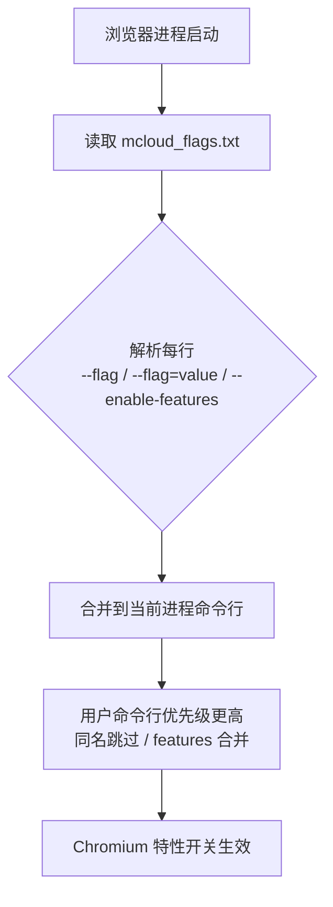
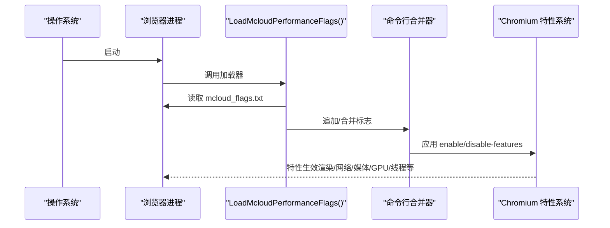
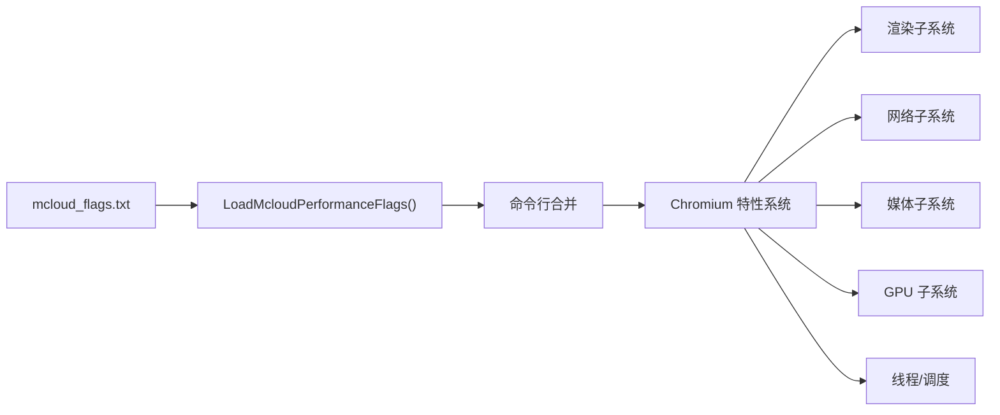

# 运行时优化

本文引用的文件

- [mcloud_flags.txt](https://github.com/Mcloud136/Mcloud-Browser/blob/main/mcloud_flags.txt)
- [chrome_main_delegate.cc](https://github.com/Mcloud136/Mcloud-Browser/blob/main/src/chrome/app/chrome_main_delegate.cc)
- [verify_builtin_flags.ps1](https://github.com/Mcloud136/Mcloud-Browser/blob/main/benchmark/tools/verify_builtin_flags.ps1)
- [CMDLINE_FLAGS_LIST.md](https://github.com/Mcloud136/Mcloud-Browser/blob/main/docs/CMDLINE_FLAGS_LIST.md)
- [README.md](https://github.com/Mcloud136/Mcloud-Browser/blob/main/README.md)
- [2026-06-19-performance-optimization-design.md](https://github.com/Mcloud136/Mcloud-Browser/blob/main/docs/superpowers/specs/2026-06-19-performance-optimization-design.md)
- [2026-06-20-release-notes-m150.md](https://github.com/Mcloud136/Mcloud-Browser/blob/main/docs/superpowers/specs/2026-06-20-release-notes-m150.md)
- [M151-opt-benchmark.md](https://github.com/Mcloud136/Mcloud-Browser/blob/main/docs/dev-logs/M151-opt-benchmark.md)

## 目录
1. [简介](#简介)
2. [项目结构](#项目结构)
3. [核心组件](#核心组件)
4. [架构总览](#架构总览)
5. [详细组件分析](#详细组件分析)
6. [依赖关系分析](#依赖关系分析)
7. [性能考量](#性能考量)
8. [故障排除指南](#故障排除指南)
9. [结论](#结论)
10. [附录](#附录)

## 简介
本文件系统性梳理 MCloud Browser 的运行时优化标志体系，围绕 mcloud_flags.txt 中的 66 项启动期优化开关，解释其作用、配置方式与对浏览器性能及资源使用的影响。内容覆盖启动优化、内存管理、网络、渲染、媒体播放、GPU、脚本执行、线程与服务等多个维度，并提供场景化组合建议、冲突检测方法与排障流程。

## 项目结构
- 运行时优化清单位于仓库根目录的 mcloud_flags.txt，按类别分组（冷启动、视频播放、渲染、内存、网络、图像、推测规则、V8、预加载/预热、脚本/加载速度、MSE/视频缓冲、GPU、媒体、线程、Service Worker、存储等）。
- 浏览器在启动早期从可执行文件同目录读取该文件，逐行解析并合并到进程命令行；用户命令行优先级更高，同名普通开关跳过，enable/disable-features 合并且用户条目在后优先。
- 验证脚本通过 headless 模式输出 chrome://version 信息，检查代表 feature 是否注入成功。

图表来源
- [chrome_main_delegate.cc:239-258](https://github.com/Mcloud136/Mcloud-Browser/blob/main/src/chrome/app/chrome_main_delegate.cc#L239-L258)
- [mcloud_flags.txt:1-120](https://github.com/Mcloud136/Mcloud-Browser/blob/main/mcloud_flags.txt#L1-L120)

章节来源
- [chrome_main_delegate.cc:239-258](https://github.com/Mcloud136/Mcloud-Browser/blob/main/src/chrome/app/chrome_main_delegate.cc#L239-L258)
- [mcloud_flags.txt:1-120](https://github.com/Mcloud136/Mcloud-Browser/blob/main/mcloud_flags.txt#L1-L120)

## 核心组件
- 运行时标志清单：mcloud_flags.txt 提供 66 条优化开关，涵盖多类性能目标。
- 启动注入器：chrome_main_delegate.cc 中 LoadMcloudPerformanceFlags() 负责读取并注入。
- 验证工具：verify_builtin_flags.ps1 用于验证内置标志是否生效。
- 参考文档：CMDLINE_FLAGS_LIST.md 提供 Chromium 命令行开关说明；README.md 给出推荐设置与基准结果；设计文档与发布说明提供背景与指标。

章节来源
- [mcloud_flags.txt:1-120](https://github.com/Mcloud136/Mcloud-Browser/blob/main/mcloud_flags.txt#L1-L120)
- [chrome_main_delegate.cc:239-258](https://github.com/Mcloud136/Mcloud-Browser/blob/main/src/chrome/app/chrome_main_delegate.cc#L239-L258)
- [verify_builtin_flags.ps1:1-32](https://github.com/Mcloud136/Mcloud-Browser/blob/main/benchmark/tools/verify_builtin_flags.ps1#L1-L32)
- [CMDLINE_FLAGS_LIST.md:1-800](https://github.com/Mcloud136/Mcloud-Browser/blob/main/docs/CMDLINE_FLAGS_LIST.md#L1-L800)
- [README.md:302-351](https://github.com/Mcloud136/Mcloud-Browser/blob/main/README.md#L302-L351)
- [2026-06-19-performance-optimization-design.md:60-126](https://github.com/Mcloud136/Mcloud-Browser/blob/main/docs/superpowers/specs/2026-06-19-performance-optimization-design.md#L60-L126)
- [2026-06-20-release-notes-m150.md:120-130](https://github.com/Mcloud136/Mcloud-Browser/blob/main/docs/superpowers/specs/2026-06-20-release-notes-m150.md#L120-L130)

## 架构总览
下图展示从启动到特性生效的关键路径，以及各优化类别如何影响子系统。

图表来源
- [chrome_main_delegate.cc:239-258](https://github.com/Mcloud136/Mcloud-Browser/blob/main/src/chrome/app/chrome_main_delegate.cc#L239-L258)
- [mcloud_flags.txt:1-120](https://github.com/Mcloud136/Mcloud-Browser/blob/main/mcloud_flags.txt#L1-L120)

## 详细组件分析
以下按类别逐项说明 mcloud_flags.txt 中的标志及其影响。为避免冗长代码片段，所有实现细节均通过“章节来源”指向对应文件行号。

### 启动优化
- 目标：缩短冷启动时间，减少首屏等待。
- 关键标志与作用要点
  - 预热渲染进程、提升浏览器进程优先级、提前建立 GPU 通道、延迟创建推测性渲染帧、跳过拼写/翻译初始化并将 GPU 流设为 UI 高优先级、空渲染进程保持可复用策略。
- 影响
  - 首屏渲染更快、导航更顺滑、启动阶段 CPU 占用更集中。
- 注意事项
  - 部分预热可能带来小幅内存占用上升，但收益通常优于代价。

章节来源
- [mcloud_flags.txt:8-14](https://github.com/Mcloud136/Mcloud-Browser/blob/main/mcloud_flags.txt#L8-L14)
- [2026-06-20-release-notes-m150.md:120-130](https://github.com/Mcloud136/Mcloud-Browser/blob/main/docs/superpowers/specs/2026-06-20-release-notes-m150.md#L120-L130)

### 视频播放优化
- 目标：降低后台媒体暂停、提升 Canvas/GPU 光栅化效率。
- 关键标志与作用要点
  - 禁止后台媒体挂起、启用 GPU 光栅化、Canvas 离屏光栅化。
- 影响
  - 视频/动画更流畅，CPU 压力下降，GPU 利用率提升。
- 注意事项
  - 在低端 GPU 或驱动异常时，需结合 GPU 相关标志调整。

章节来源
- [mcloud_flags.txt:16-19](https://github.com/Mcloud136/Mcloud-Browser/blob/main/mcloud_flags.txt#L16-L19)

### 渲染优化
- 目标：改善滚动/交互响应、控制不重要帧率、利用 DirectComposition。
- 关键标志与作用要点
  - 改进拖拽调度、抑制低优先级任务、节流不重要帧率、启用 DirectComposition。
- 影响
  - 滚动更跟手、界面响应更及时、合成路径更高效。
- 注意事项
  - 不同桌面环境/驱动下 DirectComposition 行为可能不同，必要时可回退。

章节来源
- [mcloud_flags.txt:21-25](https://github.com/Mcloud136/Mcloud-Browser/blob/main/mcloud_flags.txt#L21-L25)

### 内存优化
- 目标：降低驻留内存、提高回收效率、避免不必要缓存膨胀。
- 关键标志与作用要点
  - 标签页冻结与压力冻结、PartitionAlloc 零释放内存回收、内存回收器、提交限制丢弃、持续紧急丢弃、活跃槽排序、优先级继承锁、非主渲染器更低内存限制、回收旧预绘制瓦片、清理旧传输缓存条目。
- 影响
  - 多标签场景内存占用显著下降，长时间运行更稳定。
- 注意事项
  - 极端低内存设备可能触发更激进的丢弃策略，需结合实际页面复杂度评估。

章节来源
- [mcloud_flags.txt:27-38](https://github.com/Mcloud136/Mcloud-Browser/blob/main/mcloud_flags.txt#L27-L38)

### 网络优化
- 目标：加速 DNS、预取/预连接、后退/前进缓存命中。
- 关键标志与作用要点
  - 书签/新标签页触发预取、后退/前进缓存、NoStore 进入缓存控制、异步 DNS、Early Data。
- 影响
  - 导航与资源加载更快，重复访问体验更佳。
- 注意事项
  - 某些站点对预取/预连接敏感，若出现异常可针对性关闭相关项。

章节来源
- [mcloud_flags.txt:40-46](https://github.com/Mcloud136/Mcloud-Browser/blob/main/mcloud_flags.txt#L40-L46)

### 图像优化
- 目标：采用更高效的图像格式。
- 关键标志与作用要点
  - 启用 AVIF。
- 影响
  - 图片体积更小、解码更快（取决于站点支持）。
- 注意事项
  - 旧设备或受限环境可能不支持 AVIF，需监控兼容性。

章节来源
- [mcloud_flags.txt:48-49](https://github.com/Mcloud136/Mcloud-Browser/blob/main/mcloud_flags.txt#L48-L49)

### 推测规则
- 目标：基于规则进行资源推测加载。
- 关键标志与作用要点
  - 启用 SpeculationRules。
- 影响
  - 常见资源更早准备，首屏更快。
- 注意事项
  - 与网络预取/预连接协同工作，注意总体内存与带宽占用。

章节来源
- [mcloud_flags.txt:51-52](https://github.com/Mcloud136/Mcloud-Browser/blob/main/mcloud_flags.txt#L51-L52)

### V8 JavaScript 优化
- 目标：更快进入 JIT，提升脚本执行性能。
- 关键标志与作用要点
  - 调整 Maglev/Turbofan 阈值、启用 OSR-from-Maglev、Sparkplug+。
- 影响
  - JS 执行更快，页面交互更灵敏。
- 注意事项
  - 必须使用下划线命名（M151 确认），连字符写法不生效。

章节来源
- [mcloud_flags.txt:54-57](https://github.com/Mcloud136/Mcloud-Browser/blob/main/mcloud_flags.txt#L54-L57)
- [README.md:302-351](https://github.com/Mcloud136/Mcloud-Browser/blob/main/README.md#L302-L351)

### 启动预加载/预热
- 目标：提前准备常用资源与合成器，提升导航与 WebUI 加载速度。
- 关键标志与作用要点
  - 预渲染合成器预热（新标签页/书签栏）、重定向目标预连接、Top Chrome WebUI 预加载、书签预连接。
- 影响
  - 典型导航与 WebUI 打开更快。
- 注意事项
  - 预载类功能以内存换速度，真实站点场景下内存代价需关注；已移除三项高内存低收益项，保留其余低代价项。

章节来源
- [mcloud_flags.txt:59-67](https://github.com/Mcloud136/Mcloud-Browser/blob/main/mcloud_flags.txt#L59-L67)
- [M151-opt-benchmark.md:34-61](https://github.com/Mcloud136/Mcloud-Browser/blob/main/docs/dev-logs/M151-opt-benchmark.md#L34-L61)

### 脚本/加载速度
- 目标：多线程扫描、离线消费代码缓存、内联脚本缓存、系统字体预加载、HTTP 磁盘缓存预热、LCP 源自动预连接。
- 关键标志与作用要点
  - ThreadedPreloadScanner、ConsumeCodeCacheOffThread、InlineScriptCache、PreloadSystemFonts、HttpDiskCachePrewarming、LCPPAutoPreconnectLcpOrigin。
- 影响
  - 页面加载链路更短、I/O 更平滑。
- 注意事项
  - 与网络优化协同，注意总体 I/O 与缓存命中率。

章节来源
- [mcloud_flags.txt:69-76](https://github.com/Mcloud136/Mcloud-Browser/blob/main/mcloud_flags.txt#L69-L76)

### MSE/视频缓冲
- 目标：优化 MediaSource 对象生命周期与硬件解码缓冲。
- 关键标志与作用要点
  - 附加时撤销 MediaSource ObjectURL、减少硬件视频解码缓冲、JS 执行期间 DWB 进入 BackForwardCache。
- 影响
  - 视频播放更稳定，内存峰值更可控。
- 注意事项
  - 针对 Bilibili/YouTube 等场景优化明显。

章节来源
- [mcloud_flags.txt:78-81](https://github.com/Mcloud136/Mcloud-Browser/blob/main/mcloud_flags.txt#L78-L81)

### 视频解码修复（D3D12）
- 目标：规避特定 GPU 驱动缺陷导致的绿屏/花屏。
- 关键标志与作用要点
  - 显式禁用 D3D12VideoDecoder，回退至 D3D11VideoDecoder。
- 影响
  - 核显场景稳定性提升，硬解能力不受影响。
- 注意事项
  - 待上游修复或 GPU 黑名单完善后可移除。

章节来源
- [mcloud_flags.txt:83-88](https://github.com/Mcloud136/Mcloud-Browser/blob/main/mcloud_flags.txt#L83-L88)

### GPU 优化
- 目标：着色器缓存、命令缓冲区解析切片、Skia Graphite 预编译、资源池精确复用、高帧率请求、Graphite 渲染管线。
- 关键标志与作用要点
  - GpuShaderDiskCache、IncreasedCmdBufferParseSlice、SkiaGraphitePrecompilation、ResourcePoolPreferExactSizeReuse、HighFramerateRequestFromClient、SkiaGraphite。
- 影响
  - 图形处理吞吐提升、卡顿减少、帧率更稳。
- 注意事项
  - 与驱动/平台特性相关，遇到异常可逐步回退。

章节来源
- [mcloud_flags.txt:90-96](https://github.com/Mcloud136/Mcloud-Browser/blob/main/mcloud_flags.txt#L90-L96)

### 媒体优化
- 目标：平台 HEVC 解码、AV1 安全解密、专用媒体服务线程、原生 Opus 解码、加密媒体遮挡跟踪、MediaFoundation 批量读取与 D3D11 视频捕获零拷贝。
- 关键标志与作用要点
  - PlatformHEVCDecoderSupport、HardwareSecureDecryptionAv1、DedicatedMediaServiceThread、DirectOpusAudioDecoding、EncryptedMediaOcclusionTracking、MediaFoundationBatchRead、MediaFoundationD3D11VideoCaptureZeroCopy。
- 影响
  - 音视频解码更高效、功耗更低、延迟更小。
- 注意事项
  - 不同平台/后端能力差异较大，需结合设备能力选择。

章节来源
- [mcloud_flags.txt:98-105](https://github.com/Mcloud136/Mcloud-Browser/blob/main/mcloud_flags.txt#L98-L105)

### 线程优化
- 目标：IO 线程类型、Mojo 专用线程、自旋锁、关闭标签页优先级提升、不重要帧优先级降低。
- 关键标志与作用要点
  - IOThreadInteractiveThreadType、MojoDedicatedThread、BaseLockTrySpin、BoostClosingTabs、UnimportantFramesPriority。
- 影响
  - 整体并发更合理，关键路径更优先。
- 注意事项
  - 自旋锁在高竞争环境下需谨慎评估。

章节来源
- [mcloud_flags.txt:107-112](https://github.com/Mcloud136/Mcloud-Browser/blob/main/mcloud_flags.txt#L107-L112)

### Service Worker 优化
- 目标：导航预加载。
- 关键标志与作用要点
  - ServiceWorkerNavigationPreload。
- 影响
  - 首次导航更快，后续交互更流畅。
- 注意事项
  - 与网络预取/预连接协同，注意缓存一致性。

章节来源
- [mcloud_flags.txt:114-115](https://github.com/Mcloud136/Mcloud-Browser/blob/main/mcloud_flags.txt#L114-L115)

### 存储优化
- 目标：PWAFullCodeCache / ServiceWorkerScriptFullCodeCache 已移除（源码不存在）。
- 影响
  - 不再引入相关开销。
- 注意事项
  - 维护时避免添加无效标志。

章节来源
- [mcloud_flags.txt:117-120](https://github.com/Mcloud136/Mcloud-Browser/blob/main/mcloud_flags.txt#L117-L120)

## 依赖关系分析
- 启动注入依赖：chrome_main_delegate.cc 读取 mcloud_flags.txt 并合并到命令行；verify_builtin_flags.ps1 通过浏览器自报信息验证注入效果。
- 特性依赖：各 --enable-features= 依赖 Chromium 内部特性实现（如 content/gpu/media/base 等模块），具体来源见设计文档标注。
- 外部依赖：GPU 驱动、平台媒体后端（MediaFoundation/VAAPI/ANGLE 等）会影响渲染与媒体优化效果。

图表来源
- [chrome_main_delegate.cc:239-258](https://github.com/Mcloud136/Mcloud-Browser/blob/main/src/chrome/app/chrome_main_delegate.cc#L239-L258)
- [mcloud_flags.txt:1-120](https://github.com/Mcloud136/Mcloud-Browser/blob/main/mcloud_flags.txt#L1-L120)

章节来源
- [chrome_main_delegate.cc:239-258](https://github.com/Mcloud136/Mcloud-Browser/blob/main/src/chrome/app/chrome_main_delegate.cc#L239-L258)
- [verify_builtin_flags.ps1:1-32](https://github.com/Mcloud136/Mcloud-Browser/blob/main/benchmark/tools/verify_builtin_flags.ps1#L1-L32)
- [2026-06-19-performance-optimization-design.md:60-126](https://github.com/Mcloud136/Mcloud-Browser/blob/main/docs/superpowers/specs/2026-06-19-performance-optimization-design.md#L60-L126)

## 性能考量
- 空间-速度权衡：预载/预热类功能以内存换取速度，真实站点场景下内存代价更显著；已移除三项高内存低收益项后，内存占用进一步降低。
- 启动耗时：新增预热可能在首跑引入噪声，剔除首跑后中位数接近基线。
- 脚本执行：V8 阈值下调使脚本更快进入 JIT，理论提升执行性能，需结合基准验证。
- 基准数据：详见 M151-opt 基准报告，包含冷启动、内存、安装版验证等。

章节来源
- [M151-opt-benchmark.md:19-77](https://github.com/Mcloud136/Mcloud-Browser/blob/main/docs/dev-logs/M151-opt-benchmark.md#L19-L77)

## 故障排除指南
- 验证内置标志是否生效
  - 使用 verify_builtin_flags.ps1 以 headless 模式输出 chrome://version，检查代表 feature 是否出现在输出中。
  - 若缺少 mcloud_flags.txt 或加载失败，将导致内置优化未生效。
- 常见问题定位
  - 视频绿屏/花屏：检查是否启用了 D3D12VideoDecoder；在存在驱动缺陷的设备上应禁用该特性。
  - 预载内存偏高：若内存敏感，可评估移除 MultipleSpareRPHs、LoadingPredictorPrefetch、NewTabPageTriggerForPrerender2（已在当前配置移除）。
  - 网络异常：个别站点对预取/预连接敏感，可尝试关闭相关项排查。
  - 渲染卡顿：逐步回退 GPU/合成相关特性（如 SkiaGraphite、DirectComposition）定位问题。
- 用户命令行优先级
  - 同名普通开关会被用户命令行覆盖；enable/disable-features 会合并且用户条目在后优先。

章节来源
- [verify_builtin_flags.ps1:1-32](https://github.com/Mcloud136/Mcloud-Browser/blob/main/benchmark/tools/verify_builtin_flags.ps1#L1-L32)
- [chrome_main_delegate.cc:239-258](https://github.com/Mcloud136/Mcloud-Browser/blob/main/src/chrome/app/chrome_main_delegate.cc#L239-L258)
- [mcloud_flags.txt:83-88](https://github.com/Mcloud136/Mcloud-Browser/blob/main/mcloud_flags.txt#L83-L88)
- [M151-opt-benchmark.md:34-61](https://github.com/Mcloud136/Mcloud-Browser/blob/main/docs/dev-logs/M151-opt-benchmark.md#L34-L61)

## 结论
- mcloud_flags.txt 提供了覆盖启动、内存、网络、渲染、媒体、GPU、脚本、线程等多维度的 66 项运行时优化，配合启动注入机制在浏览器启动早期生效。
- 实测表明，预载/预热类功能在特定站点（如 bilibili）带来导航提速，但会带来一定内存代价；已移除高内存低收益项后，内存占用进一步优化。
- V8 参数修正确保脚本更快进入 JIT，提升交互性能。
- 建议在通用场景保持默认组合，针对内存敏感或特定站点问题做精细化调优，并通过验证脚本与基准测试闭环评估效果。

## 附录
- 场景化标志组合建议
  - 日常浏览（平衡性能与内存）
    - 保持默认 66 项；若内存敏感，关注预载类项的实际影响。
  - 视频/直播为主
    - 确保视频播放与媒体优化项开启；如遇核显绿屏，禁用 D3D12VideoDecoder。
  - 多标签重度使用
    - 强化内存优化（标签页冻结、PartitionAlloc 回收、提交限制丢弃等）；必要时降低预载强度。
  - 低配设备
    - 谨慎启用 GPU/合成相关特性；优先保证稳定性，再逐步叠加性能项。
  - 开发调试
    - 结合 CMDLINE_FLAGS_LIST.md 与 chrome://flags 进行细粒度开关；使用 verify_builtin_flags.ps1 验证注入。
- 标志冲突检测
  - 同一特性同时 enable 与 disable：以用户命令行在后为准；若内置与用户冲突，优先检查用户命令行。
  - 预载与网络预取：若出现资源争用或内存飙升，可逐个关闭预载/预取项定位。
  - GPU/媒体后端：不同平台/驱动表现差异大，建议按平台特性逐步切换。
- 排障流程
  - 步骤一：确认 mcloud_flags.txt 存在且可读；步骤二：运行 verify_builtin_flags.ps1 验证注入；步骤三：复现问题并记录受影响特性；步骤四：按类别逐步关闭可疑特性；步骤五：回归验证并记录变更。

章节来源
- [CMDLINE_FLAGS_LIST.md:1-800](https://github.com/Mcloud136/Mcloud-Browser/blob/main/docs/CMDLINE_FLAGS_LIST.md#L1-L800)
- [mcloud_flags.txt:1-120](https://github.com/Mcloud136/Mcloud-Browser/blob/main/mcloud_flags.txt#L1-L120)
- [verify_builtin_flags.ps1:1-32](https://github.com/Mcloud136/Mcloud-Browser/blob/main/benchmark/tools/verify_builtin_flags.ps1#L1-L32)