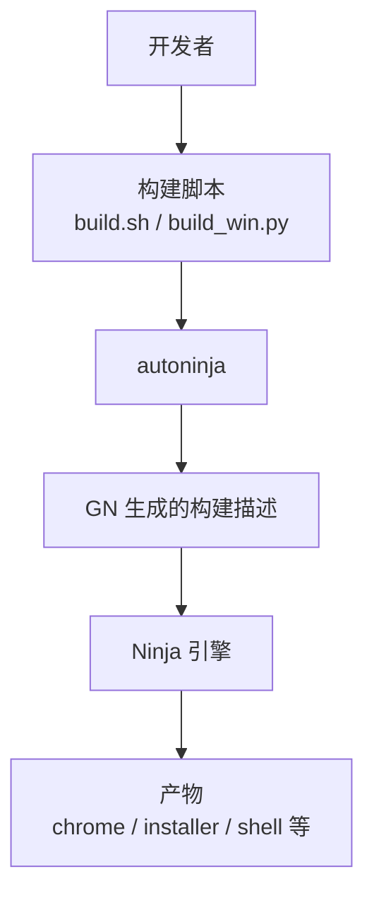
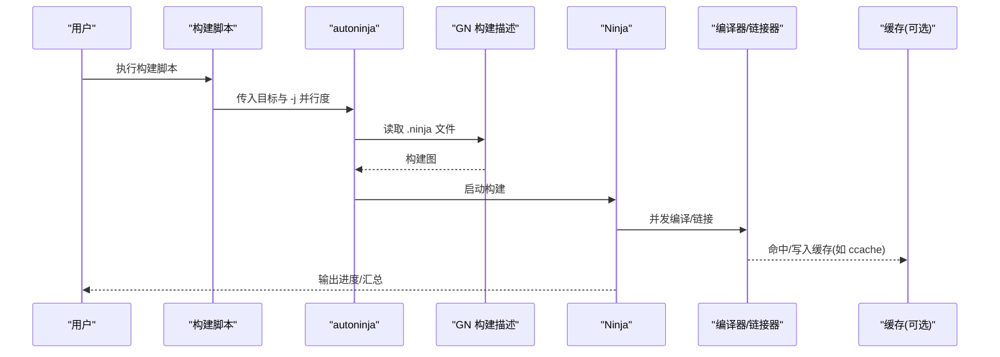
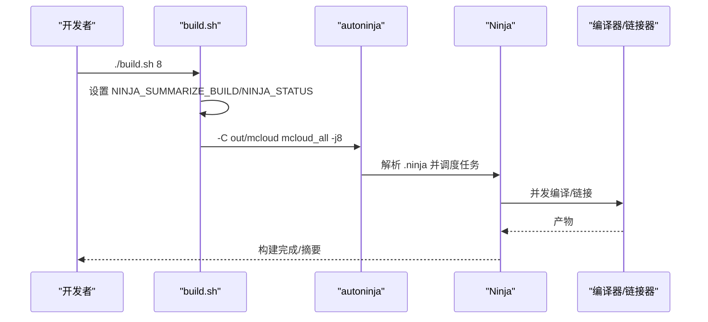
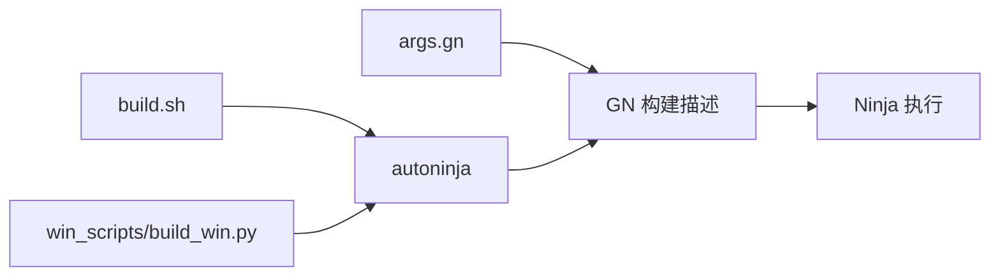

# Ninja 工具

本文引用的文件

- [README.md](https://github.com/Mcloud136/Mcloud-Browser/blob/main/README.md)
- [docs/BUILDING.md](https://github.com/Mcloud136/Mcloud-Browser/blob/main/docs/BUILDING.md)
- [build.sh](https://github.com/Mcloud136/Mcloud-Browser/blob/main/build.sh)
- [win_scripts/build_win.py](https://github.com/Mcloud136/Mcloud-Browser/blob/main/win_scripts/build_win.py)
- [args.gn](https://github.com/Mcloud136/Mcloud-Browser/blob/main/args.gn)
- [arm/android/args.list](https://github.com/Mcloud136/Mcloud-Browser/blob/main/arm/android/args.list)

## 目录
1. [简介](#简介)
2. [项目结构](#项目结构)
3. [核心组件](#核心组件)
4. [架构总览](#架构总览)
5. [详细组件分析](#详细组件分析)
6. [依赖关系分析](#依赖关系分析)
7. [性能考虑](#性能考虑)
8. [故障排查指南](#故障排查指南)
9. [结论](#结论)
10. [附录](#附录)

## 简介
本文件聚焦于本项目中构建系统的关键执行器与优化实践，围绕以下主题展开：
- autoninja 的作用与使用方法（并行编译、增量构建、缓存机制）
- Ninja 构建系统的优势与工作原理在本仓库中的体现
- 性能优化技巧（并行度设置、构建缓存配置、内存使用优化）
- 常见问题诊断与解决方案

本仓库在 Windows、Linux、macOS 和 Android 等平台均通过 GN 生成构建描述，再交由 Ninja 进行任务调度与执行。autoninja 作为封装层，自动注入平台/环境相关的最佳参数，简化开发者调用并提升构建效率。

## 项目结构
- 根级脚本统一入口：
  - Linux/macOS: build.sh
  - Windows: win_scripts/build_win.py
- 构建目标由 GN 生成，Ninja 负责实际编译链接；autoninja 被各脚本调用以驱动构建。
- 构建参数集中在 args.gn（示例），不同平台另有专用参数列表或脚本。

图表来源
- [build.sh:43-51](https://github.com/Mcloud136/Mcloud-Browser/blob/main/build.sh#L43-L51)
- [win_scripts/build_win.py:44-46](https://github.com/Mcloud136/Mcloud-Browser/blob/main/win_scripts/build_win.py#L44-L46)
- [docs/BUILDING.md:136-160](https://github.com/Mcloud136/Mcloud-Browser/blob/main/docs/BUILDING.md#L136-L160)

章节来源
- [docs/BUILDING.md:136-160](https://github.com/Mcloud136/Mcloud-Browser/blob/main/docs/BUILDING.md#L136-L160)
- [build.sh:43-51](https://github.com/Mcloud136/Mcloud-Browser/blob/main/build.sh#L43-L51)
- [win_scripts/build_win.py:44-46](https://github.com/Mcloud136/Mcloud-Browser/blob/main/win_scripts/build_win.py#L44-L46)

## 核心组件
- autoninja：Chromium/depot_tools 提供的包装器，自动选择最优的并行度、状态输出、汇总统计等参数，屏蔽平台差异。
- GN：构建描述语言，生成 .ninja 文件，定义目标、依赖、编译命令。
- Ninja：任务调度器，基于依赖图并发执行编译/链接任务，支持增量构建。
- 构建脚本：
  - Linux/macOS: build.sh 设置 NINJA_SUMMARIZE_BUILD、NINJA_STATUS，并调用 autoninja。
  - Windows: win_scripts/build_win.py 解析 CPU 核心数作为并行度，调用 autoninja。

章节来源
- [docs/BUILDING.md:136-160](https://github.com/Mcloud136/Mcloud-Browser/blob/main/docs/BUILDING.md#L136-L160)
- [docs/BUILDING.md:194-212](https://github.com/Mcloud136/Mcloud-Browser/blob/main/docs/BUILDING.md#L194-L212)
- [build.sh:43-51](https://github.com/Mcloud136/Mcloud-Browser/blob/main/build.sh#L43-L51)
- [win_scripts/build_win.py:41-46](https://github.com/Mcloud136/Mcloud-Browser/blob/main/win_scripts/build_win.py#L41-L46)

## 架构总览
下图展示了从开发者触发到最终产物的完整流程，包括并行度控制、增量构建与缓存策略。

图表来源
- [build.sh:43-51](https://github.com/Mcloud136/Mcloud-Browser/blob/main/build.sh#L43-L51)
- [win_scripts/build_win.py:41-46](https://github.com/Mcloud136/Mcloud-Browser/blob/main/win_scripts/build_win.py#L41-L46)
- [docs/BUILDING.md:162-190](https://github.com/Mcloud136/Mcloud-Browser/blob/main/docs/BUILDING.md#L162-L190)

## 详细组件分析

### autoninja 的作用与用法
- 作用
  - 自动推断合适的并行度与环境变量，减少手动调参成本。
  - 统一调用方式，屏蔽平台差异（Windows/Linux/macOS/Android）。
  - 配合 NINJA_SUMMARIZE_BUILD/NINJA_STATUS 提供构建摘要与实时进度。
- 用法
  - 常见形式：autoninja -C out/<配置> <目标> [-j 并行度]
  - 项目中多处直接调用，例如：
    - README 中用于生成 chrome 与 mini_installer
    - build.sh 中构建 mcloud_all 及打包目标
    - build_win.py 中根据 CPU 核心数决定 -j
    - docs/BUILDING.md 中给出 Linux 下构建 chrome_sandbox/chromedriver/mcloud_shell 的示例

章节来源
- [README.md:256-264](https://github.com/Mcloud136/Mcloud-Browser/blob/main/README.md#L256-L264)
- [README.md:278-281](https://github.com/Mcloud136/Mcloud-Browser/blob/main/README.md#L278-L281)
- [build.sh:43-51](https://github.com/Mcloud136/Mcloud-Browser/blob/main/build.sh#L43-L51)
- [win_scripts/build_win.py:41-46](https://github.com/Mcloud136/Mcloud-Browser/blob/main/win_scripts/build_win.py#L41-L46)
- [docs/BUILDING.md:194-212](https://github.com/Mcloud136/Mcloud-Browser/blob/main/docs/BUILDING.md#L194-L212)

### 并行编译控制
- 脚本层面
  - Linux/macOS: build.sh 通过 $@ 将并行度传递给 autoninja。
  - Windows: win_scripts/build_win.py 默认使用 os.cpu_count() 作为并行度。
- 环境变量
  - NINJA_SUMMARIZE_BUILD=1：启用构建摘要，便于定位瓶颈。
  - NINJA_STATUS：自定义进度格式，便于 CI/CD 日志可读性。
- 链接阶段内存压力
  - 可通过 GN 参数限制并发链接数量，避免 OOM（参考 args.list 中对 concurrent_links 的描述）。

章节来源
- [build.sh:43-51](https://github.com/Mcloud136/Mcloud-Browser/blob/main/build.sh#L43-L51)
- [win_scripts/build_win.py:41-46](https://github.com/Mcloud136/Mcloud-Browser/blob/main/win_scripts/build_win.py#L41-L46)
- [arm/android/args.list:1108-1115](https://github.com/Mcloud136/Mcloud-Browser/blob/main/arm/android/args.list#L1108-L1115)

### 增量构建
- 原理
  - GN 生成精确的目标依赖图；Ninja 仅重编译/链接受影响的节点。
- 实践
  - 修改源码后，再次运行同一构建目标即可触发增量构建。
  - 合理组织头文件与依赖声明，可显著提升增量构建速度。
- 验证
  - 使用 NINJA_SUMMARIZE_BUILD 查看是否触发了全量或增量构建。

章节来源
- [docs/BUILDING.md:136-160](https://github.com/Mcloud136/Mcloud-Browser/blob/main/docs/BUILDING.md#L136-L160)
- [docs/BUILDING.md:194-212](https://github.com/Mcloud136/Mcloud-Browser/blob/main/docs/BUILDING.md#L194-L212)

### 缓存机制
- 编译缓存（ccache）
  - 建议设置 CCACHE_BASEDIR 指向多工作区共享父目录，提高命中率。
  - 可结合 CCACHE_SLOPPINESS 调整规则，适配符号链接或多工作区场景。
- 链接器缓存
  - 使用 LLD（use_lld=true）提升链接速度（见 args.gn）。
- PGO/ThinLTO
  - 开启 ThinLTO 与 PGO 可减少二进制体积并提升运行时性能（见 args.gn）。

章节来源
- [docs/BUILDING.md:162-190](https://github.com/Mcloud136/Mcloud-Browser/blob/main/docs/BUILDING.md#L162-L190)
- [args.gn:33-35](https://github.com/Mcloud136/Mcloud-Browser/blob/main/args.gn#L33-L35)
- [args.gn:81-86](https://github.com/Mcloud136/Mcloud-Browser/blob/main/args.gn#L81-L86)

### 构建流程时序（以 Linux 为例）

图表来源
- [build.sh:43-51](https://github.com/Mcloud136/Mcloud-Browser/blob/main/build.sh#L43-L51)

## 依赖关系分析
- 脚本依赖
  - build.sh 依赖 GN 生成的 out/mcloud 目录与目标标签。
  - win_scripts/build_win.py 依赖 CR_DIR 环境变量与 out/mcloud。
- 构建参数依赖
  - args.gn 影响编译器特性、链接器、PGO、V8/Blink 优化开关等。
- 平台差异
  - Android 构建脚本通过 cr_build_jobs 传递并行度，并使用相同 autoninja 模式。

图表来源
- [args.gn:1-86](https://github.com/Mcloud136/Mcloud-Browser/blob/main/args.gn#L1-L86)
- [build.sh:43-51](https://github.com/Mcloud136/Mcloud-Browser/blob/main/build.sh#L43-L51)
- [win_scripts/build_win.py:41-46](https://github.com/Mcloud136/Mcloud-Browser/blob/main/win_scripts/build_win.py#L41-L46)

章节来源
- [args.gn:1-86](https://github.com/Mcloud136/Mcloud-Browser/blob/main/args.gn#L1-L86)
- [build.sh:43-51](https://github.com/Mcloud136/Mcloud-Browser/blob/main/build.sh#L43-L51)
- [win_scripts/build_win.py:41-46](https://github.com/Mcloud136/Mcloud-Browser/blob/main/win_scripts/build_win.py#L41-L46)

## 性能考虑
- 并行度设置
  - 使用 -j 指定并行度；Windows 脚本默认使用 CPU 核心数。
  - 在高内存机器上可适当提高 -j，但需关注链接阶段内存峰值。
- 构建缓存
  - 启用 ccache 并正确设置 CCACHE_BASEDIR/CCACHE_SLOPPINESS。
  - 使用 LLD（use_lld=true）加速链接。
- 编译器与链接器优化
  - 启用 ThinLTO、PGO（见 args.gn），可显著减小体积并提升性能。
  - 合理关闭调试信息（symbol_level=0）以减少 I/O 与内存占用。
- 增量构建
  - 保持头文件依赖准确，避免不必要的重新编译。
  - 利用 NINJA_SUMMARIZE_BUILD 观察增量效果。
- 链接阶段内存控制
  - 通过 concurrent_links 限制并发链接数量，防止 OOM。

章节来源
- [win_scripts/build_win.py:41-46](https://github.com/Mcloud136/Mcloud-Browser/blob/main/win_scripts/build_win.py#L41-L46)
- [docs/BUILDING.md:162-190](https://github.com/Mcloud136/Mcloud-Browser/blob/main/docs/BUILDING.md#L162-L190)
- [args.gn:16-20](https://github.com/Mcloud136/Mcloud-Browser/blob/main/args.gn#L16-L20)
- [args.gn:33-35](https://github.com/Mcloud136/Mcloud-Browser/blob/main/args.gn#L33-L35)
- [args.gn:81-86](https://github.com/Mcloud136/Mcloud-Browser/blob/main/args.gn#L81-L86)
- [arm/android/args.list:1108-1115](https://github.com/Mcloud136/Mcloud-Browser/blob/main/arm/android/args.list#L1108-L1115)

## 故障排查指南
- 构建缓慢
  - 检查是否启用了 ccache，确认 CCACHE_BASEDIR 设置正确。
  - 使用 NINJA_SUMMARIZE_BUILD 查看是否频繁全量构建。
  - 适当降低 -j 或限制 concurrent_links，缓解链接阶段内存压力。
- 内存不足（OOM）
  - 降低 -j 或限制并发链接数。
  - 关闭不必要的调试信息（symbol_level=0）。
  - 使用 LLD 替代传统链接器以提升链接效率。
- 增量构建失效
  - 检查头文件依赖是否正确声明。
  - 清理 out 目录后重试，排除缓存污染。
- 平台相关
  - Windows：确保 CR_DIR 指向正确的 Chromium 源码路径。
  - Android：通过 cr_build_jobs 控制并行度，注意交叉编译环境。

章节来源
- [docs/BUILDING.md:162-190](https://github.com/Mcloud136/Mcloud-Browser/blob/main/docs/BUILDING.md#L162-L190)
- [arm/android/args.list:1108-1115](https://github.com/Mcloud136/Mcloud-Browser/blob/main/arm/android/args.list#L1108-L1115)
- [win_scripts/build_win.py:34-46](https://github.com/Mcloud136/Mcloud-Browser/blob/main/win_scripts/build_win.py#L34-L46)

## 结论
- 本项目采用 GN+Ninja 的标准构建体系，autoninja 作为统一入口简化了跨平台构建。
- 通过合理的并行度、缓存与编译器/链接器优化，可在保证稳定性的前提下显著提升构建速度与产物质量。
- 建议在 CI/CD 中固定并行度与缓存策略，并结合 NINJA_SUMMARIZE_BUILD 持续监控构建健康度。

## 附录
- 常用命令参考
  - Linux/macOS: ./build.sh <并行度>
  - Windows: python win_scripts/build_win.py <并行度>
  - 直接调用: autoninja -C out/<配置> <目标> -j<并行度>
- 关键参数
  - use_lld=true：启用 LLD 链接器
  - thin_lto_enable_optimizations=true：启用 ThinLTO 优化
  - chrome_pgo_phase=2：PGO 第二阶段
  - symbol_level=0：发布版关闭调试符号

章节来源
- [build.sh:43-51](https://github.com/Mcloud136/Mcloud-Browser/blob/main/build.sh#L43-L51)
- [win_scripts/build_win.py:41-46](https://github.com/Mcloud136/Mcloud-Browser/blob/main/win_scripts/build_win.py#L41-L46)
- [args.gn:33-35](https://github.com/Mcloud136/Mcloud-Browser/blob/main/args.gn#L33-L35)
- [args.gn:81-86](https://github.com/Mcloud136/Mcloud-Browser/blob/main/args.gn#L81-L86)