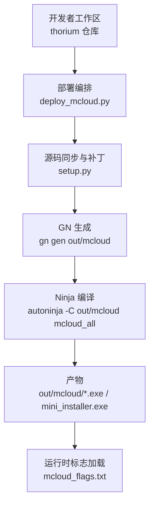
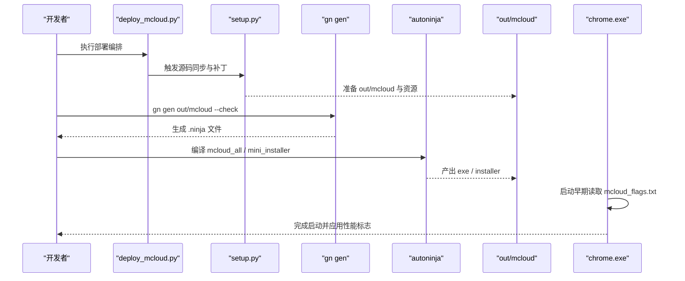
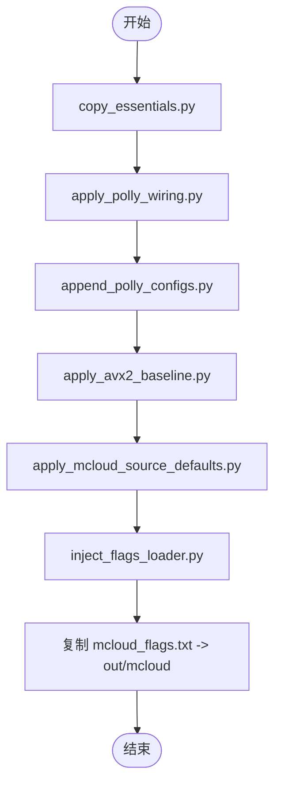
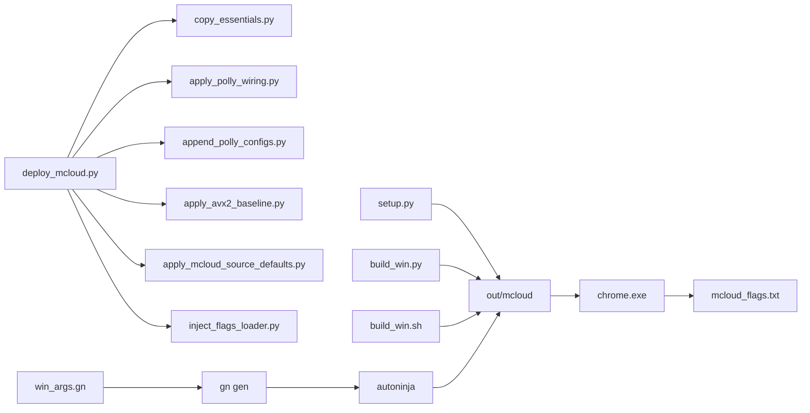

# 构建流水线

<cite>
**本文引用的文件**
- [deploy_mcloud.py](file://win_scripts/deploy_mcloud.py)
- [setup.py](file://win_scripts/setup.py)
- [build_win.py](file://win_scripts/build_win.py)
- [build_win.sh](file://build_win.sh)
- [copy_essentials.py](file://win_scripts/copy_essentials.py)
- [apply_mcloud_source_defaults.py](file://win_scripts/apply_mcloud_source_defaults.py)
- [inject_flags_loader.py](file://win_scripts/inject_flags_loader.py)
- [win_args.gn](file://win_args.gn)
- [args.gn](file://args.gn)
- [mcloud_flags.txt](file://mcloud_flags.txt)
- [BUILDING_WIN.md](file://docs/BUILDING_WIN.md)
- [build-pipeline-flow.md](file://docs/architecture/build-pipeline-flow.md)
</cite>

## 目录
1. [简介](#简介)
2. [项目结构](#项目结构)
3. [核心组件](#核心组件)
4. [架构总览](#架构总览)
5. [详细组件分析](#详细组件分析)
6. [依赖关系分析](#依赖关系分析)
7. [性能考虑](#性能考虑)
8. [故障排除指南](#故障排除指南)
9. [结论](#结论)
10. [附录](#附录)

## 简介
本文件面向 Windows 平台，系统化说明 MCloud Browser 的完整构建流水线：从源码部署、补丁应用、依赖与 PGO 配置，到 GN 生成与 Ninja 编译，最终产出可执行文件与安装包。重点解释部署编排器 deploy_mcloud.py 的职责与步骤顺序，autoninja 的使用方式与性能优化技巧，以及并行编译、增量构建、缓存机制等高级特性，并提供调优与排障建议。

## 项目结构
Windows 构建相关的关键脚本与配置集中在 win_scripts 目录与仓库根目录：
- 部署编排与注入：deploy_mcloud.py、copy_essentials.py、apply_mcloud_source_defaults.py、inject_flags_loader.py
- 源码同步与补丁：setup.py（复制源码、打补丁、下载 PGO）
- 构建入口：build_win.py（Windows）、build_win.sh（Bash 环境）
- 构建参数：win_args.gn（Windows）、args.gn（Linux，供参考）
- 运行时标志：mcloud_flags.txt（启动时加载的性能开关）
- 官方文档：docs/BUILDING_WIN.md（环境与 fetch/gclient 准备、gn/ninja 使用）
- 架构图：docs/architecture/build-pipeline-flow.md（端到端流程说明）

图表来源
- [deploy_mcloud.py:1-51](file://win_scripts/deploy_mcloud.py#L1-L51)
- [setup.py:73-412](file://win_scripts/setup.py#L73-L412)
- [build_win.py:34-51](file://win_scripts/build_win.py#L34-L51)
- [build_win.sh:42-59](file://build_win.sh#L42-L59)
- [mcloud_flags.txt:1-120](file://mcloud_flags.txt#L1-L120)

章节来源
- [BUILDING_WIN.md:15-233](file://docs/BUILDING_WIN.md#L15-L233)
- [build-pipeline-flow.md:15-44](file://docs/architecture/build-pipeline-flow.md#L15-L44)

## 核心组件
- 部署编排器 deploy_mcloud.py：统一入口，按固定顺序执行 7 步定点部署（幂等），确保上游 Chromium 树在任意基线下正确接入 MCloud 定制。
- 源码同步 setup.py：将 thorium 仓库中的源码与补丁复制到 chromium/src，并针对目标平台下载 PGO 配置文件。
- 构建入口 build_win.py / build_win.sh：封装 autoninja 调用，输出浏览器与安装程序。
- 构建参数 win_args.gn：定义 target_os/cpu、编译器选项、V8/FFmpeg/Widevine 等特性开关、Thin LTO、PGO 阶段与数据路径。
- 运行时标志 mcloud_flags.txt：启动早期由注入的代码读取并合并进命令行，实现“编译期 + 运行期”双链优化。

章节来源
- [deploy_mcloud.py:25-47](file://win_scripts/deploy_mcloud.py#L25-L47)
- [setup.py:73-412](file://win_scripts/setup.py#L73-L412)
- [build_win.py:34-51](file://win_scripts/build_win.py#L34-L51)
- [build_win.sh:42-59](file://build_win.sh#L42-L59)
- [win_args.gn:1-87](file://win_args.gn#L1-L87)
- [mcloud_flags.txt:1-120](file://mcloud_flags.txt#L1-L120)

## 架构总览
下图展示 Windows 构建流水线的端到端流程，包括部署、生成、编译与运行时标志加载。

图表来源
- [deploy_mcloud.py:25-47](file://win_scripts/deploy_mcloud.py#L25-L47)
- [setup.py:73-412](file://win_scripts/setup.py#L73-L412)
- [build_win.py:34-51](file://win_scripts/build_win.py#L34-L51)
- [mcloud_flags.txt:1-120](file://mcloud_flags.txt#L1-L120)

## 详细组件分析

### 部署编排器 deploy_mcloud.py
- 职责：作为唯一部署入口，按固定顺序依次执行 7 个步骤，任一失败立即中止；所有步骤幂等，可重复运行。
- 步骤顺序与作用：
  1) copy_essentials.py：仅复制 compiler_opt.gni（无上游对应物的专有声明）与 mcloud_flags.txt 到 CR_DIR/out/mcloud。
  2) apply_polly_wiring.py：为 polly/emit-relocs 进行 BUILDCONFIG.gn 接线。
  3) append_polly_configs.py：在 compiler/BUILD.gn 中追加 polly 定义与 import。
  4) apply_avx2_baseline.py：在 win/BUILD.gn 设置 AVX2+FMA3 基线（替换旧 SSE3）。
  5) apply_mcloud_source_defaults.py：对媒体与后台模式默认值进行定点修改，并校验 DoH 默认行为。
  6) inject_flags_loader.py：向 chrome_main_delegate.cc 注入内置 flags 加载器。
  7) 内联步骤：复制 mcloud_flags.txt 至 out/mcloud（运行时读取位置）。
- 关键设计：除 compiler_opt.gni 外不整体覆盖任何源文件，避免上游 API 漂移导致的构建失败。

图表来源
- [deploy_mcloud.py:25-47](file://win_scripts/deploy_mcloud.py#L25-L47)

章节来源
- [deploy_mcloud.py:1-51](file://win_scripts/deploy_mcloud.py#L1-L51)
- [copy_essentials.py:1-50](file://win_scripts/copy_essentials.py#L1-L50)
- [apply_mcloud_source_defaults.py:1-61](file://win_scripts/apply_mcloud_source_defaults.py#L1-L61)
- [inject_flags_loader.py:1-125](file://win_scripts/inject_flags_loader.py#L1-L125)

### 源码同步与补丁 setup.py
- 职责：将 thorium 仓库中的源码与补丁复制到 chromium/src，创建 out/mcloud，并根据目标平台下载 PGO 配置文件。
- 主要动作：
  - 复制 libjxl 源码、MCloud 源码子树（ash/chrome/components 等）、pak 工具与二进制。
  - 复制并应用一系列补丁（策略模板、FTP 支持、GPC、UI 更新、mini_installer、键盘快捷键、隐私沙盒禁用、崩溃修复等）。
  - 对 FFmpeg 应用 HEVC 相关补丁。
  - 根据是否指定 --woa/--avx512/--avx2 选择不同 PGO 下载与额外文件拷贝。
- 注意：该脚本提供历史兼容能力；推荐的新流程通过 deploy_mcloud.py 进行定点注入。

章节来源
- [setup.py:73-412](file://win_scripts/setup.py#L73-L412)

### 构建入口 build_win.py / build_win.sh
- build_win.py：Windows 原生 Python 入口，自动获取 CPU 数量作为并行度，调用 autoninja 编译 mcloud_all，再构建 setup 与 mini_installer。
- build_win.sh：Bash 环境下的等价脚本，设置 NINJA_SUMMARIZE_BUILD 与 NINJA_STATUS，编译 mcloud_all 与 mcloud_installer。
- 两者均依赖 out/mcloud 已存在且 args.gn 已就绪。

章节来源
- [build_win.py:34-51](file://win_scripts/build_win.py#L34-L51)
- [build_win.sh:42-59](file://build_win.sh#L42-L59)

### 构建参数 win_args.gn
- 目标平台与编译器：target_os=win、target_cpu=x64、is_clang=true、use_lld=true。
- 特性开关：启用 V8 优化（fast_torque、builtins_optimization、maglev、turbofan、wasm_simd256_revec）、WebUI 优化、FFmpeg/Widevine、HEVC/H.264/H.265、Dolby Vision、AC3/EAC3、MSE/MPEG-TS 解析器等。
- 链接与优化：thin_lto_enable_optimizations=true、text_section_splitting=true、exclude_unwind_tables=true。
- PGO：chrome_pgo_phase=2，pgo_data_path 指向下载的 profdata 文件。
- 其他：关闭调试符号、组件化构建、报告与字段试验测试配置等。

章节来源
- [win_args.gn:1-87](file://win_args.gn#L1-L87)

### 运行时标志 mcloud_flags.txt
- 作用：在浏览器启动早期由注入代码读取，逐行解析并合并到进程命令行。
- 合并规则：
  - enable/disable-features：内置列表在前，用户命令行在后，用户条目优先。
  - 普通开关：若用户已指定则跳过内置项。
  - 支持 --flag=value、引号包裹的值、注释行。
- 典型类别：冷启动优化、视频播放、渲染、内存、网络、图像、V8 JS 优化、预连接/预渲染、GPU 与媒体、线程与服务 Worker、存储等。

章节来源
- [mcloud_flags.txt:1-120](file://mcloud_flags.txt#L1-L120)
- [inject_flags_loader.py:34-96](file://win_scripts/inject_flags_loader.py#L34-L96)

## 依赖关系分析
- 脚本间依赖：
  - deploy_mcloud.py 依赖 copy_essentials.py、apply_polly_wiring.py、append_polly_configs.py、apply_avx2_baseline.py、apply_mcloud_source_defaults.py、inject_flags_loader.py。
  - setup.py 独立于部署编排，但会生成 out/mcloud 并下载 PGO 数据。
  - build_win.py / build_win.sh 依赖 out/mcloud 与 args.gn。
- 配置依赖：
  - win_args.gn 决定编译特性与 PGO 阶段；args.gn 为 Linux 参考。
  - mcloud_flags.txt 被注入代码在运行时读取。
- 外部依赖：
  - depot_tools（fetch/gclient）、Visual Studio 2022、Windows SDK、Python、Git Bash。

图表来源
- [deploy_mcloud.py:25-47](file://win_scripts/deploy_mcloud.py#L25-L47)
- [setup.py:73-412](file://win_scripts/setup.py#L73-L412)
- [build_win.py:34-51](file://win_scripts/build_win.py#L34-L51)
- [build_win.sh:42-59](file://build_win.sh#L42-L59)
- [win_args.gn:1-87](file://win_args.gn#L1-L87)
- [mcloud_flags.txt:1-120](file://mcloud_flags.txt#L1-L120)

## 性能考虑
- 并行编译：
  - 使用 autoninja -jN，N 通常等于 CPU 核心数；Windows 下可通过 build_win.py 自动检测或手动传入。
  - 在 bash 环境中可设置 NINJA_SUMMARIZE_BUILD=1 与 NINJA_STATUS 以增强构建摘要与进度显示。
- 增量构建：
  - 基于 GN/Ninja 的增量机制，仅重新编译受影响的目标；保持 out/mcloud 不变，避免全量重建。
- 缓存机制：
  - Thin LTO：win_args.gn 启用 thin_lto_enable_optimizations，有助于跨模块优化与链接速度。
  - 文本段分割：use_text_section_splitting=true，提升链接与体积优化效果。
  - PGO：chrome_pgo_phase=2，配合 pgo_data_path 指向的 profdata 文件，进行第二阶段优化。
- 构建参数调优：
  - 关闭不必要的调试与组件化构建，减少编译与链接开销。
  - 合理设置 symbol_level、enable_profiling、is_component_build 等。
- 运行时优化：
  - mcloud_flags.txt 提供大量性能开关，涵盖冷启动、渲染、内存、网络、媒体、V8 等，建议在发布前验证各项收益与稳定性。

章节来源
- [build_win.py:34-51](file://win_scripts/build_win.py#L34-L51)
- [build_win.sh:42-59](file://build_win.sh#L42-L59)
- [win_args.gn:1-87](file://win_args.gn#L1-L87)
- [mcloud_flags.txt:1-120](file://mcloud_flags.txt#L1-L120)

## 故障排除指南
- 环境变量与路径：
  - CR_DIR 必须指向 chromium/src；THOR_DIR 指向 thorium 仓库根。
  - 若 CR_DIR 未设置，脚本会使用默认路径（如 C:/src/chromium/src 或 D:\wxmuma\chromium-src\src）。
- 部署失败：
  - deploy_mcloud.py 任一步骤非零退出即中止；检查具体步骤日志定位问题。
  - 若 apply_* 脚本提示锚点缺失，说明上游变更导致匹配失败，需人工核对并更新脚本。
- 构建失败：
  - 确认 out/mcloud 已存在且 args.gn 正确；必要时先执行 gn gen out/mcloud --check。
  - 若 PGO 数据缺失，确保 setup.py 成功下载 profdata 并在 win_args.gn 中配置 pgo_data_path。
- 运行时标志未生效：
  - 确认 mcloud_flags.txt 位于 out/mcloud（或安装后 exe 同目录），且注入代码已成功写入 chrome_main_delegate.cc。
  - 检查合并规则：用户命令行参数优先，enable/disable-features 会被合并。
- 性能问题：
  - 调整 -j 参数与系统资源；关注 Defender 扫描影响（参考 BUILDING_WIN.md 的建议）。
  - 评估 Thin LTO、PGO、文本段分割等开关的收益与代价。

章节来源
- [deploy_mcloud.py:25-47](file://win_scripts/deploy_mcloud.py#L25-L47)
- [setup.py:73-412](file://win_scripts/setup.py#L73-L412)
- [BUILDING_WIN.md:275-283](file://docs/BUILDING_WIN.md#L275-L283)
- [inject_flags_loader.py:34-96](file://win_scripts/inject_flags_loader.py#L34-L96)

## 结论
本流水线通过 deploy_mcloud.py 将 MCloud 的定制以定点注入的方式安全地应用到任意上游 Chromium 基线，避免整体覆盖带来的漂移风险；setup.py 负责源码同步与补丁；build_win.py / build_win.sh 封装自动化构建；win_args.gn 与 mcloud_flags.txt 分别控制编译期与运行期优化。结合并行编译、增量构建、Thin LTO 与 PGO，可在保证稳定性的前提下获得最佳构建与运行性能。

## 附录
- 快速上手（Windows）：
  - 准备 Visual Studio 2022、Windows SDK、depot_tools、Git Bash。
  - 使用 fetch 获取 Chromium 源码，切换到 src。
  - 执行 setup.py 同步源码与补丁，下载 PGO。
  - 执行 deploy_mcloud.py 进行部署编排。
  - 执行 gn gen out/mcloud --check 生成构建文件。
  - 执行 build_win.py 或 build_win.sh 进行编译与打包。
- 参考文档：
  - docs/BUILDING_WIN.md：环境与构建指南。
  - docs/architecture/build-pipeline-flow.md：端到端流程图与维护说明。

章节来源
- [BUILDING_WIN.md:15-233](file://docs/BUILDING_WIN.md#L15-L233)
- [build-pipeline-flow.md:15-44](file://docs/architecture/build-pipeline-flow.md#L15-L44)