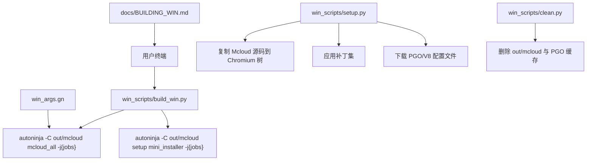
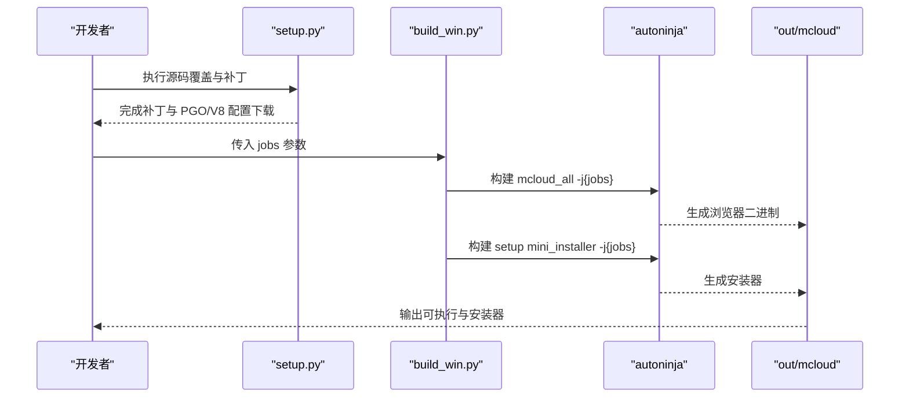
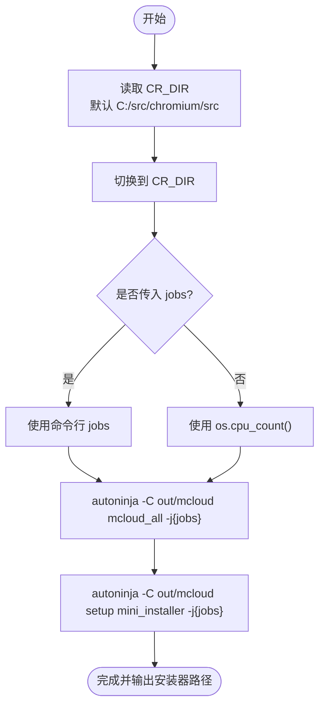
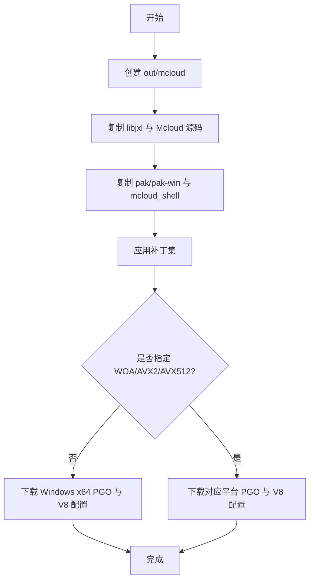
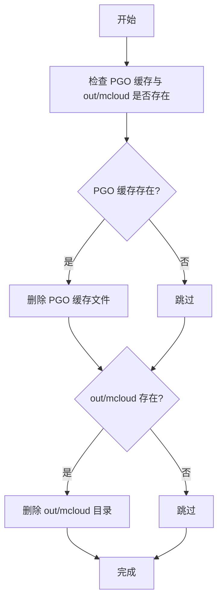
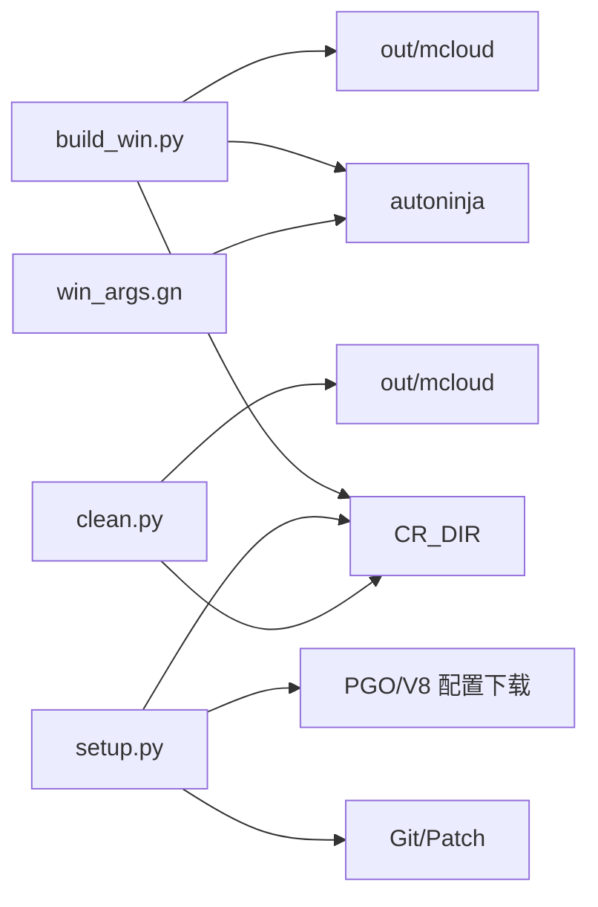

# Windows 构建脚本

<cite>
**本文引用的文件**
- [win_scripts/build_win.py](file://win_scripts/build_win.py)
- [win_scripts/setup.py](file://win_scripts/setup.py)
- [win_scripts/clean.py](file://win_scripts/clean.py)
- [win_scripts/copy_essentials.py](file://win_scripts/copy_essentials.py)
- [build_win.sh](file://build_win.sh)
- [docs/BUILDING_WIN.md](file://docs/BUILDING_WIN.md)
- [win_args.gn](file://win_args.gn)
- [docs/ABOUT_GN_ARGS.md](file://docs/ABOUT_GN_ARGS.md)
</cite>

## 目录
1. [简介](#简介)
2. [项目结构](#项目结构)
3. [核心组件](#核心组件)
4. [架构总览](#架构总览)
5. [详细组件分析](#详细组件分析)
6. [依赖关系分析](#依赖关系分析)
7. [性能考虑](#性能考虑)
8. [故障排查指南](#故障排查指南)
9. [结论](#结论)
10. [附录：使用示例与参数说明](#附录使用示例与参数说明)

## 简介
本文件面向在 Windows 环境下构建 Mcloud Browser 的开发者，聚焦于 win_scripts/build_win.py 的完整构建流程。内容涵盖源码目录设置（CR_DIR）、并行编译参数（jobs）配置、autoninja 命令执行、错误处理机制，以及基于仓库现有脚本与文档的性能优化建议与常见问题解决方案。同时提供可直接复用的命令行示例与参数说明，帮助快速完成本地构建与安装产物生成。

## 项目结构
Windows 构建相关的关键脚本与配置集中在以下位置：
- 构建入口：win_scripts/build_win.py
- 源码准备与补丁应用：win_scripts/setup.py
- 清理构建产物：win_scripts/clean.py
- 选择性拷贝关键文件：win_scripts/copy_essentials.py
- GN 构建参数：win_args.gn
- 平台构建文档：docs/BUILDING_WIN.md
- 构建参数详解：docs/ABOUT_GN_ARGS.md
- 跨平台参考脚本：build_win.sh（Linux/macOS 下的等价实现）

图表来源
- [win_scripts/build_win.py:34-50](file://win_scripts/build_win.py#L34-L50)
- [win_scripts/setup.py:66-122](file://win_scripts/setup.py#L66-L122)
- [win_scripts/setup.py:134-267](file://win_scripts/setup.py#L134-L267)
- [win_scripts/setup.py:287-403](file://win_scripts/setup.py#L287-L403)
- [win_scripts/clean.py:60-96](file://win_scripts/clean.py#L60-L96)
- [win_args.gn:1-87](file://win_args.gn#L1-L87)
- [docs/BUILDING_WIN.md:203-242](file://docs/BUILDING_WIN.md#L203-L242)

章节来源
- [win_scripts/build_win.py:1-51](file://win_scripts/build_win.py#L1-L51)
- [win_scripts/setup.py:1-412](file://win_scripts/setup.py#L1-L412)
- [win_scripts/clean.py:1-97](file://win_scripts/clean.py#L1-L97)
- [win_scripts/copy_essentials.py:1-50](file://win_scripts/copy_essentials.py#L1-L50)
- [win_args.gn:1-87](file://win_args.gn#L1-L87)
- [docs/BUILDING_WIN.md:1-288](file://docs/BUILDING_WIN.md#L1-L288)

## 核心组件
- build_win.py：Windows 端构建入口，负责解析 CR_DIR、计算 jobs、调用 autoninja 构建浏览器与安装器。
- setup.py：将 Mcloud 源码覆盖到 Chromium 树，应用补丁，按需下载 PGO/V8 配置，并支持 WOA/AVX2/AVX512 变体。
- clean.py：清理 out/mcloud 与 PGO 缓存，便于干净重建。
- copy_essentials.py：选择性拷贝必要构建文件与标志文件，避免整体覆盖导致的漂移问题。
- win_args.gn：定义目标平台、CPU、编译器选项、媒体编解码、Widevine、PGO 等构建参数。
- BUILDING_WIN.md：官方 Windows 构建步骤与注意事项，包括环境要求、depot_tools、gn args 配置与运行方式。
- ABOUT_GN_ARGS.md：GN 参数详细说明，解释各开关对构建与性能的影响。

章节来源
- [win_scripts/build_win.py:1-51](file://win_scripts/build_win.py#L1-L51)
- [win_scripts/setup.py:1-412](file://win_scripts/setup.py#L1-L412)
- [win_scripts/clean.py:1-97](file://win_scripts/clean.py#L1-L97)
- [win_scripts/copy_essentials.py:1-50](file://win_scripts/copy_essentials.py#L1-L50)
- [win_args.gn:1-87](file://win_args.gn#L1-L87)
- [docs/BUILDING_WIN.md:1-288](file://docs/BUILDING_WIN.md#L1-L288)
- [docs/ABOUT_GN_ARGS.md:1-174](file://docs/ABOUT_GN_ARGS.md#L1-L174)

## 架构总览
Windows 构建的整体流程如下：
- 准备阶段：通过 setup.py 将 Mcloud 源码复制到 Chromium 树，应用补丁，并根据目标平台下载 PGO/V8 配置。
- 配置阶段：通过 gn args 生成 out/mcloud 构建目录与 Ninja 规则，win_args.gn 提供默认参数。
- 构建阶段：build_win.py 调用 autoninja 并行编译浏览器主程序与安装器。
- 输出阶段：产物位于 out/mcloud，包含可执行程序与 mini_installer。

图表来源
- [win_scripts/setup.py:66-122](file://win_scripts/setup.py#L66-L122)
- [win_scripts/setup.py:134-267](file://win_scripts/setup.py#L134-L267)
- [win_scripts/setup.py:287-403](file://win_scripts/setup.py#L287-L403)
- [win_scripts/build_win.py:34-50](file://win_scripts/build_win.py#L34-L50)
- [docs/BUILDING_WIN.md:203-242](file://docs/BUILDING_WIN.md#L203-L242)

## 详细组件分析

### build_win.py 构建流程
- 环境变量与源码目录：从 CR_DIR 获取 Chromium 源码路径，默认值为 C:/src/chromium/src。
- 工作目录切换：切换到 CR_DIR 后执行构建。
- 并行度计算：jobs 取自命令行第一个参数；若未提供则使用 os.cpu_count()。
- 构建命令：
  - 第一次调用：autoninja -C out/mcloud mcloud_all -j{jobs}
  - 第二次调用：autoninja -C out/mcloud setup mini_installer -j{jobs}
- 错误处理：封装 try_run 与 fail，当子进程返回非零时打印失败信息并以退出码 111 终止。
- 输出提示：完成后打印安装器所在目录。

图表来源
- [win_scripts/build_win.py:34-50](file://win_scripts/build_win.py#L34-L50)

章节来源
- [win_scripts/build_win.py:1-51](file://win_scripts/build_win.py#L1-L51)

### setup.py 源码准备与补丁
- 源码目录：CR_DIR 指向 Chromium 源码；THOR_DIR 指向 Mcloud 源码，默认 %USERPROFILE%/mcloud。
- 创建输出目录：确保 out/mcloud 存在。
- 复制 libjxl 与 Mcloud 源码：将 ash、chrome、components、content、extensions、media、net、sandbox、services、third_party、tools、ui、v8 等目录复制到 Chromium 树对应位置。
- 复制辅助工具：pak、pak-win 等二进制与 mcloud_shell 资源。
- 应用补丁：批量复制补丁文件并执行 git apply --reject，覆盖策略模板、FTP 支持、GPC、UI 更新、下载栏恢复、mini_installer、键盘快捷键、隐私沙盒禁用、WebUI、Windows 更新器、崩溃修复等。
- 下载 PGO/V8 配置：默认下载 Windows x64 的 PGO 与 V8 内置函数 PGO 配置；针对 WOA、AVX2、AVX512 分别下载对应平台的 PGO。
- 变体支持：--woa、--avx512、--avx2 会触发相应目录与配置复制与下载。

图表来源
- [win_scripts/setup.py:66-122](file://win_scripts/setup.py#L66-L122)
- [win_scripts/setup.py:134-267](file://win_scripts/setup.py#L134-L267)
- [win_scripts/setup.py:287-403](file://win_scripts/setup.py#L287-L403)

章节来源
- [win_scripts/setup.py:1-412](file://win_scripts/setup.py#L1-L412)

### clean.py 清理逻辑
- 清理范围：删除 chrome/build/pgo_profiles 中的 PGO 缓存文件与 out/mcloud 目录。
- 安全删除：逐个文件删除或递归删除目录，遇到异常立即报错并退出。
- 适用场景：需要彻底重建或释放磁盘空间时使用。

图表来源
- [win_scripts/clean.py:60-96](file://win_scripts/clean.py#L60-L96)

章节来源
- [win_scripts/clean.py:1-97](file://win_scripts/clean.py#L1-L97)

### copy_essentials.py 选择性拷贝
- 目的：仅拷贝必要的构建优化声明文件与标志文件，避免整体覆盖导致上游漂移。
- 行为：根据 CR_DIR 与 THOR_DIR 定位源与目标，拷贝 compiler_opt.gni 与 mcloud_flags.txt（若存在）。
- 优势：幂等、最小化变更，降低构建不稳定风险。

章节来源
- [win_scripts/copy_essentials.py:1-50](file://win_scripts/copy_essentials.py#L1-L50)

### win_args.gn 构建参数
- 目标平台与 CPU：target_os=win，target_cpu=x64。
- 编译器与链接器：is_clang=true，use_lld=true，win_enable_cfg_guards=true。
- 优化与安全：thin_lto=true，use_text_section_splitting=true，symbol_level=0，exclude_unwind_tables=true。
- 媒体与 DRM：proprietary_codecs=true，enable_widevine=true，bundle_widevine_cdm=true，enable_hevc_parser_and_hw_decoder=true。
- PGO：chrome_pgo_phase=2，pgo_data_path 指向下载的 profdata 文件。
- 其他：enable_rust=true，v8_* 系列优化开关启用。

章节来源
- [win_args.gn:1-87](file://win_args.gn#L1-L87)
- [docs/ABOUT_GN_ARGS.md:1-174](file://docs/ABOUT_GN_ARGS.md#L1-L174)

## 依赖关系分析
- build_win.py 依赖：
  - CR_DIR 环境变量（默认 C:/src/chromium/src）
  - depot_tools 提供的 autoninja/gclient 等工具
  - out/mcloud 目录与 GN 生成的构建规则
- setup.py 依赖：
  - CR_DIR 与 THOR_DIR
  - Git 与 Python 3
  - 补丁文件与 PGO/V8 配置文件下载工具
- clean.py 依赖：
  - CR_DIR
  - 文件系统权限以删除 out/mcloud 与 PGO 缓存
- 外部依赖：
  - Visual Studio 2022 与 Windows SDK（按 docs/BUILDING_WIN.md 要求）
  - depot_tools PATH 配置与 DEPOT_TOOLS_WIN_TOOLCHAIN=0

图表来源
- [win_scripts/build_win.py:34-50](file://win_scripts/build_win.py#L34-L50)
- [win_scripts/setup.py:66-122](file://win_scripts/setup.py#L66-L122)
- [win_scripts/setup.py:287-403](file://win_scripts/setup.py#L287-L403)
- [win_scripts/clean.py:60-96](file://win_scripts/clean.py#L60-L96)
- [win_args.gn:1-87](file://win_args.gn#L1-L87)

章节来源
- [win_scripts/build_win.py:1-51](file://win_scripts/build_win.py#L1-L51)
- [win_scripts/setup.py:1-412](file://win_scripts/setup.py#L1-L412)
- [win_scripts/clean.py:1-97](file://win_scripts/clean.py#L1-L97)
- [win_args.gn:1-87](file://win_args.gn#L1-L87)

## 性能考虑
- 并行度调优（jobs）：
  - 推荐设置为 CPU 核心数或略高（例如 1.5 倍），但需结合内存与磁盘 IO 评估。
  - 可通过 build_win.py 的第一个参数传入 jobs，或在命令行直接指定。
- PGO 与 ThinLTO：
  - 使用 chrome_pgo_phase=2 与 thin_lto=true 可获得更好的运行时性能与体积优化。
  - 确保 pgo_data_path 指向正确的 profdata 文件（由 setup.py 下载）。
- 链接器与编译器：
  - use_lld=true 与 is_clang=true 提升构建速度与稳定性。
  - exclude_unwind_tables=true 与 symbol_level=0 减少体积与提升性能。
- 媒体与解码：
  - 启用 proprietary_codecs、enable_hevc_parser_and_hw_decoder 等以获得更广泛的媒体支持。
- 构建缓存与增量：
  - 避免频繁删除 out/mcloud；仅在必要时使用 clean.py 清理。
  - 保持 GN 配置稳定，减少不必要的重新生成。

[本节为通用性能指导，不直接分析具体文件]

## 故障排查指南
- 常见错误与处理：
  - 子进程失败：try_run 捕获非零退出码并调用 fail，输出“Failed {command}”并以 111 退出。检查命令拼写、依赖工具是否在 PATH、权限与磁盘空间。
  - CR_DIR 不正确：确认环境变量指向有效的 Chromium 源码目录；默认 C:/src/chromium/src。
  - depot_tools 未正确安装：确保 depot_tools 已解压至 C:\src\depot_tools，PATH 前置且 DEPOT_TOOLS_WIN_TOOLCHAIN=0。
  - Visual Studio 与 SDK：按 docs/BUILDING_WIN.md 安装 VS2022 与 Windows SDK 10.1.22621.2428，并启用调试工具。
  - Python 冲突：确保 depot_tools 的 python.bat 优先于系统 Python；关闭 App Execution Aliases 中 python.exe/python3.exe 的别名。
  - PGO 缺失：运行 setup.py 下载 PGO 与 V8 配置；如仍失败，手动执行 tools/update_pgo_profiles.py 与 v8/tools/builtins-pgo/download_profiles.py。
  - 补丁冲突：setup.py 使用 git apply --reject 容忍部分冲突；检查 .rej 文件并手动修复。
- 日志与诊断：
  - 查看控制台输出，定位失败命令与原因。
  - 使用 gn ls out/mcloud 列出可用目标，验证构建配置是否正确。
  - 参考 docs/BUILDING_WIN.md 的调试与性能分析建议。

章节来源
- [win_scripts/build_win.py:12-21](file://win_scripts/build_win.py#L12-L21)
- [win_scripts/setup.py:134-267](file://win_scripts/setup.py#L134-L267)
- [docs/BUILDING_WIN.md:103-115](file://docs/BUILDING_WIN.md#L103-L115)
- [docs/BUILDING_WIN.md:275-283](file://docs/BUILDING_WIN.md#L275-L283)

## 结论
win_scripts/build_win.py 提供了简洁可靠的 Windows 构建入口，配合 setup.py 的源码准备与补丁应用、clean.py 的清理能力、以及 win_args.gn 的构建参数，形成完整的本地构建闭环。通过合理设置 CR_DIR、jobs 与 GN 参数，并结合 PGO/ThinLTO 等优化手段，可在保证构建稳定性的前提下获得高性能产物。遇到问题时，依据本文的故障排查指南逐步定位与解决。

[本节为总结性内容，不直接分析具体文件]

## 附录：使用示例与参数说明
- 基本构建流程（Windows）：
  - 准备源码与补丁：python win_scripts/setup.py [--woa|--avx2|--avx512]
  - 配置 GN 参数：gn args out\mcloud（编辑 win_args.gn 或追加自定义参数）
  - 执行构建：python win_scripts\build_win.py [jobs]
  - 运行或安装：out\mcloud\mcloud.exe 或 out\mcloud\mini_installer.exe
- 参数说明：
  - CR_DIR：Chromium 源码目录，默认 C:/src/chromium/src
  - THOR_DIR：Mcloud 源码目录，默认 %USERPROFILE%/mcloud
  - jobs：并行编译线程数，默认 os.cpu_count()
  - setup.py 可选参数：--woa（Windows on ARM）、--avx2（AVX2 基线）、--avx512（AVX-512 基线）
- 参考命令（来自文档）：
  - 手动构建目标：autoninja -C out\mcloud mcloud chromedriver mcloud_shell setup mini_installer -j8
  - 清理构建：python win_scripts\clean.py
- 注意事项：
  - 首次构建前请确保 depot_tools、Visual Studio、SDK 与 Python 环境正确配置。
  - PGO 配置文件需在 setup.py 阶段下载；如需自定义，修改 win_args.gn 中的 pgo_data_path。
  - 如遇 Defender 扫描影响构建速度，可参考 docs/BUILDING_WIN.md 的性能分析建议。

章节来源
- [docs/BUILDING_WIN.md:203-242](file://docs/BUILDING_WIN.md#L203-L242)
- [win_scripts/build_win.py:24-50](file://win_scripts/build_win.py#L24-L50)
- [win_scripts/setup.py:51-70](file://win_scripts/setup.py#L51-L70)
- [win_scripts/setup.py:287-403](file://win_scripts/setup.py#L287-L403)
- [win_scripts/clean.py:51-96](file://win_scripts/clean.py#L51-L96)
- [win_args.gn:1-87](file://win_args.gn#L1-L87)