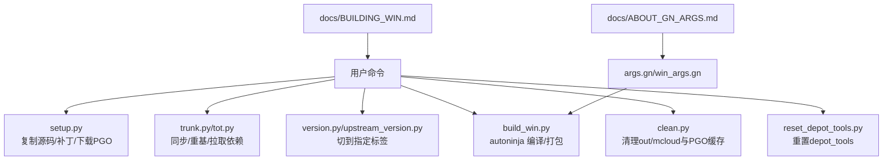
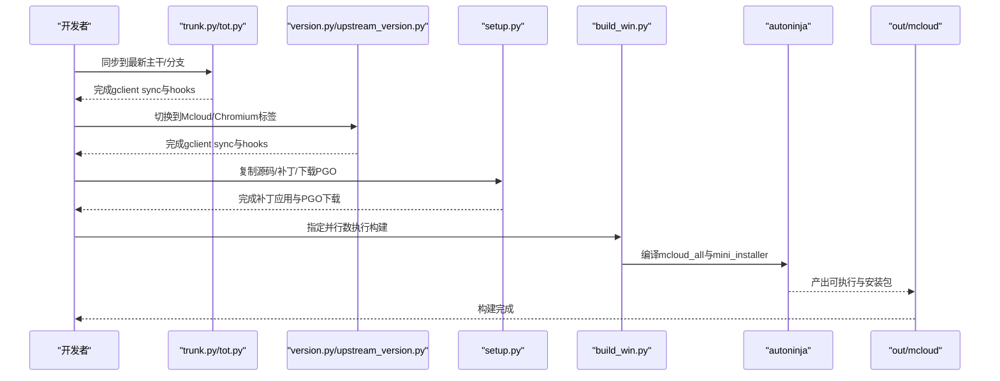
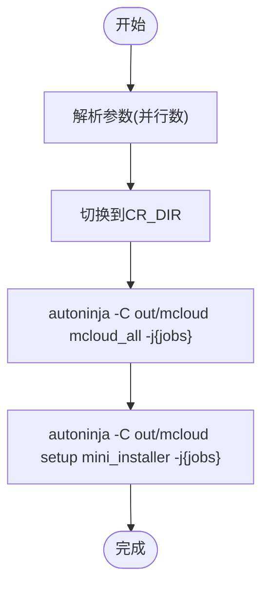
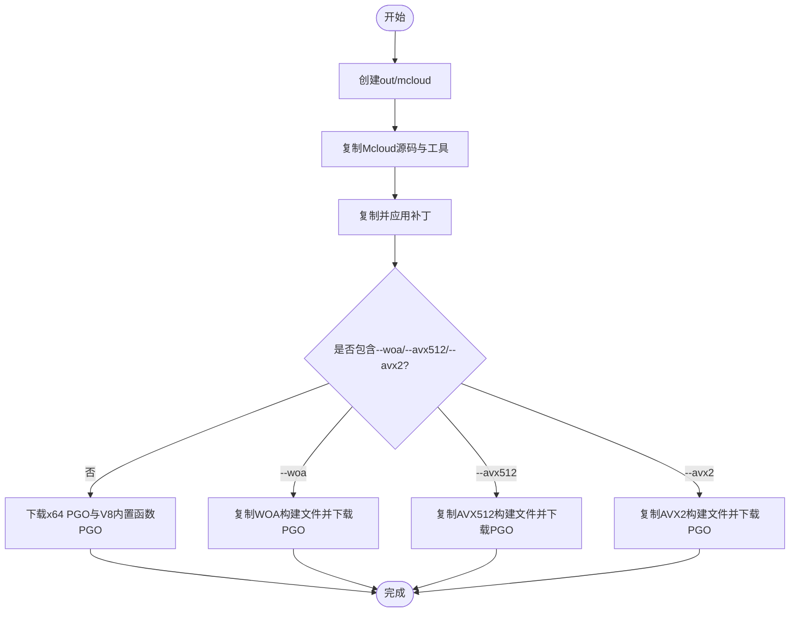
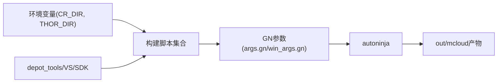

# 构建脚本

本文引用的文件

- [win_scripts/build_win.py](https://github.com/Mcloud136/Mcloud-Browser/blob/main/win_scripts/build_win.py)
- [win_scripts/setup.py](https://github.com/Mcloud136/Mcloud-Browser/blob/main/win_scripts/setup.py)
- [win_scripts/tot.py](https://github.com/Mcloud136/Mcloud-Browser/blob/main/win_scripts/tot.py)
- [win_scripts/trunk.py](https://github.com/Mcloud136/Mcloud-Browser/blob/main/win_scripts/trunk.py)
- [win_scripts/version.py](https://github.com/Mcloud136/Mcloud-Browser/blob/main/win_scripts/version.py)
- [win_scripts/upstream_version.py](https://github.com/Mcloud136/Mcloud-Browser/blob/main/win_scripts/upstream_version.py)
- [win_scripts/clean.py](https://github.com/Mcloud136/Mcloud-Browser/blob/main/win_scripts/clean.py)
- [win_scripts/reset_depot_tools.py](https://github.com/Mcloud136/Mcloud-Browser/blob/main/win_scripts/reset_depot_tools.py)
- [args.gn](https://github.com/Mcloud136/Mcloud-Browser/blob/main/args.gn)
- [win_args.gn](https://github.com/Mcloud136/Mcloud-Browser/blob/main/win_args.gn)
- [docs/BUILDING_WIN.md](https://github.com/Mcloud136/Mcloud-Browser/blob/main/docs/BUILDING_WIN.md)
- [docs/ABOUT_GN_ARGS.md](https://github.com/Mcloud136/Mcloud-Browser/blob/main/docs/ABOUT_GN_ARGS.md)

## 目录
1. [简介](#简介)
2. [项目结构](#项目结构)
3. [核心组件](#核心组件)
4. [架构总览](#架构总览)
5. [详细组件分析](#详细组件分析)
6. [依赖关系分析](#依赖关系分析)
7. [性能与优化](#性能与优化)
8. [常见构建场景与示例](#常见构建场景与示例)
9. [故障排除指南](#故障排除指南)
10. [结论](#结论)

## 简介
本文件面向在 Windows 平台构建 Mcloud Browser（基于 Chromium）的开发者与维护者，系统化说明构建脚本的工作流程、参数配置、版本管理、并行编译与链接优化方法，并提供常见构建场景的使用示例与故障排除建议。重点覆盖：
- build_win.py 的完整构建流程（源码获取、依赖安装、编译配置、并行编译、链接优化）
- setup.py 的环境初始化功能（复制源码、打补丁、下载 PGO 等）
- tot.py 与 trunk.py 的版本管理与同步机制
- 构建参数与自定义选项（GN args）
- 性能调优方法与常见问题排查

## 项目结构
Windows 构建相关脚本集中在 win_scripts 目录，配合根目录的 GN 配置文件与文档完成环境准备、版本切换、构建与清理工作。关键文件职责如下：
- build_win.py：调用 autoninja 执行编译与打包目标
- setup.py：将 Mcloud 源码与补丁复制到 Chromium 树，并下载 PGO 数据
- tot.py / trunk.py：同步到最新主干或指定标签，运行 gclient 钩子
- version.py / upstream_version.py：切换到当前 Mcloud/Chromium 对应标签
- clean.py / reset_depot_tools.py：清理构建产物与重置工具链
- args.gn / win_args.gn：定义跨平台与 Windows 专用构建参数
- docs/BUILDING_WIN.md：Windows 构建指南与步骤说明
- docs/ABOUT_GN_ARGS.md：GN 参数详解与优化建议

图表来源
- [win_scripts/setup.py:73-126](https://github.com/Mcloud136/Mcloud-Browser/blob/main/win_scripts/setup.py#L73-L126)
- [win_scripts/trunk.py:52-80](https://github.com/Mcloud136/Mcloud-Browser/blob/main/win_scripts/trunk.py#L52-L80)
- [win_scripts/tot.py:43-68](https://github.com/Mcloud136/Mcloud-Browser/blob/main/win_scripts/tot.py#L43-L68)
- [win_scripts/version.py:63-96](https://github.com/Mcloud136/Mcloud-Browser/blob/main/win_scripts/version.py#L63-L96)
- [win_scripts/build_win.py:39-50](https://github.com/Mcloud136/Mcloud-Browser/blob/main/win_scripts/build_win.py#L39-L50)
- [win_scripts/clean.py:60-92](https://github.com/Mcloud136/Mcloud-Browser/blob/main/win_scripts/clean.py#L60-L92)
- [win_scripts/reset_depot_tools.py:70-90](https://github.com/Mcloud136/Mcloud-Browser/blob/main/win_scripts/reset_depot_tools.py#L70-L90)
- [args.gn:1-87](https://github.com/Mcloud136/Mcloud-Browser/blob/main/args.gn#L1-L87)
- [win_args.gn:1-87](https://github.com/Mcloud136/Mcloud-Browser/blob/main/win_args.gn#L1-L87)
- [docs/BUILDING_WIN.md:175-233](https://github.com/Mcloud136/Mcloud-Browser/blob/main/docs/BUILDING_WIN.md#L175-L233)
- [docs/ABOUT_GN_ARGS.md:161-174](https://github.com/Mcloud136/Mcloud-Browser/blob/main/docs/ABOUT_GN_ARGS.md#L161-L174)

章节来源
- [docs/BUILDING_WIN.md:175-233](https://github.com/Mcloud136/Mcloud-Browser/blob/main/docs/BUILDING_WIN.md#L175-L233)
- [docs/ABOUT_GN_ARGS.md:161-174](https://github.com/Mcloud136/Mcloud-Browser/blob/main/docs/ABOUT_GN_ARGS.md#L161-L174)

## 核心组件
- build_win.py：封装构建入口，自动选择并行度，调用 autoninja 生成 mcloud_all 与 mini_installer
- setup.py：环境初始化，复制 Mcloud 源码与补丁，应用 FFmpeg 补丁，下载 PGO 数据，支持 WOA/AVX2/AVX512 变体
- tot.py：同步到 Chromium 最新主干（Tip-of-tree），清理子模块并运行 hooks
- trunk.py：类似 tot.py，但额外删除 Mcloud 特定目录（如 third_party/pak）后同步
- version.py：切换到当前 Mcloud 对应的 Chromium 标签，并同步依赖
- upstream_version.py：切换到上游 Chromium 标签，用于对齐上游版本
- clean.py：清理 out/mcloud 与 PGO 缓存
- reset_depot_tools.py：删除 depot_tools、gsutil、vpython 缓存并重克隆

章节来源
- [win_scripts/build_win.py:23-50](https://github.com/Mcloud136/Mcloud-Browser/blob/main/win_scripts/build_win.py#L23-L50)
- [win_scripts/setup.py:73-412](https://github.com/Mcloud136/Mcloud-Browser/blob/main/win_scripts/setup.py#L73-L412)
- [win_scripts/tot.py:29-68](https://github.com/Mcloud136/Mcloud-Browser/blob/main/win_scripts/tot.py#L29-L68)
- [win_scripts/trunk.py:36-80](https://github.com/Mcloud136/Mcloud-Browser/blob/main/win_scripts/trunk.py#L36-L80)
- [win_scripts/version.py:38-96](https://github.com/Mcloud136/Mcloud-Browser/blob/main/win_scripts/version.py#L38-L96)
- [win_scripts/upstream_version.py:28-66](https://github.com/Mcloud136/Mcloud-Browser/blob/main/win_scripts/upstream_version.py#L28-L66)
- [win_scripts/clean.py:51-92](https://github.com/Mcloud136/Mcloud-Browser/blob/main/win_scripts/clean.py#L51-L92)
- [win_scripts/reset_depot_tools.py:58-90](https://github.com/Mcloud136/Mcloud-Browser/blob/main/win_scripts/reset_depot_tools.py#L58-L90)

## 架构总览
下图展示了从环境准备到最终产物产出的端到端流程，包括版本同步、源码集成、补丁应用、PGO 下载、编译与打包。

图表来源
- [win_scripts/trunk.py:52-80](https://github.com/Mcloud136/Mcloud-Browser/blob/main/win_scripts/trunk.py#L52-L80)
- [win_scripts/tot.py:43-68](https://github.com/Mcloud136/Mcloud-Browser/blob/main/win_scripts/tot.py#L43-L68)
- [win_scripts/version.py:63-96](https://github.com/Mcloud136/Mcloud-Browser/blob/main/win_scripts/version.py#L63-L96)
- [win_scripts/setup.py:73-412](https://github.com/Mcloud136/Mcloud-Browser/blob/main/win_scripts/setup.py#L73-L412)
- [win_scripts/build_win.py:39-50](https://github.com/Mcloud136/Mcloud-Browser/blob/main/win_scripts/build_win.py#L39-L50)

## 详细组件分析

### build_win.py：构建入口与并行编译
- 作用：根据传入参数确定并行度，进入 Chromium src 目录，调用 autoninja 构建 mcloud_all 与 mini_installer
- 并行编译：通过 -j{jobs} 控制并发任务数，默认使用系统 CPU 核心数
- 输出位置：构建产物位于 CR_DIR/out/mcloud
- 错误处理：统一失败退出码，便于自动化集成

图表来源
- [win_scripts/build_win.py:34-50](https://github.com/Mcloud136/Mcloud-Browser/blob/main/win_scripts/build_win.py#L34-L50)

章节来源
- [win_scripts/build_win.py:23-50](https://github.com/Mcloud136/Mcloud-Browser/blob/main/win_scripts/build_win.py#L23-L50)

### setup.py：环境初始化与补丁应用
- 创建输出目录并复制 Mcloud 源码至 Chromium 树
- 复制必要的二进制工具（pak）与 shell 资源
- 批量复制并应用补丁（FFmpeg HEVC、策略模板、FTP 支持、GPC、UI 更新、下载栏恢复、迷你安装器、键盘快捷键、隐私沙盒禁用、崩溃修复等）
- 按目标平台/指令集变体（WOA、AVX512、AVX2）复制对应第三方库与版本信息，并下载 PGO 数据
- 默认下载 x64 的 PGO 数据；若未指定变体标志则跳过非 AVX 构建提示

图表来源
- [win_scripts/setup.py:73-126](https://github.com/Mcloud136/Mcloud-Browser/blob/main/win_scripts/setup.py#L73-L126)
- [win_scripts/setup.py:134-267](https://github.com/Mcloud136/Mcloud-Browser/blob/main/win_scripts/setup.py#L134-L267)
- [win_scripts/setup.py:287-403](https://github.com/Mcloud136/Mcloud-Browser/blob/main/win_scripts/setup.py#L287-L403)

章节来源
- [win_scripts/setup.py:73-412](https://github.com/Mcloud136/Mcloud-Browser/blob/main/win_scripts/setup.py#L73-L412)

### tot.py：同步到 Tip-of-Tree
- 清理 v8、devtools-frontend、ffmpeg 子模块工作区
- 切换到 origin/main，执行 rebase-update、fetch tags、gclient sync 与 runhooks
- 适用于快速跟进上游最新变更

章节来源
- [win_scripts/tot.py:29-68](https://github.com/Mcloud136/Mcloud-Browser/blob/main/win_scripts/tot.py#L29-L68)

### trunk.py：同步并清理 Mcloud 特定目录
- 删除 third_party/pak（Mcloud 特有目录）
- 执行与 tot.py 类似的同步流程
- 完成后提示可运行 version.py

章节来源
- [win_scripts/trunk.py:36-80](https://github.com/Mcloud136/Mcloud-Browser/blob/main/win_scripts/trunk.py#L36-L80)

### version.py 与 upstream_version.py：版本管理
- version.py：切换到当前 Mcloud 对应的 Chromium 标签，复制 libjxl DEPS/.gitmodules 等，并执行 gclient sync
- upstream_version.py：切换到上游 Chromium 标签，执行 gclient sync
- 两者均提供帮助信息与错误处理

章节来源
- [win_scripts/version.py:38-96](https://github.com/Mcloud136/Mcloud-Browser/blob/main/win_scripts/version.py#L38-L96)
- [win_scripts/upstream_version.py:28-66](https://github.com/Mcloud136/Mcloud-Browser/blob/main/win_scripts/upstream_version.py#L28-L66)

### clean.py：清理构建产物
- 删除 out/mcloud 目录与 chrome/build/pgo_profiles 下的 PGO 缓存文件
- 仅在存在需要清理的文件/目录时执行

章节来源
- [win_scripts/clean.py:51-92](https://github.com/Mcloud136/Mcloud-Browser/blob/main/win_scripts/clean.py#L51-L92)

### reset_depot_tools.py：重置工具链
- 删除 depot_tools、gsutil、vpython 缓存目录
- 重新克隆 depot_tools 仓库
- 完成后提示可继续运行 trunk.py

章节来源
- [win_scripts/reset_depot_tools.py:58-90](https://github.com/Mcloud136/Mcloud-Browser/blob/main/win_scripts/reset_depot_tools.py#L58-L90)

## 依赖关系分析
- 构建脚本依赖环境变量 CR_DIR（Chromium 源码路径）与 THOR_DIR（Mcloud 源码路径）
- 构建过程依赖 depot_tools（gclient、gn、ninja）、Visual Studio 2022、Windows SDK 与调试工具
- GN 参数影响编译器、链接器、特性开关与优化级别

图表来源
- [win_scripts/setup.py:66-74](https://github.com/Mcloud136/Mcloud-Browser/blob/main/win_scripts/setup.py#L66-L74)
- [win_scripts/build_win.py:34-44](https://github.com/Mcloud136/Mcloud-Browser/blob/main/win_scripts/build_win.py#L34-L44)
- [args.gn:1-87](https://github.com/Mcloud136/Mcloud-Browser/blob/main/args.gn#L1-L87)
- [win_args.gn:1-87](https://github.com/Mcloud136/Mcloud-Browser/blob/main/win_args.gn#L1-L87)

章节来源
- [docs/BUILDING_WIN.md:17-49](https://github.com/Mcloud136/Mcloud-Browser/blob/main/docs/BUILDING_WIN.md#L17-L49)
- [docs/BUILDING_WIN.md:51-115](https://github.com/Mcloud136/Mcloud-Browser/blob/main/docs/BUILDING_WIN.md#L51-L115)
- [docs/BUILDING_WIN.md:116-154](https://github.com/Mcloud136/Mcloud-Browser/blob/main/docs/BUILDING_WIN.md#L116-L154)

## 性能与优化
- 并行编译：通过 -j 参数设置并行任务数，默认使用 CPU 核心数
- ThinLTO：启用 thin_lto 与优化选项，提升链接阶段性能与产物质量
- PGO（Profile-Guided Optimization）：下载并使用 .profdata 进行全量 PGO（chrome_pgo_phase=2）
- V8 优化：启用 fast_torque、builtins_optimization、maglev、turbofan、wasm_simd256_revec
- WebUI 优化：optimize_webui 启用聚合与压缩
- 安全与稳定性：启用 CFG 保护（win_enable_cfg_guards）与 ICF（identical code folding）
- 媒体能力：启用 HEVC/H.264/H.265、Widevine、Dolby Vision、AC3/E-AC3、MPEG-H/DTS 等

章节来源
- [docs/ABOUT_GN_ARGS.md:61-93](https://github.com/Mcloud136/Mcloud-Browser/blob/main/docs/ABOUT_GN_ARGS.md#L61-L93)
- [docs/ABOUT_GN_ARGS.md:161-174](https://github.com/Mcloud136/Mcloud-Browser/blob/main/docs/ABOUT_GN_ARGS.md#L161-L174)
- [args.gn:1-87](https://github.com/Mcloud136/Mcloud-Browser/blob/main/args.gn#L1-L87)
- [win_args.gn:1-87](https://github.com/Mcloud136/Mcloud-Browser/blob/main/win_args.gn#L1-L87)

## 常见构建场景与示例
- 首次构建（Windows x64）
  - 准备环境：安装 VS2022、SDK、depot_tools，配置 PATH 与 DEPOT_TOOLS_WIN_TOOLCHAIN
  - 同步代码：运行 trunk.sh 或 PowerShell 等效脚本
  - 切换版本：运行 version.sh 或 Python 脚本 version.py
  - 初始化环境：运行 setup.py（可选 --avx2/--avx512/--woa）
  - 构建：运行 build_win.py 并传入并行数
- 仅构建浏览器与 Shell
  - 使用 gn ls 查看目标，通过 autoninja 指定 mcloud、chromedriver、mcloud_shell
- 增量更新
  - 运行 trunk.py/tot.py 同步最新变更，再执行 setup.py 与 build_win.py
- 清理与重置
  - 使用 clean.py 清理 out/mcloud 与 PGO 缓存
  - 使用 reset_depot_tools.py 重置工具链

章节来源
- [docs/BUILDING_WIN.md:175-233](https://github.com/Mcloud136/Mcloud-Browser/blob/main/docs/BUILDING_WIN.md#L175-L233)
- [win_scripts/setup.py:287-403](https://github.com/Mcloud136/Mcloud-Browser/blob/main/win_scripts/setup.py#L287-L403)
- [win_scripts/build_win.py:39-50](https://github.com/Mcloud136/Mcloud-Browser/blob/main/win_scripts/build_win.py#L39-L50)

## 故障排除指南
- 权限与文件占用
  - 清理或重置过程中可能出现“访问被拒绝”，可使用 reset_depot_tools.py 提供的解锁删除逻辑重试
- Python 与工具链冲突
  - 确保 depot_tools 的 python.bat 优先于系统 Python；关闭 App Execution Aliases 中的 python.exe/python3.exe 别名
- 文件系统索引干扰
  - 首次 gclient 遇到奇怪错误时可尝试禁用 Windows 索引
- Defender 扫描影响
  - 使用 Microsoft Defender 性能分析器调查并调整扫描策略
- 补丁应用失败
  - setup.py 使用 git apply --reject 尝试应用补丁，检查冲突并手动解决
- PGO 数据缺失
  - 确认已运行 setup.py 下载 PGO；如需自定义，修改 win_args.gn 中 pgo_data_path

章节来源
- [win_scripts/reset_depot_tools.py:43-55](https://github.com/Mcloud136/Mcloud-Browser/blob/main/win_scripts/reset_depot_tools.py#L43-L55)
- [docs/BUILDING_WIN.md:103-115](https://github.com/Mcloud136/Mcloud-Browser/blob/main/docs/BUILDING_WIN.md#L103-L115)
- [docs/BUILDING_WIN.md:275-283](https://github.com/Mcloud136/Mcloud-Browser/blob/main/docs/BUILDING_WIN.md#L275-L283)
- [win_scripts/setup.py:191-267](https://github.com/Mcloud136/Mcloud-Browser/blob/main/win_scripts/setup.py#L191-L267)
- [win_args.gn:85-86](https://github.com/Mcloud136/Mcloud-Browser/blob/main/win_args.gn#L85-L86)

## 结论
本仓库提供了完整的 Windows 构建脚本体系，涵盖环境初始化、版本管理、源码集成、补丁应用、并行编译与链接优化。通过合理配置 GN 参数与 PGO 数据，可在保证稳定性的同时获得更优的性能与体积表现。建议在持续集成中使用 trunk.py/tot.py 保持代码同步，使用 setup.py 标准化环境，使用 build_win.py 驱动构建，并结合 clean.py 与 reset_depot_tools.py 维护构建环境的健康状态。