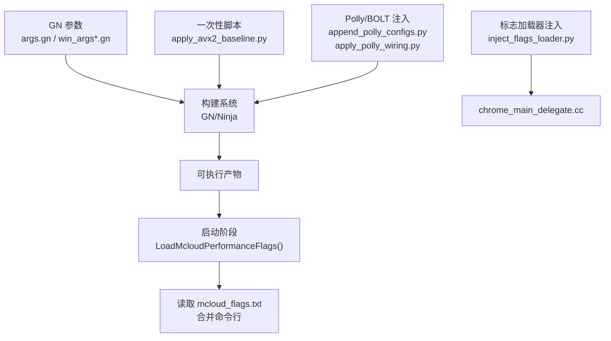
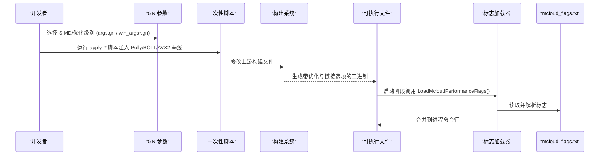
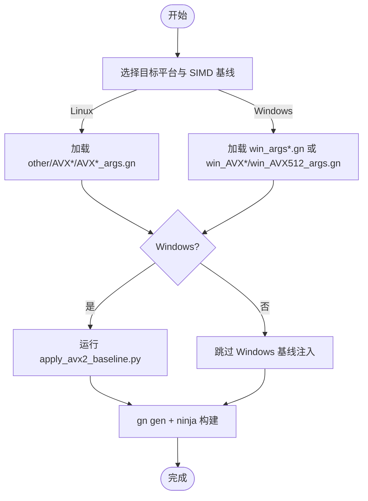
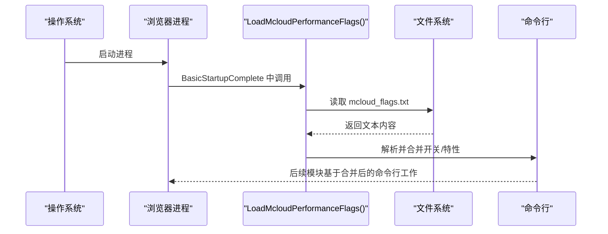
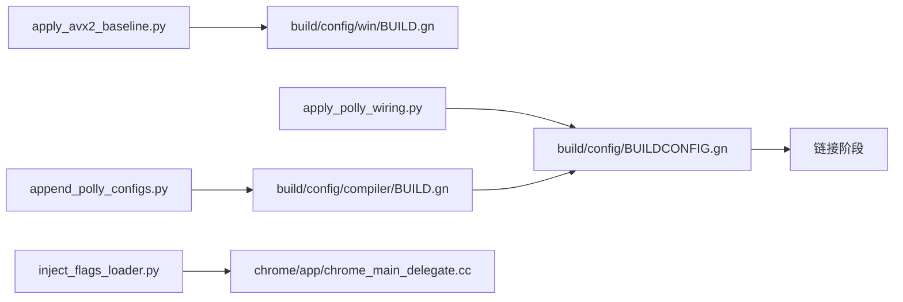

# 构建配置管理

<details><summary>本文引用的文件</summary>

- [args.gn](https://github.com/Mcloud136/Mcloud-Browser/blob/main/args.gn)
- [win_args.gn](https://github.com/Mcloud136/Mcloud-Browser/blob/main/win_args.gn)
- [win_args_mcloud.gn](https://github.com/Mcloud136/Mcloud-Browser/blob/main/win_args_mcloud.gn)
- [other/AVX2/AVX2_args.gn](https://github.com/Mcloud136/Mcloud-Browser/blob/main/other/AVX2/AVX2_args.gn)
- [other/AVX512/AVX512_args.gn](https://github.com/Mcloud136/Mcloud-Browser/blob/main/other/AVX512/AVX512_args.gn)
- [other/AVX2/win_AVX2_args.gn](https://github.com/Mcloud136/Mcloud-Browser/blob/main/other/AVX2/win_AVX2_args.gn)
- [other/AVX512/win_AVX512_args.gn](https://github.com/Mcloud136/Mcloud-Browser/blob/main/other/AVX512/win_AVX512_args.gn)
- [win_scripts/apply_avx2_baseline.py](https://github.com/Mcloud136/Mcloud-Browser/blob/main/win_scripts/apply_avx2_baseline.py)
- [win_scripts/inject_flags_loader.py](https://github.com/Mcloud136/Mcloud-Browser/blob/main/win_scripts/inject_flags_loader.py)
- [win_scripts/append_polly_configs.py](https://github.com/Mcloud136/Mcloud-Browser/blob/main/win_scripts/append_polly_configs.py)
- [win_scripts/apply_polly_wiring.py](https://github.com/Mcloud136/Mcloud-Browser/blob/main/win_scripts/apply_polly_wiring.py)
- [mcloud_flags.txt](https://github.com/Mcloud136/Mcloud-Browser/blob/main/mcloud_flags.txt)
- [check_simd.sh](https://github.com/Mcloud136/Mcloud-Browser/blob/main/check_simd.sh)
- [docs/ABOUT_RELEASES.md](https://github.com/Mcloud136/Mcloud-Browser/blob/main/docs/ABOUT_RELEASES.md)

</details>

## 目录
1. [简介](#简介)
2. [项目结构](#项目结构)
3. [核心组件](#核心组件)
4. [架构总览](#架构总览)
5. [详细组件分析](#详细组件分析)
6. [依赖关系分析](#依赖关系分析)
7. [性能考量](#性能考量)
8. [故障排查指南](#故障排查指南)
9. [结论](#结论)
10. [附录](#附录)

## 简介
本文件面向构建工程师与性能调优人员，系统化说明 MCloud Browser 的构建配置管理，重点覆盖：
- AVX2/AVX512 基线优化配置与编译参数应用
- Polly 循环优化注入与 BOLT emit-relocs 接线
- 运行时标志加载器注入（启动早期从 mcloud_flags.txt 读取并合并命令行）
- 不同优化级别的 GN 配置方法、硬件特性检测机制与兼容性策略
- 自定义构建配置的指导原则与性能测试方法

## 项目结构
仓库围绕“GN 参数 + 一次性脚本注入 + 运行时标志”三层组织构建与优化能力：
- GN 参数层：定义目标平台、SIMD 指令集、编译器开关、PGO、媒体与 DRM 等。
- 注入层：通过 Python 脚本在 Chromium 源码树中追加 Polly/BOLT 配置、将 AVX2/FMA 基线写入 Windows 构建配置、在启动流程注入内置标志加载器。
- 运行期层：浏览器启动时读取同目录下的 mcloud_flags.txt，按规则合并到进程命令行，实现无需重新编译即可调整行为。



图表来源
- [win_scripts/apply_avx2_baseline.py:1-27](https://github.com/Mcloud136/Mcloud-Browser/blob/main/win_scripts/apply_avx2_baseline.py#L1-L27)
- [win_scripts/append_polly_configs.py:1-72](https://github.com/Mcloud136/Mcloud-Browser/blob/main/win_scripts/append_polly_configs.py#L1-L72)
- [win_scripts/apply_polly_wiring.py:1-47](https://github.com/Mcloud136/Mcloud-Browser/blob/main/win_scripts/apply_polly_wiring.py#L1-L47)
- [win_scripts/inject_flags_loader.py:1-125](https://github.com/Mcloud136/Mcloud-Browser/blob/main/win_scripts/inject_flags_loader.py#L1-L125)
- [mcloud_flags.txt:1-120](https://github.com/Mcloud136/Mcloud-Browser/blob/main/mcloud_flags.txt#L1-L120)

章节来源
- [args.gn:1-87](https://github.com/Mcloud136/Mcloud-Browser/blob/main/args.gn#L1-L87)
- [win_args.gn:1-87](https://github.com/Mcloud136/Mcloud-Browser/blob/main/win_args.gn#L1-L87)
- [win_args_mcloud.gn:1-126](https://github.com/Mcloud136/Mcloud-Browser/blob/main/win_args_mcloud.gn#L1-L126)

## 核心组件
- SIMD 基线与优化级别
  - Linux x64：默认 args.gn 关闭 AVX2/AVX512；可选 other/AVX2/AVX2_args.gn 启用 AVX2+FMA，other/AVX512/AVX512_args.gn 启用 AVX512+FMA。
  - Windows x64：默认 win_args.gn 关闭 AVX2/AVX512；可选 win_args_mcloud.gn 启用 AVX2+FMA 并开启全量优化；Windows 专用 AVX2/AVX512 参数见 other/AVX2/win_AVX2_args.gn 与 other/AVX512/win_AVX512_args.gn。
- Polly 与 BOLT
  - 通过 append_polly_configs.py 向 compiler/BUILD.gn 追加 polly 与 emit-relocs 配置块。
  - 通过 apply_polly_wiring.py 在 BUILDCONFIG.gn 中将上述配置接入默认可执行/共享库集合。
  - 使用 gate 开关 use_polly/use_bolt 控制是否生效，避免在不满足前置条件时引入体积或失败。
- 运行时标志加载器
  - inject_flags_loader.py 在 chrome_main_delegate.cc 中注入 LoadMcloudPerformanceFlags，并在 BasicStartupComplete 调用点插入调用。
  - 启动早期读取 exe 同目录 mcloud_flags.txt，解析 --flag/--flag=value 与 enable/disable-features，按规则合并到当前进程命令行。
- 硬件特性检测与兼容性
  - check_simd.sh 检测 CPU 是否支持 SSE2/SSE3/SSE4.1/SSE4.2/AES/AVX/AVX2。
  - docs/ABOUT_RELEASES.md 给出各 SIMD 版本的最低 CPU 世代建议，用于选择发布包与构建基线。

章节来源
- [other/AVX2/AVX2_args.gn:1-87](https://github.com/Mcloud136/Mcloud-Browser/blob/main/other/AVX2/AVX2_args.gn#L1-L87)
- [other/AVX512/AVX512_args.gn:1-87](https://github.com/Mcloud136/Mcloud-Browser/blob/main/other/AVX512/AVX512_args.gn#L1-L87)
- [other/AVX2/win_AVX2_args.gn:1-87](https://github.com/Mcloud136/Mcloud-Browser/blob/main/other/AVX2/win_AVX2_args.gn#L1-L87)
- [other/AVX512/win_AVX512_args.gn:1-87](https://github.com/Mcloud136/Mcloud-Browser/blob/main/other/AVX512/win_AVX512_args.gn#L1-L87)
- [win_args_mcloud.gn:1-126](https://github.com/Mcloud136/Mcloud-Browser/blob/main/win_args_mcloud.gn#L1-L126)
- [win_scripts/append_polly_configs.py:1-72](https://github.com/Mcloud136/Mcloud-Browser/blob/main/win_scripts/append_polly_configs.py#L1-L72)
- [win_scripts/apply_polly_wiring.py:1-47](https://github.com/Mcloud136/Mcloud-Browser/blob/main/win_scripts/apply_polly_wiring.py#L1-L47)
- [win_scripts/inject_flags_loader.py:1-125](https://github.com/Mcloud136/Mcloud-Browser/blob/main/win_scripts/inject_flags_loader.py#L1-L125)
- [check_simd.sh:1-125](https://github.com/Mcloud136/Mcloud-Browser/blob/main/check_simd.sh#L1-L125)
- [docs/ABOUT_RELEASES.md:29-59](https://github.com/Mcloud136/Mcloud-Browser/blob/main/docs/ABOUT_RELEASES.md#L29-L59)

## 架构总览
下图展示从构建参数到运行期行为的完整链路：GN 参数决定编译目标与优化开关；一次性脚本对上游 Chromium 源码进行最小侵入式补丁；产物启动后由注入的加载器读取 mcloud_flags.txt 并合并命令行，最终影响功能开关与性能路径。



图表来源
- [win_scripts/append_polly_configs.py:1-72](https://github.com/Mcloud136/Mcloud-Browser/blob/main/win_scripts/append_polly_configs.py#L1-L72)
- [win_scripts/apply_polly_wiring.py:1-47](https://github.com/Mcloud136/Mcloud-Browser/blob/main/win_scripts/apply_polly_wiring.py#L1-L47)
- [win_scripts/apply_avx2_baseline.py:1-27](https://github.com/Mcloud136/Mcloud-Browser/blob/main/win_scripts/apply_avx2_baseline.py#L1-L27)
- [win_scripts/inject_flags_loader.py:1-125](https://github.com/Mcloud136/Mcloud-Browser/blob/main/win_scripts/inject_flags_loader.py#L1-L125)
- [mcloud_flags.txt:1-120](https://github.com/Mcloud136/Mcloud-Browser/blob/main/mcloud_flags.txt#L1-L120)

## 详细组件分析

### AVX2/AVX512 基线优化配置
- 目标与范围
  - Linux：通过 other/AVX2/AVX2_args.gn 或 other/AVX512/AVX512_args.gn 切换 use_avx2/use_avx512/use_fma。
  - Windows：通过 win_args_mcloud.gn 或 other/AVX2/win_AVX2_args.gn、other/AVX512/win_AVX512_args.gn 切换。
- 编译器标志
  - Windows 基线通过 apply_avx2_baseline.py 将 -msse3 替换为 -mavx2 -mfma -mf16c -mlzcnt -mbmi -mbmi2，确保 x64 构建以 AVX2+FMA 为基线。
- 兼容性与最低要求
  - 参考 docs/ABOUT_RELEASES.md 中各 SIMD 版本对应的 CPU 世代建议，结合 check_simd.sh 在构建前验证主机能力。
- 关键 GN 参数要点
  - SIMD：use_sse3/use_sse41/use_sve42/use_avx/use_avx2/use_avx512/use_fma
  - 优化：is_full_optimization_build=true、thin_lto_enable_optimizations=true、v8_* 相关 JIT 开关
  - PGO：chrome_pgo_phase=2 与 pgo_data_path 指向匹配内核版本的 .profdata



图表来源
- [other/AVX2/AVX2_args.gn:1-87](https://github.com/Mcloud136/Mcloud-Browser/blob/main/other/AVX2/AVX2_args.gn#L1-L87)
- [other/AVX512/AVX512_args.gn:1-87](https://github.com/Mcloud136/Mcloud-Browser/blob/main/other/AVX512/AVX512_args.gn#L1-L87)
- [other/AVX2/win_AVX2_args.gn:1-87](https://github.com/Mcloud136/Mcloud-Browser/blob/main/other/AVX2/win_AVX2_args.gn#L1-L87)
- [other/AVX512/win_AVX512_args.gn:1-87](https://github.com/Mcloud136/Mcloud-Browser/blob/main/other/AVX512/win_AVX512_args.gn#L1-L87)
- [win_scripts/apply_avx2_baseline.py:1-27](https://github.com/Mcloud136/Mcloud-Browser/blob/main/win_scripts/apply_avx2_baseline.py#L1-L27)

章节来源
- [args.gn:1-87](https://github.com/Mcloud136/Mcloud-Browser/blob/main/args.gn#L1-L87)
- [win_args.gn:1-87](https://github.com/Mcloud136/Mcloud-Browser/blob/main/win_args.gn#L1-L87)
- [win_args_mcloud.gn:1-126](https://github.com/Mcloud136/Mcloud-Browser/blob/main/win_args_mcloud.gn#L1-L126)
- [win_scripts/apply_avx2_baseline.py:1-27](https://github.com/Mcloud136/Mcloud-Browser/blob/main/win_scripts/apply_avx2_baseline.py#L1-L27)
- [check_simd.sh:1-125](https://github.com/Mcloud136/Mcloud-Browser/blob/main/check_simd.sh#L1-L125)
- [docs/ABOUT_RELEASES.md:29-59](https://github.com/Mcloud136/Mcloud-Browser/blob/main/docs/ABOUT_RELEASES.md#L29-L59)

### Polly 循环优化注入
- 注入内容
  - append_polly_configs.py 向 compiler/BUILD.gn 追加 config("polly") 与 config("emit-relocs")，分别注入 -mllvm:-polly* 与 --emit-relocs 链接选项，并通过 import("//build/config/compiler_opt.gni") 获取 use_polly/use_bolt 声明。
  - apply_polly_wiring.py 在 BUILDCONFIG.gn 中将这两个配置加入 default_executable_configs 与 default_shared_library_configs，使所有可执行/共享库默认携带这些链接选项（受 gate 控制）。
- Gate 控制
  - 仅在 use_polly==true 或 use_bolt==true 时生效，避免在未就绪环境引入额外体积或失败。
- 适用场景
  - 需要自构建含 Polly 支持的 clang（infra/build_polly.sh），并在 GN 参数中启用 use_polly。

```mermaid
sequenceDiagram
participant Dev as "开发者"
participant PC as "append_polly_configs.py"
participant AW as "apply_polly_wiring.py"
participant GN as "BUILDCONFIG.gn / compiler/BUILD.gn"
participant Link as "链接阶段"
Dev->>PC : 运行脚本追加 polly/emit-relocs 配置
PC-->>GN : 写入 config("polly") 与 config("emit-relocs")
Dev->>AW : 运行脚本接线至默认目标
AW-->>GN : 将配置加入 executable/shared_library 默认集合
Link->>Link : 若 use_polly/use_bolt 为真则启用对应 ldflags
```

图表来源
- [win_scripts/append_polly_configs.py:1-72](https://github.com/Mcloud136/Mcloud-Browser/blob/main/win_scripts/append_polly_configs.py#L1-L72)
- [win_scripts/apply_polly_wiring.py:1-47](https://github.com/Mcloud136/Mcloud-Browser/blob/main/win_scripts/apply_polly_wiring.py#L1-L47)

章节来源
- [win_scripts/append_polly_configs.py:1-72](https://github.com/Mcloud136/Mcloud-Browser/blob/main/win_scripts/append_polly_configs.py#L1-L72)
- [win_scripts/apply_polly_wiring.py:1-47](https://github.com/Mcloud136/Mcloud-Browser/blob/main/win_scripts/apply_polly_wiring.py#L1-L47)
- [win_args_mcloud.gn:43-50](https://github.com/Mcloud136/Mcloud-Browser/blob/main/win_args_mcloud.gn#L43-L50)

### 标志加载器注入与运行时标志
- 注入位置
  - inject_flags_loader.py 在 chrome_main_delegate.cc 中注入 LoadMcloudPerformanceFlags 函数，并在 BasicStartupComplete 入口处调用。
- 行为规则
  - 读取 exe 同目录 mcloud_flags.txt，逐行解析 --flag/--flag=value 与引号值、忽略注释行。
  - enable/disable-features 与用户命令行合并：内置优先，用户条目追加在后，保证用户覆盖。
  - 其他开关若用户已指定则跳过，避免重复。
- 典型用途
  - 冷启动优化、渲染/网络/内存/V8 等性能开关集中管理，无需重新编译即可调优。



图表来源
- [win_scripts/inject_flags_loader.py:1-125](https://github.com/Mcloud136/Mcloud-Browser/blob/main/win_scripts/inject_flags_loader.py#L1-L125)
- [mcloud_flags.txt:1-120](https://github.com/Mcloud136/Mcloud-Browser/blob/main/mcloud_flags.txt#L1-L120)

章节来源
- [win_scripts/inject_flags_loader.py:1-125](https://github.com/Mcloud136/Mcloud-Browser/blob/main/win_scripts/inject_flags_loader.py#L1-L125)
- [mcloud_flags.txt:1-120](https://github.com/Mcloud136/Mcloud-Browser/blob/main/mcloud_flags.txt#L1-L120)

### 不同优化级别的配置方法
- 默认通用构建
  - Linux：args.gn（默认关闭 AVX2/AVX512，保留通用二进制）
  - Windows：win_args.gn（默认关闭 AVX2/AVX512）
- 高性能构建
  - Windows：win_args_mcloud.gn（启用 AVX2+FMA、全量优化、V8 加速、ThinLTO、PGO）
  - Linux：other/AVX2/AVX2_args.gn 或 other/AVX512/AVX512_args.gn
- 关键开关对照
  - SIMD：use_avx2/use_avx512/use_fma
  - 优化：is_full_optimization_build、thin_lto_enable_optimizations、v8_*
  - PGO：chrome_pgo_phase、pgo_data_path
  - Polly/BOLT：use_polly、use_bolt（需配合脚本注入与自构建工具链）

章节来源
- [args.gn:1-87](https://github.com/Mcloud136/Mcloud-Browser/blob/main/args.gn#L1-L87)
- [win_args.gn:1-87](https://github.com/Mcloud136/Mcloud-Browser/blob/main/win_args.gn#L1-L87)
- [win_args_mcloud.gn:1-126](https://github.com/Mcloud136/Mcloud-Browser/blob/main/win_args_mcloud.gn#L1-L126)
- [other/AVX2/AVX2_args.gn:1-87](https://github.com/Mcloud136/Mcloud-Browser/blob/main/other/AVX2/AVX2_args.gn#L1-L87)
- [other/AVX512/AVX512_args.gn:1-87](https://github.com/Mcloud136/Mcloud-Browser/blob/main/other/AVX512/AVX512_args.gn#L1-L87)

### 硬件特性检测机制与兼容性处理
- 检测方式
  - check_simd.sh 检查 64 位、SSE2/SSE3/SSE4.1/SSE4.2/AES/AVX/AVX2 等标志位，用于构建前验证主机能力。
- 兼容性策略
  - 根据 docs/ABOUT_RELEASES.md 的建议，针对不同 CPU 世代提供不同 SIMD 版本的发布包；对于低配 CPU 建议使用更保守的基线。
  - 在 Windows 上通过 apply_avx2_baseline.py 统一基线，避免 MSVC 子集限制导致的差异。

章节来源
- [check_simd.sh:1-125](https://github.com/Mcloud136/Mcloud-Browser/blob/main/check_simd.sh#L1-L125)
- [docs/ABOUT_RELEASES.md:29-59](https://github.com/Mcloud136/Mcloud-Browser/blob/main/docs/ABOUT_RELEASES.md#L29-L59)
- [win_scripts/apply_avx2_baseline.py:1-27](https://github.com/Mcloud136/Mcloud-Browser/blob/main/win_scripts/apply_avx2_baseline.py#L1-L27)

### 自定义构建配置的指导原则
- 明确目标平台与 SIMD 基线：优先选择能稳定运行的最低基线，再逐步提升。
- 谨慎启用 Polly/BOLT：确认工具链与流程就绪后再打开 use_polly/use_bolt，避免无效开关与体积膨胀。
- 合理配置 PGO：确保 .profdata 与内核大版本严格匹配，并在升级时同步更新路径。
- 运行时标志优先于硬编码：通过 mcloud_flags.txt 集中管理性能开关，便于灰度与回滚。
- 构建前自检：使用 check_simd.sh 验证主机能力，减少构建失败与运行期崩溃。

[本节为通用指导，不直接分析具体文件]

### 性能测试方法
- 基准套件
  - benchmark/tools/check_features.py 可用于校验特性可用性。
  - 使用 benchmark 目录下脚本进行导航、启动、内存、大小等维度的对比测试。
- 对比维度
  - 不同 SIMD 基线（默认 vs AVX2 vs AVX512）
  - 是否启用 Polly/BOLT（在工具链就绪前提下）
  - 不同 PGO 配置（phase=2 与不同 profdata）
  - 不同 mcloud_flags.txt 组合（冷启动、渲染、网络、V8 等）

[本节为通用指导，不直接分析具体文件]

## 依赖关系分析
- 脚本与源码文件的耦合
  - apply_avx2_baseline.py 依赖 Windows 构建配置文件中的锚点字符串，用于定位替换。
  - append_polly_configs.py 依赖 compiler/BUILD.gn 中的 common_optimize_on_ldflags 与 marker 标记。
  - apply_polly_wiring.py 依赖 BUILDCONFIG.gn 中唯一的 set_defaults("executable"/"shared_library") 锚点。
  - inject_flags_loader.py 依赖 chrome_main_delegate.cc 的命名空间与 BasicStartupComplete 锚点，以及 content_switches.h。
- 外部依赖
  - Polly/BOLT 需要自构建工具链与后链接流程落地。
  - PGO 需要与内核版本匹配的 .profdata。



图表来源
- [win_scripts/apply_avx2_baseline.py:1-27](https://github.com/Mcloud136/Mcloud-Browser/blob/main/win_scripts/apply_avx2_baseline.py#L1-L27)
- [win_scripts/append_polly_configs.py:1-72](https://github.com/Mcloud136/Mcloud-Browser/blob/main/win_scripts/append_polly_configs.py#L1-L72)
- [win_scripts/apply_polly_wiring.py:1-47](https://github.com/Mcloud136/Mcloud-Browser/blob/main/win_scripts/apply_polly_wiring.py#L1-L47)
- [win_scripts/inject_flags_loader.py:1-125](https://github.com/Mcloud136/Mcloud-Browser/blob/main/win_scripts/inject_flags_loader.py#L1-L125)

章节来源
- [win_scripts/apply_avx2_baseline.py:1-27](https://github.com/Mcloud136/Mcloud-Browser/blob/main/win_scripts/apply_avx2_baseline.py#L1-L27)
- [win_scripts/append_polly_configs.py:1-72](https://github.com/Mcloud136/Mcloud-Browser/blob/main/win_scripts/append_polly_configs.py#L1-L72)
- [win_scripts/apply_polly_wiring.py:1-47](https://github.com/Mcloud136/Mcloud-Browser/blob/main/win_scripts/apply_polly_wiring.py#L1-L47)
- [win_scripts/inject_flags_loader.py:1-125](https://github.com/Mcloud136/Mcloud-Browser/blob/main/win_scripts/inject_flags_loader.py#L1-L125)

## 性能考量
- 编译期优化
  - 启用 ThinLTO、V8 JIT 优化、WebAssembly SIMD256 重向量等，提升热点路径性能。
  - 合理使用 PGO，确保数据与内核版本一致，避免误用导致退化。
- 运行期优化
  - 通过 mcloud_flags.txt 精细控制冷启动、渲染、网络、内存回收、V8 阈值等。
  - 针对特定 GPU/驱动问题（如 D3D12VideoDecoder 绿屏）可通过禁用特性回退到稳定路径。
- 体积与稳定性权衡
  - Polly/BOLT 在未就绪时保持关闭，避免体积膨胀与潜在不稳定。
  - 谨慎启用过多预取/预热特性，评估内存代价与收益。

[本节为通用指导，不直接分析具体文件]

## 故障排查指南
- 构建失败
  - 检查脚本锚点是否存在（如 anchor not found），必要时恢复上游基线后重新运行脚本。
  - 确认 use_polly/use_bolt 与工具链就绪情况，避免无效开关导致链接失败。
- 运行期异常
  - 若出现视频解码绿屏/花屏，尝试在 mcloud_flags.txt 中禁用相关特性（如 D3D12VideoDecoder）。
  - 核对 PGO 的 .profdata 与内核版本是否匹配，避免代码段错位。
- 兼容性验证
  - 使用 check_simd.sh 验证主机能力，确保构建基线与硬件匹配。
  - 参考 docs/ABOUT_RELEASES.md 选择合适的 SIMD 版本发布包。

章节来源
- [win_scripts/append_polly_configs.py:1-72](https://github.com/Mcloud136/Mcloud-Browser/blob/main/win_scripts/append_polly_configs.py#L1-L72)
- [win_scripts/apply_polly_wiring.py:1-47](https://github.com/Mcloud136/Mcloud-Browser/blob/main/win_scripts/apply_polly_wiring.py#L1-L47)
- [win_scripts/inject_flags_loader.py:1-125](https://github.com/Mcloud136/Mcloud-Browser/blob/main/win_scripts/inject_flags_loader.py#L1-L125)
- [check_simd.sh:1-125](https://github.com/Mcloud136/Mcloud-Browser/blob/main/check_simd.sh#L1-L125)
- [docs/ABOUT_RELEASES.md:29-59](https://github.com/Mcloud136/Mcloud-Browser/blob/main/docs/ABOUT_RELEASES.md#L29-L59)

## 结论
本仓库通过“GN 参数 + 一次性脚本注入 + 运行时标志”的组合，实现了灵活且可控的高级构建优化体系。AVX2/AVX512 基线、Polly/BOLT 注入与标志加载器三者协同，既保证了性能上限，又兼顾了兼容性与可维护性。建议在团队内建立标准化的构建基线、脚本执行顺序与性能回归流程，持续迭代优化。

[本节为总结，不直接分析具体文件]

## 附录
- 常用 GN 参数速查
  - SIMD：use_sse3/use_sse41/use_sse42/use_avx/use_avx2/use_avx512/use_fma
  - 优化：is_full_optimization_build、thin_lto_enable_optimizations、v8_*
  - PGO：chrome_pgo_phase、pgo_data_path
  - Polly/BOLT：use_polly、use_bolt
- 推荐流程
  - 构建前：check_simd.sh 验证主机能力
  - 构建中：选择合适 args 文件，运行一次性脚本注入优化
  - 构建后：运行基准测试，对比不同配置的性能与体积
  - 运行期：按需调整 mcloud_flags.txt，灰度验证后推广

[本节为补充信息，不直接分析具体文件]