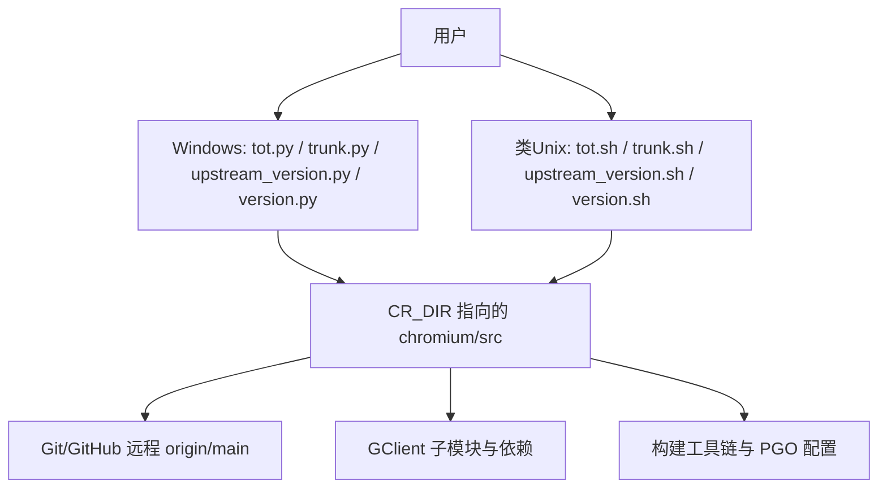
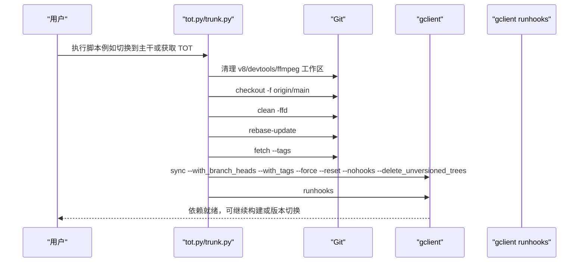
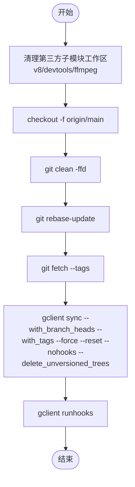
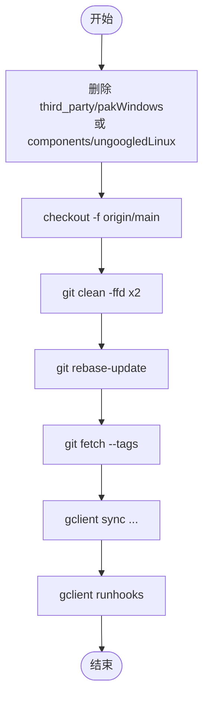
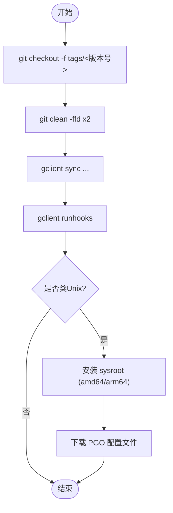
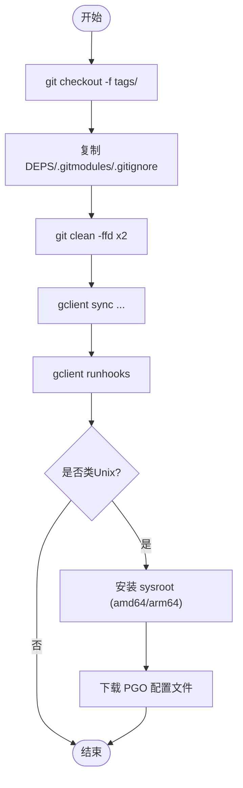
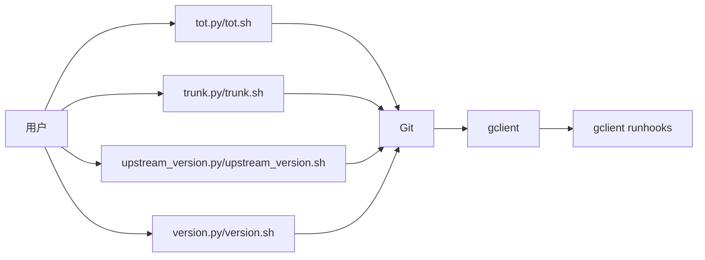

# 版本管理脚本

本文引用的文件

- [win_scripts/tot.py](https://github.com/Mcloud136/Mcloud-Browser/blob/main/win_scripts/tot.py)
- [win_scripts/trunk.py](https://github.com/Mcloud136/Mcloud-Browser/blob/main/win_scripts/trunk.py)
- [win_scripts/upstream_version.py](https://github.com/Mcloud136/Mcloud-Browser/blob/main/win_scripts/upstream_version.py)
- [win_scripts/version.py](https://github.com/Mcloud136/Mcloud-Browser/blob/main/win_scripts/version.py)
- [tot.sh](https://github.com/Mcloud136/Mcloud-Browser/blob/main/tot.sh)
- [trunk.sh](https://github.com/Mcloud136/Mcloud-Browser/blob/main/trunk.sh)
- [upstream_version.sh](https://github.com/Mcloud136/Mcloud-Browser/blob/main/upstream_version.sh)
- [version.sh](https://github.com/Mcloud136/Mcloud-Browser/blob/main/version.sh)

## 目录
1. [简介](#简介)
2. [项目结构](#项目结构)
3. [核心组件](#核心组件)
4. [架构总览](#架构总览)
5. [详细组件分析](#详细组件分析)
6. [依赖关系分析](#依赖关系分析)
7. [性能与效率考量](#性能与效率考量)
8. [故障排查指南](#故障排查指南)
9. [结论](#结论)
10. [附录：最佳实践与自动化工作流示例](#附录最佳实践与自动化工作流示例)

## 简介
本仓库提供一套用于管理 Chromium 上游代码与 Mcloud Browser（Thorium）版本的脚本，覆盖“获取最新代码”、“切换主干版本”和“管理上游版本”三大场景。脚本同时提供 Windows（Python）与类 Unix（Shell）两套实现，封装了 Git、gclient、工具链与 PGO 配置等常用操作，并内置错误处理与清理逻辑，确保在切换/同步上游时保持源码树一致性与可构建性。

## 项目结构
围绕版本管理的核心脚本位于根目录与 win_scripts 目录中：
- 根目录 Shell 脚本：tot.sh、trunk.sh、upstream_version.sh、version.sh
- Windows Python 脚本：win_scripts/tot.py、win_scripts/trunk.py、win_scripts/upstream_version.py、win_scripts/version.py

这些脚本通过环境变量 CR_DIR 定位 Chromium 源码目录（默认路径见各脚本），并在该目录下执行 Git/gclient 命令，完成分支切换、标签检出、子模块同步与钩子运行。

**章节来源**
- [win_scripts/tot.py:39-68](https://github.com/Mcloud136/Mcloud-Browser/blob/main/win_scripts/tot.py#L39-L68)
- [win_scripts/trunk.py:46-82](https://github.com/Mcloud136/Mcloud-Browser/blob/main/win_scripts/trunk.py#L46-L82)
- [win_scripts/upstream_version.py:39-66](https://github.com/Mcloud136/Mcloud-Browser/blob/main/win_scripts/upstream_version.py#L39-L66)
- [win_scripts/version.py:49-100](https://github.com/Mcloud136/Mcloud-Browser/blob/main/win_scripts/version.py#L49-L100)
- [tot.sh:28-79](https://github.com/Mcloud136/Mcloud-Browser/blob/main/tot.sh#L28-L79)
- [trunk.sh:30-87](https://github.com/Mcloud136/Mcloud-Browser/blob/main/trunk.sh#L30-L87)
- [upstream_version.sh:30-98](https://github.com/Mcloud136/Mcloud-Browser/blob/main/upstream_version.sh#L30-L98)
- [version.sh:30-112](https://github.com/Mcloud136/Mcloud-Browser/blob/main/version.sh#L30-L112)

## 核心组件
- 获取最新代码（Tip-of-Tree）
  - Windows: win_scripts/tot.py
  - 类Unix: tot.sh
- 切换主干版本（origin/main）
  - Windows: win_scripts/trunk.py
  - 类Unix: trunk.sh
- 管理上游版本（固定标签）
  - Windows: win_scripts/upstream_version.py
  - 类Unix: upstream_version.sh
- 设置当前 Mcloud Browser 版本（含依赖注入与 PGO）
  - Windows: win_scripts/version.py
  - 类Unix: version.sh

上述组件共同构成“拉取上游 → 切换分支/标签 → 同步依赖 → 运行钩子 → 准备构建”的完整流水线。

**章节来源**
- [win_scripts/tot.py:43-70](https://github.com/Mcloud136/Mcloud-Browser/blob/main/win_scripts/tot.py#L43-L70)
- [tot.sh:43-79](https://github.com/Mcloud136/Mcloud-Browser/blob/main/tot.sh#L43-L79)
- [win_scripts/trunk.py:52-82](https://github.com/Mcloud136/Mcloud-Browser/blob/main/win_scripts/trunk.py#L52-L82)
- [trunk.sh:57-87](https://github.com/Mcloud136/Mcloud-Browser/blob/main/trunk.sh#L57-L87)
- [win_scripts/upstream_version.py:43-69](https://github.com/Mcloud136/Mcloud-Browser/blob/main/win_scripts/upstream_version.py#L43-L69)
- [upstream_version.sh:49-98](https://github.com/Mcloud136/Mcloud-Browser/blob/main/upstream_version.sh#L49-L98)
- [win_scripts/version.py:56-100](https://github.com/Mcloud136/Mcloud-Browser/blob/main/win_scripts/version.py#L56-L100)
- [version.sh:49-112](https://github.com/Mcloud136/Mcloud-Browser/blob/main/version.sh#L49-L112)

## 架构总览
以下序列图展示了典型的上游同步流程（以 Windows 为例，Shell 脚本逻辑等价）：

**图表来源**
- [win_scripts/tot.py:52-68](https://github.com/Mcloud136/Mcloud-Browser/blob/main/win_scripts/tot.py#L52-L68)
- [win_scripts/trunk.py:63-80](https://github.com/Mcloud136/Mcloud-Browser/blob/main/win_scripts/trunk.py#L63-L80)
- [tot.sh:43-79](https://github.com/Mcloud136/Mcloud-Browser/blob/main/tot.sh#L43-L79)
- [trunk.sh:45-83](https://github.com/Mcloud136/Mcloud-Browser/blob/main/trunk.sh#L45-L83)

**章节来源**
- [win_scripts/tot.py:43-70](https://github.com/Mcloud136/Mcloud-Browser/blob/main/win_scripts/tot.py#L43-L70)
- [win_scripts/trunk.py:52-82](https://github.com/Mcloud136/Mcloud-Browser/blob/main/win_scripts/trunk.py#L52-L82)
- [tot.sh:43-79](https://github.com/Mcloud136/Mcloud-Browser/blob/main/tot.sh#L43-L79)
- [trunk.sh:45-83](https://github.com/Mcloud136/Mcloud-Browser/blob/main/trunk.sh#L45-L83)

## 详细组件分析

### 组件A：获取最新代码（TOT）
- 功能
  - 将 Chromium 源码树重置到 origin/main（Tip-of-Tree）。
  - 清理 v8、devtools-frontend、ffmpeg 等第三方子模块的工作区。
  - 使用 gclient 同步所有依赖并运行 hooks。
- 关键行为
  - 通过环境变量 CR_DIR 指定 Chromium 源码目录。
  - 使用 git restore/clean 保证工作区干净。
  - 使用 git rebase-update 更新本地 rebase 状态。
  - 使用 gclient sync 的 with_branch_heads/with_tags 参数确保分支与标签一致性。
- 适用场景
  - 日常开发需要跟踪上游最新变更。
  - 在切换版本前确保源码树处于最新主干。

**图表来源**
- [win_scripts/tot.py:52-68](https://github.com/Mcloud136/Mcloud-Browser/blob/main/win_scripts/tot.py#L52-L68)
- [tot.sh:43-79](https://github.com/Mcloud136/Mcloud-Browser/blob/main/tot.sh#L43-L79)

**章节来源**
- [win_scripts/tot.py:43-70](https://github.com/Mcloud136/Mcloud-Browser/blob/main/win_scripts/tot.py#L43-L70)
- [tot.sh:43-79](https://github.com/Mcloud136/Mcloud-Browser/blob/main/tot.sh#L43-L79)

### 组件B：切换主干版本（Trunk）
- 功能
  - 与 TOT 类似，但额外删除 Mcloud 特定的 third_party/pak 目录，避免旧产物干扰。
  - 在类Unix版本中还会移除 components/ungoogled 目录，并复制自定义 vs_toolchain.py。
- 关键行为
  - 强制 checkout origin/main。
  - 多次 clean 确保无残留。
  - 运行 gclient sync 与 runhooks。
- 适用场景
  - 从某个版本切回主干进行开发或测试。
  - 需要清理特定平台/项目的遗留文件后再同步。

**图表来源**
- [win_scripts/trunk.py:60-80](https://github.com/Mcloud136/Mcloud-Browser/blob/main/win_scripts/trunk.py#L60-L80)
- [trunk.sh:57-83](https://github.com/Mcloud136/Mcloud-Browser/blob/main/trunk.sh#L57-L83)

**章节来源**
- [win_scripts/trunk.py:52-82](https://github.com/Mcloud136/Mcloud-Browser/blob/main/win_scripts/trunk.py#L52-L82)
- [trunk.sh:57-87](https://github.com/Mcloud136/Mcloud-Browser/blob/main/trunk.sh#L57-L87)

### 组件C：管理上游版本（Upstream Version）
- 功能
  - 将 Chromium 源码树切换到固定的上游标签（如 tags/144.0.7559.254）。
  - 同步依赖并运行 hooks。
  - 在类Unix版本中还会安装 sysroot 并下载 PGO 配置文件。
- 关键行为
  - 硬编码或环境变量指定的 Chromium 版本号。
  - 使用 git checkout -f 切换到目标标签。
  - 使用 gclient sync 与 runhooks 完成依赖同步。
- 适用场景
  - 复现特定上游版本的问题。
  - 基于稳定标签进行发布或回归测试。

**图表来源**
- [win_scripts/upstream_version.py:43-66](https://github.com/Mcloud136/Mcloud-Browser/blob/main/win_scripts/upstream_version.py#L43-L66)
- [upstream_version.sh:49-98](https://github.com/Mcloud136/Mcloud-Browser/blob/main/upstream_version.sh#L49-L98)

**章节来源**
- [win_scripts/upstream_version.py:43-69](https://github.com/Mcloud136/Mcloud-Browser/blob/main/win_scripts/upstream_version.py#L43-L69)
- [upstream_version.sh:49-98](https://github.com/Mcloud136/Mcloud-Browser/blob/main/upstream_version.sh#L49-L98)

### 组件D：设置当前 Mcloud Browser 版本（Version）
- 功能
  - 切换到当前 Mcloud Browser 对应的 Chromium 标签。
  - 复制必要的 DEPS/.gitmodules/.gitignore 等文件以启用 libjxl 等依赖。
  - 同步依赖并运行 hooks；在类Unix版本中安装 sysroot 并下载 PGO。
- 关键行为
  - 通过 THOR_DIR/CR_DIR 定位 Thorium 与 Chromium 源码目录。
  - 使用 shutil.copy 安全复制必要文件。
  - 使用 gclient sync/runhooks 完成依赖与钩子。
- 适用场景
  - 构建与发布前的环境准备。
  - 在固定上游版本上应用 Mcloud 定制补丁与配置。

**图表来源**
- [win_scripts/version.py:56-100](https://github.com/Mcloud136/Mcloud-Browser/blob/main/win_scripts/version.py#L56-L100)
- [version.sh:49-112](https://github.com/Mcloud136/Mcloud-Browser/blob/main/version.sh#L49-L112)

**章节来源**
- [win_scripts/version.py:56-100](https://github.com/Mcloud136/Mcloud-Browser/blob/main/win_scripts/version.py#L56-L100)
- [version.sh:49-112](https://github.com/Mcloud136/Mcloud-Browser/blob/main/version.sh#L49-L112)

## 依赖关系分析
- 外部依赖
  - Git：用于分支/标签切换与工作区清理。
  - gclient：用于同步 Chromium 子模块与依赖。
  - Python/Shell 运行时：分别用于 Windows 与类 Unix 环境。
- 内部耦合
  - 各脚本共享相同的 CR_DIR 约定与命令序列，便于跨平台保持一致行为。
  - 类Unix脚本在版本切换时会复制 vs_toolchain.py，体现对构建工具的定制集成。
- 潜在循环依赖
  - 脚本之间无直接相互调用，均为独立入口；通过命令行顺序组合使用。

**图表来源**
- [win_scripts/tot.py:52-68](https://github.com/Mcloud136/Mcloud-Browser/blob/main/win_scripts/tot.py#L52-L68)
- [win_scripts/trunk.py:63-80](https://github.com/Mcloud136/Mcloud-Browser/blob/main/win_scripts/trunk.py#L63-L80)
- [win_scripts/upstream_version.py:53-66](https://github.com/Mcloud136/Mcloud-Browser/blob/main/win_scripts/upstream_version.py#L53-L66)
- [win_scripts/version.py:66-100](https://github.com/Mcloud136/Mcloud-Browser/blob/main/win_scripts/version.py#L66-L100)
- [tot.sh:43-79](https://github.com/Mcloud136/Mcloud-Browser/blob/main/tot.sh#L43-L79)
- [trunk.sh:45-83](https://github.com/Mcloud136/Mcloud-Browser/blob/main/trunk.sh#L45-L83)
- [upstream_version.sh:49-98](https://github.com/Mcloud136/Mcloud-Browser/blob/main/upstream_version.sh#L49-L98)
- [version.sh:49-112](https://github.com/Mcloud136/Mcloud-Browser/blob/main/version.sh#L49-L112)

**章节来源**
- [win_scripts/tot.py:43-70](https://github.com/Mcloud136/Mcloud-Browser/blob/main/win_scripts/tot.py#L43-L70)
- [win_scripts/trunk.py:52-82](https://github.com/Mcloud136/Mcloud-Browser/blob/main/win_scripts/trunk.py#L52-L82)
- [win_scripts/upstream_version.py:43-69](https://github.com/Mcloud136/Mcloud-Browser/blob/main/win_scripts/upstream_version.py#L43-L69)
- [win_scripts/version.py:56-100](https://github.com/Mcloud136/Mcloud-Browser/blob/main/win_scripts/version.py#L56-L100)
- [tot.sh:43-79](https://github.com/Mcloud136/Mcloud-Browser/blob/main/tot.sh#L43-L79)
- [trunk.sh:45-83](https://github.com/Mcloud136/Mcloud-Browser/blob/main/trunk.sh#L45-L83)
- [upstream_version.sh:49-98](https://github.com/Mcloud136/Mcloud-Browser/blob/main/upstream_version.sh#L49-L98)
- [version.sh:49-112](https://github.com/Mcloud136/Mcloud-Browser/blob/main/version.sh#L49-L112)

## 性能与效率考量
- 工作区清理策略
  - 使用 git restore + git clean -ffd 快速恢复与清理，减少不必要的全量重建。
  - 针对第三方子模块（v8、devtools、ffmpeg）单独清理，降低冲突概率。
- 并行与串行
  - 脚本按顺序执行命令，确保依赖关系正确；若需提升性能，可在 CI 中缓存 depot_tools 与已下载的依赖。
- 网络与 I/O
  - gclient sync 会下载大量依赖，建议在 CI 中使用镜像源与缓存层。
  - PGO 配置文件下载仅在版本切换时触发，避免重复开销。

[本节为通用指导，不直接分析具体文件]

## 故障排查指南
- 常见错误与处理
  - 命令失败退出码：脚本统一使用 exit 111 表示失败，便于上层捕获。
  - 工作区污染：执行 git clean -ffd 与 gclient sync --reset 清理。
  - 子模块不一致：先 rebase-update，再 fetch --tags，最后 gclient sync。
  - 权限问题：确保 CR_DIR 指向的目录具有读写权限。
- 日志与调试
  - 查看脚本输出中的命令执行顺序与失败位置。
  - 在 CI 中开启详细日志，记录每个命令的返回码与输出。

**章节来源**
- [win_scripts/tot.py:14-26](https://github.com/Mcloud136/Mcloud-Browser/blob/main/win_scripts/tot.py#L14-L26)
- [win_scripts/trunk.py:14-25](https://github.com/Mcloud136/Mcloud-Browser/blob/main/win_scripts/trunk.py#L14-L25)
- [win_scripts/upstream_version.py:14-25](https://github.com/Mcloud136/Mcloud-Browser/blob/main/win_scripts/upstream_version.py#L14-L25)
- [win_scripts/version.py:15-35](https://github.com/Mcloud136/Mcloud-Browser/blob/main/win_scripts/version.py#L15-L35)
- [tot.sh:13-16](https://github.com/Mcloud136/Mcloud-Browser/blob/main/tot.sh#L13-L16)
- [trunk.sh:13-16](https://github.com/Mcloud136/Mcloud-Browser/blob/main/trunk.sh#L13-L16)
- [upstream_version.sh:13-16](https://github.com/Mcloud136/Mcloud-Browser/blob/main/upstream_version.sh#L13-L16)
- [version.sh:13-16](https://github.com/Mcloud136/Mcloud-Browser/blob/main/version.sh#L13-L16)

## 结论
本套版本管理脚本提供了稳定、可重复的上游同步与版本切换能力，覆盖 TOT、主干切换与固定标签三种典型场景，并通过统一的错误处理与清理逻辑保障源码树一致性。结合 CI 缓存与标准化流程，可实现高效的版本管理与构建流水线。

[本节为总结，不直接分析具体文件]

## 附录：最佳实践与自动化工作流示例
- 最佳实践
  - 始终在干净的 CR_DIR 下执行脚本，避免历史状态干扰。
  - 切换主干前先执行 TOT 脚本，确保本地 rebase 状态与远程一致。
  - 固定版本构建时使用 upstream_version 或 version 脚本，确保依赖与 PGO 配置齐全。
  - 在 CI 中缓存 depot_tools、gclient 依赖与 PGO 配置文件，缩短构建时间。
- 自动化工作流示例（概念性）
  - 触发条件：推送至 main 或创建标签。
  - 步骤：
    - 设置 CR_DIR 与 THOR_DIR。
    - 执行 trunk.py/trunk.sh 切换到主干。
    - 执行 version.py/version.sh 切换到目标版本并准备依赖。
    - 执行构建与测试。
    - 上传制品与生成校验和。
  - 注意：以下为概念流程，实际配置需根据 CI 平台调整。

[本节为概念性内容，不直接分析具体文件]