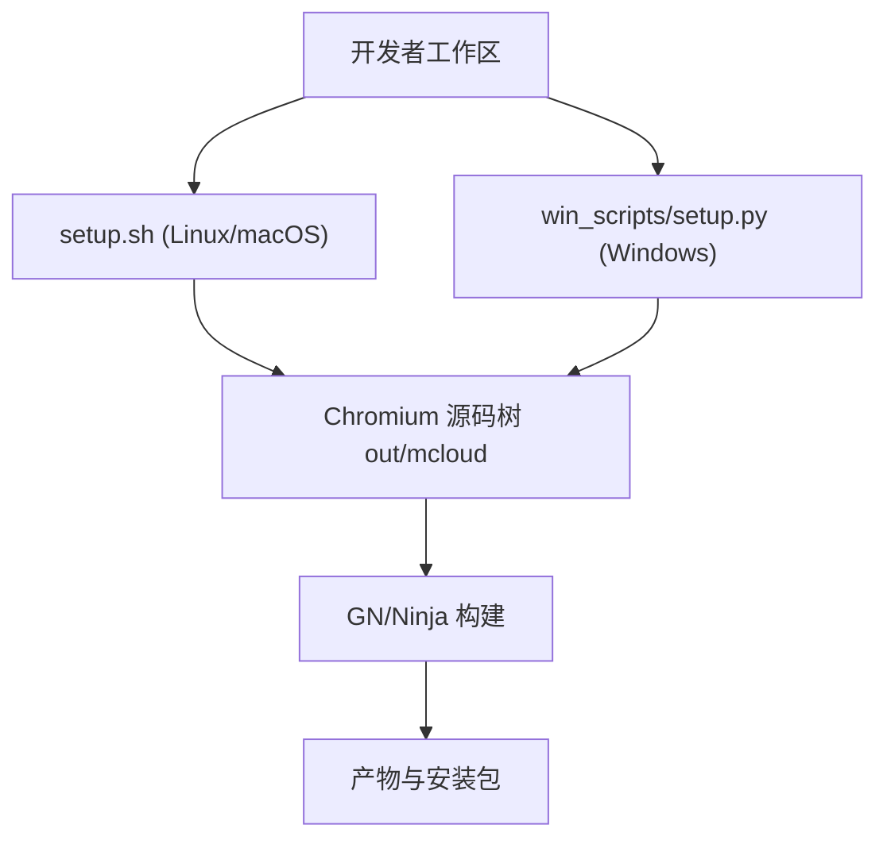
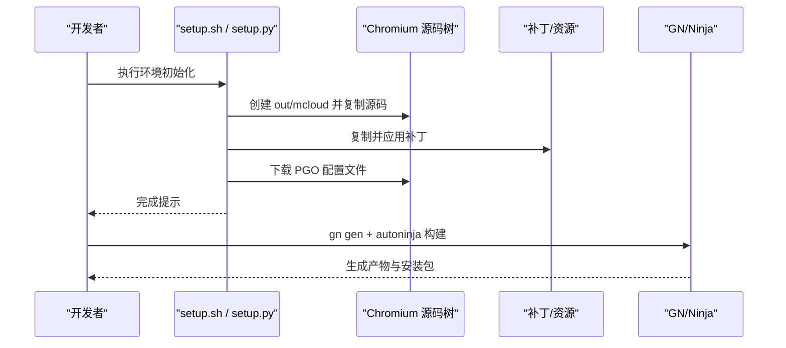
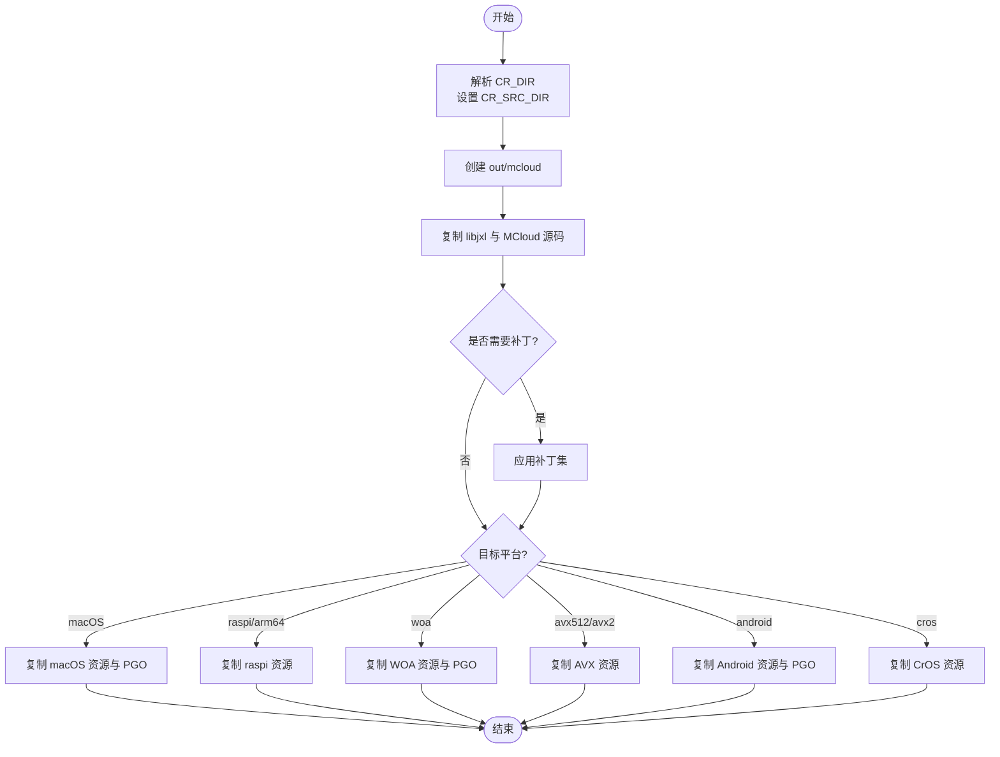
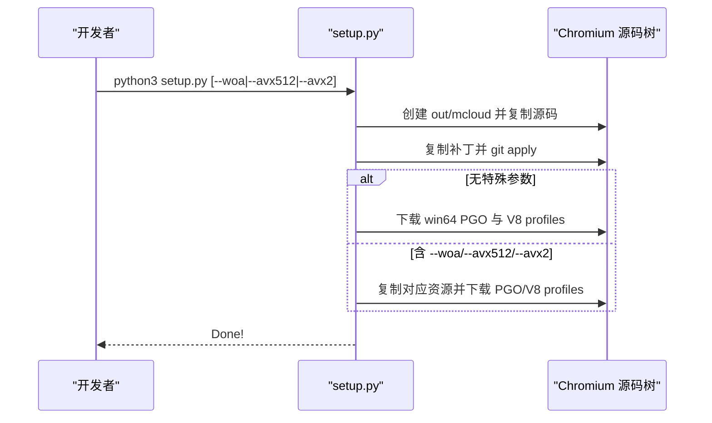
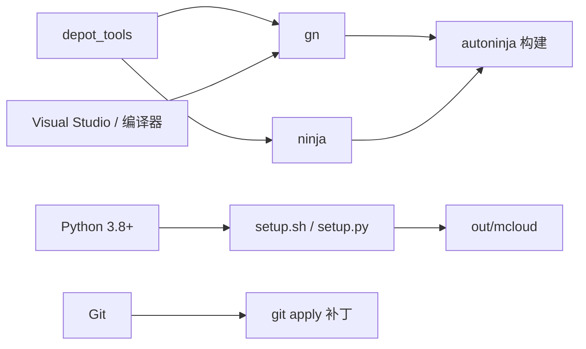

# 环境初始化脚本

<cite>
**本文引用的文件**
- [setup.sh](file://setup.sh)
- [win_scripts/setup.py](file://win_scripts/setup.py)
- [build.sh](file://build.sh)
- [README.md](file://README.md)
- [args.gn](file://args.gn)
- [win_args.gn](file://win_args.gn)
- [depot_tools/win_toolchain/package_from_installed.py](file://depot_tools/win_toolchain/package_from_installed.py)
- [src/chrome/app/chrome_main_delegate.cc](file://src/chrome/app/chrome_main_delegate.cc)
- [src/chrome/installer/linux/common/installer.include](file://src/chrome/installer/linux/common/installer.include)
- [src/chrome/installer/linux/common/installer.py](file://src/chrome/installer/linux/common/installer.py)
- [infra/CMDLINE_FLAGS_LIST.md](file://infra/CMDLINE_FLAGS_LIST.md)
- [docs/CMDLINE_FLAGS_LIST.md](file://docs/CMDLINE_FLAGS_LIST.md)
</cite>

## 目录
1. [简介](#简介)
2. [项目结构](#项目结构)
3. [核心组件](#核心组件)
4. [架构总览](#架构总览)
5. [详细组件分析](#详细组件分析)
6. [依赖关系分析](#依赖关系分析)
7. [性能与构建特性](#性能与构建特性)
8. [故障排除指南](#故障排除指南)
9. [结论](#结论)
10. [附录](#附录)

## 简介
本文件聚焦于 MCloud Browser 的“环境初始化脚本”，系统性说明 setup.sh（Linux/macOS）与 win_scripts/setup.py（Windows）在环境检查、依赖安装、工具链配置、环境变量管理、路径设置、权限校验等方面的行为，并给出搭建过程中的常见问题与排错建议。同时结合 README 中的前置条件与构建步骤，形成从源码到可运行环境的完整指引。

## 项目结构
- 平台相关的环境初始化脚本：
  - Linux/macOS: setup.sh
  - Windows: win_scripts/setup.py
- 构建入口与参数：
  - build.sh（Linux 构建包装）
  - args.gn / win_args.gn（GN 构建参数）
- 工具链与依赖：
  - depot_tools（Chromium 官方工具链）
  - Python 3.8+（由 README 指定；部分内部脚本要求 Python 3）
- 运行时与环境变量：
  - CR_DIR/THOR_DIR（源码与输出路径）
  - DEPOT_TOOLS_WIN_TOOLCHAIN、NINJA_SUMMARIZE_BUILD、vs2026_install、INCLUDE（Windows 构建）
  - CHROME_USER_DATA_DIR（Linux 多实例用户数据目录）

**图表来源**
- [setup.sh:45-90](file://setup.sh#L45-L90)
- [win_scripts/setup.py:66-131](file://win_scripts/setup.py#L66-L131)
- [build.sh:29-51](file://build.sh#L29-L51)

**章节来源**
- [setup.sh:45-90](file://setup.sh#L45-L90)
- [win_scripts/setup.py:66-131](file://win_scripts/setup.py#L66-L131)
- [build.sh:29-51](file://build.sh#L29-L51)

## 核心组件
- setup.sh（Linux/macOS）
  - 创建输出目录 out/mcloud
  - 复制 mcloud-libjxl 与 MCloud 定制源码至 Chromium 源码树
  - 应用一系列补丁（FFmpeg HEVC、策略模板、FTP、GPC、UI、下载栏、WebUI、更新器、快捷键、隐私沙盒等）
  - 按目标平台复制额外资源（macOS、Raspberry Pi、Windows on ARM、AVX2/AVX512、Android、CrOS）
  - 下载 PGO 优化配置文件（针对各目标）
- win_scripts/setup.py（Windows）
  - 读取 CR_DIR/THOR_DIR 环境变量定位源码与仓库根
  - 复制 libjxl 与 MCloud 定制源码至 Chromium 源码树
  - 复制必要二进制与 shell 资源
  - 应用与 Linux 端一致的补丁集
  - 根据是否传入 --woa/--avx512/--avx2 选择对应资源与 PGO 下载
- 构建与参数
  - build.sh 封装 ninja 构建与打包流程
  - args.gn / win_args.gn 定义编译选项、媒体能力、PGO 路径等

**章节来源**
- [setup.sh:54-201](file://setup.sh#L54-L201)
- [setup.sh:230-372](file://setup.sh#L230-L372)
- [win_scripts/setup.py:66-168](file://win_scripts/setup.py#L66-L168)
- [win_scripts/setup.py:171-267](file://win_scripts/setup.py#L171-L267)
- [win_scripts/setup.py:287-403](file://win_scripts/setup.py#L287-L403)
- [build.sh:29-51](file://build.sh#L29-L51)
- [args.gn:1-87](file://args.gn#L1-L87)
- [win_args.gn:1-87](file://win_args.gn#L1-L87)

## 架构总览
环境初始化整体流程如下：
- 解析环境变量与命令行参数
- 准备输出目录与源码拷贝
- 应用补丁与平台特定资源
- 下载 PGO 优化数据
- 进入 GN/Ninja 构建阶段

**图表来源**
- [setup.sh:54-201](file://setup.sh#L54-L201)
- [win_scripts/setup.py:66-267](file://win_scripts/setup.py#L66-L267)
- [build.sh:42-51](file://build.sh#L42-L51)

## 详细组件分析

### setup.sh（Linux/macOS）
- 环境变量与路径
  - CR_DIR 用于覆盖 Chromium 源码位置，默认 ~/chromium/src
  - 输出目录固定为 out/mcloud
- 源码与资源复制
  - 复制 mcloud-libjxl 与 src/* 子树到 Chromium 源码树
  - 复制 mcloud_shell、pak 工具与标志文件到 out/mcloud
- 补丁应用
  - FFmpeg HEVC 解码相关补丁
  - 策略模板、FTP、GPC、UI、下载栏、WebUI、更新器、快捷键、隐私沙盒等
- 平台分支
  - macOS：复制 arm 配置与版本信息，下载 PGO
  - Raspberry Pi/ARM64：复制第三方库与构建配置
  - Windows on ARM：复制资源并下载 PGO
  - AVX512/AVX2：复制第三方库与版本信息
  - Android：复制构建配置并删除冲突图标资源，下载 PGO
  - CrOS：复制 ChromiumOS 相关资源
- 错误处理
  - 使用自定义 die/try 包装命令失败退出码

**图表来源**
- [setup.sh:45-90](file://setup.sh#L45-L90)
- [setup.sh:91-201](file://setup.sh#L91-L201)
- [setup.sh:230-372](file://setup.sh#L230-L372)

**章节来源**
- [setup.sh:45-90](file://setup.sh#L45-L90)
- [setup.sh:91-201](file://setup.sh#L91-L201)
- [setup.sh:230-372](file://setup.sh#L230-L372)

### win_scripts/setup.py（Windows）
- 环境变量与路径
  - CR_DIR 默认 C:/src/chromium/src
  - THOR_DIR 默认 %USERPROFILE%/mcloud
- 源码与资源复制
  - 复制 libjxl 与 MCloud 源码到 Chromium 源码树
  - 复制 mcloud_shell、pak 工具到 out/mcloud
- 补丁应用
  - 与 Linux 端一致，包括 FFmpeg HEVC、策略模板、FTP、GPC、UI、下载栏、WebUI、更新器、快捷键、隐私沙盒等
- 平台分支与 PGO
  - 未传特殊参数时，下载 Windows x64 PGO 与 V8 builtins profile
  - 传入 --woa/--avx512/--avx2 时，复制对应资源并下载相应 PGO
- 错误处理
  - try_run 包装 subprocess 调用，失败则统一报错退出

**图表来源**
- [win_scripts/setup.py:66-131](file://win_scripts/setup.py#L66-L131)
- [win_scripts/setup.py:171-267](file://win_scripts/setup.py#L171-L267)
- [win_scripts/setup.py:287-403](file://win_scripts/setup.py#L287-L403)

**章节来源**
- [win_scripts/setup.py:66-131](file://win_scripts/setup.py#L66-L131)
- [win_scripts/setup.py:171-267](file://win_scripts/setup.py#L171-L267)
- [win_scripts/setup.py:287-403](file://win_scripts/setup.py#L287-L403)

### 构建与参数（build.sh、args.gn、win_args.gn）
- build.sh
  - 设置 NINJA_SUMMARIZE_BUILD 与 NINJA_STATUS
  - 调用 autoninja 构建 mcloud_all 与安装包（deb/rpm）
- args.gn / win_args.gn
  - 启用媒体编解码（HEVC、AC3/E-AC3、Dolby Vision、MPEG-H、DTS）
  - 启用 Widevine、HLS、V8 优化、ThinLTO、PGO
  - 指定 pgo_data_path（需与实际 profdata 文件名匹配）

**章节来源**
- [build.sh:29-51](file://build.sh#L29-L51)
- [args.gn:1-87](file://args.gn#L1-L87)
- [win_args.gn:1-87](file://win_args.gn#L1-L87)

## 依赖关系分析
- 外部工具链
  - depot_tools：提供 gclient、gn、ninja 等工具
  - Visual Studio Build Tools（Windows）或系统编译器（Linux/macOS）
  - Git（用于应用补丁）
- Python 版本
  - README 要求 Python 3.8+
  - 内部脚本（如 package_from_installed.py）要求 Python 3
- 系统组件验证
  - 通过 git apply 验证补丁可用性
  - 通过 PGO 下载脚本验证网络与目标平台支持
- 路径与权限
  - 输出目录 out/mcloud 需要写入权限
  - Linux 安装阶段会校验文件权限（见 installer.include/installer.py）

**图表来源**
- [depot_tools/win_toolchain/package_from_installed.py:502-537](file://depot_tools/win_toolchain/package_from_installed.py#L502-L537)
- [README.md:194-212](file://README.md#L194-L212)
- [src/chrome/installer/linux/common/installer.include:404-443](file://src/chrome/installer/linux/common/installer.include#L404-L443)
- [src/chrome/installer/linux/common/installer.py:719-752](file://src/chrome/installer/linux/common/installer.py#L719-L752)

**章节来源**
- [depot_tools/win_toolchain/package_from_installed.py:502-537](file://depot_tools/win_toolchain/package_from_installed.py#L502-L537)
- [README.md:194-212](file://README.md#L194-L212)
- [src/chrome/installer/linux/common/installer.include:404-443](file://src/chrome/installer/linux/common/installer.include#L404-L443)
- [src/chrome/installer/linux/common/installer.py:719-752](file://src/chrome/installer/linux/common/installer.py#L719-L752)

## 性能与构建特性
- 编译器与链接器
  - 启用 ThinLTO、LLD、V8 内置优化、Maglev/TurboFan
- 媒体能力
  - 启用 HEVC、AC3/E-AC3、Dolby Vision、MPEG-H、DTS、HLS
- PGO
  - 通过 tools/update_pgo_profiles.py 下载与 v8/tools/builtins-pgo/download_profiles.py 获取 V8 builtins profile
  - args.gn/win_args.gn 中 pgo_data_path 需与实际文件匹配
- 运行时标志
  - 参考 CMDLINE_FLAGS_LIST 了解可用开关（例如 --user-response-timeout、--utility-*、--v8-cache-options 等）

**章节来源**
- [args.gn:45-87](file://args.gn#L45-L87)
- [win_args.gn:45-87](file://win_args.gn#L45-L87)
- [infra/CMDLINE_FLAGS_LIST.md:2686-2712](file://infra/CMDLINE_FLAGS_LIST.md#L2686-L2712)
- [docs/CMDLINE_FLAGS_LIST.md:2686-2712](file://docs/CMDLINE_FLAGS_LIST.md#L2686-L2712)

## 故障排除指南
- Python 版本不满足
  - 现象：内部脚本报错或无法执行
  - 解决：确保 Python 3.8+；某些内部脚本要求 Python 3
  - 依据：README 指定 Python 3.8+；package_from_installed.py 要求 Python 3
- 环境变量缺失或错误
  - CR_DIR/THOR_DIR 未设置或指向错误路径
  - Windows 构建缺少 DEPOT_TOOLS_WIN_TOOLCHAIN=0、vs2026_install、INCLUDE
  - 解决：按 README 设置环境变量并确保 PATH 包含 depot_tools
- 补丁应用失败
  - 现象：git apply 报错
  - 原因：源码版本不匹配或缺少必要工具
  - 解决：确认 Chromium 源码版本与补丁兼容；确保已安装 Git
- PGO 下载失败
  - 现象：tools/update_pgo_profiles.py 或 v8 builtins profile 下载失败
  - 原因：网络问题或目标平台不支持
  - 解决：检查网络与目标平台；确认 args.gn/win_args.gn 中 pgo_data_path 与实际文件一致
- 权限问题
  - 现象：无法写入 out/mcloud 或安装阶段权限校验失败
  - 解决：确保对输出目录有写权限；Linux 安装阶段会校验文件权限（目录 755、符号链接 777、特定二进制 4755 等）
- 多实例用户数据目录（Linux）
  - 可通过 CHROME_USER_DATA_DIR 指定用户数据目录以支持虚拟桌面或多实例场景

**章节来源**
- [README.md:194-212](file://README.md#L194-L212)
- [depot_tools/win_toolchain/package_from_installed.py:502-537](file://depot_tools/win_toolchain/package_from_installed.py#L502-L537)
- [src/chrome/app/chrome_main_delegate.cc:605-636](file://src/chrome/app/chrome_main_delegate.cc#L605-L636)
- [src/chrome/installer/linux/common/installer.include:404-443](file://src/chrome/installer/linux/common/installer.include#L404-L443)
- [src/chrome/installer/linux/common/installer.py:719-752](file://src/chrome/installer/linux/common/installer.py#L719-L752)

## 结论
setup.sh 与 win_scripts/setup.py 提供了跨平台的 MCloud Browser 环境初始化能力，涵盖源码复制、补丁应用、平台资源注入与 PGO 配置下载。配合 README 的前置条件与构建步骤，可在 Windows/Linux/macOS 上快速搭建可构建环境。建议在正式构建前严格校验 Python 版本、环境变量与路径权限，并在补丁与 PGO 环节关注网络与版本兼容性。

## 附录
- 常用环境变量
  - CR_DIR：Chromium 源码目录（默认 ~/chromium/src 或 C:/src/chromium/src）
  - THOR_DIR：MCloud 仓库根目录（默认 %USERPROFILE%/mcloud）
  - DEPOT_TOOLS_WIN_TOOLCHAIN：Windows 构建时设为 0 以使用本地 VS
  - vs2026_install：VS 安装路径
  - INCLUDE：ATL 头文件路径（Windows）
  - NINJA_SUMMARIZE_BUILD：构建摘要开关
  - CHROME_USER_DATA_DIR：Linux 多实例用户数据目录
- 构建参数要点
  - args.gn/win_args.gn 中 pgo_data_path 必须与实际 profdata 文件名一致
  - 媒体能力与 Widevine 需在 GN 参数中显式启用
- 参考文档
  - README 中的前置条件与构建步骤
  - CMDLINE_FLAGS_LIST 中的运行时标志列表