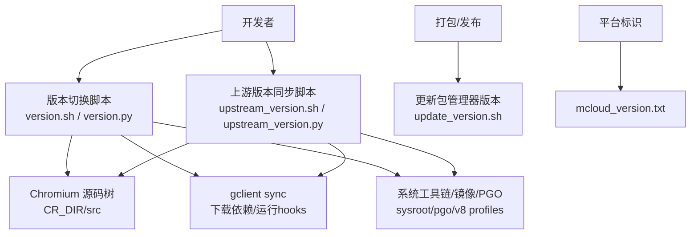
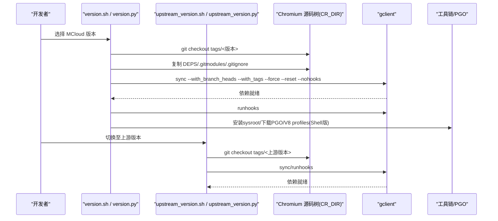
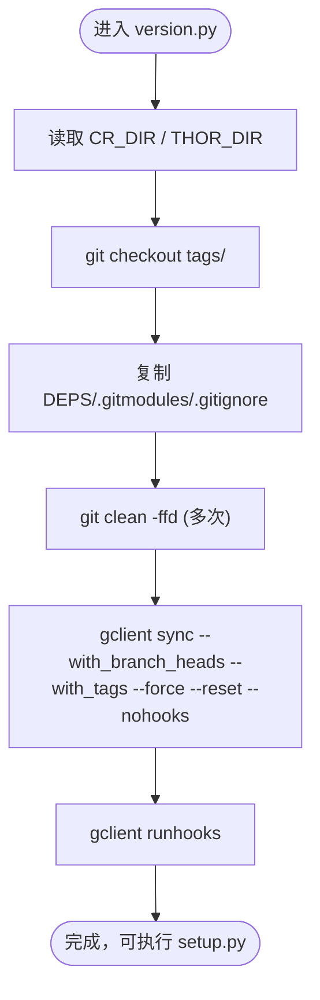
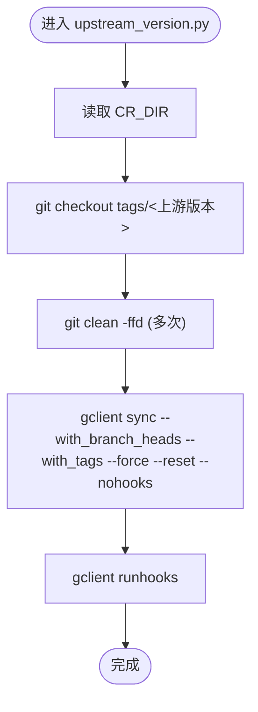
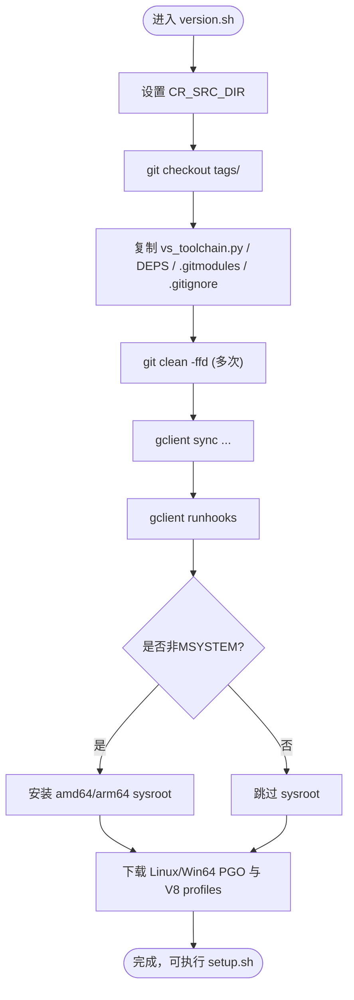
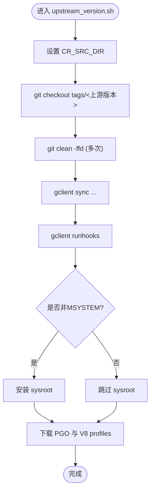
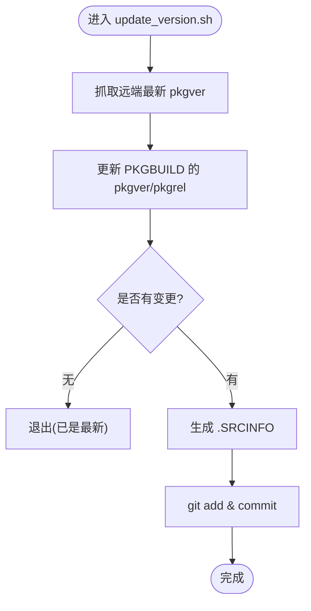
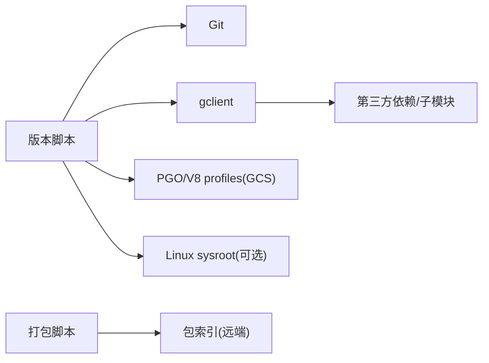

# 版本管理

本文引用的文件

- [version.py](https://github.com/Mcloud136/Mcloud-Browser/blob/main/win_scripts/version.py)
- [upstream_version.py](https://github.com/Mcloud136/Mcloud-Browser/blob/main/win_scripts/upstream_version.py)
- [version.sh](https://github.com/Mcloud136/Mcloud-Browser/blob/main/version.sh)
- [upstream_version.sh](https://github.com/Mcloud136/Mcloud-Browser/blob/main/upstream_version.sh)
- [update_version.sh](https://github.com/Mcloud136/Mcloud-Browser/blob/main/infra/Arch_Linux/update_version.sh)
- [mcloud_version.txt](https://github.com/Mcloud136/Mcloud-Browser/blob/main/other/CrOS/mcloud_version.txt)

## 目录
1. [简介](#简介)
2. [项目结构](#项目结构)
3. [核心组件](#核心组件)
4. [架构总览](#架构总览)
5. [详细组件分析](#详细组件分析)
6. [依赖关系分析](#依赖关系分析)
7. [性能与构建考量](#性能与构建考量)
8. [故障排查指南](#故障排查指南)
9. [结论](#结论)
10. [附录](#附录)

## 简介
本文件面向 Thorium/MCloud Browser 的版本管理工作流，聚焦以下目标：
- 说明 version.py 与 upstream_version.py 的功能与职责边界
- 解释版本号生成、上游版本同步、版本信息管理的机制
- 描述版本文件的结构与格式要求
- 阐述与 Chromium 上游版本的同步机制与策略
- 提供版本升级流程与回滚方案
- 给出版本兼容性检查与冲突解决指南

## 项目结构
仓库围绕“版本切换 + 源码同步 + 工具链准备”的流水线组织。关键脚本位于根目录与 win_scripts 目录：
- 根目录 shell 脚本（Linux/macOS/WSL）：version.sh、upstream_version.sh
- Windows 原生脚本：win_scripts/version.py、win_scripts/upstream_version.py
- 发行版打包辅助：infra/Arch_Linux/update_version.sh
- 平台特定版本标识：other/CrOS/mcloud_version.txt

图表来源
- [version.sh:39-112](https://github.com/Mcloud136/Mcloud-Browser/blob/main/version.sh#L39-L112)
- [upstream_version.sh:39-99](https://github.com/Mcloud136/Mcloud-Browser/blob/main/upstream_version.sh#L39-L99)
- [version.py:56-100](https://github.com/Mcloud136/Mcloud-Browser/blob/main/win_scripts/version.py#L56-L100)
- [upstream_version.py:43-71](https://github.com/Mcloud136/Mcloud-Browser/blob/main/win_scripts/upstream_version.py#L43-L71)
- [update_version.sh:1-36](https://github.com/Mcloud136/Mcloud-Browser/blob/main/infra/Arch_Linux/update_version.sh#L1-L36)
- [mcloud_version.txt:1-2](https://github.com/Mcloud136/Mcloud-Browser/blob/main/other/CrOS/mcloud_version.txt#L1-L2)

章节来源
- [version.sh:39-112](https://github.com/Mcloud136/Mcloud-Browser/blob/main/version.sh#L39-L112)
- [upstream_version.sh:39-99](https://github.com/Mcloud136/Mcloud-Browser/blob/main/upstream_version.sh#L39-L99)
- [version.py:56-100](https://github.com/Mcloud136/Mcloud-Browser/blob/main/win_scripts/version.py#L56-L100)
- [upstream_version.py:43-71](https://github.com/Mcloud136/Mcloud-Browser/blob/main/win_scripts/upstream_version.py#L43-L71)
- [update_version.sh:1-36](https://github.com/Mcloud136/Mcloud-Browser/blob/main/infra/Arch_Linux/update_version.sh#L1-L36)
- [mcloud_version.txt:1-2](https://github.com/Mcloud136/Mcloud-Browser/blob/main/other/CrOS/mcloud_version.txt#L1-L2)

## 核心组件
- version.py（Windows 原生）：将 Chromium 源码树切换到当前 MCloud 版本标签，复制必要的 DEPS/.gitmodules/.gitignore，执行 gclient sync 并运行 hooks，为后续 setup/build 做准备。
- upstream_version.py（Windows 原生）：将 Chromium 源码树切换到指定上游版本标签，执行 gclient sync 并运行 hooks，用于对齐上游或进行上游特性验证。
- version.sh（Shell）：在 Linux/macOS/WSL 上完成与 version.py 相同的目标，额外包含 sysroot 安装与 PGO/V8 profiles 下载。
- upstream_version.sh（Shell）：在 Linux/macOS/WSL 上完成与 upstream_version.py 相同的目标，同样包含 sysroot 与 PGO/V8 profiles 下载。
- update_version.sh（Arch Linux 打包）：从远端包索引拉取最新版本号，更新 PKGBUILD 与 .SRCINFO，便于自动化发布。
- mcloud_version.txt（ChromeOS 标识）：平台特定的版本标识文件，用于区分或标记 ChromeOS 相关构建上下文。

章节来源
- [version.py:56-100](https://github.com/Mcloud136/Mcloud-Browser/blob/main/win_scripts/version.py#L56-L100)
- [upstream_version.py:43-71](https://github.com/Mcloud136/Mcloud-Browser/blob/main/win_scripts/upstream_version.py#L43-L71)
- [version.sh:39-112](https://github.com/Mcloud136/Mcloud-Browser/blob/main/version.sh#L39-L112)
- [upstream_version.sh:39-99](https://github.com/Mcloud136/Mcloud-Browser/blob/main/upstream_version.sh#L39-L99)
- [update_version.sh:1-36](https://github.com/Mcloud136/Mcloud-Browser/blob/main/infra/Arch_Linux/update_version.sh#L1-L36)
- [mcloud_version.txt:1-2](https://github.com/Mcloud136/Mcloud-Browser/blob/main/other/CrOS/mcloud_version.txt#L1-L2)

## 架构总览
版本管理由“版本选择 → 源码切换 → 依赖同步 → 工具链准备 → 构建/打包”构成闭环。Windows 与 Shell 两套脚本实现等价能力，适配各自平台差异。

图表来源
- [version.sh:49-112](https://github.com/Mcloud136/Mcloud-Browser/blob/main/version.sh#L49-L112)
- [version.py:63-100](https://github.com/Mcloud136/Mcloud-Browser/blob/main/win_scripts/version.py#L63-L100)
- [upstream_version.sh:49-99](https://github.com/Mcloud136/Mcloud-Browser/blob/main/upstream_version.sh#L49-L99)
- [upstream_version.py:50-71](https://github.com/Mcloud136/Mcloud-Browser/blob/main/win_scripts/upstream_version.py#L50-L71)

## 详细组件分析

### version.py（Windows 原生版本切换）
- 功能要点
  - 读取环境变量 CR_DIR、THOR_DIR，定位 Chromium 源码与 MCloud 工程路径
  - 固定当前 MCloud 版本字符串，切到对应 tag
  - 复制 libjxl 相关的 DEPS/.gitmodules/.gitignore 到 Chromium 源码树
  - 清理工作区后执行 gclient sync 与 runhooks
- 错误处理
  - 统一 fail/try_run 封装，失败即退出
- 适用场景
  - 本地 Windows 原生构建前的环境准备

图表来源
- [version.py:49-100](https://github.com/Mcloud136/Mcloud-Browser/blob/main/win_scripts/version.py#L49-L100)

章节来源
- [version.py:49-100](https://github.com/Mcloud136/Mcloud-Browser/blob/main/win_scripts/version.py#L49-L100)

### upstream_version.py（Windows 原生上游版本同步）
- 功能要点
  - 读取 CR_DIR，固定上游 Chromium 版本字符串，切到对应 tag
  - 清理并执行 gclient sync 与 runhooks
- 适用场景
  - 对齐上游以验证兼容性或引入新特性

图表来源
- [upstream_version.py:39-71](https://github.com/Mcloud136/Mcloud-Browser/blob/main/win_scripts/upstream_version.py#L39-L71)

章节来源
- [upstream_version.py:39-71](https://github.com/Mcloud136/Mcloud-Browser/blob/main/win_scripts/upstream_version.py#L39-L71)

### version.sh（Shell 版本切换）
- 功能要点
  - 设置 CR_SRC_DIR，固定 MCloud 版本，切到 tag
  - 复制 build/vs_toolchain.py 与 libjxl 相关 DEPS/.gitmodules/.gitignore
  - 清理并执行 gclient sync/runhooks
  - 在非 MSYSTEM 环境下安装 amd64/arm64 sysroot
  - 下载 Linux/Win64 PGO 与 V8 builtins PGO profiles
- 适用场景
  - Linux/macOS/WSL 下的完整构建前准备

图表来源
- [version.sh:39-112](https://github.com/Mcloud136/Mcloud-Browser/blob/main/version.sh#L39-L112)

章节来源
- [version.sh:39-112](https://github.com/Mcloud136/Mcloud-Browser/blob/main/version.sh#L39-L112)

### upstream_version.sh（Shell 上游版本同步）
- 功能要点
  - 设置 CR_SRC_DIR，固定上游版本，切到 tag
  - 清理并执行 gclient sync/runhooks
  - 在非 MSYSTEM 环境下安装 sysroot
  - 下载 PGO 与 V8 profiles
- 适用场景
  - 上游对齐与特性验证

图表来源
- [upstream_version.sh:39-99](https://github.com/Mcloud136/Mcloud-Browser/blob/main/upstream_version.sh#L39-L99)

章节来源
- [upstream_version.sh:39-99](https://github.com/Mcloud136/Mcloud-Browser/blob/main/upstream_version.sh#L39-L99)

### update_version.sh（Arch Linux 包版本更新）
- 功能要点
  - 从远端包索引获取最新 pkgver
  - 更新 PKGBUILD 中的 pkgver/pkgrel
  - 重新生成 .SRCINFO 并提交变更
- 适用场景
  - 自动化发布流程中同步上游/官方发布的版本

图表来源
- [update_version.sh:1-36](https://github.com/Mcloud136/Mcloud-Browser/blob/main/infra/Arch_Linux/update_version.sh#L1-L36)

章节来源
- [update_version.sh:1-36](https://github.com/Mcloud136/Mcloud-Browser/blob/main/infra/Arch_Linux/update_version.sh#L1-L36)

### mcloud_version.txt（ChromeOS 版本标识）
- 内容为一个平台标识字符串，用于区分 ChromeOS 构建上下文
- 通常作为占位或标记用途，不直接参与版本号解析

章节来源
- [mcloud_version.txt:1-2](https://github.com/Mcloud136/Mcloud-Browser/blob/main/other/CrOS/mcloud_version.txt#L1-L2)

## 依赖关系分析
- 脚本对 Git/gclient 的强依赖：通过 git checkout 与 gclient sync/runhooks 管理源码与第三方依赖
- 平台差异：
  - Shell 脚本在 Linux/macOS/WSL 下会安装 sysroot 并下载 PGO/V8 profiles
  - Python 脚本在 Windows 下简化了 sysroot 与 PGO 步骤（仅 win64 PGO 按需）
- 外部资源：
  - Chromium 源码仓库的 tags
  - Google Cloud Storage 上的优化 profile（PGO/V8）
  - Arch Linux 包索引（update_version.sh）

图表来源
- [version.sh:76-112](https://github.com/Mcloud136/Mcloud-Browser/blob/main/version.sh#L76-L112)
- [upstream_version.sh:64-99](https://github.com/Mcloud136/Mcloud-Browser/blob/main/upstream_version.sh#L64-L99)
- [version.py:63-100](https://github.com/Mcloud136/Mcloud-Browser/blob/main/win_scripts/version.py#L63-L100)
- [upstream_version.py:50-71](https://github.com/Mcloud136/Mcloud-Browser/blob/main/win_scripts/upstream_version.py#L50-L71)
- [update_version.sh:1-36](https://github.com/Mcloud136/Mcloud-Browser/blob/main/infra/Arch_Linux/update_version.sh#L1-L36)

章节来源
- [version.sh:76-112](https://github.com/Mcloud136/Mcloud-Browser/blob/main/version.sh#L76-L112)
- [upstream_version.sh:64-99](https://github.com/Mcloud136/Mcloud-Browser/blob/main/upstream_version.sh#L64-L99)
- [version.py:63-100](https://github.com/Mcloud136/Mcloud-Browser/blob/main/win_scripts/version.py#L63-L100)
- [upstream_version.py:50-71](https://github.com/Mcloud136/Mcloud-Browser/blob/main/win_scripts/upstream_version.py#L50-L71)
- [update_version.sh:1-36](https://github.com/Mcloud136/Mcloud-Browser/blob/main/infra/Arch_Linux/update_version.sh#L1-L36)

## 性能与构建考量
- PGO/V8 profiles：确保使用与当前 Chromium 版本匹配的 profile，避免函数签名变化导致的 profile 拒绝问题
- gclient sync 参数：--with_branch_heads --with_tags --force --reset --delete_unversioned_trees 保证依赖一致性，但会清理未跟踪目录，需谨慎操作
- sysroot：仅在需要交叉编译或多架构支持时安装，减少不必要的网络与磁盘开销
- 构建缓存：保持 buildtools 与 gn 版本稳定，避免因工具链漂移导致构建失败

[本节为通用指导，无需具体文件引用]

## 故障排查指南
- 常见问题
  - 切换 tag 失败：确认 CR_DIR 指向正确的 Chromium 源码目录，且具备读写权限
  - gclient sync 失败：检查网络与代理配置；必要时重复执行清理与同步
  - PGO/V8 profiles 不匹配：核对 v8 版本与 profile 版本一致，必要时从 GCS 按版本直连下载
  - sysroot 缺失：在非 MSYSTEM 环境下确保已安装 amd64/arm64 sysroot
- 建议步骤
  - 先执行 git clean -ffd 清理工作区
  - 再执行 gclient sync --with_branch_heads --with_tags --force --reset --nohooks
  - 最后执行 gclient runhooks 初始化钩子
  - 若涉及工具链，确保 gn/cipd 等工具版本符合 DEPS 约束

章节来源
- [version.sh:65-112](https://github.com/Mcloud136/Mcloud-Browser/blob/main/version.sh#L65-L112)
- [upstream_version.sh:53-99](https://github.com/Mcloud136/Mcloud-Browser/blob/main/upstream_version.sh#L53-L99)
- [version.py:63-100](https://github.com/Mcloud136/Mcloud-Browser/blob/main/win_scripts/version.py#L63-L100)
- [upstream_version.py:50-71](https://github.com/Mcloud136/Mcloud-Browser/blob/main/win_scripts/upstream_version.py#L50-L71)

## 结论
本项目通过跨平台的版本切换与上游同步脚本，实现了稳定的版本管理与构建前置准备。version.py 与 upstream_version.py 分别服务于 MCloud 版本与上游版本切换；Shell 脚本在 Linux/macOS/WSL 下补充了 sysroot 与 PGO/V8 profiles 的准备。配合 update_version.sh 可实现自动化发布。遵循本文的流程与排障建议，可有效降低版本升级过程中的风险与成本。

[本节为总结性内容，无需具体文件引用]

## 附录

### 版本文件格式与约定
- 版本字符串：采用点分十进制形式（如 X.Y.Z.W），由脚本内常量或远端索引决定
- 标签命名：Chromium 源码使用 tags/<版本> 的形式进行定点切换
- 平台标识：mcloud_version.txt 用于平台上下文标记，不参与版本号解析

章节来源
- [version.sh:39-45](https://github.com/Mcloud136/Mcloud-Browser/blob/main/version.sh#L39-L45)
- [upstream_version.sh:39-45](https://github.com/Mcloud136/Mcloud-Browser/blob/main/upstream_version.sh#L39-L45)
- [version.py:56-61](https://github.com/Mcloud136/Mcloud-Browser/blob/main/win_scripts/version.py#L56-L61)
- [upstream_version.py:43-48](https://github.com/Mcloud136/Mcloud-Browser/blob/main/win_scripts/upstream_version.py#L43-L48)
- [mcloud_version.txt:1-2](https://github.com/Mcloud136/Mcloud-Browser/blob/main/other/CrOS/mcloud_version.txt#L1-L2)

### 版本升级流程（推荐）
- 确定目标版本：选择 MCloud 或上游版本
- 切换源码：执行 version.sh/version.py 或 upstream_version.sh/upstream_version.py
- 同步依赖：等待 gclient sync/runhooks 完成
- 准备工具链：安装 sysroot、下载 PGO/V8 profiles（Shell 脚本自动处理）
- 构建与测试：执行 setup/build 流程并进行回归测试
- 发布与打包：使用 update_version.sh 更新包管理器版本并提交变更

章节来源
- [version.sh:49-112](https://github.com/Mcloud136/Mcloud-Browser/blob/main/version.sh#L49-L112)
- [upstream_version.sh:49-99](https://github.com/Mcloud136/Mcloud-Browser/blob/main/upstream_version.sh#L49-L99)
- [version.py:63-100](https://github.com/Mcloud136/Mcloud-Browser/blob/main/win_scripts/version.py#L63-L100)
- [upstream_version.py:50-71](https://github.com/Mcloud136/Mcloud-Browser/blob/main/win_scripts/upstream_version.py#L50-L71)
- [update_version.sh:1-36](https://github.com/Mcloud136/Mcloud-Browser/blob/main/infra/Arch_Linux/update_version.sh#L1-L36)

### 回滚方案
- 快速回退：再次执行对应脚本并切换到上一个稳定 tag
- 数据保护：在执行 gclient sync 前备份自定义补丁与构建产物
- 工具链恢复：若 gn.exe 或 buildtools 被清理，按 DEPS 固定版本恢复（例如通过 cipd）

章节来源
- [version.sh:65-74](https://github.com/Mcloud136/Mcloud-Browser/blob/main/version.sh#L65-L74)
- [upstream_version.sh:53-62](https://github.com/Mcloud136/Mcloud-Browser/blob/main/upstream_version.sh#L53-L62)
- [version.py:63-96](https://github.com/Mcloud136/Mcloud-Browser/blob/main/win_scripts/version.py#L63-L96)
- [upstream_version.py:50-66](https://github.com/Mcloud136/Mcloud-Browser/blob/main/win_scripts/upstream_version.py#L50-L66)

### 兼容性检查与冲突解决
- 兼容性检查
  - 核对 v8 版本与 PGO/V8 profiles 版本一致
  - 确认 sysroot 与目标架构匹配
  - 检查第三方依赖（如 libjxl）的 DEPS 与 .gitmodules 是否已正确复制
- 冲突解决
  - 若 gclient sync 清除了定制内容，重新应用补丁或恢复必要文件
  - 若工具链版本不一致，按 DEPS 固定版本恢复 gn/cipd 等工具
  - 若出现符号或函数签名不匹配，优先对齐上游版本或调整补丁范围

章节来源
- [version.sh:55-74](https://github.com/Mcloud136/Mcloud-Browser/blob/main/version.sh#L55-L74)
- [upstream_version.sh:53-62](https://github.com/Mcloud136/Mcloud-Browser/blob/main/upstream_version.sh#L53-L62)
- [version.py:63-96](https://github.com/Mcloud136/Mcloud-Browser/blob/main/win_scripts/version.py#L63-L96)
- [upstream_version.py:50-66](https://github.com/Mcloud136/Mcloud-Browser/blob/main/win_scripts/upstream_version.py#L50-L66)