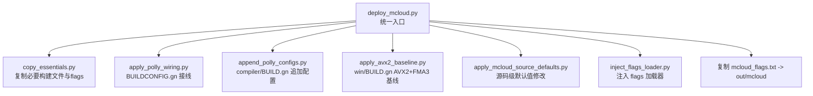
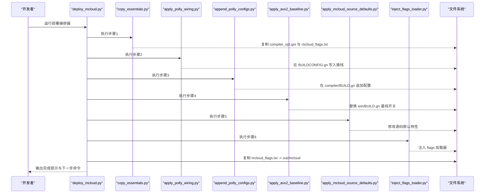
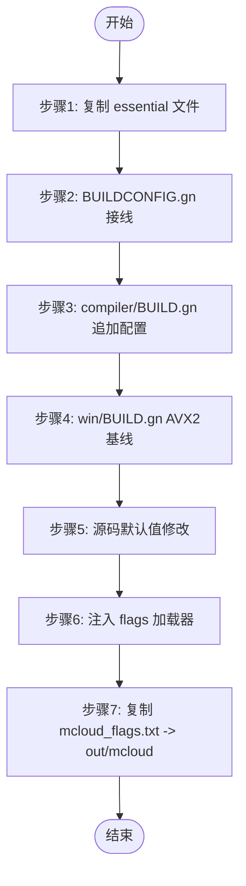

# 部署编排器

<cite>
**本文引用的文件**
- [win_scripts/deploy_mcloud.py](file://win_scripts/deploy_mcloud.py)
- [win_scripts/copy_essentials.py](file://win_scripts/copy_essentials.py)
- [win_scripts/apply_polly_wiring.py](file://win_scripts/apply_polly_wiring.py)
- [win_scripts/append_polly_configs.py](file://win_scripts/append_polly_configs.py)
- [win_scripts/apply_avx2_baseline.py](file://win_scripts/apply_avx2_baseline.py)
- [win_scripts/apply_mcloud_source_defaults.py](file://win_scripts/apply_mcloud_source_defaults.py)
- [win_scripts/inject_flags_loader.py](file://win_scripts/inject_flags_loader.py)
- [mcloud_flags.txt](file://mcloud_flags.txt)
</cite>

## 目录
1. [简介](#简介)
2. [项目结构](#项目结构)
3. [核心组件](#核心组件)
4. [架构总览](#架构总览)
5. [详细步骤分析](#详细步骤分析)
6. [依赖关系与执行顺序](#依赖关系与执行顺序)
7. [环境变量与使用示例](#环境变量与使用示例)
8. [错误处理与幂等性](#错误处理与幂等性)
9. [性能与构建建议](#性能与构建建议)
10. [故障排查指南](#故障排查指南)
11. [结论](#结论)

## 简介
本文件面向“部署编排器”的完整说明，聚焦于统一入口脚本 deploy_mcloud.py 的职责、执行的七个定点部署步骤、各步骤的功能与依赖、环境变量配置（THOR_DIR、CR_DIR）、以及错误处理与幂等性保证。该编排器用于在 Chromium 源码树中注入 MCloud 浏览器所需的构建与运行时优化配置，确保内核升级后仅需一次运行即可完成全部部署。

## 项目结构
部署编排器位于 win_scripts 目录，由一个主入口脚本 orchestrator 多个子步骤脚本组成，配合根目录的 mcloud_flags.txt 提供运行时标志。整体结构如下：

图表来源
- [win_scripts/deploy_mcloud.py:25-46](file://win_scripts/deploy_mcloud.py#L25-L46)

章节来源
- [win_scripts/deploy_mcloud.py:1-51](file://win_scripts/deploy_mcloud.py#L1-L51)

## 核心组件
- 统一入口：deploy_mcloud.py
  - 负责设置 THOR_DIR 与 CR_DIR 环境变量，按固定顺序调用 6 个部署步骤，并在最后将 mcloud_flags.txt 复制到 out/mcloud 目录供运行时读取。
- 六个子步骤脚本：
  - copy_essentials.py：仅复制必要的构建声明文件与 mcloud_flags.txt，避免整体覆盖上游源码导致的漂移。
  - apply_polly_wiring.py：在 BUILDCONFIG.gn 中为可执行与共享库目标接入 Polly 与 emit-relocs 配置。
  - append_polly_configs.py：向 compiler/BUILD.gn 追加 polly 与 emit-relocs 的配置定义，并补齐 import。
  - apply_avx2_baseline.py：将 Windows x64 编译基线从 -msse3 替换为 -mavx2 及相关指令集开关。
  - apply_mcloud_source_defaults.py：对源码中的默认特性进行定点修改（如 D3D12 解码默认启用、后台模式默认关闭、DoH 校验）。
  - inject_flags_loader.py：在 chrome_main_delegate.cc 中注入内置 flags 加载器，启动时从同目录读取 mcloud_flags.txt 并合并到命令行。
- 运行时标志：mcloud_flags.txt
  - 包含大量 --enable-features/--disable-features 与 V8 启动参数，浏览器启动时由内置加载器自动注入。

章节来源
- [win_scripts/deploy_mcloud.py:1-51](file://win_scripts/deploy_mcloud.py#L1-L51)
- [win_scripts/copy_essentials.py:1-50](file://win_scripts/copy_essentials.py#L1-L50)
- [win_scripts/apply_polly_wiring.py:1-47](file://win_scripts/apply_polly_wiring.py#L1-L47)
- [win_scripts/append_polly_configs.py:1-72](file://win_scripts/append_polly_configs.py#L1-L72)
- [win_scripts/apply_avx2_baseline.py:1-27](file://win_scripts/apply_avx2_baseline.py#L1-L27)
- [win_scripts/apply_mcloud_source_defaults.py:1-61](file://win_scripts/apply_mcloud_source_defaults.py#L1-L61)
- [win_scripts/inject_flags_loader.py:1-125](file://win_scripts/inject_flags_loader.py#L1-L125)
- [mcloud_flags.txt:1-120](file://mcloud_flags.txt#L1-L120)

## 架构总览
部署编排器的执行流程如下：

图表来源
- [win_scripts/deploy_mcloud.py:25-46](file://win_scripts/deploy_mcloud.py#L25-L46)
- [win_scripts/copy_essentials.py:18-49](file://win_scripts/copy_essentials.py#L18-L49)
- [win_scripts/apply_polly_wiring.py:9-46](file://win_scripts/apply_polly_wiring.py#L9-L46)
- [win_scripts/append_polly_configs.py:7-71](file://win_scripts/append_polly_configs.py#L7-L71)
- [win_scripts/apply_avx2_baseline.py:6-26](file://win_scripts/apply_avx2_baseline.py#L6-L26)
- [win_scripts/apply_mcloud_source_defaults.py:13-58](file://win_scripts/apply_mcloud_source_defaults.py#L13-L58)
- [win_scripts/inject_flags_loader.py:17-124](file://win_scripts/inject_flags_loader.py#L17-L124)

## 详细步骤分析

### 步骤1：源码复制（copy_essentials.py）
- 功能：
  - 复制编译器优化声明文件 compiler_opt.gni（Thorium 专有，无上游对应物，安全复制）。
  - 将 mcloud_flags.txt 复制到 out/mcloud 目录，便于后续构建与运行时读取。
- 关键点：
  - 路径处理会剥离 “src/” 前缀，避免嵌套目录问题。
  - 若文件不存在则跳过，不中断流程。
- 幂等性：
  - 直接覆盖复制，重复执行不会产生副作用。

章节来源
- [win_scripts/copy_essentials.py:18-49](file://win_scripts/copy_essentials.py#L18-L49)

### 步骤2：Polly 配置接线（apply_polly_wiring.py）
- 功能：
  - 在 BUILDCONFIG.gn 中为可执行与共享库目标接入 Polly 与 emit-relocs 配置。
  - 通过锚点定位 set_defaults("executable") 与 set_defaults("shared_library") 插入接线代码。
- 关键点：
  - 若已存在接线则跳过，避免重复修改。
  - 仅在非 Android/Apple 平台生效。
- 幂等性：
  - 存在性检查 + 唯一锚点断言，确保只插入一次。

章节来源
- [win_scripts/apply_polly_wiring.py:9-46](file://win_scripts/apply_polly_wiring.py#L9-L46)

### 步骤3：Polly 配置追加（append_polly_configs.py）
- 功能：
  - 向 compiler/BUILD.gn 追加 polly 与 emit-relocs 的 config 定义。
  - 确保 import("//build/config/compiler_opt.gni") 存在于作用域内，使 use_polly/use_bolt 可用。
- 关键点：
  - 若已存在 polly 配置块，则仅补齐 import，不会重复追加。
  - 基于 common_optimize_on_ldflags 传递优化开关。
- 幂等性：
  - 存在性检查 + import 补齐逻辑，重复执行安全。

章节来源
- [win_scripts/append_polly_configs.py:7-71](file://win_scripts/append_polly_configs.py#L7-L71)

### 步骤4：AVX2 基线应用（apply_avx2_baseline.py）
- 功能：
  - 将 Windows x64 编译基线从 -msse3 替换为 -mavx2、-mfma、-mf16c、-mlzcnt、-mbmi、-mbmi2。
  - 依据硬件基线规范，提升 SIMD 指令集支持。
- 关键点：
  - 通过锚点匹配替换，确保只在目标位置变更。
  - 若已包含 -mavx2 则跳过。
- 幂等性：
  - 存在性检查 + 锚点断言，重复执行安全。

章节来源
- [win_scripts/apply_avx2_baseline.py:6-26](file://win_scripts/apply_avx2_baseline.py#L6-L26)

### 步骤5：MCloud 源默认值注入（apply_mcloud_source_defaults.py）
- 功能：
  - 将 D3D12 视频解码默认启用（kD3D12VideoDecoder）。
  - 将后台模式默认关闭（kBackgroundModeEnabled），两处注册与设置均改为 false。
  - 校验 DoH 默认值为 kAutomatic（无需修改，仅验证）。
- 关键点：
  - 采用定点 patch_file 函数，旧值替换为新值，未找到锚点时报错退出。
  - 若新值已存在则跳过。
- 幂等性：
  - 存在性检查 + 锚点断言，重复执行安全。

章节来源
- [win_scripts/apply_mcloud_source_defaults.py:15-58](file://win_scripts/apply_mcloud_source_defaults.py#L15-L58)

### 步骤6：flags 加载器注入（inject_flags_loader.py）
- 功能：
  - 在 chrome_main_delegate.cc 中注入 LoadMcloudPerformanceFlags 函数。
  - 在 BasicStartupComplete 开头调用该函数，启动早期从 exe 同目录读取 mcloud_flags.txt 并解析追加到命令行。
  - 自动补齐缺失的 include（如 base/strings/string_split.h）。
- 关键点：
  - 对 enable/disable-features 进行合并策略：内置在前，用户在后，用户条目优先。
  - 其他标志若用户已指定则跳过。
- 幂等性：
  - 若已存在 LoadMcloudPerformanceFlags 则跳过；锚点断言确保注入位置正确。

章节来源
- [win_scripts/inject_flags_loader.py:17-124](file://win_scripts/inject_flags_loader.py#L17-L124)

### 步骤7：复制 mcloud_flags.txt 到 out/mcloud
- 功能：
  - 将根目录的 mcloud_flags.txt 复制到 Chromium 源码树的 out/mcloud 目录，供浏览器运行时读取。
- 关键点：
  - 自动创建 out/mcloud 目录。
  - 使用 shutil.copy2 保留元数据。
- 幂等性：
  - 直接覆盖复制，重复执行安全。

章节来源
- [win_scripts/deploy_mcloud.py:42-46](file://win_scripts/deploy_mcloud.py#L42-L46)

## 依赖关系与执行顺序
- 执行顺序严格固定，任一步骤失败立即中止（fail-fast）。
- 依赖关系：
  - 步骤2依赖步骤3提供的 config 定义（polly/emit-relocs）。
  - 步骤6依赖步骤1或步骤7提供的 mcloud_flags.txt。
  - 步骤5依赖上游源码结构的稳定性（锚点匹配）。
- 流程图：

图表来源
- [win_scripts/deploy_mcloud.py:25-46](file://win_scripts/deploy_mcloud.py#L25-L46)

章节来源
- [win_scripts/deploy_mcloud.py:25-46](file://win_scripts/deploy_mcloud.py#L25-L46)

## 环境变量与使用示例
- 环境变量：
  - THOR_DIR：Thorium 仓库根目录（默认设置为 win_scripts 所在目录的父目录）。
  - CR_DIR：Chromium 源码树根目录（默认指向 D:\wxmuma\chromium-src\src）。
- 使用示例：
  - 设置环境变量后运行部署编排器：
    - 在命令行中设置 THOR_DIR 与 CR_DIR。
    - 执行 python win_scripts/deploy_mcloud.py。
  - 部署完成后执行 gn gen out/mcloud --check 以验证构建配置。
- 注意事项：
  - CR_DIR 必须指向有效的 Chromium 源码树。
  - THOR_DIR 必须包含 mcloud_flags.txt 与 win_scripts 目录。

章节来源
- [win_scripts/deploy_mcloud.py:21-23](file://win_scripts/deploy_mcloud.py#L21-L23)
- [win_scripts/deploy_mcloud.py:42-46](file://win_scripts/deploy_mcloud.py#L42-L46)

## 错误处理与幂等性
- 错误处理：
  - 任一子步骤返回非零退出码，编排器立即打印失败信息并中止。
  - 子步骤内部使用断言与条件检查，确保锚点存在且状态符合预期。
- 幂等性保证：
  - 所有步骤均设计为可重复执行：
    - 存在性检查（如 wiring 已存在、AVX2 基线已应用、加载器已注入）。
    - 定向替换（仅修改目标位置，不影响其他内容）。
    - 安全复制（覆盖式复制，重复执行无副作用）。
- 最佳实践：
  - 每次内核升级后重新运行部署编排器，确保配置与上游同步。
  - 如遇锚点缺失警告，需人工检查上游变更并更新脚本。

章节来源
- [win_scripts/deploy_mcloud.py:35-40](file://win_scripts/deploy_mcloud.py#L35-L40)
- [win_scripts/apply_polly_wiring.py:12-14](file://win_scripts/apply_polly_wiring.py#L12-L14)
- [win_scripts/apply_avx2_baseline.py:9-11](file://win_scripts/apply_avx2_baseline.py#L9-L11)
- [win_scripts/inject_flags_loader.py:20-22](file://win_scripts/inject_flags_loader.py#L20-L22)

## 性能与构建建议
- 编译器优化：
  - AVX2 + FMA3 基线已启用，充分利用现代 CPU 的 SIMD 指令集。
  - Polly 与 emit-relocs 配置已就绪，待工具链就绪后可启用。
- 运行时优化：
  - mcloud_flags.txt 包含 66 项优化标志，覆盖启动、V8、页面加载、内存、多线程、渲染、媒体等全链路。
  - 内置加载器在启动早期注入，确保用户命令行优先级更高。
- 构建建议：
  - 首次或配置变更后，执行 gn gen out/mcloud --check 验证。
  - 定期运行部署编排器以保持与上游同步。

章节来源
- [mcloud_flags.txt:1-120](file://mcloud_flags.txt#L1-L120)
- [win_scripts/deploy_mcloud.py:49-51](file://win_scripts/deploy_mcloud.py#L49-L51)

## 故障排查指南
- 常见问题：
  - 锚点缺失：当上游源码变更导致锚点不存在时，相关步骤会报错退出。需人工检查上游变更并更新脚本。
  - 环境变量错误：确认 THOR_DIR 与 CR_DIR 指向正确路径。
  - 权限问题：确保对 CR_DIR 具有读写权限。
- 诊断步骤：
  - 查看部署输出日志，定位失败步骤。
  - 检查相关文件是否被正确修改（如 BUILDCONFIG.gn、compiler/BUILD.gn、win/BUILD.gn、chrome_main_delegate.cc）。
  - 验证 mcloud_flags.txt 是否已复制到 out/mcloud。
- 恢复方法：
  - 重新运行部署编排器。
  - 如需回滚，手动撤销相关修改或重置 Chromium 源码树。

章节来源
- [win_scripts/deploy_mcloud.py:35-40](file://win_scripts/deploy_mcloud.py#L35-L40)
- [win_scripts/apply_mcloud_source_defaults.py:20-22](file://win_scripts/apply_mcloud_source_defaults.py#L20-L22)
- [win_scripts/inject_flags_loader.py:27-32](file://win_scripts/inject_flags_loader.py#L27-L32)

## 结论
部署编排器通过统一入口脚本 deploy_mcloud.py 协调七个定点部署步骤，确保 MCloud 浏览器在 Chromium 源码树中正确注入构建与运行时优化配置。所有步骤均具备幂等性与健壮的错误处理机制，可在内核升级后安全重复执行。通过合理配置 THOR_DIR 与 CR_DIR 环境变量，开发者可以高效完成部署并进入构建阶段。