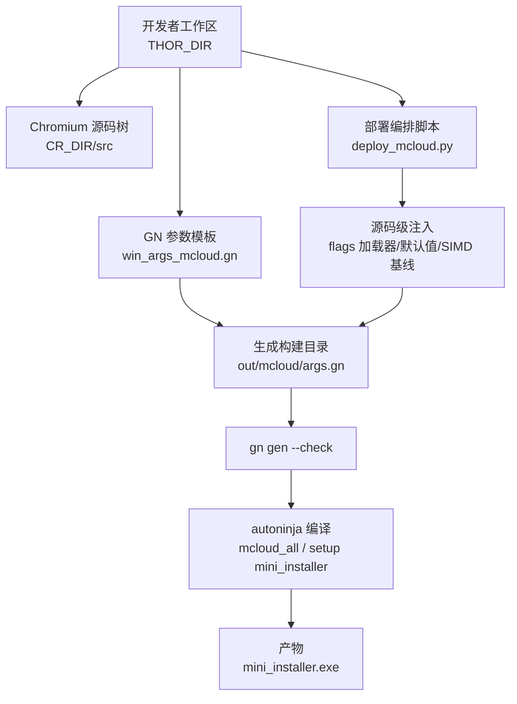
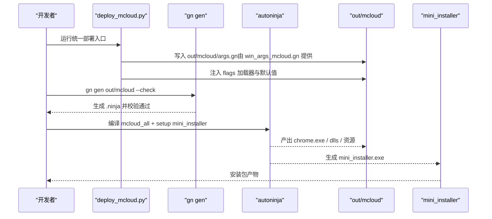
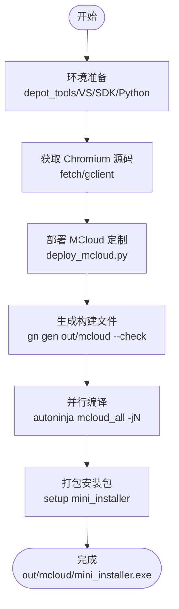
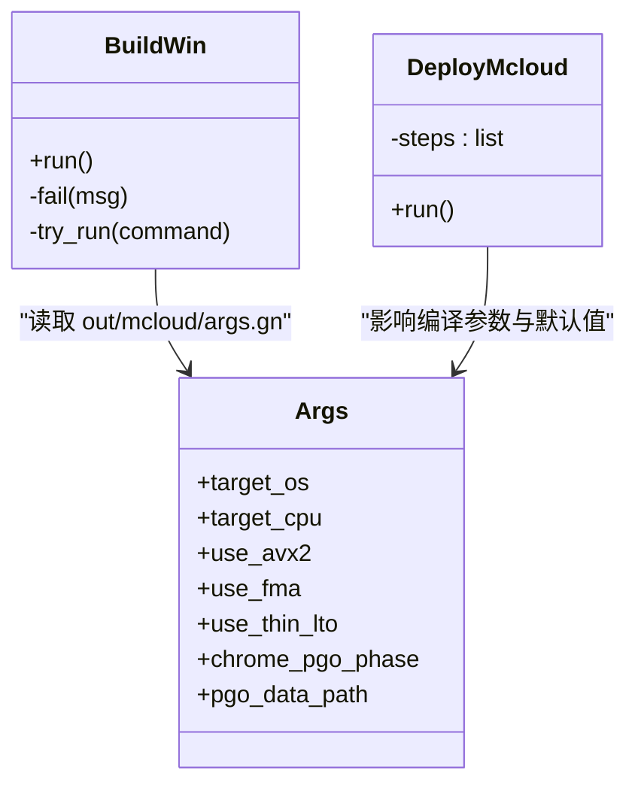
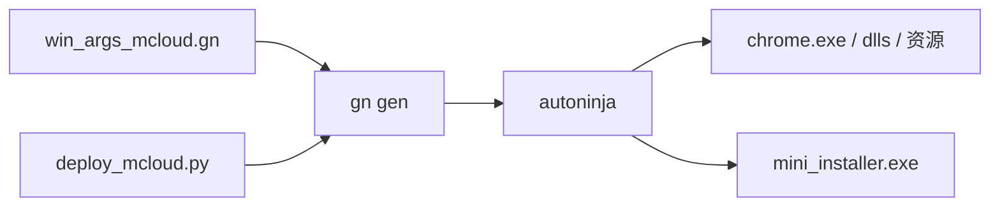

# 构建系统

本文引用的文件

- [README.md](https://github.com/Mcloud136/Mcloud-Browser/blob/main/README.md)
- [docs/BUILDING_WIN.md](https://github.com/Mcloud136/Mcloud-Browser/blob/main/docs/BUILDING_WIN.md)
- [docs/ABOUT_GN_ARGS.md](https://github.com/Mcloud136/Mcloud-Browser/blob/main/docs/ABOUT_GN_ARGS.md)
- [args.gn](https://github.com/Mcloud136/Mcloud-Browser/blob/main/args.gn)
- [win_args.gn](https://github.com/Mcloud136/Mcloud-Browser/blob/main/win_args.gn)
- [win_args_mcloud.gn](https://github.com/Mcloud136/Mcloud-Browser/blob/main/win_args_mcloud.gn)
- [other/AVX2/AVX2_args.gn](https://github.com/Mcloud136/Mcloud-Browser/blob/main/other/AVX2/AVX2_args.gn)
- [infra/DEBUG/win_debug_args.gn](https://github.com/Mcloud136/Mcloud-Browser/blob/main/infra/DEBUG/win_debug_args.gn)
- [win_scripts/build_win.py](https://github.com/Mcloud136/Mcloud-Browser/blob/main/win_scripts/build_win.py)
- [win_scripts/deploy_mcloud.py](https://github.com/Mcloud136/Mcloud-Browser/blob/main/win_scripts/deploy_mcloud.py)
- [build.sh](https://github.com/Mcloud136/Mcloud-Browser/blob/main/build.sh)
- [autobuild.sh](https://github.com/Mcloud136/Mcloud-Browser/blob/main/autobuild.sh)
- [docs/architecture/build-pipeline-flow.dot](https://github.com/Mcloud136/Mcloud-Browser/blob/main/docs/architecture/build-pipeline-flow.dot)
- [docs/architecture/build-pipeline-flow.evidence.md](https://github.com/Mcloud136/Mcloud-Browser/blob/main/docs/architecture/build-pipeline-flow.evidence.md)

## 目录
1. [简介](#简介)
2. [项目结构](#项目结构)
3. [核心组件](#核心组件)
4. [架构总览](#架构总览)
5. [详细组件分析](#详细组件分析)
6. [依赖关系分析](#依赖关系分析)
7. [性能考量](#性能考量)
8. [故障排查指南](#故障排查指南)
9. [结论](#结论)
10. [附录](#附录)

## 简介
本文件系统性梳理 MCloud Browser 的 GN/Ninja 构建体系与 Windows 平台完整构建流水线，覆盖参数定义、依赖管理、条件编译、编译器优化标志、链接器参数、资源打包、自动化脚本（批量构建、并行编译、增量构建）以及常见问题定位。文档以仓库现有配置与脚本为依据，提供可追溯的“章节来源”和“图示来源”，便于读者对照源码理解。

## 项目结构
MCloud Browser 在 Chromium 源码树之上叠加了 MCloud 定制层：GN 参数集、Windows 部署编排脚本、运行时 flags 注入、以及发布产物组装。关键目录与职责如下：
- 根级 GN 参数模板：args.gn、win_args.gn、win_args_mcloud.gn、other/AVX2/AVX2_args.gn、infra/DEBUG/win_debug_args.gn
- Windows 构建脚本：win_scripts/build_win.py、win_scripts/deploy_mcloud.py
- Linux 构建脚本：build.sh、autobuild.sh
- 文档与证据：docs/BUILDING_WIN.md、docs/ABOUT_GN_ARGS.md、docs/architecture/build-pipeline-flow.*

**图示来源**
- [win_scripts/deploy_mcloud.py:1-51](https://github.com/Mcloud136/Mcloud-Browser/blob/main/win_scripts/deploy_mcloud.py#L1-L51)
- [win_scripts/build_win.py:1-51](https://github.com/Mcloud136/Mcloud-Browser/blob/main/win_scripts/build_win.py#L1-L51)
- [win_args_mcloud.gn:1-126](https://github.com/Mcloud136/Mcloud-Browser/blob/main/win_args_mcloud.gn#L1-L126)
- [docs/architecture/build-pipeline-flow.dot:1-24](https://github.com/Mcloud136/Mcloud-Browser/blob/main/docs/architecture/build-pipeline-flow.dot#L1-L24)

**章节来源**
- [docs/BUILDING_WIN.md:1-288](https://github.com/Mcloud136/Mcloud-Browser/blob/main/docs/BUILDING_WIN.md#L1-L288)
- [docs/ABOUT_GN_ARGS.md:1-174](https://github.com/Mcloud136/Mcloud-Browser/blob/main/docs/ABOUT_GN_ARGS.md#L1-L174)
- [win_args_mcloud.gn:1-126](https://github.com/Mcloud136/Mcloud-Browser/blob/main/win_args_mcloud.gn#L1-L126)
- [win_scripts/deploy_mcloud.py:1-51](https://github.com/Mcloud136/Mcloud-Browser/blob/main/win_scripts/deploy_mcloud.py#L1-L51)
- [win_scripts/build_win.py:1-51](https://github.com/Mcloud136/Mcloud-Browser/blob/main/win_scripts/build_win.py#L1-L51)

## 核心组件
- GN 参数体系
  - 通用模板：args.gn（Linux 示例）、win_args.gn（Windows 基础）、win_args_mcloud.gn（MCloud 专用优化与目标）
  - 特性开关：SIMD（SSE/AVX/FMA）、ThinLTO、PGO、V8/JIT、媒体解码、Widevine、WebRTC、GPU/Vulkan/D3D12 等
- 部署编排与源码注入
  - deploy_mcloud.py 统一编排：复制 compiler_opt.gni、Polly/BOLT 接线、AVX2 基线、默认行为修改、注入 flags 加载器、拷贝 mcloud_flags.txt 到 out/mcloud
- 构建执行
  - build_win.py：调用 autoninja 编译 mcloud_all 并打包 mini_installer
  - build.sh/autobuild.sh：Linux 侧构建与打包（deb/rpm），用于参考与对比
- 文档与校验
  - docs/ABOUT_GN_ARGS.md：参数说明与取舍理由
  - docs/architecture/build-pipeline-flow.*：流水线证据与可视化

**章节来源**
- [win_args_mcloud.gn:1-126](https://github.com/Mcloud136/Mcloud-Browser/blob/main/win_args_mcloud.gn#L1-L126)
- [win_args.gn:1-87](https://github.com/Mcloud136/Mcloud-Browser/blob/main/win_args.gn#L1-L87)
- [args.gn:1-87](https://github.com/Mcloud136/Mcloud-Browser/blob/main/args.gn#L1-L87)
- [other/AVX2/AVX2_args.gn:1-87](https://github.com/Mcloud136/Mcloud-Browser/blob/main/other/AVX2/AVX2_args.gn#L1-L87)
- [infra/DEBUG/win_debug_args.gn:1-87](https://github.com/Mcloud136/Mcloud-Browser/blob/main/infra/DEBUG/win_debug_args.gn#L1-L87)
- [win_scripts/deploy_mcloud.py:1-51](https://github.com/Mcloud136/Mcloud-Browser/blob/main/win_scripts/deploy_mcloud.py#L1-L51)
- [win_scripts/build_win.py:1-51](https://github.com/Mcloud136/Mcloud-Browser/blob/main/win_scripts/build_win.py#L1-L51)
- [docs/ABOUT_GN_ARGS.md:1-174](https://github.com/Mcloud136/Mcloud-Browser/blob/main/docs/ABOUT_GN_ARGS.md#L1-L174)

## 架构总览
下图展示 Windows 平台从源码部署到安装包生成的端到端流程，包括 GN 参数选择、源码注入、构建与打包环节。

**图示来源**
- [win_scripts/deploy_mcloud.py:1-51](https://github.com/Mcloud136/Mcloud-Browser/blob/main/win_scripts/deploy_mcloud.py#L1-L51)
- [win_scripts/build_win.py:1-51](https://github.com/Mcloud136/Mcloud-Browser/blob/main/win_scripts/build_win.py#L1-L51)
- [docs/architecture/build-pipeline-flow.evidence.md:28-55](https://github.com/Mcloud136/Mcloud-Browser/blob/main/docs/architecture/build-pipeline-flow.evidence.md#L28-L55)

## 详细组件分析

### GN 参数与条件编译
- 目标与平台
  - target_os/target_cpu：win/x64；is_official_build/is_debug/symbol_level 控制发行版与符号级别
- SIMD 指令集
  - use_sse3/use_sse41/use_sse42/use_avx/use_avx2/use_fma/use_avx512：MCloud 使用 AVX2+FMA 作为硬件基线
- 编译器与链接器
  - is_clang/use_lld/use_icf/use_thin_lto/thin_lto_enable_optimizations：启用 ThinLTO 与优化
  - init_stack_vars_zero：栈变量零初始化（安全）
- V8 与渲染
  - v8_* 系列：Maglev/TurboFan/WASM SIMD 等；optimize_webui
- 媒体与 DRM
  - media_use_ffmpeg/libvpx、proprietary_codecs、enable_platform_hevc/AC3/Dolby Vision/MPEG-H/DTS、widevine 相关开关
- PGO
  - chrome_pgo_phase=2，pgo_data_path 指向对应内核版本的 profdata

注意：不同场景的参数差异
- 调试：infra/DEBUG/win_debug_args.gn 关闭 LTO/PGO，开启 dcheck、symbol_level=2
- 通用 Linux：args.gn 为 Linux 示例，便于跨平台理解参数族
- AVX2 专用：other/AVX2/AVX2_args.gn 显式启用 AVX2+FMA

**章节来源**
- [win_args_mcloud.gn:1-126](https://github.com/Mcloud136/Mcloud-Browser/blob/main/win_args_mcloud.gn#L1-L126)
- [win_args.gn:1-87](https://github.com/Mcloud136/Mcloud-Browser/blob/main/win_args.gn#L1-L87)
- [args.gn:1-87](https://github.com/Mcloud136/Mcloud-Browser/blob/main/args.gn#L1-L87)
- [other/AVX2/AVX2_args.gn:1-87](https://github.com/Mcloud136/Mcloud-Browser/blob/main/other/AVX2/AVX2_args.gn#L1-L87)
- [infra/DEBUG/win_debug_args.gn:1-87](https://github.com/Mcloud136/Mcloud-Browser/blob/main/infra/DEBUG/win_debug_args.gn#L1-L87)
- [docs/ABOUT_GN_ARGS.md:1-174](https://github.com/Mcloud136/Mcloud-Browser/blob/main/docs/ABOUT_GN_ARGS.md#L1-L174)

### Windows 构建流水线（源码部署 → 安装包）
- 前置准备
  - 安装 depot_tools、Visual Studio 2022（含 ATLMFC）、Windows SDK、Python
  - 设置 DEPOT_TOOLS_WIN_TOOLCHAIN=0 与 vs2022_install
- 拉取源码与同步
  - fetch chromium 或浅克隆指定 tag，gclient sync/runhooks
- 部署 MCloud 定制
  - 运行 win_scripts/deploy_mcloud.py：按序执行多项定点注入（compiler_opt.gni、Polly/BOLT 接线、AVX2 基线、默认值修改、flags 加载器注入），并将 mcloud_flags.txt 复制到 out/mcloud
- 生成构建文件
  - 将 win_args_mcloud.gn 复制到 out/mcloud/args.gn，必要时调整 pgo_data_path
  - gn gen out/mcloud --check
- 编译与打包
  - 使用 win_scripts/build_win.py 或直接调用：
    - autoninja -C out/mcloud mcloud_all -jN
    - autoninja -C out/mcloud setup mini_installer -jN
  - 产物位于 out/mcloud，包含 mini_installer.exe

**图示来源**
- [docs/BUILDING_WIN.md:1-288](https://github.com/Mcloud136/Mcloud-Browser/blob/main/docs/BUILDING_WIN.md#L1-L288)
- [win_scripts/deploy_mcloud.py:1-51](https://github.com/Mcloud136/Mcloud-Browser/blob/main/win_scripts/deploy_mcloud.py#L1-L51)
- [win_scripts/build_win.py:1-51](https://github.com/Mcloud136/Mcloud-Browser/blob/main/win_scripts/build_win.py#L1-L51)

**章节来源**
- [docs/BUILDING_WIN.md:1-288](https://github.com/Mcloud136/Mcloud-Browser/blob/main/docs/BUILDING_WIN.md#L1-L288)
- [win_scripts/deploy_mcloud.py:1-51](https://github.com/Mcloud136/Mcloud-Browser/blob/main/win_scripts/deploy_mcloud.py#L1-L51)
- [win_scripts/build_win.py:1-51](https://github.com/Mcloud136/Mcloud-Browser/blob/main/win_scripts/build_win.py#L1-L51)

### MCloud 特定构建配置与定制选项
- 编译器优化标志
  - is_full_optimization_build=true（-O3 激进优化）
  - use_thin_lto=true、thin_lto_enable_optimizations=true
  - init_stack_vars_zero=true（安全）
  - use_polly=false、use_bolt=false（待前置工具链就绪后启用）
- 链接器与安全
  - use_lld=true、win_enable_cfg_guards=true（CFG）
  - exclude_unwind_tables=true（体积/性能）
- 媒体与 DRM
  - 启用 HEVC/AC3/Dolby Vision/MPEG-H/DTS 等平台解码能力
  - Widevine 相关开关按需启用/禁用（当前构建未下载 CDM，已禁用）
- GPU/渲染
  - enable_vulkan=false（Windows 走 D3D12）
- PGO
  - chrome_pgo_phase=2，pgo_data_path 指向与内核版本匹配的 profdata

**章节来源**
- [win_args_mcloud.gn:1-126](https://github.com/Mcloud136/Mcloud-Browser/blob/main/win_args_mcloud.gn#L1-L126)
- [docs/ABOUT_GN_ARGS.md:1-174](https://github.com/Mcloud136/Mcloud-Browser/blob/main/docs/ABOUT_GN_ARGS.md#L1-L174)

### 自动化构建脚本功能与用法
- Windows 构建脚本
  - win_scripts/build_win.py：自动确定并行度，依次执行 mcloud_all 与 mini_installer 打包
- Linux 构建脚本
  - build.sh：构建 mcloud_all 并打包 deb/rpm
  - autobuild.sh：仅用于测试/自动化，输出 debug/non-debug 产物
- 部署编排
  - win_scripts/deploy_mcloud.py：统一编排源码注入步骤，确保幂等与可重复

**图示来源**
- [win_scripts/build_win.py:1-51](https://github.com/Mcloud136/Mcloud-Browser/blob/main/win_scripts/build_win.py#L1-L51)
- [win_scripts/deploy_mcloud.py:1-51](https://github.com/Mcloud136/Mcloud-Browser/blob/main/win_scripts/deploy_mcloud.py#L1-L51)
- [win_args_mcloud.gn:1-126](https://github.com/Mcloud136/Mcloud-Browser/blob/main/win_args_mcloud.gn#L1-L126)

**章节来源**
- [win_scripts/build_win.py:1-51](https://github.com/Mcloud136/Mcloud-Browser/blob/main/win_scripts/build_win.py#L1-L51)
- [build.sh:1-59](https://github.com/Mcloud136/Mcloud-Browser/blob/main/build.sh#L1-L59)
- [autobuild.sh:1-59](https://github.com/Mcloud136/Mcloud-Browser/blob/main/autobuild.sh#L1-L59)
- [win_scripts/deploy_mcloud.py:1-51](https://github.com/Mcloud136/Mcloud-Browser/blob/main/win_scripts/deploy_mcloud.py#L1-L51)

## 依赖关系分析
- 构建阶段依赖
  - GN 参数决定编译/链接/资源处理策略
  - 部署脚本对源码进行最小化、定点注入，避免污染上游树
  - autoninja 基于 .ninja 文件并行构建，支持增量
- 外部依赖
  - Visual Studio、Windows SDK、depot_tools、Python
  - PGO 数据文件需与内核大版本严格匹配（如 M151=7922 系列）

**图示来源**
- [win_args_mcloud.gn:1-126](https://github.com/Mcloud136/Mcloud-Browser/blob/main/win_args_mcloud.gn#L1-L126)
- [win_scripts/deploy_mcloud.py:1-51](https://github.com/Mcloud136/Mcloud-Browser/blob/main/win_scripts/deploy_mcloud.py#L1-L51)
- [win_scripts/build_win.py:1-51](https://github.com/Mcloud136/Mcloud-Browser/blob/main/win_scripts/build_win.py#L1-L51)

**章节来源**
- [docs/architecture/build-pipeline-flow.evidence.md:28-55](https://github.com/Mcloud136/Mcloud-Browser/blob/main/docs/architecture/build-pipeline-flow.evidence.md#L28-L55)

## 性能考量
- 编译器与链接器
  - 启用 ThinLTO 与优化；谨慎使用 ICF（Windows 由 /OPT:ICF 保障）
  - 关闭不必要的调试信息（symbol_level=0、exclude_unwind_tables=true）
- PGO
  - 使用与内核版本匹配的 profdata；确保路径正确
- 并行与增量
  - 使用 -jN 充分利用多核；保持 out/mcloud 独立以避免缓存污染
- 媒体与 GPU
  - 启用平台解码与必要的 WebRTC SIMD；根据目标平台关闭 Vulkan（Windows 走 D3D12）

[本节为通用指导，不直接分析具体文件]

## 故障排查指南
- 构建失败快速定位
  - 检查环境变量 CR_DIR、DEPOT_TOOLS_WIN_TOOLCHAIN、vs2022_install
  - 确认 out/mcloud/args.gn 来自 win_args_mcloud.gn 且 pgo_data_path 正确
  - 运行 gn gen out/mcloud --check 验证配置
- 脚本错误
  - build_win.py 失败会返回非零退出码（fail 函数 exit 111）
  - deploy_mcloud.py 任一子步骤失败即中止，便于快速定位
- 常见现象
  - PGO 版本不匹配导致拒绝；需更新到与内核一致（如 7922 系列）
  - Widevine CDM 未下载时相关功能不可用（当前构建已禁用）

**章节来源**
- [win_scripts/build_win.py:1-51](https://github.com/Mcloud136/Mcloud-Browser/blob/main/win_scripts/build_win.py#L1-L51)
- [win_scripts/deploy_mcloud.py:1-51](https://github.com/Mcloud136/Mcloud-Browser/blob/main/win_scripts/deploy_mcloud.py#L1-L51)
- [docs/BUILDING_WIN.md:1-288](https://github.com/Mcloud136/Mcloud-Browser/blob/main/docs/BUILDING_WIN.md#L1-L288)

## 结论
MCloud Browser 的构建系统围绕 GN/Ninja 展开，通过 win_args_mcloud.gn 集中表达 MCloud 的优化目标与平台特性；deploy_mcloud.py 以幂等方式完成源码级定制；build_win.py 驱动并行编译与安装包生成。配合 PGO、ThinLTO、AVX2+FMA 等优化，形成高性能、可复现的 Windows 构建流水线。建议在升级内核版本时同步更新 PGO 数据与 GN 参数，并保持部署脚本与源码树的兼容性。

[本节为总结性内容，不直接分析具体文件]

## 附录
- 快速命令参考（Windows）
  - 部署：python win_scripts/deploy_mcloud.py
  - 生成：gn gen out/mcloud --check
  - 构建：python win_scripts/build_win.py N（或手动调用 autoninja）
- 参考文档
  - docs/BUILDING_WIN.md：Windows 构建指南
  - docs/ABOUT_GN_ARGS.md：GN 参数详解
  - docs/architecture/build-pipeline-flow.*：流水线可视化与证据

**章节来源**
- [docs/BUILDING_WIN.md:1-288](https://github.com/Mcloud136/Mcloud-Browser/blob/main/docs/BUILDING_WIN.md#L1-L288)
- [docs/ABOUT_GN_ARGS.md:1-174](https://github.com/Mcloud136/Mcloud-Browser/blob/main/docs/ABOUT_GN_ARGS.md#L1-L174)
- [docs/architecture/build-pipeline-flow.dot:1-24](https://github.com/Mcloud136/Mcloud-Browser/blob/main/docs/architecture/build-pipeline-flow.dot#L1-L24)
- [docs/architecture/build-pipeline-flow.evidence.md:28-55](https://github.com/Mcloud136/Mcloud-Browser/blob/main/docs/architecture/build-pipeline-flow.evidence.md#L28-L55)