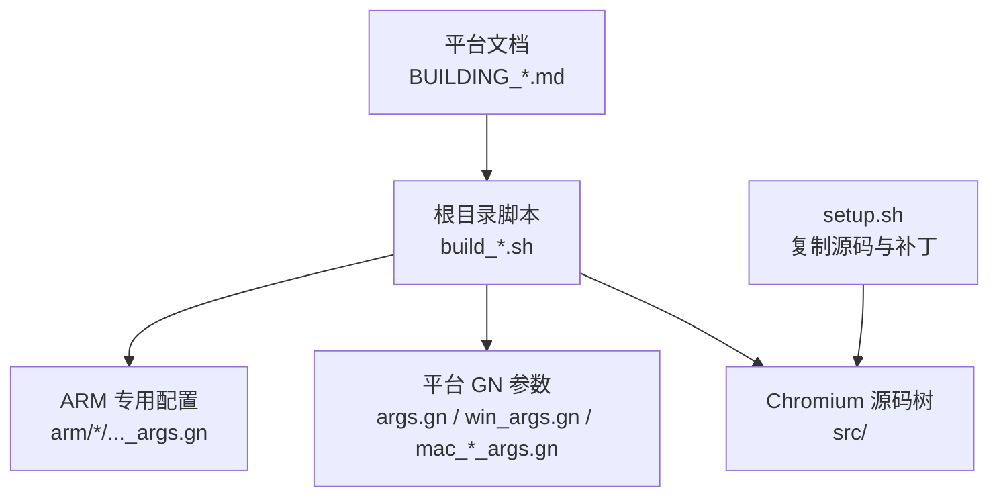
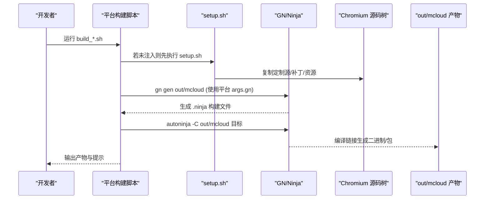
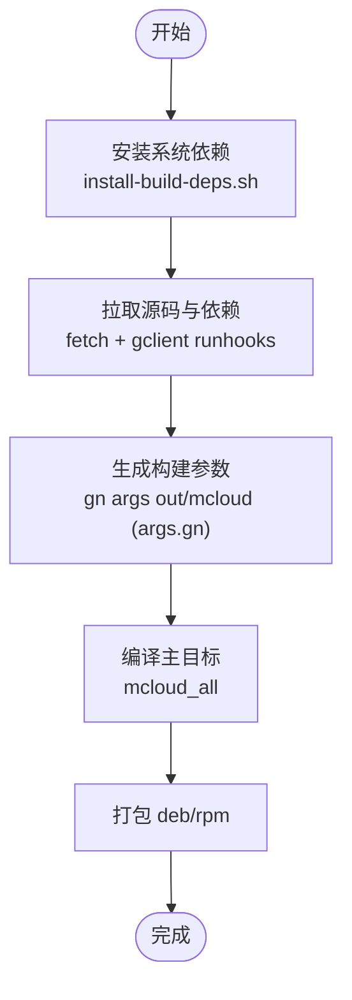
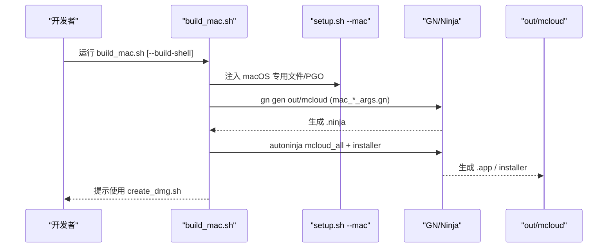
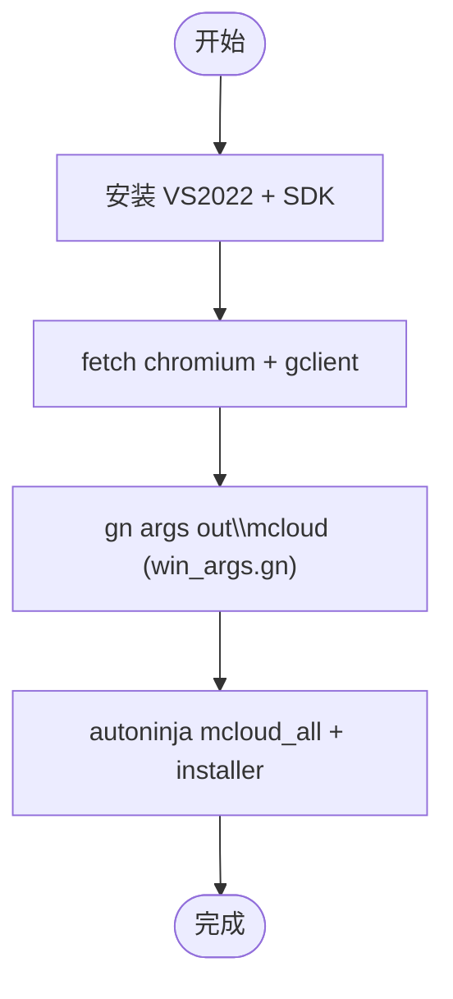
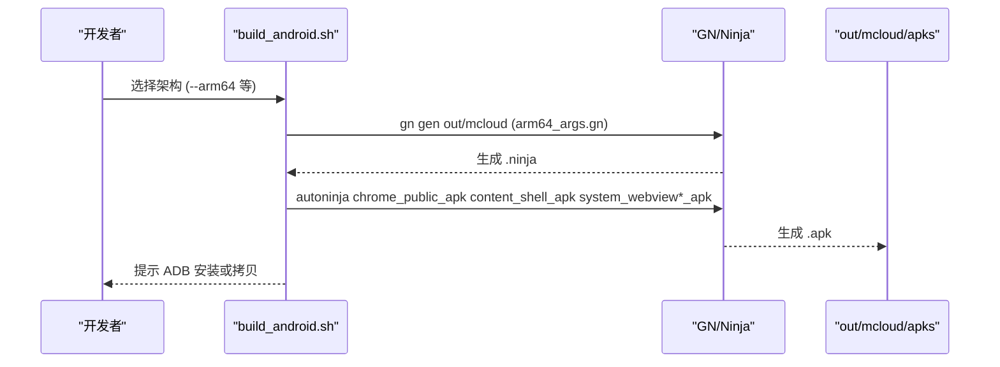
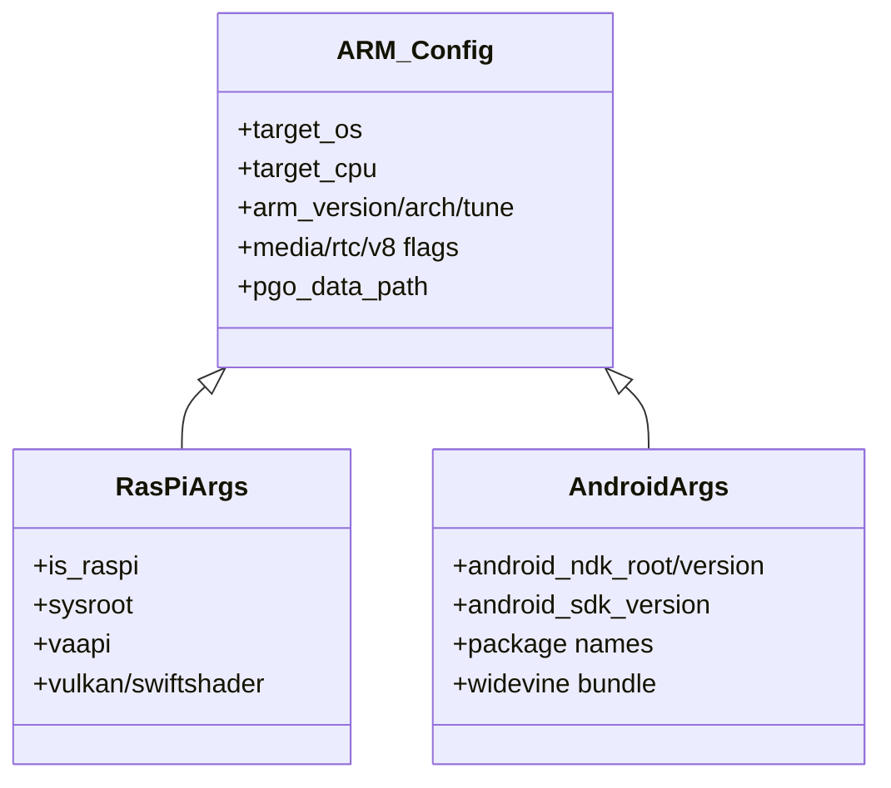
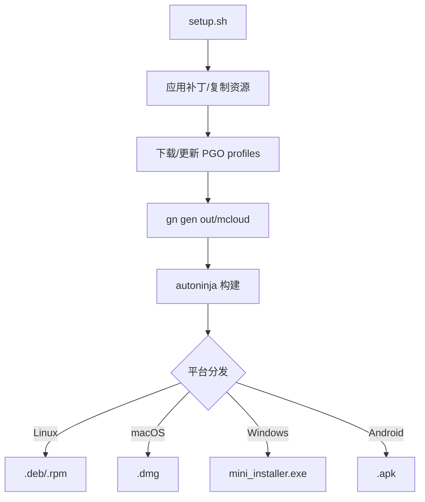
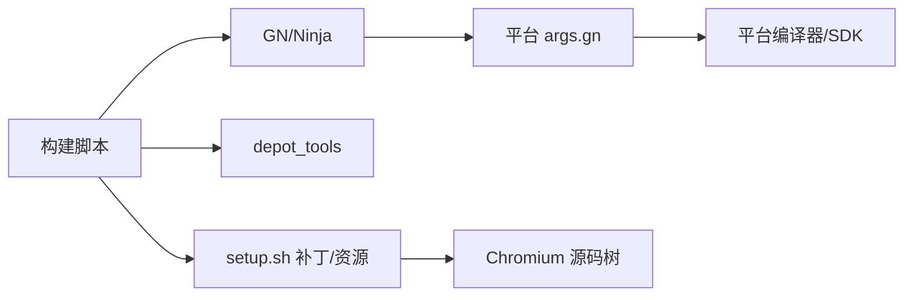

# 跨平台构建

本文引用的文件

- [README.md](https://github.com/Mcloud136/Mcloud-Browser/blob/main/README.md)
- [docs/BUILDING.md](https://github.com/Mcloud136/Mcloud-Browser/blob/main/docs/BUILDING.md)
- [docs/BUILDING_MAC.md](https://github.com/Mcloud136/Mcloud-Browser/blob/main/docs/BUILDING_MAC.md)
- [docs/BUILDING_WIN.md](https://github.com/Mcloud136/Mcloud-Browser/blob/main/docs/BUILDING_WIN.md)
- [arm/README.md](https://github.com/Mcloud136/Mcloud-Browser/blob/main/arm/README.md)
- [build.sh](https://github.com/Mcloud136/Mcloud-Browser/blob/main/build.sh)
- [build_mac.sh](https://github.com/Mcloud136/Mcloud-Browser/blob/main/build_mac.sh)
- [build_win.sh](https://github.com/Mcloud136/Mcloud-Browser/blob/main/build_win.sh)
- [build_android.sh](https://github.com/Mcloud136/Mcloud-Browser/blob/main/build_android.sh)
- [setup.sh](https://github.com/Mcloud136/Mcloud-Browser/blob/main/setup.sh)
- [args.gn](https://github.com/Mcloud136/Mcloud-Browser/blob/main/args.gn)
- [win_args.gn](https://github.com/Mcloud136/Mcloud-Browser/blob/main/win_args.gn)
- [other/Mac/mac_args.gn](https://github.com/Mcloud136/Mcloud-Browser/blob/main/other/Mac/mac_args.gn)
- [other/Mac/mac_ARM_args.gn](https://github.com/Mcloud136/Mcloud-Browser/blob/main/other/Mac/mac_ARM_args.gn)
- [arm/android/arm64_args.gn](https://github.com/Mcloud136/Mcloud-Browser/blob/main/arm/android/arm64_args.gn)
- [arm/raspi/raspi_args.gn](https://github.com/Mcloud136/Mcloud-Browser/blob/main/arm/raspi/raspi_args.gn)

## 目录
1. [简介](#简介)
2. [项目结构](#项目结构)
3. [核心组件](#核心组件)
4. [架构总览](#架构总览)
5. [详细组件分析](#详细组件分析)
6. [依赖关系分析](#依赖关系分析)
7. [性能考量](#性能考量)
8. [故障排查指南](#故障排查指南)
9. [结论](#结论)
10. [附录](#附录)

## 简介
本文件面向需要在 Linux、macOS、Android（以及 ARM 交叉）平台上构建 MCloud Browser 的工程师与发布流程维护者，系统化说明各平台的构建流程、工具链配置、GN 参数差异、ARM 交叉编译支持与移植注意事项，并给出多平台构建最佳实践、常见问题定位与性能优化建议。

## 项目结构
仓库围绕 Chromium 源码树组织，顶层提供跨平台构建脚本与平台特定 GN 参数：
- 顶层脚本：Linux/macOS/Windows/Android 一键构建入口
- 平台文档：各平台前置条件、依赖安装、构建步骤
- 平台 GN 参数：按目标 OS/CPU 区分，包含 SIMD、媒体、V8、PGO 等关键开关
- ARM 子目录：Android、Raspberry Pi、Windows on ARM 的专用配置与补丁
- 通用设置：setup.sh 负责将定制源与补丁注入到 Chromium 源码树

图表来源
- [build.sh:1-59](https://github.com/Mcloud136/Mcloud-Browser/blob/main/build.sh#L1-L59)
- [build_mac.sh:1-84](https://github.com/Mcloud136/Mcloud-Browser/blob/main/build_mac.sh#L1-L84)
- [build_win.sh:1-59](https://github.com/Mcloud136/Mcloud-Browser/blob/main/build_win.sh#L1-L59)
- [build_android.sh:1-140](https://github.com/Mcloud136/Mcloud-Browser/blob/main/build_android.sh#L1-L140)
- [setup.sh:1-408](https://github.com/Mcloud136/Mcloud-Browser/blob/main/setup.sh#L1-L408)
- [docs/BUILDING.md:1-352](https://github.com/Mcloud136/Mcloud-Browser/blob/main/docs/BUILDING.md#L1-L352)
- [docs/BUILDING_MAC.md:1-339](https://github.com/Mcloud136/Mcloud-Browser/blob/main/docs/BUILDING_MAC.md#L1-L339)
- [docs/BUILDING_WIN.md:1-288](https://github.com/Mcloud136/Mcloud-Browser/blob/main/docs/BUILDING_WIN.md#L1-L288)

章节来源
- [docs/BUILDING.md:1-352](https://github.com/Mcloud136/Mcloud-Browser/blob/main/docs/BUILDING.md#L1-L352)
- [docs/BUILDING_MAC.md:1-339](https://github.com/Mcloud136/Mcloud-Browser/blob/main/docs/BUILDING_MAC.md#L1-L339)
- [docs/BUILDING_WIN.md:1-288](https://github.com/Mcloud136/Mcloud-Browser/blob/main/docs/BUILDING_WIN.md#L1-L288)

## 核心组件
- 构建脚本
  - Linux: build.sh 调用 autoninja 构建 mcloud_all，并打包 .deb/.rpm
  - macOS: build_mac.sh 构建 mcloud_all 及 installer，支持 --build-shell
  - Windows: build_win.sh 构建 mcloud_all 与 mini_installer
  - Android: build_android.sh 按 --arm32/--arm64/--x86/--x64 构建 APK 与 System WebView
- 平台参数
  - args.gn: Linux x64 默认发行版参数（SIMD、媒体、V8、PGO 等）
  - win_args.gn: Windows x64 发行版参数（含 Widevine、RLZ、CFGuard 等）
  - other/Mac/mac_args.gn: macOS x64 参数（启用 AVX2/FMA）
  - other/Mac/mac_ARM_args.gn: macOS arm64 参数（NEON、RTC NEON 等）
  - arm/android/arm64_args.gn: Android arm64 参数（NDK/API、包名、Widevine 等）
  - arm/raspi/raspi_args.gn: Raspberry Pi arm64 参数（sysroot、tune、VA-API 等）
- 统一注入
  - setup.sh 将 MCloud 定制源、补丁、版本信息、PGO 下载等注入到 Chromium 源码树，并按 --mac/--raspi/--woa/--android 等分支准备平台特定内容

章节来源
- [build.sh:1-59](https://github.com/Mcloud136/Mcloud-Browser/blob/main/build.sh#L1-L59)
- [build_mac.sh:1-84](https://github.com/Mcloud136/Mcloud-Browser/blob/main/build_mac.sh#L1-L84)
- [build_win.sh:1-59](https://github.com/Mcloud136/Mcloud-Browser/blob/main/build_win.sh#L1-L59)
- [build_android.sh:1-140](https://github.com/Mcloud136/Mcloud-Browser/blob/main/build_android.sh#L1-L140)
- [setup.sh:1-408](https://github.com/Mcloud136/Mcloud-Browser/blob/main/setup.sh#L1-L408)
- [args.gn:1-87](https://github.com/Mcloud136/Mcloud-Browser/blob/main/args.gn#L1-L87)
- [win_args.gn:1-87](https://github.com/Mcloud136/Mcloud-Browser/blob/main/win_args.gn#L1-L87)
- [other/Mac/mac_args.gn:1-90](https://github.com/Mcloud136/Mcloud-Browser/blob/main/other/Mac/mac_args.gn#L1-L90)
- [other/Mac/mac_ARM_args.gn:1-83](https://github.com/Mcloud136/Mcloud-Browser/blob/main/other/Mac/mac_ARM_args.gn#L1-L83)
- [arm/android/arm64_args.gn:1-96](https://github.com/Mcloud136/Mcloud-Browser/blob/main/arm/android/arm64_args.gn#L1-L96)
- [arm/raspi/raspi_args.gn:1-91](https://github.com/Mcloud136/Mcloud-Browser/blob/main/arm/raspi/raspi_args.gn#L1-L91)

## 架构总览
下图展示从开发者触发构建到产出可执行/安装包的关键路径，包括脚本、GN 参数与 Chromium 源码树的交互。

图表来源
- [build.sh:1-59](https://github.com/Mcloud136/Mcloud-Browser/blob/main/build.sh#L1-L59)
- [build_mac.sh:1-84](https://github.com/Mcloud136/Mcloud-Browser/blob/main/build_mac.sh#L1-L84)
- [build_win.sh:1-59](https://github.com/Mcloud136/Mcloud-Browser/blob/main/build_win.sh#L1-L59)
- [build_android.sh:1-140](https://github.com/Mcloud136/Mcloud-Browser/blob/main/build_android.sh#L1-L140)
- [setup.sh:1-408](https://github.com/Mcloud136/Mcloud-Browser/blob/main/setup.sh#L1-L408)

## 详细组件分析

### Linux 构建流程与配置
- 前置条件与依赖
  - 推荐 Ubuntu 22.04；需 Git、Python 3.8+、depot_tools
  - 通过 install-build-deps.sh 安装系统依赖（可按需添加 --lib32/--arm 等）
- 获取源码与钩子
  - fetch chromium；gclient runhooks 拉取 LLVM、Debian sysroot 等
- 构建参数
  - 使用 args.gn 作为基础发行版参数（target_os=linux, target_cpu=x64, ThinLTO, V8 优化, PGO phase 2）
- 构建与打包
  - build.sh 调用 mcloud_all，随后构建 stable_deb/stable_rpm
- 调试与缓存
  - 可使用 ccache 提升增量构建速度；autoninja 自动选择最优并行度

图表来源
- [docs/BUILDING.md:1-352](https://github.com/Mcloud136/Mcloud-Browser/blob/main/docs/BUILDING.md#L1-L352)
- [build.sh:1-59](https://github.com/Mcloud136/Mcloud-Browser/blob/main/build.sh#L1-L59)
- [args.gn:1-87](https://github.com/Mcloud136/Mcloud-Browser/blob/main/args.gn#L1-L87)

章节来源
- [docs/BUILDING.md:1-352](https://github.com/Mcloud136/Mcloud-Browser/blob/main/docs/BUILDING.md#L1-L352)
- [build.sh:1-59](https://github.com/Mcloud136/Mcloud-Browser/blob/main/build.sh#L1-L59)
- [args.gn:1-87](https://github.com/Mcloud136/Mcloud-Browser/blob/main/args.gn#L1-L87)

### macOS 构建流程与配置
- 前置条件
  - macOS 10.15+，Xcode 与对应 SDK；APFS 卷
- 获取源码与钩子
  - fetch chromium；可选 caffeinate 防止休眠
- 构建参数
  - macOS x64: other/Mac/mac_args.gn（启用 AVX2/FMA）
  - macOS arm64: other/Mac/mac_ARM_args.gn（NEON、RTC_NEON）
- 构建与产物
  - build_mac.sh 构建 mcloud_all 与 installer；可用 create_dmg.sh 生成 DMG
- 权限与体验优化
  - 可通过命令行标志避免重复钥匙串/网络弹窗；调整 git fsmonitor/untracked cache 提升大仓库性能

图表来源
- [docs/BUILDING_MAC.md:1-339](https://github.com/Mcloud136/Mcloud-Browser/blob/main/docs/BUILDING_MAC.md#L1-L339)
- [build_mac.sh:1-84](https://github.com/Mcloud136/Mcloud-Browser/blob/main/build_mac.sh#L1-L84)
- [other/Mac/mac_args.gn:1-90](https://github.com/Mcloud136/Mcloud-Browser/blob/main/other/Mac/mac_args.gn#L1-L90)
- [other/Mac/mac_ARM_args.gn:1-83](https://github.com/Mcloud136/Mcloud-Browser/blob/main/other/Mac/mac_ARM_args.gn#L1-L83)
- [setup.sh:230-248](https://github.com/Mcloud136/Mcloud-Browser/blob/main/setup.sh#L230-L248)

章节来源
- [docs/BUILDING_MAC.md:1-339](https://github.com/Mcloud136/Mcloud-Browser/blob/main/docs/BUILDING_MAC.md#L1-L339)
- [build_mac.sh:1-84](https://github.com/Mcloud136/Mcloud-Browser/blob/main/build_mac.sh#L1-L84)
- [other/Mac/mac_args.gn:1-90](https://github.com/Mcloud136/Mcloud-Browser/blob/main/other/Mac/mac_args.gn#L1-L90)
- [other/Mac/mac_ARM_args.gn:1-83](https://github.com/Mcloud136/Mcloud-Browser/blob/main/other/Mac/mac_ARM_args.gn#L1-L83)

### Windows 构建流程与配置
- 前置条件
  - Visual Studio 2022（含 C++ 桌面开发与 ATLMFC），Windows 11 SDK 指定版本；Git Bash
- 获取源码与钩子
  - fetch chromium；首次 gclient 会安装必要工具
- 构建参数
  - win_args.gn（target_os=win, target_cpu=x64，启用 Widevine、RLZ、CFGuard、ThinLTO、PGO phase 2）
- 构建与产物
  - build_win.sh 构建 mcloud_all 与 mini_installer；产物位于 out/mcloud
- 环境注意
  - PATH 中 depot_tools 优先于系统 Python；禁用 App Execution Aliases 冲突

图表来源
- [docs/BUILDING_WIN.md:1-288](https://github.com/Mcloud136/Mcloud-Browser/blob/main/docs/BUILDING_WIN.md#L1-L288)
- [build_win.sh:1-59](https://github.com/Mcloud136/Mcloud-Browser/blob/main/build_win.sh#L1-L59)
- [win_args.gn:1-87](https://github.com/Mcloud136/Mcloud-Browser/blob/main/win_args.gn#L1-L87)

章节来源
- [docs/BUILDING_WIN.md:1-288](https://github.com/Mcloud136/Mcloud-Browser/blob/main/docs/BUILDING_WIN.md#L1-L288)
- [build_win.sh:1-59](https://github.com/Mcloud136/Mcloud-Browser/blob/main/build_win.sh#L1-L59)
- [win_args.gn:1-87](https://github.com/Mcloud136/Mcloud-Browser/blob/main/win_args.gn#L1-L87)

### Android 构建流程与配置
- 架构支持
  - 通过 build_android.sh 支持 --arm32/--arm64/--x86/--x64
- 构建参数
  - arm/android/arm64_args.gn：target_os=android, target_cpu=arm64，配置 NDK/API、包名、Widevine、NEON、PGO
- 产物
  - chrome_public_apk、content_shell_apk、system_webview_apk(-64)
- 部署
  - 可直接拷贝 APK 或使用 ADB 安装

图表来源
- [build_android.sh:1-140](https://github.com/Mcloud136/Mcloud-Browser/blob/main/build_android.sh#L1-L140)
- [arm/android/arm64_args.gn:1-96](https://github.com/Mcloud136/Mcloud-Browser/blob/main/arm/android/arm64_args.gn#L1-L96)

章节来源
- [build_android.sh:1-140](https://github.com/Mcloud136/Mcloud-Browser/blob/main/build_android.sh#L1-L140)
- [arm/android/arm64_args.gn:1-96](https://github.com/Mcloud136/Mcloud-Browser/blob/main/arm/android/arm64_args.gn#L1-L96)

### ARM 交叉编译与移植要点
- 平台覆盖
  - Raspberry Pi: arm/raspi/raspi_args.gn（arm64, tune=cortex-a72, VA-API, 关闭部分 Vulkan 后端）
  - Windows on ARM: 通过 setup.sh --woa 注入 WOA 专用文件与 PGO
  - Android: 已内置 arm32/arm64/x86/x64 构建入口
- 移植注意事项
  - sysroot 与工具链：Raspberry Pi 需配置 sysroot（示例注释路径）
  - GPU/渲染：根据设备能力关闭/开启 ANGLE/Vulkan/SwiftShader
  - 媒体解码：HEVC/AV1/AC3 等按需启用平台特性
  - PGO：不同目标需下载对应 profdata 并配置 pgo_data_path

图表来源
- [arm/raspi/raspi_args.gn:1-91](https://github.com/Mcloud136/Mcloud-Browser/blob/main/arm/raspi/raspi_args.gn#L1-L91)
- [arm/android/arm64_args.gn:1-96](https://github.com/Mcloud136/Mcloud-Browser/blob/main/arm/android/arm64_args.gn#L1-L96)
- [arm/README.md:1-12](https://github.com/Mcloud136/Mcloud-Browser/blob/main/arm/README.md#L1-L12)

章节来源
- [arm/README.md:1-12](https://github.com/Mcloud136/Mcloud-Browser/blob/main/arm/README.md#L1-L12)
- [arm/raspi/raspi_args.gn:1-91](https://github.com/Mcloud136/Mcloud-Browser/blob/main/arm/raspi/raspi_args.gn#L1-L91)
- [arm/android/arm64_args.gn:1-96](https://github.com/Mcloud136/Mcloud-Browser/blob/main/arm/android/arm64_args.gn#L1-L96)

### 构建流水线与注入流程
- 统一入口
  - setup.sh 负责复制 MCloud 定制源、补丁、版本信息与 PGO 下载，并按平台分支注入
- 构建阶段
  - gn gen 使用平台 args.gn 生成 Ninja 文件
  - autoninja 编译主目标与打包目标
- 产物分发
  - Linux: .deb/.rpm；macOS: .app + installer；Windows: mini_installer；Android: .apk

图表来源
- [setup.sh:1-408](https://github.com/Mcloud136/Mcloud-Browser/blob/main/setup.sh#L1-L408)
- [build.sh:1-59](https://github.com/Mcloud136/Mcloud-Browser/blob/main/build.sh#L1-L59)
- [build_mac.sh:1-84](https://github.com/Mcloud136/Mcloud-Browser/blob/main/build_mac.sh#L1-L84)
- [build_win.sh:1-59](https://github.com/Mcloud136/Mcloud-Browser/blob/main/build_win.sh#L1-L59)
- [build_android.sh:1-140](https://github.com/Mcloud136/Mcloud-Browser/blob/main/build_android.sh#L1-L140)

章节来源
- [setup.sh:1-408](https://github.com/Mcloud136/Mcloud-Browser/blob/main/setup.sh#L1-L408)

## 依赖关系分析
- 构建脚本依赖
  - build_*.sh 依赖 depot_tools 提供的 autoninja/gclient 与平台编译器/SDK
  - setup.sh 依赖 Python 与 Git（用于 apply patches）
- GN 参数依赖
  - 各平台 *_args.gn 决定 target_os/target_cpu、SIMD、媒体栈、V8、PGO、签名/打包开关
- 外部依赖
  - Linux: 系统库（GTK/X11/Wayland、ALSA/PulseAudio、NSS 等）
  - macOS: Xcode/SDK、代码签名相关
  - Windows: VS2022、Windows SDK、Debugging Tools
  - Android: NDK、SDK、APK 打包工具

图表来源
- [docs/BUILDING.md:1-352](https://github.com/Mcloud136/Mcloud-Browser/blob/main/docs/BUILDING.md#L1-L352)
- [docs/BUILDING_MAC.md:1-339](https://github.com/Mcloud136/Mcloud-Browser/blob/main/docs/BUILDING_MAC.md#L1-L339)
- [docs/BUILDING_WIN.md:1-288](https://github.com/Mcloud136/Mcloud-Browser/blob/main/docs/BUILDING_WIN.md#L1-L288)
- [setup.sh:1-408](https://github.com/Mcloud136/Mcloud-Browser/blob/main/setup.sh#L1-L408)

章节来源
- [docs/BUILDING.md:1-352](https://github.com/Mcloud136/Mcloud-Browser/blob/main/docs/BUILDING.md#L1-L352)
- [docs/BUILDING_MAC.md:1-339](https://github.com/Mcloud136/Mcloud-Browser/blob/main/docs/BUILDING_MAC.md#L1-L339)
- [docs/BUILDING_WIN.md:1-288](https://github.com/Mcloud136/Mcloud-Browser/blob/main/docs/BUILDING_WIN.md#L1-L288)
- [setup.sh:1-408](https://github.com/Mcloud136/Mcloud-Browser/blob/main/setup.sh#L1-L408)

## 性能考量
- 编译器与链接器
  - ThinLTO、ICF、LLD、V8 内置优化、Maglev/TurboFan 阈值调优
- PGO
  - 各平台均配置 chrome_pgo_phase=2，并指向对应目标的 profdata 路径
- SIMD/指令集
  - Linux/Windows 默认启用 SSE/AVX；macOS x64 启用 AVX2/FMA；ARM 启用 NEON/Thumb
- 媒体与渲染
  - HEVC/AV1/AC3/Dolby Vision 等按需启用；VA-API/Vulkan/SwiftShader 按平台能力配置
- 构建缓存
  - Linux 可使用 ccache；macOS 可启用 git fsmonitor/untracked cache 加速大仓库操作

章节来源
- [args.gn:1-87](https://github.com/Mcloud136/Mcloud-Browser/blob/main/args.gn#L1-L87)
- [win_args.gn:1-87](https://github.com/Mcloud136/Mcloud-Browser/blob/main/win_args.gn#L1-L87)
- [other/Mac/mac_args.gn:1-90](https://github.com/Mcloud136/Mcloud-Browser/blob/main/other/Mac/mac_args.gn#L1-L90)
- [other/Mac/mac_ARM_args.gn:1-83](https://github.com/Mcloud136/Mcloud-Browser/blob/main/other/Mac/mac_ARM_args.gn#L1-L83)
- [arm/android/arm64_args.gn:1-96](https://github.com/Mcloud136/Mcloud-Browser/blob/main/arm/android/arm64_args.gn#L1-L96)
- [arm/raspi/raspi_args.gn:1-91](https://github.com/Mcloud136/Mcloud-Browser/blob/main/arm/raspi/raspi_args.gn#L1-L91)

## 故障排查指南
- 依赖缺失
  - Linux：确认 install-build-deps.sh 已执行；必要时加 --lib32/--arm
  - macOS：检查 Xcode 许可与 SDK 版本；Spotlight 索引可能影响性能
  - Windows：PATH 中 depot_tools 优先级；App Execution Aliases 冲突
- 构建失败
  - 检查 gn args 是否正确写入 pgo_data_path
  - 确认 setup.sh 已正确应用补丁（git apply --reject 后查看 reject 文件）
- 运行时问题
  - Android：确认 NDK/SDK 版本匹配；包名与签名配置一致
  - Raspberry Pi：确认 sysroot 与驱动/库可用；VA-API 是否生效

章节来源
- [docs/BUILDING.md:1-352](https://github.com/Mcloud136/Mcloud-Browser/blob/main/docs/BUILDING.md#L1-L352)
- [docs/BUILDING_MAC.md:1-339](https://github.com/Mcloud136/Mcloud-Browser/blob/main/docs/BUILDING_MAC.md#L1-L339)
- [docs/BUILDING_WIN.md:1-288](https://github.com/Mcloud136/Mcloud-Browser/blob/main/docs/BUILDING_WIN.md#L1-L288)
- [setup.sh:1-408](https://github.com/Mcloud136/Mcloud-Browser/blob/main/setup.sh#L1-L408)

## 结论
本项目通过统一的 setup.sh 与各平台构建脚本，结合精细化的 GN 参数，实现了 Linux、macOS、Windows、Android 与 ARM 交叉的多平台构建能力。遵循本文档的流程与最佳实践，可在保证兼容性的同时获得稳定的构建产物与良好的性能表现。建议在 CI 中固化各平台构建步骤，并对 PGO、SIMD、媒体栈进行平台化验证。

## 附录
- 快速参考
  - Linux: ./build.sh <jobs>
  - macOS: ./build_mac.sh [--build-shell]
  - Windows: ./build_win.sh <jobs>
  - Android: ./build_android.sh --arm64|--arm32|--x86|--x64 <jobs>
- 常用 GN 参数位置
  - Linux: args.gn
  - Windows: win_args.gn
  - macOS: other/Mac/mac_args.gn / mac_ARM_args.gn
  - Android: arm/android/arm64_args.gn
  - Raspberry Pi: arm/raspi/raspi_args.gn