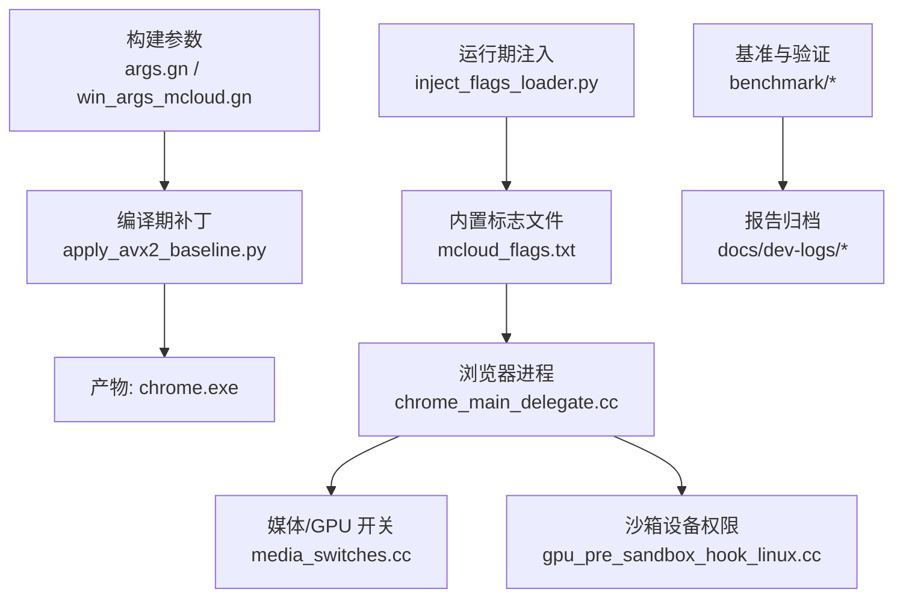
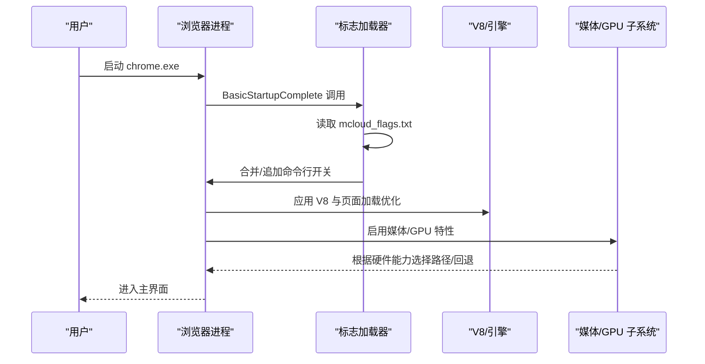
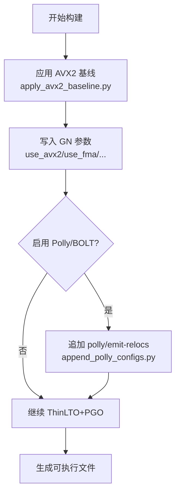
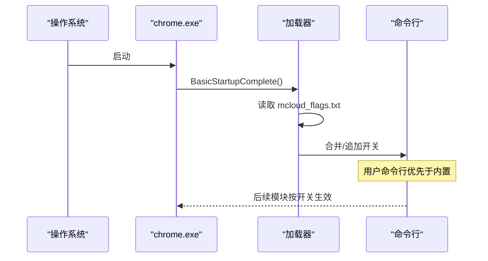
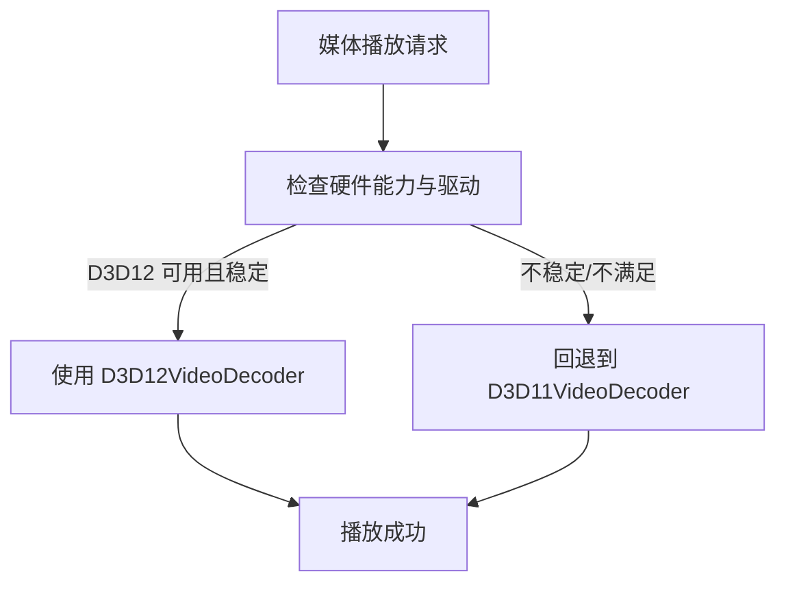
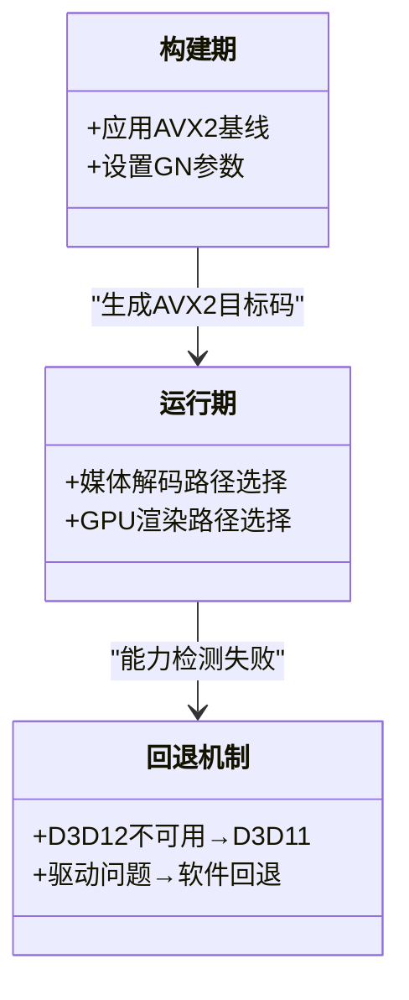
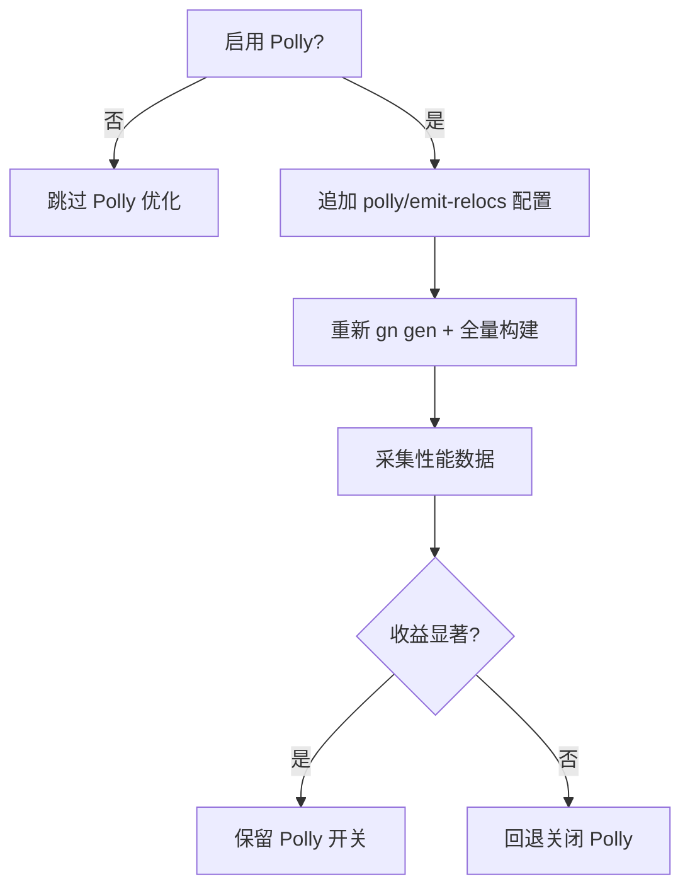
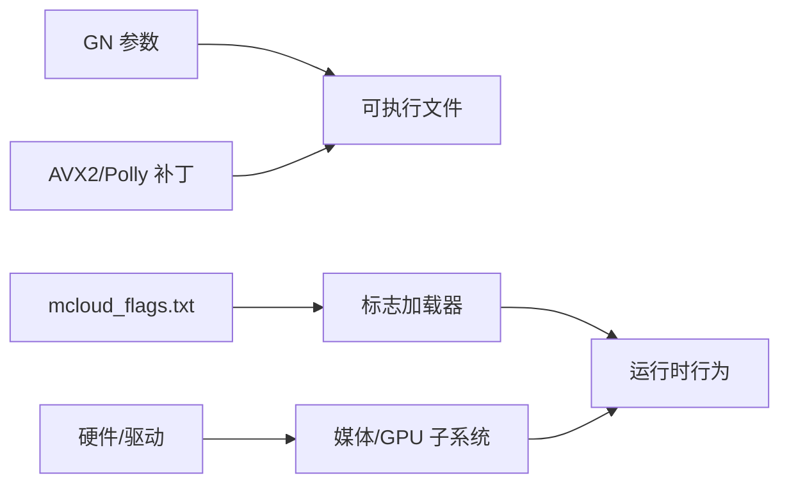

# 优化架构

本文引用的文件

- [README.md](https://github.com/Mcloud136/Mcloud-Browser/blob/main/README.md)
- [mcloud_flags.txt](https://github.com/Mcloud136/Mcloud-Browser/blob/main/mcloud_flags.txt)
- [args.gn](https://github.com/Mcloud136/Mcloud-Browser/blob/main/args.gn)
- [win_args_mcloud.gn](https://github.com/Mcloud136/Mcloud-Browser/blob/main/win_args_mcloud.gn)
- [other/AVX2/AVX2_args.gn](https://github.com/Mcloud136/Mcloud-Browser/blob/main/other/AVX2/AVX2_args.gn)
- [win_scripts/apply_avx2_baseline.py](https://github.com/Mcloud136/Mcloud-Browser/blob/main/win_scripts/apply_avx2_baseline.py)
- [win_scripts/inject_flags_loader.py](https://github.com/Mcloud136/Mcloud-Browser/blob/main/win_scripts/inject_flags_loader.py)
- [win_scripts/append_polly_configs.py](https://github.com/Mcloud136/Mcloud-Browser/blob/main/win_scripts/append_polly_configs.py)
- [src/media/base/media_switches.cc](https://github.com/Mcloud136/Mcloud-Browser/blob/main/src/media/base/media_switches.cc)
- [src/content/common/gpu_pre_sandbox_hook_linux.cc](https://github.com/Mcloud136/Mcloud-Browser/blob/main/src/content/common/gpu_pre_sandbox_hook_linux.cc)
- [benchmark/run_baseline.ps1](https://github.com/Mcloud136/Mcloud-Browser/blob/main/benchmark/run_baseline.ps1)
- [benchmark/tools/verify_builtin_flags.ps1](https://github.com/Mcloud136/Mcloud-Browser/blob/main/benchmark/tools/verify_builtin_flags.ps1)
- [docs/dev-logs/M150-benchmark.md](https://github.com/Mcloud136/Mcloud-Browser/blob/main/docs/dev-logs/M150-benchmark.md)
- [docs/dev-logs/M151-benchmark.md](https://github.com/Mcloud136/Mcloud-Browser/blob/main/docs/dev-logs/M151-benchmark.md)
- [docs/dev-logs/M151-opt-benchmark.md](https://github.com/Mcloud136/Mcloud-Browser/blob/main/docs/dev-logs/M151-opt-benchmark.md)

## 目录
1. [简介](#简介)
2. [项目结构](#项目结构)
3. [核心组件](#核心组件)
4. [架构总览](#架构总览)
5. [详细组件分析](#详细组件分析)
6. [依赖关系分析](#依赖关系分析)
7. [性能考量](#性能考量)
8. [故障排查指南](#故障排查指南)
9. [结论](#结论)
10. [附录](#附录)

## 简介
本文件系统化阐述 MCloud Browser 的三层优化架构：编译器优化层（AVX2/FMA3、Polly）、运行时优化层（66 项启动标志与 V8 优化）、硬件加速层（GPU 加速与媒体解码）。文档同时说明三层协同机制（编译期注入、运行期标志加载、硬件特性检测），并给出 AVX2 基线实现原理、Polly 配置与应用场景、以及优化效果评估方法与监控工具使用指南。

## 项目结构
MCloud Browser 在 Chromium 源码基础上，通过构建脚本与部署脚本完成“编译期参数注入 + 运行期标志注入 + 硬件能力启用”的全链路优化。关键位置包括：
- 构建参数：args.gn、win_args_mcloud.gn、other/AVX2/AVX2_args.gn
- 编译期补丁：apply_avx2_baseline.py（Windows 平台 AVX2+FMA3 基线）
- 运行期注入：inject_flags_loader.py（将 mcloud_flags.txt 注入进程命令行）
- 媒体/GPU 开关：media_switches.cc、gpu_pre_sandbox_hook_linux.cc
- 基准与验证：benchmark/* 与 docs/dev-logs/*

图表来源
- [win_args_mcloud.gn:43-57](https://github.com/Mcloud136/Mcloud-Browser/blob/main/win_args_mcloud.gn#L43-L57)
- [win_scripts/apply_avx2_baseline.py:1-27](https://github.com/Mcloud136/Mcloud-Browser/blob/main/win_scripts/apply_avx2_baseline.py#L1-L27)
- [win_scripts/inject_flags_loader.py:1-125](https://github.com/Mcloud136/Mcloud-Browser/blob/main/win_scripts/inject_flags_loader.py#L1-L125)
- [mcloud_flags.txt:1-120](https://github.com/Mcloud136/Mcloud-Browser/blob/main/mcloud_flags.txt#L1-L120)
- [src/media/base/media_switches.cc:742-791](https://github.com/Mcloud136/Mcloud-Browser/blob/main/src/media/base/media_switches.cc#L742-L791)
- [src/content/common/gpu_pre_sandbox_hook_linux.cc:121-149](https://github.com/Mcloud136/Mcloud-Browser/blob/main/src/content/common/gpu_pre_sandbox_hook_linux.cc#L121-L149)

章节来源
- [README.md:61-177](https://github.com/Mcloud136/Mcloud-Browser/blob/main/README.md#L61-L177)
- [win_args_mcloud.gn:43-57](https://github.com/Mcloud136/Mcloud-Browser/blob/main/win_args_mcloud.gn#L43-L57)
- [mcloud_flags.txt:1-120](https://github.com/Mcloud136/Mcloud-Browser/blob/main/mcloud_flags.txt#L1-L120)

## 核心组件
- 编译器优化层
  - AVX2/FMA3 原生编译：通过 Windows 平台 BUILD.gn 替换默认 SSE3 为 AVX2+FMA3 等指令集；GN 参数开启 use_avx2/use_fma 等。
  - Polly 循环优化：通过 append_polly_configs.py 向 compiler/BUILD.gn 追加 polly 与 emit-relocs 配置，配合 use_polly/use_bolt 开关控制。
  - ThinLTO + PGO：is_full_optimization_build=true、use_thin_lto=true、chrome_pgo_phase=2 与 profdata 路径配置。
- 运行时优化层
  - 66 项启动标志：mcloud_flags.txt 集中管理，启动早期由注入器读取并合并到命令行（用户参数优先）。
  - V8 脚本加速：--js-flags 中设置 Maglev/TurboFan 阈值、OSR 升级与 Sparkplug 动态修补。
- 硬件加速层
  - GPU/渲染：SkiaGraphite、IncreasedCmdBufferParseSlice、ResourcePoolPreferExactSizeReuse、HighFramerateRequestFromClient 等。
  - 媒体解码：PlatformHEVCDecoderSupport、HardwareSecureDecryptionAv1、DedicatedMediaServiceThread、DirectOpusAudioDecoding 等；针对 Intel 核显 D3D12VideoDecoder 问题显式禁用以回退 D3D11。

章节来源
- [win_scripts/apply_avx2_baseline.py:1-27](https://github.com/Mcloud136/Mcloud-Browser/blob/main/win_scripts/apply_avx2_baseline.py#L1-L27)
- [other/AVX2/AVX2_args.gn:1-87](https://github.com/Mcloud136/Mcloud-Browser/blob/main/other/AVX2/AVX2_args.gn#L1-L87)
- [win_scripts/append_polly_configs.py:25-71](https://github.com/Mcloud136/Mcloud-Browser/blob/main/win_scripts/append_polly_configs.py#L25-L71)
- [win_args_mcloud.gn:43-57](https://github.com/Mcloud136/Mcloud-Browser/blob/main/win_args_mcloud.gn#L43-L57)
- [mcloud_flags.txt:54-119](https://github.com/Mcloud136/Mcloud-Browser/blob/main/mcloud_flags.txt#L54-L119)
- [src/media/base/media_switches.cc:742-791](https://github.com/Mcloud136/Mcloud-Browser/blob/main/src/media/base/media_switches.cc#L742-L791)

## 架构总览
MCloud Browser 的三层优化协同工作如下：
- 编译期：通过 GN 参数与补丁脚本生成 AVX2 目标代码，启用 LTO/PGO 与可选 Polly。
- 运行期：进程启动时读取 mcloud_flags.txt，按规则合并到命令行，触发 V8、网络、内存、渲染、媒体等优化。
- 硬件层：媒体/GPU 模块根据运行时特性与驱动能力选择最优路径，必要时回退。

图表来源
- [win_scripts/inject_flags_loader.py:34-117](https://github.com/Mcloud136/Mcloud-Browser/blob/main/win_scripts/inject_flags_loader.py#L34-L117)
- [mcloud_flags.txt:8-119](https://github.com/Mcloud136/Mcloud-Browser/blob/main/mcloud_flags.txt#L8-L119)
- [src/media/base/media_switches.cc:742-791](https://github.com/Mcloud136/Mcloud-Browser/blob/main/src/media/base/media_switches.cc#L742-L791)

## 详细组件分析

### 编译器优化层（AVX2/FMA3、Polly、ThinLTO+PGO）
- AVX2/FMA3 基线
  - 通过 apply_avx2_baseline.py 将 Windows 构建的默认 SSE3 替换为 AVX2+FMA3 等指令集，确保二进制面向现代 CPU 优化。
  - GN 参数 in args.gn/other/AVX2/AVX2_args.gn 中开启 use_avx2/use_fma/use_sse* 等。
- Polly 循环优化
  - append_polly_configs.py 向 compiler/BUILD.gn 追加 polly 与 emit-relocs 配置，并通过 use_polly/use_bolt 开关控制是否启用。
  - 当前 win_args_mcloud.gn 中 use_polly=false、use_bolt=false，待前置工具链就绪后开启。
- ThinLTO + PGO
  - is_full_optimization_build=true、use_thin_lto=true、chrome_pgo_phase=2，结合 pgo_data_path 指向对应内核版本的 profdata。

图表来源
- [win_scripts/apply_avx2_baseline.py:1-27](https://github.com/Mcloud136/Mcloud-Browser/blob/main/win_scripts/apply_avx2_baseline.py#L1-L27)
- [win_scripts/append_polly_configs.py:25-71](https://github.com/Mcloud136/Mcloud-Browser/blob/main/win_scripts/append_polly_configs.py#L25-L71)
- [win_args_mcloud.gn:43-57](https://github.com/Mcloud136/Mcloud-Browser/blob/main/win_args_mcloud.gn#L43-L57)
- [other/AVX2/AVX2_args.gn:1-87](https://github.com/Mcloud136/Mcloud-Browser/blob/main/other/AVX2/AVX2_args.gn#L1-L87)

章节来源
- [win_scripts/apply_avx2_baseline.py:1-27](https://github.com/Mcloud136/Mcloud-Browser/blob/main/win_scripts/apply_avx2_baseline.py#L1-L27)
- [win_scripts/append_polly_configs.py:25-71](https://github.com/Mcloud136/Mcloud-Browser/blob/main/win_scripts/append_polly_configs.py#L25-L71)
- [win_args_mcloud.gn:43-57](https://github.com/Mcloud136/Mcloud-Browser/blob/main/win_args_mcloud.gn#L43-L57)
- [other/AVX2/AVX2_args.gn:1-87](https://github.com/Mcloud136/Mcloud-Browser/blob/main/other/AVX2/AVX2_args.gn#L1-L87)

### 运行时优化层（66 项标志、V8 引擎优化）
- 标志加载机制
  - inject_flags_loader.py 在 BasicStartupComplete 中调用 LoadMcloudPerformanceFlags()，从 exe 同目录读取 mcloud_flags.txt，解析并合并到命令行。
  - enable/disable-features 合并策略：内置在前，用户在后，保证用户覆盖优先级。
- V8 脚本加速
  - --js-flags 中设置 Maglev/TurboFan 阈值降低、OSR 升级与 Sparkplug 动态修补，提升热点脚本优化速度。
- 典型优化类别
  - 启动预热、预连接、WebUI 精简
  - 内存回收、标签页冻结、碎片整理
  - 网络异步 DNS、TLS 0-RTT、BackForwardCache
  - 渲染 SkiaGraphite、高刷请求、命令缓冲区切片增大
  - 媒体专用线程、硬解支持、零拷贝捕获

图表来源
- [win_scripts/inject_flags_loader.py:34-117](https://github.com/Mcloud136/Mcloud-Browser/blob/main/win_scripts/inject_flags_loader.py#L34-L117)
- [mcloud_flags.txt:8-119](https://github.com/Mcloud136/Mcloud-Browser/blob/main/mcloud_flags.txt#L8-L119)

章节来源
- [win_scripts/inject_flags_loader.py:1-125](https://github.com/Mcloud136/Mcloud-Browser/blob/main/win_scripts/inject_flags_loader.py#L1-L125)
- [mcloud_flags.txt:8-119](https://github.com/Mcloud136/Mcloud-Browser/blob/main/mcloud_flags.txt#L8-L119)
- [README.md:89-177](https://github.com/Mcloud136/Mcloud-Browser/blob/main/README.md#L89-L177)

### 硬件加速层（GPU 加速、媒体解码）
- GPU/渲染优化
  - 启用 SkiaGraphite、IncreasedCmdBufferParseSlice、ResourcePoolPreferExactSizeReuse、HighFramerateRequestFromClient 等，减少卡顿与上下文切换。
- 媒体解码与回退
  - 启用 PlatformHEVCDecoderSupport、HardwareSecureDecryptionAv1、DedicatedMediaServiceThread、DirectOpusAudioDecoding 等。
  - 针对 Intel 核显 D3D12VideoDecoder 绿屏问题，显式禁用该 feature，回退至 D3D11VideoDecoder，保持硬解能力不受影响。
- Linux 沙箱设备权限
  - gpu_pre_sandbox_hook_linux.cc 在沙箱创建前授权 video-dec*/media-dec* 设备节点，保障硬件解码可用。

图表来源
- [mcloud_flags.txt:83-105](https://github.com/Mcloud136/Mcloud-Browser/blob/main/mcloud_flags.txt#L83-L105)
- [src/content/common/gpu_pre_sandbox_hook_linux.cc:121-149](https://github.com/Mcloud136/Mcloud-Browser/blob/main/src/content/common/gpu_pre_sandbox_hook_linux.cc#L121-L149)

章节来源
- [mcloud_flags.txt:83-105](https://github.com/Mcloud136/Mcloud-Browser/blob/main/mcloud_flags.txt#L83-L105)
- [src/media/base/media_switches.cc:742-791](https://github.com/Mcloud136/Mcloud-Browser/blob/main/src/media/base/media_switches.cc#L742-L791)
- [src/content/common/gpu_pre_sandbox_hook_linux.cc:121-149](https://github.com/Mcloud136/Mcloud-Browser/blob/main/src/content/common/gpu_pre_sandbox_hook_linux.cc#L121-L149)

### AVX2 基线优化的实现原理
- 指令集检测与代码路径选择
  - 构建期通过 apply_avx2_baseline.py 将 Windows 构建的 cflags 替换为 -mavx2 -mfma -mf16c -mlzcnt -mbmi -mbmi2，使编译器直接生成 AVX2 指令。
  - GN 参数统一开启 use_avx2/use_fma/use_sse*，确保各模块（V8、FFmpeg、Skia、WebRTC）均能利用 SIMD 路径。
- 性能回退机制
  - 对于媒体解码，当 D3D12VideoDecoder 出现兼容性问题时，通过 mcloud_flags.txt 显式禁用，自动回退到 D3D11VideoDecoder，保证稳定性。
  - 其他模块通常由底层库（如 FFmpeg/Skia）内部进行运行时能力探测与回退。

图表来源
- [win_scripts/apply_avx2_baseline.py:1-27](https://github.com/Mcloud136/Mcloud-Browser/blob/main/win_scripts/apply_avx2_baseline.py#L1-L27)
- [other/AVX2/AVX2_args.gn:1-87](https://github.com/Mcloud136/Mcloud-Browser/blob/main/other/AVX2/AVX2_args.gn#L1-L87)
- [mcloud_flags.txt:83-88](https://github.com/Mcloud136/Mcloud-Browser/blob/main/mcloud_flags.txt#L83-L88)

章节来源
- [win_scripts/apply_avx2_baseline.py:1-27](https://github.com/Mcloud136/Mcloud-Browser/blob/main/win_scripts/apply_avx2_baseline.py#L1-L27)
- [other/AVX2/AVX2_args.gn:1-87](https://github.com/Mcloud136/Mcloud-Browser/blob/main/other/AVX2/AVX2_args.gn#L1-L87)
- [mcloud_flags.txt:83-88](https://github.com/Mcloud136/Mcloud-Browser/blob/main/mcloud_flags.txt#L83-L88)

### Polly 循环优化的配置与应用场景
- 配置方式
  - append_polly_configs.py 向 compiler/BUILD.gn 追加 polly 与 emit-relocs 配置，包含 -polly、-polly-vectorizer=stripmine、-polly-run-dce 等选项。
  - 通过 use_polly/use_bolt 开关控制是否启用；当前默认关闭，需自建含 Polly 的 clang 与后链接流程就绪后开启。
- 应用场景
  - 密集计算循环（图像处理、音视频编解码、数学运算）可通过 Polly 进行循环展开、向量化与死代码消除，预期提升 5-10%。
  - 与 ThinLTO/PGO 协同，进一步聚焦热点路径优化。

图表来源
- [win_scripts/append_polly_configs.py:25-71](https://github.com/Mcloud136/Mcloud-Browser/blob/main/win_scripts/append_polly_configs.py#L25-L71)
- [win_args_mcloud.gn:43-57](https://github.com/Mcloud136/Mcloud-Browser/blob/main/win_args_mcloud.gn#L43-L57)

章节来源
- [win_scripts/append_polly_configs.py:25-71](https://github.com/Mcloud136/Mcloud-Browser/blob/main/win_scripts/append_polly_configs.py#L25-L71)
- [win_args_mcloud.gn:43-57](https://github.com/Mcloud136/Mcloud-Browser/blob/main/win_args_mcloud.gn#L43-L57)

## 依赖关系分析
- 构建期依赖
  - GN 参数与补丁脚本共同决定最终二进制特性（AVX2、LTO、PGO、Polly）。
- 运行期依赖
  - 标志加载器依赖 mcloud_flags.txt 的存在与正确性；注入点位于 BasicStartupComplete。
  - 媒体/GPU 子系统依赖系统驱动与硬件能力，必要时回退。
- 外部依赖
  - V8 PGO profiles、Chrome PGO profile、第三方库（FFmpeg、libvpx、libyuv 等）。

图表来源
- [win_args_mcloud.gn:43-57](https://github.com/Mcloud136/Mcloud-Browser/blob/main/win_args_mcloud.gn#L43-L57)
- [win_scripts/apply_avx2_baseline.py:1-27](https://github.com/Mcloud136/Mcloud-Browser/blob/main/win_scripts/apply_avx2_baseline.py#L1-L27)
- [win_scripts/append_polly_configs.py:25-71](https://github.com/Mcloud136/Mcloud-Browser/blob/main/win_scripts/append_polly_configs.py#L25-L71)
- [win_scripts/inject_flags_loader.py:34-117](https://github.com/Mcloud136/Mcloud-Browser/blob/main/win_scripts/inject_flags_loader.py#L34-L117)
- [mcloud_flags.txt:8-119](https://github.com/Mcloud136/Mcloud-Browser/blob/main/mcloud_flags.txt#L8-L119)

章节来源
- [win_args_mcloud.gn:43-57](https://github.com/Mcloud136/Mcloud-Browser/blob/main/win_args_mcloud.gn#L43-L57)
- [win_scripts/inject_flags_loader.py:34-117](https://github.com/Mcloud136/Mcloud-Browser/blob/main/win_scripts/inject_flags_loader.py#L34-L117)
- [mcloud_flags.txt:8-119](https://github.com/Mcloud136/Mcloud-Browser/blob/main/mcloud_flags.txt#L8-L119)

## 性能考量
- 编译期
  - AVX2/FMA3 原生编译带来 SIMD 全面加速；ThinLTO/PGO 聚焦热点路径；Polly 对密集循环有额外收益（需工具链就绪）。
- 运行期
  - 66 项标志覆盖启动、V8、网络、内存、渲染、媒体等多维度；部分预载类优化经实测取舍，平衡内存代价与收益。
- 硬件层
  - GPU 渲染与媒体解码优先使用硬件路径；遇到驱动或兼容性问题时自动回退，确保稳定性。

[本节为通用指导，不直接分析具体文件]

## 故障排查指南
- 内置标志未生效
  - 确认 mcloud_flags.txt 位于 chrome.exe 同目录；使用 verify_builtin_flags.ps1 验证代表 feature 是否出现在 chrome://version 或子进程命令行中。
- D3D12 视频解码异常
  - 若出现绿屏/花屏，检查是否启用了 D3D12VideoDecoder；当前默认禁用以回退 D3D11，确保硬解能力不受影响。
- 构建失败或功能缺失
  - 检查 GN 参数是否正确（use_avx2/use_fma/use_polly/use_bolt）；确认 PGO profdata 版本与内核匹配；验证 Polly 配置是否已追加。

章节来源
- [benchmark/tools/verify_builtin_flags.ps1:1-98](https://github.com/Mcloud136/Mcloud-Browser/blob/main/benchmark/tools/verify_builtin_flags.ps1#L1-L98)
- [mcloud_flags.txt:83-88](https://github.com/Mcloud136/Mcloud-Browser/blob/main/mcloud_flags.txt#L83-L88)
- [win_args_mcloud.gn:43-57](https://github.com/Mcloud136/Mcloud-Browser/blob/main/win_args_mcloud.gn#L43-L57)

## 结论
MCloud Browser 通过“编译期 AVX2/FMA3 + Polly/LTO/PGO、运行期 66 项标志与 V8 优化、硬件层 GPU/媒体加速”的三层架构，形成端到端的性能提升闭环。标志加载器确保优化策略在启动早期生效，媒体/GPU 子系统依据硬件能力智能选择路径并在必要时回退。基准测试与验证工具为优化效果提供可复现的评估手段。

[本节为总结性内容，不直接分析具体文件]

## 附录
- 优化效果评估方法
  - 使用 benchmark/run_baseline.ps1 一键采集 K1/K2/K7 基线，输出标准化报告至 docs/dev-logs/{版本}-benchmark.md。
  - 使用 benchmark/tools/verify_builtin_flags.ps1 验证内置标志注入（A6 闭环）。
- 性能监控工具使用指南
  - 冷启动：bench_startup.ps1
  - 内存峰值：bench_memory.ps1
  - 体积观测：bench_size.ps1
  - 导航响应：bench_navigation.ps1
  - 特征存活性校验：tools/check_features.py

章节来源
- [benchmark/run_baseline.ps1:1-78](https://github.com/Mcloud136/Mcloud-Browser/blob/main/benchmark/run_baseline.ps1#L1-L78)
- [benchmark/tools/verify_builtin_flags.ps1:1-98](https://github.com/Mcloud136/Mcloud-Browser/blob/main/benchmark/tools/verify_builtin_flags.ps1#L1-L98)
- [docs/dev-logs/M150-benchmark.md:1-26](https://github.com/Mcloud136/Mcloud-Browser/blob/main/docs/dev-logs/M150-benchmark.md#L1-L26)
- [docs/dev-logs/M151-benchmark.md:1-30](https://github.com/Mcloud136/Mcloud-Browser/blob/main/docs/dev-logs/M151-benchmark.md#L1-L30)
- [docs/dev-logs/M151-opt-benchmark.md:1-32](https://github.com/Mcloud136/Mcloud-Browser/blob/main/docs/dev-logs/M151-opt-benchmark.md#L1-L32)