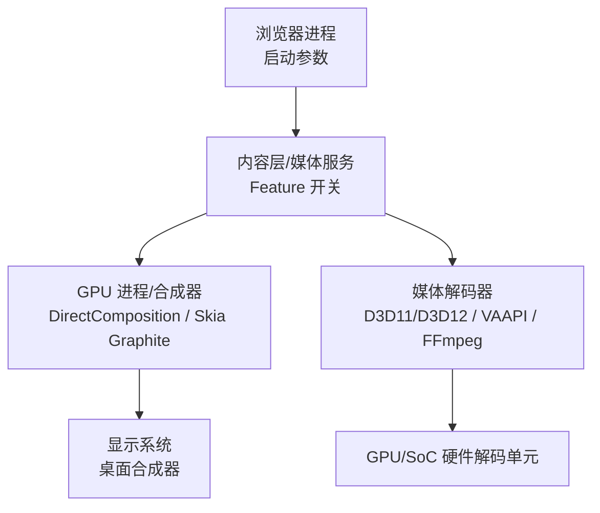
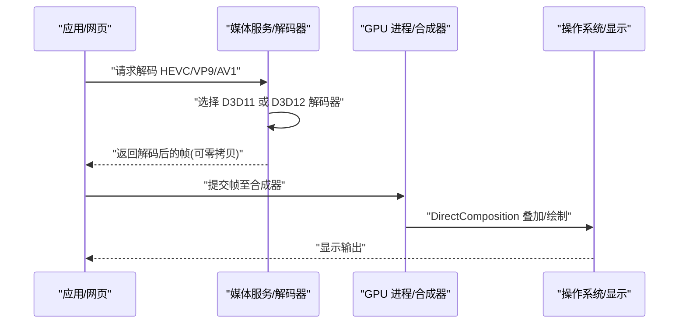
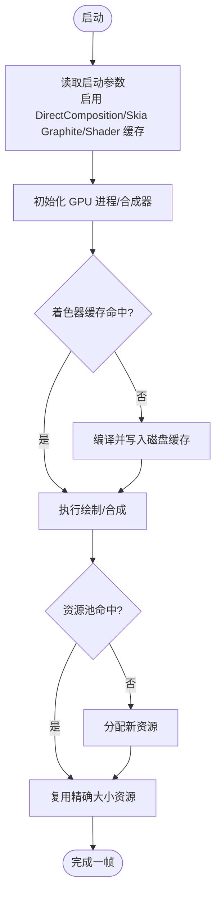
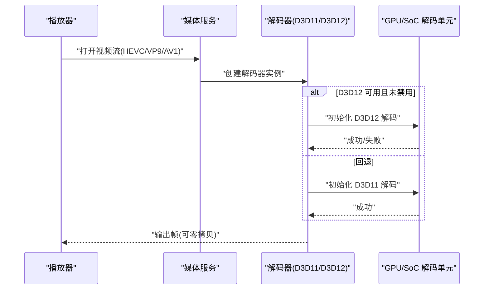
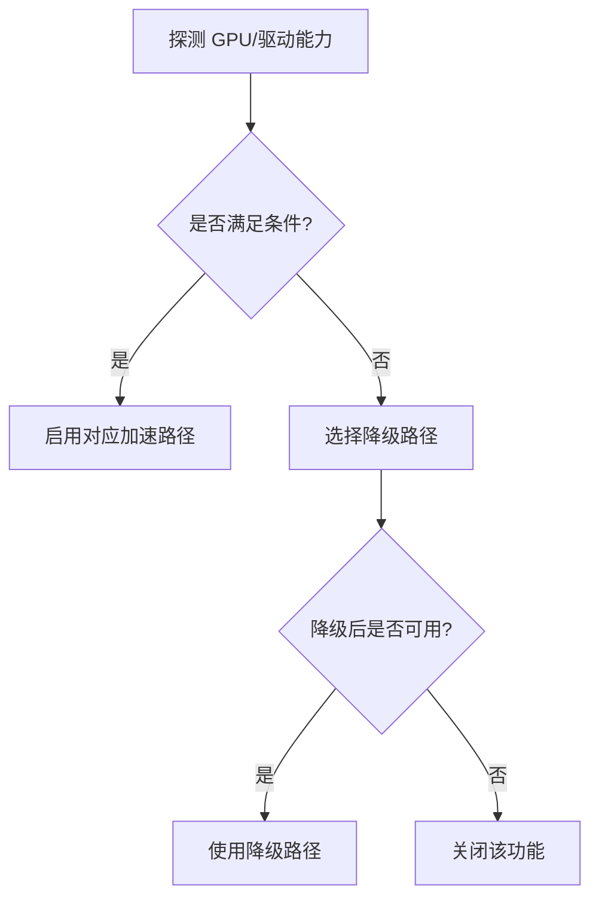
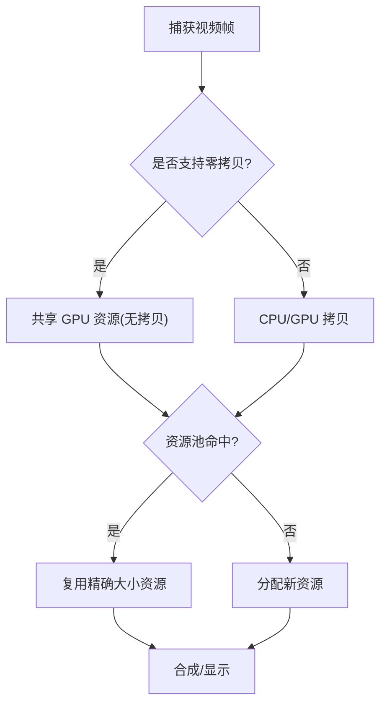
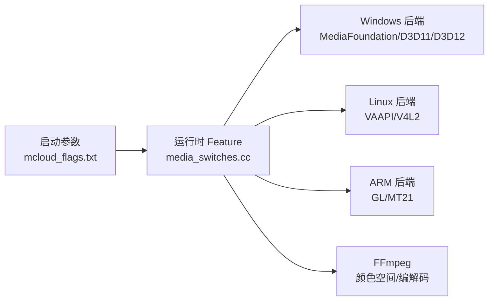

# 硬件加速层

本文引用的文件

- [mcloud_flags.txt](https://github.com/Mcloud136/Mcloud-Browser/blob/main/mcloud_flags.txt)
- [media_switches.cc](https://github.com/Mcloud136/Mcloud-Browser/blob/main/src/media/base/media_switches.cc)
- [ffmpeg_common.cc](https://github.com/Mcloud136/Mcloud-Browser/blob/main/src/media/ffmpeg/ffmpeg_common.cc)
- [gpu_pre_sandbox_hook_linux.cc](https://github.com/Mcloud136/Mcloud-Browser/blob/main/src/content/common/gpu_pre_sandbox_hook_linux.cc)
- [mcloud_flag_entries.h](https://github.com/Mcloud136/Mcloud-Browser/blob/main/src/chrome/browser/mcloud_flag_entries.h)
- [mcloud_flag_choices.h](https://github.com/Mcloud136/Mcloud-Browser/blob/main/src/chrome/browser/mcloud_flag_choices.h)
- [2026-06-19-performance-optimization-design.md](https://github.com/Mcloud136/Mcloud-Browser/blob/main/docs/superpowers/specs/2026-06-19-performance-optimization-design.md)
- [diag_igpu_green_screen.ps1](https://github.com/Mcloud136/Mcloud-Browser/blob/main/benchmark/tools/diag_igpu_green_screen.ps1)
- [win_args.list](https://github.com/Mcloud136/Mcloud-Browser/blob/main/infra/win_args.list)
- [DEV_CMDLINE_FLAGS.txt](https://github.com/Mcloud136/Mcloud-Browser/blob/main/infra/DEV_CMDLINE_FLAGS.txt)

## 目录
1. [简介](#简介)
2. [项目结构](#项目结构)
3. [核心组件](#核心组件)
4. [架构总览](#架构总览)
5. [详细组件分析](#详细组件分析)
6. [依赖关系分析](#依赖关系分析)
7. [性能考量](#性能考量)
8. [故障排查指南](#故障排查指南)
9. [结论](#结论)
10. [附录](#附录)

## 简介
本文件面向 MCloud Browser 的硬件加速层，聚焦 GPU 渲染与媒体解码两条主线：
- GPU 渲染：DirectComposition、Skia Graphite 预编译、GPU Shader 磁盘缓存、资源池复用等。
- 媒体解码：HEVC、VP9、AV1 的硬件解码支持；Windows 上 D3D11/D3D12 视频解码器选择策略；Linux VAAPI/V4L2 能力开关。
- 硬件特性检测：GPU 能力探测、驱动兼容性检查、功能降级策略（如 D3D12 回退 D3D11）。
- 零拷贝与内存优化：MediaFoundation D3D11 零拷贝捕获、资源池精确大小复用、传输缓存清理等。
- 监控与排障：GPU 利用率、解码器状态、性能瓶颈定位方法，以及常见兼容性问题与最佳实践。

## 项目结构
MCloud Browser 在硬件加速方面通过“启动参数 + 运行时 Feature 开关 + 平台后端”三层协同工作：
- 启动参数：集中定义于 mcloud_flags.txt，启用 DirectComposition、Skia Graphite、Shader 磁盘缓存、HEVC/AV1 硬解等。
- 运行时 Feature：集中在 media_switches.cc 等平台相关文件中，控制 Linux VAAPI、Windows MediaFoundation、Android 等路径。
- 平台后端：Windows 使用 D3D11/D3D12 与 MediaFoundation；Linux 使用 VAAPI/V4L2；ARM 平台提供 GL/MT21 等备选路径。

**图示来源**
- [mcloud_flags.txt:1-120](https://github.com/Mcloud136/Mcloud-Browser/blob/main/mcloud_flags.txt#L1-L120)
- [media_switches.cc:612-1399](https://github.com/Mcloud136/Mcloud-Browser/blob/main/src/media/base/media_switches.cc#L612-L1399)

**章节来源**
- [mcloud_flags.txt:1-120](https://github.com/Mcloud136/Mcloud-Browser/blob/main/mcloud_flags.txt#L1-L120)
- [media_switches.cc:612-1399](https://github.com/Mcloud136/Mcloud-Browser/blob/main/src/media/base/media_switches.cc#L612-L1399)

## 核心组件
- 渲染管线加速
  - DirectComposition：用于 Windows 桌面合成，减少窗口/视频叠加层的复制开销。
  - Skia Graphite 与预编译：提升图形命令解析效率，降低首帧延迟。
  - GPU Shader 磁盘缓存：持久化着色器，避免重复编译。
  - 资源池与传输缓存：按精确大小复用 GPU 资源，清理旧条目以降低显存占用。
- 媒体解码加速
  - Windows：MediaFoundation 批量读取、D3D11 零拷贝捕获；D3D11/D3D12 解码器选择与回退。
  - Linux：VAAPI/V4L2 加速解码开关与驱动黑名单绕过选项。
  - ARM：GL 缩放/图像处理器、MT21 软件转换等兜底方案。
- 安全与沙箱
  - Linux 沙箱预授权 V4L2 设备节点，确保仅允许访问 video-dec*/media-dec* 设备。

**章节来源**
- [mcloud_flags.txt:16-106](https://github.com/Mcloud136/Mcloud-Browser/blob/main/mcloud_flags.txt#L16-L106)
- [media_switches.cc:612-1399](https://github.com/Mcloud136/Mcloud-Browser/blob/main/src/media/base/media_switches.cc#L612-L1399)
- [gpu_pre_sandbox_hook_linux.cc:121-149](https://github.com/Mcloud136/Mcloud-Browser/blob/main/src/content/common/gpu_pre_sandbox_hook_linux.cc#L121-L149)

## 架构总览
下图展示从页面播放到最终显示的端到端数据流，涵盖 GPU 合成与媒体解码的关键环节。

**图示来源**
- [2026-06-19-performance-optimization-design.md:128-141](https://github.com/Mcloud136/Mcloud-Browser/blob/main/docs/superpowers/specs/2026-06-19-performance-optimization-design.md#L128-L141)
- [mcloud_flags.txt:83-106](https://github.com/Mcloud136/Mcloud-Browser/blob/main/mcloud_flags.txt#L83-L106)

## 详细组件分析

### 渲染加速：DirectComposition、Skia Graphite、Shader 缓存
- DirectComposition
  - 作用：在 Windows 上将视频/窗口直接叠加到桌面合成器，减少 CPU/GPU 拷贝。
  - 配置：通过启动参数启用。
- Skia Graphite 与预编译
  - 作用：Graphite 后端配合预编译管线，提高命令解析与绘制效率。
  - 配置：通过启动参数启用 Graphite 与预编译。
- GPU Shader 磁盘缓存
  - 作用：将着色器编译结果落盘，冷启动和后续加载更快。
  - 配置：通过启动参数启用。
- 资源池与传输缓存
  - 作用：按精确大小复用 GPU 资源，减少分配/释放开销；清理旧传输缓存条目以节省显存。
  - 配置：通过启动参数启用资源池复用与传输缓存清理。

**图示来源**
- [mcloud_flags.txt:21-96](https://github.com/Mcloud136/Mcloud-Browser/blob/main/mcloud_flags.txt#L21-L96)

**章节来源**
- [mcloud_flags.txt:21-96](https://github.com/Mcloud136/Mcloud-Browser/blob/main/mcloud_flags.txt#L21-L96)

### 媒体解码：HEVC、VP9、AV1 与 D3D11/D3D12 选择策略
- 编解码支持
  - HEVC：通过 PlatformHEVCDecoderSupport 启用平台 HEVC 解码。
  - VP9/AV1：通过相应 Feature 启用硬件解码与安全解密（如 AV1 安全解密）。
- 解码器选择
  - Windows：优先尝试 D3D12VideoDecoder，失败则回退到 D3D11VideoDecoder。
  - 当前构建默认禁用 D3D12VideoDecoder（规避核显绿屏问题），稳定回退 D3D11。
- Linux
  - 通过 VAAPI/V4L2 开启硬件解码；可按需忽略非 Intel 驱动黑名单进行实验性验证。
- 颜色空间与色彩处理
  - FFmpeg 侧对 VP9/AV1/HEVC 的颜色空间推断与修正，避免 HDR/色域错误。

**图示来源**
- [2026-06-19-performance-optimization-design.md:128-141](https://github.com/Mcloud136/Mcloud-Browser/blob/main/docs/superpowers/specs/2026-06-19-performance-optimization-design.md#L128-L141)
- [mcloud_flags.txt:83-106](https://github.com/Mcloud136/Mcloud-Browser/blob/main/mcloud_flags.txt#L83-L106)
- [media_switches.cc:612-1399](https://github.com/Mcloud136/Mcloud-Browser/blob/main/src/media/base/media_switches.cc#L612-L1399)

**章节来源**
- [mcloud_flags.txt:83-106](https://github.com/Mcloud136/Mcloud-Browser/blob/main/mcloud_flags.txt#L83-L106)
- [2026-06-19-performance-optimization-design.md:128-141](https://github.com/Mcloud136/Mcloud-Browser/blob/main/docs/superpowers/specs/2026-06-19-performance-optimization-design.md#L128-L141)
- [media_switches.cc:612-1399](https://github.com/Mcloud136/Mcloud-Browser/blob/main/src/media/base/media_switches.cc#L612-L1399)
- [ffmpeg_common.cc:715-768](https://github.com/Mcloud136/Mcloud-Browser/blob/main/src/media/ffmpeg/ffmpeg_common.cc#L715-L768)

### 硬件特性检测与降级策略
- GPU 能力探测
  - 通过 Feature 开关与平台后端能力检测决定启用哪些加速路径（如 VAAPI、D3D11/D3D12）。
- 驱动兼容性检查
  - Linux 提供忽略非 Intel 驱动黑名单的实验开关，便于评估新驱动稳定性。
- 功能降级
  - Windows：当 D3D12 解码不稳定时自动回退到 D3D11；当前构建默认禁用 D3D12 解码以避免核显绿屏。
  - ARM：在无法被显示控制器识别的格式下，可选择 GL 缩放/图像处理或软件 MT21 转换。

**图示来源**
- [media_switches.cc:742-777](https://github.com/Mcloud136/Mcloud-Browser/blob/main/src/media/base/media_switches.cc#L742-L777)
- [media_switches.cc:1246-1268](https://github.com/Mcloud136/Mcloud-Browser/blob/main/src/media/base/media_switches.cc#L1246-L1268)
- [mcloud_flags.txt:83-88](https://github.com/Mcloud136/Mcloud-Browser/blob/main/mcloud_flags.txt#L83-L88)

**章节来源**
- [media_switches.cc:742-777](https://github.com/Mcloud136/Mcloud-Browser/blob/main/src/media/base/media_switches.cc#L742-L777)
- [media_switches.cc:1246-1268](https://github.com/Mcloud136/Mcloud-Browser/blob/main/src/media/base/media_switches.cc#L1246-L1268)
- [mcloud_flags.txt:83-88](https://github.com/Mcloud136/Mcloud-Browser/blob/main/mcloud_flags.txt#L83-L88)

### 零拷贝渲染与内存池优化
- 零拷贝捕获
  - Windows：MediaFoundation D3D11 视频捕获支持零拷贝，减少 CPU/GPU 间数据搬运。
- 资源池与传输缓存
  - 资源池按精确大小复用，降低分配/释放成本；清理旧传输缓存条目以减少显存压力。
- 沙箱设备权限
  - Linux：为 V4L2 解码器设备节点授予最小必要权限，确保安全与性能平衡。

**图示来源**
- [mcloud_flags.txt:98-106](https://github.com/Mcloud136/Mcloud-Browser/blob/main/mcloud_flags.txt#L98-L106)
- [gpu_pre_sandbox_hook_linux.cc:121-149](https://github.com/Mcloud136/Mcloud-Browser/blob/main/src/content/common/gpu_pre_sandbox_hook_linux.cc#L121-L149)

**章节来源**
- [mcloud_flags.txt:98-106](https://github.com/Mcloud136/Mcloud-Browser/blob/main/mcloud_flags.txt#L98-L106)
- [gpu_pre_sandbox_hook_linux.cc:121-149](https://github.com/Mcloud136/Mcloud-Browser/blob/main/src/content/common/gpu_pre_sandbox_hook_linux.cc#L121-L149)

## 依赖关系分析
- 启动参数与 Feature 的关系
  - mcloud_flags.txt 中的 --enable-features/--disable-features 直接影响 media_switches.cc 中定义的 BASE_FEATURE 行为。
- 平台后端依赖
  - Windows：MediaFoundation、D3D11/D3D12；ANGLE/DirectX 相关构建参数影响渲染路径。
  - Linux：VAAPI/V4L2；沙箱预授权设备节点。
- 第三方库
  - FFmpeg：负责部分编解码与颜色空间处理；VP9/AV1/HEVC 的色彩推断与修正。

**图示来源**
- [mcloud_flags.txt:1-120](https://github.com/Mcloud136/Mcloud-Browser/blob/main/mcloud_flags.txt#L1-L120)
- [media_switches.cc:612-1399](https://github.com/Mcloud136/Mcloud-Browser/blob/main/src/media/base/media_switches.cc#L612-L1399)
- [ffmpeg_common.cc:715-768](https://github.com/Mcloud136/Mcloud-Browser/blob/main/src/media/ffmpeg/ffmpeg_common.cc#L715-L768)

**章节来源**
- [mcloud_flags.txt:1-120](https://github.com/Mcloud136/Mcloud-Browser/blob/main/mcloud_flags.txt#L1-L120)
- [media_switches.cc:612-1399](https://github.com/Mcloud136/Mcloud-Browser/blob/main/src/media/base/media_switches.cc#L612-L1399)
- [ffmpeg_common.cc:715-768](https://github.com/Mcloud136/Mcloud-Browser/blob/main/src/media/ffmpeg/ffmpeg_common.cc#L715-L768)

## 性能考量
- 渲染
  - 启用 DirectComposition、Skia Graphite 预编译与 Shader 磁盘缓存可降低首帧延迟与重复编译开销。
  - 资源池精确大小复用与传输缓存清理有助于降低显存峰值与抖动。
- 解码
  - 优先使用 D3D11/D3D12 硬件解码；在核显场景下禁用 D3D12 回退 D3D11 可避免绿屏。
  - Linux 下按需启用 VAAPI/V4L2，必要时忽略驱动黑名单进行实验性验证。
- 线程与调度
  - 专用媒体服务线程、IO 线程交互式类型、Mojo 专用线程等可减少阻塞与竞争。
- 构建与运行参数
  - 参考 win_args.list 与 DEV_CMDLINE_FLAGS.txt 中的 GPU/调试相关参数，辅助定位与调优。

[本节为通用指导，不直接分析具体文件]

## 故障排查指南
- 核显绿屏/花屏
  - 现象：Intel 核显在 D3D12 解码初期出现绿屏/花屏。
  - 解决：禁用 D3D12VideoDecoder，回退到 D3D11VideoDecoder。
  - 工具：使用 diag_igpu_green_screen.ps1 二分定位故障层级（DComp/MPO overlay、D3D12 解码输出、硬件 overlay 平面）。
- 上下文丢失/黑屏
  - 可通过“gpu-no-context-lost”标志缓解电源/屏保导致的上下文丢失问题。
- Linux 沙箱与设备访问
  - 确认 V4L2 设备节点已正确授权；必要时调整 VAAPI 相关 Feature。
- 调试与日志
  - 使用 DEV_CMDLINE_FLAGS.txt 中的调试参数（如 FPS 计数器、精确内存信息）辅助观察。

**章节来源**
- [mcloud_flags.txt:83-88](https://github.com/Mcloud136/Mcloud-Browser/blob/main/mcloud_flags.txt#L83-L88)
- [mcloud_flag_entries.h:196-220](https://github.com/Mcloud136/Mcloud-Browser/blob/main/src/chrome/browser/mcloud_flag_entries.h#L196-L220)
- [diag_igpu_green_screen.ps1:1-23](https://github.com/Mcloud136/Mcloud-Browser/blob/main/benchmark/tools/diag_igpu_green_screen.ps1#L1-L23)
- [DEV_CMDLINE_FLAGS.txt:1-1](https://github.com/Mcloud136/Mcloud-Browser/blob/main/infra/DEV_CMDLINE_FLAGS.txt#L1-L1)

## 结论
MCloud Browser 的硬件加速层通过“启动参数 + 运行时 Feature + 平台后端”的组合，实现了高效的 GPU 渲染与媒体解码：
- 渲染侧：DirectComposition、Skia Graphite 预编译、Shader 磁盘缓存与资源池复用共同提升流畅度与能效。
- 解码侧：HEVC/VP9/AV1 硬件解码与 D3D11/D3D12 选择策略兼顾性能与稳定性；Linux VAAPI/V4L2 提供跨平台能力。
- 兼容性：通过驱动黑名单、功能降级与零拷贝捕获等手段，保障在不同硬件上的可用性。
- 运维：配套的诊断脚本与调试参数帮助快速定位问题，形成闭环优化。

[本节为总结性内容，不直接分析具体文件]

## 附录
- 关键启动参数与 Feature 对照
  - DirectComposition、Skia Graphite、Shader 磁盘缓存、HEVC/AV1 硬解、D3D11 零拷贝捕获等均在 mcloud_flags.txt 中集中管理。
- 平台相关 Feature
  - Linux VAAPI/V4L2、ARM GL/MT21、Windows MediaFoundation 等在 media_switches.cc 中定义。
- 构建与调试参数
  - win_args.list 与 DEV_CMDLINE_FLAGS.txt 提供 GPU/调试相关构建与运行参数参考。

**章节来源**
- [mcloud_flags.txt:1-120](https://github.com/Mcloud136/Mcloud-Browser/blob/main/mcloud_flags.txt#L1-L120)
- [media_switches.cc:612-1399](https://github.com/Mcloud136/Mcloud-Browser/blob/main/src/media/base/media_switches.cc#L612-L1399)
- [win_args.list:207-241](https://github.com/Mcloud136/Mcloud-Browser/blob/main/infra/win_args.list#L207-L241)
- [DEV_CMDLINE_FLAGS.txt:1-1](https://github.com/Mcloud136/Mcloud-Browser/blob/main/infra/DEV_CMDLINE_FLAGS.txt#L1-L1)