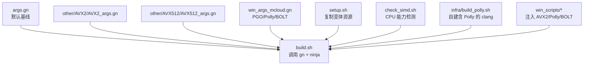
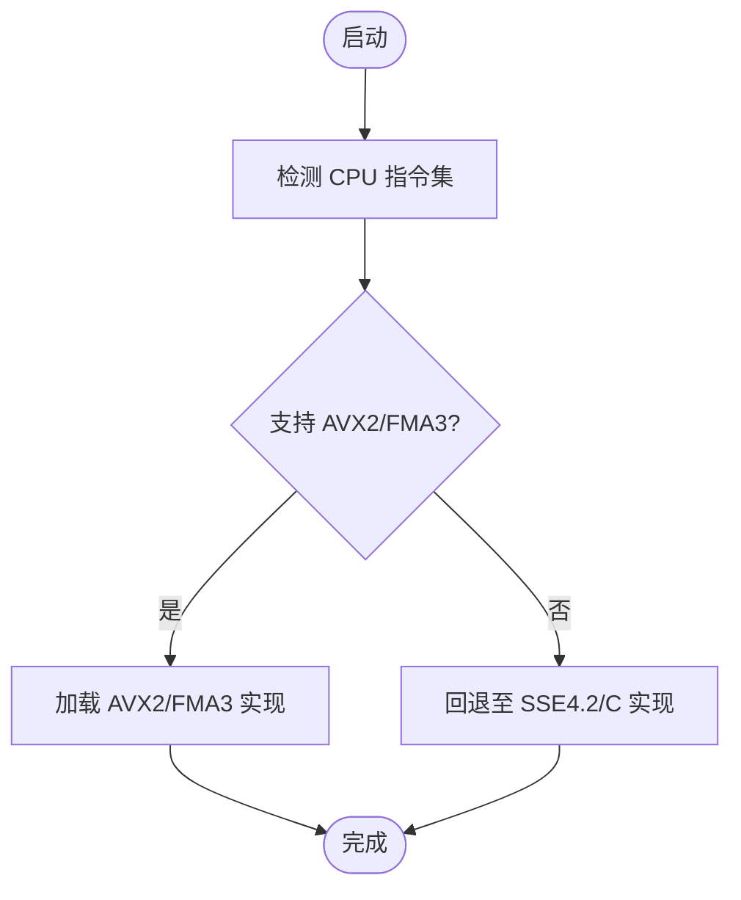
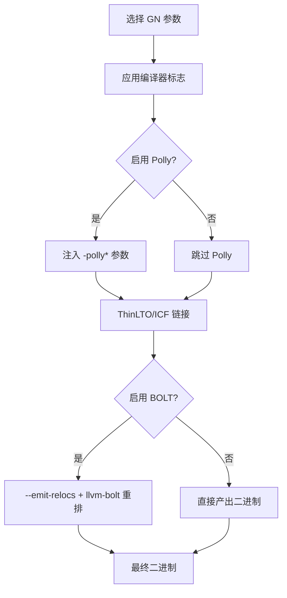
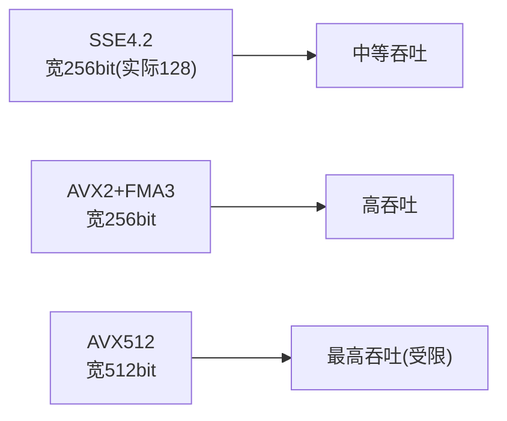
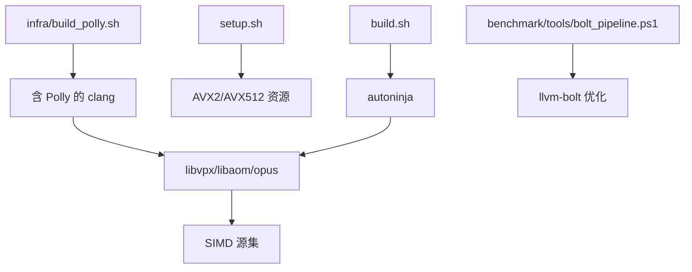

# 编译器优化层

<details><summary>本文引用的文件</summary>

- [args.gn](https://github.com/Mcloud136/Mcloud-Browser/blob/main/args.gn)
- [other/AVX2/AVX2_args.gn](https://github.com/Mcloud136/Mcloud-Browser/blob/main/other/AVX2/AVX2_args.gn)
- [other/AVX512/AVX512_args.gn](https://github.com/Mcloud136/Mcloud-Browser/blob/main/other/AVX512/AVX512_args.gn)
- [win_args_mcloud.gn](https://github.com/Mcloud136/Mcloud-Browser/blob/main/win_args_mcloud.gn)
- [infra/gn_args.list](https://github.com/Mcloud136/Mcloud-Browser/blob/main/infra/gn_args.list)
- [setup.sh](https://github.com/Mcloud136/Mcloud-Browser/blob/main/setup.sh)
- [check_simd.sh](https://github.com/Mcloud136/Mcloud-Browser/blob/main/check_simd.sh)
- [other/README.md](https://github.com/Mcloud136/Mcloud-Browser/blob/main/other/README.md)
- [docs/ABOUT_RELEASES.md](https://github.com/Mcloud136/Mcloud-Browser/blob/main/docs/ABOUT_RELEASES.md)
- [src/tools/clang/scripts/build.py](https://github.com/Mcloud136/Mcloud-Browser/blob/main/src/tools/clang/scripts/build.py)
- [infra/build_polly.sh](https://github.com/Mcloud136/Mcloud-Browser/blob/main/infra/build_polly.sh)
- [win_scripts/append_polly_configs.py](https://github.com/Mcloud136/Mcloud-Browser/blob/main/win_scripts/append_polly_configs.py)
- [win_scripts/apply_polly_wiring.py](https://github.com/Mcloud136/Mcloud-Browser/blob/main/win_scripts/apply_polly_wiring.py)
- [win_scripts/apply_avx2_baseline.py](https://github.com/Mcloud136/Mcloud-Browser/blob/main/win_scripts/apply_avx2_baseline.py)
- [arm/third_party/libvpx/BUILD.gn](https://github.com/Mcloud136/Mcloud-Browser/blob/main/arm/third_party/libvpx/BUILD.gn)
- [arm/third_party/libaom/BUILD.gn](https://github.com/Mcloud136/Mcloud-Browser/blob/main/arm/third_party/libaom/BUILD.gn)
- [other/AVX2/third_party/opus/src/configure.ac](https://github.com/Mcloud136/Mcloud-Browser/blob/main/other/AVX2/third_party/opus/src/configure.ac)
- [benchmark/tools/bolt_pipeline.ps1](https://github.com/Mcloud136/Mcloud-Browser/blob/main/benchmark/tools/bolt_pipeline.ps1)
- [build.sh](https://github.com/Mcloud136/Mcloud-Browser/blob/main/build.sh)

</details>

## 目录
1. [简介](#简介)
2. [项目结构](#项目结构)
3. [核心组件](#核心组件)
4. [架构总览](#架构总览)
5. [详细组件分析](#详细组件分析)
6. [依赖关系分析](#依赖关系分析)
7. [性能考量](#性能考量)
8. [故障排查指南](#故障排查指南)
9. [结论](#结论)
10. [附录](#附录)

## 简介
本文件系统性梳理 MCloud Browser 的编译器优化层，聚焦以下目标：
- AVX2/FMA3 指令集优化的实现原理与运行时回退策略
- Polly 循环优化（展开、向量化、并行化）的配置与应用场景
- 编译时优化注入流程（GN 参数、编译器标志、链接期优化）
- 不同 CPU 架构（SSE4.2、AVX2、AVX512）的优化策略对比
- 优化效果评估方法与调试技巧

## 项目结构
MCloud Browser 将“构建配置”与“优化开关”解耦为多套 GN 参数集，并通过脚本在构建前进行统一装配。关键目录与职责：
- 根级 args.gn：默认基线（未启用 AVX2/FMA3），用于通用兼容构建
- other/AVX2/AVX2_args.gn：启用 AVX2+FMA3 的发布级构建参数
- other/AVX512/AVX512_args.gn：启用 AVX512 的高性能变体参数
- win_args_mcloud.gn：Windows 平台专用优化开关（PGO、Polly、BOLT 等）
- infra/build_polly.sh：自建带 Polly 的 LLVM/Clang 工具链
- win_scripts/*：一次性脚本，用于注入 AVX2 基线、Polly/BOLT 接线与 emit-relocs
- arm/third_party/*：第三方库（libvpx、libaom、opus）针对 SIMD 的源集与条件编译
- check_simd.sh：主机 CPU 能力检测脚本（SSE/AVX/AVX2/AES 等）
- setup.sh：根据参数复制对应变体的构建资源（如 wrapper 与版本信息）



**图示来源**
- [build.sh:42-51](https://github.com/Mcloud136/Mcloud-Browser/blob/main/build.sh#L42-L51)
- [args.gn:1-87](https://github.com/Mcloud136/Mcloud-Browser/blob/main/args.gn#L1-L87)
- [other/AVX2/AVX2_args.gn:1-87](https://github.com/Mcloud136/Mcloud-Browser/blob/main/other/AVX2/AVX2_args.gn#L1-L87)
- [other/AVX512/AVX512_args.gn:1-87](https://github.com/Mcloud136/Mcloud-Browser/blob/main/other/AVX512/AVX512_args.gn#L1-L87)
- [win_args_mcloud.gn:38-59](https://github.com/Mcloud136/Mcloud-Browser/blob/main/win_args_mcloud.gn#L38-L59)
- [setup.sh:292-323](https://github.com/Mcloud136/Mcloud-Browser/blob/main/setup.sh#L292-L323)
- [check_simd.sh:1-125](https://github.com/Mcloud136/Mcloud-Browser/blob/main/check_simd.sh#L1-L125)
- [infra/build_polly.sh:1-97](https://github.com/Mcloud136/Mcloud-Browser/blob/main/infra/build_polly.sh#L1-L97)
- [win_scripts/apply_polly_wiring.py:1-47](https://github.com/Mcloud136/Mcloud-Browser/blob/main/win_scripts/apply_polly_wiring.py#L1-L47)
- [win_scripts/append_polly_configs.py:25-71](https://github.com/Mcloud136/Mcloud-Browser/blob/main/win_scripts/append_polly_configs.py#L25-L71)
- [win_scripts/apply_avx2_baseline.py:1-26](https://github.com/Mcloud136/Mcloud-Browser/blob/main/win_scripts/apply_avx2_baseline.py#L1-L26)

**章节来源**
- [build.sh:42-51](https://github.com/Mcloud136/Mcloud-Browser/blob/main/build.sh#L42-L51)
- [args.gn:1-87](https://github.com/Mcloud136/Mcloud-Browser/blob/main/args.gn#L1-L87)
- [other/AVX2/AVX2_args.gn:1-87](https://github.com/Mcloud136/Mcloud-Browser/blob/main/other/AVX2/AVX2_args.gn#L1-L87)
- [other/AVX512/AVX512_args.gn:1-87](https://github.com/Mcloud136/Mcloud-Browser/blob/main/other/AVX512/AVX512_args.gn#L1-L87)
- [win_args_mcloud.gn:38-59](https://github.com/Mcloud136/Mcloud-Browser/blob/main/win_args_mcloud.gn#L38-L59)
- [setup.sh:292-323](https://github.com/Mcloud136/Mcloud-Browser/blob/main/setup.sh#L292-L323)
- [check_simd.sh:1-125](https://github.com/Mcloud136/Mcloud-Browser/blob/main/check_simd.sh#L1-L125)
- [infra/build_polly.sh:1-97](https://github.com/Mcloud136/Mcloud-Browser/blob/main/infra/build_polly.sh#L1-L97)
- [win_scripts/apply_polly_wiring.py:1-47](https://github.com/Mcloud136/Mcloud-Browser/blob/main/win_scripts/apply_polly_wiring.py#L1-L47)
- [win_scripts/append_polly_configs.py:25-71](https://github.com/Mcloud136/Mcloud-Browser/blob/main/win_scripts/append_polly_configs.py#L25-L71)
- [win_scripts/apply_avx2_baseline.py:1-26](https://github.com/Mcloud136/Mcloud-Browser/blob/main/win_scripts/apply_avx2_baseline.py#L1-L26)

## 核心组件
- 指令集基线与选择
  - 默认基线：SSE4.2（通过 use_sse42=true 等开关控制）
  - AVX2/FMA3 基线：通过 AVX2_args.gn 或 Windows 侧 apply_avx2_baseline.py 注入 -mavx2/-mfma 等标志
  - AVX512 变体：通过 AVX512_args.gn 开启 use_avx512=true
- Polly 循环优化
  - 通过 append_polly_configs.py 注入 -polly 相关 ldflags
  - 通过 apply_polly_wiring.py 将 polly/emit-relocs 接入可执行/共享库默认配置
  - 使用 infra/build_polly.sh 构建自带 Polly 的 Clang
- 链接期优化
  - BOLT：通过 emit-relocs 保留重定位信息，配合 llvm-bolt 进行后链接重排
  - ThinLTO/ICF：在 args.gn 中启用 thin_lto_enable_optimizations/use_icf
- 媒体子系统的 SIMD 源集
  - libvpx/libaom/opus 提供按指令集划分的 source_set，由构建系统按目标 CPU 选择

**章节来源**
- [other/AVX2/AVX2_args.gn:1-87](https://github.com/Mcloud136/Mcloud-Browser/blob/main/other/AVX2/AVX2_args.gn#L1-L87)
- [other/AVX512/AVX512_args.gn:1-87](https://github.com/Mcloud136/Mcloud-Browser/blob/main/other/AVX512/AVX512_args.gn#L1-L87)
- [win_scripts/apply_avx2_baseline.py:1-26](https://github.com/Mcloud136/Mcloud-Browser/blob/main/win_scripts/apply_avx2_baseline.py#L1-L26)
- [win_scripts/append_polly_configs.py:25-71](https://github.com/Mcloud136/Mcloud-Browser/blob/main/win_scripts/append_polly_configs.py#L25-L71)
- [win_scripts/apply_polly_wiring.py:1-47](https://github.com/Mcloud136/Mcloud-Browser/blob/main/win_scripts/apply_polly_wiring.py#L1-L47)
- [infra/build_polly.sh:1-97](https://github.com/Mcloud136/Mcloud-Browser/blob/main/infra/build_polly.sh#L1-L97)
- [arm/third_party/libvpx/BUILD.gn:274-302](https://github.com/Mcloud136/Mcloud-Browser/blob/main/arm/third_party/libvpx/BUILD.gn#L274-L302)
- [arm/third_party/libaom/BUILD.gn:142-181](https://github.com/Mcloud136/Mcloud-Browser/blob/main/arm/third_party/libaom/BUILD.gn#L142-L181)
- [other/AVX2/third_party/opus/src/configure.ac:729-761](https://github.com/Mcloud136/Mcloud-Browser/blob/main/other/AVX2/third_party/opus/src/configure.ac#L729-L761)

## 架构总览
下图展示从源码到二进制的全链路优化路径：GN 参数决定指令集基线与优化开关；构建阶段注入 Polly/BOLT；媒体库按指令集选择最优源集；最终产物经 PGO/BOLT 进一步调优。

```mermaid
sequenceDiagram
participant Dev as "开发者"
participant GN as "GN 参数"
participant Build as "构建系统"
participant Clang as "Clang/LLVM"
participant Polly as "Polly"
participant LTO as "ThinLTO/ICF"
participant Link as "链接器"
participant BOLT as "llvm-bolt"
participant Bin as "最终二进制"
Dev->>GN : 选择 AVX2/AVX512/SSE4.2 参数
GN-->>Build : 生成构建图
Build->>Clang : 编译含 -msse4.2/-mavx2/-mfma 等
Clang->>Polly : 循环展开/向量化/并行化可选
Polly-->>Clang : 优化后的 IR
Clang->>LTO : 跨单元优化
LTO->>Link : 链接保留重定位 if BOLT
Link->>BOLT : 后链接重排可选
BOLT-->>Bin : 优化后的可执行文件
```

**图示来源**
- [other/AVX2/AVX2_args.gn:1-87](https://github.com/Mcloud136/Mcloud-Browser/blob/main/other/AVX2/AVX2_args.gn#L1-L87)
- [other/AVX512/AVX512_args.gn:1-87](https://github.com/Mcloud136/Mcloud-Browser/blob/main/other/AVX512/AVX512_args.gn#L1-L87)
- [win_scripts/append_polly_configs.py:25-71](https://github.com/Mcloud136/Mcloud-Browser/blob/main/win_scripts/append_polly_configs.py#L25-L71)
- [win_scripts/apply_polly_wiring.py:1-47](https://github.com/Mcloud136/Mcloud-Browser/blob/main/win_scripts/apply_polly_wiring.py#L1-L47)
- [src/tools/clang/scripts/build.py:1704-1731](https://github.com/Mcloud136/Mcloud-Browser/blob/main/src/tools/clang/scripts/build.py#L1704-L1731)

## 详细组件分析

### AVX2/FMA3 指令集优化与回退机制
- 构建期基线注入
  - Windows 侧通过 apply_avx2_baseline.py 将 -msse3 替换为 -mavx2 -mfma -mf16c -mlzcnt -mbmi -mbmi2，形成统一的 x64 硬件基线
  - Linux 侧可通过 other/AVX2/AVX2_args.gn 启用 use_avx2=true, use_fma=true
- 运行时能力检测与回退
  - check_simd.sh 读取 /proc/cpuinfo 判断是否具备 sse2/sse3/sse4_1/sse4_2/aes/avx/avx2 等特性
  - 媒体库（libvpx/libaom/opus）以 source_set 形式按指令集拆分实现，构建时依据目标 CPU 选择最优源集；若运行环境不支持，则依赖更通用的实现路径（例如 C 或较低阶 SIMD）
- 适用场景
  - AVX2/FMA3：现代桌面/服务器 CPU（Skylake/Ryzen 1000+）获得显著吞吐提升
  - SSE4.2：作为兼容性基线，覆盖较老 CPU 并保证稳定运行



**图示来源**
- [check_simd.sh:31-107](https://github.com/Mcloud136/Mcloud-Browser/blob/main/check_simd.sh#L31-L107)
- [arm/third_party/libvpx/BUILD.gn:274-302](https://github.com/Mcloud136/Mcloud-Browser/blob/main/arm/third_party/libvpx/BUILD.gn#L274-L302)
- [arm/third_party/libaom/BUILD.gn:142-181](https://github.com/Mcloud136/Mcloud-Browser/blob/main/arm/third_party/libaom/BUILD.gn#L142-L181)
- [other/AVX2/third_party/opus/src/configure.ac:729-761](https://github.com/Mcloud136/Mcloud-Browser/blob/main/other/AVX2/third_party/opus/src/configure.ac#L729-L761)
- [win_scripts/apply_avx2_baseline.py:1-26](https://github.com/Mcloud136/Mcloud-Browser/blob/main/win_scripts/apply_avx2_baseline.py#L1-L26)

**章节来源**
- [win_scripts/apply_avx2_baseline.py:1-26](https://github.com/Mcloud136/Mcloud-Browser/blob/main/win_scripts/apply_avx2_baseline.py#L1-L26)
- [check_simd.sh:1-125](https://github.com/Mcloud136/Mcloud-Browser/blob/main/check_simd.sh#L1-L125)
- [arm/third_party/libvpx/BUILD.gn:274-302](https://github.com/Mcloud136/Mcloud-Browser/blob/main/arm/third_party/libvpx/BUILD.gn#L274-L302)
- [arm/third_party/libaom/BUILD.gn:142-181](https://github.com/Mcloud136/Mcloud-Browser/blob/main/arm/third_party/libaom/BUILD.gn#L142-L181)
- [other/AVX2/third_party/opus/src/configure.ac:729-761](https://github.com/Mcloud136/Mcloud-Browser/blob/main/other/AVX2/third_party/opus/src/configure.ac#L729-L761)

### Polly 循环优化配置与应用
- 配置注入
  - append_polly_configs.py 向构建系统追加 polly/emit-relocs 配置块，启用 -polly、-polly-vectorizer=stripmine、-polly-run-dce 等选项
  - apply_polly_wiring.py 将 polly/emit-relocs 接入默认可执行/共享库配置，确保链接阶段生效
- 工具链准备
  - infra/build_polly.sh 基于 Chromium 使用的 LLVM 源码构建本地工具链，支持 --pgo 与 ThinLTO
- 应用场景
  - 循环展开：减少分支开销，提高指令级并行
  - 向量化：将标量循环转换为 SIMD 向量操作
  - 并行化：对独立迭代进行线程级并行（受限于数据依赖）

```mermaid
sequenceDiagram
participant Dev as "开发者"
participant Script as "append_polly_configs.py"
participant GN as "BUILDCONFIG.gn"
participant Link as "链接阶段"
participant Polly as "Polly 优化"
Dev->>Script : 运行一次注入脚本
Script->>GN : 写入 polly/emit-relocs 配置
GN-->>Link : 传递 -mllvm : -polly* 等参数
Link->>Polly : 执行循环优化
Polly-->>Link : 输出优化结果
```

**图示来源**
- [win_scripts/append_polly_configs.py:25-71](https://github.com/Mcloud136/Mcloud-Browser/blob/main/win_scripts/append_polly_configs.py#L25-L71)
- [win_scripts/apply_polly_wiring.py:1-47](https://github.com/Mcloud136/Mcloud-Browser/blob/main/win_scripts/apply_polly_wiring.py#L1-L47)
- [infra/build_polly.sh:1-97](https://github.com/Mcloud136/Mcloud-Browser/blob/main/infra/build_polly.sh#L1-L97)

**章节来源**
- [win_scripts/append_polly_configs.py:25-71](https://github.com/Mcloud136/Mcloud-Browser/blob/main/win_scripts/append_polly_configs.py#L25-L71)
- [win_scripts/apply_polly_wiring.py:1-47](https://github.com/Mcloud136/Mcloud-Browser/blob/main/win_scripts/apply_polly_wiring.py#L1-L47)
- [infra/build_polly.sh:1-97](https://github.com/Mcloud136/Mcloud-Browser/blob/main/infra/build_polly.sh#L1-L97)

### 编译时优化注入流程（GN、编译器标志、链接期优化）
- GN 参数
  - 默认 args.gn：关闭 AVX2/FMA3，保持最大兼容性
  - AVX2/AVX512 变体：分别启用 use_avx2/use_avx512/use_fma
  - Windows 专用：win_args_mcloud.gn 设置 is_full_optimization_build=true、PGO 路径、use_polly/use_bolt 开关
- 编译器标志
  - AVX2/FMA3：-mavx2 -mfma -mf16c -mlzcnt -mbmi -mbmi2（Windows 侧通过脚本注入）
  - Polly：-mllvm:-polly -mllvm:-polly-vectorizer=stripmine -mllvm:-polly-run-dce
  - BOLT：--emit-relocs（保留重定位以便后链接优化）
- 链接期优化
  - ThinLTO/ICF：thin_lto_enable_optimizations=true, use_icf=true
  - BOLT：llvm-bolt 合并 perf.fdata 并重排代码/数据布局



**图示来源**
- [args.gn:1-87](https://github.com/Mcloud136/Mcloud-Browser/blob/main/args.gn#L1-L87)
- [other/AVX2/AVX2_args.gn:1-87](https://github.com/Mcloud136/Mcloud-Browser/blob/main/other/AVX2/AVX2_args.gn#L1-L87)
- [other/AVX512/AVX512_args.gn:1-87](https://github.com/Mcloud136/Mcloud-Browser/blob/main/other/AVX512/AVX512_args.gn#L1-L87)
- [win_args_mcloud.gn:38-59](https://github.com/Mcloud136/Mcloud-Browser/blob/main/win_args_mcloud.gn#L38-L59)
- [win_scripts/append_polly_configs.py:25-71](https://github.com/Mcloud136/Mcloud-Browser/blob/main/win_scripts/append_polly_configs.py#L25-L71)
- [src/tools/clang/scripts/build.py:1704-1731](https://github.com/Mcloud136/Mcloud-Browser/blob/main/src/tools/clang/scripts/build.py#L1704-L1731)

**章节来源**
- [args.gn:1-87](https://github.com/Mcloud136/Mcloud-Browser/blob/main/args.gn#L1-L87)
- [other/AVX2/AVX2_args.gn:1-87](https://github.com/Mcloud136/Mcloud-Browser/blob/main/other/AVX2/AVX2_args.gn#L1-L87)
- [other/AVX512/AVX512_args.gn:1-87](https://github.com/Mcloud136/Mcloud-Browser/blob/main/other/AVX512/AVX512_args.gn#L1-L87)
- [win_args_mcloud.gn:38-59](https://github.com/Mcloud136/Mcloud-Browser/blob/main/win_args_mcloud.gn#L38-L59)
- [win_scripts/append_polly_configs.py:25-71](https://github.com/Mcloud136/Mcloud-Browser/blob/main/win_scripts/append_polly_configs.py#L25-L71)
- [src/tools/clang/scripts/build.py:1704-1731](https://github.com/Mcloud136/Mcloud-Browser/blob/main/src/tools/clang/scripts/build.py#L1704-L1731)

### 不同 CPU 架构优化策略对比（SSE4.2、AVX2、AVX512）
- SSE4.2
  - 优势：广泛兼容，稳定性高
  - 局限：向量宽度较小，吞吐低于 AVX2/AVX512
  - 适用：老旧 CPU 或需要最大兼容性的场景
- AVX2/FMA3
  - 优势：256 位向量+FMA 融合乘加，显著提升多媒体/数学计算吞吐
  - 适用：现代桌面/服务器（Skylake/Ryzen 1000+）
- AVX512
  - 优势：512 位向量，更高并行度
  - 注意：并非所有 CPU 支持（需 Skylake-X/Zen4+），且功耗/发热较高
  - 适用：高性能工作站/服务器，且负载能充分利用宽向量



**图示来源**
- [docs/ABOUT_RELEASES.md:29-59](https://github.com/Mcloud136/Mcloud-Browser/blob/main/docs/ABOUT_RELEASES.md#L29-L59)
- [infra/gn_args.list:5390-5406](https://github.com/Mcloud136/Mcloud-Browser/blob/main/infra/gn_args.list#L5390-L5406)
- [infra/gn_args.list:6167-6179](https://github.com/Mcloud136/Mcloud-Browser/blob/main/infra/gn_args.list#L6167-L6179)

**章节来源**
- [docs/ABOUT_RELEASES.md:29-59](https://github.com/Mcloud136/Mcloud-Browser/blob/main/docs/ABOUT_RELEASES.md#L29-L59)
- [infra/gn_args.list:5390-5406](https://github.com/Mcloud136/Mcloud-Browser/blob/main/infra/gn_args.list#L5390-L5406)
- [infra/gn_args.list:6167-6179](https://github.com/Mcloud136/Mcloud-Browser/blob/main/infra/gn_args.list#L6167-L6179)

### 媒体子系统 SIMD 源集与选择
- libvpx：按 avx512/sse4.2/ssse3 等划分 source_set，依据 current_cpu 选择
- libaom：类似地提供 sse4.2/avx 等源集
- opus：configure.ac 中根据 OPUS_X86_MAY_HAVE_* 宏启用相应内建优化
- 这些源集在构建时由 GN 条件编译选择，确保运行时匹配 CPU 能力

**章节来源**
- [arm/third_party/libvpx/BUILD.gn:274-302](https://github.com/Mcloud136/Mcloud-Browser/blob/main/arm/third_party/libvpx/BUILD.gn#L274-L302)
- [arm/third_party/libaom/BUILD.gn:142-181](https://github.com/Mcloud136/Mcloud-Browser/blob/main/arm/third_party/libaom/BUILD.gn#L142-L181)
- [other/AVX2/third_party/opus/src/configure.ac:729-761](https://github.com/Mcloud136/Mcloud-Browser/blob/main/other/AVX2/third_party/opus/src/configure.ac#L729-L761)

## 依赖关系分析
- 构建脚本依赖
  - build.sh 调用 autoninja 构建 mcloud_all 及安装包
  - setup.sh 根据参数复制 AVX2/AVX512 变体资源（wrapper、版本信息等）
- 工具链依赖
  - Polly：需自建含 Polly 的 clang（infra/build_polly.sh）
  - BOLT：需 llvm-bolt/merge-fdata（Windows 无 perf，采用 instrumentation 采集）
- 第三方库依赖
  - libvpx/libaom/opus 的 SIMD 源集依赖对应的编译器标志与目标 CPU



**图示来源**
- [build.sh:42-51](https://github.com/Mcloud136/Mcloud-Browser/blob/main/build.sh#L42-L51)
- [setup.sh:292-323](https://github.com/Mcloud136/Mcloud-Browser/blob/main/setup.sh#L292-L323)
- [infra/build_polly.sh:1-97](https://github.com/Mcloud136/Mcloud-Browser/blob/main/infra/build_polly.sh#L1-L97)
- [benchmark/tools/bolt_pipeline.ps1:1-23](https://github.com/Mcloud136/Mcloud-Browser/blob/main/benchmark/tools/bolt_pipeline.ps1#L1-L23)
- [arm/third_party/libvpx/BUILD.gn:274-302](https://github.com/Mcloud136/Mcloud-Browser/blob/main/arm/third_party/libvpx/BUILD.gn#L274-L302)
- [arm/third_party/libaom/BUILD.gn:142-181](https://github.com/Mcloud136/Mcloud-Browser/blob/main/arm/third_party/libaom/BUILD.gn#L142-L181)
- [other/AVX2/third_party/opus/src/configure.ac:729-761](https://github.com/Mcloud136/Mcloud-Browser/blob/main/other/AVX2/third_party/opus/src/configure.ac#L729-L761)

**章节来源**
- [build.sh:42-51](https://github.com/Mcloud136/Mcloud-Browser/blob/main/build.sh#L42-L51)
- [setup.sh:292-323](https://github.com/Mcloud136/Mcloud-Browser/blob/main/setup.sh#L292-L323)
- [infra/build_polly.sh:1-97](https://github.com/Mcloud136/Mcloud-Browser/blob/main/infra/build_polly.sh#L1-L97)
- [benchmark/tools/bolt_pipeline.ps1:1-23](https://github.com/Mcloud136/Mcloud-Browser/blob/main/benchmark/tools/bolt_pipeline.ps1#L1-L23)

## 性能考量
- 指令集选择
  - AVX2/FMA3 在现代 CPU 上带来显著吞吐提升；AVX512 适合高性能场景但需考虑功耗与兼容性
- 循环优化
  - Polly 的 stripmine 向量化与 DCE 可减少冗余并提升并行度
- 链接期优化
  - ThinLTO/ICF 减小体积并提升局部性；BOLT 重排热点代码降低分支预测失败
- PGO
  - 使用预生成的 .profdata 指导优化，需与内核大版本严格匹配

[本节为通用指导，不直接分析具体文件]

## 故障排查指南
- 构建失败（Polly/BOLT）
  - 确认已运行 infra/build_polly.sh 构建含 Polly 的 clang
  - 确认已运行 apply_polly_wiring.py 与 append_polly_configs.py 完成接线
  - 检查 win_args_mcloud.gn 中的 use_polly/use_bolt 开关状态
- 指令集不兼容
  - 使用 check_simd.sh 验证主机是否支持 AVX2/FMA3
  - 若不支持，切换至默认 args.gn（SSE4.2 基线）
- BOLT 流水线
  - Windows 下需自备 llvm-bolt/merge-fdata；使用 benchmark/tools/bolt_pipeline.ps1 按步骤 instrument/collect/optimize/verify

**章节来源**
- [infra/build_polly.sh:1-97](https://github.com/Mcloud136/Mcloud-Browser/blob/main/infra/build_polly.sh#L1-L97)
- [win_scripts/apply_polly_wiring.py:1-47](https://github.com/Mcloud136/Mcloud-Browser/blob/main/win_scripts/apply_polly_wiring.py#L1-L47)
- [win_scripts/append_polly_configs.py:25-71](https://github.com/Mcloud136/Mcloud-Browser/blob/main/win_scripts/append_polly_configs.py#L25-L71)
- [win_args_mcloud.gn:38-59](https://github.com/Mcloud136/Mcloud-Browser/blob/main/win_args_mcloud.gn#L38-L59)
- [check_simd.sh:1-125](https://github.com/Mcloud136/Mcloud-Browser/blob/main/check_simd.sh#L1-L125)
- [benchmark/tools/bolt_pipeline.ps1:1-23](https://github.com/Mcloud136/Mcloud-Browser/blob/main/benchmark/tools/bolt_pipeline.ps1#L1-L23)

## 结论
MCloud Browser 的编译器优化层通过“GN 参数 + 脚本注入 + 第三方库 SIMD 源集”的组合，实现了灵活的指令集基线与高级优化能力。AVX2/FMA3 作为现代 CPU 的推荐基线，结合 Polly 循环优化与 BOLT 后链接优化，可在性能与兼容性之间取得良好平衡。建议在生产构建中优先采用 AVX2+FMA3，并在具备条件的平台上尝试 AVX512；同时结合 PGO 与 BOLT 以获得最佳收益。

[本节为总结性内容，不直接分析具体文件]

## 附录
- 常用命令参考
  - 构建：./build.sh <jobs>
  - 自检：./check_simd.sh host
  - 自建 Polly：./infra/build_polly.sh [--pgo]
  - 注入 AVX2 基线（Windows）：python win_scripts/apply_avx2_baseline.py
  - 注入 Polly/BOLT 接线：python win_scripts/apply_polly_wiring.py && python win_scripts/append_polly_configs.py

**章节来源**
- [build.sh:42-51](https://github.com/Mcloud136/Mcloud-Browser/blob/main/build.sh#L42-L51)
- [check_simd.sh:1-125](https://github.com/Mcloud136/Mcloud-Browser/blob/main/check_simd.sh#L1-L125)
- [infra/build_polly.sh:1-97](https://github.com/Mcloud136/Mcloud-Browser/blob/main/infra/build_polly.sh#L1-L97)
- [win_scripts/apply_avx2_baseline.py:1-26](https://github.com/Mcloud136/Mcloud-Browser/blob/main/win_scripts/apply_avx2_baseline.py#L1-L26)
- [win_scripts/apply_polly_wiring.py:1-47](https://github.com/Mcloud136/Mcloud-Browser/blob/main/win_scripts/apply_polly_wiring.py#L1-L47)
- [win_scripts/append_polly_configs.py:25-71](https://github.com/Mcloud136/Mcloud-Browser/blob/main/win_scripts/append_polly_configs.py#L25-L71)