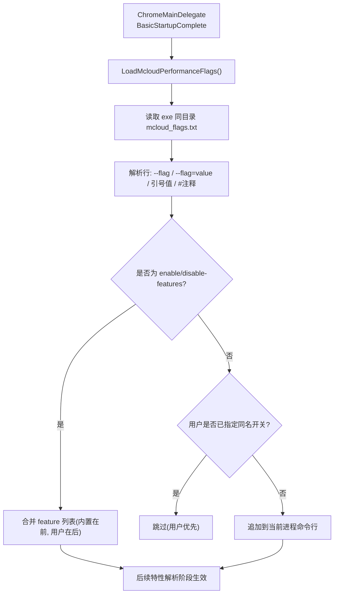
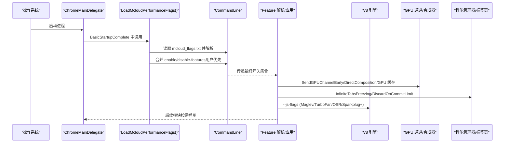
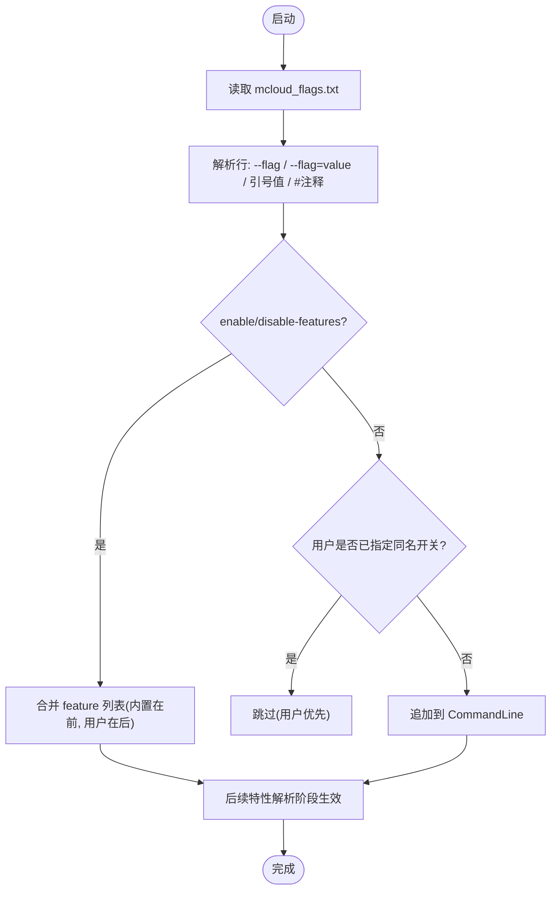

# 运行时优化层

<cite>
**本文引用的文件**
- [mcloud_flags.txt](file://mcloud_flags.txt)
- [inject_flags_loader.py](file://win_scripts/inject_flags_loader.py)
- [chrome_main_delegate.cc](file://src/chrome/app/chrome_main_delegate.cc)
- [verify_builtin_flags.ps1](file://benchmark/tools/verify_builtin_flags.ps1)
- [README.md](file://README.md)
- [M151-opt-benchmark.md](file://docs/dev-logs/M151-opt-benchmark.md)
- [2026-06-19-performance-optimization-design.md](file://docs/superpowers/specs/2026-06-19-performance-optimization-design.md)
- [memory-Enable-the-tab-discards-feature.patch](file://infra/Flatpak/com.mcloud.browser/patches/chromium/memory-Enable-the-tab-discards-feature.patch)
- [flags_state.cc](file://src/components/webui/flags/flags_state.cc)
</cite>

## 目录
1. [简介](#简介)
2. [项目结构](#项目结构)
3. [核心组件](#核心组件)
4. [架构总览](#架构总览)
5. [详细组件分析](#详细组件分析)
6. [依赖关系分析](#依赖关系分析)
7. [性能考量](#性能考量)
8. [故障排除指南](#故障排除指南)
9. [结论](#结论)
10. [附录：66 项运行标志分类与配置说明](#附录66-项运行标志分类与配置说明)

## 简介
本文件系统性梳理 MCloud Browser 的“运行时优化层”，覆盖启动、内存、网络、渲染、GPU、媒体、多线程与服务端 Worker 等维度的 66 项性能优化标志。重点包括：
- V8 JavaScript 引擎优化：Maglev/TurboFan 阈值下调、OSR 升级路径、Sparkplug+ 动态修补启用。
- 浏览器进程优先级管理、GPU 通道早期建立、标签页冻结策略。
- 运行时标志的动态加载机制（内置 mcloud_flags.txt）、配置验证流程与故障排除。
- 不同使用场景下的推荐配置组合与调优建议。

## 项目结构
MCloud 将“运行时优化”以“启动期注入 + 运行时 Feature 开关”的方式实现：
- 构建期通过 Python 脚本在 Chromium 主入口注入加载器，使浏览器启动时读取同目录的 mcloud_flags.txt 并合并到命令行。
- 运行时通过 --enable-features / --disable-features 与 --js-flags 控制具体行为。
- 基准与验证脚本用于确认内置标志是否生效，以及评估性能收益与内存代价。

图表来源
- [chrome_main_delegate.cc:782-817](file://src/chrome/app/chrome_main_delegate.cc#L782-L817)
- [inject_flags_loader.py:34-95](file://win_scripts/inject_flags_loader.py#L34-L95)

章节来源
- [inject_flags_loader.py:1-125](file://win_scripts/inject_flags_loader.py#L1-L125)
- [chrome_main_delegate.cc:782-817](file://src/chrome/app/chrome_main_delegate.cc#L782-L817)

## 核心组件
- 内置启动标志清单：mcloud_flags.txt，集中定义 66 项运行时优化开关，按类别组织（启动、视频、渲染、内存、网络、图像、推测规则、V8、预加载/预热、脚本/加载速度、MSE/视频缓冲、GPU、媒体、多线程、Service Worker、存储）。
- 注入加载器：inject_flags_loader.py，在 chrome_main_delegate.cc 中注入 LoadMcloudPerformanceFlags()，于 BasicStartupComplete 早期调用，确保在特性解析前完成合并。
- 验证工具：verify_builtin_flags.ps1，通过 headless 抓取 chrome://version 或子进程命令行探测，确认关键特征是否生效。
- 文档与基准：README.md、M151-opt-benchmark.md、performance-optimization-design.md，提供指标、取舍与来源文件映射。

章节来源
- [mcloud_flags.txt:1-120](file://mcloud_flags.txt#L1-L120)
- [inject_flags_loader.py:1-125](file://win_scripts/inject_flags_loader.py#L1-L125)
- [verify_builtin_flags.ps1:1-98](file://benchmark/tools/verify_builtin_flags.ps1#L1-L98)
- [README.md:61-133](file://README.md#L61-L133)
- [M151-opt-benchmark.md:1-78](file://docs/dev-logs/M151-opt-benchmark.md#L1-L78)
- [2026-06-19-performance-optimization-design.md:60-98](file://docs/superpowers/specs/2026-06-19-performance-optimization-design.md#L60-L98)

## 架构总览
下图展示从进程启动到特性生效的关键链路，以及各优化类别如何参与。

图表来源
- [chrome_main_delegate.cc:782-817](file://src/chrome/app/chrome_main_delegate.cc#L782-L817)
- [inject_flags_loader.py:34-95](file://win_scripts/inject_flags_loader.py#L34-L95)
- [mcloud_flags.txt:8-120](file://mcloud_flags.txt#L8-L120)

## 详细组件分析

### 启动优化（冷启动与预热）
- 目标：缩短首屏时间、减少启动阻塞、提升首次交互响应。
- 关键标志：
  - SpareRendererForSitePerProcess：预热渲染进程，降低导航首帧延迟。
  - BrowserProcessAboveNormalPriority：提高浏览器进程优先级，增强 UI 响应。
  - SendGPUChannelEarly：提前建立 GPU 通道，加速首屏渲染。
  - DeferSpeculativeRFHCreation：推迟推测性 RFH 创建，减少启动阻塞。
  - InitialWebUI:without_spellcheck/without_translate/high_stream_priority：跳过拼写/翻译初始化，提升 WebUI 流优先级。
  - TransientKeepAlivePolicy：空渲染进程短时复用，减少进程创建开销。
  - Prerender2WarmUpCompositorForNewTabPage / ForBookmarkBar：新标签页/书签栏预热合成器。
  - LoadingPreconnectToRedirectTarget / BookmarkTriggerForPreconnect / PreloadTopChromeWebUI：预连接与预载 Top Chrome WebUI。
- 效果与权衡：部分预载类优化以内存换取导航更快；实测在真实站点场景下移除高内存低收益项可显著降低内存占用。

章节来源
- [mcloud_flags.txt:8-15](file://mcloud_flags.txt#L8-L15)
- [mcloud_flags.txt:59-68](file://mcloud_flags.txt#L59-L68)
- [2026-06-19-performance-optimization-design.md:60-76](file://docs/superpowers/specs/2026-06-19-performance-optimization-design.md#L60-L76)
- [M151-opt-benchmark.md:34-60](file://docs/dev-logs/M151-opt-benchmark.md#L34-L60)

### 内存管理（标签页冻结与回收）
- 目标：在多标签场景下控制内存峰值，避免 OOM 崩溃。
- 关键标志：
  - InfiniteTabsFreezing / InfiniteTabsFreezingOnMemoryPressure：标签页冻结与压力触发冻结。
  - DiscardOnCommitLimit / SustainedPMUrgentDiscarding：内存紧张时自动丢弃标签页与紧急回收。
  - PartitionAllocEventuallyZeroFreedMemory / PartitionAllocMemoryReclaimer / PartitionAllocSortActiveSlotSpans / PartitionAllocUsePriorityInheritanceLocks：分配器优化与安全加固。
  - LowerPAMemoryLimitForNonMainRenderers：非主框架渲染器更低内存限制。
  - ReclaimOldPrepaintTiles / PruneOldTransferCacheEntries：回收旧瓦片与传输缓存条目。
- 平台适配：Linux/Chromium OS 下扩展了内存压力监听与标签丢弃逻辑。

章节来源
- [mcloud_flags.txt:27-38](file://mcloud_flags.txt#L27-L38)
- [memory-Enable-the-tab-discards-feature.patch:14-71](file://infra/Flatpak/com.mcloud.browser/patches/chromium/memory-Enable-the-tab-discards-feature.patch#L14-L71)

### 网络优化（预取、DNS、BFCache）
- 目标：降低 DNS 解析与请求建立耗时，利用缓存与预取提升导航体验。
- 关键标志：
  - BookmarkTriggerForPrefetch / NewTabPageTriggerForPrefetch：基于书签与新标签页的预取。
  - BackForwardCache / CacheControlNoStoreEnterBackForwardCache：前进后退缓存与 NoStore 进入策略。
  - AsyncDns / EarlyData：异步 DNS 与早期数据。
- 效果：在命中场景下可显著降低导航时延；未命中时收益有限，需结合站点特征评估。

章节来源
- [mcloud_flags.txt:40-46](file://mcloud_flags.txt#L40-L46)

### 渲染优化（滚动、任务抑制、帧率、合成）
- 目标：提升滚动流畅度、降低不必要任务开销、优化帧率与合成路径。
- 关键标志：
  - FlingSchedulingImprovements：滚动调度改进。
  - BestEffortTaskInhibitingPolicy：尽力而为的任务抑制策略。
  - ThrottleUnimportantFrameRate：降低不重要帧的刷新频率。
  - DirectComposition：直接合成路径（Windows）。
  - CanvasOopRasterization：Canvas 离屏光栅化。
  - SkiaGraphite / SkiaGraphitePrecompilation：Skia Graphite 相关优化。
  - HighFramerateRequestFromClient：客户端高帧率请求支持。

章节来源
- [mcloud_flags.txt:21-25](file://mcloud_flags.txt#L21-L25)
- [mcloud_flags.txt:90-96](file://mcloud_flags.txt#L90-L96)

### GPU 通道早期建立与 GPU 优化
- 目标：尽早建立 GPU 通道，减少首帧等待；优化着色器缓存、命令缓冲区解析切片等资源管理。
- 关键标志：
  - SendGPUChannelEarly：提前发送 GPU 通道。
  - GpuShaderDiskCache / IncreasedCmdBufferParseSlice / ResourcePoolPreferExactSizeReuse：GPU 资源与缓存优化。
  - DirectComposition：直接合成。
  - 视频解码修复：禁用 D3D12VideoDecoder 回退至 D3D11VideoDecoder，解决 Intel 核显绿屏问题。

章节来源
- [mcloud_flags.txt:10-11](file://mcloud_flags.txt#L10-L11)
- [mcloud_flags.txt:83-88](file://mcloud_flags.txt#L83-L88)
- [mcloud_flags.txt:90-96](file://mcloud_flags.txt#L90-L96)

### 媒体与 MSE/视频缓冲优化
- 目标：改善 Bilibili/YouTube 等平台的播放稳定性与内存占用。
- 关键标志：
  - RevokeMediaSourceObjectURLOnAttach：及时回收 MSE ObjectURL，降低内存。
  - ReduceHardwareVideoDecoderBuffers：减少硬解缓冲。
  - BackForwardCacheDWCOnJavaScriptExecution：BFCache 媒体优化。
  - PlatformHEVCDecoderSupport / HardwareSecureDecryptionAv1 / DedicatedMediaServiceThread / DirectOpusAudioDecoding / EncryptedMediaOcclusionTracking / MediaFoundationBatchRead / MediaFoundationD3D11VideoCaptureZeroCopy：平台解码、安全解密、专用线程、音频直解、加密媒体遮挡跟踪、批处理读取与零拷贝捕获。

章节来源
- [mcloud_flags.txt:78-81](file://mcloud_flags.txt#L78-L81)
- [mcloud_flags.txt:98-105](file://mcloud_flags.txt#L98-L105)

### 多线程与 Service Worker 优化
- 目标：隔离 IO 与 IPC，降低锁竞争，提升关闭标签页速度与不重要帧优先级。
- 关键标志：
  - IOThreadInteractiveThreadType / MojoDedicatedThread / BaseLockTrySpin / BoostClosingTabs / UnimportantFramesPriority。
  - ServiceWorkerNavigationPreload：导航预加载。

章节来源
- [mcloud_flags.txt:107-115](file://mcloud_flags.txt#L107-L115)

### V8 JavaScript 引擎优化（Maglev/TurboFan/OSR/Sparkplug+）
- 目标：让脚本更快进入优化编译路径，提升执行效率。
- 关键标志（--js-flags）：
  - invocation_count_for_maglev=200：Maglev 阈值下调（默认约 400），更早基线编译。
  - invocation_count_for_turbofan=1500：TurboFan 阈值下调（默认约 3000），更快热路径优化。
  - osr-from-maglev：支持从 Maglev OSR 升级到 TurboFan。
  - sparkplug-plus：启用 Sparkplug+ 动态修补。
- 注意：M151 中 V8 flag 必须使用下划线命名，连字符写法不生效。

章节来源
- [mcloud_flags.txt:54-57](file://mcloud_flags.txt#L54-L57)
- [README.md:89-96](file://README.md#L89-L96)
- [M151-opt-benchmark.md:28-32](file://docs/dev-logs/M151-opt-benchmark.md#L28-L32)

### 标签页冻结策略与内存压力响应
- 目标：在内存压力下主动冻结或丢弃标签页，防止 OOM。
- 机制：
  - InfiniteTabsFreezing：常规冻结。
  - InfiniteTabsFreezingOnMemoryPressure：内存压力触发冻结。
  - DiscardOnCommitLimit：可用内存低于阈值时自动丢弃。
  - SustainedPMUrgentDiscarding：持续压力下的紧急回收。
- 平台补丁：Linux/Chromium OS 扩展了内存压力监听与丢弃流程。

章节来源
- [mcloud_flags.txt:27-38](file://mcloud_flags.txt#L27-L38)
- [memory-Enable-the-tab-discards-feature.patch:14-71](file://infra/Flatpak/com.mcloud.browser/patches/chromium/memory-Enable-the-tab-discards-feature.patch#L14-L71)

### 运行时标志的动态加载机制与配置验证
- 动态加载：
  - 构建期通过 inject_flags_loader.py 在 chrome_main_delegate.cc 注入 LoadMcloudPerformanceFlags()。
  - 启动早期读取 mcloud_flags.txt，逐行解析并合并到 CommandLine。
  - enable/disable-features 合并策略：内置在前，用户在后（用户优先）。
- 配置验证：
  - verify_builtin_flags.ps1 通过 headless 抓取 chrome://version 或子进程命令行探测，抽查代表性特征是否生效。
  - 若缺失 mcloud_flags.txt 或未编入加载器，则验证失败。

图表来源
- [inject_flags_loader.py:34-95](file://win_scripts/inject_flags_loader.py#L34-L95)
- [verify_builtin_flags.ps1:1-98](file://benchmark/tools/verify_builtin_flags.ps1#L1-L98)

章节来源
- [inject_flags_loader.py:1-125](file://win_scripts/inject_flags_loader.py#L1-L125)
- [verify_builtin_flags.ps1:1-98](file://benchmark/tools/verify_builtin_flags.ps1#L1-L98)

## 依赖关系分析
- 启动期依赖：
  - chrome_main_delegate.cc 中的 BasicStartupComplete 调用加载器。
  - 加载器依赖 base::PathService、base::CommandLine、base::strings/string_split.h 与 content_switches.h。
- 运行时依赖：
  - 特性解析阶段消费 CommandLine 中的 --enable-features/--disable-features。
  - V8 引擎消费 --js-flags 中的参数。
  - GPU/合成器/媒体管线根据特性开关调整行为。

图表来源
- [chrome_main_delegate.cc:782-817](file://src/chrome/app/chrome_main_delegate.cc#L782-L817)
- [inject_flags_loader.py:34-95](file://win_scripts/inject_flags_loader.py#L34-L95)
- [mcloud_flags.txt:8-120](file://mcloud_flags.txt#L8-L120)

章节来源
- [chrome_main_delegate.cc:782-817](file://src/chrome/app/chrome_main_delegate.cc#L782-L817)
- [inject_flags_loader.py:1-125](file://win_scripts/inject_flags_loader.py#L1-L125)
- [mcloud_flags.txt:1-120](file://mcloud_flags.txt#L1-L120)

## 性能考量
- 启动速度：SendGPUChannelEarly、DeferSpeculativeRFHCreation、InitialWebUI、TransientKeepAlivePolicy、SpareRendererForSitePerProcess、BrowserProcessAboveNormalPriority、Prerender2WarmUpCompositor*、LoadingPreconnectToRedirectTarget、PreloadTopChromeWebUI、BookmarkTriggerForPreconnect。
- 内存管理：InfiniteTabsFreezing、InfiniteTabsFreezingOnMemoryPressure、DiscardOnCommitLimit、SustainedPMUrgentDiscarding、PartitionAlloc 系列优化、LowerPAMemoryLimitForNonMainRenderers、ReclaimOldPrepaintTiles、PruneOldTransferCacheEntries。
- 网络优化：BookmarkTriggerForPrefetch、NewTabPageTriggerForPrefetch、BackForwardCache、CacheControlNoStoreEnterBackForwardCache、AsyncDns、EarlyData。
- 渲染优化：FlingSchedulingImprovements、BestEffortTaskInhibitingPolicy、ThrottleUnimportantFrameRate、DirectComposition、CanvasOopRasterization、SkiaGraphite*、HighFramerateRequestFromClient。
- 媒体优化：RevokeMediaSourceObjectURLOnAttach、ReduceHardwareVideoDecoderBuffers、BackForwardCacheDWCOnJavaScriptExecution、PlatformHEVCDecoderSupport、HardwareSecureDecryptionAv1、DedicatedMediaServiceThread、DirectOpusAudioDecoding、EncryptedMediaOcclusionTracking、MediaFoundationBatchRead、MediaFoundationD3D11VideoCaptureZeroCopy。
- 多线程与 SW：IOThreadInteractiveThreadType、MojoDedicatedThread、BaseLockTrySpin、BoostClosingTabs、UnimportantFramesPriority、ServiceWorkerNavigationPreload。
- V8 优化：invocation_count_for_maglev=200、invocation_count_for_turbofan=1500、osr-from-maglev、sparkplug-plus。
- 权衡建议：预载类优化在真实站点场景下可能带来内存代价；实测移除 MultipleSpareRPHs、LoadingPredictorPrefetch、NewTabPageTriggerForPrerender2 三项后内存显著下降，同时保留其余预载类与脚本加速类。

章节来源
- [mcloud_flags.txt:8-120](file://mcloud_flags.txt#L8-L120)
- [README.md:61-133](file://README.md#L61-L133)
- [M151-opt-benchmark.md:34-78](file://docs/dev-logs/M151-opt-benchmark.md#L34-L78)

## 故障排除指南
- 验证内置标志是否生效：
  - 使用 verify_builtin_flags.ps1 检查代表性特征（如 SpareRendererForSitePerProcess、InfiniteTabsFreezing、PlatformHEVCDecoderSupport）是否在 chrome://version 或子进程命令行中出现。
  - 若缺少 mcloud_flags.txt 或未编入加载器，验证会失败。
- 常见问题定位：
  - 启动期日志：使用 --log-level=0 与 --enable-logging=stderr 输出详细日志。
  - IPC 调试：设置 CHROME_IPC_LOGGING=1 查看 IPC 消息。
  - 多进程调试：使用 rr 记录/回放 fork/exec 的子进程；必要时对渲染器进程设置断点。
  - 沙箱子进程：可能需要 --allow-sandbox-debugging 才能生成 core dump。
- 安装版与便携版差异：
  - 安装版受安装路径与启动器委托影响，K1 冷启动绝对值可能偏高；跨形态对比需注明环境。
  - 安装包应包含 mcloud_flags.txt，否则加载器无法读取。

章节来源
- [verify_builtin_flags.ps1:1-98](file://benchmark/tools/verify_builtin_flags.ps1#L1-L98)
- [DEBUGGING.md:463-595](file://infra/DEBUG/DEBUGGING.md#L463-L595)
- [M151-opt-benchmark.md:62-69](file://docs/dev-logs/M151-opt-benchmark.md#L62-L69)

## 结论
MCloud 的运行时优化层通过“启动期注入 + 运行时特性开关”的组合，覆盖了启动、内存、网络、渲染、GPU、媒体、多线程与 Service Worker 等多维度优化。V8 的 Maglev/TurboFan 阈值下调与 OSR/Sparkplug+ 启用进一步提升了脚本执行效率。实测表明，预载类优化在特定站点有导航收益，但会带来内存代价；通过移除高内存低收益项可在保持收益的同时显著降低内存占用。建议在部署前使用 verify_builtin_flags.ps1 进行验证，并结合基准脚本评估实际收益。

## 附录：66 项运行标志分类与配置说明
以下为 66 项运行标志的分类与作用说明（依据 mcloud_flags.txt 与相关文档整理）：

- 启动优化（11 项）
  - SpareRendererForSitePerProcess：预热渲染进程。
  - BrowserProcessAboveNormalPriority：浏览器进程高优先级。
  - SendGPUChannelEarly：提前建立 GPU 通道。
  - DeferSpeculativeRFHCreation：推迟推测性 RFH 创建。
  - InitialWebUI:without_spellcheck/without_translate/high_stream_priority：跳过拼写/翻译初始化，提升 WebUI 流优先级。
  - TransientKeepAlivePolicy：空渲染进程短时复用。
  - Prerender2WarmUpCompositorForNewTabPage：新标签页预热合成器。
  - Prerender2WarmUpCompositorForBookmarkBar：书签栏预热合成器。
  - LoadingPreconnectToRedirectTarget：重定向目标预连接。
  - PreloadTopChromeWebUI：预载 Top Chrome WebUI。
  - BookmarkTriggerForPreconnect：书签触发预连接。

- 视频播放优化（3 项）
  - disable-background-media-suspend：后台媒体不暂停。
  - enable-gpu-rasterization：GPU 光栅化。
  - CanvasOopRasterization：Canvas 离屏光栅化。

- 渲染优化（4 项）
  - FlingSchedulingImprovements：滚动调度改进。
  - BestEffortTaskInhibitingPolicy：尽力而为的任务抑制。
  - ThrottleUnimportantFrameRate：降低不重要帧率。
  - DirectComposition：直接合成。

- 内存优化（11 项）
  - InfiniteTabsFreezing：标签页冻结。
  - InfiniteTabsFreezingOnMemoryPressure：内存压力下冻结。
  - PartitionAllocEventuallyZeroFreedMemory：释放内存清零。
  - PartitionAllocMemoryReclaimer：内存回收器。
  - DiscardOnCommitLimit：提交限制时丢弃标签页。
  - SustainedPMUrgentDiscarding：持续压力紧急回收。
  - PartitionAllocSortActiveSlotSpans：排序活跃 slot span。
  - PartitionAllocUsePriorityInheritanceLocks：优先级继承锁。
  - LowerPAMemoryLimitForNonMainRenderers：非主框架更低内存限制。
  - ReclaimOldPrepaintTiles：回收旧预绘制瓦片。
  - PruneOldTransferCacheEntries：清理旧传输缓存条目。

- 网络优化（6 项）
  - BookmarkTriggerForPrefetch：书签触发预取。
  - NewTabPageTriggerForPrefetch：新标签页触发预取。
  - BackForwardCache：前进后退缓存。
  - CacheControlNoStoreEnterBackForwardCache：NoStore 进入 BFCache 策略。
  - AsyncDns：异步 DNS。
  - EarlyData：早期数据。

- 图像优化（1 项）
  - AVIF：启用 AVIF 图像格式。

- 推测规则（1 项）
  - SpeculationRules：启用推测规则。

- V8 JavaScript 优化（1 项，含多个子参数）
  - --js-flags="--invocation_count_for_maglev=200 --invocation_count_for_turbofan=1500 --osr-from-maglev --sparkplug-plus"

- 脚本/加载速度（6 项）
  - ThreadedPreloadScanner：线程化 preload 扫描。
  - ConsumeCodeCacheOffThread：代码缓存离线程消费。
  - InlineScriptCache：内联脚本缓存。
  - PreloadSystemFonts：系统字体预载。
  - HttpDiskCachePrewarming：HTTP 磁盘缓存预热。
  - LCPPAutoPreconnectLcpOrigin：LCP 源自动预连接。

- MSE/视频缓冲（3 项）
  - RevokeMediaSourceObjectURLOnAttach：及时回收 MSE ObjectURL。
  - ReduceHardwareVideoDecoderBuffers：减少硬解缓冲。
  - BackForwardCacheDWCOnJavaScriptExecution：BFCache 媒体优化。

- GPU 优化（6 项）
  - GpuShaderDiskCache：着色器磁盘缓存。
  - IncreasedCmdBufferParseSlice：命令缓冲区解析切片增大。
  - SkiaGraphitePrecompilation：Skia Graphite 预编译。
  - ResourcePoolPreferExactSizeReuse：资源池精确大小复用。
  - HighFramerateRequestFromClient：客户端高帧率请求。
  - SkiaGraphite：Skia Graphite 优化。

- 媒体优化（8 项）
  - PlatformHEVCDecoderSupport：平台 HEVC 解码支持。
  - HardwareSecureDecryptionAv1：硬件安全解密 AV1。
  - DedicatedMediaServiceThread：专用媒体服务线程。
  - DirectOpusAudioDecoding：Direct Opus 音频解码。
  - EncryptedMediaOcclusionTracking：加密媒体遮挡跟踪。
  - MediaFoundationBatchRead：Media Foundation 批处理读取。
  - MediaFoundationD3D11VideoCaptureZeroCopy：D3D11 视频捕获零拷贝。
  - D3D12VideoDecoder（禁用）：Intel 核显绿屏修复，回退至 D3D11VideoDecoder。

- 多线程优化（5 项）
  - IOThreadInteractiveThreadType：IO 线程设为交互式类型。
  - MojoDedicatedThread：Mojo IPC 专用线程。
  - BaseLockTrySpin：用户态自旋锁。
  - BoostClosingTabs：关闭标签页提升优先级。
  - UnimportantFramesPriority：不重要帧降低优先级。

- Service Worker 优化（1 项）
  - ServiceWorkerNavigationPreload：导航预加载。

- 存储优化（0 项，已移除）
  - PWAFullCodeCache / ServiceWorkerScriptFullCodeCache：源码中不存在该 feature，已移除。

章节来源
- [mcloud_flags.txt:8-120](file://mcloud_flags.txt#L8-L120)
- [README.md:61-133](file://README.md#L61-L133)
- [2026-06-19-performance-optimization-design.md:60-98](file://docs/superpowers/specs/2026-06-19-performance-optimization-design.md#L60-L98)