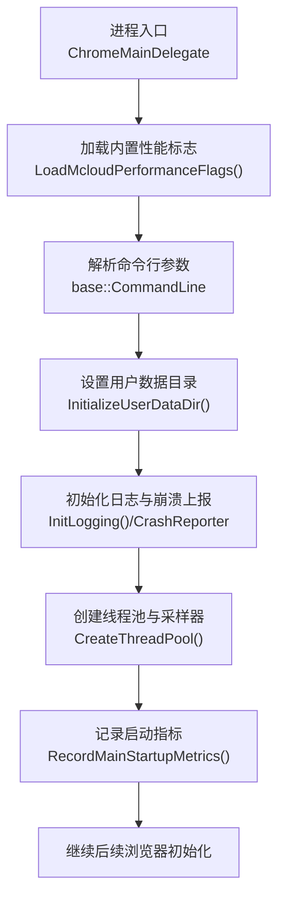
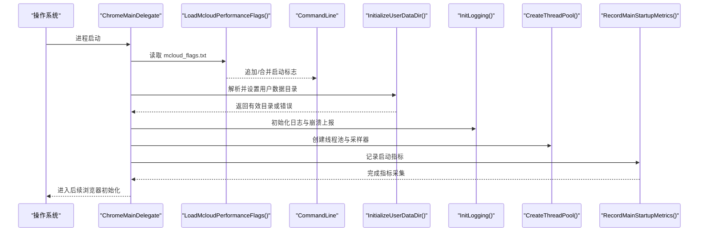
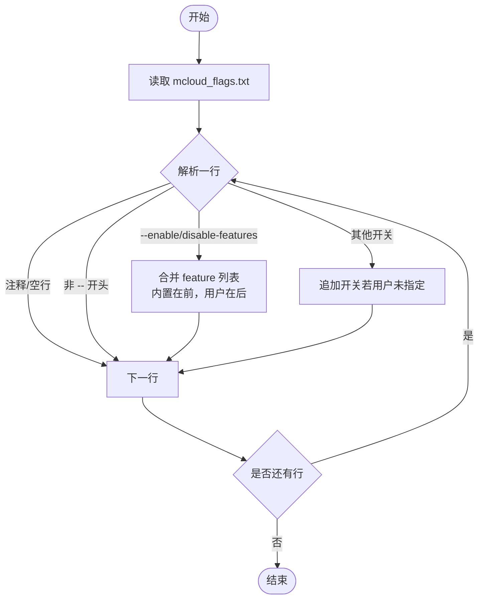
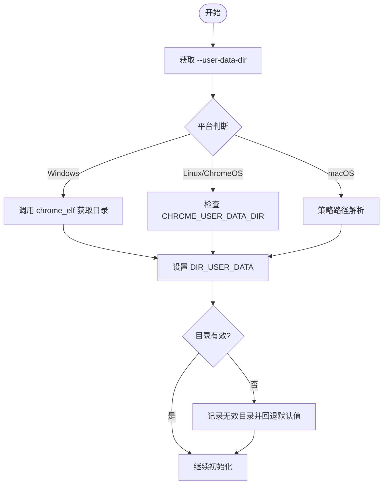
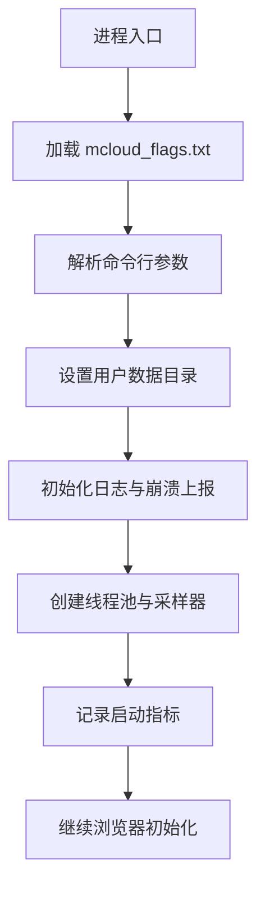
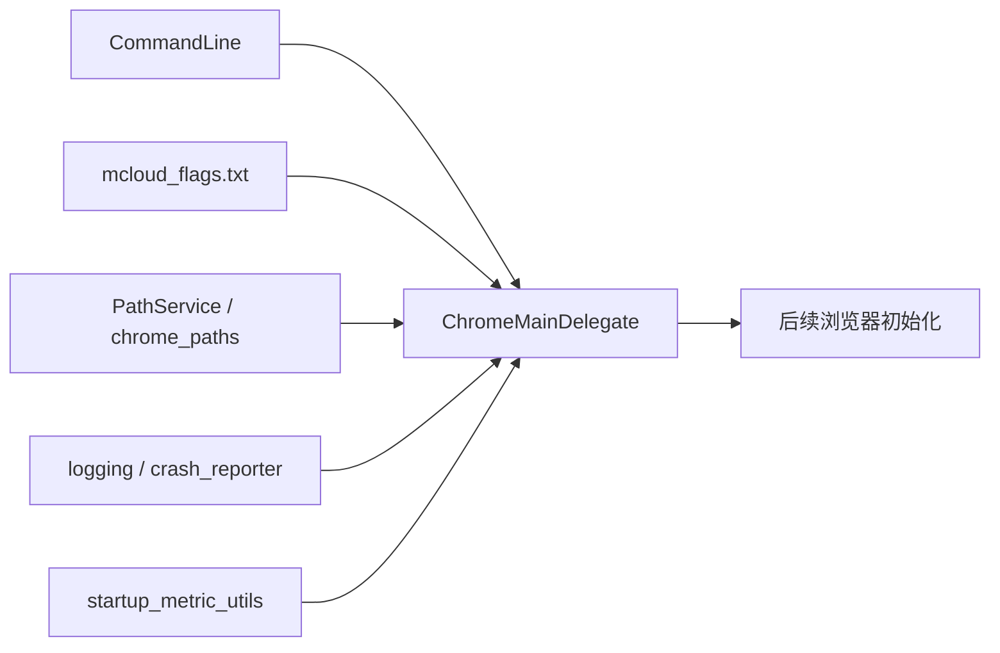

# 启动流程

<cite>
**本文引用的文件**
- [chrome_main_delegate.cc](file://src/chrome/app/chrome_main_delegate.cc)
- [mcloud_flags.txt](file://mcloud_flags.txt)
- [chrome_paths_linux.cc](file://src/chrome/common/chrome_paths_linux.cc)
- [README.md](file://README.md)
- [M151-benchmark.md](file://docs/dev-logs/M151-benchmark.md)
</cite>

## 目录
1. [简介](#简介)
2. [项目结构](#项目结构)
3. [核心组件](#核心组件)
4. [架构总览](#架构总览)
5. [详细组件分析](#详细组件分析)
6. [依赖关系分析](#依赖关系分析)
7. [性能考量](#性能考量)
8. [故障排除指南](#故障排除指南)
9. [结论](#结论)
10. [附录：启动参数与配置](#附录启动参数与配置)

## 简介
本文件面向 MCloud Browser（基于 Chromium）的启动流程，从程序入口到浏览器完全就绪的关键阶段进行系统化说明。重点覆盖：
- ChromeMainDelegate 初始化阶段、命令行参数解析、用户数据目录设置、日志系统初始化
- MCloud 特有的性能优化启动流程：mcloud_flags.txt 的加载与合并机制
- 不同平台（Windows、Linux、macOS）的启动差异与平台特定初始化逻辑
- 启动过程中的性能监控与指标收集机制
- 启动流程图与时间线分析，帮助定位瓶颈与优化点
- 启动参数配置指南与常见问题排查方法

## 项目结构
围绕启动流程的核心代码集中在 chrome/app 下的委托实现与路径/平台相关逻辑中；MCloud 的性能标志通过可执行文件同目录的 mcloud_flags.txt 注入。

图表来源
- [chrome_main_delegate.cc:239-296](file://src/chrome/app/chrome_main_delegate.cc#L239-L296)
- [chrome_main_delegate.cc:589-675](file://src/chrome/app/chrome_main_delegate.cc#L589-L675)
- [chrome_main_delegate.cc:677-703](file://src/chrome/app/chrome_main_delegate.cc#L677-L703)
- [chrome_main_delegate.cc:969-987](file://src/chrome/app/chrome_main_delegate.cc#L969-L987)
- [chrome_main_delegate.cc:705-736](file://src/chrome/app/chrome_main_delegate.cc#L705-L736)

章节来源
- [chrome_main_delegate.cc:239-296](file://src/chrome/app/chrome_main_delegate.cc#L239-L296)
- [chrome_main_delegate.cc:589-675](file://src/chrome/app/chrome_main_delegate.cc#L589-L675)
- [chrome_main_delegate.cc:677-703](file://src/chrome/app/chrome_main_delegate.cc#L677-L703)
- [chrome_main_delegate.cc:969-987](file://src/chrome/app/chrome_main_delegate.cc#L969-L987)
- [chrome_main_delegate.cc:705-736](file://src/chrome/app/chrome_main_delegate.cc#L705-L736)

## 核心组件
- ChromeMainDelegate：负责浏览器进程的早期初始化、平台相关处理、资源与日志初始化、指标记录等。
- 内置性能标志加载器：在进程早期读取 mcloud_flags.txt，将其中每行一个的启动标志注入当前进程命令行，并遵循“用户命令行优先”的合并策略。
- 用户数据目录管理：根据平台与命令行/环境变量确定用户数据目录，确保后续子进程与服务进程使用一致的路径。
- 日志与崩溃上报：初始化日志输出、版本信息记录、Crashpad 初始化与异常处理器设置。
- 线程池与采样器：创建线程池、设置线程组与主线程采样器，为后续性能剖析提供基础。
- 启动指标：记录应用启动时间、进程创建时间、ChromeMain 入口时间等关键指标。

章节来源
- [chrome_main_delegate.cc:239-296](file://src/chrome/app/chrome_main_delegate.cc#L239-L296)
- [chrome_main_delegate.cc:589-675](file://src/chrome/app/chrome_main_delegate.cc#L589-L675)
- [chrome_main_delegate.cc:677-703](file://src/chrome/app/chrome_main_delegate.cc#L677-L703)
- [chrome_main_delegate.cc:969-987](file://src/chrome/app/chrome_main_delegate.cc#L969-L987)
- [chrome_main_delegate.cc:705-736](file://src/chrome/app/chrome_main_delegate.cc#L705-L736)

## 架构总览
下图展示了从进程入口到浏览器就绪的关键阶段与交互关系。

图表来源
- [chrome_main_delegate.cc:239-296](file://src/chrome/app/chrome_main_delegate.cc#L239-L296)
- [chrome_main_delegate.cc:589-675](file://src/chrome/app/chrome_main_delegate.cc#L589-L675)
- [chrome_main_delegate.cc:677-703](file://src/chrome/app/chrome_main_delegate.cc#L677-L703)
- [chrome_main_delegate.cc:969-987](file://src/chrome/app/chrome_main_delegate.cc#L969-L987)
- [chrome_main_delegate.cc:705-736](file://src/chrome/app/chrome_main_delegate.cc#L705-L736)

## 详细组件分析

### ChromeMainDelegate 初始化阶段
- 构造时即记录启动指标，用于后续冷启动与热启动分析。
- 提供 PostEarlyInitialization 钩子，在非浏览器进程中执行通用早期初始化。
- 提供 CommonEarlyInitialization，包含平台特定的优先级调整、缓存策略等。
- 提供 CreateThreadPool，设置线程组与主线程采样器，尽早开始采样。

章节来源
- [chrome_main_delegate.cc:781-787](file://src/chrome/app/chrome_main_delegate.cc#L781-L787)
- [chrome_main_delegate.cc:802-817](file://src/chrome/app/chrome_main_delegate.cc#L802-L817)
- [chrome_main_delegate.cc:969-987](file://src/chrome/app/chrome_main_delegate.cc#L969-L987)

### 命令行参数解析与内置标志注入
- LoadMcloudPerformanceFlags 在进程早期读取可执行文件同目录的 mcloud_flags.txt，逐行解析并注入命令行。
- 对 --enable-features 与 --disable-features 采用合并策略：内置项在前，用户项在后，同名带参条目以用户为准。
- 对其他开关，若用户命令行已存在则跳过，避免覆盖用户意图。

图表来源
- [chrome_main_delegate.cc:239-296](file://src/chrome/app/chrome_main_delegate.cc#L239-L296)

章节来源
- [chrome_main_delegate.cc:239-296](file://src/chrome/app/chrome_main_delegate.cc#L239-L296)
- [mcloud_flags.txt:1-120](file://mcloud_flags.txt#L1-L120)

### 用户数据目录设置
- Windows：通过 chrome_elf 获取真实用户数据目录，必要时写入无效目录提示，并强制设置路径服务。
- Linux/ChromeOS：支持通过环境变量 CHROME_USER_DATA_DIR 指定用户数据目录；同时尊重 XDG 配置目录规范。
- macOS：通过策略路径解析检查用户数据目录策略。
- 统一调用 PathService 设置 DIR_USER_DATA，并在失败时记录无效目录以便后续提示。

图表来源
- [chrome_main_delegate.cc:589-675](file://src/chrome/app/chrome_main_delegate.cc#L589-L675)
- [chrome_paths_linux.cc:81-101](file://src/chrome/common/chrome_paths_linux.cc#L81-L101)

章节来源
- [chrome_main_delegate.cc:589-675](file://src/chrome/app/chrome_main_delegate.cc#L589-L675)
- [chrome_paths_linux.cc:81-101](file://src/chrome/common/chrome_paths_linux.cc#L81-L101)

### 日志系统与崩溃上报初始化
- InitLogging：根据进程类型决定旧日志处理方式，初始化 Chrome 日志系统，并记录产品与版本信息。
- CrashReporter/Crashpad：在具备用户数据目录后初始化崩溃上报，设置首次机会异常处理器，并从命令行同步崩溃键。

章节来源
- [chrome_main_delegate.cc:677-703](file://src/chrome/app/chrome_main_delegate.cc#L677-L703)
- [chrome_main_delegate.cc:1632-1652](file://src/chrome/app/chrome_main_delegate.cc#L1632-L1652)

### 平台特定初始化逻辑
- Windows：
  - 可选禁用优先级提升（按特性开关）。
  - 资源耗尽时的弹窗或无头模式日志处理。
  - 通过 chrome_elf 获取用户数据目录。
- Linux/ChromeOS：
  - OOM 分数调整（根据进程类型）。
  - 支持 CHROME_USER_DATA_DIR 环境变量。
  - 帮助页面与 man 命令集成。
- macOS：
  - 策略路径解析与安装器偏好设置。
  - 缓存通道信息与本地化资源。

章节来源
- [chrome_main_delegate.cc:989-1005](file://src/chrome/app/chrome_main_delegate.cc#L989-L1005)
- [chrome_main_delegate.cc:330-357](file://src/chrome/app/chrome_main_delegate.cc#L330-L357)
- [chrome_main_delegate.cc:1358-1369](file://src/chrome/app/chrome_main_delegate.cc#L1358-L1369)
- [chrome_paths_linux.cc:81-101](file://src/chrome/common/chrome_paths_linux.cc#L81-L101)

### 性能监控与指标收集
- 记录应用启动时间、进程创建时间、ChromeMain 入口时间等关键指标，便于冷启动分析与回归检测。
- 线程池与主线程采样器尽早创建，配合采样器客户端进行堆栈采样，辅助定位启动瓶颈。

章节来源
- [chrome_main_delegate.cc:705-736](file://src/chrome/app/chrome_main_delegate.cc#L705-L736)
- [chrome_main_delegate.cc:969-987](file://src/chrome/app/chrome_main_delegate.cc#L969-L987)

### 启动流程图与时间线分析
- 关键阶段顺序：加载内置标志 → 解析命令行 → 设置用户数据目录 → 初始化日志与崩溃上报 → 创建线程池与采样器 → 记录启动指标 → 继续浏览器初始化。
- 时间线建议：
  - 冷启动：关注应用启动时间与进程创建时间，结合采样器分析主线程热点。
  - 热启动：关注 FeatureList 与资源加载耗时，评估 mcloud_flags.txt 的影响。

图表来源
- [chrome_main_delegate.cc:239-296](file://src/chrome/app/chrome_main_delegate.cc#L239-L296)
- [chrome_main_delegate.cc:589-675](file://src/chrome/app/chrome_main_delegate.cc#L589-L675)
- [chrome_main_delegate.cc:677-703](file://src/chrome/app/chrome_main_delegate.cc#L677-L703)
- [chrome_main_delegate.cc:969-987](file://src/chrome/app/chrome_main_delegate.cc#L969-L987)
- [chrome_main_delegate.cc:705-736](file://src/chrome/app/chrome_main_delegate.cc#L705-L736)

## 依赖关系分析
- ChromeMainDelegate 依赖 base::CommandLine、base::PathService、logging、crash_reporter、content 与 metrics 等模块。
- mcloud_flags.txt 作为外部配置文件，被 LoadMcloudPerformanceFlags 在进程早期读取，影响后续所有阶段的开关与特性。
- 平台相关路径与策略通过 chrome_paths_* 与 policy 模块协调，保证跨平台一致性。

图表来源
- [chrome_main_delegate.cc:239-296](file://src/chrome/app/chrome_main_delegate.cc#L239-L296)
- [chrome_main_delegate.cc:589-675](file://src/chrome/app/chrome_main_delegate.cc#L589-L675)
- [chrome_main_delegate.cc:677-703](file://src/chrome/app/chrome_main_delegate.cc#L677-L703)
- [chrome_main_delegate.cc:705-736](file://src/chrome/app/chrome_main_delegate.cc#L705-L736)

章节来源
- [chrome_main_delegate.cc:239-296](file://src/chrome/app/chrome_main_delegate.cc#L239-L296)
- [chrome_main_delegate.cc:589-675](file://src/chrome/app/chrome_main_delegate.cc#L589-L675)
- [chrome_main_delegate.cc:677-703](file://src/chrome/app/chrome_main_delegate.cc#L677-L703)
- [chrome_main_delegate.cc:705-736](file://src/chrome/app/chrome_main_delegate.cc#L705-L736)

## 性能考量
- 内置性能标志：mcloud_flags.txt 提供大量针对冷启动、渲染、内存、网络、媒体、GPU、线程、存储等的优化开关，建议在构建时随安装包分发，启动时自动注入。
- 用户命令行优先级：同名开关以用户命令行为准；feature 列表合并时用户项在后，确保用户覆盖能力。
- 指标与采样：利用启动指标与主线程采样器定位瓶颈，结合基准测试验证优化效果。
- 实测参考：基准文档记录了冷启动与内存峰值等 KPI，可作为优化效果的对照依据。

章节来源
- [mcloud_flags.txt:1-120](file://mcloud_flags.txt#L1-L120)
- [README.md:302-351](file://README.md#L302-L351)
- [M151-benchmark.md:1-30](file://docs/dev-logs/M151-benchmark.md#L1-L30)

## 故障排除指南
- 用户数据目录不可用：
  - 检查 --user-data-dir 是否正确，或在 Linux 下设置 CHROME_USER_DATA_DIR。
  - 查看日志中关于无效目录的记录，确认回退默认值是否生效。
- 启动标志未生效：
  - 确认 mcloud_flags.txt 位于可执行文件同目录且格式正确（每行一个开关，注释以 # 开头）。
  - 检查用户命令行是否覆盖了内置开关；feature 列表合并时用户项在后。
- 日志缺失或崩溃上报异常：
  - 确认 InitLogging 与 Crashpad 初始化是否成功，检查进程类型与日志级别。
  - 在调试模式下启用控制台输出（如 Windows 安装器相关补丁中的调试模式）。
- 平台相关问题：
  - Windows：资源耗尽弹窗或无头模式日志；检查优先级提升开关。
  - Linux/ChromeOS：OOM 分数与环境变量；XDG 配置目录是否正确。
  - macOS：策略路径解析与安装器偏好设置。

章节来源
- [chrome_main_delegate.cc:589-675](file://src/chrome/app/chrome_main_delegate.cc#L589-L675)
- [chrome_main_delegate.cc:677-703](file://src/chrome/app/chrome_main_delegate.cc#L677-L703)
- [chrome_main_delegate.cc:1632-1652](file://src/chrome/app/chrome_main_delegate.cc#L1632-L1652)

## 结论
MCloud Browser 的启动流程以 ChromeMainDelegate 为核心，通过早期加载内置性能标志、解析命令行、设置用户数据目录、初始化日志与崩溃上报、创建线程池与采样器、记录启动指标等步骤，确保浏览器快速且稳定地进入可用状态。mcloud_flags.txt 提供了丰富的性能优化开关，并通过合理的合并策略保障用户自定义优先。不同平台的差异化处理保证了跨平台的一致性与可靠性。借助启动指标与采样器，开发者可以持续优化启动性能并定位瓶颈。

## 附录：启动参数与配置
- 内置性能标志位置：可执行文件同目录的 mcloud_flags.txt。
- 注入规则：
  - 普通开关：若用户命令行未指定，则追加；已存在则跳过。
  - feature 列表：--enable-features 与 --disable-features 合并，内置项在前，用户项在后。
- 常用参数示例（来自 README 与 mcloud_flags.txt）：
  - GPU 光栅化：--enable-gpu-rasterization
  - Canvas GPU 加速：--enable-features=CanvasOopRasterization
  - 后台媒体不暂停：--disable-background-media-suspend
  - 标签页冻结：--enable-features=InfiniteTabsFreezing,InfiniteTabsFreezingOnMemoryPressure
  - V8 快速编译：--js-flags="--invocation_count_for_maglev=200 --invocation_count_for_turbofan=1500 --osr-from-maglev --sparkplug-plus"
- 用户数据目录：
  - Windows：通过 chrome_elf 获取，必要时写入无效目录提示。
  - Linux/ChromeOS：可通过 CHROME_USER_DATA_DIR 或 --user-data-dir 指定。
  - macOS：受策略路径解析控制。
- 日志与崩溃上报：
  - 初始化日志系统，记录产品与版本信息。
  - 初始化 Crashpad，设置首次机会异常处理器。

章节来源
- [README.md:302-351](file://README.md#L302-L351)
- [mcloud_flags.txt:1-120](file://mcloud_flags.txt#L1-L120)
- [chrome_main_delegate.cc:589-675](file://src/chrome/app/chrome_main_delegate.cc#L589-L675)
- [chrome_main_delegate.cc:677-703](file://src/chrome/app/chrome_main_delegate.cc#L677-L703)
- [chrome_paths_linux.cc:81-101](file://src/chrome/common/chrome_paths_linux.cc#L81-L101)