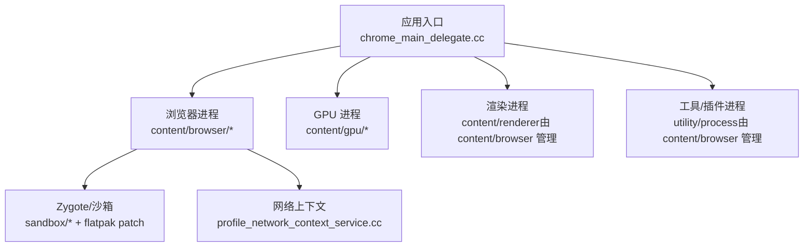
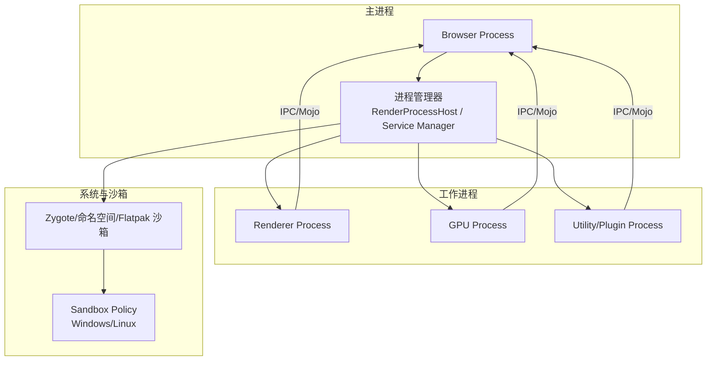
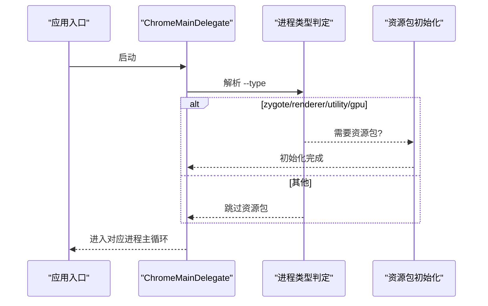
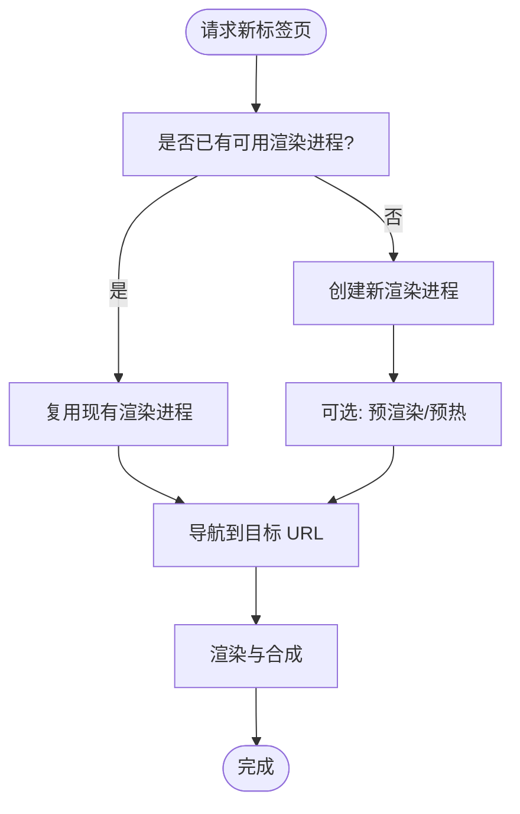
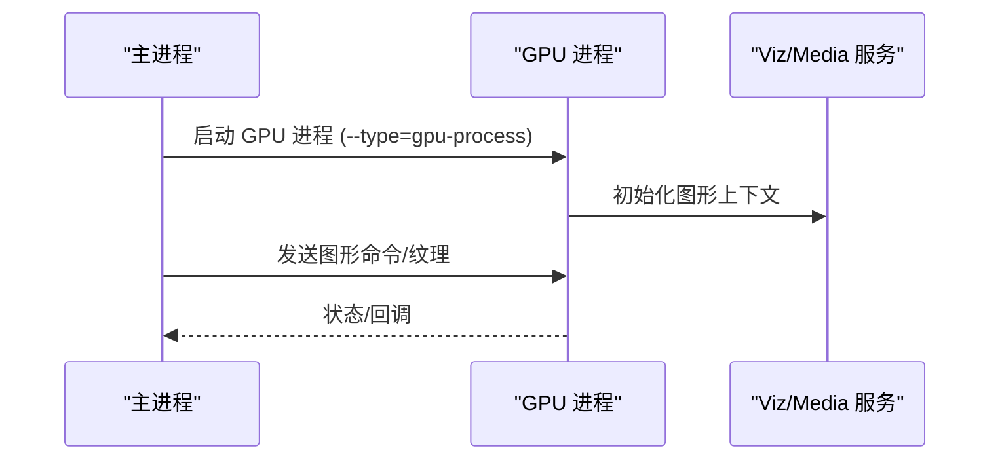
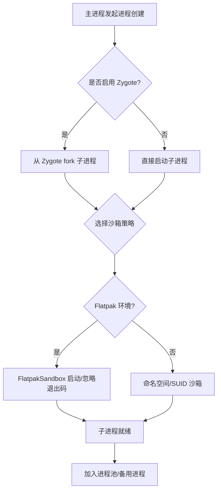
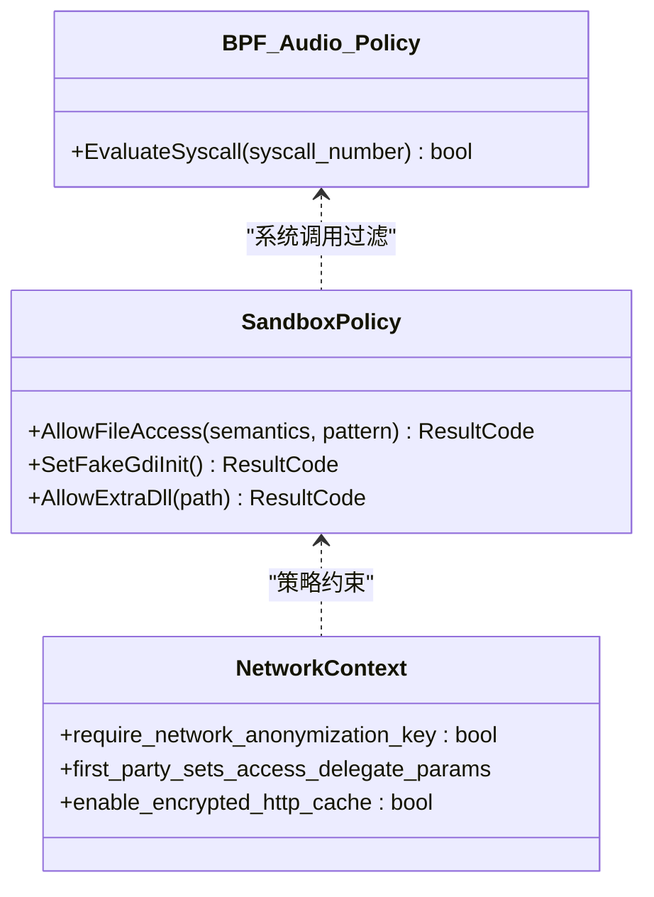
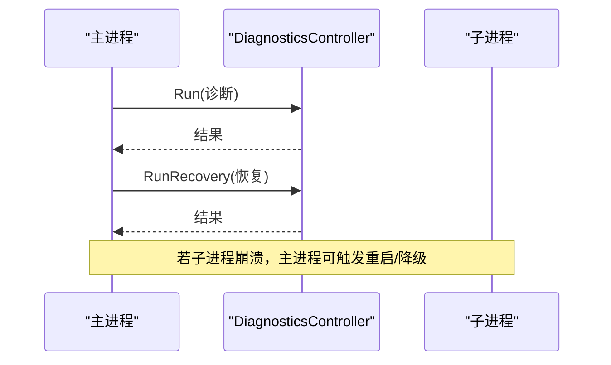
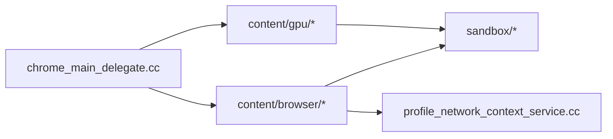

# 多进程模型

<cite>
**本文引用的文件**
- [README.md](file://README.md)
- [chrome_main_delegate.cc](file://src/chrome/app/chrome_main_delegate.cc)
- [BUILD.gn (content/browser)](file://src/content/browser/BUILD.gn)
- [BUILD.gn (content/gpu)](file://src/content/gpu/BUILD.gn)
- [CMDLINE_FLAGS_LIST.md (docs)](file://docs/CMDLINE_FLAGS_LIST.md)
- [CMDLINE_FLAGS_LIST.md (infra)](file://infra/CMDLINE_FLAGS_LIST.md)
- [DEBUGGING.md](file://infra/DEBUG/DEBUGGING.md)
- [flatpak-Add-initial-sandbox-support.patch](file://infra/Flatpak/com.mcloud.browser/patches/chromium/flatpak-Add-initial-sandbox-support.patch)
- [sbox_policy_base.cc](file://src/sandbox/win/src/sandbox_policy_base.cc)
- [bpf_audio_policy_linux.cc](file://src/sandbox/policy/linux/bpf_audio_policy_linux.cc)
- [profile_network_context_service.cc](file://src/chrome/browser/net/profile_network_context_service.cc)
</cite>

## 目录
1. [简介](#简介)
2. [项目结构](#项目结构)
3. [核心组件](#核心组件)
4. [架构总览](#架构总览)
5. [详细组件分析](#详细组件分析)
6. [依赖关系分析](#依赖关系分析)
7. [性能考量](#性能考量)
8. [故障排查指南](#故障排查指南)
9. [结论](#结论)

## 简介
本文件面向 MCloud Browser（基于 Chromium M151）的多进程模型，系统性阐述主进程、渲染进程、GPU 进程、插件/工具进程的职责与生命周期管理；解释进程间隔离机制（内存、文件系统、网络权限等）；描述进程创建与销毁流程（含 Zygote 预加载、进程池管理与资源回收）；说明关键命令行参数（如 --type=renderer、--type=gpu-process）的作用；并提供架构图与数据流图，以及崩溃恢复与错误处理策略。

## 项目结构
MCloud Browser 在仓库中保留了 Chromium 的核心源码树（src/），并在顶层提供构建脚本、文档与平台适配补丁。与多进程模型直接相关的代码主要分布在：
- src/chrome/app/chrome_main_delegate.cc：进程类型分发、子进程资源初始化、诊断与恢复入口
- src/content/browser/BUILD.gn：浏览器端内容层模块组织（包含渲染主机、预加载、调度器等）
- src/content/gpu/BUILD.gn：GPU 进程的构建与依赖
- docs/CMDLINE_FLAGS_LIST.md 与 infra/CMDLINE_FLAGS_LIST.md：运行时开关与命令行参数清单
- infra/DEBUG/DEBUGGING.md：调试与进程查看方法
- infra/Flatpak/.../flatpak-Add-initial-sandbox-support.patch：Linux Flatpak 沙箱与 Zygote 启动路径适配
- src/sandbox/win/src/sandbox_policy_base.cc：Windows 沙箱策略基础
- src/sandbox/policy/linux/bpf_audio_policy_linux.cc：Linux BPF 沙箱系统调用过滤
- src/chrome/browser/net/profile_network_context_service.cc：网络上下文与站点隔离、隐私沙箱相关配置

图表来源
- [chrome_main_delegate.cc:348-374](file://src/chrome/app/chrome_main_delegate.cc#L348-L374)
- [BUILD.gn (content/browser):1650-1700](file://src/content/browser/BUILD.gn#L1650-L1700)
- [BUILD.gn (content/gpu):43-87](file://src/content/gpu/BUILD.gn#L43-L87)

章节来源
- [README.md:1-408](file://README.md#L1-L408)
- [chrome_main_delegate.cc:348-374](file://src/chrome/app/chrome_main_delegate.cc#L348-L374)
- [BUILD.gn (content/browser):1650-1700](file://src/content/browser/BUILD.gn#L1650-L1700)
- [BUILD.gn (content/gpu):43-87](file://src/content/gpu/BUILD.gn#L43-L87)

## 核心组件
- 主进程（Browser Process）
  - 负责应用生命周期、窗口管理、进程调度、安全策略、网络上下文与用户交互。
  - 通过 chrome_main_delegate.cc 进行进程类型判断与初始化，并决定是否需要加载资源包（ResourceBundle）。
- 渲染进程（Renderer Process）
  - 每个站点或分组可独立进程，执行网页 JS、DOM、布局与合成。
  - 由 content/browser 的渲染主机（RenderProcessHost）管理创建、复用与回收。
- GPU 进程（GPU Process）
  - 承载图形命令缓冲、合成与硬件加速解码，降低主进程风险面。
  - 通过 content/gpu 模块构建，依赖 viz/media/gpu 等服务。
- 工具/插件进程（Utility/Plugin Process）
  - 用于下载、PDF、扩展等受限任务，具备严格沙箱限制。

章节来源
- [chrome_main_delegate.cc:348-374](file://src/chrome/app/chrome_main_delegate.cc#L348-L374)
- [BUILD.gn (content/browser):1650-1700](file://src/content/browser/BUILD.gn#L1650-L1700)
- [BUILD.gn (content/gpu):43-87](file://src/content/gpu/BUILD.gn#L43-L87)

## 架构总览
Chromium/MCloud 采用“多进程+沙箱”的架构：
- 主进程作为协调者，按需要启动/复用渲染、GPU、工具进程。
- 渲染进程运行不受信任的网页代码，受沙箱限制。
- GPU 进程隔离图形栈，减少主进程攻击面。
- 工具进程承担高风险操作（下载、PDF 等）。

图表来源
- [chrome_main_delegate.cc:348-374](file://src/chrome/app/chrome_main_delegate.cc#L348-L374)
- [BUILD.gn (content/browser):1650-1700](file://src/content/browser/BUILD.gn#L1650-L1700)
- [BUILD.gn (content/gpu):43-87](file://src/content/gpu/BUILD.gn#L43-L87)
- [flatpak-Add-initial-sandbox-support.patch:197-261](file://infra/Flatpak/com.mcloud.browser/patches/chromium/flatpak-Add-initial-sandbox-support.patch#L197-L261)
- [sbox_policy_base.cc:246-282](file://src/sandbox/win/src/sandbox_policy_base.cc#L246-L282)
- [bpf_audio_policy_linux.cc:128-145](file://src/sandbox/policy/linux/bpf_audio_policy_linux.cc#L128-L145)

## 详细组件分析

### 进程类型与生命周期管理
- 进程类型识别与资源初始化
  - chrome_main_delegate.cc 根据 --type 判断进程角色，并对特定子进程（如 zygote、renderer、utility、gpu）决定是否加载资源包。
  - 对 Linux/ChromeOS 的 zygote 进程会特殊处理语言与资源路径。
- 资源包与国际化
  - 子进程可能通过全局描述符传递 .pak 文件区域，避免沙箱内直接访问资源文件。
- OOM 优先级调整
  - 某些平台会在子进程启动后调整 OOM score，以影响内核回收策略。

图表来源
- [chrome_main_delegate.cc:348-374](file://src/chrome/app/chrome_main_delegate.cc#L348-L374)
- [chrome_main_delegate.cc:1418-1443](file://src/chrome/app/chrome_main_delegate.cc#L1418-L1443)

章节来源
- [chrome_main_delegate.cc:348-374](file://src/chrome/app/chrome_main_delegate.cc#L348-L374)
- [chrome_main_delegate.cc:1418-1443](file://src/chrome/app/chrome_main_delegate.cc#L1418-L1443)

### 渲染进程（Renderer Process）
- 职责
  - 执行网页脚本、DOM 树、样式计算、布局与合成；与主进程通过 IPC/Mojo 通信。
- 创建与复用
  - 由 content/browser 中的渲染主机（RenderProcessHost）管理，支持进程池、备用进程（spare renderer）与站点隔离。
- 预加载与预热
  - 构建中包含 prerender/preloading 相关模块，用于页面导航前准备，提升首屏速度。

图表来源
- [BUILD.gn (content/browser):1650-1700](file://src/content/browser/BUILD.gn#L1650-L1700)

章节来源
- [BUILD.gn (content/browser):1650-1700](file://src/content/browser/BUILD.gn#L1650-L1700)

### GPU 进程（GPU Process）
- 职责
  - 管理 GPU 命令缓冲、合成、硬件视频解码；与主进程和渲染进程通过 Mojo/IPC 通信。
- 构建与依赖
  - content/gpu 模块依赖 viz/service、media/gpu、sandbox/policy 等，确保图形栈隔离与安全。
- 启动参数
  - 通过 --gpu-* 系列参数控制行为（如 --gpu-launcher、--gpu-preferences、--gpu-sandbox-start-early 等）。

图表来源
- [BUILD.gn (content/gpu):43-87](file://src/content/gpu/BUILD.gn#L43-L87)
- [CMDLINE_FLAGS_LIST.md (docs):1616-1646](file://docs/CMDLINE_FLAGS_LIST.md#L1616-L1646)

章节来源
- [BUILD.gn (content/gpu):43-87](file://src/content/gpu/BUILD.gn#L43-L87)
- [CMDLINE_FLAGS_LIST.md (docs):1616-1646](file://docs/CMDLINE_FLAGS_LIST.md#L1616-L1646)

### Zygote 预加载与进程池管理
- Zygote 作用
  - 预加载公共库与资源，fork 出轻量级子进程，减少启动开销。
- 平台适配
  - Linux 下支持命名空间沙箱、SUID 沙箱与 Flatpak 沙箱；Flatpak 场景下需忽略退出码与 OOM 分数调整。
- 进程池与资源回收
  - 通过 RenderProcessHost 管理进程池，结合备用渲染进程与站点隔离策略，实现快速复用与最小化重启。

图表来源
- [flatpak-Add-initial-sandbox-support.patch:197-261](file://infra/Flatpak/com.mcloud.browser/patches/chromium/flatpak-Add-initial-sandbox-support.patch#L197-L261)

章节来源
- [flatpak-Add-initial-sandbox-support.patch:197-261](file://infra/Flatpak/com.mcloud.browser/patches/chromium/flatpak-Add-initial-sandbox-support.patch#L197-L261)

### 进程间隔离与安全策略
- 内存隔离
  - 各进程拥有独立地址空间；通过 IPC/Mojo 交换数据，避免共享内存滥用。
- 文件系统访问限制
  - Windows 沙箱策略通过 AllowFileAccess 等接口精确控制文件访问模式与路径规则。
  - Linux BPF 策略对系统调用进行白名单过滤，仅允许必要调用（如音频相关）。
- 网络权限控制
  - 网络上下文按站点隔离，启用匿名化键、第一方集合访问代理、企业缓存加密等策略。
  - 可通过 ContentSetting 控制信任令牌、反滥用策略等。

图表来源
- [sbox_policy_base.cc:246-282](file://src/sandbox/win/src/sandbox_policy_base.cc#L246-L282)
- [bpf_audio_policy_linux.cc:128-145](file://src/sandbox/policy/linux/bpf_audio_policy_linux.cc#L128-L145)
- [profile_network_context_service.cc:1519-1579](file://src/chrome/browser/net/profile_network_context_service.cc#L1519-L1579)

章节来源
- [sbox_policy_base.cc:246-282](file://src/sandbox/win/src/sandbox_policy_base.cc#L246-L282)
- [bpf_audio_policy_linux.cc:128-145](file://src/sandbox/policy/linux/bpf_audio_policy_linux.cc#L128-L145)
- [profile_network_context_service.cc:1519-1579](file://src/chrome/browser/net/profile_network_context_service.cc#L1519-L1579)

### 启动参数与命令行开关
- 关键参数
  - --type=renderer：指定渲染进程类型
  - --type=gpu-process：指定 GPU 进程类型
  - --gpu-*：控制 GPU 行为（如 --gpu-launcher、--gpu-preferences、--gpu-sandbox-start-early 等）
- 作用范围
  - 这些参数在主进程启动时解析，并传递给相应子进程，影响其初始化与运行行为。

章节来源
- [CMDLINE_FLAGS_LIST.md (docs):1616-1646](file://docs/CMDLINE_FLAGS_LIST.md#L1616-L1646)
- [CMDLINE_FLAGS_LIST.md (infra):1616-1646](file://infra/CMDLINE_FLAGS_LIST.md#L1616-L1646)

### 崩溃恢复与错误处理
- 诊断与恢复入口
  - ChromeMainDelegate 集成 DiagnosticsController，支持运行诊断与恢复任务，失败时返回非零退出码。
- 调试与进程查看
  - 使用 pstree 或内置任务管理器查看进程树；默认沙箱进程不可附加调试器，需开启 --allow-sandbox-debugging。
- 恢复策略
  - 针对渲染/GPU/工具进程崩溃，主进程可自动重启或降级功能，保障用户体验。

图表来源
- [chrome_main_delegate.cc:1289-1326](file://src/chrome/app/chrome_main_delegate.cc#L1289-L1326)
- [DEBUGGING.md:123-151](file://infra/DEBUG/DEBUGGING.md#L123-L151)

章节来源
- [chrome_main_delegate.cc:1289-1326](file://src/chrome/app/chrome_main_delegate.cc#L1289-L1326)
- [DEBUGGING.md:123-151](file://infra/DEBUG/DEBUGGING.md#L123-L151)

## 依赖关系分析
- 主进程依赖
  - chrome_main_delegate.cc 负责进程类型分发与资源初始化。
  - content/browser 提供渲染主机、预加载、调度器等能力。
- GPU 进程依赖
  - content/gpu 依赖 viz/service、media/gpu、sandbox/policy 等，确保图形栈隔离。
- 沙箱策略
  - Windows 通过 sandbox_policy_base.cc 定义文件访问与进程缓解策略。
  - Linux 通过 BPF 策略过滤系统调用，增强安全性。
- 网络上下文
  - profile_network_context_service.cc 配置站点隔离、匿名化键、第一方集合访问代理与企业缓存加密。

图表来源
- [chrome_main_delegate.cc:348-374](file://src/chrome/app/chrome_main_delegate.cc#L348-L374)
- [BUILD.gn (content/browser):1650-1700](file://src/content/browser/BUILD.gn#L1650-L1700)
- [BUILD.gn (content/gpu):43-87](file://src/content/gpu/BUILD.gn#L43-L87)
- [profile_network_context_service.cc:1519-1579](file://src/chrome/browser/net/profile_network_context_service.cc#L1519-L1579)

章节来源
- [chrome_main_delegate.cc:348-374](file://src/chrome/app/chrome_main_delegate.cc#L348-L374)
- [BUILD.gn (content/browser):1650-1700](file://src/content/browser/BUILD.gn#L1650-L1700)
- [BUILD.gn (content/gpu):43-87](file://src/content/gpu/BUILD.gn#L43-L87)
- [profile_network_context_service.cc:1519-1579](file://src/chrome/browser/net/profile_network_context_service.cc#L1519-L1579)

## 性能考量
- 启动优化
  - 通过预加载、备用渲染进程、早期 GPU 通道等手段减少冷启动延迟。
- 渲染与合成
  - GPU 光栅化、零拷贝、高帧率请求等特性提升渲染效率。
- 内存与回收
  - 标签页冻结、内存压力下的紧急回收、传输缓存清理等策略降低内存占用。
- 多线程与 IO
  - 专用媒体线程、Mojo 隔离线程、自旋锁优化提升响应性。

[本节为通用指导，不直接分析具体文件]

## 故障排查指南
- 查看进程树
  - 使用 pstree 或内置任务管理器定位主进程与渲染进程 PID。
- 调试限制
  - 默认沙箱进程不可附加调试器，需启用 --allow-sandbox-debugging。
- 诊断与恢复
  - 通过 DiagnosticsController 运行诊断与恢复任务，观察退出码与日志。
- 常见错误
  - GPU 沙箱失败、网络上下文配置错误、站点隔离导致的跨域问题等。

章节来源
- [DEBUGGING.md:123-151](file://infra/DEBUG/DEBUGGING.md#L123-L151)
- [chrome_main_delegate.cc:1289-1326](file://src/chrome/app/chrome_main_delegate.cc#L1289-L1326)

## 结论
MCloud Browser 继承并强化了 Chromium 的多进程架构：主进程协调、渲染进程隔离、GPU 进程加速、工具进程受限执行；配合 Zygote 预加载、进程池管理与严格的沙箱策略，实现了高安全、高性能与高可用的浏览体验。通过合理的启动参数与网络上下文配置，可在不同平台上获得一致的隔离与性能表现。崩溃恢复与诊断机制进一步提升了鲁棒性与可维护性。