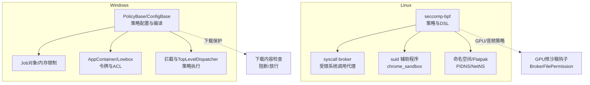
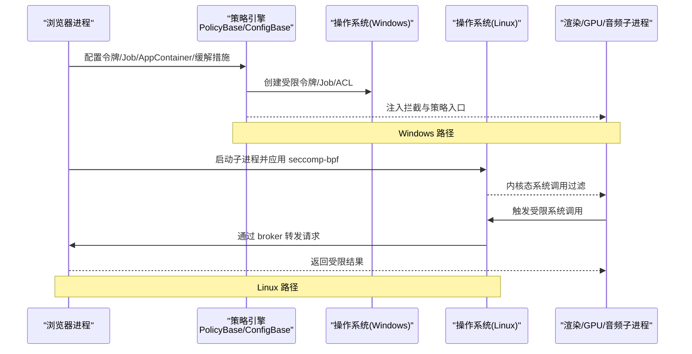
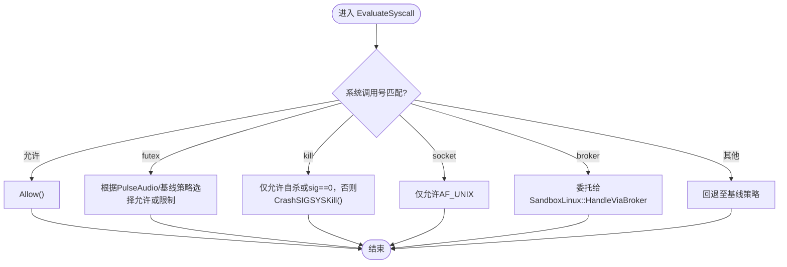
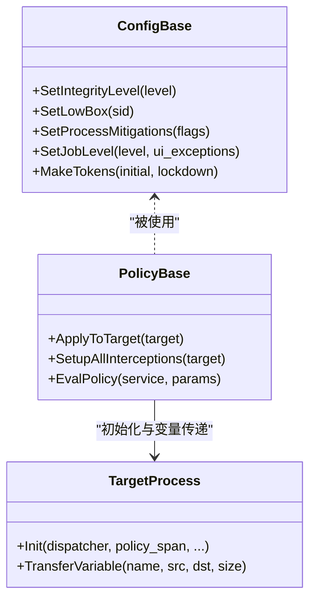
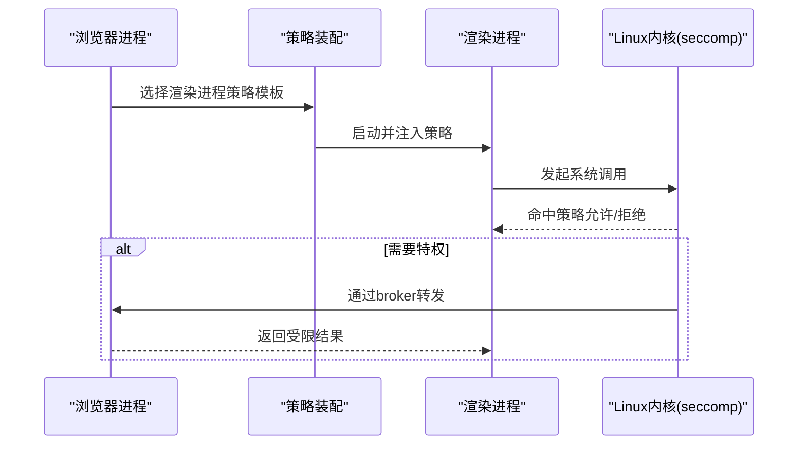
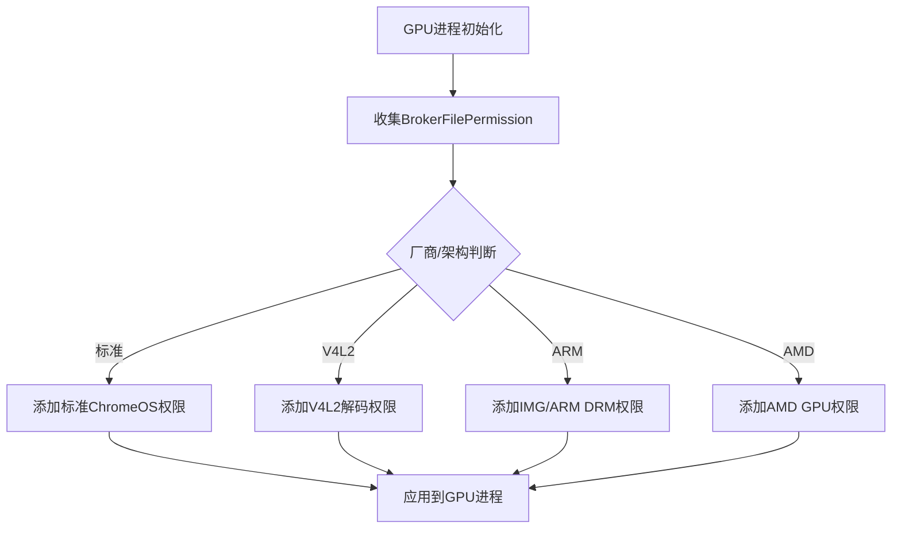
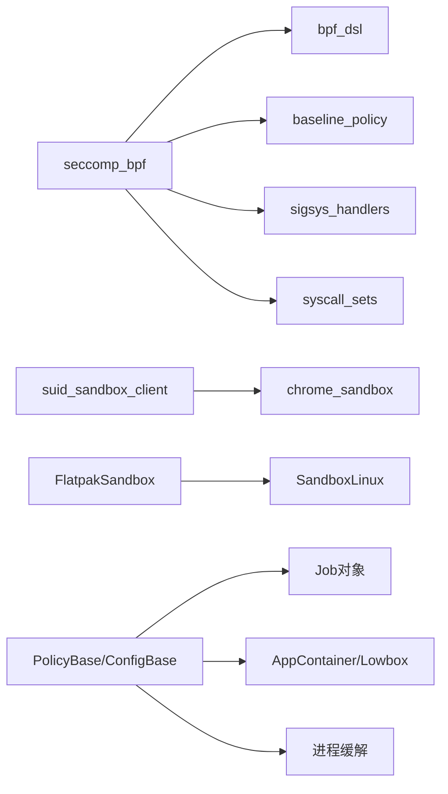

# 安全沙箱

<cite>
**本文引用的文件**
- [src/sandbox/linux/BUILD.gn](file://src/sandbox/linux/BUILD.gn)
- [src/sandbox/policy/linux/bpf_audio_policy_linux.cc](file://src/sandbox/policy/linux/bpf_audio_policy_linux.cc)
- [src/sandbox/win/src/sandbox_policy_base.cc](file://src/sandbox/win/src/sandbox_policy_base.cc)
- [infra/Flatpak/com.mcloud.browser/patches/chromium/flatpak-Add-initial-sandbox-support.patch](file://infra/Flatpak/com.mcloud.browser/patches/chromium/flatpak-Add-initial-sandbox-support.patch)
- [src/content/common/gpu_pre_sandbox_hook_linux.cc](file://src/content/common/gpu_pre_sandbox_hook_linux.cc)
- [docs/CMDLINE_FLAGS_LIST.md](file://docs/CMDLINE_FLAGS_LIST.md)
- [infra/CMDLINE_FLAGS_LIST.md](file://infra/CMDLINE_FLAGS_LIST.md)
</cite>

## 目录
1. [简介](#简介)
2. [项目结构](#项目结构)
3. [核心组件](#核心组件)
4. [架构总览](#架构总览)
5. [详细组件分析](#详细组件分析)
6. [依赖关系分析](#依赖关系分析)
7. [性能考量](#性能考量)
8. [故障排查指南](#故障排查指南)
9. [结论](#结论)
10. [附录](#附录)

## 简介
本文件面向 MCloud Browser 的安全沙箱机制，系统性阐述 Chromium 的沙箱设计理念与最小权限原则、资源隔离策略；分别说明 Windows 平台 NT 沙箱（令牌提升、访问控制列表、设备访问限制）与 Linux 平台 seccomp-bpf 沙箱（系统调用过滤、命名空间隔离）的实现要点；并给出渲染进程沙箱配置与自定义规则、绕过检测与防护、漏洞防护策略及应急响应流程。文档以仓库内实际源码为依据，提供可追溯的章节来源与图示来源。

## 项目结构
MCloud Browser 基于 Chromium 构建，沙箱相关代码主要分布在 sandbox 子树与平台适配层：
- Linux 侧：seccomp-bpf 策略、bpf_dsl DSL、syscall broker、suid 辅助程序、Flatpak 集成等
- Windows 侧：PolicyBase/ConfigBase、Job 对象、AppContainer/Lowbox、拦截与策略分发器
- GPU/音频等特定进程的细粒度策略与文件/设备白名单
- 命令行开关用于调试或降级沙箱能力（仅测试用途）

**图示来源**
- [src/sandbox/linux/BUILD.gn:211-265](file://src/sandbox/linux/BUILD.gn#L211-L265)
- [src/sandbox/win/src/sandbox_policy_base.cc:577-707](file://src/sandbox/win/src/sandbox_policy_base.cc#L577-L707)
- [src/content/common/gpu_pre_sandbox_hook_linux.cc:617-652](file://src/content/common/gpu_pre_sandbox_hook_linux.cc#L617-L652)

**章节来源**
- [src/sandbox/linux/BUILD.gn:1-200](file://src/sandbox/linux/BUILD.gn#L1-L200)
- [src/sandbox/win/src/sandbox_policy_base.cc:1-200](file://src/sandbox/win/src/sandbox_policy_base.cc#L1-L200)

## 核心组件
- Linux seccomp-bpf 沙箱
  - bpf_dsl 与 baseline 策略：通过 DSL 声明允许的系统调用集合与参数约束，编译为 eBPF 程序在内核态执行
  - syscall broker：将危险系统调用重定向到特权进程执行，实现最小化暴露面
  - suid 辅助程序 chrome_sandbox：以 setuid 方式启动受限进程
  - Flatpak 集成：识别容器级沙箱级别，自动启用 PID/Net 命名空间
- Windows NT 沙箱
  - PolicyBase/ConfigBase：定义目标进程令牌、完整性级别、Job 对象、AppContainer/Lowbox、进程缓解措施
  - TopLevelDispatcher/拦截：对目标进程进行 API 拦截，按策略放行或拒绝
  - 令牌与 ACL：创建受限主令牌与模拟令牌，必要时调整 DACL
- 特定进程策略
  - 音频进程：严格限制 socket/futex/kill 等系统调用，结合 broker 与基线策略
  - GPU 进程：通过 BrokerFilePermission 精确授予只读配置文件与驱动接口访问

**章节来源**
- [src/sandbox/linux/BUILD.gn:211-309](file://src/sandbox/linux/BUILD.gn#L211-L309)
- [src/sandbox/policy/linux/bpf_audio_policy_linux.cc:34-141](file://src/sandbox/policy/linux/bpf_audio_policy_linux.cc#L34-L141)
- [src/sandbox/win/src/sandbox_policy_base.cc:577-707](file://src/sandbox/win/src/sandbox_policy_base.cc#L577-L707)
- [src/content/common/gpu_pre_sandbox_hook_linux.cc:617-652](file://src/content/common/gpu_pre_sandbox_hook_linux.cc#L617-L652)

## 架构总览
下图展示 MCloud Browser 在 Linux 与 Windows 上的沙箱关键交互路径：浏览器进程负责策略装配与进程生命周期管理；子进程在受控环境中运行，所有敏感操作均经策略裁决或 broker 代理。

**图示来源**
- [src/sandbox/win/src/sandbox_policy_base.cc:635-707](file://src/sandbox/win/src/sandbox_policy_base.cc#L635-L707)
- [src/sandbox/linux/BUILD.gn:211-265](file://src/sandbox/linux/BUILD.gn#L211-L265)

## 详细组件分析

### Linux seccomp-bpf 与 syscall broker
- 策略编译与执行
  - bpf_dsl 提供 Allow/If/Switch/Trap 等 DSL 构造，生成 eBPF 程序在内核中执行，默认拒绝未显式允许的系统调用
  - baseline 策略提供通用允许集，特定进程（如音频/GPU）在此基础上收紧
- 系统调用代理
  - 当检测到需要特权的系统调用时，交由 syscall broker 处理，避免在子进程中直接执行高危操作
- suid 辅助程序
  - chrome_sandbox 以 setuid 方式运行，确保子进程获得最小权限环境
- Flatpak 集成
  - 检测 Flatpak 沙箱级别，自动启用 PID/Net 命名空间，增强隔离

**图示来源**
- [src/sandbox/policy/linux/bpf_audio_policy_linux.cc:34-141](file://src/sandbox/policy/linux/bpf_audio_policy_linux.cc#L34-L141)

**章节来源**
- [src/sandbox/linux/BUILD.gn:211-309](file://src/sandbox/linux/BUILD.gn#L211-L309)
- [src/sandbox/policy/linux/bpf_audio_policy_linux.cc:34-141](file://src/sandbox/policy/linux/bpf_audio_policy_linux.cc#L34-L141)
- [infra/Flatpak/com.mcloud.browser/patches/chromium/flatpak-Add-initial-sandbox-support.patch:1214-1279](file://infra/Flatpak/com.mcloud.browser/patches/chromium/flatpak-Add-initial-sandbox-support.patch#L1214-L1279)

### Windows NT 沙箱（令牌、ACL、Job、缓解）
- 令牌与完整性级别
  - 创建受限主令牌与模拟令牌，支持 AppContainer/Lowbox，必要时修改 DACL
- Job 对象与内存限制
  - 使用 Job 对象限制子进程数量与内存，防止资源滥用
- 进程缓解与拦截
  - 应用 ASLR/SEHOP/分支预测等缓解措施，设置拦截与策略分发器
- 策略评估
  - 通过 PolicyProcessor 对 IPC 参数进行评估，匹配则执行动作，否则拒绝

**图示来源**
- [src/sandbox/win/src/sandbox_policy_base.cc:577-707](file://src/sandbox/win/src/sandbox_policy_base.cc#L577-L707)

**章节来源**
- [src/sandbox/win/src/sandbox_policy_base.cc:577-707](file://src/sandbox/win/src/sandbox_policy_base.cc#L577-L707)

### 渲染进程沙箱配置与自定义规则
- 渲染进程通常继承基线 seccomp-bpf 策略，并通过 bpf_dsl 扩展特定系统调用与参数限制
- GPU/音频等专用进程采用更严格的白名单策略，必要时通过 broker 访问必要资源
- 可通过构建选项与补丁组合启用/禁用特定子系统（如 Flatpak 命名空间）

**图示来源**
- [src/sandbox/linux/BUILD.gn:211-265](file://src/sandbox/linux/BUILD.gn#L211-L265)
- [src/sandbox/policy/linux/bpf_audio_policy_linux.cc:34-141](file://src/sandbox/policy/linux/bpf_audio_policy_linux.cc#L34-L141)

**章节来源**
- [src/sandbox/linux/BUILD.gn:211-265](file://src/sandbox/linux/BUILD.gn#L211-L265)
- [src/sandbox/policy/linux/bpf_audio_policy_linux.cc:34-141](file://src/sandbox/policy/linux/bpf_audio_policy_linux.cc#L34-L141)

### GPU 进程的文件与设备访问
- 通过 BrokerFilePermission 精确授予只读配置文件（如 /etc/drirc）与 Vulkan/DRM/V4L2 等接口
- 不同厂商与架构（AMD/Intel/NVIDIA/ARM）按需添加权限集合

**图示来源**
- [src/content/common/gpu_pre_sandbox_hook_linux.cc:617-652](file://src/content/common/gpu_pre_sandbox_hook_linux.cc#L617-L652)

**章节来源**
- [src/content/common/gpu_pre_sandbox_hook_linux.cc:617-652](file://src/content/common/gpu_pre_sandbox_hook_linux.cc#L617-L652)

## 依赖关系分析
- Linux 构建目标
  - seccomp_bpf 组件依赖 bpf_dsl、baseline_policy、sigsys_handlers、syscall_sets 等
  - suid_sandbox_client 与 chrome_sandbox 提供 setuid 辅助能力
  - Flatpak 补丁引入 FlatpakSandbox 服务，并在 SandboxLinux 中检测沙箱级别
- Windows 构建与运行时
  - PolicyBase/ConfigBase 依赖 Job、AppContainer、Process Mitigations、拦截与策略处理器
  - 通过 TransferVariable 将缓解标志与完整性级别传递给目标进程

**图示来源**
- [src/sandbox/linux/BUILD.gn:211-309](file://src/sandbox/linux/BUILD.gn#L211-L309)
- [infra/Flatpak/com.mcloud.browser/patches/chromium/flatpak-Add-initial-sandbox-support.patch:1214-1279](file://infra/Flatpak/com.mcloud.browser/patches/chromium/flatpak-Add-initial-sandbox-support.patch#L1214-L1279)
- [src/sandbox/win/src/sandbox_policy_base.cc:577-707](file://src/sandbox/win/src/sandbox_policy_base.cc#L577-L707)

**章节来源**
- [src/sandbox/linux/BUILD.gn:211-309](file://src/sandbox/linux/BUILD.gn#L211-L309)
- [infra/Flatpak/com.mcloud.browser/patches/chromium/flatpak-Add-initial-sandbox-support.patch:1214-1279](file://infra/Flatpak/com.mcloud.browser/patches/chromium/flatpak-Add-initial-sandbox-support.patch#L1214-L1279)
- [src/sandbox/win/src/sandbox_policy_base.cc:577-707](file://src/sandbox/win/src/sandbox_policy_base.cc#L577-L707)

## 性能考量
- seccomp-bpf 在用户态 DSL 编译为内核态 eBPF，减少上下文切换开销；合理裁剪允许集可降低策略复杂度
- syscall broker 仅在必要时介入，避免频繁跨进程通信
- Windows 上 Job 对象限制进程数与内存，防止恶意页面耗尽资源
- GPU/音频策略尽量使用只读与最小设备访问，降低 I/O 与驱动交互成本

[本节为通用指导，不直接分析具体文件]

## 故障排查指南
- 常见沙箱问题定位
  - 系统调用被拒绝：检查对应进程的 seccomp-bpf 策略是否包含该调用，必要时通过 broker 授权
  - GPU 功能异常：确认 BrokerFilePermission 是否正确授予所需驱动接口与配置文件
  - Windows 子进程崩溃：检查 Job 限制、AppContainer/Lowbox 令牌与缓解措施是否兼容
- 调试开关（仅测试用途）
  - --allow-sandbox-debugging：允许调试沙箱进程
  - --no-sandbox / --no-sandbox-and-elevated：关闭沙箱或启用高权限（生产环境严禁使用）
  - --no-zygote / --no-zygote-sandbox：影响 zygote 与子进程沙箱行为

**章节来源**
- [docs/CMDLINE_FLAGS_LIST.md:82-85](file://docs/CMDLINE_FLAGS_LIST.md#L82-L85)
- [docs/CMDLINE_FLAGS_LIST.md:1966-1988](file://docs/CMDLINE_FLAGS_LIST.md#L1966-L1988)
- [infra/CMDLINE_FLAGS_LIST.md:82-85](file://infra/CMDLINE_FLAGS_LIST.md#L82-L85)
- [infra/CMDLINE_FLAGS_LIST.md:1966-1988](file://infra/CMDLINE_FLAGS_LIST.md#L1966-L1988)

## 结论
MCloud Browser 基于 Chromium 的沙箱体系，在 Linux 通过 seccomp-bpf 与 syscall broker 实现细粒度的系统调用过滤与最小权限访问，在 Windows 通过 NT 令牌、Job、AppContainer/Lowbox 与进程缓解达成强隔离。针对音频与 GPU 等高风险进程，采用白名单与 broker 机制进一步收敛攻击面。配合 Flatpak 命名空间与严格的命令行开关管控，可在保障功能的同时最大化安全性。建议在生产环境保持默认沙箱开启，谨慎调整策略，持续审计与更新。

[本节为总结性内容，不直接分析具体文件]

## 附录
- 术语
  - seccomp-bpf：Linux 内核系统调用过滤机制，基于 eBPF 实现
  - syscall broker：将受限系统调用转交给特权进程执行
  - AppContainer/Lowbox：Windows 应用容器与低完整性隔离环境
  - Job 对象：Windows 进程组管理与资源限制机制
- 参考路径
  - Linux 沙箱构建与组件：[src/sandbox/linux/BUILD.gn](file://src/sandbox/linux/BUILD.gn)
  - 音频进程策略：[src/sandbox/policy/linux/bpf_audio_policy_linux.cc](file://src/sandbox/policy/linux/bpf_audio_policy_linux.cc)
  - Windows 策略基础：[src/sandbox/win/src/sandbox_policy_base.cc](file://src/sandbox/win/src/sandbox_policy_base.cc)
  - GPU 预沙箱钩子：[src/content/common/gpu_pre_sandbox_hook_linux.cc](file://src/content/common/gpu_pre_sandbox_hook_linux.cc)
  - Flatpak 集成补丁：[infra/Flatpak/com.mcloud.browser/patches/chromium/flatpak-Add-initial-sandbox-support.patch](file://infra/Flatpak/com.mcloud.browser/patches/chromium/flatpak-Add-initial-sandbox-support.patch)
  - 命令行开关清单：[docs/CMDLINE_FLAGS_LIST.md](file://docs/CMDLINE_FLAGS_LIST.md), [infra/CMDLINE_FLAGS_LIST.md](file://infra/CMDLINE_FLAGS_LIST.md)

[本节为附录信息，不直接分析具体文件]