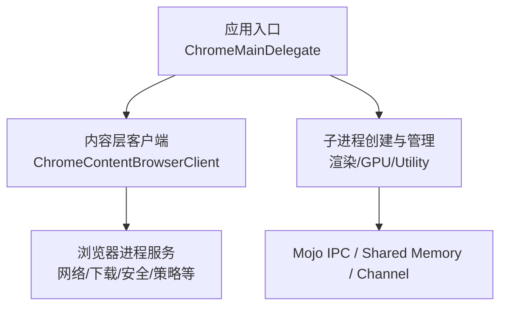
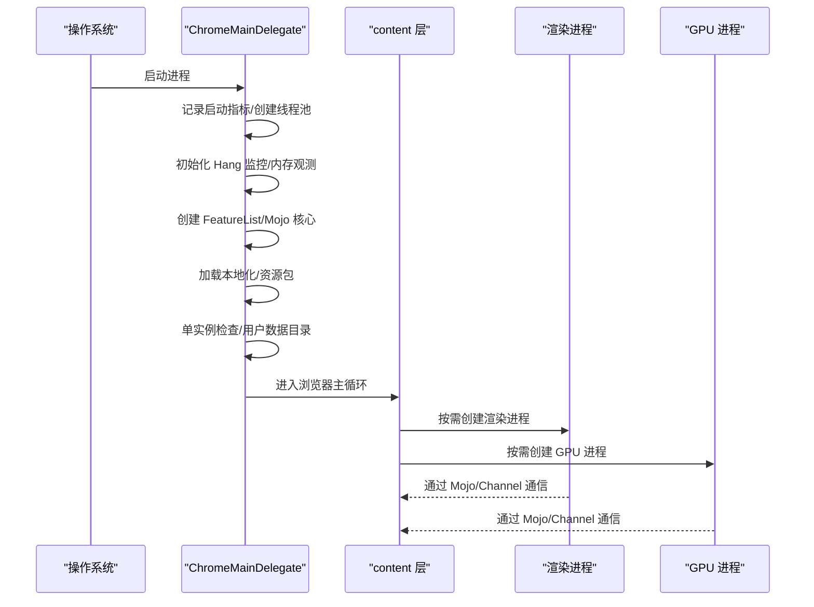
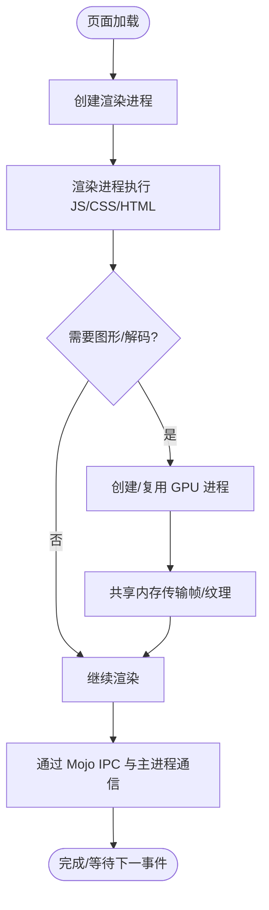
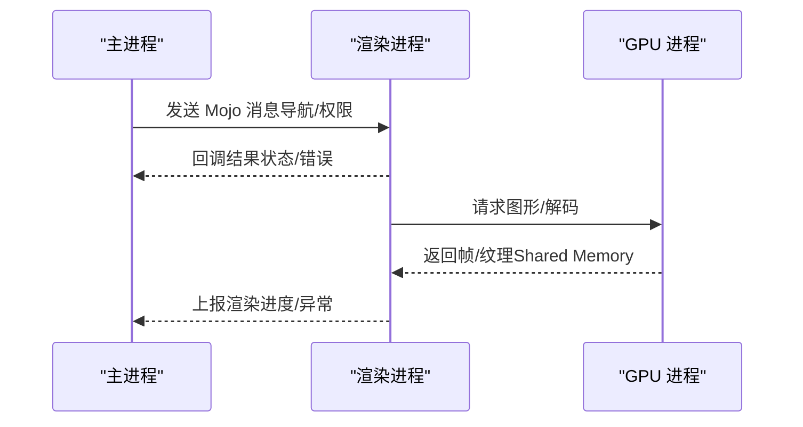
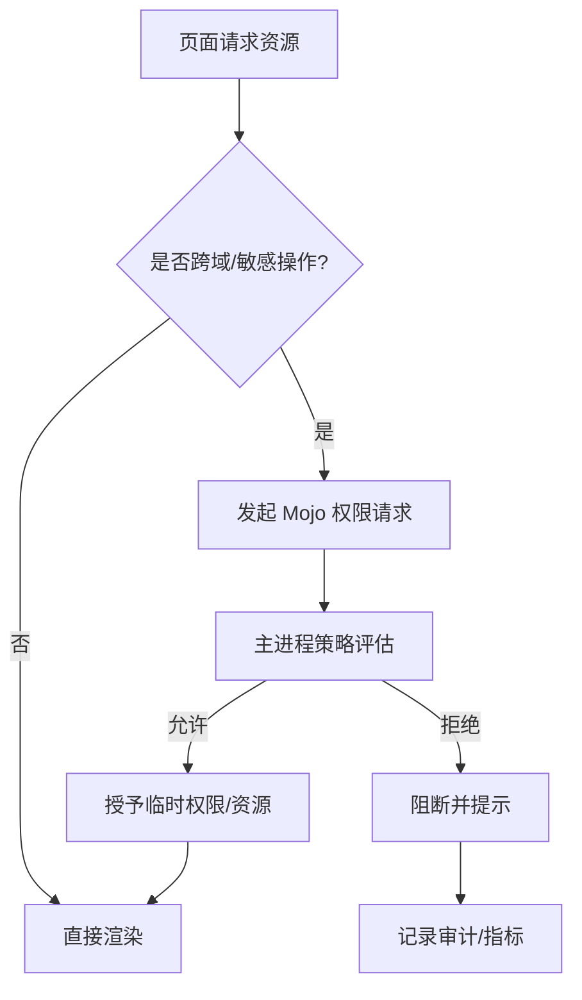
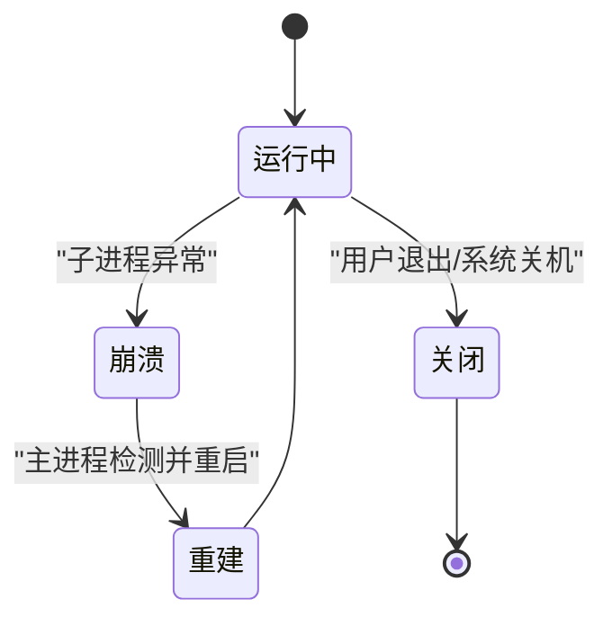
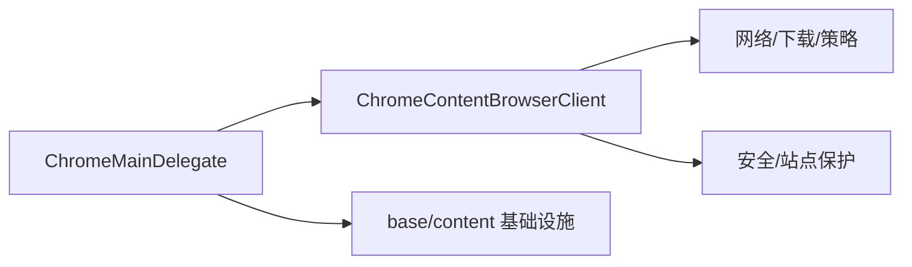

# 整体架构

<cite>
**本文引用的文件**
- [chrome_main_delegate.cc](file://src/chrome/app/chrome_main_delegate.cc)
- [chrome_content_browser_client.cc](file://src/chrome/browser/chrome_content_browser_client.cc)
</cite>

## 目录
1. [简介](#简介)
2. [项目结构](#项目结构)
3. [核心组件](#核心组件)
4. [架构总览](#架构总览)
5. [详细组件分析](#详细组件分析)
6. [依赖关系分析](#依赖关系分析)
7. [性能考量](#性能考量)
8. [故障排查指南](#故障排查指南)
9. [结论](#结论)
10. [附录](#附录)

## 简介
本文件面向 MCloud Browser（基于 Chromium）的整体架构，聚焦多进程模型、启动流程、进程间通信、内存隔离与安全沙箱、以及生命周期与崩溃恢复。文档以代码级事实为依据，结合架构图表帮助开发者快速理解主进程、渲染进程、GPU 进程的职责边界与数据流，并给出可操作的排障建议。

## 项目结构
MCloud Browser 在 Chromium 基础上进行品牌化与功能增强，关键入口位于 chrome/app 层，浏览器进程初始化与内容层交互集中在 chrome/browser 层。本次文档重点围绕以下两类文件：
- 应用启动与委托：ChromeMainDelegate，负责早期初始化、单实例、特性列表、Mojo 初始化、日志/追踪等。
- 内容客户端：ChromeContentBrowserClient，作为浏览器进程与 content 层的桥接点，承载大量浏览器侧策略与集成。



图表来源
- [chrome_main_delegate.cc:802-949](file://src/chrome/app/chrome_main_delegate.cc#L802-L949)
- [chrome_content_browser_client.cc:1-200](file://src/chrome/browser/chrome_content_browser_client.cc#L1-L200)

章节来源
- [chrome_main_delegate.cc:802-949](file://src/chrome/app/chrome_main_delegate.cc#L802-L949)
- [chrome_content_browser_client.cc:1-200](file://src/chrome/browser/chrome_content_browser_client.cc#L1-L200)

## 核心组件
- ChromeMainDelegate（应用委托）
  - 负责早期初始化、单实例控制、用户数据目录、特性列表、Mojo 核心初始化、日志/追踪、Hang 监控、资源包加载、平台相关设置等。
  - 提供 PostEarlyInitialization、BasicStartupComplete、CommonEarlyInitialization、SetupTracing、CreateThreadPool 等关键阶段钩子。
- ChromeContentBrowserClient（内容浏览器客户端）
  - 作为浏览器进程与 content 层的对接点，注册导航节流器、下载管理器、网络代理、WebUI、设备能力、策略、预取/预渲染等扩展点。
  - 承载浏览器侧策略注入、安全拦截、媒体采集、翻译、任务管理、站点保护等能力。

章节来源
- [chrome_main_delegate.cc:802-949](file://src/chrome/app/chrome_main_delegate.cc#L802-L949)
- [chrome_main_delegate.cc:1107-1200](file://src/chrome/app/chrome_main_delegate.cc#L1107-L1200)
- [chrome_content_browser_client.cc:1-200](file://src/chrome/browser/chrome_content_browser_client.cc#L1-L200)

## 架构总览
MCloud Browser 采用 Chromium 经典的多进程架构：
- 主进程（Browser Process）：负责窗口管理、标签页调度、下载、网络上下文、策略、安全、存储等。
- 渲染进程（Renderer Process）：每个标签页或同源组共享，执行网页 JS/CSS/HTML，受沙箱限制。
- GPU 进程（GPU Process）：图形加速、解码、合成等重计算任务，降低主进程压力。
- Utility 进程（Utility Process）：执行受限的辅助任务（如 PDF、字体、加密等）。

进程间通信机制
- Mojo IPC：跨进程接口定义与调用，类型安全、高性能。
- Shared Memory：大对象零拷贝传输（如图片、视频帧）。
- Channel：底层通道抽象，承载 Mojo/IPC 的数据面。

```mermaid
graph TB
subgraph "主进程"
BP["浏览器进程"]
Svc["系统服务<br/>网络/存储/策略"]
end
subgraph "子进程"
RP["渲染进程"]
GP["GPU 进程"]
UP["Utility 进程"]
end
BP --> |Mojo IPC / Channel| RP
BP --> |Mojo IPC / Channel| GP
BP --> |Mojo IPC / Channel| UP
RP <- --> |Shared Memory| GP
RP <- --> |Shared Memory| UP
```

图表来源
- [chrome_main_delegate.cc:802-949](file://src/chrome/app/chrome_main_delegate.cc#L802-L949)
- [chrome_content_browser_client.cc:1-200](file://src/chrome/browser/chrome_content_browser_client.cc#L1-L200)

## 详细组件分析

### 启动流程：从 ChromeMainDelegate 到子进程创建
- 早期初始化
  - 记录启动指标、线程池创建、Hang 监控、内存观测、特性列表创建、Mojo 核心初始化、本地化与资源包加载。
- 单实例与用户数据目录
  - 获取/校验用户数据目录；若已存在实例则通知现有进程并退出当前进程。
- 基本启动完成
  - 处理版本/帮助/credits 等开关；验证远程调试管道；确保浏览器进程不在沙箱中运行；设置 Crashpad/V8 崩溃支持；配置追踪采样器。
- 子进程创建
  - 由 content 层根据页面需求创建渲染/GPU/Utility 进程，并通过 Mojo/Channel 建立通信。



图表来源
- [chrome_main_delegate.cc:802-949](file://src/chrome/app/chrome_main_delegate.cc#L802-L949)
- [chrome_main_delegate.cc:1107-1200](file://src/chrome/app/chrome_main_delegate.cc#L1107-L1200)

章节来源
- [chrome_main_delegate.cc:802-949](file://src/chrome/app/chrome_main_delegate.cc#L802-L949)
- [chrome_main_delegate.cc:1107-1200](file://src/chrome/app/chrome_main_delegate.cc#L1107-L1200)

### 进程职责划分与数据流
- 主进程
  - 管理 UI、标签页、下载、网络上下文、策略、安全、存储；协调子进程生命周期。
- 渲染进程
  - 执行网页脚本与布局绘制；受沙箱限制；通过 Mojo 向主进程请求权限或资源。
- GPU 进程
  - 承担图形加速、解码、合成；与渲染进程共享内存以提升性能。
- Utility 进程
  - 执行受限任务（PDF、字体、加密），最小权限原则。



图表来源
- [chrome_main_delegate.cc:802-949](file://src/chrome/app/chrome_main_delegate.cc#L802-L949)
- [chrome_content_browser_client.cc:1-200](file://src/chrome/browser/chrome_content_browser_client.cc#L1-L200)

章节来源
- [chrome_main_delegate.cc:802-949](file://src/chrome/app/chrome_main_delegate.cc#L802-L949)
- [chrome_content_browser_client.cc:1-200](file://src/chrome/browser/chrome_content_browser_client.cc#L1-L200)

### 进程间通信机制（Mojo IPC、Shared Memory、Channel）
- Mojo IPC
  - 类型安全的跨进程接口，用于浏览器与子进程之间的命令/数据交换。
- Shared Memory
  - 大对象零拷贝传输，常用于图像帧、视频帧、音频缓冲。
- Channel
  - 底层通信通道，承载 Mojo/IPC 的数据面，屏蔽平台差异。



图表来源
- [chrome_main_delegate.cc:802-949](file://src/chrome/app/chrome_main_delegate.cc#L802-L949)
- [chrome_content_browser_client.cc:1-200](file://src/chrome/browser/chrome_content_browser_client.cc#L1-L200)

章节来源
- [chrome_main_delegate.cc:802-949](file://src/chrome/app/chrome_main_delegate.cc#L802-L949)
- [chrome_content_browser_client.cc:1-200](file://src/chrome/browser/chrome_content_browser_client.cc#L1-L200)

### 内存隔离与安全沙箱
- 渲染进程沙箱
  - 限制文件系统、网络、设备访问，防止恶意页面破坏系统或其他标签页。
- 进程隔离
  - 不同站点/源尽量隔离到独立进程，减少攻击面。
- 权限模型
  - 通过 Mojo 接口显式申请权限，主进程统一决策。



图表来源
- [chrome_content_browser_client.cc:1-200](file://src/chrome/browser/chrome_content_browser_client.cc#L1-L200)

章节来源
- [chrome_content_browser_client.cc:1-200](file://src/chrome/browser/chrome_content_browser_client.cc#L1-L200)

### 进程生命周期管理与崩溃恢复
- 生命周期
  - 主进程负责创建/销毁子进程；子进程异常退出时由主进程检测并重建。
- 崩溃收集
  - 启用 Crashpad/V8 崩溃支持，记录堆栈与转储，便于定位问题。
- Hang 监控
  - 各进程类型均启用 HangWatcher，长时间无响应时触发告警/崩溃。



图表来源
- [chrome_main_delegate.cc:1107-1200](file://src/chrome/app/chrome_main_delegate.cc#L1107-L1200)

章节来源
- [chrome_main_delegate.cc:1107-1200](file://src/chrome/app/chrome_main_delegate.cc#L1107-L1200)

## 依赖关系分析
- ChromeMainDelegate 依赖 content 层与 base 基础设施，负责早期初始化与平台适配。
- ChromeContentBrowserClient 依赖浏览器侧服务（网络、下载、策略、安全等），将业务逻辑注入 content 生命周期。
- 两者共同构成“应用层”与“内容层”的桥梁，驱动多进程协作。



图表来源
- [chrome_main_delegate.cc:802-949](file://src/chrome/app/chrome_main_delegate.cc#L802-L949)
- [chrome_content_browser_client.cc:1-200](file://src/chrome/browser/chrome_content_browser_client.cc#L1-L200)

章节来源
- [chrome_main_delegate.cc:802-949](file://src/chrome/app/chrome_main_delegate.cc#L802-L949)
- [chrome_content_browser_client.cc:1-200](file://src/chrome/browser/chrome_content_browser_client.cc#L1-L200)

## 性能考量
- 启动优化
  - 尽早创建线程池与内存观测，减少冷启动开销；按需加载资源包与特性。
- 渲染性能
  - 使用 GPU 进程分担图形/解码；通过共享内存减少拷贝。
- 资源管理
  - 合理分配 OOM Score（Linux/ChromeOS），避免关键进程被误杀。
- 追踪与诊断
  - 启用 TracingSamplerProfiler，采集 CPU/内存热点，辅助性能调优。

[本节为通用指导，不直接分析具体文件]

## 故障排查指南
- 启动失败
  - 检查用户数据目录是否有效；确认未以沙箱模式运行浏览器进程；验证远程调试管道是否打开。
- 子进程崩溃
  - 查看 Crashpad 转储；检查 Hang 监控日志；确认 Mojo 接口调用是否越权。
- 渲染卡顿
  - 分析 GPU 进程负载；检查共享内存传输是否频繁；确认是否存在阻塞的主线程任务。
- 权限问题
  - 审查 ChromeContentBrowserClient 中的策略与节流器；确认站点保护与隐私设置。

章节来源
- [chrome_main_delegate.cc:1107-1200](file://src/chrome/app/chrome_main_delegate.cc#L1107-L1200)
- [chrome_content_browser_client.cc:1-200](file://src/chrome/browser/chrome_content_browser_client.cc#L1-L200)

## 结论
MCloud Browser 基于 Chromium 的多进程架构，通过 ChromeMainDelegate 与 ChromeContentBrowserClient 将应用层与内容层解耦，实现清晰的职责划分与高效的进程间通信。借助沙箱隔离、权限模型与崩溃恢复机制，保障了稳定性与安全性。开发者可依据本文档的流程图与组件分析，快速定位问题并进行性能优化。

## 附录
- 术语
  - Mojo IPC：Chromium 的跨进程通信框架，类型安全、高性能。
  - Shared Memory：共享内存，用于大对象零拷贝传输。
  - Channel：底层通信通道，承载 IPC 数据面。
  - 沙箱：限制进程能力的机制，提升安全性。
- 参考
  - 启动流程与初始化：参见 ChromeMainDelegate 的关键方法。
  - 内容层集成：参见 ChromeContentBrowserClient 的扩展点。

[本节为补充说明，不直接分析具体文件]